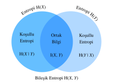

# Bilgi Teorisi
:label:`sec_information_theory`

Evren bilgi ile dolup taşıyor. Bilgi, disiplinler arası açıklıklarda ortak bir dil sağlar: Shakespeare'in Sone'sinden Cornell ArXiv'deki araştırmacıların makalesine, Van Gogh'un eseri Yıldızlı Gece'den Beethoven'in 5. Senfonisi'ne, ilk programlama dili Plankalkül'den son teknoloji makine öğrenmesi algoritmalarına. Biçimi ne olursa olsun, her şey bilgi teorisinin kurallarını izlemelidir. Bilgi teorisi ile, farklı sinyallerde ne kadar bilgi bulunduğunu ölçebilir ve karşılaştırabiliriz. Bu bölümde, bilgi teorisinin temel kavramlarını ve bilgi teorisinin makine öğrenmesindeki uygulamalarını inceleyeceğiz.

Başlamadan önce, makine öğrenmesi ve bilgi teorisi arasındaki ilişkiyi özetleyelim. Makine öğrenmesi, verilerden ilginç sinyaller çıkarmayı ve kritik tahminlerde bulunmayı amaçlar. Öte yandan, bilgi teorisi, bilgiyi kodlama, kod çözme, iletme ve üstünde oynama yapmayı inceler. Sonuç olarak, bilgi teorisi, makine öğrenmesi sistemlerinde bilgi işlemeyi tartışmak için temel bir dil sağlar. Örneğin, birçok makine öğrenmesi uygulaması çapraz entropi kaybını şurada açıklandığı gibi kullanır :numref:`sec_softmax`. Bu kayıp, doğrudan bilgi teorisel değerlendirmelerinden türetilebilir.

## Bilgi
 
Bilgi teorisinin "ruhu" ile başlayalım: Bilgi. *Bilgi*, bir veya daha fazla kodlama biçimli belirli bir dizi ile kodlanabilir. Kendimizi bir bilgi kavramını tanımlamaya çalışmakla görevlendirdiğimizi varsayalım. Başlangıç ​​noktamız ne olabilir?

Aşağıdaki düşünce deneyini düşünün. Kart destesi olan bir arkadaşımız var. Desteyi karıştıracaklar, bazı kartları ters çevirecekler ve bize kartlar hakkında açıklamalar yapacaklar. Her ifadenin bilgi içeriğini değerlendirmeye çalışacağız.

Önce, bir kartı çevirip bize "Bir kart görüyorum" diyorlar. Bu bize hiçbir bilgi sağlamaz. Durumun bu olduğundan zaten emindik, bu yüzden bilginin sıfır olduğu umuyoruz.

Sonra bir kartı çevirip "Bir kalp görüyorum" diyorlar. Bu bize biraz bilgi sağlar, ancak gerçekte, her biri eşit olasılıkla mümkün olan yalnızca $4$ farklı takım vardır, bu nedenle bu sonuca şaşırmadık. Bilginin ölçüsü ne olursa olsun, bu olayın düşük bilgi içeriğine sahip olmasını umuyoruz.

Sonra, bir kartı çevirip "Bu maça $3$" diyorlar. Bu daha fazla bilgidir. Gerçekten de $52$ eşit olasılıklı sonuçlar vardı ve arkadaşımız bize bunun hangisi olduğunu söyledi. Bu orta miktarda bilgi olmalıdır.

Bunu mantıksal uç noktaya götürelim. Sonunda destedeki her kartı çevirdiklerini ve karışık destenin tüm dizisini okuduklarını varsayalım. Destede $52!$ farklı dizilim var, gene hepsi aynı olasılığa sahip, bu yüzden hangisinin olduğunu bilmek için çok fazla bilgiye ihtiyacımız var.

Geliştirdiğimiz herhangi bir bilgi kavramı bu sezgiye uygun olmalıdır. Aslında, sonraki bölümlerde bu olayların $0\text{ bit}$, $2\text{ bit}$, $~5.7\text{ bit}$, and $~225.6\text{ bit}$ bilgiye sahip olduğunu nasıl hesaplayacağımızı öğreneceğiz.

Bu düşünce deneylerini okursak, doğal bir fikir görürüz. Başlangıç noktası olarak, bilgiyi önemsemekten ziyade, bilginin olayın sürpriz derecesini veya soyut olasılığını temsil ettiği fikrini geliştirebiliriz. Örneğin, alışılmadık bir olayı tanımlamak istiyorsak, çok fazla bilgiye ihtiyacımız var. Genel (sıradan) bir olay için fazla bilgiye ihtiyacımız olmayabilir.

1948'de Claude E. Shannon bilgi teorisini oluşturan *İletişimin Bir Matematiksel Teorisi (A Mathematical Theory of Communication)* çalışmasını yayınladı :cite:`Shannon.1948`. Shannon makalesinde ilk kez bilgi entropisi kavramını tanıttı. Yolculuğumuza buradan başlayacağız.

### Öz-Bilgi

Bilgi bir olayın soyut olasılığını içerdiğinden, olasılığı bit adeti ile nasıl eşleştirebiliriz? Shannon, başlangıçta John Tukey tarafından oluşturulmuş olan *bit* terimini bilgi birimi olarak tanıttı. Öyleyse "bit" nedir ve bilgiyi ölçmek için neden onu kullanıyoruz? Tarihsel olarak, antika bir verici yalnızca iki tür kod gönderebilir veya alabilir: $0$ ve $1$. Aslında, ikili kodlama hala tüm modern dijital bilgisayarlarda yaygın olarak kullanılmaktadır. Bu şekilde, herhangi bir bilgi bir dizi $0$ ve $1$ ile kodlanır. Ve bu nedenle, $n$ uzunluğundaki bir dizi ikili rakam, $n$ bit bilgi içerir.

Şimdi, herhangi bir kod dizisi için, her $0$ veya $1$'in $\frac{1}{2}$ olasılıkla gerçekleştiğini varsayalım. Bu nedenle, $n$ uzunluğunda bir dizi koda sahip bir $X$ olayı, $\frac{1}{2^n}$ olasılıkla gerçekleşir. Aynı zamanda, daha önce bahsettiğimiz gibi, bu seri $n$ bit bilgi içerir. Öyleyse, $p$ olasılığını bit sayısına aktarabilen bir matematik fonksiyonuna genelleme yapabilir miyiz? Shannon, *öz-bilgi*yi tanımlayarak cevabı verdi,

$$I(X) = - \log_2 (p),$$

yani bu $X$ etkinliği için aldığımız bilginin *bitleri* olarak. Bu bölümde her zaman 2 tabanlı logaritma kullanacağımızı unutmayın. Basitlik adına, bu bölümün geri kalanı logaritma gösteriminde 2 altindisini göstermeyecektir, yani $\log(.)$ her zaman $\log_2(.)$ anlamına gelir. Örneğin, "0010" kodu şu öz-bilgiyi içerir:

$$I(\text{"0010"}) = - \log (p(\text{"0010"})) = - \log \left( \frac{1}{2^4} \right) = 4 \text{ bits}.$$

Öz-bilgiyi aşağıda gösterildiği gibi hesaplayabiliriz. Ondan önce, önce bu bölümdeki gerekli tüm paketleri içe aktaralım.

```{.python .input}
from mxnet import np
from mxnet.metric import NegativeLogLikelihood
from mxnet.ndarray import nansum
import random

def self_information(p):
    return -np.log2(p)

self_information(1 / 64)
```

```{.python .input}
#@tab pytorch
import torch
from torch.nn import NLLLoss

def nansum(x):
    # Define nansum, as pytorch doesn't offer it inbuilt.
    return x[~torch.isnan(x)].sum()

def self_information(p):
    return -torch.log2(torch.tensor(p)).item()

self_information(1 / 64)
```

```{.python .input}
#@tab tensorflow
import tensorflow as tf

def log2(x):
    return tf.math.log(x) / tf.math.log(2.)

def nansum(x):
    return tf.reduce_sum(tf.where(tf.math.is_nan(
        x), tf.zeros_like(x), x), axis=-1)

def self_information(p):
    return -log2(tf.constant(p)).numpy()

self_information(1 / 64)
```

## Entropi

Öz-bilgi yalnızca tek bir ayrık olayın bilgisini ölçtüğü için, ayrık veya sürekli dağılımın herhangi bir rastgele değişkeni için daha genelleştirilmiş bir ölçüme ihtiyacımız var.

### Motive Edici Entropi

Ne istediğimiz konusunda belirli olmaya çalışalım. Bu, *Shannon entropisinin aksiyomları* olarak bilinenlerin gayri resmi bir ifadesi olacaktır. Aşağıdaki sağduyu beyanları topluluğunun bizi benzersiz bir bilgi tanımına zorladığı ortaya çıkacaktır. Bu aksiyomların usule uygun bir versiyonu, diğer birçoklarıyla birlikte şu adreste bulunabilir :cite:`Csiszar.2008`.

1. Rastgele bir değişkeni gözlemleyerek kazandığımız bilgi, elemanlar dediğimiz şeye veya olasılığı sıfır olan ek elemanların varlığına bağlı değildir.
2. İki rastgele değişkeni gözlemleyerek elde ettiğimiz bilgi, onları ayrı ayrı gözlemleyerek elde ettiğimiz bilgilerin toplamından fazlası değildir. Bağımsız iseler, o zaman tam toplamdır.
3. (Neredeyse) Kesin olayları gözlemlerken kazanılan bilgi (neredeyse) sıfırdır.

Bu gerçeğin kanıtlanması kitabımızın kapsamı dışında olduğu halde, bunun entropinin alması gereken şekli benzersiz bir şekilde belirlediğini bilmek önemlidir. Bunların izin verdiği tek belirsizlik, daha önce gördüğümüz seçimi yaparak normalize edilen temel birimlerin seçimidir; tek bir adil yazı tura ile sağlanan bilginin bir bit olması gibi.

### Tanım

Olasılık yoğunluk fonksiyonu (pdf/oyf) veya olasılık kütle fonksiyonu (pmf/okf) $p(x)$ ile olasılık dağılımı $P$'yi takip eden rastgele değişken $X$ için, beklenen bilgi miktarını *entropi* (veya *Shannon entropisi*) ile ölçebiliriz:

$$H(X) = - E_{x \sim P} [\log p(x)].$$
:eqlabel:`eq_ent_def`

Belirleyici olmak gerekirse, $X$ ayrıksa, $$H(X)= - \sum_i p_i \log p_i \text{, burada } p_i = P(X_i)$$.

Aksi takdirde, $X$ sürekli ise, entropiyi *diferansiyel (farksal) entropi* olarak da adlandırırız.

$$H(X) = - \int_x p(x) \log p(x) \; dx.$$

Entropiyi aşağıdaki gibi tanımlayabiliriz.

```{.python .input}
def entropy(p):
    entropy = - p * np.log2(p)
    # `nansum` işlemcisi, nan (not a number - sayı olmayan) olmayan sayıyı toplayacaktır
    out = nansum(entropy.as_nd_ndarray())
    return out

entropy(np.array([0.1, 0.5, 0.1, 0.3]))
```

```{.python .input}
#@tab pytorch
def entropy(p):
    entropy = - p * torch.log2(p)
    # `nansum` işlemcisi, nan (not a number - sayı olmayan) olmayan sayıyı toplayacaktır
    out = nansum(entropy)
    return out

entropy(torch.tensor([0.1, 0.5, 0.1, 0.3]))
```

```{.python .input}
#@tab tensorflow
def entropy(p):
    return nansum(- p * log2(p))

entropy(tf.constant([0.1, 0.5, 0.1, 0.3]))
```

### Yorumlama

Merak ediyor olabilirsiniz: Entropi tanımında :eqref:`eq_ent_def`, neden negatif bir logaritma ortalaması kullanıyoruz? Burada bazı sezgileri verelim.

İlk olarak, neden *logaritma* işlevi $\log$ kullanıyoruz? $p(x) = f_1(x) f_2(x) \ldots, f_n(x)$ olduğunu varsayalım, burada her bileşen işlevi $f_i(x)$ birbirinden bağımsızdır. Bu, her bir $f_i(x)$'in $p(x)$'den elde edilen toplam bilgiye bağımsız olarak katkıda bulunduğu anlamına gelir. Yukarıda tartışıldığı gibi, entropi formülünün bağımsız rastgele değişkenler üzerinde toplamsal olmasını istiyoruz. Neyse ki, $\log$ doğal olarak olasılık dağılımlarının çarpımını bireysel terimlerin toplamına dönüştürebilir.

Sonra, neden *negatif* $\log$ kullanıyoruz? Sezgisel olarak, alışılmadık bir vakadan genellikle sıradan olandan daha fazla bilgi aldığımız için, daha sık olaylar, daha az yaygın olaylardan daha az bilgi içermelidir. Bununla birlikte, $\log$ olasılıklarla birlikte monoton bir şekilde artıyor ve aslında $[0, 1]$ içindeki tüm değerler için negatif. Olayların olasılığı ile entropileri arasında monoton olarak azalan bir ilişki kurmamız gerekir ki bu ideal olarak her zaman pozitif olacaktır (çünkü gözlemlediğimiz hiçbir şey bizi bildiklerimizi unutmaya zorlamamalıdır). Bu nedenle, $\log$ fonksiyonunun önüne bir eksi işareti ekliyoruz.

Son olarak, *beklenti (ortalama)* işlevi nereden geliyor? Rastgele bir değişken olan $X'i$ düşünün. Öz-bilgiyi ($-\log(p)$), belirli bir sonucu gördüğümüzde sahip olduğumuz *sürpriz* miktarı olarak yorumlayabiliriz. Nitekim, olasılık sıfıra yaklaştıkça sürpriz sonsuz olur. Benzer şekilde, entropiyi $X$'i gözlemlemekten kaynaklanan ortalama sürpriz miktarı olarak yorumlayabiliriz. Örneğin, bir slot makinesi sisteminin ${p_1, \ldots, p_k}$ olasılıklarıyla ${s_1, \ldots, s_k}$ sembollerini istatistiksel olarak bağımsız yaydığını düşünün. O zaman bu sistemin entropisi, her bir çıktının gözlemlenmesinden elde edilen ortalama öz-bilgiye eşittir, yani,

$$H(S) = \sum_i {p_i \cdot I(s_i)} = - \sum_i {p_i \cdot \log p_i}.$$

### Entropinin Özellikleri

Yukarıdaki örnekler ve yorumlarla, entropinin :eqref:`eq_ent_def` şu özelliklerini türetebiliriz. Burada, $X$'i bir olay ve $P$'yi $X$'in olasılık dağılımı olarak adlandırıyoruz.

* Tüm ayrık $X$ değerleri için $H(X) \geq 0$'dır (sürekli $X$ için entropi negatif olabilir).

* Bir o.y.f veya o.k.f. $p(x)$ ile $X \sim P$ ise ve o.y.f veya o.k.f. $q(x)$'ya sahip yeni bir olasılık dağılımı $Q$ ile $P$'yi tahmin etmeye çalışıyoruz,  o zaman $$H(X) = - E_{x \sim P} [\log p(x)] \leq - E_{x \sim P} [\log q(x)], \text {eşitlikle ancak ve ancak eğer } P = Q.$$ Alternatif olarak, $H(X)$, $P$'den çekilen sembolleri kodlamak için gereken ortalama bit sayısının alt sınırını verir.

* $X \sim P$ ise, $x$ tüm olası sonuçlar arasında eşit olarak yayılırsa maksimum bilgi miktarını iletir. Özel olarak, $P$  $k$-sınıflı ayrık olasılık dağılımı $\{p_1, \ldots, p_k \}$ ise, o halde $$H(X) \leq \log(k), \text {eşitlikle ancak ve ancak eğer } p_i = \frac{1}{k}, \forall i.$$ Eğer $P$ sürekli bir rastgele değişkense, öykü çok daha karmaşık hale gelir. Bununla birlikte, ek olarak $P$'nin sonlu bir aralıkta (tüm değerler $0$ ile $1$ arasında) desteklenmesini zorlarsak, bu aralıkta tekdüze dağılım varsa $P$ en yüksek entropiye sahip olur.

## Ortak Bilgi

Daha önce tek bir rastgele değişken $X$ entropisini tanımlamıştık, bir çift rastgele değişken $(X, Y)$ entropisine ne dersiniz? Bu teknikleri şu soru tipini yanıtlamaya çalışırken düşünebiliriz: "$X$ ve $Y$'de her biri ayrı ayrı olması bir arada olmalarıyla karşılaştırıldığında ne tür bilgi bulunur? Gereksiz bilgi var mı, yoksa hepsi eşsiz mi?"

Aşağıdaki tartışma için, her zaman $(X, Y)$'yi, bir o.y.f veya o.k.f. olan $p_{X, Y}(x, y)$ ile bileşik olasılık dağılımı $P$'yi izleyen bir çift rastgele değişken olarak kullanıyoruz, aynı zamanda da $X$ ve $Y$ sırasıyla $p_X(x)$ ve $p_Y(y)$ olasılık dağılımlarını takip eder.

### Bileşik Entropi 

Tek bir rastgele değişkenin entropisine benzer şekilde :eqref:`eq_ent_def`, rastgele değişken çiftinin, $(X, Y)$, *bileşik entropisini* $H (X, Y)$ olarak tanımlarız.

$$H(X, Y) = −E_{(x, y) \sim P} [\log p_{X, Y}(x, y)]. $$
:eqlabel:`eq_joint_ent_def`

Tam olarak, bir yandan $(X, Y)$ bir çift ayrık rastgele değişkense, o zaman

$$H(X, Y) = - \sum_{x} \sum_{y} p_{X, Y}(x, y) \log p_{X, Y}(x, y).$$

Öte yandan, $(X, Y)$ bir çift sürekli rastgele değişken ise, o zaman *diferansiyel (farksal) bileşik entropiyi* tanımlarız. 

$$H(X, Y) = - \int_{x, y} p_{X, Y}(x, y) \ \log p_{X, Y}(x, y) \;dx \;dy.$$

Şunu düşünebiliriz :eqref:`eq_joint_ent_def` bize rastgele değişkenler çiftindeki toplam rastgeleliği anlatıyor. Bir çift uç vaka olarak, eğer $X = Y$ iki özdeş rastgele değişken ise, o zaman çiftteki bilgi tam olarak bir tanedeki bilgidir ve $H(X, Y) = H(X) = H(Y)$'dir. Diğer uçta, $X$ ve $Y$ bağımsızsa, $H(X, Y) = H(X) + H(Y)$'dir. Aslında, her zaman bir çift rasgele değişkenin içerdiği bilginin her iki rasgele değişkenin entropisinden daha küçük ve her ikisinin toplamından daha fazla olmadığını bilecegiz.

$$
H(X), H(Y) \le H(X, Y) \le H(X) + H(Y).
$$

Ortak entropiyi en başından uygulayalım.

```{.python .input}
def joint_entropy(p_xy):
    joint_ent = -p_xy * np.log2(p_xy)
    # `nansum` işlemcisi, nan (not a number - sayı olmayan) olmayan sayıyı toplayacaktır
    out = nansum(joint_ent.as_nd_ndarray())
    return out

joint_entropy(np.array([[0.1, 0.5], [0.1, 0.3]]))
```

```{.python .input}
#@tab pytorch
def joint_entropy(p_xy):
    joint_ent = -p_xy * torch.log2(p_xy)
    # `nansum` işlemcisi, nan (not a number - sayı olmayan) olmayan sayıyı toplayacaktır
    out = nansum(joint_ent)
    return out

joint_entropy(torch.tensor([[0.1, 0.5], [0.1, 0.3]]))
```

```{.python .input}
#@tab tensorflow
def joint_entropy(p_xy):
    joint_ent = -p_xy * log2(p_xy)
    # `nansum` işlemcisi, nan (not a number - sayı olmayan) olmayan sayıyı toplayacaktır
    out = nansum(joint_ent)
    return out

joint_entropy(tf.constant([[0.1, 0.5], [0.1, 0.3]]))
```

Bunun öncekiyle aynı *kod* olduğuna dikkat edin, ancak şimdi onu iki rastgele değişkenin bileşik dağılımı üzerinde çalışırken farklı bir şekilde yorumluyoruz.

### Koşullu Entropi

Bileşik entropi bir çift rastgele değişkende bulunan bilgi miktarının üzerinde tanımlıdır. Bu yararlıdır, ancak çoğu zaman umursadığımız şey değildir. Makine öğrenmesinin ayarlarını düşünün. Bir imgenin piksel değerlerini tanımlayan rastgele değişken (veya rastgele değişkenlerin vektörü) olarak $X$'i ve sınıf etiketi olan rastgele değişken olarak $Y$'yi alalım. $X$ önemli bilgi içermelidir --- doğal bir imge karmaşık bir şeydir. Ancak, imge gösterildikten sonra $Y$ içindeki bilgi düşük olmalıdır. Aslında, bir rakamın imgesi, rakam okunaksız olmadıkça, hangi rakam olduğu hakkında bilgiyi zaten içermelidir. Bu nedenle, bilgi teorisi kelime dağarcığımızı genişletmeye devam etmek için, rastgele bir değişkenin diğerine koşullu bağlı olarak bilgi içeriği hakkında mantık yürütebilmeliyiz.

Olasılık teorisinde, değişkenler arasındaki ilişkiyi ölçmek için *koşullu olasılığın* tanımını gördük. Şimdi, *koşullu entropiyi*, $H(Y \mid X)$, benzer şekilde tanımlamak istiyoruz. Bunu şu şekilde yazabiliriz:

$$ H(Y \mid X) = - E_{(x, y) \sim P} [\log p(y \mid x)],$$
:eqlabel:`eq_cond_ent_def`

Burada $p(y \mid x) = \frac{p_{X, Y}(x, y)}{p_X(x)}$ koşullu olasılıktır. Özellikle, $(X, Y)$ bir çift ayrık rastgele değişken ise, o zaman

$$H(Y \mid X) = - \sum_{x} \sum_{y} p(x, y) \log p(y \mid x).$$

$(X, Y)$ bir çift sürekli rastgele değişkense, *diferansiyel koşullu entropi* benzer şekilde şöyle tanımlanır:

$$H(Y \mid X) = - \int_x \int_y p(x, y) \ \log p(y \mid x) \;dx \;dy.$$

Şimdi bunu sormak doğaldır, *koşullu entropi* $H(Y \mid X)$, $H(X)$ entropisi ve bileşik entropi $H(X, Y)$ ile nasıl ilişkilidir? Yukarıdaki tanımları kullanarak bunu net bir şekilde ifade edebiliriz:

$$H(Y \mid X) = H(X, Y) - H(X).$$

Bunun sezgisel bir yorumu vardır: $X$ verildiğinde ($H(Y \mid X)$) $Y$'deki bilgi, hem $X$ hem de $Y$ ($H(X, Y)$) birlikteyken olan bilgi eksi $X$ içinde zaten bulunan bilgidir. Bu bize $Y$'de olup da aynı zamanda $X$ ile temsil edilmeyen bilgiyi verir.

Şimdi, koşullu entropiyi, :eqref:`eq_cond_ent_def`, sıfırdan uygulayalım.

```{.python .input}
def conditional_entropy(p_xy, p_x):
    p_y_given_x = p_xy/p_x
    cond_ent = -p_xy * np.log2(p_y_given_x)
    # `nansum` işlemcisi, nan (not a number - sayı olmayan) olmayan sayıyı toplayacaktır
    out = nansum(cond_ent.as_nd_ndarray())
    return out

conditional_entropy(np.array([[0.1, 0.5], [0.2, 0.3]]), np.array([0.2, 0.8]))
```

```{.python .input}
#@tab pytorch
def conditional_entropy(p_xy, p_x):
    p_y_given_x = p_xy/p_x
    cond_ent = -p_xy * torch.log2(p_y_given_x)
    # `nansum` işlemcisi, nan (not a number - sayı olmayan) olmayan sayıyı toplayacaktır
    out = nansum(cond_ent)
    return out

conditional_entropy(torch.tensor([[0.1, 0.5], [0.2, 0.3]]), 
                    torch.tensor([0.2, 0.8]))
```

```{.python .input}
#@tab tensorflow
def conditional_entropy(p_xy, p_x):
    p_y_given_x = p_xy/p_x
    cond_ent = -p_xy * log2(p_y_given_x)
    # `nansum` işlemcisi, nan (not a number - sayı olmayan) olmayan sayıyı toplayacaktır
    out = nansum(cond_ent)
    return out

conditional_entropy(tf.constant([[0.1, 0.5], [0.2, 0.3]]),
                    tf.constant([0.2, 0.8]))
```

### Karşılıklı Bilgi

Önceki rastgele değişkenler $(X, Y)$ ortamını göz önünde bulundurarak şunu merak edebilirsiniz: "Artık $Y$'nin ne kadar bilgi içerdiğini ancak $X$'de olmadığını bildiğimize göre, benzer şekilde $X$ ve $Y$'nin aralarında ne kadar bilginin paylaşıldığını da sorabilir miyiz?" Cevap, $(X, Y)$'nin *karşılıklı bilgisi* olacak ve bunu $I(X, Y)$ olarak yazacağız.

Doğrudan biçimsel (formal) tanıma dalmak yerine, önce karşılıklı bilgi için tamamen daha önce oluşturduğumuz terimlere dayalı bir ifade türetmeyi deneyerek sezgilerimizi uygulayalım. İki rastgele değişken arasında paylaşılan bilgiyi bulmak istiyoruz. Bunu yapmaya çalışmanın bir yolu, hem $X$ hem de $Y$ içerisindeki tüm bilgi ile başlamak ve sonra paylaşılmayan kısımları çıkarmaktır. Hem $X$ hem de $Y$ içerisindeki bilgi, $H(X, Y)$ olarak yazılır. Bundan, $X$ içinde yer alan ama $Y$ içinde yer almayan bilgileri ve $Y$ içinde yer alan ama $X$ içinde olmayan bilgileri çıkarmak istiyoruz. Önceki bölümde gördüğümüz gibi, bu sırasıyla $H(X \mid Y)$ ve $H(Y \mid X)$ ile verilmektedir. Bu nedenle, karşılıklı bilginin şöyle olması gerek:

$$
I(X, Y) = H(X, Y) - H(Y \mid X) − H(X \mid Y).
$$

Aslında bu, karşılıklı bilgi için geçerli bir tanımdır. Bu terimlerin tanımlarını genişletir ve bunları birleştirirsek, biraz cebir bunun aşağısı gibi olduğunu gösterir

$$I(X, Y) = E_{x} E_{y} \left\{ p_{X, Y}(x, y) \log\frac{p_{X, Y}(x, y)}{p_X(x) p_Y(y)} \right\}. $$
:eqlabel:`eq_mut_ent_def` 

Tüm bu ilişkileri görsel :numref:`fig_mutual_information` içinde özetleyebiliriz. Aşağıdaki ifadelerin de neden $I(X, Y)$ ile eşdeğer olduğunu görmek harika bir sezgi testidir.

* $H(X) − H(X \mid Y)$
* $H(Y) − H(Y \mid X)$
* $H(X) + H(Y) − H(X, Y)$


:label:`fig_mutual_information`

Karşılıklı bilgiyi :eqref:`eq_mut_ent_def` birçok yönden :numref:`sec_random_variables` içinde gördüğümüz korelasyon katsayısının ilkesel uzantısı olarak düşünebiliriz. Bu, yalnızca değişkenler arasındaki doğrusal ilişkileri değil, aynı zamanda herhangi bir türdeki iki rastgele değişken arasında paylaşılan maksimum bilgiyi de sorabilmemize olanak tanır.

Şimdi karşılıklı bilgiyi sıfırdan uygulayalım.

```{.python .input}
def mutual_information(p_xy, p_x, p_y):
    p = p_xy / (p_x * p_y)
    mutual = p_xy * np.log2(p)
    # `nansum` işlemcisi, nan (not a number - sayı olmayan) olmayan sayıyı toplayacaktır
    out = nansum(mutual.as_nd_ndarray())
    return out

mutual_information(np.array([[0.1, 0.5], [0.1, 0.3]]),
                   np.array([0.2, 0.8]), np.array([[0.75, 0.25]]))
```

```{.python .input}
#@tab pytorch
def mutual_information(p_xy, p_x, p_y):
    p = p_xy / (p_x * p_y)
    mutual = p_xy * torch.log2(p)
    # `nansum` işlemcisi, nan (not a number - sayı olmayan) olmayan sayıyı toplayacaktır
    out = nansum(mutual)
    return out

mutual_information(torch.tensor([[0.1, 0.5], [0.1, 0.3]]),
                   torch.tensor([0.2, 0.8]), torch.tensor([[0.75, 0.25]]))
```

```{.python .input}
#@tab tensorflow
def mutual_information(p_xy, p_x, p_y):
    p = p_xy / (p_x * p_y)
    mutual = p_xy * log2(p)
    # `nansum` işlemcisi, nan (not a number - sayı olmayan) olmayan sayıyı toplayacaktır
    out = nansum(mutual)
    return out

mutual_information(tf.constant([[0.1, 0.5], [0.1, 0.3]]),
                   tf.constant([0.2, 0.8]), tf.constant([[0.75, 0.25]]))
```

### Karşılıklı Bilginin Özellikleri

Karşılıklı bilginin tanımını, :eqref:`eq_mut_ent_def`, ezberlemek yerine sadece dikkate değer özelliklerini aklınızda tutmanız gerekir:

* Karşılıklı bilgi simetriktir (bakışımlı), yani $I(X, Y) = I(Y, X)$.
* Karşılıklı bilgi negatif olamaz, yani $I(X, Y) \geq 0$.
* $I(X, Y) = 0$ ancak ve ancak $X$ ve $Y$ bağımsızsa olur. Örneğin, $X$ ve $Y$ bağımsızsa, $Y$'yi bilmek $X$ hakkında herhangi bir bilgi vermez ve bunun tersi de geçerlidir, dolayısıyla karşılıklı bilgileri sıfırdır.
* Alternatif olarak, $X$, $Y$ değerinin ters çevrilebilir bir işleviyse, $Y$ ve $X$ tüm bilgiyi paylaşır ve $$I(X, Y) = H(Y) = H(X)$$.

### Noktasal Karşılıklı Bilgi

Bu bölümün başında entropi ile çalıştığımızda, $-\log (p_X(x))$'i belirli bir sonuca ne kadar *şaşırdığımızın* yorumlanması diye sunabildik. Karşılıklı bilgideki logaritmik terime benzer bir yorum verebiliriz, bu genellikle *noktasal karşılıklı bilgi (pointwise mutual information - pmi)* olarak anılır:

$$\mathrm{pmi}(x, y) = \log\frac{p_{X, Y}(x, y)}{p_X(x) p_Y(y)}.$$
:eqlabel:`eq_pmi_def`

:eqref:`eq_pmi_def` denklemi, bağımsız rastgele sonuçlar için beklentimizle karşılaştırıldığında $x$ ve $y$ sonuçlarının belirli kombinasyonunun ne kadar daha fazla veya daha az olası olduğunu ölçmek olarak düşünebiliriz. Büyük ve pozitifse, bu iki belirli sonuç, rastgele şansa kıyasla çok daha sık meydana gelir (*dikkat*: Payda $p_X(x) p_Y(y)$'dir ki bu iki sonucun bağımsız olma olasılığıdır), bilakis büyük ve negatifse, şans eseri beklediğimizden çok daha az gerçekleşen iki sonucu temsil eder.

Bu, karşılıklı bilgiyi, :eqref: `eq_mut_ent_def`,  bağımsız olsalardı bekleyeceğimiz şeyle karşılaştırıldığında iki sonucun birlikte gerçekleştiğini gördüğümüzde şaşırmamızın ortalama miktarı olarak yorumlamamıza olanak tanır.

### Karşılıklı Bilginin Uygulamaları

Karşılıklı bilgi, saf tanımında biraz soyut olabilir, peki makine öğrenmesi ile nasıl ilişkilidir? Doğal dil işlemede, en zor sorunlardan biri *belirsizlik çözümü* yani bir kelimenin anlamının bağlamdan anlaşılmaz olması sorunudur. Örneğin son zamanlarda bir haber manşetinde "Amazon yanıyor" yazıyordu. Amazon şirketinin bir binası yanıyor mu, yoksa Amazon yağmur ormanı mı yanıyor diye merak edebilirsiniz.

Bu durumda, karşılıklı bilgi bu belirsizliği çözmemize yardımcı olabilir. İlk olarak, e-ticaret, teknoloji ve çevrimiçi gibi, her birinin Amazon şirketi ile nispeten büyük karşılıklı bilgiye sahip olduğu kelime grubunu buluruz. İkinci olarak, her biri yağmur, orman ve tropikal gibi Amazon yağmur ormanlarıyla ilgili nispeten büyük karşılıklı bilgiye sahip başka bir kelime grubu buluruz. "Amazon"'un belirsizliğini ortadan kaldırmamız gerektiğinde, hangi grubun Amazon kelimesi bağlamında daha fazla yer aldığını karşılaştırabiliriz. Bu durumda haber ormanı tarif etmeye ve bağlamı netleştirmeye devam edecektir.

## Kullback–Leibler Iraksaması

:numref:`sec_linear-algebra` içinde tartıştığımız gibi, herhangi bir boyutluluğun uzaydaki iki nokta arasındaki mesafeyi ölçmek için normları kullanabiliriz. Olasılık dağılımları ile de benzer bir iş yapabilmek istiyoruz. Bunu yapmanın birçok yolu var, ancak bilgi teorisi en güzellerinden birini sağlıyor. Şimdi, iki dağılımın birbirine yakın olup olmadığını ölçmenin bir yolunu sağlayan *Kullback–Leibler (KL) ıraksamasını* inceleyeceğiz.

### Tanım

Olasılık dağılımı bir o.y.f veya o.k.f. olan $p(x)$ ile izleyen rastgele bir değişken $X$ verildiğinde, o.y.f veya o.k.f.'u $q(x)$ olan başka bir olasılık dağılımı $Q$ kullanarak $P$'yi tahmin ediyoruz. Böylece, $P$ ile $Q$ arasındaki *Kullback–Leibler (KL) ıraksaması* (veya *göreceli entropi*) hesaplanabilir:

$$D_{\mathrm{KL}}(P\|Q) = E_{x \sim P} \left[ \log \frac{p(x)}{q(x)} \right].$$
:eqlabel:`eq_kl_def`

Noktasal karşılıklı bilgide olduğu gibi :eqref:`eq_pmi_def`, logaritmik terimin yorumunu tekrar sağlayabiliriz: $-\log \frac{q(x)}{p(x)} = -\log(q(x)) - (-\log(p(x)))$, $x$'i $P$'nın altında, $Q$'da beklediğimizden çok daha fazla görürsek büyük ve pozitif, ve beklenenden çok daha az görürsek büyük ve negatif olacaktır. Bu şekilde, sonucu onu referans dağılımımızdan gözlemlememize oranla burada gözlemlediğimizde ne kadar şaşıracağımız, yani *göreceli* şaşkınlığımız, olarak yorumlayabiliriz.

Sıfırdan KL ıraksamasını uygulayalım.

```{.python .input}
def kl_divergence(p, q):
    kl = p * np.log2(p / q)
    out = nansum(kl.as_nd_ndarray())
    return out.abs().asscalar()
```

```{.python .input}
#@tab pytorch
def kl_divergence(p, q):
    kl = p * torch.log2(p / q)
    out = nansum(kl)
    return out.abs().item()
```

```{.python .input}
#@tab tensorflow
def kl_divergence(p, q):
    kl = p * log2(p / q)
    out = nansum(kl)
    return tf.abs(out).numpy()
```

### KL Iraksamasının Özellikleri

KL ıraksamasının bazı özelliklerine bir göz atalım :eqref:`eq_kl_def`.

* KL ıraksaması simetrik değildir, yani $$D_{\mathrm{KL}}(P\|Q) \neq D_{\mathrm{KL}}(Q\|P), \text{ if } P \neq Q.$$
* KL ıraksaması negatif değildir, yani $$D_{\mathrm{KL}}(P\|Q) \geq 0$$ Eşitliğin yalnızca $P = Q$ olduğunda geçerli olduğuna dikkat edin.
* $p(x)> 0$ ve $q(x) = 0$ şeklinde bir $x$ varsa, $D_{\mathrm{KL}}(P\|Q) = \infty$.
* KL ıraksaması ile karşılıklı bilgi arasında yakın bir ilişki vardır. :numref:`fig_mutual_information` içinde gösterilen ilişkinin yanı sıra, $I(X, Y)$'da aşağıdaki terimlerle sayısal olarak eşdeğerdir:
    1. $D_{\mathrm{KL}}(P(X, Y)  \ \| \ P(X)P(Y))$;
    1. $E_Y \{ D_{\mathrm{KL}}(P(X \mid Y) \ \| \ P(X)) \}$;
    1. $E_X \{ D_{\mathrm{KL}}(P(Y \mid X) \ \| \ P(Y)) \}$.
    
İlk terim için, karşılıklı bilgiyi $P(X, Y)$ ile $P(X)$ ve $P(Y)$ arasındaki KL ıraksaması olarak yorumluyoruz ve bu bileşik dağılımın bağımsız oldukları haldeki dağılımdan ne kadar farklı olduğunun bir ölçüsüdür. İkinci terimde, karşılıklı bilgi bize $X$ değerinin dağılımını öğrenmekten kaynaklanan $Y$ hakkındaki belirsizlikteki ortalama azalmayı anlatır. Üçüncü terimde benzer şekildedir.

### Örnek

Simetrisizliği açıkça görmek için bir yapay örneğin üzerinden geçelim.

İlk olarak, $10000$ uzunluğunda üç tensör oluşturup sıralayalım: $N(0, 1)$ normal dağılımını izleyen bir hedef tensör $p$, sırasıyla $N(-1, 1)$ ve $N(1, 1)$ normal dağılımları izleyen iki aday tensörümüz $q_1$ ve $q_2$ var.

```{.python .input}
random.seed(1)

nd_len = 10000
p = np.random.normal(loc=0, scale=1, size=(nd_len, ))
q1 = np.random.normal(loc=-1, scale=1, size=(nd_len, ))
q2 = np.random.normal(loc=1, scale=1, size=(nd_len, ))

p = np.array(sorted(p.asnumpy()))
q1 = np.array(sorted(q1.asnumpy()))
q2 = np.array(sorted(q2.asnumpy()))
```

```{.python .input}
#@tab pytorch
torch.manual_seed(1)

tensor_len = 10000
p = torch.normal(0, 1, (tensor_len, ))
q1 = torch.normal(-1, 1, (tensor_len, ))
q2 = torch.normal(1, 1, (tensor_len, ))

p = torch.sort(p)[0]
q1 = torch.sort(q1)[0]
q2 = torch.sort(q2)[0]
```

```{.python .input}
#@tab tensorflow
tensor_len = 10000
p = tf.random.normal((tensor_len, ), 0, 1)
q1 = tf.random.normal((tensor_len, ), -1, 1)
q2 = tf.random.normal((tensor_len, ), 1, 1)

p = tf.sort(p)
q1 = tf.sort(q1)
q2 = tf.sort(q2)
```

$q_1$ ve $q_2$, y eksenine göre simetrik olduğundan (yani, $x = 0$), $D_{\mathrm{KL}}(p\|q_1)$ ve $D_{\mathrm{KL}}(p\|q_2)$ arasında benzer bir KL ıraksaması bekleriz. Aşağıda görebileceğiniz gibi, $D_{\mathrm{KL}}(p\|q_1)$ ve $D_{\mathrm{KL}}(p\|q_2)$ arasında yalnızca $\% 3$'ten daha az fark var.

```{.python .input}
#@tab all
kl_pq1 = kl_divergence(p, q1)
kl_pq2 = kl_divergence(p, q2)
similar_percentage = abs(kl_pq1 - kl_pq2) / ((kl_pq1 + kl_pq2) / 2) * 100

kl_pq1, kl_pq2, similar_percentage
```

Bunun aksine, $D_{\mathrm{KL}}(q_2 \|p)$ ve $D_{\mathrm{KL}}(p \| q_2)$'nın yaklaşık $\% 40$ farklı olduğunu görebilirsiniz. Aşağıda gösterildiği gibi.

```{.python .input}
#@tab all
kl_q2p = kl_divergence(q2, p)
differ_percentage = abs(kl_q2p - kl_pq2) / ((kl_q2p + kl_pq2) / 2) * 100

kl_q2p, differ_percentage
```

## Çapraz Entropi

Bilgi teorisinin derin öğrenmedeki uygulamalarını merak ediyorsanız, işte size hızlı bir örnek. $P$ gerçek dağılımını $p(x)$ olasılık dağılımıyla ve tahmini $Q$ dağılımını $q(x)$ olasılık dağılımıyla tanımlıyoruz ve bunları bu bölümün geri kalanında kullanacağız.

Verilen $n$ veri örneklerine, {$x_1, \ldots, x_n$}, ait bir ikili sınıflandırma problemini çözmemiz gerektiğini varsayalım. Sırasıyla $1$ ve $0$'ı pozitif ve negatif sınıf etiketi $y_i$ olarak kodladığımızı ve sinir ağımızın $\theta$ parametresi ile ifade edildiğini varsayalım. $\hat{y}_i = p_{\theta}(y_i \mid x_i)$ için en iyi $\theta$'yı bulmayı hedeflersek, maksimum logaritmik-olabilirlik yaklaşımını şurada, :numref:`sec_maximum_likelihood`, görüldüğü gibi uygulamak doğaldır. Daha belirleyici olmak gerekirse, $y_i$ gerçek etiketleri ve $\hat{y}_i= p_{\theta}(y_i \mid x_i)$ tahminleri için pozitif olarak sınıflandırılma olasılığı $\pi_i= p_{\theta}(y_i = 1 \mid x_i)$'dir. Bu nedenle, logaritmik-olabilirlik işlevi şöyle olacaktır:

$$
\begin{aligned}
l(\theta) &= \log L(\theta) \\
  &= \log \prod_{i=1}^n \pi_i^{y_i} (1 - \pi_i)^{1 - y_i} \\
  &= \sum_{i=1}^n y_i \log(\pi_i) + (1 - y_i) \log (1 - \pi_i). \\
\end{aligned}
$$

$l(\theta)$ logaritmik-olabilirlik fonksiyonunu maksimize etmek, $- l(\theta)$'yı küçültmekle aynıdır ve bu nedenle en iyi $\theta$'yı buradan bulabiliriz. Yukarıdaki kaybı herhangi bir dağılımda genelleştirmek için $-l(\theta)$'yı *çapraz entropi kaybı*, $\mathrm{CE}(y, \hat{y})$ olarak adlandırdık, burada $y$ doğru dağılımı, $P$'yi izler ve $\hat{y}$ tahmini dağılım $Q$'yu izler.

Tüm bunlar, maksimum olabilirlik üzerinde çalışılarak elde edildi. Bununla birlikte, yakından bakarsak, $\log(\pi_i)$ gibi terimlerin bizim hesaplamamıza girdiğini görebiliriz ki bu, ifadeyi bilgi teorik bakış açısıyla anlayabileceğimizin sağlam bir göstergesidir.

### Resmi (Formal) Tanım

KL ıraksaması gibi, rastgele bir değişken $X$ için, tahmini dağılım $Q$ ile gerçek dağılım $P$ arasındaki ıraksamayı (sapmayı) *çapraz entropi (ÇE)* aracılığıyla ölçebiliriz,

$$\mathrm{ÇE}(P, Q) = - E_{x \sim P} [\log(q(x))].$$
:eqlabel:`eq_ce_def`

Yukarıda tartışılan entropinin özelliklerini kullanarak, bunu $H(P)$ entropisinin $P$ ve $Q$ arasındaki KL ıraksaması ile toplamı olarak da yorumlayabiliriz, yani,

$$\mathrm{ÇE} (P, Q) = H(P) + D_{\mathrm{KL}}(P\|Q).$$

Çapraz entropi kaybını aşağıdaki gibi uygulayabiliriz.

```{.python .input}
def cross_entropy(y_hat, y):
    ce = -np.log(y_hat[range(len(y_hat)), y])
    return ce.mean()
```

```{.python .input}
#@tab pytorch
def cross_entropy(y_hat, y):
    ce = -torch.log(y_hat[range(len(y_hat)), y])
    return ce.mean()
```

```{.python .input}
#@tab tensorflow
def cross_entropy(y_hat, y):
    # `tf.gather_nd`, bir tensörün belirli indekslerini seçmek için kullanılır.
    ce = -tf.math.log(tf.gather_nd(y_hat, indices = [[i, j] for i, j in zip(
        range(len(y_hat)), y)]))
    return tf.reduce_mean(ce).numpy()
```

Şimdi etiketler ve tahminler için iki tensör tanımlayalım ve bunların çapraz entropi kaybını hesaplayalım.

```{.python .input}
labels = np.array([0, 2])
preds = np.array([[0.3, 0.6, 0.1], [0.2, 0.3, 0.5]])

cross_entropy(preds, labels)
```

```{.python .input}
#@tab pytorch
labels = torch.tensor([0, 2])
preds = torch.tensor([[0.3, 0.6, 0.1], [0.2, 0.3, 0.5]])

cross_entropy(preds, labels)
```

```{.python .input}
#@tab tensorflow
labels = tf.constant([0, 2])
preds = tf.constant([[0.3, 0.6, 0.1], [0.2, 0.3, 0.5]])

cross_entropy(preds, labels)
```

### Özellikler

Bu bölümün başında belirtildiği gibi, çapraz entropi :eqref:`eq_ce_def` optimizasyon probleminde bir kayıp fonksiyonunu tanımlamak için kullanılabilir. Aşağıdakilerin eşdeğer olduğu ortaya çıkar:

1. $P$ dağılımı için $Q$ tahmini olasılığının en üst düzeye çıkarılması (yani, $E_{x \sim P} [\log (q(x))]$);
1. Çapraz entropiyi en aza indirme $\mathrm{E}(P, Q)$;
1. KL ıraksamasının en aza indirilmesi $D_{\mathrm {KL}}(P\|Q)$.

Çapraz entropinin tanımı, $H(P)$ gerçek verisinin entropisi sabit olduğu sürece, amaç fonksiyonu 2 ve amaç fonksiyonu 3 arasındaki eşdeğer ilişkiyi dolaylı olarak kanıtlar.

### Çok Sınıflı Sınıflandırmanın Amaç Fonksiyonu Olarak Çapraz Entropi

Çapraz entropi kaybı $\mathrm{ÇE}$ ile sınıflandırma amaç fonksiyonunun derinliklerine inersek, $\mathrm{ÇE}$'yi minimize etmenin $L$ logaritmik-olabilirlik fonksiyonunu maksimize etmeye eşdeğer olduğunu bulacağız.

Başlangıç olarak, $n$ örnekli bir veri kümesi verildiğini ve bunun $k$ sınıfa sınıflandırılabileceğini varsayalım. Her $i$ veri örneği için, $k$-sınıf etiketini $\mathbf{y}_i = (y_{i1}, \ldots, y_{ik})$ ile *birebir kodlama* ile temsil ederiz. Belirleyici olmak gerekirse, $i$ örneği $j$ sınıfına aitse, o zaman $j.$ girdisini $1$ olarak ve diğer tüm bileşenleri $0$ olarak kuruyoruz, yani,

$$ y_{ij} = \begin{cases}1 & j \in J; \\ 0 &\text{aksi takdirde.}\end{cases}$$

Örneğin, çok sınıflı bir sınıflandırma problemi $A$, $B$ ve $C$ olmak üzere üç sınıf içeriyorsa, $\mathbf{y}_i$ etiketleri {$A: (1, 0, 0); B: (0, 1, 0); C: (0, 0, 1)$}'dir.

Sinir ağımızın $\theta$ parametresi ifade edildiğini varsayalım. Doğru etiket vektörleri $\mathbf{y}_i$ ve tahminleri için: $$\hat{\mathbf{y}}_i= p_{\theta}(\mathbf{y}_i \mid \mathbf{x}_i) = \sum_{j=1}^k y_{ij} p_{\theta} (y_{ij}  \mid  \mathbf{x}_i).$$

Dolayısıyla, *çapraz entropi kaybı*:

$$
\mathrm{ÇE}(\mathbf{y}, \hat{\mathbf{y}}) = - \sum_{i=1}^n \mathbf{y}_i \log \hat{\mathbf{y}}_i
 = - \sum_{i=1}^n \sum_{j=1}^k y_{ij} \log{p_{\theta} (y_{ij}  \mid  \mathbf{x}_i)}.\\
$$

Öte yandan, soruna maksimum olabilirlik tahminiyle de yaklaşabiliriz. Başlangıç ​​olarak, hızlı bir şekilde $k$-sınıflı bir multinoulli dağılımını sunalım. Bu, Bernoulli dağılımının ikili sınıftan çoklu sınıfa doğru bir uzantısıdır. 

Rastgele bir değişken $\mathbf{z} = (z_{1}, \ldots, z_{k})$, $k$-sınıf *multinoulli dağılımını*, $\mathbf{p} =$ ($p_{1}, \ldots, p_{k}$), izliyor, yani $$p(\mathbf{z}) = p(z_1, \ldots, z_k) = \mathrm{Multi} (p_1, \ldots, p_k), \text{ öyle ki } \sum_{i=1}^k p_i = 1,$$  o zaman $\mathbf{z}$ bileşik olasılık kütle fonksiyonu (o.k.f.):
$$\mathbf{p}^\mathbf{z} = \prod_{j=1}^k p_{j}^{z_{j}}.$$

Görülebileceği gibi, her veri örneğinin etiketi, $\mathbf{y}_i$, $k$-sınıflı $\boldsymbol{\pi} =$ ($\pi_{1}, \ldots, \pi_{k}$) olasılıklı bir multinoulli dağılımını takip ediyor. Bu nedenle, her veri örneği $\mathbf{y}_i$ için bileşik o.k.f  $\mathbf{\pi}^{\mathbf{y}_i} = \prod_{j=1}^k \pi_{j}^{y_{ij}}$'dir.
Bu nedenle, logaritmik-olabilirlik işlevi şöyle olacaktır:

$$
\begin{aligned}
l(\theta) 
 = \log L(\theta) 
 = \log \prod_{i=1}^n \boldsymbol{\pi}^{\mathbf{y}_i}
 = \log \prod_{i=1}^n \prod_{j=1}^k \pi_{j}^{y_{ij}}
 = \sum_{i=1}^n \sum_{j=1}^k y_{ij} \log{\pi_{j}}.\\
\end{aligned}
$$

Maksimum olabilirlik tahmini olduğundan, $\pi_{j} = p_{\theta} (y_{ij}  \mid  \mathbf{x}_i)$ elimizdeyken $l(\theta)$ amaç fonksiyonunu maksimize ediyoruz. Bu nedenle, herhangi bir çok-sınıflı sınıflandırma için, yukarıdaki log-olabilirlik fonksiyonunu, $l(\theta)$, maksimize etmek, ÇE kaybını $\mathrm{ÇE}(y, \hat{y})$ en aza indirmeye eşdeğerdir.

Yukarıdaki kanıtı test etmek için, yerleşik `NegativeLogLikelihood` ölçütünü uygulayalım. Önceki örnekte olduğu gibi aynı `labels` (etiketler) ve `preds` (tahminler) değişkenlerini kullanarak, 5 ondalık basamağa kadar önceki örnekteki aynı sayısal kaybı elde edeceğiz.

```{.python .input}
nll_loss = NegativeLogLikelihood()
nll_loss.update(labels.as_nd_ndarray(), preds.as_nd_ndarray())
nll_loss.get()
```

```{.python .input}
#@tab pytorch
# PyTorch'ta çapraz entropi kaybının uygulanması `nn.LogSoftmax()` ve 
# `nn.NLLLoss()` öğelerini birleştirir
nll_loss = NLLLoss()
loss = nll_loss(torch.log(preds), labels)
loss
```

```{.python .input}
#@tab tensorflow
def nll_loss(y_hat, y):
    # Birebir vektörlere çevir
    y = tf.keras.utils.to_categorical(y, num_classes= y_hat.shape[1])
    # Tanımdan negatif logaritmik-olabilirliği hesaplamayacağız.
    # Bunun yerine döngüsel bir argüman izleyeceğiz. Bize NLL verecek olan çapraz entropiyi 
    # hesaplarsak, NLL, `cross_entropy` ile aynı olur.
    cross_entropy = tf.keras.losses.CategoricalCrossentropy(
        from_logits = True, reduction = tf.keras.losses.Reduction.NONE)
    return tf.reduce_mean(cross_entropy(y, y_hat)).numpy()

loss = nll_loss(tf.math.log(preds), labels)
loss
```

## Özet

* Bilgi teorisi, bilgiyi kodlama, kod çözme, iletme ve üzerinde oynama ile ilgili bir çalışma alanıdır.
* Entropi, farklı sinyallerde ne kadar bilginin sunulduğunu ölçen birimdir.
* KL ıraksaması, iki dağılım arasındaki farklılığı da ölçebilir.
* Çapraz Entropi, çok sınıflı sınıflandırmanın amaç işlevi olarak görülebilir. Çapraz entropi kaybını en aza indirmek, logaritmik-olabilirlik fonksiyonunu maksimize etmeye eşdeğerdir.

## Alıştırmalar

1. İlk bölümdeki kart örneklerinin gerçekten iddia edilen entropiye sahip olduğunu doğrulayınız.
1. $D(p\|q)$ KL ıraksamasının tüm $p$ ve $q$ dağılımları için negatif olmadığını gösteriniz. İpucu: Jensen'in eşitsizliğini kullanınız, yani $-\log x$'in dışbükey (konveks) bir fonksiyon olduğu gerçeğini kullanınız.
1. Entropiyi birkaç veri kaynağından hesaplayalım:
    * Bir daktiloda bir maymun tarafından üretilen çıktıyı izlediğinizi varsayınız. Maymun, daktilonun $44$ tane tuşundan herhangi birine rasgele basar (henüz herhangi bir özel tuşun veya shift tuşunun bulunmadığını varsayabilirsiniz). Karakter başına kaç bit rastgelelik gözlemliyorsunuz?
    * Maymundan mutsuz olduğunuz için, onun yerine sarhoş bir dizici koydunuz. Tutarlı olmasa da kelimeler üretebiliyor. Bununla birlikte, $2000$ tanelik bir kelime dağarcığından rastgele bir kelime seçiyor. Bir kelimenin ortalama uzunluğunun İngilizce olarak $4.5$ harf olduğunu varsayalım. Şimdi karakter başına kaç bit rastgelelik gözlemliyorsunuz?
    * Sonuçtan hâlâ memnun olmadığınızdan dizgiciyi yüksek kaliteli bir dil modeliyle değiştiriyorsunuz. Dil modeli şu anda kelime başına $15$ noktaya kadar şaşkınlık (perplexity) sayıları elde edebiliyor. Bir dil modelinin *şaşkınlık* karakteri, bir dizi olasılığın geometrik ortalamasının tersi olarak tanımlanır, her olasılık sözcükteki bir karaktere karşılık gelir. Belirleyici olmak gerekirse, eğer verilne bir kelimenin uzunluğu $l$ ise, o zaman  $\mathrm{PPL}(\text{kelime}) = \left[\prod_i p(\text{karakter}_i)\right]^{ -\frac{1}{l}} = \exp \left[ - \frac{1}{l} \sum_i{\log p(\text{karakter}_i)} \right]$. Test kelimesinin 4.5 harfli olduğunu varsayalım, şimdi karakter başına kaç bit rastgelelik gözlemliyorsunuz?
1. Neden $I(X, Y) = H(X) - H(X|Y)$ olduğunu sezgisel olarak açıklayın. Ardından, her iki tarafı da bileşik dağılıma göre bir beklenti şeklinde ifade ederek bunun doğru olduğunu gösterin.
1. İki Gauss dağılımı, $\mathcal{N} (\mu_1, \sigma_1^2)$ ve $\mathcal{N}(\mu_2, \sigma_2^2)$, arasındaki KL ıraksaması nedir?

:begin_tab:`mxnet`
[Tartışmalar](https://discuss.d2l.ai/t/420)
:end_tab:

:begin_tab:`pytorch`
[Tartışmalar](https://discuss.d2l.ai/t/1104)
:end_tab:

:begin_tab:`tensorflow`
[Tartışmalar](https://discuss.d2l.ai/t/1105)
:end_tab:
