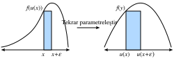

# Tümlev (Integral) Kalkülüsü
:label:`sec_integral_calculus`

Türev alma, geleneksel bir matematik eğitiminin içeriğinin yalnızca yarısını oluşturur. Diğer yapıtaşı, integral alma, oldukça ayrık bir soru gibi görünerek başlar, "Bu eğrinin altındaki alan nedir?" Görünüşte alakasız olsa da, integral alma, *kalkülüsün temel teoremi* olarak bilinen ilişki aracılığıyla türev alma ile sıkı bir şekilde iç içe geçmiştir.

Bu kitapta tartıştığımız makine öğrenmesi düzeyinde, derin bir türev alma anlayışına ihtiyacımız olmayacak. Gene de, daha sonra karşılaşacağımız diğer uygulamalara zemin hazırlamak için kısa bir giriş sağlayacağız.

## Geometrik Yorum
Bir $f(x)$ fonksiyonumuz olduğunu varsayalım. Basit olması için, $f(x)$'nin negatif olmadığını varsayalım (asla sıfırdan küçük bir değer almıyor). Denemek ve anlamak istediğimiz şudur: $f(x)$ ile $x$ ekseni arasındaki alan nedir?

```{.python .input}
%matplotlib inline
from d2l import mxnet as d2l
from IPython import display
from mpl_toolkits import mplot3d
from mxnet import np, npx
npx.set_np()

x = np.arange(-2, 2, 0.01)
f = np.exp(-x**2)

d2l.set_figsize()
d2l.plt.plot(x, f, color='black')
d2l.plt.fill_between(x.tolist(), f.tolist())
d2l.plt.show()
```

```{.python .input}
#@tab pytorch
%matplotlib inline
from d2l import torch as d2l
from IPython import display
from mpl_toolkits import mplot3d
import torch

x = torch.arange(-2, 2, 0.01)
f = torch.exp(-x**2)

d2l.set_figsize()
d2l.plt.plot(x, f, color='black')
d2l.plt.fill_between(x.tolist(), f.tolist())
d2l.plt.show()
```

```{.python .input}
#@tab tensorflow
%matplotlib inline
from d2l import tensorflow as d2l
from IPython import display
from mpl_toolkits import mplot3d
import tensorflow as tf

x = tf.range(-2, 2, 0.01)
f = tf.exp(-x**2)

d2l.set_figsize()
d2l.plt.plot(x, f, color='black')
d2l.plt.fill_between(x.numpy(), f.numpy())
d2l.plt.show()
```

Çoğu durumda, bu alan sonsuz veya tanımsız olacaktır ($f(x) = x^{2}$ altındaki alanı düşünün), bu nedenle insanlar genellikle bir çift uç arasındaki alan hakkında konuşacaklardır, örneğin $a$ ve $b$.

```{.python .input}
x = np.arange(-2, 2, 0.01)
f = np.exp(-x**2)

d2l.set_figsize()
d2l.plt.plot(x, f, color='black')
d2l.plt.fill_between(x.tolist()[50:250], f.tolist()[50:250])
d2l.plt.show()
```

```{.python .input}
#@tab pytorch
x = torch.arange(-2, 2, 0.01)
f = torch.exp(-x**2)

d2l.set_figsize()
d2l.plt.plot(x, f, color='black')
d2l.plt.fill_between(x.tolist()[50:250], f.tolist()[50:250])
d2l.plt.show()
```

```{.python .input}
#@tab tensorflow
x = tf.range(-2, 2, 0.01)
f = tf.exp(-x**2)

d2l.set_figsize()
d2l.plt.plot(x, f, color='black')
d2l.plt.fill_between(x.numpy()[50:250], f.numpy()[50:250])
d2l.plt.show()
```

Bu alanı aşağıdaki integral (tümlev) sembolü ile göstereceğiz:

$$
\mathrm{Alan}(\mathcal{A}) = \int_a^b f(x) \;dx.
$$

İç değişken, bir $\sum$ içindeki bir toplamın indisine çok benzeyen bir yapay değişkendir ve bu nedenle bu, istediğimiz herhangi bir iç değerle eşdeğer olarak yazılabilir:

$$
\int_a^b f(x) \;dx = \int_a^b f(z) \;dz.
$$

Bu tür integralleri nasıl yaklaşık olarak tahmin etmeye çalışabileceğimizin ve anlayabileceğimizin geleneksel bir yolu var: $a$ ile $b$ arasındaki bölgeyi alıp onu $N$ dikey dilimlere böldüğümüzü hayal edebiliriz. $N$ büyükse, her dilimin alanını bir dikdörtgenle tahmin edebilir ve ardından eğrinin altındaki toplam alanı elde etmek için alanları toplayabiliriz. Bunu kodla yapan bir örneğe bakalım. Gerçek değeri nasıl elde edeceğimizi daha sonraki bir bölümde göreceğiz.

```{.python .input}
epsilon = 0.05
a = 0
b = 2

x = np.arange(a, b, epsilon)
f = x / (1 + x**2)

approx = np.sum(epsilon*f)
true = np.log(2) / 2

d2l.set_figsize()
d2l.plt.bar(x.asnumpy(), f.asnumpy(), width=epsilon, align='edge')
d2l.plt.plot(x, f, color='black')
d2l.plt.ylim([0, 1])
d2l.plt.show()

f'approximation: {approx}, truth: {true}'
```

```{.python .input}
#@tab pytorch
epsilon = 0.05
a = 0
b = 2

x = torch.arange(a, b, epsilon)
f = x / (1 + x**2)

approx = torch.sum(epsilon*f)
true = torch.log(torch.tensor([5.])) / 2

d2l.set_figsize()
d2l.plt.bar(x, f, width=epsilon, align='edge')
d2l.plt.plot(x, f, color='black')
d2l.plt.ylim([0, 1])
d2l.plt.show()

f'approximation: {approx}, truth: {true}'
```

```{.python .input}
#@tab tensorflow
epsilon = 0.05
a = 0
b = 2

x = tf.range(a, b, epsilon)
f = x / (1 + x**2)

approx = tf.reduce_sum(epsilon*f)
true = tf.math.log(tf.constant([5.])) / 2

d2l.set_figsize()
d2l.plt.bar(x, f, width=epsilon, align='edge')
d2l.plt.plot(x, f, color='black')
d2l.plt.ylim([0, 1])
d2l.plt.show()

f'approximation: {approx}, truth: {true}'
```

Sorun şu ki, sayısal (numerik) olarak yapılabilse de, bu yaklaşımı analitik olarak sadece aşağıdaki gibi en basit işlevler için yapabiliriz.

$$
\int_a^b x \;dx.
$$

Yukarıdaki koddaki örneğimizden biraz daha karmaşık bir şey, mesela:

$$
\int_a^b \frac{x}{1+x^{2}} \;dx.
$$

böyle doğrudan bir yöntemle çözebileceğimizin ötesinde bir örnektir.

Bunun yerine farklı bir yaklaşım benimseyeceğiz. Alan kavramıyla sezgisel olarak çalışacağız ve integralleri bulmak için kullanılan ana hesaplama aracını öğreneceğiz: *Kalkülüsün temel teoremi*. Bu, integral alma (tümleme) çalışmamızın temeli olacaktır.

## Kalkülüsün Temel Teoremi

Integral alma teorisinin derinliklerine inmek için bir fonksiyon tanıtalım:

$$
F(x) = \int_0^x f(y) dy.
$$

Bu işlev, $x$'i nasıl değiştirdiğimize bağlı olarak $0$ ile $x$ arasındaki alanı ölçer. İhtiyacımız olan her şeyin burada olduğuna dikkat edin:

$$
\int_a^b f(x) \;dx = F(b) - F(a).
$$

Bu, :numref:`fig_area-subtract` içindeki gibi alanı en uzak uç noktaya kadar ölçebildiğimiz ve ardından yakın uç noktaya kadarki alanı çıkarabileceğimiz gerçeğinin matematiksel bir kodlamasıdır.


:label:`fig_area-subtract`

Dolayısıyla, herhangi bir aralıktaki integralin ne olduğunu $F(x)$'in ne olduğunu bularak bulabiliriz.

Bunun için bir deney yapalım. Kalkülüste sık sık yaptığımız gibi, değeri çok az değiştirdiğimizde ne olduğunu görelim. Yukarıdaki yorumdan biliyoruz ki

$$
F(x+\epsilon) - F(x) = \int_x^{x+\epsilon} f(y) \; dy.
$$

Bu bize, fonksiyonun küçük bir fonksiyon şeridinin altındaki alana göre değiştiğini söyler.

Bu, bir yaklaşıklama yaptığımız noktadır. Bunun gibi küçük bir alana bakarsak, bu alan, yüksekliği $f(x)$ ve taban genişliği $\epsilon$ olan dikdörtgenin alanına yakın görünüyor. Aslında, $\epsilon \rightarrow 0$ olunca bu yaklaşıklamanın gittikçe daha iyi hale geldiği gösterilebilir. Böylece şu sonuca varabiliriz:

$$
F(x+\epsilon) - F(x) \approx \epsilon f(x).
$$

Bununla birlikte, şimdi fark edebiliriz ki $F$'nin türevini hesaplıyor olsaydık, tam olarak beklediğimiz kalıp bu olurdu! Böylece şu oldukça şaşırtıcı gerçeği görüyoruz:

$$
\frac{dF}{dx}(x) = f(x).
$$

Bu, *kalkülüsün temel teoremidir*. Bunu genişletilmiş biçimde şöyle yazabiliriz:
$$\frac{d}{dx}\int_{-\infty}^x f(y) \; dy = f(x).$$
:eqlabel:`eq_ftc`

Alan bulma kavramını alır (ki muhtemelen oldukça zordur) ve onu bir ifade türevine (çok daha anlaşılmış bir şey) indirger. Yapmamız gereken son bir yorum, bunun bize $F(x)$'nin tam olarak ne olduğunu söylemediğidir. Aslında, herhangi bir $C$ için $F(x) + C$ aynı türeve sahiptir. Bu, integral alma teorisinde hayatın gerçeğidir. Belirli integrallerle çalışırken sabitlerin düştüğüne ve dolayısıyla sonuçla ilgisiz olduklarına dikkat edin.

$$
\int_a^b f(x) \; dx = (F(b) + C) - (F(a) + C) = F(b) - F(a).
$$

Bu soyut olarak bir anlam ifade etmiyor gibi görünebilir, ancak bunun bizde integral hesaplamaya yepyeni bir bakış açısı kazandırdığını anlamak için biraz zaman ayıralım. Amacımız artık bir çeşit parçala ve topla işlemi yapmak ve alanı geri kurtarmayı denemek değil; bunun yerine sadece türevi sahip olduğumuz fonksiyon olan başka bir fonksiyon bulmamız gerekiyor! Bu inanılmaz bir olay çünkü artık pek çok zorlu integrali sadece :numref:`sec_derivative_table` içindeki tabloyu ters çevirerek listeleyebiliriz. Örneğin, $x^{n}$'nin türevinin $nx^{n-1}$ olduğunu biliyoruz. Böylece, temel teoremi, :eqref:`eq_ftc`, kullanarak şunu söyleyebiliriz:

$$
\int_0^{x} ny^{n-1} \; dy = x^n - 0^n = x^n.
$$

Benzer şekilde, $e^{x}$'nin türevinin kendisi olduğunu biliyoruz, yani

$$
\int_0^{x} e^{x} \; dx = e^{x} - e^{0} = e^x - 1.
$$

Bu şekilde, türevsel hesaptan gelen fikirlerden özgürce yararlanarak bütün integral alma teorisini geliştirebiliriz. Her integral kuralı bu olgudan türetilir.

## Değişkenlerin Değişimi
:label:`integral_example`

Aynen türev almada olduğu gibi, integrallerin hesaplanmasını daha izlenebilir kılan bir dizi kural vardır. Aslında, türevsel hesabın her kuralı (çarpım kuralı, toplam kuralı ve zincir kuralı gibi), integral hesaplamada karşılık gelen bir kurala sahiptir (formül sırasıyla, parçalayarak integral alma, integralin doğrusallığı ve değişkenler değişimi). Bu bölümde, listeden tartışmasız en önemli olanı inceleyeceğiz: değişkenlerin değişimi formülü.

İlk olarak, kendisi bir integral olan bir fonksiyonumuz olduğunu varsayalım:

$$
F(x) = \int_0^x f(y) \; dy.
$$ 

Diyelim ki, $F(u(x))$'i elde etmek için onu başka bir fonksiyonla oluşturduğumuzda bu fonksiyonun nasıl göründüğünü bilmek istediğimizi varsayalım. Zincir kuralı ile biliyoruz ki:

$$
\frac{d}{dx}F(u(x)) = \frac{dF}{du}(u(x))\cdot \frac{du}{dx}.
$$

Yukarıdaki gibi, temel teoremi, :eqref:`eq_ftc`, kullanarak bunu integral alma ilgili bir ifadeye dönüştürebiliriz. Böylece:

$$
F(u(x)) - F(u(0)) = \int_0^x \frac{dF}{du}(u(y))\cdot \frac{du}{dy} \;dy.
$$

$F$'nin kendisinin bir integral olduğunu hatırlamak, sol tarafın yeniden yazılabilmesine olanak verir.

$$
\int_{u(0)}^{u(x)} f(y) \; dy = \int_0^x \frac{dF}{du}(u(y))\cdot \frac{du}{dy} \;dy.
$$

Benzer şekilde, $F$'nin bir integral olduğunu hatırlamak, temel teoremi, :eqref:`eq_ftc`, kullanarak $\frac{dF}{dx} = f$'i tanımamıza izin verir ve böylece şu sonuca varabiliriz:

$$\int_{u(0)}^{u(x)} f(y) \; dy = \int_0^x f(u(y))\cdot \frac{du}{dy} \;dy.$$
:eqlabel:`eq_change_var`

Bu, *değişkenlerin değişimi* formülüdür.

Daha sezgisel bir türetme için, $x$ ile $x+\epsilon$ arasında bir $f(u(x))$ integralini aldığımızda ne olacağını düşünün. Küçük bir $\epsilon$ için, bu integral, yaklaşık olarak $\epsilon f(u(x))$, yani ilişkili dikdörtgenin alanıdır. Şimdi bunu $u(x)$ ile $u(x+\epsilon)$ arasındaki $f(y)$ integraliyle karşılaştıralım. $u(x+\epsilon) \approx u(x) + \epsilon \frac{du}{dx}(x)$ olduğunu biliyoruz, bu nedenle bu dikdörtgenin alanı yaklaşık $\epsilon \frac{du}{dx}(x)f(u(x))$'dir. Bu nedenle, bu iki dikdörtgenin alanını uyuşacak hale getirmek için :numref:`fig_rect-transform` içinde gösterildiği gibi ilkini $\frac{du}{dx}(x)$ ile çarpmamız gerekiyor.


:label:`fig_rect-transform`

Bu bize şunu söyler:

$$
\int_x^{x+\epsilon} f(u(y))\frac{du}{dy}(y)\;dy = \int_{u(x)}^{u(x+\epsilon)} f(y) \; dy.
$$  

Bu, tek bir küçük dikdörtgen için ifade edilen değişken değişimi formülüdür.

$u(x)$ ve $f(x)$ doğru seçilirse, bu inanılmaz derecede karmaşık integrallerin hesaplanmasına izin verebilir. Örneğin, $f(y) = 1$ ve $u(x) = e^{-x^{2}}$ seçersek (bu $\frac{du}{dx}(x) = -2xe^{-x^{2}}$ anlamına gelir), bu örnek şunu gösterebilir:

$$
e^{-1} - 1 = \int_{e^{-0}}^{e^{-1}} 1 \; dy = -2\int_0^{1} ye^{-y^2}\;dy,
$$

Tekrar düzenlersek:

$$
\int_0^{1} ye^{-y^2}\; dy = \frac{1-e^{-1}}{2}.
$$

## İşaret Gösterimlerine Bir Yorum

Keskin gözlü okuyucular yukarıdaki hesaplamalarla ilgili tuhaf bir şey gözlemleyecekler. Yani, aşağıdaki gibi hesaplamalar

$$
\int_{e^{-0}}^{e^{-1}} 1 \; dy = e^{-1} -1 < 0,
$$

negatif sayılar üretebilirler. Alanlar hakkında düşünürken, negatif bir değer görmek garip olabilir ve bu nedenle bu gösterimin ne olduğunu araştırmaya değer.

Matematikçiler işaretli alanlar kavramını benimser. Bu kendini iki şekilde gösterir. İlk olarak, bazen sıfırdan küçük olan $f(x)$ fonksiyonunu düşünürsek, alan da negatif olacaktır. Yani örneğin

$$
\int_0^{1} (-1)\;dx = -1.
$$

Benzer şekilde, soldan sağa değil sağdan sola ilerleyen integraller de negatif alan olarak tanımlanır.

$$
\int_0^{-1} 1\; dx = -1.
$$

Standart alan (pozitif bir fonksiyonda soldan sağa) her zaman pozitiftir. Ters çevirerek elde edilen herhangi bir şey (örneğin, negatif bir sayının integralini elde etmek için $x$ eksenini ters çevirmek veya bir integrali yanlış sırada elde etmek için $y$ eksenini ters çevirmek gibi) negatif bir alan üretecektir. Aslında, iki kez ters yüz etme, pozitif alana sahip olmak için birbirini götüren bir çift negatif işaret verecektir.

$$
\int_0^{-1} (-1)\;dx =  1.
$$

Bu tartışma size tanıdık geliyorsa, normaldir! :numref:`sec_geometry-linear-algebraic-ops` içinde determinantın işaretli alanı nasıl aynı şekilde temsil ettiğini tartıştık.


## Çoklu İntegraller
Bazı durumlarda daha yüksek boyutlarda çalışmamız gerekecektir. Örneğin, $f(x, y)$ gibi iki değişkenli bir fonksiyonumuz olduğunu ve $x$'nin $[a, b]$ ve $y$'nin ise $[c, d]$ arasında değiştiğinde $f$ altındaki hacim nedir bilmek istediğimizi varsayalım.

```{.python .input}
# Izgara oluştur ve işlevi hesapla
x, y = np.meshgrid(np.linspace(-2, 2, 101), np.linspace(-2, 2, 101),
                   indexing='ij')
z = np.exp(- x**2 - y**2)

# İşlevi çiz
ax = d2l.plt.figure().add_subplot(111, projection='3d')
ax.plot_wireframe(x.asnumpy(), y.asnumpy(), z.asnumpy())
d2l.plt.xlabel('x')
d2l.plt.ylabel('y')
d2l.plt.xticks([-2, -1, 0, 1, 2])
d2l.plt.yticks([-2, -1, 0, 1, 2])
d2l.set_figsize()
ax.set_xlim(-2, 2)
ax.set_ylim(-2, 2)
ax.set_zlim(0, 1)
ax.dist = 12
```

```{.python .input}
#@tab pytorch
# Izgara oluştur ve işlevi hesapla
x, y = torch.meshgrid(torch.linspace(-2, 2, 101), torch.linspace(-2, 2, 101))
z = torch.exp(- x**2 - y**2)

# İşlevi çiz
ax = d2l.plt.figure().add_subplot(111, projection='3d')
ax.plot_wireframe(x, y, z)
d2l.plt.xlabel('x')
d2l.plt.ylabel('y')
d2l.plt.xticks([-2, -1, 0, 1, 2])
d2l.plt.yticks([-2, -1, 0, 1, 2])
d2l.set_figsize()
ax.set_xlim(-2, 2)
ax.set_ylim(-2, 2)
ax.set_zlim(0, 1)
ax.dist = 12
```

```{.python .input}
#@tab tensorflow
# Izgara oluştur ve işlevi hesapla
x, y = tf.meshgrid(tf.linspace(-2., 2., 101), tf.linspace(-2., 2., 101))
z = tf.exp(- x**2 - y**2)

# İşlevi çiz
ax = d2l.plt.figure().add_subplot(111, projection='3d')
ax.plot_wireframe(x, y, z)
d2l.plt.xlabel('x')
d2l.plt.ylabel('y')
d2l.plt.xticks([-2, -1, 0, 1, 2])
d2l.plt.yticks([-2, -1, 0, 1, 2])
d2l.set_figsize()
ax.set_xlim(-2, 2)
ax.set_ylim(-2, 2)
ax.set_zlim(0, 1)
ax.dist = 12
```

Şöyle yazabiliriz:

$$
\int_{[a, b]\times[c, d]} f(x, y)\;dx\;dy.
$$

Bu integrali hesaplamak istediğimizi varsayalım. Bizim iddiamız, bunu önce $x$'deki integrali yinelemeli olarak hesaplayarak ve sonra da $y$'deki integrale kayarak yapabileceğimizdir, yani

$$
\int_{[a, b]\times[c, d]} f(x, y)\;dx\;dy = \int_c^{d} \left(\int_a^{b} f(x, y) \;dx\right) \; dy.
$$

Bunun neden olduğunu görelim.

Fonksiyonu $\epsilon \times \epsilon$ karelere böldüğümüzü ve $i, j$ tamsayı koordinatlarıyla indekslediğimizi düşünün. Bu durumda integralimiz yaklaşık olarak şöyledir:

$$
\sum_{i, j} \epsilon^{2} f(\epsilon i, \epsilon j).
$$

Problemi ayrıklaştırdığımızda, bu karelerdeki değerleri istediğimiz sırayla toplayabiliriz ve değerleri değiştirme konusunda endişelenmeyiz. Bu, :numref:`fig_sum-order` şeklinde gösterilmektedir. Özellikle şunu söyleyebiliriz:

$$
 \sum _ {j} \epsilon \left(\sum_{i} \epsilon f(\epsilon i, \epsilon j)\right).
$$


:label:`fig_sum-order`
 
İç kısımdaki toplam, tam olarak integralin ayrıklaştırılmasıdır.

$$
G(\epsilon j) = \int _a^{b} f(x, \epsilon j) \; dx.
$$

Son olarak, bu iki ifadeyi birleştirirsek şunu elde ettiğimize dikkat edin: 

$$
\sum _ {j} \epsilon G(\epsilon j) \approx \int _ {c}^{d} G(y) \; dy = \int _ {[a, b]\times[c, d]} f(x, y)\;dx\;dy.
$$

Böylece hepsini bir araya getirirsek, buna sahip oluruz:

$$
\int _ {[a, b]\times[c, d]} f(x, y)\;dx\;dy = \int _ c^{d} \left(\int _ a^{b} f(x, y) \;dx\right) \; dy.
$$

Dikkat edin, bir kez ayrıklaştırıldı mı, yaptığımız tek şey, bir sayı listesi eklediğimiz sırayı yeniden düzenlemek oldu. Bu, burada hiçbir zorluk yokmuş gibi görünmesine neden olabilir, ancak bu sonuç (*Fubini Teoremi* olarak adlandırılır) her zaman doğru değildir! Makine öğrenmesi (sürekli fonksiyonlar) yapılırken karşılaşılan matematik türü için herhangi bir endişe yoktur, ancak başarısız olduğu durumlardan örnekler oluşturmak mümkündür (örneğin $f(x, y) = xy(x^2-y^2)/(x^2+y^2)^3$ fonksiyonunu $[0,2]\times[0,1]$ dikdörtgenin üzerinde deneyin).

İntegrali önce $x$ cinsinden ve ardından $y$ cinsinden yapma seçeneğinin keyfi olduğuna dikkat edin. Önce $y$ için, sonra da $x$ için yapmayı eşit derecede  seçebilirdik:

$$
\int _ {[a, b]\times[c, d]} f(x, y)\;dx\;dy = \int _ a^{b} \left(\int _ c^{d} f(x, y) \;dy\right) \; dx.
$$

Çoğu zaman, vektör gösterimine yoğunlaşacağız ve $U = [a, b]\times [c, d]$ için bunun şöyle olduğunu söyleyeceğiz:

$$
\int _ U f(\mathbf{x})\;d\mathbf{x}.
$$

## Çoklu İntegrallerde Değişkenlerin Değiştirilmesi
Tek değişkenlerdeki gibi :eqref:`eq_change_var`, daha yüksek boyutlu bir integral içindeki değişkenleri değiştirme yeteneği önemli bir araçtır. Sonucu türetme yapmadan özetleyelim.

Integral alma alanımızı yeniden parametrelendiren bir işleve ihtiyacımız var. Bunu $\phi : \mathbb{R}^n \rightarrow \mathbb{R}^n$ olarak alabiliriz, bu $n$ tane gerçel değişkeni alıp başka bir $n$ gerçele döndüren herhangi bir işlevdir. İfadeleri temiz tutmak için, $\phi$'nin *bire-bir* olduğunu varsayacağız, bu da onun hiçbir zaman kendi üzerine katlanmadığını söylemektir ($\phi(\mathbf{x}) = \phi(\mathbf{y}) \implies \mathbf{x} = \mathbf{y}$).

Bu durumda şunu söyleyebiliriz:

$$
\int _ {\phi(U)} f(\mathbf{x})\;d\mathbf{x} = \int _ {U} f(\phi(\mathbf{x})) \left|\det(D\phi(\mathbf{x}))\right|\;d\mathbf{x}.
$$

$D\phi$, $\phi$'nin *Jacobi matrisi*dir, yani $\boldsymbol{\phi} = (\phi_1(x_1, \ldots, x_n), \ldots, \phi_n(x_1, \ldots, x_n))$'nin kısmi türevlerinin matrisidir.

$$
D\boldsymbol{\phi} = \begin{bmatrix}
\frac{\partial \phi _ 1}{\partial x _ 1} & \cdots & \frac{\partial \phi _ 1}{\partial x _ n} \\
\vdots & \ddots & \vdots \\
\frac{\partial \phi _ n}{\partial x _ 1} & \cdots & \frac{\partial \phi _ n}{\partial x _ n}
\end{bmatrix}.
$$

Yakından baktığımızda, bunun tek değişkenli zincir kuralına, :eqref:`eq_change_var`, benzer olduğunu görüyoruz, ancak $\frac{du}{dx}(x)$ terimini  $\left|\det(D\phi(\mathbf{x}))\right|$ ile değiştirdik. Bu terimi nasıl yorumlayabileceğimize bir bakalım. $\frac{du}{dx}(x)$ teriminin $x$ eksenimizi $u$'yu uygulayarak ne kadar uzattığımızı söylemek için var olduğunu hatırlayın. Daha yüksek boyutlarda aynı işlem, $\boldsymbol{\phi}$ uygulayarak küçük bir karenin (veya küçük *hiper küpün*) alanını (veya hacmini veya hiper hacmini) ne kadar uzatacağımızı belirlemektir. Eğer $\boldsymbol{\phi}$ bir matrisle çarpımsa, determinantın zaten cevabı nasıl verdiğini biliyoruz.

Biraz çalışmayla, *Jacobi matrisi*nin çok değişkenli bir fonksiyona, yani $\boldsymbol{\phi}$'ye, bir noktada matrisin türevleri ve gradyanları olan doğrular veya düzlemlerle yaklaşık olarak tahmin edebileceğimiz gibi en iyi yaklaşıklamayı sağladığı gösterilebilir. Böylece, Jacobi matrisinin determinantı, bir boyutta tanımladığımız ölçeklendirme çarpanını tam olarak kopyalar.

Bunun ayrıntılarını doldurmak biraz çalışma gerektirir, bu yüzden şimdi net değilse endişelenmeyin. Daha sonra kullanacağımız bir örnek görelim. Bu integrali düşünün:

$$
\int _ {-\infty}^{\infty} \int _ {-\infty}^{\infty} e^{-x^{2}-y^{2}} \;dx\;dy.
$$

Bu integral ile doğrudan oynamak bizi hiçbir yere götürmez, ancak değişkenleri değiştirirsek, önemli ilerleme kaydedebiliriz. $\boldsymbol{\phi}(r, \theta) = (r \cos(\theta),  r\sin(\theta))$ olmasına izin verirsek (bu $x = r \cos(\theta)$, $y = r \sin(\theta)$ demektir), sonra bunun aynı şey olduğunu görmek için değişken değişimi formülünü uygulayabiliriz:

$$
\int _ 0^\infty \int_0 ^ {2\pi} e^{-r^{2}} \left|\det(D\mathbf{\phi}(\mathbf{x}))\right|\;d\theta\;dr,
$$

ve

$$
\left|\det(D\mathbf{\phi}(\mathbf{x}))\right| = \left|\det\begin{bmatrix}
\cos(\theta) & -r\sin(\theta) \\
\sin(\theta) & r\cos(\theta)
\end{bmatrix}\right| = r(\cos^{2}(\theta) + \sin^{2}(\theta)) = r.
$$

Böylece integral:

$$
\int _ 0^\infty \int _ 0 ^ {2\pi} re^{-r^{2}} \;d\theta\;dr = 2\pi\int _ 0^\infty re^{-r^{2}} \;dr = \pi,
$$

Burada son eşitlik, bölüm :numref:`integral_example` içinde kullandığımız hesaplamanın aynısını izler.

Sürekli rastgele değişkenleri incelediğimizde, :numref:`sec_random_variables`, bu integral ile tekrar karşılaşacağız.

## Özet

* Integral alma teorisi, alanlar veya hacimler hakkındaki soruları yanıtlamamıza izin verir.
* Kalkülüsün temel teoremi, alanın türevinin bir noktaya kadar integrali alınan fonksiyonun değeri tarafından verildiği gözlemi sayesinde alanları hesaplamak için türevler hakkındaki bilgiden yararlanmamızı sağlar.
* Daha yüksek boyutlardaki integraller, tek değişkenli integralleri sırasıyla izleyerek hesaplanabilir.

## Alıştırmalar
1. $\int_1^2 \frac{1}{x} \;dx$ nedir?
2. $\int_0^{\sqrt{\pi}}x\sin(x^2)\;dx$ ifadesini hesaplamak için değişken değişimi formülünü kullanınız.
3. $\int_{[0,1]^2} xy \;dx\;dy$ nedir?
4. $\int_0^2\int_0^1xy(x^2-y^2)/(x^2+y^2)^3\;dy\;dx$ ve $\int_0^1\int_0^2f(x, y) = xy(x^2-y^2)/(x^2+y^2)^3\;dx\;dy$ hesaplamak için değişken değişimi formülünü kullanınız ve farkı görünüz.

:begin_tab:`mxnet`
[Tartışmalar](https://discuss.d2l.ai/t/414)
:end_tab:

:begin_tab:`pytorch`
[Tartışmalar](https://discuss.d2l.ai/t/1092)
:end_tab:


:begin_tab:`tensorflow`
[Tartışmalar](https://discuss.d2l.ai/t/1093)
:end_tab:
