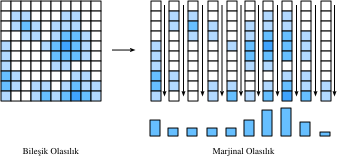

# Rastgele Değişkenler
:label:`sec_random_variables`

:numref:`sec_prob` içinde, bizim durumumuzda ya sonlu olası değerler kümesini ya da tamsayıları alan rastgele değişkenlere atıfta bulunan ayrık rastgele değişkenlerle nasıl çalışılacağının temellerini gördük. Bu bölümde, herhangi bir gerçel değeri alabilen rastgele değişkenler olan *sürekli rastgele değişkenler* teorisini geliştiriyoruz.

## Sürekli Rastgele Değişkenler

Sürekli rastgele değişkenler, ayrık rastgele değişkenlerden önemli ölçüde daha incelikli bir konudur. Yapılması gereken adil bir benzetme, buradaki teknik sıçramanın sayı listeleri toplama ve işlevlerin integralini alma arasındaki sıçramayla karşılaştırılabilir olmasıdır. Bu nedenle, teoriyi geliştirmek için biraz zaman ayırmamız gerekecek.

### Ayrık Değerden Sürekli Değere

Sürekli rastgele değişkenlerle çalışırken karşılaşılan ek teknik zorlukları anlamak için düşüncesel bir deney yapalım. Dart tahtasına bir dart fırlattığımızı ve tahtanın ortasından tam olarak $2 \text{cm}$ uzağa saplanma olasılığını bilmek istediğimizi varsayalım.

Başlangıç ​​olarak, tek basamaklı bir doğrulukla, yani $0 \text{cm}$, $1 \text{cm}$, $2 \text{cm}$ gibi bölmeler kullanarak ölçtüğümüzü hayal ediyoruz. Dart tahtasına diyelim ki $100$ dart atıyoruz ve eğer bunlardan $20$'si $2 \text{cm}$ bölmesine düşerse, attığımız dartların $\% 20$'sinin tahtada merkezden $2 \text{cm}$ uzağa saplandığı sonucuna varıyoruz.

Ancak daha yakından baktığımızda, bu sorumuzla örtüşmüyor! Tam eşitlik istiyorduk, oysa bu bölmeler diyelim ki $1.5 \text{cm}$ ile $2.5 \text{cm}$ arasındaki her şeyi tutuyor.

Kesintisiz, daha ileriye devam edelim. Daha da keskin bir şekilde ölçüyoruz, diyelim ki $1.9 \text{cm}$, $2.0 \text{cm}$, $2.1 \text{cm}$ ve şimdi, belki de $100$ darttan $3$'ünün $2.0 \text{cm}$ hattında tahtaya saplandığını görüyoruz. Böylece olasılığın $\% 3$ olduğu sonucuna vardık.

Ancak bu hiçbir şeyi çözmez! Sorunu bir basamak daha aşağıya ittik. Biraz soyutlayalım. İlk $k$ hanesinin $2.00000 \ldots$ ile eşleşme olasılığını bildiğimizi ve ilk $k + 1$ hanesi için eşleşme olasılığını bilmek istediğimizi düşünün. ${k + 1}.$ basamağının aslında $\{0, 1, 2, \ldots, 9 \}$ kümesinden rastgele bir seçim olduğunu varsaymak oldukça mantıklıdır. En azından, mikrometre mertebesindeki değeri merkezden uzaklaşarak $7$ veya $3$'e karşılık gelmeye tercih etmeye zorlayacak fiziksel olarak anlamlı bir süreç düşünemiyoruz.

Bunun anlamı, özünde ihtiyaç duyduğumuz her ek doğruluk basamağının eşleştirme olasılığını $10$'luk bir faktörle azaltması gerektiğidir. Ya da başka bir deyişle, bunu beklerdik:

$$
P(\text{mesafe}\; 2.00\ldots, \;\text{'ye}\; k \;\text{basamak yakın} ) \approx p\cdot10^{-k}.
$$

Değer $p$ esasen ilk birkaç basamakta olanları kodlar ve $10^{-k}$ gerisini halleder.

Ondalık sayıdan sonra konumu $k = 4$ basamağa kadar doğru bildiğimize dikkat edin. Bu, değerin $[1.99995,2.00005]$ aralığında olduğunu bildiğimiz anlamına gelir, bu da $2.00005-1.99995 = 10^{-4}$ uzunluğunda bir aralıktır. Dolayısıyla, bu aralığın uzunluğunu $\epsilon$ olarak adlandırırsak, diyebiliriz ki

$$
P(2\text{'ye}\; \epsilon\text{-ebatlı aralık mesafesinde}) \approx \epsilon \cdot p.
$$

Bunu son bir adım daha ileri götürelim. Bunca zamandır $2$ noktasını düşünüyorduk, ama diğer noktaları asla düşünmedik. Orada temelde hiçbir şey farklı değildir, ancak $p$ değeri muhtemelen farklı olacaktır. En azından bir dart atıcısının, $20 \text{cm}$ yerine $2 \text{cm}$ gibi merkeze daha yakın bir noktayı vurma olasılığının daha yüksek olduğunu umuyoruz. Bu nedenle, $p$ değeri sabit değildir, bunun yerine $x$ noktasına bağlı olmalıdır. Bu da bize şunu beklememiz gerektiğini söylüyor:

$$P(x\text{'ye}\; \epsilon\text{-ebatlı aralık mesafesinde}) \approx \epsilon \cdot p(x).$$
:eqlabel:`eq_pdf_deriv`

Aslında, :eqref:`eq_pdf_deriv` tam olarak *olasılık yoğunluk fonksiyonunu* tanımlar. Bu, bir noktayı başka yakın bir noktaya göre vurma olasılığını kodlayan bir $p(x)$ fonksiyonudur. Böyle bir fonksiyonun neye benzeyebileceğini görselleştirelim.

```{.python .input}
%matplotlib inline
from d2l import mxnet as d2l
from IPython import display
from mxnet import np, npx
npx.set_np()

# Bazı rastgele değişkenler için olasılık yoğunluk fonksiyonunu çiz
x = np.arange(-5, 5, 0.01)
p = 0.2*np.exp(-(x - 3)**2 / 2)/np.sqrt(2 * np.pi) + \
    0.8*np.exp(-(x + 1)**2 / 2)/np.sqrt(2 * np.pi)

d2l.plot(x, p, 'x', 'Density')
```

```{.python .input}
#@tab pytorch
%matplotlib inline
from d2l import torch as d2l
from IPython import display
import torch
torch.pi = torch.acos(torch.zeros(1)).item() * 2  # Pi'yi tanımla

# Bazı rastgele değişkenler için olasılık yoğunluk fonksiyonunu çiz
x = torch.arange(-5, 5, 0.01)
p = 0.2*torch.exp(-(x - 3)**2 / 2)/torch.sqrt(2 * torch.tensor(torch.pi)) + \
    0.8*torch.exp(-(x + 1)**2 / 2)/torch.sqrt(2 * torch.tensor(torch.pi))

d2l.plot(x, p, 'x', 'Density')
```

```{.python .input}
#@tab tensorflow
%matplotlib inline
from d2l import tensorflow as d2l
from IPython import display
import tensorflow as tf
tf.pi = tf.acos(tf.zeros(1)).numpy() * 2  # Pi'yi tanımla

# Bazı rastgele değişkenler için olasılık yoğunluk fonksiyonunu çiz
x = tf.range(-5, 5, 0.01)
p = 0.2*tf.exp(-(x - 3)**2 / 2)/tf.sqrt(2 * tf.constant(tf.pi)) + \
    0.8*tf.exp(-(x + 1)**2 / 2)/tf.sqrt(2 * tf.constant(tf.pi))

d2l.plot(x, p, 'x', 'Density')
```

İşlev değerinin büyük olduğu konumlar, rastgele değeri bulma olasılığımızın daha yüksek olduğu bölgeleri gösterir. Düşük kısımlar, rastgele değeri bulamaya yatkın olmadığımız alanlardır.

### Olasılık Yoğunluk Fonksiyonları

Şimdi bunu daha ayrıntılı inceleyelim. Bir rastgele değişken $X$ için olasılık yoğunluk fonksiyonunun sezgisel olarak ne olduğunu daha önce görmüştük, yani yoğunluk fonksiyonu bir $p(x)$ fonksiyonudur.

$$P(X\; x\text{'ye}\; \epsilon\text{-ebatlı aralık mesafesinde}) \approx \epsilon \cdot p(x).$$
:eqlabel:`eq_pdf_def`

Peki bu $p(x)$'nin özellikleri için ne anlama geliyor?

Birincisi, olasılıklar asla negatif değildir, dolayısıyla $p(x)\ge 0$ olmasını bekleriz.

İkinci olarak, $\mathbb{R}$'yi $\epsilon$ genişliğinde sonsuz sayıda dilime böldüğümüzü varsayalım, diyelim ki $(\epsilon\cdot i, \epsilon \cdot (i+1)]$ gibi. Bunların her biri için, :eqref:`eq_pdf_def` denkleminden biliyoruz, olasılık yaklaşık olarak

$$
P(X\; x\text{'ye}\; \epsilon\text{-ebatlı aralık mesafesinde}) \approx \epsilon \cdot p(\epsilon \cdot i),
$$

bu yüzden hepsi üzerinden toplanabilmeli

$$
P(X\in\mathbb{R}) \approx \sum_i \epsilon \cdot p(\epsilon\cdot i).
$$

Bu, :numref:`sec_integral_calculus` içinde tartışılan bir integral yaklaşımından başka bir şey değildir, dolayısıyla şunu söyleyebiliriz:

$$
P(X\in\mathbb{R}) = \int_{-\infty}^{\infty} p(x) \; dx.
$$

$P(X\in\mathbb{R}) = 1$ olduğunu biliyoruz, çünkü rasgele değişkenin *herhangi bir* sayı alması gerektiğinden, herhangi bir yoğunluk için şu sonuca varabiliriz:

$$
\int_{-\infty}^{\infty} p(x) \; dx = 1.
$$

Aslında, bu konuyu daha ayrıntılı olarak incelersek, herhangi $a$ ve $b$ için şunu görürüz:

$$
P(X\in(a, b]) = \int _ {a}^{b} p(x) \; dx.
$$

Bunu, daha önce olduğu gibi aynı ayrık yaklaşıklama yöntemlerini kullanarak kodda yaklaşıklaştırabiliriz. Bu durumda mavi bölgeye düşme olasılığını tahmin edebiliriz.

```{.python .input}
# Sayısal integral alma kullanarak olasılığı yaklaşıkla
epsilon = 0.01
x = np.arange(-5, 5, 0.01)
p = 0.2*np.exp(-(x - 3)**2 / 2) / np.sqrt(2 * np.pi) + \
    0.8*np.exp(-(x + 1)**2 / 2) / np.sqrt(2 * np.pi)

d2l.set_figsize()
d2l.plt.plot(x, p, color='black')
d2l.plt.fill_between(x.tolist()[300:800], p.tolist()[300:800])
d2l.plt.show()

f'approximate Probability: {np.sum(epsilon*p[300:800])}'
```

```{.python .input}
#@tab pytorch
# Sayısal integral alma kullanarak olasılığı yaklaşıkla
epsilon = 0.01
x = torch.arange(-5, 5, 0.01)
p = 0.2*torch.exp(-(x - 3)**2 / 2) / torch.sqrt(2 * torch.tensor(torch.pi)) +\
    0.8*torch.exp(-(x + 1)**2 / 2) / torch.sqrt(2 * torch.tensor(torch.pi))

d2l.set_figsize()
d2l.plt.plot(x, p, color='black')
d2l.plt.fill_between(x.tolist()[300:800], p.tolist()[300:800])
d2l.plt.show()

f'approximate Probability: {torch.sum(epsilon*p[300:800])}'
```

```{.python .input}
#@tab tensorflow
# Sayısal integral alma kullanarak olasılığı yaklaşıkla
epsilon = 0.01
x = tf.range(-5, 5, 0.01)
p = 0.2*tf.exp(-(x - 3)**2 / 2) / tf.sqrt(2 * tf.constant(tf.pi)) +\
    0.8*tf.exp(-(x + 1)**2 / 2) / tf.sqrt(2 * tf.constant(tf.pi))

d2l.set_figsize()
d2l.plt.plot(x, p, color='black')
d2l.plt.fill_between(x.numpy().tolist()[300:800], p.numpy().tolist()[300:800])
d2l.plt.show()

f'approximate Probability: {tf.reduce_sum(epsilon*p[300:800])}'
```

Bu iki özelliğin, olası olasılık yoğunluk fonksiyonlarının (veya yaygın olarak karşılaşılan kısaltma için *o.y.f. (p.d.f)*'ler) uzayını tastamam tanımladığı ortaya çıkar. Negatif olmayan fonksiyonlar $p(x) \ge 0$ için

$$\int_{-\infty}^{\infty} p(x) \; dx = 1.$$
:eqlabel:`eq_pdf_int_one`

Bu işlevi, rastgele değişkenimizin belirli bir aralıkta olma olasılığını elde etmek için integral alarak yorumluyoruz:

$$P(X\in(a, b]) = \int _ {a}^{b} p(x) \; dx.$$
:eqlabel:`eq_pdf_int_int`

:numref:`sec_distributions` içinde bir dizi yaygın dağılımı göreceğiz, ancak soyut olarak çalışmaya devam edelim.

### Birikimli (Kümülatif) Dağılım Fonksiyonları

Önceki bölümde, o.y.f. kavramını gördük. Uygulamada, bu sürekli rastgele değişkenleri tartışmak için yaygın olarak karşılaşılan bir yöntemdir, ancak önemli bir görünmez tuzak vardır: o.y.f.'nin değerlerinin kendileri olasılıklar değil, olasılıkları elde etmek için integralini almamız gereken bir fonksiyondur. $1/10$'dan daha uzun bir aralık için $10$'dan fazla olmadığı sürece, yoğunluğun $10$'dan büyük olmasının yanlış bir tarafı yoktur. Bu sezgiye aykırı olabilir, bu nedenle insanlar genellikle *birikimli dağılım işlevi* veya *bir olasılık olan* b.d.f. açısından düşünürler.

Özellikle :eqref:`eq_pdf_int_int` kullanarak b.d.f'yi tanımlarız. $p(x)$ yoğunluğuna sahip rastgele bir değişken $X$ için
 
$$
F(x) = \int _ {-\infty}^{x} p(x) \; dx = P(X \le x).
$$

Birkaç özelliği inceleyelim.

* $F(x) \rightarrow 0$ iken $x\rightarrow -\infty$.
* $F(x) \rightarrow 1$ iken $x\rightarrow \infty$.
* $F(x)$ azalmaz ($y > x \implies F(y) \ge F(x)$).
* $X$ sürekli bir rasgele değişkense $F(x)$ süreklidir (sıçrama yoktur).

Dördüncü maddede, $X$ ayrık olsaydı bunun doğru olmayacağına dikkat edin, mesela $0$ ve $1$ değerlerini $1/2$ olasılıkla alalım. Bu durumda

$$
F(x) = \begin{cases}
0 & x < 0, \\
\frac{1}{2} & x < 1, \\
1 & x \ge 1.
\end{cases}
$$

Bu örnekte, bdf ile çalışmanın faydalarından birini, aynı çerçevede sürekli veya ayrık rastgele değişkenlerle veya ötesi ikisinin karışımlarıyla başa çıkma becerisini görüyoruz (Yazı tura atın: Tura gerlirse zar atın, yazı gelirse bir dart atışının dart tahtasının merkezinden mesafesini ölçün).

### Ortalama

Rastgele değişkenler, $X$, ile uğraştığımızı varsayalım. Dağılımın kendisini yorumlamak zor olabilir. Bir rastgele değişkenin davranışını kısaca özetleyebilmek genellikle yararlıdır. Rastgele bir değişkenin davranışını özetlememize yardımcı olan sayılara *özet istatistikleri* denir. En sık karşılaşılanlar *ortalama*, *varyans (değişinti)* ve *standart sapmadır*.

*Ortalama*, rastgele bir değişkenin ortalama değerini kodlar. $p_i$ olasılıklarıyla $x_i$ değerlerini alan ayrık bir rastgele değişkenimiz, $X$, varsa, ortalama, ağırlıklı ortalama ile verilir: Rastgele değişken değerlerinin bu değerleri alma olasılığıyla çarpımlarının toplamıdır:

$$\mu_X = E[X] = \sum_i x_i p_i.$$
:eqlabel:`eq_exp_def`

Ortalamayı yorumlamamız gereken anlam (dikkatli olarak), bize rastgele değişkenin nerede bulunma eğiliminde olduğunu söylemesidir.

Bu bölümde inceleyeceğimiz minimalist bir örnek olarak, $a-2$ değerini $p$, $a + 2$ değerini $p$ ve $a$ değerini $1-2p$ olasılıkla alan rastgele değişken olarak $X$'i alalım. :eqref:`eq_exp_def` denklemini kullanarak, olası herhangi bir $a$ ve $p$ seçimi için ortalama hesaplayabiliriz:

$$
\mu_X = E[X] = \sum_i x_i p_i = (a-2)p + a(1-2p) + (a+2)p = a.
$$

Böylece ortalamanın $a$ olduğunu görüyoruz. Rastgele değişkenimizi ortaladığımız konum $a$ olduğundan, bu sezgimizle eşleşir.

Yararlı oldukları için birkaç özelliği özetleyelim.

* Herhangi bir rastgele değişken $X$ ve $a$ ve $b$ sayıları için, $\mu_{aX + b} = a\mu_X + b$ olur.
* İki rastgele değişkenimiz varsa $X$ ve $Y$, $\mu_{X + Y} = \mu_X + \mu_Y$ olur.

Ortalamalar, rastgele bir değişkenin ortalama davranışını anlamak için yararlıdır, ancak ortalama, tam bir sezgisel anlayışa sahip olmak için bile yeterli değildir. Satış başına $10\$ \pm 1\$$ kar etmek, aynı ortalama değere sahip olmasına rağmen satış başına $10\$ \pm 15\$$ kar etmekten çok farklıdır. İkincisi çok daha büyük bir dalgalanma derecesine sahiptir ve bu nedenle çok daha büyük bir riski temsil eder. Bu nedenle, rastgele bir değişkenin davranışını anlamak için en az bir ölçüye daha ihtiyacımız olacak: Bir rasgele değişkenin ne kadar geniş dalgalandığına dair bir ölçü.

### Varyanslar

Bu bizi rastgele bir değişkenin *varyansını* düşünmeye götürür. Bu, rastgele bir değişkenin ortalamadan ne kadar saptığının nicel bir ölçüsüdür. $X - \mu_X$ ifadesini düşünün. Bu, rastgele değişkenin ortalamasından sapmasıdır. Bu değer pozitif ya da negatif olabilir, bu yüzden onu pozitif yapmak için bir şeyler yapmalıyız ki böylece sapmanın büyüklüğünü ölçebilelim.

Denenecek makul bir şey, $\left|X-\mu_X\right|$'a bakmaktır ve bu gerçekten de *ortalama mutlak sapma* olarak adlandırılan faydalı bir miktara yol açar, ancak diğer matematik ve istatistik alanlarıyla olan bağlantılarından dolayı, insanlar genellikle farklı bir çözüm kullanır.

Özellikle $(X-\mu_X)^2$'ye bakarlar. Bu miktarın tipik boyutuna ortalamasını alarak bakarsak, varyansa ulaşırız:

$$\sigma_X^2 = \mathrm{Var}(X) = E\left[(X-\mu_X)^2\right] = E[X^2] - \mu_X^2.$$
:eqlabel:`eq_var_def`

:eqref:`eq_var_def` denklemindeki son eşitlik, ortadaki tanımı genişleterek ve beklentinin özelliklerini uygulayarak devam eder.

$X$'in $p$ olasılıkla $a-2$ değerini, $p$ olasılıkla $a + 2$ ve $1-2p$ olasılıkla $a$ değerini alan rastgele değişken olduğu örneğimize bakalım. Bu durumda $\mu_X = a$'dır, dolayısıyla hesaplamamız gereken tek şey $E\left[X^2\right]$'dir. Bu kolaylıkla yapılabilir:

$$
E\left[X^2\right] = (a-2)^2p + a^2(1-2p) + (a+2)^2p = a^2 + 8p.
$$

Böylece görürüz ki :eqref:`eq_var_def` tanımıyla varyansımız:

$$
\sigma_X^2 = \mathrm{Var}(X) = E[X^2] - \mu_X^2 = a^2 + 8p - a^2 = 8p.
$$

Bu sonuç yine mantıklıdır. $p$ en büyük  $1/2$ olabilir ve bu da yazı tura ile $a-2$ veya $a + 2$ seçmeye karşılık gelir. Bunun $4$ olması, hem $a-2$ hem de $a + 2$'nin ortalamadan $2$ birim uzakta ve $2^2 = 4$ olduğu gerçeğine karşılık gelir. Spektrumun (izgenin) diğer ucunda, eğer $p = 0$ ise, bu rasgele değişken her zaman $0$ değerini alır ve bu nedenle hiçbir varyansı yoktur.

Aşağıda varyansın birkaç özelliğini listeleyeceğiz:

* Herhangi bir rastgele değişken $X$ için, $\mathrm{Var}(X) \ge 0$, ancak ve ancak $X$ bir sabitse $\mathrm {Var}(X) = 0$'dır.
* Herhangi bir rastgele değişken $X$ ve $a$ ve $b$ sayıları için, $\mathrm{Var}(aX + b) = a^2 \mathrm{Var}(X)$'dır.
* İki *bağımsız* rastgele değişkenimiz varsa, $X$ ve $Y$, $\mathrm{Var}(X + Y) = \mathrm{Var}(X) + \mathrm{Var}(Y)$'dir.

Bu değerleri yorumlarken biraz tutukluk olabilir. Özellikle, bu hesaplama yoluyla birimleri takip edersek ne olacağını hayal edelim. Web sayfasındaki bir ürüne atanan yıldız derecelendirmesiyle çalıştığımızı varsayalım. Daha sonra $a$, $a-2$ ve $a + 2$ değerlerinin tümü yıldız birimleriyle ölçülür. Benzer şekilde, ortalama, $\mu_X$, daha sonra yıldızlarla da ölçülür (ağırlıklı ortalama). Bununla birlikte, varyansa ulaşırsak, hemen bir sorunla karşılaşırız, bu da *yıldız kare* birimleri cinsinden $(X-\mu_X)^2$'ye bakmak istediğimizdendir. Bu, varyansın kendisinin orijinal ölçümlerle karşılaştırılamayacağı anlamına gelir. Bunu yorumlanabilir hale getirmek için orijinal birimlerimize dönmemiz gerekecek.

### Standart Sapmalar

Bu özet istatistik, karekök alınarak varyanstan her zaman çıkarılabilir! Böylece *standart sapmayı* tanımlıyoruz:

$$
\sigma_X = \sqrt{\mathrm{Var}(X)}.
$$

Örneğimizde bu, standart sapmanın $\sigma_X = 2\sqrt{2p}$ olduğu anlamına gelir. İnceleme örneğimiz için yıldız birimleriyle uğraşıyorsak, $\sigma_X$ yine yıldız birimindedir.

Varyans için sahip olduğumuz özellikler, standart sapma için yeniden ifade edilebilir.

* Herhangi bir rastgele değişken $X$ için , $\sigma_{X} \ge 0$'dır.
* Herhangi bir rastgele değişken $X$ ve $a$ ve $b$ sayıları için, $\sigma_{aX+b} = |a|\sigma_{X}$'dır.
* İki *bağımsız* rastgele değişkenimiz, $X$ ve $Y$, varsa, $\sigma_{X+Y} = \sqrt{\sigma_{X}^2 + \sigma_{Y}^2}$ olur.

Şu anda şunu sormak doğaldır, "Eğer standart sapma orijinal rasgele değişkenimizin birimlerindeyse, bu rasgele değişkenle ilgili olarak çizebileceğimiz bir şeyi temsil eder mi?" Cevap yankılanan bir evettir! Aslında ortalamanın bize rastgele değişkenimizin tipik konumunu söylediğine benzer şekilde, standart sapma o rastgele değişkenin tipik varyasyon aralığını verir. Bunu, Chebyshev eşitsizliği olarak bilinen şeyle sıkı hale getirebiliriz:

$$P\left(X \not\in [\mu_X - \alpha\sigma_X, \mu_X + \alpha\sigma_X]\right) \le \frac{1}{\alpha^2}.$$
:eqlabel:`eq_chebyshev`

Veya sözlü olarak ifade etmek gerekirse, $\alpha = 10$ durumunda, herhangi bir rasgele değişkenden alınan örneklerin $\%99$'u, ortalamadan $10$ standart sapmalık aralığa düşer. Bu, standart özet istatistiklerimize anında bir anlam sağlar.

Bu ifadenin ne kadar ince olduğunu görmek için, $X$'in $p$ olasılıkla $a-2$, $p$ olasılıkla $a+2$ ve $1-2p$ olasılıkla $a$ değerini alan rastgele değişken olduğu, mevcut örneğimize tekrar bakalım. Ortalamanın $a$ ve standart sapmanın $2\sqrt{2p}$ olduğunu gördük. Bu demektir ki, Chebyshev'in eşitsizliğini, :eqref:`eq_chebyshev`, $\alpha = 2$ ile alırsak, ifadenin şöyle olduğunu görürüz:

$$
P\left(X \not\in [a - 4\sqrt{2p}, a + 4\sqrt{2p}]\right) \le \frac{1}{4}.
$$

Bu, zamanın $\%75$'inde, bu rastgele değişkenin herhangi bir $p$ değeri için bu aralığa denk geleceği anlamına gelir. Şimdi, $p \rightarrow 0$ olarak, bu aralığın da tek bir $a$ noktasına yakınsadığına dikkat edin. Ancak rasgele değişkenimizin yalnızca $a-2, a$ ve $a + 2$ değerlerini aldığını biliyoruz, bu nedenle sonunda $a-2$ ve $a + 2$ aralığının dışında kalacağından emin olabiliriz! Soru, bunun hangi $p$'de olduğu. Bu yüzden bunu çözmek istiyoruz: Hangi $p$'de $a + 4 \sqrt{2p} = a + 2$ yapar, ki bu $p = 1/8$ olduğunda çözülür, bu da dağılımdan $1/4$'ten fazla örneklemin aralığın dışında kalmayacağı iddiamızı ihlal etmeden gerçekleştirebilecek *tam olarak* ilk $p$'dir ($1/8$ sola ve $1/8$ sağa).

Bunu görselleştirelim. Üç değeri alma olasılığını olasılıkla orantılı yüksekliği olan üç dikey çubuk olarak göstereceğiz. Aralık ortada yatay bir çizgi olarak çizilecektir. İlk grafik, aralığın güvenli bir şekilde tüm noktaları içerdiği $p > 1/8$ için ne olduğunu gösterir.

```{.python .input}
# Bu rakamları çizmek için bir yardımcı tanımla
def plot_chebyshev(a, p):
    d2l.set_figsize()
    d2l.plt.stem([a-2, a, a+2], [p, 1-2*p, p], use_line_collection=True)
    d2l.plt.xlim([-4, 4])
    d2l.plt.xlabel('x')
    d2l.plt.ylabel('p.m.f.')

    d2l.plt.hlines(0.5, a - 4 * np.sqrt(2 * p),
                   a + 4 * np.sqrt(2 * p), 'black', lw=4)
    d2l.plt.vlines(a - 4 * np.sqrt(2 * p), 0.53, 0.47, 'black', lw=1)
    d2l.plt.vlines(a + 4 * np.sqrt(2 * p), 0.53, 0.47, 'black', lw=1)
    d2l.plt.title(f'p = {p:.3f}')

    d2l.plt.show()

# p > 1/8 olduğundaki aralığı çiz
plot_chebyshev(0.0, 0.2)
```

```{.python .input}
#@tab pytorch
# Bu rakamları çizmek için bir yardımcı tanımlayın
def plot_chebyshev(a, p):
    d2l.set_figsize()
    d2l.plt.stem([a-2, a, a+2], [p, 1-2*p, p], use_line_collection=True)
    d2l.plt.xlim([-4, 4])
    d2l.plt.xlabel('x')
    d2l.plt.ylabel('p.m.f.')

    d2l.plt.hlines(0.5, a - 4 * torch.sqrt(2 * p),
                   a + 4 * torch.sqrt(2 * p), 'black', lw=4)
    d2l.plt.vlines(a - 4 * torch.sqrt(2 * p), 0.53, 0.47, 'black', lw=1)
    d2l.plt.vlines(a + 4 * torch.sqrt(2 * p), 0.53, 0.47, 'black', lw=1)
    d2l.plt.title(f'p = {p:.3f}')

    d2l.plt.show()

# p > 1/8 olduğundaki aralığı çiz
plot_chebyshev(0.0, torch.tensor(0.2))
```

```{.python .input}
#@tab tensorflow
# Bu rakamları çizmek için bir yardımcı tanımlayın
def plot_chebyshev(a, p):
    d2l.set_figsize()
    d2l.plt.stem([a-2, a, a+2], [p, 1-2*p, p], use_line_collection=True)
    d2l.plt.xlim([-4, 4])
    d2l.plt.xlabel('x')
    d2l.plt.ylabel('p.m.f.')

    d2l.plt.hlines(0.5, a - 4 * tf.sqrt(2 * p),
                   a + 4 * tf.sqrt(2 * p), 'black', lw=4)
    d2l.plt.vlines(a - 4 * tf.sqrt(2 * p), 0.53, 0.47, 'black', lw=1)
    d2l.plt.vlines(a + 4 * tf.sqrt(2 * p), 0.53, 0.47, 'black', lw=1)
    d2l.plt.title(f'p = {p:.3f}')

    d2l.plt.show()

# p > 1/8 olduğundaki aralığı çiz
plot_chebyshev(0.0, tf.constant(0.2))
```

İkinci görsel, $p = 1/8$'de aralığın tam olarak iki noktaya dokunduğunu gösterir. Bu, eşitsizliğin doğru tutulurken daha küçük bir aralık alınamayacağı için eşitsizliğin *keskin* olduğunu gösterir.

```{.python .input}
# p = 1/8 olduğundaki aralığı çiz
plot_chebyshev(0.0, 0.125)
```

```{.python .input}
#@tab pytorch
# p = 1/8 olduğundaki aralığı çiz
plot_chebyshev(0.0, torch.tensor(0.125))
```

```{.python .input}
#@tab tensorflow
# p = 1/8 olduğundaki aralığı çiz
plot_chebyshev(0.0, tf.constant(0.125))
```

Üçüncüsü, $p < 1/8$ için aralığın yalnızca merkezi içerdiğini gösterir. Bu, eşitsizliği geçersiz kılmaz, çünkü yalnızca olasılığın $1/4$'ten fazlasının aralığın dışında kalmamasını sağlamamız gerekiyor, bu da bir kez $p < 1/8$ olduğunda,dır iki nokta $a-2$  ve $a+2$ yok sayılabilir.

```{.python .input}
# p < 1/8 olduğundaki aralığı çiz
plot_chebyshev(0.0, 0.05)
```

```{.python .input}
#@tab pytorch
# p < 1/8 olduğundaki aralığı çiz
plot_chebyshev(0.0, torch.tensor(0.05))
```

```{.python .input}
#@tab tensorflow
# p < 1/8 olduğundaki aralığı çiz
plot_chebyshev(0.0, tf.constant(0.05))
```


### Süreklilikteki Ortalamalar ve Varyanslar

Bunların tümü ayrık rastgele değişkenler açısından olmuştur, ancak sürekli rastgele değişkenler durumu benzerdir. Bunun nasıl çalıştığını sezgisel olarak anlamak için, $(\epsilon i, \epsilon (i+1)]$ ile verilen gerçel sayı doğrusunu $\epsilon$ uzunluğundaki aralıklara böldüğümüzü hayal edin. Bunu yaptıktan sonra, sürekli rastgele değişkenimiz artık ayrık sayılır ve :eqref:`eq_exp_def` kullanarak şunu söyleyebiliriz:

$$
\begin{aligned}
\mu_X & \approx \sum_{i} (\epsilon i)P(X \in (\epsilon i, \epsilon (i+1)]) \\
& \approx \sum_{i} (\epsilon i)p_X(\epsilon i)\epsilon, \\
\end{aligned}
$$

Burada $p_X$, $X$'in yoğunluğudur. Bu, $xp_X(x)$ integralinin yaklaşıklama bir değeridir, dolayısıyla şunu çıkarabiliriz:

$$
\mu_X = \int_{-\infty}^\infty xp_X(x) \; dx.
$$

Benzer şekilde :eqref:`eq_var_def` kullanılarak varyans şöyle yazılabilir:

$$
\sigma^2_X = E[X^2] - \mu_X^2 = \int_{-\infty}^\infty x^2p_X(x) \; dx - \left(\int_{-\infty}^\infty xp_X(x) \; dx\right)^2.
$$

Yukarıda ortalama, varyans ve standart sapma hakkında belirtilen her şey bu durumda hala geçerlidir. Örneğin, aşağıdaki yoğunluğa sahip rastgele değişkeni düşünelim:

$$
p(x) = \begin{cases}
1 & x \in [0,1], \\
0 & \text{diğer türlü}.
\end{cases}
$$

Hesaplabiliriz ki:

$$
\mu_X = \int_{-\infty}^\infty xp(x) \; dx = \int_0^1 x \; dx = \frac{1}{2}.
$$

ve

$$
\sigma_X^2 = \int_{-\infty}^\infty x^2p(x) \; dx - \left(\frac{1}{2}\right)^2 = \frac{1}{3} - \frac{1}{4} = \frac{1}{12}.
$$

Bir uyarı olarak, *Cauchy dağılımı* olarak bilinen bir örneği daha inceleyelim. Aşağıda o.y.f.'si verilen dağılımdır. 

$$
p(x) = \frac{1}{1+x^2}.
$$

```{.python .input}
# Cauchy dağılımınının oyf'sini çiz
x = np.arange(-5, 5, 0.01)
p = 1 / (1 + x**2)

d2l.plot(x, p, 'x', 'p.d.f.')
```

```{.python .input}
#@tab pytorch
# Cauchy dağılımınının oyf'sini çiz
x = torch.arange(-5, 5, 0.01)
p = 1 / (1 + x**2)

d2l.plot(x, p, 'x', 'p.d.f.')
```

```{.python .input}
#@tab tensorflow
# Cauchy dağılımınının oyf'sini çiz
x = tf.range(-5, 5, 0.01)
p = 1 / (1 + x**2)

d2l.plot(x, p, 'x', 'p.d.f.')
```

Bu fonksiyon masum görünür ve bir integral tablosuna başvurmak, onun altında birim alan olduğunu gösterecek ve böylece sürekli bir rastgele değişken tanımlayacaktır.

Neyin yanlış gittiğini görmek için, bunun varyansını hesaplamaya çalışalım. Hesaplama şunu kullanmayı içerir :eqref:`eq_var_def` 

$$
\int_{-\infty}^\infty \frac{x^2}{1+x^2}\; dx.
$$

İç kısımdaki işlev şuna benzer:

```{.python .input}
# Varyansı hesaplamak için gereken integrali çiz
x = np.arange(-20, 20, 0.01)
p = x**2 / (1 + x**2)

d2l.plot(x, p, 'x', 'integrand')
```

```{.python .input}
#@tab pytorch
# Varyansı hesaplamak için gereken integrali çiz
x = torch.arange(-20, 20, 0.01)
p = x**2 / (1 + x**2)

d2l.plot(x, p, 'x', 'integrand')
```

```{.python .input}
#@tab tensorflow
# Varyansı hesaplamak için gereken integrali çiz
x = tf.range(-20, 20, 0.01)
p = x**2 / (1 + x**2)

d2l.plot(x, p, 'x', 'integrand')
```

Bu fonksiyonun altında sonsuz bir alan vardır, çünkü esasen sıfırda çökerken diğer yerlerde bir sabittir ve bunu gösterebiliriz.

$$
\int_{-\infty}^\infty \frac{x^2}{1+x^2}\; dx = \infty.
$$

Bu, iyi tanımlanmış bir sonlu varyansa sahip olmadığı anlamına gelir.

Ancak daha derin bakmak daha da rahatsız edici bir sonuç gösterir. Ortalama değerini :eqref:`eq_exp_def` kullanarak hesaplamaya çalışalım. Değişken değişiğimi formülünü kullanalım,

$$
\mu_X = \int_{-\infty}^{\infty} \frac{x}{1+x^2} \; dx = \frac{1}{2}\int_1^\infty \frac{1}{u} \; du.
$$

İçerideki integral, logaritmanın tanımıdır, dolayısıyla bu özünde $\log(\infty) = \infty$'dur, dolayısıyla iyi tanımlanmış bir ortalama değer de yoktur!

Makine öğrenmesi bilimcileri, modellerini, çoğu zaman bu sorunlarla uğraşmamıza gerek kalmayacak şekilde tanımlarlar, öyle ki vakaların büyük çoğunluğunda iyi tanımlanmış ortalamalara ve varyanslara sahip rastgele değişkenlerle ilgileneceğiz. Bununla birlikte, *ağır kuyruklu* rastgele değişkenler (yani, büyük değerler alma olasılıklarının ortalama veya varyans gibi şeyleri tanımlanmamış hale getirecek kadar büyük olduğu rastgele değişkenler) fiziksel sistemleri modellemede yardımcı olur, bu nedenle var olduklarını bilmeye değerdir.

### Bileşik Yoğunluk İşlevleri

Yukarıdaki çalışmanın tümü, tek bir gerçel değerli rastgele değişkenle çalıştığımızı varsayar. Peki ya iki veya daha fazla potansiyel olarak yüksek düzeyde ilişkili rastgele değişkenle uğraşıyorsak? Bu durum, makine öğrenmesinde normaldir: Bir imgedeki $(i, j)$ koordinatındaki pikselin kırmızı değerini kodlayan $R_{i, j}$ gibi rastgele değişkenler veya $t$ zamanında hisse senedi fiyatı tarafından verilen rastgele değişken olan $P_t$. Yakındaki pikseller benzer renge sahip olma eğilimindedir ve yakın zamanlardakiler benzer fiyatlara sahip olma eğilimindedir. Bunları ayrı rastgele değişkenler olarak ele alamayız ve başarılı bir model oluşturmayı bekleyemeyiz (:numref:`sec_naive_bayes` içinde böyle bir varsayım nedeniyle düşük performans gösteren bir model göreceğiz). Bu ilişkili sürekli rastgele değişkenleri işlemek için matematik dili geliştirmemiz gerekiyor.

Neyse ki :numref:`sec_integral_calculus` içindeki çoklu integraller ile böyle bir dil geliştirebiliriz. Basitlik açısından, ilişkilendirilebilecek iki $X, Y$ rastgele değişkenimiz olduğunu varsayalım. Sonra, tek bir değişken durumunda olduğu gibi, şu soruyu sorabiliriz:

$$
P(X\; x\text{'ye}\; \epsilon\text{-ebatlı aralık mesafesinde} \text{ve} Y\; y\text{'ye}\; \epsilon\text{-ebatlı aralık mesafesinde}).
$$

Tek değişkenli duruma benzer akıl yürütme, bunun yaklaşık olması gerektiğini gösterir:

$$
P(X\; x\text{'ye}\; \epsilon\text{-ebatlı aralık mesafesinde} \text{ve} Y\; y\text{'ye}\; \epsilon\text{-ebatlı aralık mesafesinde}) \approx \epsilon^{2}p(x, y),
$$

bu bazı $p(x, y)$ işlevleri içindir. Bu, $X$ ve $Y$ bileşik yoğunluğu olarak adlandırılır. Tek değişken durumunda gördüğümüz gibi benzer özellikler bunun için doğrudur. Yani:

* $p(x, y) \ge 0$;
* $\int _ {\mathbb{R}^2} p(x, y) \;dx \;dy = 1$;
* $P((X, Y) \in \mathcal{D}) = \int _ {\mathcal{D}} p(x, y) \;dx \;dy$.

Bu şekilde, birden çok, potansiyel olarak ilişkili rastgele değişkenlerle başa çıkabiliriz. İkiden fazla rastgele değişkenle çalışmak istersek, çok değişkenli yoğunluğu, $p(\mathbf{x}) = p(x_1, \ldots, x_n)$'yi dikkate alarak istediğimiz kadar çok koordinata genişletebiliriz. Negatif olmama ve birinin toplam integraline sahip olma gibi aynı özellikler hala geçerlidir.

### Marjinal Dağılımlar
Birden çok değişkenle uğraşırken, çoğu zaman ilişkileri görmezden gelmek ve "Bu tek değişken nasıl dağıtılır?" diye sormak isteriz. Böyle bir dağılım, *marjinal dağılım* olarak adlandırılır.

Somut olmak gerekirse, bileşik yoğunluğu $p_{X, Y}(x, y)$ ile verilen iki rastgele değişkenimiz, $X, Y$, olduğunu varsayalım. Yoğunluğun hangi rastgele değişkenler için olduğunu belirtmek için alt indis kullanacağız. Marjinal dağılımı bulma sorusu bu işlevi alıp $p_X(x)$ bulmak için kullanmaktır.

Çoğu şeyde olduğu gibi, neyin doğru olması gerektiğini anlamak için sezgisel resmimize dönmek en iyisidir. Yoğunluğun $p_X$ işlevi olduğunu hatırlayın, böylece

$$
P(X \in [x, x+\epsilon]) \approx \epsilon \cdot p _ X(x).
$$

$Y$'den söz edilmiyor, ancak bize verilen tek şey $p_{X, Y}$ ise, bir şekilde $Y$ eklememiz gerekir. İlk önce bunun aynı olduğunu gözlemleyelim:

$$
P(X \in [x, x+\epsilon] \text{, ve } Y \in \mathbb{R}) \approx \epsilon \cdot p _ X(x).
$$

Yoğunluğumuz bize bu durumda ne olduğunu doğrudan söylemiyor, $y$ cinsinden de küçük aralıklara bölmemiz gerekiyor, böylece bunu şu şekilde yazabiliriz:

$$
\begin{aligned}
\epsilon \cdot p _ X(x) & \approx \sum _ {i} P(X \in [x, x+\epsilon] \text{, ve } Y \in [\epsilon \cdot i, \epsilon \cdot (i+1)]) \\
& \approx \sum _ {i} \epsilon^{2} p _ {X, Y}(x, \epsilon\cdot i).
\end{aligned}
$$


:label:`fig_marginal`

Bu bize, :numref:`fig_marginal` şeklindeki gibi bir satırdaki bir dizi kare boyunca yoğunluk değerini toplamamızı söyler. Aslında, her iki taraftan bir epsilon çarpanı iptal ettikten ve sağdaki toplamın $y$'nin üzerindeki integral olduğunu gördükten sonra, şu sonuca varabiliriz:

$$
\begin{aligned}
 p _ X(x) &  \approx \sum _ {i} \epsilon p _ {X, Y}(x, \epsilon\cdot i) \\
 & \approx \int_{-\infty}^\infty p_{X, Y}(x, y) \; dy.
\end{aligned}
$$

Böylece görürüz ki:

$$
p _ X(x) = \int_{-\infty}^\infty p_{X, Y}(x, y) \; dy.
$$

Bu bize, marjinal bir dağılım elde etmek için umursamadığımız değişkenlerin integralini almamızı söyler. Bu sürece genellikle gereksiz değişkenleri *integralle dışarı atma* veya *marjinalleştirme* adı verilir.

### Kovaryans (Eşdeğişirlik)

Birden fazla rastgele değişkenle uğraşırken, bilinmesinin ileride yardımcı olacağı ek bir özet istatistik vardır: *Kovaryans*. Bu, iki rastgele değişkenin birlikte dalgalanma derecesini ölçer.

Başlamak için $X$ ve $Y$ olmak üzere iki rasgele değişkenimiz olduğunu varsayalım, bunların ayrık olduklarını varsayalım, $p_{ij}$ olasılıkla $(x_i, y_j)$ değerlerini alalım. Bu durumda kovaryans şu şekilde tanımlanır:

$$\sigma_{XY} = \mathrm{Cov}(X, Y) = \sum_{i, j} (x_i - \mu_X) (y_j-\mu_Y) p_{ij}. = E[XY] - E[X]E[Y].$$
:eqlabel:`eq_cov_def`

Bunu sezgisel olarak düşünmek için: Aşağıdaki rastgele değişken çiftini düşünün. $X$'in $1$ ve $3$ değerlerini ve $Y$'nin $-1$ ve $3$ değerlerini aldığını varsayalım. Aşağıdaki olasılıklara sahip olduğumuzu varsayalım:

$$
\begin{aligned}
P(X = 1 \; \text{ve} \; Y = -1) & = \frac{p}{2}, \\
P(X = 1 \; \text{ve} \; Y = 3) & = \frac{1-p}{2}, \\
P(X = 3 \; \text{ve} \; Y = -1) & = \frac{1-p}{2}, \\
P(X = 3 \; \text{ve} \; Y = 3) & = \frac{p}{2},
\end{aligned}
$$

Burada $p$, $[0,1]$ içinde bir parametredir. $p = 1$ ise her ikisi de her zaman aynı anda minimum veya maksimum değerlerdedir ve $p = 0$ ise çevrilmiş değerlerini aynı anda almaları garanti edilir (biri küçükken diğeri büyüktür). $p = 1/2$ ise, bu durumda dört olasılığın tümü eşit olasılıktadır ve ikisi de ilişkili olmamalıdır. Kovaryansı hesaplayalım. İlk olarak, $\mu_X = 2$ ve $\mu_Y = 1$ olduğuna not edin, böylece :eqref:`eq_cov_def` kullanarak hesaplama yapabiliriz:

$$
\begin{aligned}
\mathrm{Cov}(X, Y) & = \sum_{i, j} (x_i - \mu_X) (y_j-\mu_Y) p_{ij} \\
& = (1-2)(-1-1)\frac{p}{2} + (1-2)(3-1)\frac{1-p}{2} + (3-2)(-1-1)\frac{1-p}{2} + (3-2)(3-1)\frac{p}{2} \\
& = 4p-2.
\end{aligned}
$$

$p = 1$ olduğunda (her ikisinin de aynı anda maksimum pozitif veya negatif olduğu durum) $2$'lik bir kovaryansa sahiptir. $p = 0$ olduğunda (çevrildikleri durum) kovaryans $-2$'dir. Son olarak, $p = 1/2$ (ilgisiz oldukları durum) olduğunda kovaryans $0$'dır. Böylece kovaryansın bu iki rastgele değişkenin nasıl ilişkili olduğunu ölçtüğünü görüyoruz.

Kovaryansla ilgili bir not, yalnızca bu doğrusal ilişkileri ölçmesidir. $X = Y^2$ gibi daha karmaşık ilişkiler, $Y$'nin $\{- 2, -1, 0, 1, 2 \}$'dan eşit olasılıkla rastgele seçildiği durumlarda, gözden kaçabilir. Aslında hızlı bir hesaplama, biri diğerinin deterministik bir fonksiyonu olmasına rağmen, bu rastgele değişkenlerin kovaryansının sıfır olduğunu gösterir.

Sürekli rastgele değişkenler için, hemen hemen aynı hikaye geçerlidir. Bu noktada, ayrık ve sürekli arasındaki geçişi yapmakta oldukça rahatız, bu nedenle herhangi bir türetme olmaksızın :eqref:`eq_cov_def` denkleminin sürekli benzerini sağlayacağız.

$$
\sigma_{XY} = \int_{\mathbb{R}^2} (x-\mu_X)(y-\mu_Y)p(x, y) \;dx \;dy.
$$

Görselleştirme için, ayarlanabilir kovaryanslı rastgele değişkenlerinden bir topluluğa bakalım.

```{.python .input}
# Birkaç rastgele değişken ayarlanabilir kovaryansı çiz
covs = [-0.9, 0.0, 1.2]
d2l.plt.figure(figsize=(12, 3))
for i in range(3):
    X = np.random.normal(0, 1, 500)
    Y = covs[i]*X + np.random.normal(0, 1, (500))

    d2l.plt.subplot(1, 4, i+1)
    d2l.plt.scatter(X.asnumpy(), Y.asnumpy())
    d2l.plt.xlabel('X')
    d2l.plt.ylabel('Y')
    d2l.plt.title(f'cov = {covs[i]}')
d2l.plt.show()
```

```{.python .input}
#@tab pytorch
# Birkaç rastgele değişken ayarlanabilir kovaryansı çiz
covs = [-0.9, 0.0, 1.2]
d2l.plt.figure(figsize=(12, 3))
for i in range(3):
    X = torch.randn(500)
    Y = covs[i]*X + torch.randn(500)

    d2l.plt.subplot(1, 4, i+1)
    d2l.plt.scatter(X.numpy(), Y.numpy())
    d2l.plt.xlabel('X')
    d2l.plt.ylabel('Y')
    d2l.plt.title(f'cov = {covs[i]}')
d2l.plt.show()
```

```{.python .input}
#@tab tensorflow
# Birkaç rastgele değişken ayarlanabilir kovaryansı çiz
covs = [-0.9, 0.0, 1.2]
d2l.plt.figure(figsize=(12, 3))
for i in range(3):
    X = tf.random.normal((500, ))
    Y = covs[i]*X + tf.random.normal((500, ))

    d2l.plt.subplot(1, 4, i+1)
    d2l.plt.scatter(X.numpy(), Y.numpy())
    d2l.plt.xlabel('X')
    d2l.plt.ylabel('Y')
    d2l.plt.title(f'cov = {covs[i]}')
d2l.plt.show()
```

Kovaryansların bazı özelliklerini görelim:

* Herhangi bir rastgele değişken $X$ için, $\mathrm{Cov}(X, X) = \mathrm{Var}(X)$'dir.
* $X, Y$ rasgele değişkenleri ve $a$ ve $b$ sayıları için, $\mathrm{Cov}(aX+b, Y) = \mathrm{Cov}(X, aY+b) = a\mathrm{Cov}(X, Y)$'dir.
* $X$ ve $Y$ bağımsızsa, $\mathrm{Cov}(X, Y) = 0$'dır.

Ek olarak, daha önce gördüğümüz bir ilişkiyi genişletmek için kovaryansı kullanabiliriz. $X$ ve $Y$'nin iki bağımsız rastgele değişken olduğunu hatırlayın.

$$
\mathrm{Var}(X+Y) = \mathrm{Var}(X) + \mathrm{Var}(Y).
$$

Kovaryans bilgisi ile bu ilişkiyi genişletebiliriz. Aslında, biraz cebir genel olarak şunu gösterebilir:

$$
\mathrm{Var}(X+Y) = \mathrm{Var}(X) + \mathrm{Var}(Y) + 2\mathrm{Cov}(X, Y).
$$

Bu, ilişkili rastgele değişkenler için varyans toplama kuralını genelleştirmemize olanak tanır. 

### Korelasyon

Ortalamalar ve varyanslar durumunda yaptığımız gibi, şimdi birimleri ele alalım. $X$ bir birimde ölçülürse (inç diyelim) ve $Y$ başka bir birimde ölçülürse (dolar diyelim), kovaryans bu iki birimin çarpımı $\text{in\c{c}} \times \text{dolar}$ cinsinden ölçülür. Bu birimleri yorumlamak zor olabilir. Bu durumda sık sık isteyeceğimiz şey, birimsiz ilişkililik ölçümüdür. Aslında, çoğu zaman kesin nicel korelasyonu önemsemiyoruz, bunun yerine korelasyonun aynı yönde olup olmadığını ve ilişkinin ne kadar güçlü olduğunu soruyoruz.

Neyin mantıklı olduğunu görmek için bir düşünce deneyi yapalım. Rastgele değişkenlerimizi inç ve dolar cinsinden inç ve sent olarak dönüştürdüğümüzü varsayalım. Bu durumda rastgele $Y$ değişkeni 100\$ ile çarpılır. Tanım üzerinde çalışırsak bu, $\mathrm{Cov}(X, Y)$'nın 100\$ ile çarpılacağı anlamına gelir. Böylece, bu durumda birimlerin değişmesinin kovaryansı 100\$lık bir çarpan kadar değiştirdiğini görüyoruz. Bu nedenle, birim değişmez korelasyon ölçümümüzü bulmak için, yine 100\$ ile ölçeklenen başka bir şeye bölmemiz gerekecek. Gerçekten de bariz bir adayımız var, standart sapma! Böylece, *korelasyon katsayısını* tanımlarsak

$$\rho(X, Y) = \frac{\mathrm{Cov}(X, Y)}{\sigma_{X}\sigma_{Y}},$$
:eqlabel:`eq_cor_def`

Bunun birimsiz bir değer olduğunu görüyoruz. Biraz matematik, bu sayının $-1$ ile $1$ arasında olduğunu ve $1$'in maksimum pozitif korelasyona sahip olduğunu, $-1$'in ise maksimum negatif korelasyon olduğunu gösterebilir.

Yukarıdaki açık ayrık örneğimize dönersek, $\sigma_X = 1$ ve $\sigma_Y = 2$ olduğunu görebiliriz, böylece iki rastgele değişken arasındaki korelasyonu :eqref:`eq_cor_def` kullanarak hesaplayabiliriz:

$$
\rho(X, Y) = \frac{4p-2}{1\cdot 2} = 2p-1.
$$

Bu şimdi $-1$ ile $1$ arasında değişiyor ve beklenen davranış $1$'in en çok ilişkili olduğu ve $-1$'in ise minimum düzeyde ilişkili olduğu anlamına gelmesidir.

Başka bir örnek olarak, herhangi bir rastgele değişken olarak $X$'i ve $X$'in herhangi bir doğrusal deterministik fonksiyonu olarak $Y = aX + b$'yi düşünün. Sonra, bunu hesaplayabiliriz:

$$\sigma_{Y} = \sigma_{aX+b} = |a|\sigma_{X},$$

$$\mathrm{Cov}(X, Y) = \mathrm{Cov}(X, aX+b) = a\mathrm{Cov}(X, X) = a\mathrm{Var}(X),$$

böylece :eqref:`eq_cor_def` ile beraber:

$$
\rho(X, Y) = \frac{a\mathrm{Var}(X)}{|a|\sigma_{X}^2} = \frac{a}{|a|} = \mathrm{sign}(a).
$$

Böylece korelasyonun herhangi bir $a > 0$ için $+ 1$ olduğunu ve herhangi bir $a < 0$ için $-1$ olduğunu görürüz, yani korelasyon iki rasgele değişkenin ilişkisinin derecesini ve yönünü ölçer, varyasyonun aldığı ölçeği değil.

Yine ayarlanabilir korelasyonlu rastgele değişkenlerin bir koleksiyonunu çizelim.

```{.python .input}
# Birkaç rastgele değişken ayarlanabilir korelasyonu çiz
cors = [-0.9, 0.0, 1.0]
d2l.plt.figure(figsize=(12, 3))
for i in range(3):
    X = np.random.normal(0, 1, 500)
    Y = cors[i] * X + np.sqrt(1 - cors[i]**2) * np.random.normal(0, 1, 500)

    d2l.plt.subplot(1, 4, i + 1)
    d2l.plt.scatter(X.asnumpy(), Y.asnumpy())
    d2l.plt.xlabel('X')
    d2l.plt.ylabel('Y')
    d2l.plt.title(f'cor = {cors[i]}')
d2l.plt.show()
```

```{.python .input}
#@tab pytorch
# Birkaç rastgele değişken ayarlanabilir korelasyonu çiz
cors = [-0.9, 0.0, 1.0]
d2l.plt.figure(figsize=(12, 3))
for i in range(3):
    X = torch.randn(500)
    Y = cors[i] * X + torch.sqrt(torch.tensor(1) -
                                 cors[i]**2) * torch.randn(500)

    d2l.plt.subplot(1, 4, i + 1)
    d2l.plt.scatter(X.numpy(), Y.numpy())
    d2l.plt.xlabel('X')
    d2l.plt.ylabel('Y')
    d2l.plt.title(f'cor = {cors[i]}')
d2l.plt.show()
```

```{.python .input}
#@tab tensorflow
# Birkaç rastgele değişken ayarlanabilir korelasyonu çiz
cors = [-0.9, 0.0, 1.0]
d2l.plt.figure(figsize=(12, 3))
for i in range(3):
    X = tf.random.normal((500, ))
    Y = cors[i] * X + tf.sqrt(tf.constant(1.) -
                                 cors[i]**2) * tf.random.normal((500, ))

    d2l.plt.subplot(1, 4, i + 1)
    d2l.plt.scatter(X.numpy(), Y.numpy())
    d2l.plt.xlabel('X')
    d2l.plt.ylabel('Y')
    d2l.plt.title(f'cor = {cors[i]}')
d2l.plt.show()
```

Korelasyonun birkaç özelliğini aşağıda listeleyelim.

* Herhangi bir rastgele değişken $X$ için , $\rho(X, X) = 1$.
* $X, Y$ rasgele değişkenleri ve $a$ ve $b$ sayıları için, $\rho(aX + b, Y) = \rho(X, aY + b) = \rho(X, Y)$.
* $X$ ve $Y$, sıfır olmayan varyansla bağımsızsa, $\rho(X, Y) = 0$.

Son bir not olarak, bu formüllerden bazılarının tanıdık geldiğini hissedebilirsiniz. Gerçekten, her şeyi $\mu_X =\mu_Y = 0$ varsayarak genişletirsek, görürüz ki

$$
\rho(X, Y) = \frac{\sum_{i, j} x_iy_ip_{ij}}{\sqrt{\sum_{i, j}x_i^2 p_{ij}}\sqrt{\sum_{i, j}y_j^2 p_{ij}}}.
$$

Bu, terimlerin toplamının kareköküne bölünen bir terimler çarpımının toplamına benziyor. Bu tam olarak, $p_{ij}$ ile ağırlıklandırılmış farklı koordinatlara sahip iki $\mathbf{v}, \mathbf{w}$ vektörü arasındaki açının kosinüsü için olan formüldür:

$$
\cos(\theta) = \frac{\mathbf{v}\cdot \mathbf{w}}{\|\mathbf{v}\|\|\mathbf{w}\|} = \frac{\sum_{i} v_iw_i}{\sqrt{\sum_{i}v_i^2}\sqrt{\sum_{i}w_i^2}}.
$$

Aslında, normların standart sapmalarla ilişkili olduğunu ve korelasyonların açıların kosinüsü olduğunu düşünürsek, geometriden elde ettiğimiz sezgilerin çoğu rastgele değişkenler hakkında düşünmeye uygulanabilir.

## Özet
* Sürekli rastgele değişkenler, bir dizi değer sürekliliği alabilen rastgele değişkenlerdir. Ayrık rastgele değişkenlere kıyasla, çalışmayı daha zor hale getiren bazı teknik zorlukları vardır.
* Olasılık yoğunluk fonksiyonu, bir aralıktaki eğrinin altındaki alanın o aralıkta bir örnek nokta bulma olasılığını gösteren bir fonksiyon vererek, sürekli rastgele değişkenlerle çalışmamızı sağlar.
* Birikimli dağılım işlevi, rastgele değişkenin belirli bir eşik değerinden daha düşük olduğunu gözlemleme olasılığıdır. Ayrık ve sürekli değişkenleri birleştiren kullanışlı bir alternatif bakış açısı sağlayabilir.
* Ortalama, rastgele bir değişkenin ortalama değeridir.
* Varyans, rastgele değişken ile onun ortalaması arasındaki farkın beklenen (ortalama) karesidir.
* Standart sapma, varyansın kareköküdür. Rasgele değişkenin alabileceği değerlerin aralığını ölçmek olarak düşünülebilir.
* Chebyshev'in eşitsizliği, çoğu zaman rastgele değişkeni içeren açık bir aralık vererek bu sezgiyi içleştirmemize izin verir.
* Bileşik yoğunluklar, ilişkili rastgele değişkenlerle çalışmamıza izin verir. İstenilen rastgele değişkenin dağılımını elde etmek için istenmeyen rastgele değişkenlerin integralini alarak bileşik yoğunluklarını marjinalize edebiliriz.
* Kovaryans ve korelasyon katsayısı, iki ilişkili rastgele değişken arasındaki herhangi bir doğrusal ilişkiyi ölçmenin bir yol sağlar.

## Alıştırmalar
1. $x \ge 1$ için yoğunluğu $p(x) = \frac{1}{x ^ 2}$ ve aksi takdirde $p(x) = 0$ ile verilen rastgele değişkenimiz olduğunu varsayalım. $P(X> 2)$ nedir?
2. Laplace dağılımı, yoğunluğu $p(x) = \frac{1}{2}e^{-|x|}$ ile verilen rastgele bir değişkendir. Bu fonksiyonun ortalaması ve standart sapması nedir? Bir ipucu, $\int_0^\infty xe^{-x} \; dx = 1$ ve $\int_0^\infty x^2e^{-x} \; dx = 2$.
3. Sokakta size doğru yürüyorum ve "Ortalaması $1 $, standart sapması $2$ olan rastgele bir değişkenim var ve örneklerimin $\% 25$'inin $9$'dan daha büyük bir değer aldığını gözlemledim." dedim. Bana inanır mısınız? Neden evet ya da neden hayır?
4. $x, y \in [0,1]$ için $p_{XY}(x, y) = 4xy$ ve aksi takdirde $p_{XY}(x, y) = 0$ ile bileşik yoğunlukları verilen iki rastgele değişkenimizin $X, Y$ olduğunu varsayalım. $X$ ve $Y$'nin kovaryansı nedir?

:begin_tab:`mxnet`
[Tartışmalar](https://discuss.d2l.ai/t/415)
:end_tab:

:begin_tab:`pytorch`
[Tartışmalar](https://discuss.d2l.ai/t/1094)
:end_tab:


:begin_tab:`tensorflow`
[Tartışmalar](https://discuss.d2l.ai/t/1095)
:end_tab:
