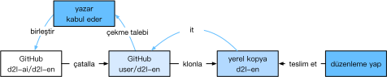

# Bu Kitaba Katkıda Bulunmak
:label:`sec_how_to_contribute`

[Okuyucular](https://github.com/d2l-ai/d2l-tr/graphs/contributors) tarafından yapılan katkılar bu kitabı geliştirmemize yardımcı olur. Bir yazım hatası, eski bir bağlantı, bir alıntıyı kaçırdığımızı düşündüğünüz, kodun zarif görünmediği veya bir açıklamanın belirsiz olduğu bir şey bulursanız, lütfen katkıda bulunun ve okuyucularımıza yardım etmemize yardımcı olun. Normal kitaplarda baskı işlemleri arasındaki (ve dolayısıyla yazım hatası düzeltmeleri arasındaki) gecikme yıllar olarak ölçülebilirken, bu kitaba bir iyileştirme eklemek genellikle saatler veya günler alır. Tüm bunlar sürüm kontrolü ve sürekli birleştirme testi nedeniyle mümkündür. Bunu yapmak için GitHub deposuna bir [çekme isteği (pull request)](https://github.com/d2l-ai/d2l-tr/pulls) göndermeniz gerekir. Çekme isteğiniz yazar tarafından kod deposuna birleştirildiğinde, bir katkıda bulunan olursunuz. 

## Küçük Metin Değişiklikleri

En yaygın katkılar bir cümleyi düzenlemek veya yazım hatalarını düzeltmektir. Kaynak dosyayı [github deposu](https://github.com/d2l-ai/d2l-en)nda bulmanızı ve dosyayı doğrudan düzenlemenizi öneririz. Örneğin, kaynak dosyayı bulmak için [Dosya bul - Find file](https://github.com/d2l-ai/d2l-tr/find/master) düğmesi (:numref:`fig_edit_file`) aracılığıyla dosyayı arayabilirsiniz, ki o da bir markdown dosyasıdır. Ardından, markdown dosyasında değişikliklerinizi yapmak için sağ üst köşedeki "Bu dosyayı düzenle - Edit this file" düğmesini tıklayın.


:width:`300px`
:label:`fig_edit_file`

İşiniz bittikten sonra, sayfa altındaki "Dosya değişikliği önerin - Propose file change" panelinde değişiklik açıklamalarınızı doldurun ve ardından "Dosya değişikliği önerin - Propose file change" düğmesini tıklayın. Değişikliklerinizi incelemek için sizi yeni bir sayfaya yönlendirecektir (:numref:`fig_git_createpr`). Her şey yolundaysa, "Çekme isteği oluştur - Create pull request" düğmesine tıklayarak bir çekme isteği gönderebilirsiniz. 

## Büyük Bir Değişiklik Önerme

Metnin veya kodun büyük bir bölümünü güncellemeyi planlıyorsanız, bu kitabın kullandığı format hakkında biraz daha fazla bilgi sahibi olmanız gerekir. Kaynak dosya denklemlere, imgelere, bölümlere ve referanslara atıfta bulunmak gibi bir dizi uzantı içeren [d2lbook](http://book.d2l.ai/user/markdown.html) paketi aracılığıyla [markdown format](https://daringfireball.net/projects/markdown/syntax)ını temel alır. Bu dosyaları açmak ve değişikliklerinizi yapmak için herhangi bir Markdown düzenleyicisini kullanabilirsiniz. 

Kodu değiştirmek isterseniz, :numref:`sec_jupyter` içinde açıklandığı gibi bu Markdown dosyalarını açmada Jupyter kullanmanızı öneririz. Böylece değişikliklerinizi çalıştırabilir ve test edebilirsiniz. Lütfen değişikliklerinizi göndermeden önce tüm çıktıları temizlemeyi unutmayın, CI sistemimiz çıktı üretmek için güncellediğiniz bölümleri yürütecektir. 

Bazı bölümler birden çok çerçeve uygulamasını destekleyebilir, belirli bir çerçeveyi etkinleştirmek için `d2lbook`'ü kullanabilirsiniz, böylece diğer çerçeve uygulamaları Markdown kod blokları haline gelir ve Jupyter'de "Run All - Tümünü Çalıştır" yaptığınızda yürütülmez. Başka bir deyişle, önce `d2lbook`'ü çalıştırarak yükleyin

```bash
pip install git+https://github.com/d2l-ai/d2l-book
```

Daha sonra `d2l-tr`'in kök dizininde, aşağıdaki komutlardan birini çalıştırarak belirli bir uygulamayı etkinleştirebilirsiniz:

```bash
d2lbook activate mxnet chapter_multilayer-perceptrons/mlp-scratch.md
d2lbook activate pytorch chapter_multilayer-perceptrons/mlp-scratch.md
d2lbook activate tensorflow chapter_multilayer-perceptrons/mlp-scratch.md
```

Değişikliklerinizi göndermeden önce lütfen tüm kod bloğu çıktılarını temizleyin ve hepsini etkinleştirin:

```bash
d2lbook activate all chapter_multilayer-perceptrons/mlp-scratch.md
```

Varsayılan MXNet olan uygulama için değil de, olmayanlar için yeni bir kod bloğu eklerseniz, bu bloğun başlangıç satırını işaretlemek için lütfen `#@tab` kullanın. Örneğin, bir PyTorch kod bloğu için `#@tab pytorch`, bir TensorFlow kod bloğu için `#@tab tensorflow` veya tüm uygulamalarda paylaşılan bir kod bloğu için `#@tab all` kullanın. Daha fazla bilgi için [d2lbook](http://book.d2l.ai/user/code_tabs.html) adresine başvurabilirsiniz.

## Yeni Bölüm veya Yeni Çerçeve Uygulaması Ekleme

Eğer, mesela pekiştirmeli öğrenme gibi, yeni bir bölüm oluşturmak veya, TensorFlow gibi, yeni çerçevelerin uygulamalarını eklemek istiyorsanız, lütfen önce e-posta göndererek veya [github meseleleri (github issues)](https://github.com/d2l-ai/d2l-tr/issues)'ni kullanarak yazarlarla iletişime geçin. 

## Büyük Değişiklik Gönderme

Büyük bir değişiklik yapmak için standart `git` sürecini kullanmanızı öneririz. Özetle, süreç :numref:`fig_contribute` içinde açıklandığı gibi çalışır. 


:label:`fig_contribute`

Sizi basamaklardan ayrıntılı olarak geçireceğiz. Git'i zaten biliyorsanız bu bölümü atlayabilirsiniz. Somutluk için katkıda bulunanın kullanıcı adının “astonzhang” olduğunu varsayıyoruz. 

### Git Yükleme

Git açık kaynak kitabı, [Git'in nasıl kurulacağını](https://git-scm.com/book/en/v2) açıklar. Bu genellikle Ubuntu Linux'ta `apt install git` üzerinden, macOS'e Xcode geliştirici araçlarını yükleyerek veya GitHub'ın [(desktop client) masaüstü istemci](https://desktop.github.com)sini kullanarak çalışır. GitHub hesabınız yoksa, almak için kaydolmanız gerekir. 

### GitHub'da Oturum Açma

Kitabın kod deposunun [adres](https://github.com/d2l-ai/d2l-tr/)ini tarayıcınıza girin. Bu kitabın deposunun bir kopyasını yapmak için :numref:`fig_git_fork` figürünün sağ üst tarafındaki kırmızı kutudaki `Fork (Çatalla)` düğmesine tıklayın. Bu artık *sizin kopya*nız ve istediğiniz şekilde değiştirebilirsiniz. 


:width:`700px`
:label:`fig_git_fork`

Şimdi, bu kitabın kod deposu, :numref:`fig_git_forked` ekran görüntüsünün sol üst tarafında gösterilen `astonzhang/d2l-en` gibi kullanıcı adınıza çatallanacaktır (yani kopyalanacaktır). 


:width:`700px`
:label:`fig_git_forked`

### Depoyu Klonlama

Depoyu klonlamak için (yani yerel bir kopya yapmak için) depo adresini almamız gerekir. :numref:`fig_git_clone` içindeki yeşil düğme bunu gösterir. Bu çatalı daha uzun süre tutmaya karar verirseniz, yerel kopyanızın ana depoyla güncel olduğundan emin olun. Şimdilik başlamak için :ref:`chap_installation` içindeki talimatları izleyin. Temel fark, şu anda deponun *kendi çatalınızı* indiriyor olmanızdır. 


:width:`700px`
:label:`fig_git_clone`

```
# your_github_username yerine kendi GitHub kullanıcı adınızı yazınız. 
git clone https://github.com/your_github_username/d2l-tr.git
```

### Kitabı Düzenleme ve İtme

Şimdi kitabı düzenleme zamanı. :numref:`sec_jupyter` içindeki talimatları izleyerek not defterlerini Jupyter'da düzenlemek en iyisidir. Değişiklikleri yapın ve bunların iyi olup olmadığını kontrol edin. `~/d2l-tr/chapter_appendix_tools/how-to-contribute.md` dosyasında bir yazım hatası değiştirdiğimizi varsayalım. Daha sonra hangi dosyaları değiştirdiğinizi kontrol edebilirsiniz: 

Bu noktada Git, `chapter_appendix_tools/how-to-contribute.md` dosyasının değiştirildiğini soracaktır.

```
mylaptop:d2l-en me$ git status
On branch master
Your branch is up-to-date with 'origin/master'.

Changes not staged for commit:
  (use "git add <file>..." to update what will be committed)
  (use "git checkout -- <file>..." to discard changes in working directory)

	modified:   chapter_appendix_tools/how-to-contribute.md
```

İstediğiniz şeyin bu olduğunu onayladıktan sonra aşağıdaki komutu çalıştırın:

```
git add chapter_appendix_tools/how-to-contribute.md
git commit -m 'git belgelerindeki yazım hatasını düzelt'
git push
```

Değiştirilen kod daha sonra arşivdeki kişisel çatalınızda olacaktır. Değişikliğinizin eklenmesini talep etmek için, kitabın resmi deposu için bir çekme isteği oluşturmanız gerekir. 

### Çekme Talebi

:numref:`fig_git_newpr`'te gösterildiği gibi, GitHub'daki depo çatalınıza gidin ve “Yeni çekme isteği” ni seçin. Bu, düzenlemeleriniz ile kitabın ana deposunda mevcut olan değişiklikleri gösteren bir ekran açılacaktır. 


:width:`700px`
:label:`fig_git_newpr`

### Çekme Talebi Gönderme

Son olarak, :numref:`fig_git_createpr` içinde gösterildiği gibi düğmeye tıklayarak bir çekme talebi gönderin. Çekme talebinde yaptığınız değişiklikleri açıkladığınızdan emin olun. Bu, yazarların gözden geçirmesini ve kitapla birleştirmesini kolaylaştıracaktır. Değişikliklere bağlı olarak, bu hemen kabul edilebilir, reddedilebilir veya daha büyük olasılıkla değişiklikler hakkında bazı geri bildirimler alırsınız. Onları bir kez dahil ettikten sonra, herşey yolundadır. 


:width:`700px`
:label:`fig_git_createpr`

Çekme talebiniz ana depodaki talepler listesinde görünür. Hızlı bir şekilde işlemek için her türlü çabayı göstereceğiz. 

## Özet

* Bu kitaba katkıda bulunmak için GitHub'ı kullanabilirsiniz.
* Küçük değişiklikler için doğrudan GitHub'daki dosyayı düzenleyebilirsiniz.
* Büyük bir değişiklik için lütfen depoyu çatallayın, yerel olarak düzenleyin ve yalnızca hazır olduğunuzda katkıda bulunun.
* Çekme talepleri, katkıların nasıl gruplandırıldığıdır. Anlamayı ve birleştirmeyi zorlaştırdığı için çok büyük çekme talepleri göndermemeye çalışın. Birkaç tane daha küçük olarak gönderseniz iyi olur.

## Alıştırmalar

1. `d2l-tr` deposunu yıldızlayın ve çatallayın.
1. Geliştirilmesi gereken bir kod bulun ve çekme talebi gönderin.
1. Kaçırdığımız bir referansı bulun ve çekme isteği gönderin.
1. Yeni bir dal kullanarak çekme talebi oluşturmak genellikle daha iyi bir uygulamadır. [Git dallandırma (git branching)](https://git-scm.com/book/en/v2/Git-Branching-Branches-in-a-Nutshell) ile nasıl yapılacağını öğrenin.

[Tartışmalar](https://discuss.d2l.ai/t/426)
