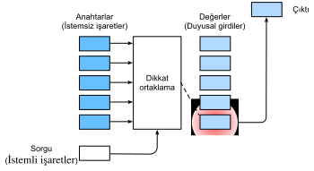

# Dikkat Iptolar
:label:`sec_attention-cues`

Bu kitaba gösterdiğiniz ilgi için teşekkür ederiz. Dikkat kıt bir kaynaktır: Şu anda bu kitabı okuyor ve gerisini görmezden geliyorsunuz. Böylece, paraya benzer şekilde, dikkatiniz bir fırsat maliyeti ile ödeniyor. Şu anda dikkat yatırımınızın değerli olmasını sağlamak için, güzel bir kitap üretmek için dikkatimizi dikkatli bir şekilde göstermeye son derece motive olduk. Dikkat, hayatın kemerindeki kilit taştır ve herhangi bir işin istisnalizminin anahtarını tutar. 

Ekonomi, kıt kaynakların tahsisini incelediğinden, insanların dikkatinin değiştirilebilecek sınırlı, değerli ve kıt bir mal olarak ele alındığı dikkat ekonomisi çağındayız. Üzerinde yararlanmak için çok sayıda iş modeli geliştirilmiştir. Müzik veya video akışı hizmetlerinde ya reklamlarına dikkat ediyoruz ya da bunları gizlemek için para ödüyoruz. Çevrimiçi oyunlar dünyasında büyüme için, ya yeni oyuncular çeken savaşlara katılmaya dikkat ediyoruz ya da anında güçlü olmak için para ödüyoruz. Hiçbir şey bedavaya gelmez. 

Sonuçta, çevremizdeki bilgiler kıt değildir, dikkat edilir. Görsel bir sahneyi incelerken, optik sinirimiz saniyede $10^8$ bit sırasına göre bilgi alır ve beynimizin tam olarak işleyebileceğini çok aşar. Neyse ki, atalarımız deneyimlerimizden (veri olarak da bilinir) öğrenmişlerdi ki, *tüm duyusal girişlerin eşit yaratılmamıştır*. İnsanlık tarihi boyunca, ilgiyi sadece küçük bir bilgiye yöneltme yeteneği, beynimizin kaynakları hayatta kalmak, büyümek ve avcıları, avları ve arkadaşları tespit etmek gibi sosyalleşmek için daha akıllıca tahsis etmesine olanak sağladı. 

## Biyolojide Dikkat İptaçları

Görsel dünyada dikkatimizin nasıl dağıtıldığını açıklamak için iki bileşenli bir çerçeve ortaya çıktı ve yaygındır. Bu fikir 1890'larda “Amerikan psikolojisinin babası” :cite:`James.2007` olarak kabul edilen William James'e dayanmaktadır. Bu çerçevede, konular seçici olarak dikkatin spot ışığını hem *istemsiz işaret* hem de *istemli işaret* kullanarak yönlendirir. 

İsteğe bağlı olmayan işaret, ortamdaki nesnelerin dikkat çekiciliğine ve dikkat çekiciliğine dayanır. Önünüzde beş nesne olduğunu düşünün: bir gazete, bir araştırma kağıdı, bir fincan kahve, bir defter ve :numref:`fig_eye-coffee`'teki gibi bir kitap. Tüm kağıt ürünleri siyah beyaz basılırken kahve fincanı kırmızıdır. Başka bir deyişle, bu kahve, bu görsel ortamda kendiliğinden belirgin ve göze çarpıyor, otomatik ve istemeden dikkat çekiyor. Böylece fovea'yı (görme keskinliğinin en yüksek olduğu makula merkezi) :numref:`fig_eye-coffee`'te gösterildiği gibi kahvenin üzerine getirirsiniz. 


:width:`400px`
:label:`fig_eye-coffee`

Kahve içtikten sonra kafeinli olursunuz ve kitap okumak istersiniz. Yani başınızı çevirin, gözlerinizi yeniden odaklayın ve :numref:`fig_eye-book`'te tasvir edildiği gibi kitaba bakın. Kahve, seğilliğe göre seçme konusunda sizi önyargılı :numref:`fig_eye-coffee`'teki durumdan farklı olarak, bu görev bağımlı durumda bilişsel ve istemli kontrol altında kitabı seçersiniz. Değişken seçim kriterlerine dayalı istemli işaret kullanarak, bu dikkat biçimi daha kasıtlıdır. Ayrıca deneğin gönüllü çabaları ile daha güçlü. 


:width:`400px`
:label:`fig_eye-book`

## Sorgular, Anahtarlar ve Değerler

Dikkatli konuşlandırmayı açıklayan istemsiz ve istemli dikkat işaretlerinden esinlenerek, aşağıda bu iki dikkat işaretini birleştirerek dikkat mekanizmalarını tasarlamak için bir çerçeve anlatacağız. 

Başlangıç olarak, yalnızca istemsiz ibarelerin mevcut olduğu daha basit durumu göz önünde bulundurun. Duyusal girişler üzerinde önyargı seçimi yapmak için, parametreli tam bağlı bir katman veya hatta parameterize edilmemiş maksimum veya ortalama havuzlama kullanabiliriz. 

Bu nedenle, dikkat mekanizmalarını tam bağlı katmanlardan veya havuzlama katmanlarından ayıran şey, istemli işlerin dahil edilmesidir. Dikkat mekanizmaları bağlamında, istemli işaretlere *sorgular* olarak atıfta bulunuyoruz. Herhangi bir sorgu göz önüne alındığında, dikkat mekanizmaları duyusal girişler üzerinde önyargı seçimi (örneğin, ara özellik gösterimleri) *dikkat havuzu* yoluyla. Bu duyusal girişlere dikkat mekanizmaları bağlamında *değerler* denir. Daha genel olarak, her değer bir *anahtar* ile eşleştirilir ve bu durum, bu duyusal girdinin istemsiz işareti olarak düşünülebilir. :numref:`fig_qkv`'te gösterildiği gibi, verilen sorgu (istemli işaret), değerler (duyusal girişler) üzerinde önyargı seçimini yönlendiren anahtarlarla (isteğe bağlı olmayan işaretler) etkileşime girebilmesi için dikkat havuzunu tasarlayabiliriz. 


:label:`fig_qkv`

Dikkat mekanizmalarının tasarımı için birçok alternatif olduğunu unutmayın. Örneğin, :cite:`Mnih.Heess.Graves.ea.2014` takviye öğrenme yöntemleri kullanılarak eğitilebilen diferansiyelleştirilemeyen bir dikkat modeli tasarlayabiliriz. :numref:`fig_qkv`'teki çerçevenin hakimiyeti göz önüne alındığında, bu çerçevedeki modeller bu bölümdeki dikkatimizin merkezi olacak. 

## Dikkat Görselleştirme

Ortalama havuzlama ağırlıklarının tekdüze olduğu ağırlıklı bir giriş ortalaması olarak değerlendirilebilir. Pratikte dikkat biriktirme, verilen sorgu ile farklı anahtarlar arasında ağırlıkların hesaplandığı ağırlıklı ortalamayı kullanarak değerleri toplar.

```{.python .input}
from d2l import mxnet as d2l
from mxnet import np, npx
npx.set_np()
```

```{.python .input}
#@tab pytorch
from d2l import torch as d2l
import torch
```

```{.python .input}
#@tab tensorflow
from d2l import tensorflow as d2l
import tensorflow as tf
```

Dikkat ağırlıklarını görselleştirmek için `show_heatmaps` işlevini tanımlıyoruz. Girişi `matrices` şekle sahiptir (görüntüleme için satır sayısı, ekran için sütun sayısı, sorgu sayısı, anahtar sayısı).

```{.python .input}
#@tab all
#@save
def show_heatmaps(matrices, xlabel, ylabel, titles=None, figsize=(2.5, 2.5),
                  cmap='Reds'):
    """Show heatmaps of matrices."""
    d2l.use_svg_display()
    num_rows, num_cols = matrices.shape[0], matrices.shape[1]
    fig, axes = d2l.plt.subplots(num_rows, num_cols, figsize=figsize,
                                 sharex=True, sharey=True, squeeze=False)
    for i, (row_axes, row_matrices) in enumerate(zip(axes, matrices)):
        for j, (ax, matrix) in enumerate(zip(row_axes, row_matrices)):
            pcm = ax.imshow(d2l.numpy(matrix), cmap=cmap)
            if i == num_rows - 1:
                ax.set_xlabel(xlabel)
            if j == 0:
                ax.set_ylabel(ylabel)
            if titles:
                ax.set_title(titles[j])
    fig.colorbar(pcm, ax=axes, shrink=0.6);
```

Gösterim için, dikkat ağırlığının yalnızca sorgu ve anahtar aynı olduğunda bir olduğu basit bir durum düşünün; aksi takdirde sıfırdır.

```{.python .input}
#@tab all
attention_weights = d2l.reshape(d2l.eye(10), (1, 1, 10, 10))
show_heatmaps(attention_weights, xlabel='Keys', ylabel='Queries')
```

Sonraki bölümlerde, dikkat ağırlıklarını görselleştirmek için sıklıkla bu işlevi çağıracağız. 

## Özet

* İnsanın dikkati sınırlı, değerli ve kıt bir kaynaktır.
* Denekler hem istemsiz hem de istemli işaretleri kullanarak dikkati seçici olarak yönlendirir. Birincisi, tükürüğe dayanır ve ikincisi görev bağımlıdır.
* Dikkat mekanizmaları, istemli uçların eklenmesi nedeniyle tamamen bağlı katmanlardan veya havuzlama katmanlarından farklıdır.
* Dikkat mekanizmaları, sorguları (istemli ibreler) ve anahtarları (istemli olmayan ibreler) içeren dikkat havuzlama yoluyla değerler (duyusal girişler) üzerinde önyargı seçimi. Anahtarlar ve değerler eşleştirilir.
* Sorgular ve anahtarlar arasındaki dikkat ağırlıklarını görselleştirebiliriz.

## Egzersizler

1. Makine çevirisinde belirteç tarafından bir dizi belirteci kodunu çözerken istemli işaret ne olabilir? İsteğe bağlı olmayan sinyaller ve duyusal girişler nelerdir?
1. Rastgele bir $10 \times 10$ matrisi oluşturun ve her satırın geçerli bir olasılık dağılımı olduğundan emin olmak için softmax işlemini kullanın. Çıktı dikkat ağırlıklarını görselleştirin.

:begin_tab:`mxnet`
[Discussions](https://discuss.d2l.ai/t/1596)
:end_tab:

:begin_tab:`pytorch`
[Discussions](https://discuss.d2l.ai/t/1592)
:end_tab:

:begin_tab:`tensorflow`
[Discussions](https://discuss.d2l.ai/t/1710)
:end_tab:
