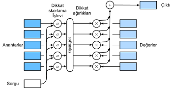

# Dikkat Puanlama Fonksiyonları
:label:`sec_attention-scoring-functions`

:numref:`sec_nadaraya-watson` içinde, sorgular ve anahtarlar arasındaki etkileşimleri modellemek için bir Gauss çekirdeği kullandık. :eqref:`eq_nadaraya-watson-gaussian` denkleminde Gauss çekirdeğinin üssüne bir *dikkat puanlama fonksiyonu* (veya kısaca *puanlama fonksiyonu*) olarak muamele edilerek, bu fonksiyonun sonuçları temelde bir softmaks işlemine beslendi. Sonuç olarak, anahtarlarla eşleştirilmiş değerler üzerinde bir olasılık dağılımı (dikkat ağırlıkları) elde ettik. Sonunda, dikkat ortaklamasının çıktısı, bu dikkat ağırlıklarına dayanan değerlerin ağırlıklı bir toplamıdır. 

Üst seviyede, :numref:`fig_qkv` şeklindeki dikkat mekanizmalarının çerçevesini oluşturmak için yukarıdaki algoritmayı kullanabiliriz. $a$ ile dikkat ortaklama işlevini gösteren :numref:`fig_attention_output` şekli, dikkat havuzlama çıktısının ağırlıklı bir değer toplamı olarak nasıl hesaplanabileceğini göstermektedir. Dikkat ağırlıkları bir olasılık dağılımı olduğundan, ağırlıklı toplamı esas olarak ağırlıklı bir ortalamadır. 


:label:`fig_attention_output`

Matematiksel olarak, $\mathbf{q} \in \mathbb{R}^q$ sorgumuz ve $m$ $(\mathbf{k}_1, \mathbf{v}_1), \ldots, (\mathbf{k}_m, \mathbf{v}_m)$ anahtar-değer çiftlerimiz olduğunu varsayalım, öyle ki $\mathbf{k}_i \in \mathbb{R}^k$ ve $\mathbf{v}_i \in \mathbb{R}^v$. Dikkat ortaklama $f$, değerlerin ağırlıklı bir toplamı olarak örneklendirilir: 

$$f(\mathbf{q}, (\mathbf{k}_1, \mathbf{v}_1), \ldots, (\mathbf{k}_m, \mathbf{v}_m)) = \sum_{i=1}^m \alpha(\mathbf{q}, \mathbf{k}_i) \mathbf{v}_i \in \mathbb{R}^v,$$
:eqlabel:`eq_attn-pooling`

$\mathbf{q}$ ve anahtar $\mathbf{k}_i$ için dikkat ağırlığı (skaler), iki vektörü bir skalere eşleyen bir dikkat puanlama işlevi $a$'nın softmaks işlemi ile hesaplanır: 

$$\alpha(\mathbf{q}, \mathbf{k}_i) = \mathrm{softmax}(a(\mathbf{q}, \mathbf{k}_i)) = \frac{\exp(a(\mathbf{q}, \mathbf{k}_i))}{\sum_{j=1}^m \exp(a(\mathbf{q}, \mathbf{k}_j))} \in \mathbb{R}.$$
:eqlabel:`eq_attn-scoring-alpha`

Gördüğümüz gibi, $a$ dikkat puanlama fonksiyonunun farklı seçimleri  farklı dikkat ortaklama davranışlarına yol açar. Bu bölümde, daha sonra daha gelişmiş dikkat mekanizmaları geliştirmek için kullanacağımız iki popüler puanlama fonksiyonunu tanıtıyoruz.

```{.python .input}
import math
from d2l import mxnet as d2l
from mxnet import np, npx
from mxnet.gluon import nn
npx.set_np()
```

```{.python .input}
#@tab pytorch
from d2l import torch as d2l
import math
import torch
from torch import nn
```

```{.python .input}
#@tab tensorflow
from d2l import tensorflow as d2l
import tensorflow as tf
```

## [**Maskeli Softmaks İşlemi**]

Daha önce de belirttiğimiz gibi, olasılık dağılımını dikkat ağırlıkları olarak elde etmek için bir softmaks işlemi kullanılır. Bazı durumlarda, tüm değerler dikkat ortaklamasına beslenmemelidir. Örneğin, :numref:`sec_machine_translation` içinde verimli minigrup işleme için, bazı metin dizileri anlam taşımayan özel belirteçlerle doldurulmuştur. Değerler olarak yalnızca anlamlı belirteçler üzerinde bir dikkat ortaklamak için, softmaks hesaplarken bu belirtilen aralığın ötesinde olanları filtrelemek için geçerli bir sıra uzunluğu (belirteç sayısı olarak) belirtebiliriz. Bu şekilde, geçerli uzunluğun ötesinde herhangi bir değerin sıfır olarak maskelendiği aşağıdaki `masked_softmax` işlevinde böyle bir *maskelenmiş softmaks işlemi* uygulayabiliriz.

```{.python .input}
#@save
def masked_softmax(X, valid_lens):
    """Son eksendeki öğeleri maskeleyerek softmax işlemini gerçekleştirin."""
    # `X`: 3B tensör, `valid_lens`: 1B veya 2B tensör
    if valid_lens is None:
        return npx.softmax(X)
    else:
        shape = X.shape
        if valid_lens.ndim == 1:
            valid_lens = valid_lens.repeat(shape[1])
        else:
            valid_lens = valid_lens.reshape(-1)
        # Son eksende, maskelenmiş öğeleri, üsleri 0 olan çok büyük bir 
        # negatif değerle değiştirin
        X = npx.sequence_mask(X.reshape(-1, shape[-1]), valid_lens, True,
                              value=-1e6, axis=1)
        return npx.softmax(X).reshape(shape)
```

```{.python .input}
#@tab pytorch
#@save
def masked_softmax(X, valid_lens):
    """Son eksendeki öğeleri maskeleyerek softmax işlemini gerçekleştirin."""
    # `X`: 3B tensör, `valid_lens`: 1B veya 2B tensör
    if valid_lens is None:
        return nn.functional.softmax(X, dim=-1)
    else:
        shape = X.shape
        if valid_lens.dim() == 1:
            valid_lens = torch.repeat_interleave(valid_lens, shape[1])
        else:
            valid_lens = valid_lens.reshape(-1)
        # Son eksende, maskelenmiş öğeleri, üsleri 0 olan çok büyük bir 
        # negatif değerle değiştirin
        X = d2l.sequence_mask(X.reshape(-1, shape[-1]), valid_lens,
                              value=-1e6)
        return nn.functional.softmax(X.reshape(shape), dim=-1)
```

```{.python .input}
#@tab tensorflow
#@save
def masked_softmax(X, valid_lens):
    """Son eksendeki öğeleri maskeleyerek softmax işlemini gerçekleştirin."""
    # `X`: 3B tensör, `valid_lens`: 1B veya 2B tensör
    if valid_lens is None:
        return tf.nn.softmax(X, axis=-1)
    else:
        shape = X.shape
        if len(valid_lens.shape) == 1:
            valid_lens = tf.repeat(valid_lens, repeats=shape[1])
            
        else:
            valid_lens = tf.reshape(valid_lens, shape=-1)
        # Son eksende, maskelenmiş öğeleri, üsleri 0 olan çok büyük bir 
        # negatif değerle değiştirin 
        X = d2l.sequence_mask(tf.reshape(X, shape=(-1, shape[-1])), valid_lens, value=-1e6)    
        return tf.nn.softmax(tf.reshape(X, shape=shape), axis=-1)
```

[**Bu işlevin nasıl çalıştığını göstermek**] için, bu iki örnek için geçerli uzunlukların sırasıyla iki ve üç olduğu iki tane $2 \times 4$ matris örneğinden oluşan bir minigrup düşünün. Maskelenmiş softmaks işleminin bir sonucu olarak, geçerli uzunlukların dışındaki değerlerin tümü sıfır olarak maskelenir.

```{.python .input}
masked_softmax(np.random.uniform(size=(2, 2, 4)), d2l.tensor([2, 3]))
```

```{.python .input}
#@tab pytorch
masked_softmax(torch.rand(2, 2, 4), torch.tensor([2, 3]))
```

```{.python .input}
#@tab tensorflow
masked_softmax(tf.random.uniform(shape=(2, 2, 4)), tf.constant([2, 3]))
```

Benzer şekilde, her matris örneğindeki her satır için geçerli uzunlukları belirtmede iki boyutlu bir tensör de kullanabiliriz.

```{.python .input}
masked_softmax(np.random.uniform(size=(2, 2, 4)),
               d2l.tensor([[1, 3], [2, 4]]))
```

```{.python .input}
#@tab pytorch
masked_softmax(torch.rand(2, 2, 4), d2l.tensor([[1, 3], [2, 4]]))
```

```{.python .input}
#@tab tensorflow
masked_softmax(tf.random.uniform((2, 2, 4)), tf.constant([[1, 3], [2, 4]]))
```

## [**Toplayıcı Dikkat**]
:label:`subsec_additive-attention`

Genel olarak, sorgular ve anahtarlar farklı uzunluklarda vektörler olduğunda, puanlama işlevi olarak toplayıcı dikkat kullanabiliriz. Bir sorgu $\mathbf{q} \in \mathbb{R}^q$ ve bir anahtar $\mathbf{k} \in \mathbb{R}^k$, *toplayıcı dikkat* puanlama fonksiyonu göz önüne alındığında şöyledir:

$$a(\mathbf q, \mathbf k) = \mathbf w_v^\top \text{tanh}(\mathbf W_q\mathbf q + \mathbf W_k \mathbf k) \in \mathbb{R},$$
:eqlabel:`eq_additive-attn`

burada $\mathbf W_q\in\mathbb R^{h\times q}$, $\mathbf W_k\in\mathbb R^{h\times k}$ ve $\mathbf w_v\in\mathbb R^{h}$  öğrenilebilir parametrelerdir. :eqref:`eq_additive-attn` denklemine eşdeğer olarak, sorgu ve anahtar bitiştirilir ve gizli birim sayısı $h$ hiper parametresi olan bir tek gizli katmanlı MLP'ye beslenir. Etkinleştirme fonksiyonu olarak $\tanh$'yi kullanarak ve ek girdi terimlerini devre dışı bırakarak, aşağıdakilere toplayıcı dikkat uyguluyoruz.

```{.python .input}
#@save
class AdditiveAttention(nn.Block):
    """Additive attention."""
    def __init__(self, num_hiddens, dropout, **kwargs):
        super(AdditiveAttention, self).__init__(**kwargs)
        # Diğer eksenlerin şekillerinin aynı kalması için yalnızca son
        # ekseni dönüştürmek için `flatten=False` kullanın
        self.W_k = nn.Dense(num_hiddens, use_bias=False, flatten=False)
        self.W_q = nn.Dense(num_hiddens, use_bias=False, flatten=False)
        self.w_v = nn.Dense(1, use_bias=False, flatten=False)
        self.dropout = nn.Dropout(dropout)

    def forward(self, queries, keys, values, valid_lens):
        queries, keys = self.W_q(queries), self.W_k(keys)
        # Boyut genişletmeden sonra, `queries`'in şekli: (`batch_size`, 
        # sorgu sayısı, 1, `num_hiddens`) ve `keys`'in şekli: (`batch_size`, 1, 
        # anahtar/değer çiftlerinin sayısı,`num_hiddens`). 
        # Yayınlarken onları toplayın.
        features = np.expand_dims(queries, axis=2) + np.expand_dims(
            keys, axis=1)
        features = np.tanh(features)
        # `self.w_v`nin sadece bir çıktısı var, bu yüzden şekilden 
        # son tek boyutlu girişi kaldırıyoruz. `scores`'ın şekli (`batch_size`,
        # sorgu sayısı, anahtar/değer çifti sayısı)
        scores = np.squeeze(self.w_v(features), axis=-1)
        self.attention_weights = masked_softmax(scores, valid_lens)
        # `values`'in şekli: (`batch_size`, anahtar/değer çiftlerinin sayısı, 
        # değer boyutu)
        return npx.batch_dot(self.dropout(self.attention_weights), values)
```

```{.python .input}
#@tab pytorch
#@save
class AdditiveAttention(nn.Module):
    """Additive attention."""
    def __init__(self, key_size, query_size, num_hiddens, dropout, **kwargs):
        super(AdditiveAttention, self).__init__(**kwargs)
        self.W_k = nn.Linear(key_size, num_hiddens, bias=False)
        self.W_q = nn.Linear(query_size, num_hiddens, bias=False)
        self.w_v = nn.Linear(num_hiddens, 1, bias=False)
        self.dropout = nn.Dropout(dropout)

    def forward(self, queries, keys, values, valid_lens):
        queries, keys = self.W_q(queries), self.W_k(keys)
        # Boyut genişletmeden sonra, `queries`'in şekli: (`batch_size`, 
        # sorgu sayısı, 1, `num_hiddens`) ve `keys`'in şekli: (`batch_size`, 1, 
        # anahtar/değer çiftlerinin sayısı,`num_hiddens`). 
        # Yayınlarken onları toplayın.
        features = queries.unsqueeze(2) + keys.unsqueeze(1)
        features = torch.tanh(features)
        # `self.w_v`nin sadece bir çıktısı var, bu yüzden şekilden 
        # son tek boyutlu girişi kaldırıyoruz. `scores`'ın şekli (`batch_size`,
        # sorgu sayısı, anahtar/değer çifti sayısı)
        scores = self.w_v(features).squeeze(-1)
        self.attention_weights = masked_softmax(scores, valid_lens)
        # `values`'in şekli: (`batch_size`, anahtar/değer çiftlerinin sayısı, 
        # değer boyutu)
        return torch.bmm(self.dropout(self.attention_weights), values)
```

```{.python .input}
#@tab tensorflow
#@save
class AdditiveAttention(tf.keras.layers.Layer):
    """Additive attention."""
    def __init__(self, key_size, query_size, num_hiddens, dropout, **kwargs):
        super().__init__(**kwargs)
        self.W_k = tf.keras.layers.Dense(num_hiddens, use_bias=False)
        self.W_q = tf.keras.layers.Dense(num_hiddens, use_bias=False)
        self.w_v = tf.keras.layers.Dense(1, use_bias=False)
        self.dropout = tf.keras.layers.Dropout(dropout)
        
    def call(self, queries, keys, values, valid_lens, **kwargs):
        queries, keys = self.W_q(queries), self.W_k(keys)
        # Boyut genişletmeden sonra, `queries`'in şekli: (`batch_size`, 
        # sorgu sayısı, 1, `num_hiddens`) ve `keys`'in şekli: (`batch_size`, 1, 
        # anahtar/değer çiftlerinin sayısı,`num_hiddens`). 
        # Yayınlarken onları toplayın.
        features = tf.expand_dims(queries, axis=2) + tf.expand_dims(
            keys, axis=1)
        features = tf.nn.tanh(features)
        # `self.w_v`nin sadece bir çıktısı var, bu yüzden şekilden 
        # son tek boyutlu girişi kaldırıyoruz. `scores`'ın şekli (`batch_size`,
        # sorgu sayısı, anahtar/değer çifti sayısı)
        scores = tf.squeeze(self.w_v(features), axis=-1)
        self.attention_weights = masked_softmax(scores, valid_lens)
        # `values`'in şekli: (`batch_size`, anahtar/değer çiftlerinin sayısı, 
        # değer boyutu)
        return tf.matmul(self.dropout(
            self.attention_weights, **kwargs), values)
```

[**Yukarıdaki 'AdditiveAttention' sınıfını**] sorguların, anahtarların ve değerlerin şekillerinin (toplu iş boyutu, adım sayısı veya belirteçlerdeki sıra uzunluğu, öznitelik boyutu) sırasıyla ($2$, $1$, $20$), ($2$, $10$, $2$) ve ($2$, $10$, $4$) olduğu bir basit örnek ile gösterelim.

```{.python .input}
queries, keys = d2l.normal(0, 1, (2, 1, 20)), d2l.ones((2, 10, 2))
# `values` minigrubundaki iki değer matrisi aynıdır
values = np.arange(40).reshape(1, 10, 4).repeat(2, axis=0)
valid_lens = d2l.tensor([2, 6])

attention = AdditiveAttention(num_hiddens=8, dropout=0.1)
attention.initialize()
attention(queries, keys, values, valid_lens)
```

```{.python .input}
#@tab pytorch
queries, keys = d2l.normal(0, 1, (2, 1, 20)), d2l.ones((2, 10, 2))
# `values` minigrubundaki iki değer matrisi aynıdır
values = torch.arange(40, dtype=torch.float32).reshape(1, 10, 4).repeat(
    2, 1, 1)
valid_lens = d2l.tensor([2, 6])

attention = AdditiveAttention(key_size=2, query_size=20, num_hiddens=8,
                              dropout=0.1)
attention.eval()
attention(queries, keys, values, valid_lens)
```

```{.python .input}
#@tab tensorflow
queries, keys = tf.random.normal(shape=(2, 1, 20)), tf.ones((2, 10, 2))
# `values` minigrubundaki iki değer matrisi aynıdır
values = tf.repeat(tf.reshape(
    tf.range(40, dtype=tf.float32), shape=(1, 10, 4)), repeats=2, axis=0)
valid_lens = tf.constant([2, 6])

attention = AdditiveAttention(key_size=2, query_size=20, num_hiddens=8,
                              dropout=0.1)
attention(queries, keys, values, valid_lens, training=False)
```

Her ne kadar toplayıcı dikkat öğrenilebilir parametreler içerse de, bu örnekte her anahtar aynı olduğundan, önceden düzenlenmiş geçerli uzunluklara göre belirlenen [**dikkat ağırlıkları**] tekdüzedir.

```{.python .input}
#@tab all
d2l.show_heatmaps(d2l.reshape(attention.attention_weights, (1, 1, 2, 10)),
                  xlabel='Keys', ylabel='Queries')
```

## [**Ölçeklendirilmiş Nokta Çarpımı Dikkati**]

Puanlama fonksiyonu için hesaplama açısından daha verimli bir tasarım basitçe nokta çarpımı olabilir. Ancak, nokta çarpımı işlemi hem sorgu hem de anahtarın aynı vektör uzunluğuna sahip olmasını gerektirir, yani $d$. Sorgu ve anahtarın tüm öğelerinin sıfır ortalama ve birim varyanslı bağımsız rasgele değişkenler olduğunu varsayalım. Her iki vektörün nokta çarpımının sıfır ortalama ve $d$ varyansı vardır. Nokta çarpımının varyansının vektör uzunluğundan bağımsız olarak hala bir kalmasını sağlamak için *ölçeklendirilmiş nokta çarpımı dikkati* puanlama işlevi 

$$a(\mathbf q, \mathbf k) = \mathbf{q}^\top \mathbf{k}  /\sqrt{d}$$

nokta çarpımını $\sqrt{d}$ ile böler. Uygulamada, genellikle verimlilik için, sorguların ve anahtarların $d$ uzunluğunda ve değerlerin $v$ uzunluğunda olduğu $n$ adet sorgu ve $m$ adet anahtar/değer çifti için dikkat hesaplama gibi, minigruplar halinde düşünürüz. $\mathbf Q\in\mathbb R^{n\times d}$ sorgularının, $\mathbf K\in\mathbb R^{m\times d}$ anahtarlarının ve $\mathbf V\in\mathbb R^{m\times v}$ değerlerinin ölçeklendirilmiş nokta çarpımı dikkati şöyledir

$$ \mathrm{softmax}\left(\frac{\mathbf Q \mathbf K^\top }{\sqrt{d}}\right) \mathbf V \in \mathbb{R}^{n\times v}.$$
:eqlabel:`eq_softmax_QK_V`

Aşağıdaki ölçeklendirilmiş nokta çarpımı dikkati uygulamasında, model düzenlileştirmesi için hattan düşürme kullanıyoruz.

```{.python .input}
#@save
class DotProductAttention(nn.Block):
    """Ölçeklendirilmiş nokta çarpım dikkati."""
    def __init__(self, dropout, **kwargs):
        super(DotProductAttention, self).__init__(**kwargs)
        self.dropout = nn.Dropout(dropout)

    # `queries`'in şekli: (`batch_size`, sorgu sayısı, `d`)
    # `keys`'in şekli: (`batch_size`, anahtar/değer çiftlerinin sayısı, `d`)
    # `values`'un şekli: (`batch_size`, anahtar/değer çiftlerinin sayısı, değer
    # boyut)
    # `valid_lens`'in şekli: (`batch_size`,) veya (`batch_size`, sorgu sayısı)
    def forward(self, queries, keys, values, valid_lens=None):
        d = queries.shape[-1]
        # keys`'in son iki boyutunu değiştirmek için "transpose_b=True` 
        # diye ayarlayın
        scores = npx.batch_dot(queries, keys, transpose_b=True) / math.sqrt(d)
        self.attention_weights = masked_softmax(scores, valid_lens)
        return npx.batch_dot(self.dropout(self.attention_weights), values)
```

```{.python .input}
#@tab pytorch
#@save
class DotProductAttention(nn.Module):
    """Ölçeklendirilmiş nokta çarpım dikkati."""
    def __init__(self, dropout, **kwargs):
        super(DotProductAttention, self).__init__(**kwargs)
        self.dropout = nn.Dropout(dropout)

    # `queries`'in şekli: (`batch_size`, sorgu sayısı, `d`)
    # `keys`'in şekli: (`batch_size`, anahtar/değer çiftlerinin sayısı, `d`)
    # `values`'un şekli: (`batch_size`, anahtar/değer çiftlerinin sayısı, değer
    # boyut)
    # `valid_lens`'in şekli: (`batch_size`,) veya (`batch_size`, sorgu sayısı)
    def forward(self, queries, keys, values, valid_lens=None):
        d = queries.shape[-1]
        # keys`'in son iki boyutunu değiştirmek için "transpose_b=True` 
        # diye ayarlayın
        scores = torch.bmm(queries, keys.transpose(1,2)) / math.sqrt(d)
        self.attention_weights = masked_softmax(scores, valid_lens)
        return torch.bmm(self.dropout(self.attention_weights), values)
```

```{.python .input}
#@tab tensorflow
#@save
class DotProductAttention(tf.keras.layers.Layer):
    """Ölçeklendirilmiş nokta çarpım dikkati."""
    def __init__(self, dropout, **kwargs):
        super().__init__(**kwargs)
        self.dropout = tf.keras.layers.Dropout(dropout)
        
    # `queries`'in şekli: (`batch_size`, sorgu sayısı, `d`)
    # `keys`'in şekli: (`batch_size`, anahtar/değer çiftlerinin sayısı, `d`)
    # `values`'un şekli: (`batch_size`, anahtar/değer çiftlerinin sayısı, değer
    # boyut)
    # `valid_lens`'in şekli: (`batch_size`,) veya (`batch_size`, sorgu sayısı)
    def call(self, queries, keys, values, valid_lens, **kwargs):
        d = queries.shape[-1]
        scores = tf.matmul(queries, keys, transpose_b=True)/tf.math.sqrt(
            tf.cast(d, dtype=tf.float32))
        self.attention_weights = masked_softmax(scores, valid_lens)
        return tf.matmul(self.dropout(self.attention_weights, **kwargs), values)
```

[**Yukarıdaki `DotProductAttention` sınıfını**] göstermek için, toplayıcı dikkat için önceki basit örnekteki aynı anahtarları, değerleri ve geçerli uzunlukları kullanıyoruz. Nokta çarpımı işlemi için, sorguların öznitelik boyutunu anahtarlarınkiyle aynı yapıyoruz.

```{.python .input}
queries = d2l.normal(0, 1, (2, 1, 2))
attention = DotProductAttention(dropout=0.5)
attention.initialize()
attention(queries, keys, values, valid_lens)
```

```{.python .input}
#@tab pytorch
queries = d2l.normal(0, 1, (2, 1, 2))
attention = DotProductAttention(dropout=0.5)
attention.eval()
attention(queries, keys, values, valid_lens)
```

```{.python .input}
#@tab tensorflow
queries = tf.random.normal(shape=(2, 1, 2))
attention = DotProductAttention(dropout=0.5)
attention(queries, keys, values, valid_lens, training=False)
```

Toplayıcı dikkat gösterimindeki gibi, `keys` herhangi bir sorgu ile ayırt edilemeyen aynı elemanı içerdiğinden, [**tekdüze dikkat ağırlıkları**] elde edilir.

```{.python .input}
#@tab all
d2l.show_heatmaps(d2l.reshape(attention.attention_weights, (1, 1, 2, 10)),
                  xlabel='Keys', ylabel='Queries')
```

## Özet

* Dikkat puanlama fonksiyonunun farklı seçeneklerinin dikkat ortaklamasının farklı davranışlarına yol açtığı ağırlıklı bir değer ortalaması olarak dikkat ortaklama çıktısını hesaplayabiliriz.
* Sorgular ve anahtarlar farklı uzunluklarda vektörler olduğunda, toplayıcı dikkat puanlama işlevini kullanabiliriz. Aynı olduklarında, ölçeklendirilmiş nokta çarpımı dikkat puanlama işlevi hesaplama açısından daha verimlidir.

## Alıştırmalar

1. Basit örnekteki anahtarları değiştirin ve dikkat ağırlıklarını görselleştirin. Toplayıcı dikkat ve ölçeklendirilmiş nokta çarpımı dikkati hala aynı dikkat ağırlıklarını veriyor mu? Neden ya da neden değil?
1. Yalnızca matris çarpımlarını kullanarak, farklı vektör uzunluklarına sahip sorgular ve anahtarlar için yeni bir puanlama işlevi tasarlayabilir misiniz?
1. Sorgular ve anahtarlar aynı vektör uzunluğuna sahip olduğunda, vektör toplamı puanlama fonksiyonu için nokta çarpımından daha iyi bir tasarım mıdır? Neden ya da neden değil?

:begin_tab:`mxnet`
[Tartışmalar](https://discuss.d2l.ai/t/346)
:end_tab:

:begin_tab:`pytorch`
[Tartışmalar](https://discuss.d2l.ai/t/1064)
:end_tab:
