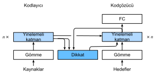

# Bahdanau Dikkati
:label:`sec_seq2seq_attention` 

:numref:`sec_seq2seq` içinde makine çevirisi problemini inceledik, burada diziden diziye öğrenme için iki RNN temelli bir kodlayıcı-kodçözücü mimarisi tasarladık. Özellikle, RNN kodlayıcısı bir değişken uzunluktaki diziyi sabit şekilli bağlam değişkenine dönüştürür, daha sonra RNN kodçözücüsü, üretilen belirteçlere ve bağlam değişkenine göre belirteç belirteç çıktı (hedef) dizisini oluşturur. Ancak, tüm girdi (kaynak) belirteçleri belirli bir belirteci kodlamak için yararlı olmasa da, girdi dizisinin tamamını kodlayan *aynı* bağlam değişkeni hala her kod çözme adımında kullanılır. 

Belirli bir metin dizisi için el yazısı oluşturmayla ilgili ayrı ama bağlantılı bir zorlukta Graves, metin karakterlerini çok daha uzun kalem iziyle hizalamak için türevlenebilir bir dikkat modeli tasarladı; burada hizalama yalnızca bir yönde hareket eder :cite:`Graves.2013`. Hizalamayı öğrenme fikrinden esinlenen Bahdanau ve ark. :cite:`Bahdanau.Cho.Bengio.2014` keskin bir tek yönlü hizalama sınırlaması olmaksızın türevlenebilir bir dikkat modeli önerdi. Bir belirteci tahmin ederken, tüm girdi belirteçleri ilgili değilse, model yalnızca girdi dizisinin geçerli tahminle ilgili bölümlerine hizalar (veya eşler). Bu, bağlam değişkeninin dikkat ortaklamasının bir çıktısı olarak ele alınarak elde edilir. 

## Model

Aşağıdaki RNN kodlayıcı-kodçözücüsü için Bahdanau dikkatini açıklarken, :numref:`sec_seq2seq` içindeki aynı notasyonu takip edeceğiz. Yeni dikkat temelli model, :eqref:`eq_seq2seq_s_t` içindeki $\mathbf{c}$ bağlam değişkeninin herhangi bir $t'$ kod çözme zaman adımında $\mathbf{c}_{t'}$ ile değiştirilmesi dışında :numref:`sec_seq2seq` içindekiyle aynıdır. Girdi dizisinde $T$ belirteçleri olduğunu varsayalım, kod çözme zamanı adımındaki bağlam değişkeni $t'$ dikkat ortaklamasının çıktısıdır: 

$$\mathbf{c}_{t'} = \sum_{t=1}^T \alpha(\mathbf{s}_{t' - 1}, \mathbf{h}_t) \mathbf{h}_t,$$

burada zaman adım $t' - 1$'deki kodçözücü gizli durumu $\mathbf{s}_{t' - 1}$ sorgudur ve kodlayıcı gizli durumları $\mathbf{h}_t$ hem anahtarlar hem de değerlerdir ve $\alpha$ dikkat ağırlığı :eqref:`eq_attn-scoring-alpha` ile tanımlanan toplayıcı dikkat puanlama işlevini kullanarak :eqref:`eq_attn-scoring-alpha` içinde olduğu gibi hesaplanır. 

:numref:`fig_seq2seq_details` şeklindeki sıradan RNN kodlayıcı-kodçözücü mimarisinden biraz farklı olan Bahdanau dikkati ile aynı mimari :numref:`fig_s2s_attention_details` şeklinde tasvir edilmiştir. 


:label:`fig_s2s_attention_details`

```{.python .input}
from d2l import mxnet as d2l
from mxnet import np, npx
from mxnet.gluon import rnn, nn
npx.set_np()
```

```{.python .input}
#@tab pytorch
from d2l import torch as d2l
import torch
from torch import nn
```

```{.python .input}
#@tab tensorflow
from d2l import tensorflow as d2l
import tensorflow as tf
```

## Çözücüyü Dikkat ile Tanımlama

RNN kodlayıcı-kodçözücüyü Bahdanau dikkati ile uygulamak için, sadece kodçözücüyü yeniden tanımlamamız gerekiyor. Öğrenilen dikkat ağırlıklarını daha rahat görselleştirmek için, aşağıdaki `AttentionDecoder` sınıfı [**dikkat mekanizmalarına sahip kodçözücüler için temel arabirimi**] tanımlar.

```{.python .input}
#@tab all
#@save
class AttentionDecoder(d2l.Decoder):
    """Temel dikkat tabanlı kodçözücü arabirimi."""
    def __init__(self, **kwargs):
        super(AttentionDecoder, self).__init__(**kwargs)

    @property
    def attention_weights(self):
        raise NotImplementedError
```


Şimdi, aşağıdaki `Seq2SeqAttentionDecoder` sınıfında [**RNN kodçözücüyü Bahdanau dikkatiyle**] uygulayalım. Kodçözücünün durumu, (i) tüm zaman adımlarında kodlayıcı son katman gizli durumları (dikkat anahtarları ve değerleri olarak); (ii) son zaman adımında kodlayıcı tüm katman gizli durumu (kod çözücünün gizli durumunu ilklemek için); ve (iii) geçerli  kodlayıcı uzunluğu (dikkat ortaklamasındaki dolgu belirteçlerini hariç tutmak için) ile ilklenir. Her kod çözme zaman adımında, kod çözücü son katman gizli durumu önceki zaman adımında dikkat sorgusu olarak kullanılır. Sonuç olarak, hem dikkat çıktısı hem de girdi gömmesi RNN kod çözücünün girdisi olarak bitiştirilir.

```{.python .input}
class Seq2SeqAttentionDecoder(AttentionDecoder):
    def __init__(self, vocab_size, embed_size, num_hiddens, num_layers,
                 dropout=0, **kwargs):
        super(Seq2SeqAttentionDecoder, self).__init__(**kwargs)
        self.attention = d2l.AdditiveAttention(num_hiddens, dropout)
        self.embedding = nn.Embedding(vocab_size, embed_size)
        self.rnn = rnn.GRU(num_hiddens, num_layers, dropout=dropout)
        self.dense = nn.Dense(vocab_size, flatten=False)

    def init_state(self, enc_outputs, enc_valid_lens, *args):
        # `outputs`'un şekli: (`num_steps`, `batch_size`, `num_hiddens`).
        # `hidden_state[0]`'in şekli: (`num_layers`, `batch_size`,
        # `num_hiddens`)
        outputs, hidden_state = enc_outputs
        return (outputs.swapaxes(0, 1), hidden_state, enc_valid_lens)

    def forward(self, X, state):
        # `enc_outputs`'un şekli: (`batch_size`, `num_steps`, `num_hiddens`).
        # `hidden_state[0]`'in şekli: (`num_layers`, `batch_size`,
        # `num_hiddens`)
        enc_outputs, hidden_state, enc_valid_lens = state
        # `X` çıktısının şekli: (`num_steps`, `batch_size`, `embed_size`)
        X = self.embedding(X).swapaxes(0, 1)
        outputs, self._attention_weights = [], []
        for x in X:
            # `query`'in şekli:: (`batch_size`, 1, `num_hiddens`)
            query = np.expand_dims(hidden_state[0][-1], axis=1)
            # `context`'in şekli: (`batch_size`, 1, `num_hiddens`)
            context = self.attention(
                query, enc_outputs, enc_outputs, enc_valid_lens)
            # Öznitelik boyutunda bitiştir
            x = np.concatenate((context, np.expand_dims(x, axis=1)), axis=-1)
            # `x`'i (1, `batch_size`, `embed_size` + `num_hiddens`) olarak 
            # yeniden şekillendirin
            out, hidden_state = self.rnn(x.swapaxes(0, 1), hidden_state)
            outputs.append(out)
            self._attention_weights.append(self.attention.attention_weights)
        # Tam bağlı katman dönüşümünden sonra, `outputs` (çıktılar) şekli:
        # (`num_steps`, `batch_size`, `vocab_size`)
        outputs = self.dense(np.concatenate(outputs, axis=0))
        return outputs.swapaxes(0, 1), [enc_outputs, hidden_state,
                                        enc_valid_lens]

    @property
    def attention_weights(self):
        return self._attention_weights
```

```{.python .input}
#@tab pytorch
class Seq2SeqAttentionDecoder(AttentionDecoder):
    def __init__(self, vocab_size, embed_size, num_hiddens, num_layers,
                 dropout=0, **kwargs):
        super(Seq2SeqAttentionDecoder, self).__init__(**kwargs)
        self.attention = d2l.AdditiveAttention(
            num_hiddens, num_hiddens, num_hiddens, dropout)
        self.embedding = nn.Embedding(vocab_size, embed_size)
        self.rnn = nn.GRU(
            embed_size + num_hiddens, num_hiddens, num_layers,
            dropout=dropout)
        self.dense = nn.Linear(num_hiddens, vocab_size)

    def init_state(self, enc_outputs, enc_valid_lens, *args):
        # `outputs`'un şekli: (`num_steps`, `batch_size`, `num_hiddens`).
        # `hidden_state[0]`'in şekli: (`num_layers`, `batch_size`,
        # `num_hiddens`)
        outputs, hidden_state = enc_outputs
        return (outputs.permute(1, 0, 2), hidden_state, enc_valid_lens)

    def forward(self, X, state):
        # `enc_outputs`'un şekli: (`batch_size`, `num_steps`, `num_hiddens`).
        # `hidden_state[0]`'in şekli: (`num_layers`, `batch_size`,
        # `num_hiddens`)
        enc_outputs, hidden_state, enc_valid_lens = state
        # `X` çıktısının şekli: (`num_steps`, `batch_size`, `embed_size`)
        X = self.embedding(X).permute(1, 0, 2)
        outputs, self._attention_weights = [], []
        for x in X:
            # `query`'in şekli: (`batch_size`, 1, `num_hiddens`)
            query = torch.unsqueeze(hidden_state[-1], dim=1)
            # `context`'in şekli: (`batch_size`, 1, `num_hiddens`)
            context = self.attention(
                query, enc_outputs, enc_outputs, enc_valid_lens)
            # Öznitelik boyutunda bitiştir
            x = torch.cat((context, torch.unsqueeze(x, dim=1)), dim=-1)
            # `x`'i (1, `batch_size`, `embed_size` + `num_hiddens`) olarak 
            # yeniden şekillendirin
            out, hidden_state = self.rnn(x.permute(1, 0, 2), hidden_state)
            outputs.append(out)
            self._attention_weights.append(self.attention.attention_weights)
        # Tam bağlı katman dönüşümünden sonra, `outputs` (çıktılar) şekli:
        # (`num_steps`, `batch_size`, `vocab_size`)
        outputs = self.dense(torch.cat(outputs, dim=0))
        return outputs.permute(1, 0, 2), [enc_outputs, hidden_state,
                                          enc_valid_lens]

    @property
    def attention_weights(self):
        return self._attention_weights
```

```{.python .input}
#@tab tensorflow
class Seq2SeqAttentionDecoder(AttentionDecoder):
    def __init__(self, vocab_size, embed_size, num_hiddens, num_layers,
                 dropout=0, **kwargs):
        super().__init__(**kwargs)
        self.attention = d2l.AdditiveAttention(num_hiddens, num_hiddens,
                                               num_hiddens, dropout)
        self.embedding = tf.keras.layers.Embedding(vocab_size, embed_size)
        self.rnn = tf.keras.layers.RNN(tf.keras.layers.StackedRNNCells(
            [tf.keras.layers.GRUCell(num_hiddens, dropout=dropout)
             for _ in range(num_layers)]),
                                      return_sequences=True, return_state=True)
        self.dense = tf.keras.layers.Dense(vocab_size)

    def init_state(self, enc_outputs, enc_valid_lens, *args):
        # `outputs`'un şekli: (`batch_size`, `num_steps`, `num_hiddens`).
        # `hidden_state[0]`'in şekli: (`num_layers`, `batch_size`, `num_hiddens`)
        outputs, hidden_state = enc_outputs
        return (outputs, hidden_state, enc_valid_lens)

    def call(self, X, state, **kwargs):
        # `enc_outputs`'un şekli: (`batch_size`, `num_steps`, `num_hiddens`).
        # `hidden_state[0]`'in şekli: (`num_layers`, `batch_size`, `num_hiddens`)
        enc_outputs, hidden_state, enc_valid_lens = state
        # `X` çıktısının şekli: (`num_steps`, `batch_size`, `embed_size`)
        X = self.embedding(X) # `X` girdisinin şekli: (`batch_size`, `num_steps`)
        X = tf.transpose(X, perm=(1, 0, 2))
        outputs, self._attention_weights = [], []
        for x in X:
            # `query`'in şekli: (`batch_size`, 1, `num_hiddens`)
            query = tf.expand_dims(hidden_state[-1], axis=1)
            # `context`'in şekli: (`batch_size, 1, `num_hiddens`)
            context = self.attention(query, enc_outputs, enc_outputs,
                                     enc_valid_lens, **kwargs)
            # Öznitelik boyutunda bitiştir
            x = tf.concat((context, tf.expand_dims(x, axis=1)), axis=-1)
            out = self.rnn(x, hidden_state, **kwargs)
            hidden_state = out[1:]
            outputs.append(out[0])
            self._attention_weights.append(self.attention.attention_weights)
        # Tam bağlı katman dönüşümünden sonra, `outputs` (çıktılar) şekli:
        # (`batch_size`, `num_steps`, `vocab_size`)
        outputs = self.dense(tf.concat(outputs, axis=1))
        return outputs, [enc_outputs, hidden_state, enc_valid_lens]

    @property
    def attention_weights(self):
        return self._attention_weights
```

Aşağıda, 7 zaman adımlı 4 dizi girdisinden oluşan bir minigrup kullanarak Bahdanau dikkatiyle [**uygulanan kodçözücüyü**] test ediyoruz.

```{.python .input}
encoder = d2l.Seq2SeqEncoder(vocab_size=10, embed_size=8, num_hiddens=16,
                             num_layers=2)
encoder.initialize()
decoder = Seq2SeqAttentionDecoder(vocab_size=10, embed_size=8, num_hiddens=16,
                                  num_layers=2)
decoder.initialize()
X = d2l.zeros((4, 7))  # (`batch_size`, `num_steps`)
state = decoder.init_state(encoder(X), None)
output, state = decoder(X, state)
output.shape, len(state), state[0].shape, len(state[1]), state[1][0].shape
```

```{.python .input}
#@tab pytorch
encoder = d2l.Seq2SeqEncoder(vocab_size=10, embed_size=8, num_hiddens=16,
                             num_layers=2)
encoder.eval()
decoder = Seq2SeqAttentionDecoder(vocab_size=10, embed_size=8, num_hiddens=16,
                                  num_layers=2)
decoder.eval()
X = d2l.zeros((4, 7), dtype=torch.long)  # (`batch_size`, `num_steps`)
state = decoder.init_state(encoder(X), None)
output, state = decoder(X, state)
output.shape, len(state), state[0].shape, len(state[1]), state[1][0].shape
```

```{.python .input}
#@tab tensorflow
encoder = d2l.Seq2SeqEncoder(vocab_size=10, embed_size=8, num_hiddens=16,
                             num_layers=2)
decoder = Seq2SeqAttentionDecoder(vocab_size=10, embed_size=8, num_hiddens=16,
                                  num_layers=2)
X = tf.zeros((4, 7))
state = decoder.init_state(encoder(X, training=False), None)
output, state = decoder(X, state, training=False)
output.shape, len(state), state[0].shape, len(state[1]), state[1][0].shape
```

## [**Eğitim**]

:numref:`sec_seq2seq_training` içindekine benzer şekilde, burada hiper parametreleri belirtiyoruz, Bahdanau dikkatli bir kodlayıcı ve bir kodçözücü oluşturuyor ve bu modeli makine çevirisi için eğitiyoruz. Yeni eklenen dikkat mekanizması nedeniyle, bu eğitim :numref:`sec_seq2seq_training` içindeki dikkat mekanizmaları olmadan çok daha yavaştır.

```{.python .input}
#@tab all
embed_size, num_hiddens, num_layers, dropout = 32, 32, 2, 0.1
batch_size, num_steps = 64, 10
lr, num_epochs, device = 0.005, 250, d2l.try_gpu()

train_iter, src_vocab, tgt_vocab = d2l.load_data_nmt(batch_size, num_steps)
encoder = d2l.Seq2SeqEncoder(
    len(src_vocab), embed_size, num_hiddens, num_layers, dropout)
decoder = Seq2SeqAttentionDecoder(
    len(tgt_vocab), embed_size, num_hiddens, num_layers, dropout)
net = d2l.EncoderDecoder(encoder, decoder)
d2l.train_seq2seq(net, train_iter, lr, num_epochs, tgt_vocab, device)
```

Model eğitildikten sonra, onu [**birkaç İngilizce cümleyi**] Fransızca'ya çevirmek ve BLEU değerlerini hesaplamak için kullanıyoruz.

```{.python .input}
#@tab mxnet, pytorch
engs = ['go .', "i lost .", 'he\'s calm .', 'i\'m home .']
fras = ['va !', 'j\'ai perdu .', 'il est calme .', 'je suis chez moi .']
for eng, fra in zip(engs, fras):
    translation, dec_attention_weight_seq = d2l.predict_seq2seq(
        net, eng, src_vocab, tgt_vocab, num_steps, device, True)
    print(f'{eng} => {translation}, ',
          f'bleu {d2l.bleu(translation, fra, k=2):.3f}')
```

```{.python .input}
#@tab tensorflow
engs = ['go .', "i lost .", 'he\'s calm .', 'i\'m home .']
fras = ['va !', 'j\'ai perdu .', 'il est calme .', 'je suis chez moi .']
for eng, fra in zip(engs, fras):
    translation, dec_attention_weight_seq = d2l.predict_seq2seq(
        net, eng, src_vocab, tgt_vocab, num_steps, True)
    print(f'{eng} => {translation}, ',
          f'bleu {d2l.bleu(translation, fra, k=2):.3f}')
```

```{.python .input}
#@tab all
attention_weights = d2l.reshape(
    d2l.concat([step[0][0][0] for step in dec_attention_weight_seq], 0),
    (1, 1, -1, num_steps))
```

Son İngilizce cümleyi çevirirken [**dikkat ağırlıklarını görselleştirerek**], her sorgunun anahtar değer çiftleri üzerinde tekdüze olmayan ağırlıklar atadığını görebiliriz. Her kod çözme adımında, girdi dizilerinin farklı bölümlerinin dikkat ortaklamasında seçici olarak toplandığını gösterir.

```{.python .input}
# Sıra sonu belirtecini eklemek için bir tane ekle
d2l.show_heatmaps(
    attention_weights[:, :, :, :len(engs[-1].split()) + 1],
    xlabel='Key positions', ylabel='Query positions')
```

```{.python .input}
#@tab pytorch
# Sıra sonu belirtecini eklemek için bir tane ekle
d2l.show_heatmaps(
    attention_weights[:, :, :, :len(engs[-1].split()) + 1].cpu(),
    xlabel='Key positions', ylabel='Query positions')
```

```{.python .input}
#@tab tensorflow
# Sıra sonu belirtecini eklemek için bir tane ekle
d2l.show_heatmaps(
    attention_weights[:, :, :, :len(engs[-1].split()) + 1],
    xlabel='Key positions', ylabel='Query positions')
```

## Özet

* Bir belirteci tahmin ederken, tüm girdi belirteçleri ilgili değilse, Bahdanau dikkatine sahip RNN kodlayıcı-kodçözücü seçici olarak girdi dizisinin farklı bölümlerini toplar. Bu, bağlam değişkeninin toplayıcı dikkat ortaklamasının bir çıktısı olarak ele alınarak elde edilir.
* RNN kodlayıcı-kodçözücüsünde, Bahdanau dikkati önceki zaman adımındaki kodçözücü gizli durumunu sorgu olarak ve kodlayıcı gizli durumlarını her zaman adımında hem anahtar hem de değerler olarak ele alır.

## Alıştırmalar

1. Deneyde GRU'yu LSTM ile değiştirin.
1. Toplayıcı dikkat puanlama işlevini ölçeklendirilmiş nokta çarpımı ile değiştirerek deneyi tekrarlayın. Eğitim verimliliğini nasıl etkiler?

:begin_tab:`mxnet`
[Tartışmalar](https://discuss.d2l.ai/t/347)
:end_tab:

:begin_tab:`pytorch`
[Tartışmalar](https://discuss.d2l.ai/t/1065)
:end_tab:
