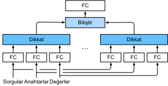

# Çoklu Kafa Dikkat
:label:`sec_multihead-attention`

Uygulamada, aynı sorgu, anahtar ve değerler kümesi göz önüne alındığında, modelimizin aynı dikkat mekanizmasının farklı davranışlarından gelen bilgileri bir dizi içinde çeşitli aralıkların (örneğin, daha kısa menzilli ve daha uzun menzilli) yakalama gibi farklı davranışlardan gelen bilgileri birleştirmesini isteyebiliriz. Bu nedenle, dikkat mekanizmamızın sorguların, anahtarların ve değerlerin farklı temsil alt alanlarını ortaklaşa kullanmasına izin vermek yararlı olabilir. 

Bu amaçla, tek bir dikkat havuzu yerine, sorgular, anahtarlar ve değerler $h$ bağımsız olarak öğrenilen doğrusal projeksiyonlar ile dönüştürülebilir. Daha sonra bu $h$ öngörülen sorgular, anahtarlar ve değerler paralel olarak dikkat havuzu içine beslenir. Nihayetinde, $h$ dikkat havuzlama çıktıları birleştirilir ve son çıktıyı üretmek için başka bir öğrenilmiş doğrusal projeksiyon ile dönüştürülür. Bu tasarıma *çoklu kafalı dikkat* denir, burada $h$ dikkat biriktirme çıkışlarının her biri *head* :cite:`Vaswani.Shazeer.Parmar.ea.2017`. Öğrenilebilir doğrusal dönüşümler gerçekleştirmek için tam bağlı katmanları kullanarak :numref:`fig_multi-head-attention`, çok kafalı dikkati açıklar. 


:label:`fig_multi-head-attention`

## Model

Çok kafalı dikkatin uygulanmasını sağlamadan önce, bu modeli matematiksel olarak resmileştirelim. Bir sorgu $\mathbf{q} \in \mathbb{R}^{d_q}$, bir anahtar $\mathbf{k} \in \mathbb{R}^{d_k}$ ve $\mathbf{v} \in \mathbb{R}^{d_v}$ bir değer göz önüne alındığında, her dikkat kafası $\mathbf{h}_i$ ($i = 1, \ldots, h$) olarak hesaplanır 

$$\mathbf{h}_i = f(\mathbf W_i^{(q)}\mathbf q, \mathbf W_i^{(k)}\mathbf k,\mathbf W_i^{(v)}\mathbf v) \in \mathbb R^{p_v},$$

burada öğrenilebilir parametreler $\mathbf W_i^{(q)}\in\mathbb R^{p_q\times d_q}$, $\mathbf W_i^{(k)}\in\mathbb R^{p_k\times d_k}$ ve $\mathbf W_i^{(v)}\in\mathbb R^{p_v\times d_v}$ ve $f$, :numref:`sec_attention-scoring-functions` yılında katkı dikkat ve ölçekli nokta ürün dikkati gibi dikkat havuzudur. Çok başlı dikkat çıkışı, $h$ kafalarının birleştirilmesinin $\mathbf W_o\in\mathbb R^{p_o\times h p_v}$ öğrenilebilir parametreleri vasıtasıyla başka bir doğrusal dönüşümdür: 

$$\mathbf W_o \begin{bmatrix}\mathbf h_1\\\vdots\\\mathbf h_h\end{bmatrix} \in \mathbb{R}^{p_o}.$$

Bu tasarıma dayanarak, her kafa girişin farklı bölümlerine katılabilir. Basit ağırlıklı ortalamadan daha sofistike fonksiyonlar ifade edilebilir.

```{.python .input}
from d2l import mxnet as d2l
import math
from mxnet import autograd, np, npx
from mxnet.gluon import nn
npx.set_np()
```

```{.python .input}
#@tab pytorch
from d2l import torch as d2l
import math
import torch
from torch import nn
```

```{.python .input}
#@tab tensorflow
from d2l import tensorflow as d2l
import tensorflow as tf
```

## Uygulama

Uygulamamızda, çok kafa dikkatinin her kafası için ölçeklendirilmiş nokta ürün dikkatini [**seçiyoruz]. Hesaplamalı maliyet ve parametreleme maliyetinin önemli ölçüde büyümesini önlemek için $p_q = p_k = p_v = p_o / h$'i belirledik. Sorgu, anahtar ve değer için doğrusal dönüşümlerin çıkış sayısını $p_q h = p_k h = p_v h = p_o$ olarak ayarlarsak $h$ kafaları paralel olarak hesaplanabileceğini unutmayın. Aşağıdaki uygulamada $p_o$, `num_hiddens` argümanı vasıtasıyla belirtilmiştir.

```{.python .input}
#@save
class MultiHeadAttention(nn.Block):
    """Multi-head attention."""
    def __init__(self, num_hiddens, num_heads, dropout, use_bias=False,
                 **kwargs):
        super(MultiHeadAttention, self).__init__(**kwargs)
        self.num_heads = num_heads
        self.attention = d2l.DotProductAttention(dropout)
        self.W_q = nn.Dense(num_hiddens, use_bias=use_bias, flatten=False)
        self.W_k = nn.Dense(num_hiddens, use_bias=use_bias, flatten=False)
        self.W_v = nn.Dense(num_hiddens, use_bias=use_bias, flatten=False)
        self.W_o = nn.Dense(num_hiddens, use_bias=use_bias, flatten=False)

    def forward(self, queries, keys, values, valid_lens):
        # Shape of `queries`, `keys`, or `values`:
        # (`batch_size`, no. of queries or key-value pairs, `num_hiddens`)
        # Shape of `valid_lens`:
        # (`batch_size`,) or (`batch_size`, no. of queries)
        # After transposing, shape of output `queries`, `keys`, or `values`:
        # (`batch_size` * `num_heads`, no. of queries or key-value pairs,
        # `num_hiddens` / `num_heads`)
        queries = transpose_qkv(self.W_q(queries), self.num_heads)
        keys = transpose_qkv(self.W_k(keys), self.num_heads)
        values = transpose_qkv(self.W_v(values), self.num_heads)

        if valid_lens is not None:
            # On axis 0, copy the first item (scalar or vector) for
            # `num_heads` times, then copy the next item, and so on
            valid_lens = valid_lens.repeat(self.num_heads, axis=0)

        # Shape of `output`: (`batch_size` * `num_heads`, no. of queries,
        # `num_hiddens` / `num_heads`)
        output = self.attention(queries, keys, values, valid_lens)
        
        # Shape of `output_concat`:
        # (`batch_size`, no. of queries, `num_hiddens`)
        output_concat = transpose_output(output, self.num_heads)
        return self.W_o(output_concat)
```

```{.python .input}
#@tab pytorch
#@save
class MultiHeadAttention(nn.Module):
    """Multi-head attention."""
    def __init__(self, key_size, query_size, value_size, num_hiddens,
                 num_heads, dropout, bias=False, **kwargs):
        super(MultiHeadAttention, self).__init__(**kwargs)
        self.num_heads = num_heads
        self.attention = d2l.DotProductAttention(dropout)
        self.W_q = nn.Linear(query_size, num_hiddens, bias=bias)
        self.W_k = nn.Linear(key_size, num_hiddens, bias=bias)
        self.W_v = nn.Linear(value_size, num_hiddens, bias=bias)
        self.W_o = nn.Linear(num_hiddens, num_hiddens, bias=bias)

    def forward(self, queries, keys, values, valid_lens):
        # Shape of `queries`, `keys`, or `values`:
        # (`batch_size`, no. of queries or key-value pairs, `num_hiddens`)
        # Shape of `valid_lens`:
        # (`batch_size`,) or (`batch_size`, no. of queries)
        # After transposing, shape of output `queries`, `keys`, or `values`:
        # (`batch_size` * `num_heads`, no. of queries or key-value pairs,
        # `num_hiddens` / `num_heads`)
        queries = transpose_qkv(self.W_q(queries), self.num_heads)
        keys = transpose_qkv(self.W_k(keys), self.num_heads)
        values = transpose_qkv(self.W_v(values), self.num_heads)

        if valid_lens is not None:
            # On axis 0, copy the first item (scalar or vector) for
            # `num_heads` times, then copy the next item, and so on
            valid_lens = torch.repeat_interleave(
                valid_lens, repeats=self.num_heads, dim=0)

        # Shape of `output`: (`batch_size` * `num_heads`, no. of queries,
        # `num_hiddens` / `num_heads`)
        output = self.attention(queries, keys, values, valid_lens)

        # Shape of `output_concat`:
        # (`batch_size`, no. of queries, `num_hiddens`)
        output_concat = transpose_output(output, self.num_heads)
        return self.W_o(output_concat)
```

```{.python .input}
#@tab tensorflow
#@save
class MultiHeadAttention(tf.keras.layers.Layer):
    """Multi-head attention."""
    def __init__(self, key_size, query_size, value_size, num_hiddens,
                 num_heads, dropout, bias=False, **kwargs):
        super().__init__(**kwargs)
        self.num_heads = num_heads
        self.attention = d2l.DotProductAttention(dropout)
        self.W_q = tf.keras.layers.Dense(num_hiddens, use_bias=bias)
        self.W_k = tf.keras.layers.Dense(num_hiddens, use_bias=bias)
        self.W_v = tf.keras.layers.Dense(num_hiddens, use_bias=bias)
        self.W_o = tf.keras.layers.Dense(num_hiddens, use_bias=bias)
    
    def call(self, queries, keys, values, valid_lens, **kwargs):
        # Shape of `queries`, `keys`, or `values`:
        # (`batch_size`, no. of queries or key-value pairs, `num_hiddens`)
        # Shape of `valid_lens`:
        # (`batch_size`,) or (`batch_size`, no. of queries)
        # After transposing, shape of output `queries`, `keys`, or `values`:
        # (`batch_size` * `num_heads`, no. of queries or key-value pairs,
        # `num_hiddens` / `num_heads`)
        queries = transpose_qkv(self.W_q(queries), self.num_heads)
        keys = transpose_qkv(self.W_k(keys), self.num_heads)
        values = transpose_qkv(self.W_v(values), self.num_heads)
        
        if valid_lens is not None:
            # On axis 0, copy the first item (scalar or vector) for
            # `num_heads` times, then copy the next item, and so on
            valid_lens = tf.repeat(valid_lens, repeats=self.num_heads, axis=0)
            
        # Shape of `output`: (`batch_size` * `num_heads`, no. of queries, `num_hiddens` / `num_heads`)
        output = self.attention(queries, keys, values, valid_lens, **kwargs)
        
        # Shape of `output_concat`: (`batch_size`, no. of queries, `num_hiddens`)
        output_concat = transpose_output(output, self.num_heads)
        return self.W_o(output_concat)
```

Birden fazla kafanın [**paralel hesaplanmasına izin vermek için**], yukarıdaki `MultiHeadAttention` sınıfı aşağıda tanımlandığı gibi iki transpozisyon işlevi kullanır. Özellikle, `transpose_output` işlevi `transpose_qkv` işlevinin çalışmasını tersine çevirir.

```{.python .input}
#@save
def transpose_qkv(X, num_heads):
    """Transposition for parallel computation of multiple attention heads."""
    # Shape of input `X`:
    # (`batch_size`, no. of queries or key-value pairs, `num_hiddens`).
    # Shape of output `X`:
    # (`batch_size`, no. of queries or key-value pairs, `num_heads`,
    # `num_hiddens` / `num_heads`)
    X = X.reshape(X.shape[0], X.shape[1], num_heads, -1)

    # Shape of output `X`:
    # (`batch_size`, `num_heads`, no. of queries or key-value pairs,
    # `num_hiddens` / `num_heads`)
    X = X.transpose(0, 2, 1, 3)

    # Shape of `output`:
    # (`batch_size` * `num_heads`, no. of queries or key-value pairs,
    # `num_hiddens` / `num_heads`)
    return X.reshape(-1, X.shape[2], X.shape[3])


#@save
def transpose_output(X, num_heads):
    """Reverse the operation of `transpose_qkv`."""
    X = X.reshape(-1, num_heads, X.shape[1], X.shape[2])
    X = X.transpose(0, 2, 1, 3)
    return X.reshape(X.shape[0], X.shape[1], -1)
```

```{.python .input}
#@tab pytorch
#@save
def transpose_qkv(X, num_heads):
    """Transposition for parallel computation of multiple attention heads."""
    # Shape of input `X`:
    # (`batch_size`, no. of queries or key-value pairs, `num_hiddens`).
    # Shape of output `X`:
    # (`batch_size`, no. of queries or key-value pairs, `num_heads`,
    # `num_hiddens` / `num_heads`)
    X = X.reshape(X.shape[0], X.shape[1], num_heads, -1)

    # Shape of output `X`:
    # (`batch_size`, `num_heads`, no. of queries or key-value pairs,
    # `num_hiddens` / `num_heads`)
    X = X.permute(0, 2, 1, 3)

    # Shape of `output`:
    # (`batch_size` * `num_heads`, no. of queries or key-value pairs,
    # `num_hiddens` / `num_heads`)
    return X.reshape(-1, X.shape[2], X.shape[3])


#@save
def transpose_output(X, num_heads):
    """Reverse the operation of `transpose_qkv`."""
    X = X.reshape(-1, num_heads, X.shape[1], X.shape[2])
    X = X.permute(0, 2, 1, 3)
    return X.reshape(X.shape[0], X.shape[1], -1)
```

```{.python .input}
#@tab tensorflow
#@save
def transpose_qkv(X, num_heads):
    """Transposition for parallel computation of multiple attention heads."""
    # Shape of input `X`:
    # (`batch_size`, no. of queries or key-value pairs, `num_hiddens`).
    # Shape of output `X`:
    # (`batch_size`, no. of queries or key-value pairs, `num_heads`,
    # `num_hiddens` / `num_heads`)
    X = tf.reshape(X, shape=(X.shape[0], X.shape[1], num_heads, -1))

    # Shape of output `X`:
    # (`batch_size`, `num_heads`, no. of queries or key-value pairs,
    # `num_hiddens` / `num_heads`)
    X = tf.transpose(X, perm=(0, 2, 1, 3))

    # Shape of `output`:
    # (`batch_size` * `num_heads`, no. of queries or key-value pairs,
    # `num_hiddens` / `num_heads`)
    return tf.reshape(X, shape=(-1, X.shape[2], X.shape[3]))


#@save
def transpose_output(X, num_heads):
    """Reverse the operation of `transpose_qkv`."""
    X = tf.reshape(X, shape=(-1, num_heads, X.shape[1], X.shape[2]))
    X = tf.transpose(X, perm=(0, 2, 1, 3))
    return tf.reshape(X, shape=(X.shape[0], X.shape[1], -1))
```

Tuşların ve değerlerin aynı olduğu bir oyuncak örneği kullanarak `MultiHeadAttention` sınıfını [**test etmemize izin verelim. Sonuç olarak, çok kafalı dikkat çıkışının şekli (`batch_size`, `num_queries`, `num_hiddens`) 'dir.

```{.python .input}
num_hiddens, num_heads = 100, 5
attention = MultiHeadAttention(num_hiddens, num_heads, 0.5)
attention.initialize()
```

```{.python .input}
#@tab pytorch
num_hiddens, num_heads = 100, 5
attention = MultiHeadAttention(num_hiddens, num_hiddens, num_hiddens,
                               num_hiddens, num_heads, 0.5)
attention.eval()
```

```{.python .input}
#@tab tensorflow
num_hiddens, num_heads = 100, 5
attention = MultiHeadAttention(num_hiddens, num_hiddens, num_hiddens,
                               num_hiddens, num_heads, 0.5)
```

```{.python .input}
#@tab mxnet, pytorch
batch_size, num_queries, num_kvpairs, valid_lens = 2, 4, 6, d2l.tensor([3, 2])
X = d2l.ones((batch_size, num_queries, num_hiddens))
Y = d2l.ones((batch_size, num_kvpairs, num_hiddens))
attention(X, Y, Y, valid_lens).shape
```

```{.python .input}
#@tab tensorflow
batch_size, num_queries, num_kvpairs, valid_lens = 2, 4, 6, d2l.tensor([3, 2])
X = tf.ones((batch_size, num_queries, num_hiddens))
Y = tf.ones((batch_size, num_kvpairs, num_hiddens))
attention(X, Y, Y, valid_lens, training=False).shape
```

## Özet

* Çok kafalı dikkat, sorguların, anahtarların ve değerlerin farklı temsil alt alanları aracılığıyla aynı dikkat havuzlama bilgisini birleştirir.
* Birden fazla kafalı dikkati paralel olarak hesaplamak için uygun tensör manipülasyonu gereklidir.

## Egzersizler

1. Bu deneyde birden fazla kafanın dikkat ağırlıklarını görselleştirin.
1. Çok kafa dikkatine dayalı eğitimli bir modelimiz olduğunu ve tahmin hızını artırmak için en az önemli dikkat kafalarını budamak istediğimizi varsayalım. Bir dikkat kafasının önemini ölçmek için deneyleri nasıl tasarlayabiliriz?

:begin_tab:`mxnet`
[Discussions](https://discuss.d2l.ai/t/1634)
:end_tab:

:begin_tab:`pytorch`
[Discussions](https://discuss.d2l.ai/t/1635)
:end_tab:
