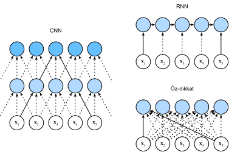

# Özdikkat ve Konumsal Kodlama
:label:`sec_self-attention-and-positional-encoding`

Derin öğrenmede, bir diziyi kodlamak için sıklıkla CNN'leri veya RNN'leri kullanırız. Şimdi dikkat mekanizmalarıyla, bir belirteç dizisini dikkat ortaklamasına beslediğimizi hayal edin, böylece aynı belirteç kümesi sorgular, anahtarlar ve değerler gibi davranır. Özellikle, her sorgu tüm anahtar değer çiftlerine kulak verir ve bir dikkat çıktısı oluşturur. Sorgular, anahtarlar ve değerler aynı yerden geldiğinden,
*özdikkat* :cite:`Lin.Feng.Santos.ea.2017,Vaswani.Shazeer.Parmar.ea.2017`, aynı zamanda *içe-dikkat* :cite:`Cheng.Dong.Lapata.2016,Parikh.Tackstrom.Das.ea.2016,Paulus.Xiong.Socher.2017` olarak da adlandırılır, gerçeklenir.
Bu bölümde, dizi düzeni için ek bilgilerin kullanılması da dahil olmak üzere, özdikkat kullanan dizi kodlamasını tartışacağız.

```{.python .input}
from d2l import mxnet as d2l
import math
from mxnet import autograd, np, npx
from mxnet.gluon import nn
npx.set_np()
```

```{.python .input}
#@tab pytorch
from d2l import torch as d2l
import math
import torch
from torch import nn
```

```{.python .input}
#@tab tensorflow
from d2l import tensorflow as d2l
import numpy as np
import tensorflow as tf
```

## [**Özdikkat**]

$\mathbf{x}_1, \ldots, \mathbf{x}_n$ ($1 \leq i \leq n$) herhangi bir $\mathbf{x}_i \in \mathbb{R}^d$ ($1 \leq i \leq n$) girdi belirteçleri dizisi göz önüne alındığında, özdikkat aynı uzunlukta $\mathbf{y}_1, \ldots, \mathbf{y}_n$ olan bir dizi çıkarır, burada 

$$\mathbf{y}_i = f(\mathbf{x}_i, (\mathbf{x}_1, \mathbf{x}_1), \ldots, (\mathbf{x}_n, \mathbf{x}_n)) \in \mathbb{R}^d$$

:eqref:`eq_attn-pooling` denklemindeki $f$ dikkat ortaklama tanımına göredir.
Çoklu kafalı dikkati kullanarak, aşağıdaki kod parçacığı, (toplu iş boyutu, zaman adımlarının sayısı veya belirteçlerdeki dizi uzunluğu, $d$) şekline sahip bir tensörün özdikkatini hesaplar. Çıktı tensörü aynı şekle sahiptir.

```{.python .input}
num_hiddens, num_heads = 100, 5
attention = d2l.MultiHeadAttention(num_hiddens, num_heads, 0.5)
attention.initialize()
```

```{.python .input}
#@tab pytorch
num_hiddens, num_heads = 100, 5
attention = d2l.MultiHeadAttention(num_hiddens, num_hiddens, num_hiddens,
                                   num_hiddens, num_heads, 0.5)
attention.eval()
```

```{.python .input}
#@tab tensorflow
num_hiddens, num_heads = 100, 5
attention = d2l.MultiHeadAttention(num_hiddens, num_hiddens, num_hiddens,
                                   num_hiddens, num_heads, 0.5)
```

```{.python .input}
#@tab mxnet, pytorch
batch_size, num_queries, valid_lens = 2, 4, d2l.tensor([3, 2])
X = d2l.ones((batch_size, num_queries, num_hiddens))
attention(X, X, X, valid_lens).shape
```

```{.python .input}
#@tab tensorflow
batch_size, num_queries, valid_lens = 2, 4, tf.constant([3, 2])
X = tf.ones((batch_size, num_queries, num_hiddens))
attention(X, X, X, valid_lens, training=False).shape
```

## CNN'lerin, RNN'lerin ve Özdikkatin Karşılaştırılması
:label:`subsec_cnn-rnn-self-attention`

$n$ tane belirtecin bir dizisini eşit uzunlukta başka bir diziyle eşlemek için mimarileri karşılaştıralım, burada her girdi veya çıktı belirteci $d$ boyutlu bir vektör ile temsil edilir. Özellikle CNN'leri, RNN'leri ve özdikkati dikkate alacağız. Hesaplama karmaşıklığını, ardışık işlemleri ve maksimum yol uzunluklarını karşılaştıracağız. Ardışık işlemlerin paralel hesaplamayı engellediğini unutmayın, dizi konumlarının herhangi bir kombinasyonu arasındaki daha kısa bir yol dizi içindeki uzun menzilli bağımlılıkları öğrenmeyi kolaylaştırır :cite:`Hochreiter.Bengio.Frasconi.ea.2001`. 


:label:`fig_cnn-rnn-self-attention`

Çekirdek boyutu $k$ olan bir evrişimli katman düşünün. Daha sonraki bölümlerde CNN'leri kullanarak dizi işleme hakkında daha fazla ayrıntı sağlayacağız. Şimdilik, sadece dizi uzunluğu $n$ olduğundan, girdi ve çıktı kanallarının ikisinin de sayısı $d$ olduğunu, evrişimli katmanın hesaplama karmaşıklığının $\mathcal{O}(knd^2)$ olduğunu bilmemiz gerekiyor. :numref:`fig_cnn-rnn-self-attention` şeklinin gösterdiği gibi, CNN'ler hiyerarşik olduğundan $\mathcal{O}(1)$ ardışık işlem vardır ve maksimum yol uzunluğu $\mathcal{O}(n/k)$'dir. Örneğin, $\mathbf{x}_1$ ve $\mathbf{x}_5$, :numref:`fig_cnn-rnn-self-attention` içinde çekirdek boyutu 3 olan iki katmanlı CNN'nin alıcı alanı içerisindedir. 

RNN'lerin gizli durum güncellemesinde, $d \times d$ ağırlık matrisinin ve $d$ boyutlu gizli durumun çarpımı $\mathcal{O}(d^2)$ hesaplama karmaşıklığına sahiptir. Dizi uzunluğu $n$ olduğundan, yinelemeli katmanın hesaplama karmaşıklığı $\mathcal{O}(nd^2)$'dir. :numref:`fig_cnn-rnn-self-attention` şekline göre, paralelleştirilemeyen $\mathcal{O}(n)$ ardışık işlem vardır ve maksimum yol uzunluğu da $\mathcal{O}(n)$'dir. 

Özdikkatte, sorgular, anahtarlar ve değerlerin tümü $n \times d$ matrislerdir. $n \times d$ matrisinin $d \times n$ matrisi ile çarpıldığı :eqref:`eq_softmax_QK_V` denklemindeki ölçeklendirilmiş nokta çarpımı dikkatini düşünün, daha sonra $n \times n$ çıktı matrisi $n \times d$ matrisi ile çarpılır. Sonuç olarak, özdikkat $\mathcal{O}(n^2d)$ hesaplama karmaşıklığına sahiptir. :numref:`fig_cnn-rnn-self-attention` şeklinde görebileceğimiz gibi, her belirteç, özdikkat yoluyla başka bir belirteçle doğrudan bağlanır. Bu nedenle, hesaplama $\mathcal{O}(1)$ ardışık işlemle paralel olabilir ve maksimum yol uzunluğu da $\mathcal{O}(1)$'dir. 

Sonuçta, hem CNN'ler hem de özdikkat paralel hesaplamanın keyfini çıkarır ve özdikkat en kısa maksimum yol uzunluğuna sahiptir. Bununla birlikte, dizi uzunluğuna göre ikinci dereceden hesaplama karmaşıklığı, özdikkati çok uzun diziler için engelleyici bir şekilde yavaşlatır. 

## [**Konumsal Kodlama**]
:label:`subsec_positional-encoding`

Bir dizinin belirteçlerini teker teker teker yinelemeli işleyen RNN'lerin aksine, özdikkat paralel hesaplama lehine ardışık işlemleri es geçer. Dizi düzeni bilgilerini kullanmak için girdi temsillerine *konumsal kodlama* ekleyerek mutlak veya göreceli konum bilgilerini aşılayabiliriz. Konumsal kodlamalar öğrenilebilir veya sabit olabilir. Aşağıda, sinüs ve kosinüs fonksiyonlarına dayanan sabit bir konumsal kodlamayı tanımlıyoruz :cite:`Vaswani.Shazeer.Parmar.ea.2017`. 

Girdi gösterimi $\mathbf{X} \in \mathbb{R}^{n \times d}$'nin $n$ belirteçli bir dizi için $d$ boyutlu gömmeler içerdiğini varsayalım. Konumsal kodlama, aynı şekle sahip bir konumsal yerleştirme matrisi $\mathbf{P} \in \mathbb{R}^{n \times d}$ kullanarak $i.$ satırında ve $(2j).$ veya $(2j + 1).$ sütununda  $\mathbf{X} + \mathbf{P}$ çıktısını verir;
$$\begin{aligned} p_{i, 2j} &= \sin\left(\frac{i}{10000^{2j/d}}\right),\\p_{i, 2j+1} &= \cos\left(\frac{i}{10000^{2j/d}}\right).\end{aligned}$$
:eqlabel:`eq_positional-encoding-def`

İlk bakışta, bu trigonometrik fonksiyonlu tasarım garip görünüyor. Bu tasarımı açıklamadan önce, önce aşağıdaki `PositionalEncoding` sınıfında uygulayalım.

```{.python .input}
#@save
class PositionalEncoding(nn.Block):
    """Konumsal kodlama."""
    def __init__(self, num_hiddens, dropout, max_len=1000):
        super(PositionalEncoding, self).__init__()
        self.dropout = nn.Dropout(dropout)
        # Yeterince uzun `P` yarat
        self.P = d2l.zeros((1, max_len, num_hiddens))
        X = d2l.arange(max_len).reshape(-1, 1) / np.power(
            10000, np.arange(0, num_hiddens, 2) / num_hiddens)
        self.P[:, :, 0::2] = np.sin(X)
        self.P[:, :, 1::2] = np.cos(X)

    def forward(self, X):
        X = X + self.P[:, :X.shape[1], :].as_in_ctx(X.ctx)
        return self.dropout(X)
```

```{.python .input}
#@tab pytorch
#@save
class PositionalEncoding(nn.Module):
    """Konumsal kodlama."""
    def __init__(self, num_hiddens, dropout, max_len=1000):
        super(PositionalEncoding, self).__init__()
        self.dropout = nn.Dropout(dropout)
        # Yeterince uzun `P` yarat
        self.P = d2l.zeros((1, max_len, num_hiddens))
        X = d2l.arange(max_len, dtype=torch.float32).reshape(
            -1, 1) / torch.pow(10000, torch.arange(
            0, num_hiddens, 2, dtype=torch.float32) / num_hiddens)
        self.P[:, :, 0::2] = torch.sin(X)
        self.P[:, :, 1::2] = torch.cos(X)

    def forward(self, X):
        X = X + self.P[:, :X.shape[1], :].to(X.device)
        return self.dropout(X)
```

```{.python .input}
#@tab tensorflow
#@save
class PositionalEncoding(tf.keras.layers.Layer):
    """Konumsal kodlama."""
    def __init__(self, num_hiddens, dropout, max_len=1000):
        super().__init__()
        self.dropout = tf.keras.layers.Dropout(dropout)
        # Yeterince uzun `P` yarat
        self.P = np.zeros((1, max_len, num_hiddens))
        X = np.arange(max_len, dtype=np.float32).reshape(
            -1,1)/np.power(10000, np.arange(
            0, num_hiddens, 2, dtype=np.float32) / num_hiddens)
        self.P[:, :, 0::2] = np.sin(X)
        self.P[:, :, 1::2] = np.cos(X)
        
    def call(self, X, **kwargs):
        X = X + self.P[:, :X.shape[1], :]
        return self.dropout(X, **kwargs)
```

Konumsal gömme matrisi $\mathbf{P}$'de, [**satırlar bir dizi içindeki konumlara karşılık gelir ve sütunlar farklı konum kodlama boyutlarını gösterir**]. Aşağıdaki örnekte, konumsal gömme matrisinin $6.$ ve $7.$ sütunlarının $8.$ ve $9.$ sütunlarından daha yüksek bir frekansa sahip olduğunu görebiliriz. $6.$ ve $7.$ ($8.$ ve $9.$ için aynı) sütunlar arasındaki uzaklık, sinüs ve kosinüs fonksiyonlarının değişmesinden kaynaklanmaktadır.

```{.python .input}
encoding_dim, num_steps = 32, 60
pos_encoding = PositionalEncoding(encoding_dim, 0)
pos_encoding.initialize()
X = pos_encoding(np.zeros((1, num_steps, encoding_dim)))
P = pos_encoding.P[:, :X.shape[1], :]
d2l.plot(d2l.arange(num_steps), P[0, :, 6:10].T, xlabel='Row (position)',
         figsize=(6, 2.5), legend=["Col %d" % d for d in d2l.arange(6, 10)])
```

```{.python .input}
#@tab pytorch
encoding_dim, num_steps = 32, 60
pos_encoding = PositionalEncoding(encoding_dim, 0)
pos_encoding.eval()
X = pos_encoding(d2l.zeros((1, num_steps, encoding_dim)))
P = pos_encoding.P[:, :X.shape[1], :]
d2l.plot(d2l.arange(num_steps), P[0, :, 6:10].T, xlabel='Row (position)',
         figsize=(6, 2.5), legend=["Col %d" % d for d in d2l.arange(6, 10)])
```

```{.python .input}
#@tab tensorflow
encoding_dim, num_steps = 32, 60
pos_encoding = PositionalEncoding(encoding_dim, 0)
X = pos_encoding(tf.zeros((1, num_steps, encoding_dim)), training=False)
P = pos_encoding.P[:, :X.shape[1], :]
d2l.plot(np.arange(num_steps), P[0, :, 6:10].T, xlabel='Row (position)',
         figsize=(6, 2.5), legend=["Col %d" % d for d in np.arange(6, 10)])
```

### Mutlak Konumsal Bilgiler

Kodlama boyutu boyunca monoton olarak azalan frekansın mutlak konumsal bilgilerle nasıl ilişkili olduğunu görmek için $0, 1, \ldots, 7$'nin [**ikilik temsilleri**] yazdıralım. Gördüğümüz gibi, en düşük bit, ikinci en düşük bit ve üçüncü en düşük bit her sayıda, her iki sayı ve her dört sayıda değişiyor.

```{.python .input}
#@tab all
for i in range(8):
    print(f'{i} in binary is {i:>03b}')
```

İkili temsillerde, daha yüksek bir bit, daha düşük bir bitten daha düşük bir frekansa sahiptir. Benzer şekilde, aşağıdaki ısı haritasında gösterildiği gibi, [**konumsal kodlama, trigonometrik fonksiyonlar kullanılarak kodlama boyutu boyunca frekansları azaltır**]. Çıktılar kayan virgüllü sayılar olduğundan, bu tür sürekli gösterimler ikili gösterimlerden daha fazla alan verimlidir.

```{.python .input}
P = np.expand_dims(np.expand_dims(P[0, :, :], 0), 0)
d2l.show_heatmaps(P, xlabel='Column (encoding dimension)',
                  ylabel='Row (position)', figsize=(3.5, 4), cmap='Blues')
```

```{.python .input}
#@tab pytorch
P = P[0, :, :].unsqueeze(0).unsqueeze(0)
d2l.show_heatmaps(P, xlabel='Column (encoding dimension)',
                  ylabel='Row (position)', figsize=(3.5, 4), cmap='Blues')
```

```{.python .input}
#@tab tensorflow
P = tf.expand_dims(tf.expand_dims(P[0, :, :], axis=0), axis=0)
d2l.show_heatmaps(P, xlabel='Column (encoding dimension)',
                  ylabel='Row (position)', figsize=(3.5, 4), cmap='Blues')
```

### Göreceli Konumsal Bilgiler

Mutlak konumsal bilgileri yakalamanın yanı sıra, yukarıdaki konumsal kodlama, bir modelin göreceli pozisyonlara göre dikkat kesilmeyi kolayca öğrenmesini de sağlar. Bunun nedeni, $\delta$ ofset herhangi bir sabit pozisyon için $i + \delta$ konumundaki konumsal kodlamanın $i$ konumundaki doğrusal bir izdüşümle temsil edilebilir olmasıdır. 

Bu izdüşüm matematiksel olarak açıklanabilir. $\omega_j = 1/10000^{2j/d}$, :eqref:`eq_positional-encoding-def` denkleminde herhangi bir $(p_{i, 2j}, p_{i, 2j+1})$ çifti doğrusal olarak  herhangi bir sabit ofset $\delta$ için $(p_{i+\delta, 2j}, p_{i+\delta, 2j+1})$'ye izdüşürülebilir: 

$$\begin{aligned}
&\begin{bmatrix} \cos(\delta \omega_j) & \sin(\delta \omega_j) \\  -\sin(\delta \omega_j) & \cos(\delta \omega_j) \\ \end{bmatrix}
\begin{bmatrix} p_{i, 2j} \\  p_{i, 2j+1} \\ \end{bmatrix}\\
=&\begin{bmatrix} \cos(\delta \omega_j) \sin(i \omega_j) + \sin(\delta \omega_j) \cos(i \omega_j) \\  -\sin(\delta \omega_j) \sin(i \omega_j) + \cos(\delta \omega_j) \cos(i \omega_j) \\ \end{bmatrix}\\
=&\begin{bmatrix} \sin\left((i+\delta) \omega_j\right) \\  \cos\left((i+\delta) \omega_j\right) \\ \end{bmatrix}\\
=& 
\begin{bmatrix} p_{i+\delta, 2j} \\  p_{i+\delta, 2j+1} \\ \end{bmatrix},
\end{aligned}$$

$2\times 2$ izdüşüm matrisi herhangi bir $i$ konum endeksine bağlı değildir. 

## Özet

* Özdikkatinde, sorgular, anahtarlar ve değerler aynı yerden geliyor.
* Hem CNN'ler hem de özdikkat paralel hesaplamanın keyfini çıkarır ve özdikkat en kısa maksimum yol uzunluğuna sahiptir. Bununla birlikte, dizi uzunluğuna göre ikinci dereceden hesaplama karmaşıklığı, özdikkati çok uzun diziler için engelleyici bir şekilde yavaşlatır.
* Dizi düzeni bilgilerini kullanmak için, girdi temsillerine konumsal kodlama ekleyerek mutlak veya göreceli konum bilgilerini aşılayabiliriz.

## Alıştırmalar

1. Konumsal kodlama ile özdikkat katmanlarını istifleyerek bir diziyi temsil edecek derin bir mimari tasarladığımızı varsayalım. Sorunlar ne olabilir?
1. Öğrenilebilir bir konumsal kodlama yöntemi tasarlayabilir misiniz?

:begin_tab:`mxnet`
[Tartışmalar](https://discuss.d2l.ai/t/1651)
:end_tab:

:begin_tab:`pytorch`
[Tartışmalar](https://discuss.d2l.ai/t/1652)
:end_tab:
