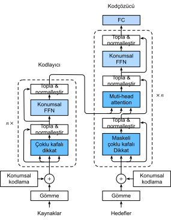

# Dönüştürücü
:label:`sec_transformer`

:numref:`subsec_cnn-rnn-self-attention` içinde CNN , RNN ve özdikkati karşılaştırdık. Özellikle, özdikkat hem paralel hesaplamanın hem de en kısa maksimum yol uzunluğunun keyfini sürer. Bu nedenle doğal olarak, özdikkat kullanarak derin mimariler tasarlamak caziptir. Girdi temsilleri için RNN'lere güvenen önceki özdikkat modellerinin aksine :cite:`Cheng.Dong.Lapata.2016,Lin.Feng.Santos.ea.2017,Paulus.Xiong.Socher.2017`, dönüştürücü modeli :cite:`Vaswani.Shazeer.Parmar.ea.2017` sadece herhangi bir evrişimli veya yinelemeli tabaka olmadan dikkat mekanizmalarına dayanmaktadır. Başlangıçta metin verilerinde diziden diziye öğrenme için önerilmiş olsa da, dönüştürücüler dil, görme, konuşma ve pekiştirmeli öğrenme alanlarında olduğu gibi çok çeşitli modern derin öğrenme uygulamalarında yaygın olmuştur. 

## Model

Kodlayıcı-kodçözücü mimarisinin bir örneği olarak, dönüştürücünün genel mimarisi :numref:`fig_transformer` içinde sunulmuştur. Gördüğümüz gibi, dönüştürücü bir kodlayıcı ve bir kodçözücüden oluşur. :numref:`fig_s2s_attention_details` içinde diziden diziye öğrenmede Bahdanau dikkatinden farklı olarak, girdi (kaynak) ve çıktı (hedef) dizi gömmeleri, özdikkate dayalı modülleri istifleyen kodlayıcıya ve kodçözücüye beslenmeden önce, konumsal kodlama ile toplanır.


:width:`500px`
:label:`fig_transformer`

Şimdi :numref:`fig_transformer` figüründeki dönüştürücü mimarisine genel bir bakış sunuyoruz. Yüksek düzeyde, dönüştürücü kodlayıcısı, her katmanın iki alt katmana sahip olduğu (ikisi de $\mathrm{altkatman}$ olarak ifade edilir) çoklu özdeş katmandan oluşan bir yığındır. Birincisi, çoklu kafalı bir özdikkat ortaklamasıdır ve ikincisi ise konumsal olarak ileriye besleme ağıdır. Özellikle, özdikkatteki kodlayıcıda, sorgular, anahtarlar ve değerler tüm önceki kodlayıcı katmanının çıktılarından gelir. :numref:`sec_resnet` içindeki ResNet tasarımından esinlenerek, her iki alt katman etrafında artık bağlantı kullanılır. Dönüştürücüde, dizinin herhangi bir pozisyonunda $\mathbf{x} \in \mathbb{R}^d$ herhangi bir girdi için $\mathrm{altkatman}(\mathbf{x}) \in \mathbb{R}^d$'ye ihtiyaç duyuyoruz, böylece $\mathbf{x} + \mathrm{altkatman}(\mathbf{x}) \in \mathbb{R}^d$, artık bağlantı $\mathbf{x} + \mathrm{altkatman}(\mathbf{x}) \in \mathbb{R}^d$ mümkündür. Artık bağlantıya bu ilavenin hemen ardından katman normalleştirmesi :cite:`Ba.Kiros.Hinton.2016` gelir. Sonuç olarak, dönüştürücü kodlayıcısı, girdi dizisinin her konumu için $d$ boyutlu bir vektör temsilini çıkarır. 

Dönüştürücü kodçözücü ayrıca artık bağlantılar ve katman normalleştirmeleri ile birden çok özdeş katman yığınıdır. Kodlayıcıda açıklanan iki alt katmanın yanı sıra, kodçözücü bu ikisi arasında kodlayıcı-kodçözücü dikkat olarak bilinen üçüncü bir alt katman ekler. Kodlayıcı-kod özücü dikkatinde, sorgular önceki kodçözücü katmanının çıktılarından ve anahtarlar ve değerler dönüştürücü kodlayıcı çıktılarından kaynaklanır. Kodçözücünün özdikkatinde, sorgular, anahtarlar ve değerler tüm önceki kodçözücü katmanının çıktılarından gelir. Bununla birlikte, kodçözücüdeki her pozisyonun, yalnızca kodçözücünün bu konuma kadar tüm pozisyonlara ilgi göstermesine izin verilir. Bu *maskelenmiş* dikkat, otomatik bağlanım özelliğini korur ve tahminin yalnızca üretilen çıktı belirteçlerine bağlı olmasını sağlar. 

:numref:`sec_multihead-attention` içindeki ölçeklendirilmiş nokta çarpımlarına ve :numref:`subsec_positional-encoding` içindeki konumsal kodlamaya dayanan çoklu kafalı dikkati zaten tanımladık ve uyguladık. Aşağıda, dönüştürücü modelinin geri kalanını uygulayacağız.

```{.python .input}
from d2l import mxnet as d2l
import math
from mxnet import autograd, np, npx
from mxnet.gluon import nn
import pandas as pd
npx.set_np()
```

```{.python .input}
#@tab pytorch
from d2l import torch as d2l
import math
import pandas as pd
import torch
from torch import nn
```

```{.python .input}
#@tab tensorflow
from d2l import tensorflow as d2l
import numpy as np
import pandas as pd
import tensorflow as tf
```

## [**Konumsal Olarak İleriye Besleme Ağlar**]

Konumsal olarak ileriye besleme ağı, aynı MLP'yi kullanarak tüm dizi pozisyonlarındaki temsili dönüştürür. Bu yüzden ona *konumsal olarak* diyoruz. Aşağıdaki uygulamada, (toplu iş boyutu, zaman adımlarının sayısı veya belirteç dizi uzunluğu, gizli birimlerin sayısı veya öznitelik boyutu) şekline sahip `X` girdisi iki katmanlı bir MLP tarafından (parti boyutu, zaman adımlarının sayısı, `ffn_num_outputs`) şekilli çıktı tensörüne dönüştürülecektir .

```{.python .input}
#@save
class PositionWiseFFN(nn.Block):
    """Konumsal olarak ileriye besleme ağı."""
    def __init__(self, ffn_num_hiddens, ffn_num_outputs, **kwargs):
        super(PositionWiseFFN, self).__init__(**kwargs)
        self.dense1 = nn.Dense(ffn_num_hiddens, flatten=False,
                               activation='relu')
        self.dense2 = nn.Dense(ffn_num_outputs, flatten=False)

    def forward(self, X):
        return self.dense2(self.dense1(X))
```

```{.python .input}
#@tab pytorch
#@save
class PositionWiseFFN(nn.Module):
    """Konumsal olarak ileriye besleme ağı."""
    def __init__(self, ffn_num_input, ffn_num_hiddens, ffn_num_outputs,
                 **kwargs):
        super(PositionWiseFFN, self).__init__(**kwargs)
        self.dense1 = nn.Linear(ffn_num_input, ffn_num_hiddens)
        self.relu = nn.ReLU()
        self.dense2 = nn.Linear(ffn_num_hiddens, ffn_num_outputs)

    def forward(self, X):
        return self.dense2(self.relu(self.dense1(X)))
```

```{.python .input}
#@tab tensorflow
#@save
class PositionWiseFFN(tf.keras.layers.Layer):
    """Konumsal olarak ileriye besleme ağı."""
    def __init__(self, ffn_num_hiddens, ffn_num_outputs, **kwargs):
        super().__init__(*kwargs)
        self.dense1 = tf.keras.layers.Dense(ffn_num_hiddens)
        self.relu = tf.keras.layers.ReLU()
        self.dense2 = tf.keras.layers.Dense(ffn_num_outputs)

    def call(self, X):
        return self.dense2(self.relu(self.dense1(X)))
```

Aşağıdaki örnek, [**tensörün en içteki boyutunun**] konumsal olarak ileriye besleme ağındaki çıktı sayısına değiştiğini göstermektedir. Aynı MLP tüm pozisyonlarda dönüştüğünden, tüm bu pozisyonlardaki girdiler aynı olduğunda, çıktıları da aynıdır.

```{.python .input}
ffn = PositionWiseFFN(4, 8)
ffn.initialize()
ffn(np.ones((2, 3, 4)))[0]
```

```{.python .input}
#@tab pytorch
ffn = PositionWiseFFN(4, 4, 8)
ffn.eval()
ffn(d2l.ones((2, 3, 4)))[0]
```

```{.python .input}
#@tab tensorflow
ffn = PositionWiseFFN(4, 8)
ffn(tf.ones((2, 3, 4)))[0]
```

## Artık Bağlantı ve Katman Normalleştirmesi

Şimdi :numref:`fig_transformer` figüründeki "topla ve normalleştir" bileşenine odaklanalım. Bu bölümün başında tanımladığımız gibi, bu, katman normalleştirmesinin hemen ardından geldiği bir artık bağlantıdır. Her ikisi de etkili derin mimarilerin anahtarıdır. 

:numref:`sec_batch_norm` bölümünde, toplu normalleştirmenin nasıl ortalandığını ve bir minigrup içindeki örnekler arasında nasıl yeniden ölçeklendiğini açıkladık. Katman normalleştirmesi, birincinin öznitelik boyutu boyunca normalleştirmesi dışında toplu normalleştirme ile aynıdır. Bilgisayarla görmede yaygın uygulamalarına rağmen, toplu normalleştirme deneysel olarak genellikle girdileri değişken uzunluktaki diziler olan doğal dil işleme görevlerinde katman normalleştirmesinden daha az etkilidir. 

Aşağıdaki kod parçacığı [**katman normalleştirme ve toplu normalleştirme ile farklı boyutlar arasında normalleştirmeyi karşılaştırır**].

```{.python .input}
ln = nn.LayerNorm()
ln.initialize()
bn = nn.BatchNorm()
bn.initialize()
X = d2l.tensor([[1, 2], [2, 3]])
# Eğitim modunda `X`'den ortalama ve varyansı hesaplayın
with autograd.record():
    print('layer norm:', ln(X), '\nbatch norm:', bn(X))
```

```{.python .input}
#@tab pytorch
ln = nn.LayerNorm(2)
bn = nn.BatchNorm1d(2)
X = d2l.tensor([[1, 2], [2, 3]], dtype=torch.float32)
# Eğitim modunda `X`'den ortalama ve varyansı hesaplayın
print('layer norm:', ln(X), '\nbatch norm:', bn(X))
```

```{.python .input}
#@tab tensorflow
ln = tf.keras.layers.LayerNormalization()
bn = tf.keras.layers.BatchNormalization()
X = tf.constant([[1, 2], [2, 3]], dtype=tf.float32)
print('layer norm:', ln(X), '\nbatch norm:', bn(X, training=True))
```

Artık `AddNorm` sınıfını [**bir artık bağlantı ve ardından katman normalleştirme**] kullanarak uygulayabiliriz. Düzenlileştirme için hattan düşürme de uygulanır.

```{.python .input}
#@save
class AddNorm(nn.Block):
    """Artık bağlantı ve ardından katman normalleştirme."""
    def __init__(self, dropout, **kwargs):
        super(AddNorm, self).__init__(**kwargs)
        self.dropout = nn.Dropout(dropout)
        self.ln = nn.LayerNorm()

    def forward(self, X, Y):
        return self.ln(self.dropout(Y) + X)
```

```{.python .input}
#@tab pytorch
#@save
class AddNorm(nn.Module):
    """Artık bağlantı ve ardından katman normalleştirme."""
    def __init__(self, normalized_shape, dropout, **kwargs):
        super(AddNorm, self).__init__(**kwargs)
        self.dropout = nn.Dropout(dropout)
        self.ln = nn.LayerNorm(normalized_shape)

    def forward(self, X, Y):
        return self.ln(self.dropout(Y) + X)
```

```{.python .input}
#@tab tensorflow
#@save
class AddNorm(tf.keras.layers.Layer):
    """Artık bağlantı ve ardından katman normalleştirme."""
    def __init__(self, normalized_shape, dropout, **kwargs):
        super().__init__(**kwargs)
        self.dropout = tf.keras.layers.Dropout(dropout)
        self.ln = tf.keras.layers.LayerNormalization(normalized_shape)
        
    def call(self, X, Y, **kwargs):
        return self.ln(self.dropout(Y, **kwargs) + X)
```

Artık bağlantı, iki girdinin aynı şekle sahip olmasını gerektirir, böylece [**çıktı tensörünün toplama işleminden sonra da aynı şekle sahip olmasını sağlar**].

```{.python .input}
add_norm = AddNorm(0.5)
add_norm.initialize()
add_norm(d2l.ones((2, 3, 4)), d2l.ones((2, 3, 4))).shape
```

```{.python .input}
#@tab pytorch
add_norm = AddNorm([3, 4], 0.5) # Normalized_shape is input.size()[1:]
add_norm.eval()
add_norm(d2l.ones((2, 3, 4)), d2l.ones((2, 3, 4))).shape
```

```{.python .input}
#@tab tensorflow
add_norm = AddNorm([1, 2], 0.5) # Normalized_shape is: [i for i in range(len(input.shape))][1:]
add_norm(tf.ones((2, 3, 4)), tf.ones((2, 3, 4)), training=False).shape
```

## Kodlayıcı

Dönüştürücü kodlayıcıyı toparlamak için gerekli tüm bileşenlerle, [**kodlayıcı içinde tek bir katman**] uygulayarak başlayalım. Aşağıdaki `EncoderBlock` sınıfı iki alt katman içerir: Çoklu kafalı özdikkat ve konumsal ileri beslemeli ağlar, burada bir artık bağlantı ve ardından katman normalleştirme her iki alt katman etrafında kullanılır.

```{.python .input}
#@save
class EncoderBlock(nn.Block):
    """Dönüştürücü kodlayıcı bloğu."""
    def __init__(self, num_hiddens, ffn_num_hiddens, num_heads, dropout,
                 use_bias=False, **kwargs):
        super(EncoderBlock, self).__init__(**kwargs)
        self.attention = d2l.MultiHeadAttention(
            num_hiddens, num_heads, dropout, use_bias)
        self.addnorm1 = AddNorm(dropout)
        self.ffn = PositionWiseFFN(ffn_num_hiddens, num_hiddens)
        self.addnorm2 = AddNorm(dropout)

    def forward(self, X, valid_lens):
        Y = self.addnorm1(X, self.attention(X, X, X, valid_lens))
        return self.addnorm2(Y, self.ffn(Y))
```

```{.python .input}
#@tab pytorch
#@save
class EncoderBlock(nn.Module):
    """Dönüştürücü kodlayıcı bloğu."""
    def __init__(self, key_size, query_size, value_size, num_hiddens,
                 norm_shape, ffn_num_input, ffn_num_hiddens, num_heads,
                 dropout, use_bias=False, **kwargs):
        super(EncoderBlock, self).__init__(**kwargs)
        self.attention = d2l.MultiHeadAttention(
            key_size, query_size, value_size, num_hiddens, num_heads, dropout,
            use_bias)
        self.addnorm1 = AddNorm(norm_shape, dropout)
        self.ffn = PositionWiseFFN(
            ffn_num_input, ffn_num_hiddens, num_hiddens)
        self.addnorm2 = AddNorm(norm_shape, dropout)

    def forward(self, X, valid_lens):
        Y = self.addnorm1(X, self.attention(X, X, X, valid_lens))
        return self.addnorm2(Y, self.ffn(Y))
```

```{.python .input}
#@tab tensorflow
#@save
class EncoderBlock(tf.keras.layers.Layer):
    """Dönüştürücü kodlayıcı bloğu."""
    def __init__(self, key_size, query_size, value_size, num_hiddens,
                 norm_shape, ffn_num_hiddens, num_heads, dropout, bias=False, **kwargs):
        super().__init__(**kwargs)
        self.attention = d2l.MultiHeadAttention(key_size, query_size, value_size, num_hiddens,
                                                num_heads, dropout, bias)
        self.addnorm1 = AddNorm(norm_shape, dropout)
        self.ffn = PositionWiseFFN(ffn_num_hiddens, num_hiddens)
        self.addnorm2 = AddNorm(norm_shape, dropout)
        
    def call(self, X, valid_lens, **kwargs):
        Y = self.addnorm1(X, self.attention(X, X, X, valid_lens, **kwargs), **kwargs)
        return self.addnorm2(Y, self.ffn(Y), **kwargs)
```

Gördüğümüz gibi, [**dönüştürücü kodlayıcısındaki herhangi bir katman girdisinin şeklini değiştirmez.**]

```{.python .input}
X = d2l.ones((2, 100, 24))
valid_lens = d2l.tensor([3, 2])
encoder_blk = EncoderBlock(24, 48, 8, 0.5)
encoder_blk.initialize()
encoder_blk(X, valid_lens).shape
```

```{.python .input}
#@tab pytorch
X = d2l.ones((2, 100, 24))
valid_lens = d2l.tensor([3, 2])
encoder_blk = EncoderBlock(24, 24, 24, 24, [100, 24], 24, 48, 8, 0.5)
encoder_blk.eval()
encoder_blk(X, valid_lens).shape
```

```{.python .input}
#@tab tensorflow
X = tf.ones((2, 100, 24))
valid_lens = tf.constant([3, 2])
norm_shape = [i for i in range(len(X.shape))][1:]
encoder_blk = EncoderBlock(24, 24, 24, 24, norm_shape, 48, 8, 0.5)
encoder_blk(X, valid_lens, training=False).shape
```

Aşağıdaki [**dönüştürücü kodlayıcı**] uygulamasında, yukarıdaki `EncoderBlock` sınıflarının `num_layers` tane örneğini yığınlıyoruz. Değerleri her zaman -1 ile 1 arasında olan sabit konumsal kodlamayı kullandığımızdan, girdi gömmeyi ve konumsal kodlamayı toplamadan önce yeniden ölçeklendirmek için öğrenilebilir girdi gömmelerinin değerlerini gömme boyutunun kareköküyle çarparız.
```{.python .input}
#@save
class TransformerEncoder(d2l.Encoder):
    """Transformer encoder."""
    def __init__(self, vocab_size, num_hiddens, ffn_num_hiddens,
                 num_heads, num_layers, dropout, use_bias=False, **kwargs):
        super(TransformerEncoder, self).__init__(**kwargs)
        self.num_hiddens = num_hiddens
        self.embedding = nn.Embedding(vocab_size, num_hiddens)
        self.pos_encoding = d2l.PositionalEncoding(num_hiddens, dropout)
        self.blks = nn.Sequential()
        for _ in range(num_layers):
            self.blks.add(
                EncoderBlock(num_hiddens, ffn_num_hiddens, num_heads, dropout,
                             use_bias))

    def forward(self, X, valid_lens, *args):
        # # Konumsal kodlama değerleri -1 ile 1 arasında olduğundan, 
        # gömme değerleri, toplanmadan önce yeniden ölçeklendirmek için 
        # gömme boyutunun kareköküyle çarpılır
        X = self.pos_encoding(self.embedding(X) * math.sqrt(self.num_hiddens))
        self.attention_weights = [None] * len(self.blks)
        for i, blk in enumerate(self.blks):
            X = blk(X, valid_lens)
            self.attention_weights[
                i] = blk.attention.attention.attention_weights
        return X
```

```{.python .input}
#@tab pytorch
#@save
class TransformerEncoder(d2l.Encoder):
    """Transformer encoder."""
    def __init__(self, vocab_size, key_size, query_size, value_size,
                 num_hiddens, norm_shape, ffn_num_input, ffn_num_hiddens,
                 num_heads, num_layers, dropout, use_bias=False, **kwargs):
        super(TransformerEncoder, self).__init__(**kwargs)
        self.num_hiddens = num_hiddens
        self.embedding = nn.Embedding(vocab_size, num_hiddens)
        self.pos_encoding = d2l.PositionalEncoding(num_hiddens, dropout)
        self.blks = nn.Sequential()
        for i in range(num_layers):
            self.blks.add_module("block"+str(i),
                EncoderBlock(key_size, query_size, value_size, num_hiddens,
                             norm_shape, ffn_num_input, ffn_num_hiddens,
                             num_heads, dropout, use_bias))

    def forward(self, X, valid_lens, *args):
        # # Konumsal kodlama değerleri -1 ile 1 arasında olduğundan, 
        # gömme değerleri, toplanmadan önce yeniden ölçeklendirmek için 
        # gömme boyutunun kareköküyle çarpılır
        X = self.pos_encoding(self.embedding(X) * math.sqrt(self.num_hiddens))
        self.attention_weights = [None] * len(self.blks)
        for i, blk in enumerate(self.blks):
            X = blk(X, valid_lens)
            self.attention_weights[
                i] = blk.attention.attention.attention_weights
        return X
```

```{.python .input}
#@tab tensorflow
#@save
class TransformerEncoder(d2l.Encoder):
    """Transformer encoder."""
    def __init__(self, vocab_size, key_size, query_size, value_size,
                 num_hiddens, norm_shape, ffn_num_hiddens, num_heads,
                 num_layers, dropout, bias=False, **kwargs):
        super().__init__(**kwargs)
        self.num_hiddens = num_hiddens
        self.embedding = tf.keras.layers.Embedding(vocab_size, num_hiddens)
        self.pos_encoding = d2l.PositionalEncoding(num_hiddens, dropout)
        self.blks = [EncoderBlock(
            key_size, query_size, value_size, num_hiddens, norm_shape,
            ffn_num_hiddens, num_heads, dropout, bias) for _ in range(
            num_layers)]
        
    def call(self, X, valid_lens, **kwargs):
        # # Konumsal kodlama değerleri -1 ile 1 arasında olduğundan, 
        # gömme değerleri, toplanmadan önce yeniden ölçeklendirmek için 
        # gömme boyutunun kareköküyle çarpılır
        X = self.pos_encoding(self.embedding(X) * tf.math.sqrt(
            tf.cast(self.num_hiddens, dtype=tf.float32)), **kwargs)
        self.attention_weights = [None] * len(self.blks)
        for i, blk in enumerate(self.blks):
            X = blk(X, valid_lens, **kwargs)
            self.attention_weights[
                i] = blk.attention.attention.attention_weights
        return X
```

Aşağıda [**iki katmanlı bir dönüştürücü kodlayıcısı oluşturmak**] için hiper parametreleri belirtiyoruz. Dönüştürücü kodlayıcı çıktısının şekli (toplu iş boyutu, zaman adımlarının sayısı, `num_hiddens`) şeklindedir.

```{.python .input}
encoder = TransformerEncoder(200, 24, 48, 8, 2, 0.5)
encoder.initialize()
encoder(np.ones((2, 100)), valid_lens).shape
```

```{.python .input}
#@tab pytorch
encoder = TransformerEncoder(
    200, 24, 24, 24, 24, [100, 24], 24, 48, 8, 2, 0.5)
encoder.eval()
encoder(d2l.ones((2, 100), dtype=torch.long), valid_lens).shape
```

```{.python .input}
#@tab tensorflow
encoder = TransformerEncoder(200, 24, 24, 24, 24, [1, 2], 48, 8, 2, 0.5)
encoder(tf.ones((2, 100)), valid_lens, training=False).shape
```

## Kodçözücü

:numref:`fig_transformer` şeklinde gösterildiği gibi, [**dönüştürücü kodçözücüsü birden çok özdeş katmandan oluşur**]. Her katman, üç alt katman içeren aşağıdaki `DecoderBlock` sınıfında uygulanır: Kodçözücü özdikkat, kodlayıcı-kodçözücü dikkat ve konumsal olarak ileri beslemeli ağlar. Bu alt katmanlar çevrelerinde bir artık bağlantı ve ardından katman normalleştirmesi kullanır. 

Bu bölümde daha önce de açıklandığı gibi, maskelenmiş çoklu kafalı kodçözücü özdikkatinde (ilk alt katman), sorgular, anahtarlar ve değerler önceki kodçözücü katmanının çıktılarından gelir. Diziden diziye modellerini eğitirken, çıktı dizisinin tüm pozisyonlarında (zaman adımları) belirteçleri bilinir. Bununla birlikte, tahmin esnasında çıktı dizisi belirteç belirteç oluşturulur; böylece, herhangi bir kodçözücü zaman adımında yalnızca üretilen belirteçler kodçözücünün özdikkatinde kullanılabilir. Kodçözücünün otomatik regresyonunu korumak için, maskeli özdikkat `dec_valid_lens`'ü belirtir, böylece herhangi bir sorgu yalnızca kodçözücünün sorgulama konumuna kadarki tüm konumlara ilgi gösterir.

```{.python .input}
class DecoderBlock(nn.Block):
    # Kodçözücüdeki `i`. blok
    def __init__(self, num_hiddens, ffn_num_hiddens, num_heads,
                 dropout, i, **kwargs):
        super(DecoderBlock, self).__init__(**kwargs)
        self.i = i
        self.attention1 = d2l.MultiHeadAttention(num_hiddens, num_heads,
                                                 dropout)
        self.addnorm1 = AddNorm(dropout)
        self.attention2 = d2l.MultiHeadAttention(num_hiddens, num_heads,
                                                 dropout)
        self.addnorm2 = AddNorm(dropout)
        self.ffn = PositionWiseFFN(ffn_num_hiddens, num_hiddens)
        self.addnorm3 = AddNorm(dropout)

    def forward(self, X, state):
        enc_outputs, enc_valid_lens = state[0], state[1]
        # Eğitim sırasında, herhangi bir çıktı dizisinin tüm belirteçleri 
        # aynı anda işlenir, bu nedenle `state[2][self.i]` ilklendiği gibi
        #  `None` olur. Tahmin sırasında herhangi bir çıktı dizisi 
        # belirtecinin kodunu çözerken, `state[2][self.i]`, geçerli zaman 
        # adımına kadar  `i`. bloğundaki kodu çözülmüş çıktının 
        # temsillerini içerir.
        if state[2][self.i] is None:
            key_values = X
        else:
            key_values = np.concatenate((state[2][self.i], X), axis=1)
        state[2][self.i] = key_values

        if autograd.is_training():
            batch_size, num_steps, _ = X.shape
            # `dec_valid_lens` şekli: (`batch_size`, `num_steps`),
            #  burada her satır [1, 2, ..., `num_steps`]
            dec_valid_lens = np.tile(np.arange(1, num_steps + 1, ctx=X.ctx),
                                     (batch_size, 1))
        else:
            dec_valid_lens = None

        # Öz-dikkat
        X2 = self.attention1(X, key_values, key_values, dec_valid_lens)
        Y = self.addnorm1(X, X2)
        # Kodlayıcı - kodçözücüye dikkat. `enc_outputs` şekli:
        # (`batch_size`, `num_steps`, `num_hiddens`)
        Y2 = self.attention2(Y, enc_outputs, enc_outputs, enc_valid_lens)
        Z = self.addnorm2(Y, Y2)
        return self.addnorm3(Z, self.ffn(Z)), state
```

```{.python .input}
#@tab pytorch
class DecoderBlock(nn.Module):
    # Kodçözücüdeki `i`. blok
    def __init__(self, key_size, query_size, value_size, num_hiddens,
                 norm_shape, ffn_num_input, ffn_num_hiddens, num_heads,
                 dropout, i, **kwargs):
        super(DecoderBlock, self).__init__(**kwargs)
        self.i = i
        self.attention1 = d2l.MultiHeadAttention(
            key_size, query_size, value_size, num_hiddens, num_heads, dropout)
        self.addnorm1 = AddNorm(norm_shape, dropout)
        self.attention2 = d2l.MultiHeadAttention(
            key_size, query_size, value_size, num_hiddens, num_heads, dropout)
        self.addnorm2 = AddNorm(norm_shape, dropout)
        self.ffn = PositionWiseFFN(ffn_num_input, ffn_num_hiddens,
                                   num_hiddens)
        self.addnorm3 = AddNorm(norm_shape, dropout)

    def forward(self, X, state):
        enc_outputs, enc_valid_lens = state[0], state[1]
        # Eğitim sırasında, herhangi bir çıktı dizisinin tüm belirteçleri 
        # aynı anda işlenir, bu nedenle `state[2][self.i]` ilklendiği gibi
        #  `None` olur. Tahmin sırasında herhangi bir çıktı dizisi 
        # belirtecinin kodunu çözerken, `state[2][self.i]`, geçerli zaman 
        # adımına kadar  `i`. bloğundaki kodu çözülmüş çıktının 
        # temsillerini içerir.
        if state[2][self.i] is None:
            key_values = X
        else:
            key_values = torch.cat((state[2][self.i], X), axis=1)
        state[2][self.i] = key_values
        if self.training:
            batch_size, num_steps, _ = X.shape
            # `dec_valid_lens` şekli: (`batch_size`, `num_steps`),
            #  burada her satır [1, 2, ..., `num_steps`]
            dec_valid_lens = torch.arange(
                1, num_steps + 1, device=X.device).repeat(batch_size, 1)
        else:
            dec_valid_lens = None

        # Öz-dikkat
        X2 = self.attention1(X, key_values, key_values, dec_valid_lens)
        Y = self.addnorm1(X, X2)
        # Kodlayıcı - kodçözücüye dikkat. `enc_outputs` şekli:
        # (`batch_size`, `num_steps`, `num_hiddens`)
        Y2 = self.attention2(Y, enc_outputs, enc_outputs, enc_valid_lens)
        Z = self.addnorm2(Y, Y2)
        return self.addnorm3(Z, self.ffn(Z)), state
```

```{.python .input}
#@tab tensorflow
class DecoderBlock(tf.keras.layers.Layer):
    # Kodçözücüdeki `i`. blok
    def __init__(self, key_size, query_size, value_size, num_hiddens,
                 norm_shape, ffn_num_hiddens, num_heads, dropout, i, **kwargs):
        super().__init__(**kwargs)
        self.i = i
        self.attention1 = d2l.MultiHeadAttention(key_size, query_size, value_size, num_hiddens, num_heads, dropout)
        self.addnorm1 = AddNorm(norm_shape, dropout)
        self.attention2 = d2l.MultiHeadAttention(key_size, query_size, value_size, num_hiddens, num_heads, dropout)
        self.addnorm2 = AddNorm(norm_shape, dropout)
        self.ffn = PositionWiseFFN(ffn_num_hiddens, num_hiddens)
        self.addnorm3 = AddNorm(norm_shape, dropout)
        
    def call(self, X, state, **kwargs):
        enc_outputs, enc_valid_lens = state[0], state[1]
        # Eğitim sırasında, herhangi bir çıktı dizisinin tüm belirteçleri 
        # aynı anda işlenir, bu nedenle `state[2][self.i]` ilklendiği gibi
        #  `None` olur. Tahmin sırasında herhangi bir çıktı dizisi 
        # belirtecinin kodunu çözerken, `state[2][self.i]`, geçerli zaman 
        # adımına kadar  `i`. bloğundaki kodu çözülmüş çıktının 
        # temsillerini içerir.
        if state[2][self.i] is None:
            key_values = X
        else:
            key_values = tf.concat((state[2][self.i], X), axis=1)
        state[2][self.i] = key_values
        if kwargs["training"]:
            batch_size, num_steps, _ = X.shape
            # `dec_valid_lens` şekli: (`batch_size`, `num_steps`),
            #  burada her satır [1, 2, ..., `num_steps`]
            dec_valid_lens = tf.repeat(tf.reshape(tf.range(1, num_steps + 1),
                                                 shape=(-1, num_steps)), repeats=batch_size, axis=0)

        else:
            dec_valid_lens = None
            
        # Öz-dikkat
        X2 = self.attention1(X, key_values, key_values, dec_valid_lens, **kwargs)
        Y = self.addnorm1(X, X2, **kwargs)
        # Kodlayıcı - kodçözücüye dikkat. `enc_outputs` şekli:
        # (`batch_size`, `num_steps`, `num_hiddens`)
        Y2 = self.attention2(Y, enc_outputs, enc_outputs, enc_valid_lens, **kwargs)
        Z = self.addnorm2(Y, Y2, **kwargs)
        return self.addnorm3(Z, self.ffn(Z), **kwargs), state
```

Kodlayıcı-kodçözücü dikkat ve artık bağlantılarda toplama işlemlerinde ölçeklendirilmiş nokta çarpımı işlemlerini kolaylaştırmak için, [**kodçözücünün öznitelik boyutu (`num_hiddens`) kodlayıcınınkiyle aynıdır.**]

```{.python .input}
decoder_blk = DecoderBlock(24, 48, 8, 0.5, 0)
decoder_blk.initialize()
X = np.ones((2, 100, 24))
state = [encoder_blk(X, valid_lens), valid_lens, [None]]
decoder_blk(X, state)[0].shape
```

```{.python .input}
#@tab pytorch
decoder_blk = DecoderBlock(24, 24, 24, 24, [100, 24], 24, 48, 8, 0.5, 0)
decoder_blk.eval()
X = d2l.ones((2, 100, 24))
state = [encoder_blk(X, valid_lens), valid_lens, [None]]
decoder_blk(X, state)[0].shape
```

```{.python .input}
#@tab tensorflow
decoder_blk = DecoderBlock(24, 24, 24, 24, [1, 2], 48, 8, 0.5, 0)
X = tf.ones((2, 100, 24))
state = [encoder_blk(X, valid_lens), valid_lens, [None]]
decoder_blk(X, state, training=False)[0].shape
```

Şimdi `DecoderBlock` `DecoderBlock` örneklerinden oluşan [**tam dönüştürücü kodçözücüyü**] oluşturuyoruz. Sonunda, tam bağlı bir katman tüm `vocab_size` olası çıktı belirteçleri için tahmin hesaplar. Hem dekoder öz-dikkat ağırlıkları hem de kodlayıcı-kodçözücü dikkat ağırlıkları daha sonra görselleştirme için saklanır.

Şimdi, `DecoderBlock`'un `num_layers` tane örnekten oluşan [**bütün dönüştürücü kodçözücüsünü**] oluşturuyoruz. Sonunda, tam bağlı bir katman, `vocab_size` boyutlu tüm olası çıktı belirteçleri için tahminleri hesaplar. Hem kodçözücü özdikkat ağırlıkları hem de kodlayıcı-kodçözücü dikkat ağırlıkları daha sonrasındaki görselleştirme için saklanır.

```{.python .input}
class TransformerDecoder(d2l.AttentionDecoder):
    def __init__(self, vocab_size, num_hiddens, ffn_num_hiddens,
                 num_heads, num_layers, dropout, **kwargs):
        super(TransformerDecoder, self).__init__(**kwargs)
        self.num_hiddens = num_hiddens
        self.num_layers = num_layers
        self.embedding = nn.Embedding(vocab_size, num_hiddens)
        self.pos_encoding = d2l.PositionalEncoding(num_hiddens, dropout)
        self.blks = nn.Sequential()
        for i in range(num_layers):
            self.blks.add(
                DecoderBlock(num_hiddens, ffn_num_hiddens, num_heads,
                             dropout, i))
        self.dense = nn.Dense(vocab_size, flatten=False)

    def init_state(self, enc_outputs, enc_valid_lens, *args):
        return [enc_outputs, enc_valid_lens, [None] * self.num_layers]

    def forward(self, X, state):
        X = self.pos_encoding(self.embedding(X) * math.sqrt(self.num_hiddens))
        self._attention_weights = [[None] * len(self.blks) for _ in range (2)]
        for i, blk in enumerate(self.blks):
            X, state = blk(X, state)
            # Kodçözücü özdikkat ağırlıkları
            self._attention_weights[0][
                i] = blk.attention1.attention.attention_weights
            # Kodlayıcı-kodçözücü dikkat ağırlıkları
            self._attention_weights[1][
                i] = blk.attention2.attention.attention_weights
        return self.dense(X), state

    @property
    def attention_weights(self):
        return self._attention_weights
```

```{.python .input}
#@tab pytorch
class TransformerDecoder(d2l.AttentionDecoder):
    def __init__(self, vocab_size, key_size, query_size, value_size,
                 num_hiddens, norm_shape, ffn_num_input, ffn_num_hiddens,
                 num_heads, num_layers, dropout, **kwargs):
        super(TransformerDecoder, self).__init__(**kwargs)
        self.num_hiddens = num_hiddens
        self.num_layers = num_layers
        self.embedding = nn.Embedding(vocab_size, num_hiddens)
        self.pos_encoding = d2l.PositionalEncoding(num_hiddens, dropout)
        self.blks = nn.Sequential()
        for i in range(num_layers):
            self.blks.add_module("block"+str(i),
                DecoderBlock(key_size, query_size, value_size, num_hiddens,
                             norm_shape, ffn_num_input, ffn_num_hiddens,
                             num_heads, dropout, i))
        self.dense = nn.Linear(num_hiddens, vocab_size)

    def init_state(self, enc_outputs, enc_valid_lens, *args):
        return [enc_outputs, enc_valid_lens, [None] * self.num_layers]

    def forward(self, X, state):
        X = self.pos_encoding(self.embedding(X) * math.sqrt(self.num_hiddens))
        self._attention_weights = [[None] * len(self.blks) for _ in range (2)]
        for i, blk in enumerate(self.blks):
            X, state = blk(X, state)
            # Kodçözücü özdikkat ağırlıkları
            self._attention_weights[0][
                i] = blk.attention1.attention.attention_weights
            # Kodlayıcı-kodçözücü dikkat ağırlıkları
            self._attention_weights[1][
                i] = blk.attention2.attention.attention_weights
        return self.dense(X), state

    @property
    def attention_weights(self):
        return self._attention_weights
```

```{.python .input}
#@tab tensorflow
class TransformerDecoder(d2l.AttentionDecoder):
    def __init__(self, vocab_size, key_size, query_size, value_size,
                 num_hiddens, norm_shape, ffn_num_hidens, num_heads, num_layers, dropout, **kwargs):
        super().__init__(**kwargs)
        self.num_hiddens = num_hiddens
        self.num_layers = num_layers
        self.embedding = tf.keras.layers.Embedding(vocab_size, num_hiddens)
        self.pos_encoding = d2l.PositionalEncoding(num_hiddens, dropout)
        self.blks = [DecoderBlock(key_size, query_size, value_size, num_hiddens, norm_shape,
                                  ffn_num_hiddens, num_heads, dropout, i) for i in range(num_layers)]
        self.dense = tf.keras.layers.Dense(vocab_size)
        
    def init_state(self, enc_outputs, enc_valid_lens, *args):
        return [enc_outputs, enc_valid_lens, [None] * self.num_layers]
    
    def call(self, X, state, **kwargs):
        X = self.pos_encoding(self.embedding(X) * tf.math.sqrt(tf.cast(self.num_hiddens, dtype=tf.float32)), **kwargs)
        self._attention_weights = [[None] * len(self.blks) for _ in range(2)]  # Kodçözücüdeki 2 dikkat katmanı
        for i, blk in enumerate(self.blks):
            X, state = blk(X, state, **kwargs)
            # Kodçözücü özdikkat ağırlıkları
            self._attention_weights[0][i] = blk.attention1.attention.attention_weights
            # Kodlayıcı-kodçözücü dikkat ağırlıkları
            self._attention_weights[1][i] = blk.attention2.attention.attention_weights
        return self.dense(X), state
    
    @property
    def attention_weights(self):
        return self._attention_weights
```

## [**Eğitim**]

Dönüştürücü mimarisini takip ederek bir kodlayıcı-kodçözücü modeli oluşturalım. Burada hem dönüştürücü kodlayıcının hem de dönüştürücü kodçözücünün 4 kafalı dikkat kullanan 2 katmana sahip olduğunu belirtiyoruz. :numref:`sec_seq2seq_training` içindekine benzer şekilde, dönüştürücü modelini İngilizce-Fransızca makine çevirisi veri kümelerinde diziden diziye öğrenmeye yönelik eğitiyoruz.

```{.python .input}
num_hiddens, num_layers, dropout, batch_size, num_steps = 32, 2, 0.1, 64, 10
lr, num_epochs, device = 0.005, 200, d2l.try_gpu()
ffn_num_hiddens, num_heads = 64, 4

train_iter, src_vocab, tgt_vocab = d2l.load_data_nmt(batch_size, num_steps)

encoder = TransformerEncoder(
    len(src_vocab), num_hiddens, ffn_num_hiddens, num_heads, num_layers,
    dropout)
decoder = TransformerDecoder(
    len(tgt_vocab), num_hiddens, ffn_num_hiddens, num_heads, num_layers,
    dropout)
net = d2l.EncoderDecoder(encoder, decoder)
d2l.train_seq2seq(net, train_iter, lr, num_epochs, tgt_vocab, device)
```

```{.python .input}
#@tab pytorch
num_hiddens, num_layers, dropout, batch_size, num_steps = 32, 2, 0.1, 64, 10
lr, num_epochs, device = 0.005, 200, d2l.try_gpu()
ffn_num_input, ffn_num_hiddens, num_heads = 32, 64, 4
key_size, query_size, value_size = 32, 32, 32
norm_shape = [32]

train_iter, src_vocab, tgt_vocab = d2l.load_data_nmt(batch_size, num_steps)

encoder = TransformerEncoder(
    len(src_vocab), key_size, query_size, value_size, num_hiddens,
    norm_shape, ffn_num_input, ffn_num_hiddens, num_heads,
    num_layers, dropout)
decoder = TransformerDecoder(
    len(tgt_vocab), key_size, query_size, value_size, num_hiddens,
    norm_shape, ffn_num_input, ffn_num_hiddens, num_heads,
    num_layers, dropout)
net = d2l.EncoderDecoder(encoder, decoder)
d2l.train_seq2seq(net, train_iter, lr, num_epochs, tgt_vocab, device)
```

```{.python .input}
#@tab tensorflow
num_hiddens, num_layers, dropout, batch_size, num_steps = 32, 2, 0.1, 64, 10
lr, num_epochs, device = 0.005, 200, d2l.try_gpu()
ffn_num_hiddens, num_heads = 64, 4
key_size, query_size, value_size = 32, 32, 32
norm_shape = [2]

train_iter, src_vocab, tgt_vocab = d2l.load_data_nmt(batch_size, num_steps)
encoder = TransformerEncoder(
    len(src_vocab), key_size, query_size, value_size, num_hiddens, norm_shape,
    ffn_num_hiddens, num_heads, num_layers, dropout)
decoder = TransformerDecoder(
    len(tgt_vocab), key_size, query_size, value_size, num_hiddens, norm_shape,
    ffn_num_hiddens, num_heads, num_layers, dropout)
net = d2l.EncoderDecoder(encoder, decoder)
d2l.train_seq2seq(net, train_iter, lr, num_epochs, tgt_vocab, device)
```

Eğitimden sonra dönüştürücü modelini [**birkaç İngilizce cümleyi**] Fransızca'ya çevirmek ve BLEU puanlarını hesaplamak için kullanıyoruz.

```{.python .input}
#@tab mxnet, pytorch
engs = ['go .', "i lost .", 'he\'s calm .', 'i\'m home .']
fras = ['va !', 'j\'ai perdu .', 'il est calme .', 'je suis chez moi .']
for eng, fra in zip(engs, fras):
    translation, dec_attention_weight_seq = d2l.predict_seq2seq(
        net, eng, src_vocab, tgt_vocab, num_steps, device, True)
    print(f'{eng} => {translation}, ',
          f'bleu {d2l.bleu(translation, fra, k=2):.3f}')
```

```{.python .input}
#@tab tensorflow
engs = ['go .', "i lost .", 'he\'s calm .', 'i\'m home .']
fras = ['va !', 'j\'ai perdu .', 'il est calme .', 'je suis chez moi .']
for eng, fra in zip(engs, fras):
    translation, dec_attention_weight_seq = d2l.predict_seq2seq(
        net, eng, src_vocab, tgt_vocab, num_steps, True)
    print(f'{eng} => {translation}, ',
          f'bleu {d2l.bleu(translation, fra, k=2):.3f}')
```

Son İngilizce cümleyi Fransızcaya çevirirken [**dönüştürücünün dikkat ağırlıklarını görselleştirmemize**] izin verin. Kodlayıcı özdikkat ağırlıklarının şekli (kodlayıcı katmanlarının sayısı, dikkat kafalarının sayısı, `num_steps` veya sorgu sayısı, `num_steps` veya anahtar değer çiftlerinin sayısı) şeklindedir.

```{.python .input}
#@tab all
enc_attention_weights = d2l.reshape(
    d2l.concat(net.encoder.attention_weights, 0),
    (num_layers, num_heads, -1, num_steps))
enc_attention_weights.shape
```

Özdikkat kodlayıcısında, hem sorgular hem de anahtarlar aynı girdi dizisinden gelir. Dolgu belirteçleri anlam taşımadığından, girdi dizisinin belirlenmiş geçerli uzunluğu ile, dolgu belirteçlerinin konumlarına hiçbir sorgu ilgi göstermez. Aşağıda, çoklu kafalı iki katmanın dikkat ağırlıkları satır satır gösterilmektedir. Her kafa, sorguların, anahtarların ve değerlerin ayrı bir temsil altuzaylarına dayanarak bağımsız olarak ilgi gösterir.

```{.python .input}
#@tab mxnet, tensorflow
d2l.show_heatmaps(
    enc_attention_weights, xlabel='Key positions', ylabel='Query positions',
    titles=['Head %d' % i for i in range(1, 5)], figsize=(7, 3.5))
```

```{.python .input}
#@tab pytorch
d2l.show_heatmaps(
    enc_attention_weights.cpu(), xlabel='Key positions',
    ylabel='Query positions', titles=['Head %d' % i for i in range(1, 5)],
    figsize=(7, 3.5))
```

[**Hem kodçözücü özdikkat ağırlıklarını hem de kodlayıcı-kodçözücü dikkat ağırlıklarını görselleştirmek için daha fazla veri düzenlemeye ihtiyacımız var.**] Örneğin, maskelenmiş dikkat ağırlıklarını sıfırla dolduruyoruz. Kodçözücü özdikkat ağırlıklarının ve kodlayıcı-kodçözücü dikkat ağırlıklarının her ikisinin de aynı sorguları olduğunu unutmayın: Dizinin başlangıç belirteci ve ardından çıktı belirteçleri.

```{.python .input}
dec_attention_weights_2d = [d2l.tensor(head[0]).tolist()
                            for step in dec_attention_weight_seq
                            for attn in step for blk in attn for head in blk]
dec_attention_weights_filled = d2l.tensor(
    pd.DataFrame(dec_attention_weights_2d).fillna(0.0).values)
dec_attention_weights = d2l.reshape(dec_attention_weights_filled,
                                    (-1, 2, num_layers, num_heads, num_steps))
dec_self_attention_weights, dec_inter_attention_weights = \
    dec_attention_weights.transpose(1, 2, 3, 0, 4)
dec_self_attention_weights.shape, dec_inter_attention_weights.shape
```

```{.python .input}
#@tab pytorch
dec_attention_weights_2d = [head[0].tolist()
                            for step in dec_attention_weight_seq
                            for attn in step for blk in attn for head in blk]
dec_attention_weights_filled = d2l.tensor(
    pd.DataFrame(dec_attention_weights_2d).fillna(0.0).values)
dec_attention_weights = d2l.reshape(dec_attention_weights_filled,
                                    (-1, 2, num_layers, num_heads, num_steps))
dec_self_attention_weights, dec_inter_attention_weights = \
    dec_attention_weights.permute(1, 2, 3, 0, 4)
dec_self_attention_weights.shape, dec_inter_attention_weights.shape
```

```{.python .input}
#@tab tensorflow
dec_attention_weights_2d = [head[0] for step in dec_attention_weight_seq
                            for attn in step 
                            for blk in attn for head in blk]
dec_attention_weights_filled = tf.convert_to_tensor(
    np.asarray(pd.DataFrame(dec_attention_weights_2d).fillna(
        0.0).values).astype(np.float32))
dec_attention_weights = tf.reshape(dec_attention_weights_filled, shape=(
    -1, 2, num_layers, num_heads, num_steps))
dec_self_attention_weights, dec_inter_attention_weights = tf.transpose(
    dec_attention_weights, perm=(1, 2, 3, 0, 4))
print(dec_self_attention_weights.shape, dec_inter_attention_weights.shape)
```

Kodçözücünün özdikkatinin otomatik bağlanım özelliği nedeniyle, hiçbir sorgu sorgu konumundan sonra anahtar/değer çiftlerine ilgi göstermez.

```{.python .input}
#@tab all
# Dizi başlangıç belirtecini içermek için 1 ekle
d2l.show_heatmaps(
    dec_self_attention_weights[:, :, :, :len(translation.split()) + 1],
    xlabel='Key positions', ylabel='Query positions',
    titles=['Head %d' % i for i in range(1, 5)], figsize=(7, 3.5))
```

Kodlayıcının özdikkatindeki duruma benzer şekilde, girdi dizisince belirtilen geçerli uzunluğu aracılığıyla, [**çıktı dizisinden gelen hiçbir sorgu bu girdi dizisinden dolgu belirteçlerine ilgi göstermez.**]

```{.python .input}
#@tab all
d2l.show_heatmaps(
    dec_inter_attention_weights, xlabel='Key positions',
    ylabel='Query positions', titles=['Head %d' % i for i in range(1, 5)],
    figsize=(7, 3.5))
```

Dönüştürücü mimarisi başlangıçta diziden-diziye öğrenme için önerilmiş olsa da, kitapta daha sonra keşfedeceğimiz gibi, dönüştürücü kodlayıcı ya da dönüştürücü kodçözücü genellikle farklı derin öğrenme görevleri için ayrı ayrı kullanılır. 

## Özet

* Dönüştürücü, kodlayıcı-kodçözücü mimarisinin bir örneğidir, ancak kodlayıcı veya kodçözücü uygulamada ayrı ayrı kullanılabilir.
* Dönüştürücüde, girdi dizisini ve çıktı dizisini temsil etmek için çoklu kafalı özdikkat kullanılır, ancak kodçözücünün maskelenmiş bir sürüm aracılığıyla otomatik bağlanım özelliğini korumak zorundadır.
* Hem artık bağlantılar hem de dönüştürücüdeki katman normalleştirmesi, bir çok derin modeli eğitmek için önemlidir.
* Dönüştürücü modelindeki konumsal olarak ileriye besleme ağı, aynı MLP'yi kullanarak tüm dizi konumlarındaki gösterimi dönüştürür.

## Alıştırmalar

1. Deneylerde daha derin bir dönüştürücü eğitin. Eğitim hızını ve çeviri performansını nasıl etkiler?
1. Dönüştürücüdeki ölçeklendirilmiş nokta çarpımı dikkatini toplayıcı dikkati ile değiştirmek iyi bir fikir midir? Neden?
1. Dil modellemesi için dönüştürücü kodlayıcısını mı, kodçözücüyü mü veya her ikisini birden mi kullanmalıyız? Bu yöntem nasıl tasarlanabilir?
1. Girdi dizileri çok uzunsa dönüştürücüler için ne zorluklar olabilir? Neden?
1. Dönüştürücülerin hesaplama ve bellek verimliliğini nasıl arttırılabilir? İpucu: Tay ve ark. tarafından hazırlanan çalışmaya başvurabilirsiniz. :cite:`Tay.Dehghani.Bahri.ea.2020`.
1. CNN kullanmadan imge sınıflandırma işleri için dönüştürücü tabanlı modelleri nasıl tasarlayabiliriz? İpucu: Görüntü dönüştürücüye başvurabilirsiniz :cite:`Dosovitskiy.Beyer.Kolesnikov.ea.2021`

:begin_tab:`mxnet`
[Tartışmalar](https://discuss.d2l.ai/t/348)
:end_tab:

:begin_tab:`pytorch`
[Tartışmalar](https://discuss.d2l.ai/t/1066)
:end_tab:
