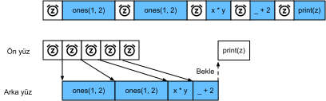

# Eşzamansız Hesaplama
:label:`sec_async`

Günümüzün bilgisayarları, birden fazla CPU çekirdeği (genellikle çekirdek başına birden fazla iş parçacığı), GPU başına birden çok işlem öğesi ve genellikle cihaz başına birden çok GPU'dan oluşan son derece paralel sistemlerdir. Kısacası, birçok farklı şeyi aynı anda, genellikle farklı cihazlarda işleyebiliriz. Ne yazık ki Python, en azından ekstra yardım almadan paralel ve eşzamansız kod yazmanın harika bir yolu değildir. Sonuçta, Python tek iş parçacıklıdır ve bunun gelecekte değişmesi pek olası değil. MXNet ve TensorFlow gibi derin öğrenme çerçeveleri, performansı artırmak için *eşzamansız programlama* modeli benimser, PyTorch ise Python'un kendi zamanlayıcısını kullanarak farklı bir performans değişimine yol açar. PyTorch için varsayılan olarak GPU işlemleri eşzamansızdır. GPU kullanan bir işlev çağırdığınızda, işlemler belirli bir aygıta sıralanır, ancak daha sonrasına kadar zorunlu olarak yürütülmez. Bu, CPU veya diğer GPU'lardaki işlemler de dahil olmak üzere paralel olarak daha fazla hesaplama yürütmemize olanak tanır. 

Bu nedenle, eşzamansız programlamanın nasıl çalıştığını anlamak, hesaplama gereksinimlerini ve karşılıklı bağımlılıkları proaktif azaltarak daha verimli programlar geliştirmemize yardımcı olur. Bu, bellek yükünü azaltmamıza ve işlemci kullanımını artırmamıza olanak tanır.

```{.python .input}
from d2l import mxnet as d2l
import numpy, os, subprocess
from mxnet import autograd, gluon, np, npx
from mxnet.gluon import nn
npx.set_np()
```

```{.python .input}
#@tab pytorch
from d2l import torch as d2l
import numpy, os, subprocess
import torch
from torch import nn
```

## Arka İşlemci Üzerinden Eşzamanlama

:begin_tab:`mxnet`
Isınmak için aşağıdaki basit örnek problemi göz önünde bulundurun: Rastgele bir matris oluşturmak ve çarpmak istiyoruz. Farkı görmek için NumPy ve `mxnet.np`'te bunu yapalım.
:end_tab:

:begin_tab:`pytorch`
Isınmak için aşağıdaki basit örnek problemi göz önünde bulundurun: Rastgele bir matris oluşturmak ve çarpmak istiyoruz. Farkı görmek için bunu hem NumPy hem de PyTorch tensorunda yapalım. PyTorch `tensor`'ün bir GPU'da tanımlandığını unutmayın.
:end_tab:

```{.python .input}
with d2l.Benchmark('numpy'):
    for _ in range(10):
        a = numpy.random.normal(size=(1000, 1000))
        b = numpy.dot(a, a)

with d2l.Benchmark('mxnet.np'):
    for _ in range(10):
        a = np.random.normal(size=(1000, 1000))
        b = np.dot(a, a)
```

```{.python .input}
#@tab pytorch
# GPU hesaplaması icin isinma
device = d2l.try_gpu()
a = torch.randn(size=(1000, 1000), device=device)
b = torch.mm(a, a)

with d2l.Benchmark('numpy'):
    for _ in range(10):
        a = numpy.random.normal(size=(1000, 1000))
        b = numpy.dot(a, a)

with d2l.Benchmark('torch'):
    for _ in range(10):
        a = torch.randn(size=(1000, 1000), device=device)
        b = torch.mm(a, a)
```

:begin_tab:`mxnet`
MXNet üzerinden yapılan kıyaslama çıktısı büyüklüğün kuvvetleri mertebesinde daha hızlıdır. Her ikisi de aynı işlemcide çalıştırıldığı için başka bir şey oluyor olmalı. MXNet'i geri dönmeden önce tüm arka işlemciyi hesaplamasını bitirmeye zorlamak, daha önce ne olduğunu gösterir: Ön işlemci, kontrolü Python'a geri verirken hesaplama arka işlemci tarafından yürütülür.
:end_tab:

:begin_tab:`pytorch`
PyTorch üzerinden yapılan kıyaslama çıktısı büyüklüğün kuvvetleri mertebesinde daha hızlıdır. NumPy nokta çarpımını CPU işlemcisinde yürütülür ve PyTorch matris çarpımını GPU'da yürütülür ve bu nedenle ikincisinin çok daha hızlı olması beklenir. Ama büyük zaman farkı, başka bir şeyin döndüğünü gösteriyor. Varsayılan olarak, PyTorch'ta GPU işlemleri eşzamansızdır. PyTorch'u geri dönmeden önce tüm hesaplamayı bitirmeye zorlamak daha önce neler olduğunu gösterir: Hesaplama arka işlemci tarafından yürütülür ve ön işlemci denetimi Python'a döndürür.
:end_tab:

```{.python .input}
with d2l.Benchmark():
    for _ in range(10):
        a = np.random.normal(size=(1000, 1000))
        b = np.dot(a, a)
    npx.waitall()
```

```{.python .input}
#@tab pytorch
with d2l.Benchmark():
    for _ in range(10):
        a = torch.randn(size=(1000, 1000), device=device)
        b = torch.mm(a, a)
    torch.cuda.synchronize(device)
```

:begin_tab:`mxnet`
Genel olarak, MXNet, örneğin Python aracılığıyla kullanıcılarla doğrudan etkileşimler için bir ön işlemciye ve sistem tarafından hesaplamayı gerçekleştirmek için kullanılan bir arka işlemciye sahiptir. :numref:`fig_frontends` içinde gösterildiği gibi, kullanıcılar Python, R, Scala ve C++ gibi çeşitli ön işlemci dillerinde MXNet programları yazabilir. Kullanılan ön işlemci programlama dili ne olursa olsun, MXNet programlarının yürütülmesi öncelikle C++ uygulamalarının arka işlemcisinde gerçekleşir. Ön işlemci dili tarafından verilen işlemler yürütme için arka işlemciye iletilir. Arka işlemci, sıraya alınmış görevleri sürekli olarak toplayan ve yürüten kendi iş parçacıklarını yönetir. Bunun çalışması için arka işlemcinin hesaplama çizgesindeki çeşitli adımlar arasındaki bağımlılıkları takip edebilmesi gerektiğini unutmayın. Bu nedenle, birbirine bağlı işlemleri paralel hale getirmek mümkün değildir.
:end_tab:

:begin_tab:`pytorch`
Genel olarak, PyTorch, örneğin Python aracılığıyla kullanıcılarla doğrudan etkileşimler için bir ön işlemciye ve sistem tarafından hesaplamayı gerçekleştirmek için kullanılan bir arka işlemciye sahiptir.  :numref:`fig_frontends` içinde gösterildiği gibi, kullanıcılar Python, R, Scala ve C++ gibi çeşitli ön işlemci dillerinde PyTorch programları yazabilir. Kullanılan ön işlemci programlama dili ne olursa olsun, PyTorch programlarının yürütülmesi öncelikle C++ uygulamalarının arka işlemcisinde gerçekleşir. Ön yüz dili tarafından verilen işlemler yürütme için arka işlemciye iletilir. Arka işlemci, sıraya alınmış görevleri sürekli olarak toplayan ve yürüten kendi iş parçacıklarını yönetir. Bunun çalışması için arka işlemcinin hesaplama çizgesindeki çeşitli adımlar arasındaki bağımlılıkları takip edebilmesi gerektiğini unutmayın. Bu nedenle, birbirine bağlı işlemleri paralel hale getirmek mümkün değildir.
:end_tab:


:width:`300px`
:label:`fig_frontends`

Bağımlılık çizgesini biraz daha iyi anlamak için başka bir basit örnek probleme bakalım.

```{.python .input}
x = np.ones((1, 2))
y = np.ones((1, 2))
z = x * y + 2
z
```

```{.python .input}
#@tab pytorch
x = torch.ones((1, 2), device=device)
y = torch.ones((1, 2), device=device)
z = x * y + 2
z
```


:label:`fig_asyncgraph`

Yukarıdaki kod parçacığı da :numref:`fig_asyncgraph` içinde gösterilmiştir. Python ön işlemci iş parçacığı ilk üç ifadeden birini çalıştırdığında, görevi arka işlemci kuyruğuna döndürür. Son ifadenin sonuçları *yazdırılmış* olması gerektiğinde, Python ön işlemci iş parçacığı C++ arka işlemci iş parçacığının `z` değişkenin sonucunu hesaplamayı tamamlamasını bekler. Bu tasarımın bir avantajı, Python ön işlemci iş parçacığının gerçek hesaplamaları gerçekleştirmesine gerek olmadığıdır. Böylece, Python'un performansından bağımsız olarak programın genel performansı üzerinde çok etkisi yoktur. :numref:`fig_threading`, ön işlemci ve arka işlemcinin nasıl etkileşime girdiğini gösterir. 


:label:`fig_threading`

## Engeller ve Engelleyiciler

:begin_tab:`mxnet`
Python'u tamamlanmasını beklemeye zorlayacak bir dizi işlem vardır: 

* Açıkçası `npx.waitall()`, hesaplama talimatlarının ne zaman verildiğine bakılmaksızın tüm hesaplama tamamlanana kadar bekler. Pratikte, kötü performansa yol açabileceğinden kesinlikle gerekli olmadıkça bu operatörü kullanmak kötü bir fikirdir.
* Belirli bir değişken kullanılabilir olana kadar beklemek istiyorsak `z.wait_to_read()`'i arayabiliriz. Bu durumda MXNet blokları, `z` değişkeni hesaplanıncaya kadar Python'a döner. Diğer hesaplamalar daha sonra devam edebilir.

Bunun pratikte nasıl çalıştığını görelim.
:end_tab:

```{.python .input}
with d2l.Benchmark('waitall'):
    b = np.dot(a, a)
    npx.waitall()

with d2l.Benchmark('wait_to_read'):
    b = np.dot(a, a)
    b.wait_to_read()
```

:begin_tab:`mxnet`
Her iki işlemin de tamamlanması yaklaşık aynı zaman alır. Bariz engelleme işlemlerinin yanı sıra, *örtülü* engelleyicilerin farkında olmanızı öneririz. Bir değişkenin yazdırılması, değişkenin kullanılabilir olmasını gerektirir ve bu nedenle bir engelleyicidir. Son olarak, `z.asnumpy()` aracılığıyla NumPy'ye dönüştürmeler ve `z.item()` aracılığıyla skalerlere dönüştürmeler, NumPy'nin eşzamansızlık kavramı olmadığı için engelleniyor. `print` işlevi gibi değerlere erişmesi gerekir.  

MXNet'in kapsamından NumPy ve geri sık küçük miktarlarda verilerin kopyalanması, aksi takdirde verimli bir kodun performansını yok edebilir, çünkü bu tür her bir işlem, başka bir şey yapılabilmeden *önce* ilgili terimi elde ederken gerekli tüm ara sonuçları değerlendirmek için hesaplama çizgesi gerektirir. 
:end_tab:

```{.python .input}
with d2l.Benchmark('numpy conversion'):
    b = np.dot(a, a)
    b.asnumpy()

with d2l.Benchmark('scalar conversion'):
    b = np.dot(a, a)
    b.sum().item()
```

## Hesaplamayı İyileştirme

:begin_tab:`mxnet`
Çok iş parçacıklı bir sistemde (normal dizüstü bilgisayarlarda bile 4 veya daha fazla iş parçacığı vardır ve çok yuvalı sunucularda bu sayı 256'yı geçebilir) zamanlayıcı işlemlerinin ek yükü önemli hale gelebilir. Bu nedenle hesaplamanın ve zamanlamanın eşzamansız ve paralel olarak gerçekleşmesi son derece arzu edilir. Bunu yapmanın faydasını göstermek için, bir değişkeni hem sırayla hem de eşzamansız olarak birden çok kez 1 artırırsak ne olacağını görelim. Her toplama arasına bir `wait_to_read` engelleyicisi ekleyerek eşzamanlı yürütme benzetimi yapıyoruz.
:end_tab:

```{.python .input}
with d2l.Benchmark('synchronous'):
    for _ in range(10000):
        y = x + 1
        y.wait_to_read()

with d2l.Benchmark('asynchronous'):
    for _ in range(10000):
        y = x + 1
    npx.waitall()
```

:begin_tab:`mxnet`
Python ön işlemci iş parçacığı ve C++ arka işlemci iş parçacığı arasındaki biraz basitleştirilmiş bir etkileşim aşağıdaki gibi özetlenebilir:
1. Ön işlemci, arka işlemcinin `y = x + 1`'i hesaplama görevini kuyruğa eklemesini emrediyor.
1. Arka işlemci daha sonra hesaplama görevlerini kuyruktan alır ve gerçek hesaplamaları gerçekleştirir.
1. Arka işlemci daha sonra hesaplama sonuçlarını ön işlemciye döndürür.
Bu üç aşamanın sürelerinin sırasıyla $t_1, t_2$ ve $t_3$ olduğunu varsayalım. Eşzamansız programlama kullanmazsak, 10000 hesaplamaları gerçekleştirmek için alınan toplam süre yaklaşık $10000 (t_1+ t_2 + t_3)$'dir. Eşzamanlı programlama kullanılıyorsa, 10000 hesaplamayı gerçekleştirmek için kullanılan toplam süre $t_1 + 10000 t_2 + t_3$ ($10000 t_2 > 9999t_1$ varsayarak) azaltılabilir, çünkü ön işlemci her döngü için hesaplama sonuçlarını döndürmede beklemek zorunda değildir.
:end_tab:

## Özet

* Derin öğrenme çerçeveleri, Python ön işlemcisini yürütme arka işlemcisinden ayırabilir. Bu, komutların arka işlemciye ve ilişkili paralellik içine hızlı eşzamansız olarak eklenmesine olanak tanır.
* Eşzamansızlık oldukça duyarlı bir ön işlemciye yol açar. Ancak, aşırı bellek tüketimine neden olabileceğinden görev kuyruğunu aşırı doldurmamak için dikkatli olun. Ön işlemciyi ve arka işlemciyi yaklaşık olarak senkronize ederken her minigrup için senkronize edilmesi önerilir.
* Çip satıcıları, derin öğrenmenin verimliliği hakkında çok daha ince tanımlanmış bir içgörü elde etmek için gelişmiş başarım çözümleme araçları sunar.

:begin_tab:`mxnet`
* MXNet'in bellek yönetiminden Python'a dönüşümlerin arka işlemciyi belirli değişken hazır olana kadar beklemeye zorlayacağını unutmayın. `print`, `asnumpy` ve `item` gibi işlevlerin hepsi bu etkiye sahiptir. Bu arzu edilebilir, ancak eşzamanlılığın dikkatsiz kullanımı performansı mahvedebilir.
:end_tab:

## Alıştırmalar

:begin_tab:`mxnet`
1. Yukarıda, eşzamansız hesaplama kullanmanın, 10000 hesaplamayı gerçekleştirmek için gereken toplam süreyi $t_1 + 10000 t_2 + t_3$'a indirebileceğini belirtmiştik. Neden burada $10000 t_2 > 9999 t_1$'yi varsaymak zorundayız?
1. `waitall` ve `wait_to_read` arasındaki farkı ölçün. İpucu: Bir dizi talimat uygulayın ve bir ara sonuç için senkronize edin.
:end_tab:

:begin_tab:`pytorch`
1. CPU'da, bu bölümdeki aynı matris çarpma işlemlerini karşılaştırın. Arka işlemci üzerinden hala eşzamansızlık gözlemleyebilir misiniz?
:end_tab:

:begin_tab:`mxnet`
[Tartışmalar](https://discuss.d2l.ai/t/361)
:end_tab:

:begin_tab:`pytorch`
[Tartışmalar](https://discuss.d2l.ai/t/2564)
:end_tab:
