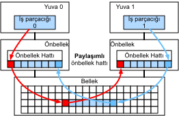

# Donanım
:label:`sec_hardware`

Yüksek performanslı sistemler oluşturmak, sorunun istatistiksel yönlerini yakalamak için algoritmaların ve modellerin iyi anlaşılmasını gerektirir. Aynı zamanda, temel donanım hakkında en azından bir nebze bilgi sahibi olmak da vazgeçilmezdir. Bu bölüm donanım ve sistem tasarımı üzerine yeterli bir dersin yerini almaz. Bunun yerine, bazı algoritmaların neden diğerlerinden daha verimli olduğunu ve nasıl iyi bir çıktı çıkarılacağını anlamak için bir başlangıç noktası görevi görebilir. İyi bir tasarım kolaylıkla büyük bir fark yaratabilir ve bu da bir ağı eğitebilmek (örneğin bir hafta içinde) ile hiç eğitememek (3 ay içinde, dolayısıyla son teslim tarihini kaçırarak) arasındaki farkı yaratabilir. Bilgisayarlara bakarak başlayacağız. Ardından CPU'lara ve GPU'lara daha dikkatli bakmak için yakınlaştıracağız. Son olarak, birden fazla bilgisayarın bir sunucu merkezinde veya bulutta nasıl bağlandığını gözden geçirmek için uzaklaştırıyoruz. 

:label:`fig_latencynumbers`

Sabırsız okuyucular :numref:`fig_latencynumbers` ile geçiştirebilirler. Colin Scott'ın [interaktif yazı](https://people.eecs.berkeley.edu/~rcs/research/interactive_latency.html)sından alınmıştır ve son on yıldaki ilerleme hakkında iyi bir genel bakış sunar. Orijinal sayılar Jeff Dean'in [2010 yılı Stanford konuşma](https://static.googleusercontent.com/media/research.google.com/en//people/jeff/Stanford-DL-Nov-2010.pdf)'sından kaynaklıdır. Aşağıdaki tartışma, bu sayıların gerekçelerini ve algoritmaları tasarlamada bize nasıl rehberlik edebilecekleri açıklamaktadır. Aşağıdaki tartışma çok yüksek düzeyde ve üstünkörüdür. Açıkça, gerçek bir kursun *ikamesi değildir*, bunun yerine sadece istatistiksel bir modelleyicinin uygun tasarım kararları vermesi için yeterli bilgiyi sağlamayı amaçlar. Bilgisayar mimarisine derinlemesine genel bir bakış için okuyucuyu :cite:`Hennessy.Patterson.2011` ya da [Arste Asanovic](http://inst.eecs.berkeley.edu/~cs152/sp19/) tarafından verilen konuyla ilgili en yakın zamanlı derse yönlendiriyoruz. 

## Bilgisayarlar

Derin öğrenme araştırmacılarının ve uygulayıcılarının çoğu, makul miktarda belleğe, hesaplamaya, GPU gibi bir tür hızlandırıcıya veya bunların katlarına sahip bir bilgisayara erişebilir. Bir bilgisayar aşağıdaki temel bileşenlerden oluşur: 

* Verdiğimiz programları yürütebilen (bir işletim sistemine ve diğer birçok şeyi çalıştırmaya ek olarak), tipik olarak 8 veya daha fazla çekirdekten oluşan bir işlemci (CPU olarak da adlandırılır).
* Ağırlık vektörleri ve etkinleştirmeleri gibi hesaplama sonuçlarını ve eğitim verilerini depolamak ve almak için bellek (RAM).
* 1 GB/s ila 100 GB/s arasında değişen hızlarda bir (bazen birden fazla) Ethernet ağ bağlantısı. Yüksek arka sunucularda daha gelişmiş ara bağlantılar bulunabilir.
* Sistemi bir veya daha fazla GPU'ya bağlamak için yüksek hızlı genişletme veri yolu (PCIe). Sunucular genellikle gelişmiş bir topolojiye bağlanan 8 hızlandırıcıya sahipken, masaüstü sistemleri kullanıcının bütçesine ve güç kaynağının boyutuna bağlı olarak 1 veya 2 taneye sahiptir.
* Birçok durumda PCIe veri yolu kullanılarak bağlanan manyetik sabit disk sürücüsü, katı hal sürücüsü gibi dayanıklı depolama. Eğitim verilerinin sisteme etkin bir şekilde aktarılmasını ve gerektiğinde ara kontrol noktalarının depolanmasını sağlar.

:label:`fig_mobo-symbol`

:numref:`fig_mobo-symbol` içinde belirttiği gibi, çoğu bileşen (ağ, GPU ve depolama) PCIe veri yolu boyunca CPU'ya bağlanır. Doğrudan CPU'ya bağlı birden fazla şeritten oluşur. Örneğin AMD'nin Threadripper 3, her biri her iki yönde de 16 Gbit/s veri aktarımı özelliğine sahip 64 PCIe 4.0 şeridine sahiptir. Bellek, toplam 100 GB/s'ye kadar bant genişliği ile doğrudan CPU'ya bağlanır. 

Bir bilgisayarda kod çalıştırdığımızda, verileri işlemcilere (CPU veya GPU'lar) karıştırmamız, hesaplama yapmamız ve ardından sonuçları işlemciden RAM'e ve dayanıklı depolamaya geri taşımamız gerekir. Bu nedenle, iyi bir performans elde etmek için sistemlerden herhangi biri büyük bir darboğaz haline gelmeden bunun sorunsuz bir şekilde çalıştığından emin olmalıyız. Örneğin, görüntüleri yeterince hızlı yükleyemezsek işlemcinin yapacak hiçbir işi olmaz. Aynı şekilde, matrisleri CPU'ya (veya GPU'ya) yeterince hızlı taşıyamazsak, işleme öğeleri boşta kalacaktır. Son olarak, ağ üzerinden birden fazla bilgisayarı senkronize etmek istiyorsak, bu, hesaplamayı yavaşlatmamalıdır. Bir seçenek iletişimi ve hesaplamayı aralıklarla bağlamaktır. Çeşitli bileşenlere daha ayrıntılı bir göz atalım. 

## Bellek

En temelinde bellek kolayca erişilebilir olması gereken verileri depolamak için kullanılır. Günümüzde CPU RAM'i genellikle modül başına 20—25 GB/s bant genişliği sunan [DDR4](https://en.wikipedia.org/wiki/DDR4_SDRAM) çeşididir. Her modülün 64 bit genişliğinde bir veri yolu vardır. Genellikle bellek modülleri çiftleri birden çok kanala izin vermek için kullanılır. CPU'lar 2 ile 4 arasında bellek kanallarına sahiptir, yani 40 GB/s ile 100 GB/s arasında en yüksek bellek bant genişliğine sahiptirler. Genellikle kanal başına iki küme vardır. Örneğin AMD'nin Zen 3 Threadripper'ı 8 yuvasına sahiptir. 

Bu sayılar etkileyici olsa da, aslında, hikayenin sadece bir kısmını anlatıyorlar. Bellekten bir bölümü okumak istediğimizde, önce bellek modülüne bilginin nerede bulunabileceğini söylemeliyiz. Yani, önce RAM'e *adresi* göndermemiz gerekiyor. Bu tamamlandıktan sonra sadece tek bir 64 bit kayıt veya uzun bir kayıt dizisini okumayı seçebiliriz. İkincisine *çoğuşma* denir. Özetle, belleğe bir adres gönderme ve aktarımı ayarlamak yaklaşık 100 ns alır (ayrıntılar kullanılan bellek yongalarının belirli zamanlama katsayılarına bağlıdır), sonraki her aktarım sadece 0.2 ns alır. Kısacası, ilk okuma, müteakip olanlardan 500 kat daha pahalıdır! Saniyede 10.000.000 adede kadar rasgele okuma yapabileceğimizi unutmayın. Bu, mümkün olduğunca rastgele bellek erişiminden kaçınmamızı ve bunun yerine seri okuma (ve yazma) kullanmamızı önerir.

Birden çok *küme* olduğunu dikkate aldığımızda konular biraz daha karmaşıktır. Her küme hafızayı büyük ölçüde bağımsız olarak okuyabilir. Bunun iki anlamı var. Bir yandan, rasgele okumaların etkin sayısı, belleğe eşit olarak yayılmaları koşuluyla 4 kata kadar daha yüksektir. Ayrıca çoğuşmalar da 4 kat daha hızlı olduğundan rastgele okuma yapmanın hala kötü bir fikir olduğu anlamına gelir. Öte yandan, 64 bitlik sınırlara bellek hizalaması nedeniyle, herhangi bir veri yapısını aynı sınırlarla hizalamak iyi bir fikirdir. Derleyiciler, uygun bayraklar ayarlandığında, bunu hemen hemen [otomatik olarak](https://en.wikipedia.org/wiki/Data_structure_alignment) yapar. Meraklı okuyucular, [Zeshan Chishti](http://web.cecs.pdx.edu/~zeshan/ece585_lec5.pdf)'ninki gibi DRAM'ler üzerine bir dersi incelemeye teşvik edilir. 

GPU belleği, CPU'lardan çok daha fazla işlem öğesine sahip olduklarından daha yüksek bant genişliği gereksinimlerine tabidir. Bunları ele almak için genel olarak iki seçenek vardır. Birincisi, bellek veri yolunu önemli ölçüde daha geniş yapmaktır. Örneğin, NVIDIA'nın RTX 2080 Ti'si 352 bit genişliğinde bir veri yoluna sahiptir. Bu, aynı anda çok daha fazla bilgi aktarılmasına olanak tanır. İkincisi, GPU'lar belirli yüksek performanslı bellek kullanır. NVIDIA'nın RTX ve Titan serisi gibi tüketici sınıfı cihazlar genellikle 500 GB/s'nin üzerinde toplam bant genişliğine sahip [GDDR6](https://en.wikipedia.org/wiki/GDDR6_SDRAM) yongaları kullanır. Bir alternatif HBM (yüksek bant genişlikli bellek) modülleri kullanmaktır. Çok farklı bir arayüz kullanırlar ve özel bir silikon yonga levhası üzerindeki GPU'lara doğrudan bağlanırlar. Bu onları çok pahalı hale getirir ve bunların kullanımı genellikle NVIDIA Volta V100 serisi hızlandırıcılar gibi üst düzey sunucu yongaları ile sınırlıdır. Oldukça şaşırtıcı olmayan bir şekilde, GPU belleği, eskilerin yüksek maliyeti nedeniyle CPU belleğinden genellikle *çok daha* küçüktür. Amaçlarımız için, performans özellikleri genel olarak benzer, sadece çok daha hızlıdır. Bu kitabın amacı için detayları güvenle görmezden gelebiliriz. Sadece yüksek verim için GPU çekirdeklerini ayarlarken önemlidir. 

## Depolama

RAM'in bazı temel özelliklerinin *bant genişliği* ve *gecikme* olduğunu gördük. Aynı şey depolama cihazları için de geçerlidir, sadece farklılıklar daha da aşırı olabilir. 

### Sabit Disk Sürücüleri

*Sabit disk sürücüleri* (HDD'ler) yarım asırdan uzun süredir kullanılmaktadır. Özetle, herhangi bir parçada okumak veya yazmak için yerleştirilebilen kafaları olan bir dizi döner tabla içerirler. Üst düzey diskler 9 tabak üzerinde 16 TB'a kadar tutar. HDD'lerin en önemli avantajlarından biri, nispeten ucuz olmalarıdır. Birçok dezavantajlarından biri, tipik olarak feci arıza modları ve nispeten yüksek okuma gecikmeleridir.

İkincisini anlamak için, HDD'lerin yaklaşık 7.200 RPM'de (dakikadaki devir) döndüklerini göz önünde bulundurun. Eğer çok daha hızlı olsalardı tabaklara uygulanan merkezkaç kuvveti nedeniyle parçalanırlardı. Diskteki belirli bir sektöre erişmek söz konusu olduğunda bunun büyük bir dezavantajı vardır: Plaka pozisyonunda dönene kadar beklememiz gerekir (kafaları hareket ettirebiliriz, ancak gerçek diskleri hızlandıramayız). Bu nedenle, istenen veriler bulunana kadar 8 ms sürebilir. Bunun ortak bir yolu, HDD'lerin yaklaşık 100 IOP'de (saniyedeki girdi/çıktı işlemleri) çalışabileceğini söylemektir. Bu sayı esasen son yirmi yıldır değişmeden kaldı. Daha da kötüsü, bant genişliğini arttırmak eşit derecede zordur (100—200 MB/s sırasındadır). Sonuçta, her kafa bir bit parçasını okur, bu nedenle bit hızı sadece bilgi yoğunluğunun karekökü ile ölçeklenir. Sonuç olarak, HDD'ler hızla çok büyük veri kümeleri için arşiv depolamaya ve düşük dereceli depolamaya indirgeniyor. 

### Katı Hal Sürücüleri

Katı hal sürücüleri (SSD'ler) bilgileri kalıcı olarak depolamak için flash bellek kullanır. Bu, depolanan kayıtlara *çok daha hızlı* erişim sağlar. Modern SSD'ler 100.000 ila 500.000 IOP'de, yani HDD'lerden 3. derece üs kuvveti kadar daha hızlı çalışabilir. Ayrıca, bant genişliği 1—3 GB/s'ye, yani HDD'lerden çok yukarı kademe bir hıza ulaşabilir. Bu gelişmeler kulağa gerçek olamayacak kadar iyi geliyor. Gerçekten de, SSD'ler tasarlanma şekli nedeniyle aşağıdaki uyarılarla birlikte gelirler.

* SSD'ler bilgileri bloklar halinde depolar (256 KB veya daha büyük). Sadece bir bütün olarak yazılabilirler, bu da kayda değer bir zaman alır. Sonuç olarak SSD'de bit düzeyinde rastgele yazmalar çok düşük performansa sahiptir. Aynı şekilde, bloğun okunması, silinmesi ve ardından yeni bilgilerle yeniden yazılması gerektiğinden, genel olarak veri yazmak önemli zaman alır. Şimdiye kadar SSD denetleyicileri ve bellenim (firmware) bunu azaltmak için algoritmalar geliştirdi. Bununla birlikte, yazmalar özellikle QLC (dörtlük düzeyde hücre) SSD'ler için çok daha yavaş olabilir. İyileştirilmiş performansın anahtarı, bir *işlem kuyruğu* tutmak, mümkünse okumaları ve büyük bloklar halinde yazmayı tercih etmektir.
* SSD'lerdeki bellek hücreleri nispeten hızlı bir şekilde yıpranır (genellikle birkaç bin yazmadan sonra). Aşınma seviyesi koruma algoritmaları bozulmayı birçok hücreye yayabilir. Yani, dosyaları takas etmek veya büyük günlük dosyası toplamaları için SSD'lerin kullanılması önerilmez.
* Son olarak, bant genişliğindeki büyük artış, bilgisayar tasarımcılarını doğrudan PCIe veri yoluna SSD'leri takmaya zorladı. Bunu işleyebilen sürücüler, NVMe (Non Volatile Memory enhanced) olarak adlandırılan sürücüler, 4 adede kadar PCIe şeridini kullanabilir. Bu, PCIe 4.0 üzerinde 8 GB/s'ye kadar tutarındadır.

### Bulut Depolama

Bulut depolama, yapılandırılabilir bir performans aralığı sağlar. Yani, sanal makinelere depolama ataması, kullanıcılar tarafından seçildiği üzere hem miktar hem de hız açısından dinamiktir. Kullanıcıların, gecikme süresi çok yüksek olduğunda, örneğin birçok küçük kaydın olduğu eğitim sırasında, sağlanan IOP sayısını artırmalarını öneririz.

## CPU'lar

Merkezi işlem birimleri (CPU'lar), herhangi bir bilgisayarın en önemli parçasıdır. Bir dizi temel bileşenden oluşurlar: Makine kodunu yürütebilen *işlemci çekirdekleri*, bunları birbirine bağlayan bir *veriyolu* (belirli topoloji işlemci modelleri, nesiller ve satıcılar arasında önemli ölçüde farklılık gösterir) ve  ana bellekten okumalarla mümkün olandan daha yüksek bant genişliği ve daha düşük gecikmeli bellek erişimine izin vermek için *önbellekler*. Son olarak, neredeyse tüm modern CPU'lar, medya işleme ve makine öğrenmesinde yaygın oldukları için yüksek performanslı doğrusal cebire ve evrişimlere yardımcı olmak için *vektör işleme birimleri* içerir. 

:label:`fig_skylake`

:numref:`fig_skylake` Intel Skylake tüketici sınıfı dört çekirdekli CPU'yu tasvir eder. Tümleşik bir GPU, önbellekleri ve dört çekirdeği bağlayan bir çember veriyolu vardır. Ethernet, WiFi, Bluetooth, SSD denetleyicisi ve USB gibi çevre birimleri yonga setinin bir parçasıdır ya da CPU'ya doğrudan takılıdır (PCIe). 

### Mikromimari

İşlemci çekirdeklerinin her biri oldukça gelişmiş bir bileşen kümesinden oluşur. Ayrıntılar nesiller ve satıcılar arasında farklılık gösterse de, temel işlevsellik oldukça standarttır. Ön işlmeci talimatları yükler ve hangi yolun alınacağını tahmin etmeye çalışır (örn. kontrol akışı için). Talimatlar daha sonra birleştirici kodundan mikro talimatlara çevrilir. Birleştirici kodu genellikle bir işlemcinin yürüttüğü en düşük düzey kod değildir. Bunun yerine, karmaşık talimatlar daha alt düzey işlemler kümesine çözülebilir. Bunlar daha sonra gerçek yürütme çekirdeği tarafından işlenir. Genellikle sonraki, aynı anda birçok işlemi gerçekleştirebilir. Örneğin, :numref:`fig_cortexa77`'ün ARM Cortex A77 çekirdeği aynı anda 8 adede kadar işlem gerçekleştirebilir. 

:label:`fig_cortexa77`

Bu, verimli programların bağımsız olarak gerçekleştirilebilmesi şartıyla saat döngüsü başına birden fazla talimat gerçekleştirebileceği anlamına gelir. Tüm birimler eşit oluşturulmaz. Bazıları tamsayı talimatlarında uzmanlaşırken diğerleri kayan nokta performansı için optimize edilmiştir. Verimi artırmak için işlemci aynı anda bir dallanma talimatında birden fazla kod yolunu izleyebilir ve ardından alınmayan dalların sonuçlarını atabilir. Bu nedenle şube tahmin birimleri (ön uçta) sadece en umut verici yolların takip edileceği şekilde önemlidir. 

### Vektörleştirme

Derin öğrenme aşırı derecede hesaplamaya açtır. Bu nedenle, işlemcileri makine öğrenmesine uygun hale getirmek için, bir saat döngüsünde birçok işlemi gerçekleştirmesi gerekir. Bu vektör birimleri vasıtasıyla elde edilir. Farklı isimleri vardır: ARM'de bunlara NEON denir, x86'da bunlara (yeni nesil) [AVX2](https://en.wikipedia.org/wiki/Advanced_Vector_Extensions) birimleri denir. Ortak bir yönü, SIMD (tek komut çoklu veri) işlemlerini gerçekleştirebilmeleridir. :numref:`fig_neon128`, ARM'de bir saat döngüsünde 8 kısa tamsayının nasıl eklenebileceğini gösterir.

:label:`fig_neon128`

Mimari seçeneklere bağlı olarak, bu tür yazmaçlar 512 bit'e kadar uzunluğa sahiptir ve 64 çifte kadar sayının katışımına izin verir. Örneğin, iki sayıyı çarpıp üçüncüye ekliyor olabiliriz, ki bu da kaynaşmış çarpma-toplama olarak da bilinir. Intel'in [OpenVino](https://01.org/openvinotoolkit), sunucu sınıfı CPU'larda derin öğrenme için hatrı sayılır verim elde etmek için bunları kullanır. Yine de, bu sayının GPU'ların başarabilecekleri tarafından tamamen gölgede kaldığını unutmayın. Örneğin, NVIDIA'nın RTX 2080 Ti'sinde her biri herhangi bir zamanda böyle bir işlemi işleyebilen 4.352 CUDA çekirdeği vardır.

### Önbellek

Aşağıdaki durumu göz önünde bulundurun: we have a modest CPU core with 4 cores as depicted in :numref:`fig_skylake` yukarıda, 2 GHz frekansında çalışan. Ayrıca, bir IPC (saat başına talimatlar) sayısı 1 olduğunu ve birimlerin 256-bit genişliği etkin olan AVX2 olduğunu varsayalım. Ayrıca AVX2 işlemleri için kullanılan kayıtlardan en az birinin bellekten alınması gerektiğini varsayalım. Bu, CPU saat döngüsü başına $4 \times 256 \text{ bit} = 128 \text{ bytes}$ veri tüketir anlamına gelir. Saniyede işlemciye $2 \times 10^9 \times 128 = 256 \times 10^9$ bayt aktaramazsak işleme elemanları açlıktan ölecek. Ne yazık ki böyle bir çipin bellek arayüzü sadece 20—40 GB/s veri aktarımını destekler, yani, bir büyüklük daha azdır. Düzeltme, bellekten olabildiğince yeni* veri yüklemekten kaçınmak ve CPU'da yerel olarak önbelleğe almaktır. Burası önbelleklerin kullanışlı olduğu yer. Genellikle aşağıdaki isimler veya kavramlar kullanılır: 

* **Kayıtlar** kesinlikle önbelleğin bir parçası değil konuşuyor. Sahne talimatlarına yardım ediyorlar. Yani, CPU kayıtları bir CPU'nun herhangi bir gecikme cezası olmadan saat hızında erişebileceği bellek konumlarıdır. CPU'ların onlarca kayıt var. Kayıtları verimli bir şekilde kullanmak derleyici (veya programcı) kadardır. Örneğin C programlama dili `register` anahtar sözcüğüne sahiptir.
* **L1 önbelleği** yüksek bellek bant genişliği gereksinimlerine karşı ilk savunma hattıdır. L1 önbellekleri küçüktür (tipik boyutlar 32—64 KB olabilir) ve genellikle veri ve yönergeler önbelleğe bölünür. L1 önbelleğinde veriler bulunduğunda, erişim çok hızlıdır. Orada bulunamazsa, arama önbellek hiyerarşisinde ilerler.
* **L2 önbelleği** bir sonraki durak. Mimari tasarımına ve işlemci boyutuna bağlı olarak özel olabilirler. Yalnızca belirli bir çekirdek tarafından erişilebilir veya birden fazla çekirdek arasında paylaşılabilir. L2 önbellekler daha büyüktür (çekirdek başına genellikle 256—512 KB) ve L1'den daha yavaştır. Ayrıca, L2'deki bir şeye erişmek için öncelikle verilerin L1'de olmadığını kontrol etmemiz gerekir; bu da az miktarda ekstra gecikme ekliyor.
* **L3 önbelleği** birden fazla çekirdek arasında paylaşılır ve oldukça büyük olabilir. AMD'nin Epyc 3 sunucu CPU'ları, birden fazla yongaya yayılmış 256 MB önbelleğe sahiptir. Daha tipik sayılar 4-8 MB aralığındadır.

Hangi bellek öğelerinin ihtiyaç duyulacağını tahmin etmek, çip tasarımında en önemli optimizasyon parametrelerinden biridir. Örneğin, önbelleğe alma algoritmalarının çoğu geriye doğru ziyade ileri* ileri* önbelleği* okumaya çalışacağından, bellekten ileri* yönde geçmeniz önerilir. Aynı şekilde, bellek erişim düzenlerini yerel tutmak performansı iyileştirmenin iyi bir yoludur. 

Ön bellek eklemek çift kenarlı bir kılıçtır. Bir yandan işlemci çekirdeklerinin verilerden açlıktan ölmemesini sağlarlar. Aynı zamanda talaş boyutunu arttırırlar, aksi takdirde işlem gücünü arttırmak için harcanmış olabilecek alanı kullanarak. Dahası, *önbellek özlemleri* pahalı olabilir. :numref:`fig_falsesharing`'te gösterildiği gibi en kötü durum senaryosunu (*false sharing*) düşünün. İşlemci 1 iş parçacığı veri istediğinde, bir bellek konumu işlemci 0 önbelleğe alınır. Bunu elde etmek için, işlemcinin ne yaptığını durdurması, bilgileri ana belleğe geri yazması ve ardından işlemci 1'in bellekten okumasına izin vermesi gerekir. Bu işlem sırasında her iki işlemci de bekler. Oldukça potansiyel olarak bu tür kod, verimli bir tek işlemcili uygulamayla karşılaştırıldığında birden çok işlemcide *daha yavaş* çalışır. Bu, önbellek boyutlarının (fiziksel boyutlarının yanı sıra) pratik bir sınırın bulunmasının bir başka nedeni daha. 

:label:`fig_falsesharing`

## GPU'lar ve diğer Hızlandırıcılar

Derin öğrenmenin GPU'lar olmadan başarılı olamayacağını iddia etmek abartı değildir. Aynı belirteçle, GPU üreticilerinin servetlerinin derin öğrenme nedeniyle önemli ölçüde arttığını iddia etmek oldukça makul. Donanım ve algoritmaların bu ortak evrimi, daha iyi ya da kötü derin öğrenmenin tercih edilen istatistiksel modelleme paradigmasının olduğu bir duruma yol açmıştır. Bu nedenle, GPU'ların ve TPU :cite:`Jouppi.Young.Patil.ea.2017` gibi ilgili hızlandırıcıların spesifik faydalarını anlamak için öder. 

Not genellikle pratikte yapılan bir ayrımdır: hızlandırıcılar eğitim veya çıkarım için optimize edilmiştir. İkincisi için sadece bir ağdaki ileri yayılımı hesaplamamız gerekiyor. Geri yayılma için ara veri depolama gerekmez. Ayrıca, çok hassas hesaplama gerekmeyebilir (FP16 veya INT8 genellikle yeterli). Öte yandan, eğitim sırasında tüm ara sonuçların degradeleri hesaplamak için depolama alanı gerekir. Dahası, degradelerin birikmesi, sayısal alt akıntıdan (veya taşmadan) kaçınmak için daha yüksek hassasiyet gerektirir. Bu, FP16 (veya FP32 ile karışık hassasiyet) minimum gereksinim olduğu anlamına gelir. Tüm bunlar daha hızlı ve daha büyük bellek (HBM2'ye karşı GDDR6) ve daha fazla işlem gücü gerektirir. Örneğin, NVIDIA'nın [Turing](https://devblogs.nvidia.com/nvidia-turing-architecture-in-depth/) T4 GPU'ları çıkarım için optimize edilirken V100 GPU'ları eğitim için tercih edilir. 

:numref:`fig_neon128`'te gösterildiği gibi vektörleştirmeyi hatırlayın. Bir işlemci çekirdeğine vektör birimleri eklemek, verimliliği önemli ölçüde artırmamızı sağladı. Örneğin, :numref:`fig_neon128`'teki örnekte aynı anda 16 işlemi gerçekleştirebildik. İlk olarak, sadece vektörler arasındaki işlemleri değil matrisler arasında da optimize eden operasyonlar eklesek ne olur? Bu strateji tensör çekirdeklerine yol açtı (kısa süre içinde ele alınacak). İkincisi, daha çok çekirdek eklersek ne olur? Özetle, bu iki strateji GPU'lardaki tasarım kararlarını özetlemektedir. :numref:`fig_turing_processing_block` temel işlem bloğu hakkında genel bir bakış sunar. 16 tamsayı ve 16 kayan nokta birimi içerir. Buna ek olarak, iki tensör çekirdeği, derin öğrenmeyle ilgili ek işlemlerin dar bir alt kümesini hızlandırır. Her akış çok işlemcili dört bloktan oluşur. 

:width:`150px`
:label:`fig_turing_processing_block`

Ardından, 12 akış çoklu işlemcisi, üst düzey TU102 işlemcileri oluşturan grafik işleme kümeleri halinde gruplandırılır. Geniş bellek kanalları ve L2 önbellek kurulumu tamamlar. :numref:`fig_turing` ilgili ayrıntılara sahiptir. Böyle bir cihazın tasarlanmasının nedenlerinden biri, daha kompakt talaşlara izin vermek ve verim sorunlarıyla başa çıkmak için ayrı ayrı blokların gerektiğinde eklenebilmesi veya çıkarılabildiğidir (hatalı modüller etkinleştirilmeyebilir). Neyse ki bu tür cihazları programlamak, CUDA ve çerçeve kodunun katmanlarının altındaki rahat derin öğrenme araştırmacılarından iyi gizlenmiştir. Özellikle, mevcut kaynakların olması koşuluyla, programlardan birinden fazlası GPU'da aynı anda yürütülebilir. Bununla birlikte, cihaz belleğine uymayan modelleri seçmekten kaçınmak için cihazların sınırlamalarının farkında olmak öder. 

:width:`350px`
:label:`fig_turing`

Daha ayrıntılı olarak bahsetmeye değer son yönü *tensör çekirdekleri*. Derin öğrenme için özellikle etkili olan daha optimize edilmiş devreler ekleme eğiliminin yeni bir örneğidir. Örneğin, TPU hızlı matris çarpımı için :cite:`Kung.1988` sistolik bir dizi ekledi. Orada tasarım, büyük operasyonların çok az sayıda (ilk nesil TPU'lar için) destekleyecektir. Tensör çekirdekleri diğer ucunda. Sayısal hassasiyetlerine bağlı olarak $4 \times 4$ ve $16 \times 16$ matrisleri içeren küçük işlemler için optimize edilmişlerdir. :numref:`fig_tensorcore` optimizasyonlara genel bir bakış sunar. 

:width:`400px`
:label:`fig_tensorcore`

Açıkçası hesaplama için optimize edilirken bazı uzlaşmalar yapıyoruz. Bunlardan biri, GPU'ların kesintileri ve seyrek verileri ele almakta çok iyi olmadığıdır. [Gunrock](https://github.com/gunrock/gunrock) :cite:`Wang.Davidson.Pan.ea.2016` gibi önemli istisnalar olsa da, seyrek matrislerin ve vektörlerin erişim düzeni, GPU'ların mükemmel olduğu yüksek bant genişliği patlama okuma işlemleriyle iyi gitmez. Her iki hedefi de eşleştirmek aktif bir araştırma alanıdır. Bkz., [DGL](http://dgl.ai), grafikler üzerinde derin öğrenme için ayarlanmış bir kütüphane. 

## Ağ ve Otobüsler

Optimizasyon için tek bir cihaz yetersiz olduğunda, işleme senkronize etmek için veri aktarmamız gerekir. Ağların ve otobüslerin kullanışlı olduğu yer burası. Bir dizi tasarım parametresine sahibiz: bant genişliği, maliyet, mesafe ve esneklik. Bir ucunda, oldukça iyi bir aralığa sahip WiFi var, kullanımı çok kolay (telsiz, sonuçta), ucuz ama nispeten vasat bant genişliği ve gecikme sunuyor. Aklı başında hiçbir makine öğrenimi araştırmacısı bunu bir sunucu kümesi oluşturmak için kullanmaz. Aşağıda derin öğrenme için uygun olan ara bağlantılara odaklanıyoruz. 

* **PCIe**, şerit başına çok yüksek bant genişliğine sahip noktadan noktaya bağlantılar (16 şeritli bir yuvada PCIe 4.0'da 32 GB/s'ye kadar) için özel bir veri yoludur. Gecikme, tek basamaklı mikrosaniye (5 μs) sırasındadır. PCIe bağlantıları değerlidir. İşlemcilerin yalnızca sınırlı sayıda sayısı vardır: AMD'nin EPYC 3'ünün 128 şeridi vardır, Intel'in Xeon yonga başına 48 şerit vardır; masaüstü sınıfı CPU'larda rakamlar sırasıyla 20 (Ryzen 9) ve 16 (Core i9). GPU'lar tipik olarak 16 şerit olduğundan, CPU'ya tam bant genişliğinde bağlanabilen GPU sayısını sınırlar. Sonuçta, bağlantıları depolama ve Ethernet gibi diğer yüksek bant genişlikli çevre birimleriyle paylaşmaları gerekir. RAM erişiminde olduğu gibi, paket yükü azalması nedeniyle büyük toplu aktarımlar tercih edilir.
* **Ethernet**, bilgisayarları bağlamanın en yaygın kullanılan yoludur. PCIe önemli ölçüde daha yavaş olsa da, yüklemek için çok ucuz ve esnek ve çok daha uzun mesafeleri kapsar. Düşük dereceli sunucular için tipik bant genişliği 1 GBit/s'dir. Üst düzey cihazlar (örneğin, bulutta [C5 instances](https://aws.amazon.com/ec2/instance-types/c5/)) 10 ile 100 GBit/s arasında bant genişliği sunar. Önceki tüm durumlarda olduğu gibi veri iletimi önemli genel giderlere sahiptir. Doğrudan ham Ethernet'i neredeyse hiç kullanmadığımızı, fiziksel bağlantı (UDP veya TCP/IP gibi) üstünde yürütülen bir protokol kullandığımıza dikkat edin. Bu daha fazla yükü ekler. PCIe gibi Ethernet, bir bilgisayar ve bir anahtar gibi iki aygıtı bağlamak için tasarlanmıştır.
* **Anahtarlar** Birden fazla cihazı, herhangi bir çiftinin (tipik olarak tam bant genişliği) noktadan noktaya bağlantıyı aynı anda gerçekleştirebileceği şekilde bağlamamıza izin verir. Örneğin, Ethernet anahtarları 40 sunucuyu yüksek kesitsel bant genişliğinde bağlayabilir. Anahtarların geleneksel bilgisayar ağlarına özgü olmadığını unutmayın. Hatta PCIe şeritleri olabilir [switched](https://www.broadcom.com/products/pcie-switches-bridges/pcie-switches). Bu durum, örneğin, [P2 instances](https://aws.amazon.com/ec2/instance-types/p2/) için olduğu gibi bir ana işlemciye çok sayıda GPU bağlamak için gerçekleşir.
* **NVLink**, çok yüksek bant genişliği ara bağlantıları söz konusu olduğunda PCIe için bir alternatiftir. Bağlantı başına 300 Gbit/s'ye kadar veri aktarım hızı sunar. Sunucu GPU'ları (Volta V100) altı bağlantıya sahipken tüketici sınıfı GPU'ların (RTX 2080 Ti) yalnızca bir bağlantıya sahip olması ve azaltılmış 100 Gbit/s hızında çalışır. GPU'lar arasında yüksek veri aktarımı sağlamak için [NCCL](https://github.com/NVIDIA/nccl)'ü kullanmanızı öneririz.

## Daha Fazla Gecikme Sayısı

Özet :numref:`table_latency_numbers` ve :numref:`table_latency_numbers_tesla` gelmektedir [Eliot Eshelman](https://gist.github.com/eshelman) bir olarak sayıların güncellenmiş bir sürümünü korur kim [GitHub gist](https://gist.github.com/eshelman/343a1c46cb3fba142c1afdcdeec17646). 

:Ortak Gecikme Sayıları. 

| Action | Time | Notes |
| :----------------------------------------- | -----: | :---------------------------------------------- |
| L1 cache reference/hit                     | 1.5 ns | 4 cycles                                        |
| Floating-point add/mult/FMA                | 1.5 ns | 4 cycles                                        |
| L2 cache reference/hit                     |   5 ns | 12 ~ 17 cycles                                  |
| Branch mispredict                          |   6 ns | 15 ~ 20 cycles                                  |
| L3 cache hit (unshared cache)              |  16 ns | 42 cycles                                       |
| L3 cache hit (shared in another core)      |  25 ns | 65 cycles                                       |
| Mutex lock/unlock                          |  25 ns |                                                 |
| L3 cache hit (modified in another core)    |  29 ns | 75 cycles                                       |
| L3 cache hit (on a remote CPU socket)      |  40 ns | 100 ~ 300 cycles (40 ~ 116 ns)                  |
| QPI hop to a another CPU (per hop)         |  40 ns |                                                 |
| 64MB memory ref. (local CPU)          |  46 ns | TinyMemBench on Broadwell E5-2690v4             |
| 64MB memory ref. (remote CPU)         |  70 ns | TinyMemBench on Broadwell E5-2690v4             |
| 256MB memory ref. (local CPU)         |  75 ns | TinyMemBench on Broadwell E5-2690v4             |
| Intel Optane random write                  |  94 ns | UCSD Non-Volatile Systems Lab                   |
| 256MB memory ref. (remote CPU)        | 120 ns | TinyMemBench on Broadwell E5-2690v4             |
| Intel Optane random read                   | 305 ns | UCSD Non-Volatile Systems Lab                   |
| Send 4KB over 100 Gbps HPC fabric          |   1 μs | MVAPICH2 over Intel Omni-Path                   |
| Compress 1KB with Google Snappy            |   3 μs |                                                 |
| Send 4KB over 10 Gbps ethernet             |  10 μs |                                                 |
| Write 4KB randomly to NVMe SSD             |  30 μs | DC P3608 NVMe SSD (QOS 99% is 500μs)            |
| Transfer 1MB to/from NVLink GPU            |  30 μs | ~33GB/s on NVIDIA 40GB NVLink                 |
| Transfer 1MB to/from PCI-E GPU             |  80 μs | ~12GB/s on PCIe 3.0 x16 link                  |
| Read 4KB randomly from NVMe SSD            | 120 μs | DC P3608 NVMe SSD (QOS 99%)                     |
| Read 1MB sequentially from NVMe SSD        | 208 μs | ~4.8GB/s DC P3608 NVMe SSD                    |
| Write 4KB randomly to SATA SSD             | 500 μs | DC S3510 SATA SSD (QOS 99.9%)                   |
| Read 4KB randomly from SATA SSD            | 500 μs | DC S3510 SATA SSD (QOS 99.9%)                   |
| Round trip within same datacenter          | 500 μs | One-way ping is ~250μs                          |
| Read 1MB sequentially from SATA SSD        |   2 ms | ~550MB/s DC S3510 SATA SSD                    |
| Read 1MB sequentially from disk            |   5 ms | ~200MB/s server HDD                           |
| Random Disk Access (seek+rotation)         |  10 ms |                                                 |
| Send packet CA->Netherlands->CA            | 150 ms |                                                 |
:label:`table_latency_numbers`

:NVIDIA Tesla GPU'ları için Gecikme Numaraları. 

| Action | Time | Notes |
| :------------------------------ | -----: | :---------------------------------------- |
| GPU Shared Memory access        |  30 ns | 30~90 cycles (bank conflicts add latency) |
| GPU Global Memory access        | 200 ns | 200~800 cycles                            |
| Launch CUDA kernel on GPU       |  10 μs | Host CPU instructs GPU to start kernel    |
| Transfer 1MB to/from NVLink GPU |  30 μs | ~33GB/s on NVIDIA 40GB NVLink           |
| Transfer 1MB to/from PCI-E GPU  |  80 μs | ~12GB/s on PCI-Express x16 link         |
:label:`table_latency_numbers_tesla`

## Özet

* Cihazların operasyonlar için genel giderleri vardır. Bu nedenle, çok sayıda küçük transfer yerine az sayıda büyük transferi hedeflemek önemlidir. Bu RAM, SSD'ler, ağlar ve GPU'lar için geçerlidir.
* Vektorizasyon performans için anahtardır. Hızlandırıcınızın belirli yeteneklerinin farkında olduğunuzdan emin olun. Örneğin, bazı Intel Xeon CPU'lar INT8 işlemleri için özellikle iyidir, NVIDIA Volta GPU'ları FP16 matris matris işlemlerinde mükemmeldir ve NVIDIA Turing FP16, INT8 ve INT4 işlemlerinde parlar.
* Küçük veri türleri nedeniyle sayısal taşma, eğitim sırasında bir sorun olabilir (ve çıkarım sırasında daha az ölçüde).
* Aliasing performansı önemli ölçüde düşürebilir. Örneğin, 64 bit CPU'larda bellek hizalaması 64 bit sınırlara göre yapılmalıdır. GPU'larda, evrişim boyutlarını, örn. çekirdekleri tensör olarak hizalanmış tutmak iyi bir fikirdir.
* Algoritmalarınızı donanımla (örneğin, bellek ayak izi ve bant genişliği) eşleştirin. Parametreleri önbelleklere sığdırırken büyük hız (büyüklük sıraları) elde edilebilir.
* Deneysel sonuçları doğrulamadan önce kağıt üzerinde yeni bir algoritmanın performansını çizmenizi öneririz. Bir büyüklük düzeninin veya daha fazlasının tutarsızlıkları endişe nedenleridir.
* Performans darboğazlarında hata ayıklamak için profilciler kullanın.
* Eğitim ve çıkarım donanımları fiyat ve performans açısından farklı tatlı noktalara sahiptir.

## Egzersizler

1. Harici bellek arabirimine göre hizalanmış veya yanlış hizalanmış belleğe erişmek arasında hızda herhangi bir fark olup olmadığını test etmek için C kodunu yazın. İpucu: Önbelleğe alma efektlerine dikkat edin.
1. Belleğe sırayla erişmek veya belirli bir adımla arasındaki hız farkını test edin.
1. CPU'daki önbellek boyutlarını nasıl ölçebilirsiniz?
1. Maksimum bant genişliği için birden fazla bellek kanalında verileri nasıl düzenlersiniz? Çok sayıda küçük ipliğin olsaydı nasıl ortaya koyardın?
1. Kurumsal sınıf bir HDD 10.000 rpm'de dönüyor. Bir HDD'nin verileri okuyabilmesi için en kötü durumda harcaması gereken minimum süre nedir (kafaların neredeyse anında hareket ettiğini varsayabilirsiniz)? 2,5" HDD'ler ticari sunucular için neden popüler hale geliyor (3,5" ve 5,25" sürücülere göre)?
1. HDD üreticisinin depolama yoğunluğunu inç kare başına 1 Tbit'ten inç kare başına 5 Tbit'e çıkardığını varsayalım. 2,5" HDD'de bir halkada ne kadar bilgi saklayabilirsiniz? İç ve dış parçalar arasında bir fark var mı?
1. 8 bitten 16 bit veri türüne gitmek, silikon miktarını yaklaşık dört kat artırır. Neden? NVIDIA neden kendi Turing GPU'larına INT4 işlemlerini eklemiş olabilir?
1. Hafıza ile geriye doğru okuma yoluyla ileriye doğru okumak ne kadar hızlıdır? Bu sayı farklı bilgisayarlar ve CPU satıcıları arasında farklılık gösterir mi? Neden? C kodu yazın ve onunla deney yapın.
1. Diskinizin önbellek boyutunu ölçebilir misiniz? Tipik bir HDD için nedir? SSD'lerin önbelleğe ihtiyacı var mı?
1. Ethernet üzerinden ileti gönderirken paket ek yükünü ölçün. UDP ve TCP/IP bağlantıları arasındaki farkı arayın.
1. Doğrudan bellek erişimi, CPU dışındaki aygıtların doğrudan (gelen) belleğe yazmasını (ve okumasını) sağlar. Bu neden iyi bir fikir?
1. Turing T4 GPU'nun performans numaralarına bakın. FP16'dan INT8 ve INT4'e giderken neden “yalnızca” performans ikiye katlıyor?
1. San Francisco ve Amsterdam arasında gidiş-dönüş bir paket için gereken en kısa süre nedir? İpucu: Mesafenin 10.000 km olduğunu varsayabilirsiniz.

[Discussions](https://discuss.d2l.ai/t/363)
