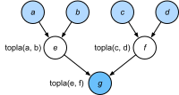

# Derleyiciler ve Yorumlayıcılar
:label:`sec_hybridize`

Şimdiye kadar, bu kitap bir programın durumunu değiştirmek için `print`, `+` ve `if` gibi ifadeleri kullanan buyuru programlamaya odaklanmıştır. Basit bir buyuru programın aşağıdaki örneğini göz önünde bulundurun.

```{.python .input}
#@tab all
def add(a, b):
    return a + b

def fancy_func(a, b, c, d):
    e = add(a, b)
    f = add(c, d)
    g = add(e, f)
    return g

print(fancy_func(1, 2, 3, 4))
```

Python bir *yorumlanan dil*dir. Yukarıdaki `fancy_func` işlevini değerlendirirken fonksiyonun gövdesini oluşturan işlemleri *sıra* ile gerçekleştirir. Yani, `e = add(a, b)`'yi değerlendirecek ve sonuçları `e` değişkeni olarak saklayacak ve böylece programın durumunu değiştirecektir. Sonraki iki ifade `f = add(c, d)` ve `g = add(e, f)` benzer şekilde yürütülecek, toplamalar gerçekleştirilecek ve sonuçları değişken olarak depolayacaktır. :numref:`fig_compute_graph`, veri akışını göstermektedir. 


:label:`fig_compute_graph`

Buyuru programlama her ne kadar uygun olsa da, verimsiz olabilir. Bir yandan, `add` işlevi `fancy_func` boyunca tekrar tekrar çağrılsa bile, Python üç işlevin çağrılarını tek tek yürütür. Bunlar, örneğin, bir GPU'da (veya birden fazla GPU'da) yürütülürse, Python yorumlayıcısından kaynaklanan yükü bezdirici hale gelebilir. Ayrıca, `fancy_func` içindeki tüm ifadeler yürütülünceye kadar `e` ve `f` değişken değerlerini kaydetmesi gerekecektir. Bunun nedeni, `e = add(a, b)` ve `f = add(c, d)` ifadeleri yürütüldükten sonra `e` ve `f` değişkenlerinin programın diğer bölümleri tarafından kullanılacağını bilmememizdir. 

## Sembolik Programlama

Hesaplamanın genellikle süreç tam olarak tanımlandıktan sonra gerçekleştirildiği alternatifi, *sembolik programlama*yı, göz önünde bulundurun. Bu strateji, Theano ve TensorFlow da dahil olmak üzere birden fazla derin öğrenme çerçevesi tarafından kullanılır (ikincisi buyuru uzantıları edindi). Genellikle aşağıdaki adımları içerir: 

1. Yürütülecek işlemleri tanımlayın.
1. İşlemleri yürütülebilir bir programa derleyin.
1. Gerekli girdileri sağlayın ve yürütme için derlenmiş programı çağırın.

Bu, önemli miktarda optimizasyona izin verir. İlk olarak, birçok durumda Python yorumlayıcısını atlayabiliriz, böylece bir CPU üzerinde tek bir Python iş parçacığı ile eşleştirilmiş birden çok hızlı GPU'larda önemli hale gelebilecek bir performans darboğazını kaldırabiliriz. İkincisi, bir derleyici optimize edebilir ve yukarıdaki kodu `print((1 + 2) + (3 + 4))` veya hatta `print(10)` içine yeniden yazabilir. Bu, bir derleyici makine talimatlarına dönüştürmeden önce tam kodu görebildiği için mümkündür. Örneğin, artık bir değişken gerekmediğinde belleği serbest bırakabilir (veya asla tahsis etmez). Ya da kodu tamamen eşdeğer bir parçaya dönüştürebilir. Daha iyi bir fikir edinmek için aşağıdaki buyuru programlama benzetimini (sonuçta hepsi Python) düşünün.

```{.python .input}
#@tab all
def add_():
    return '''
def add(a, b):
    return a + b
'''

def fancy_func_():
    return '''
def fancy_func(a, b, c, d):
    e = add(a, b)
    f = add(c, d)
    g = add(e, f)
    return g
'''

def evoke_():
    return add_() + fancy_func_() + 'print(fancy_func(1, 2, 3, 4))'

prog = evoke_()
print(prog)
y = compile(prog, '', 'exec')
exec(y)
```

Buyuru (yorumlanan) programlama ve sembolik programlama arasındaki farklar şunlardır: 

* Buyuru programlama daha kolaydır. Python'da buyuru programlama kullanıldığında, kodun çoğunluğu basittir ve yazması kolaydır. Ayrıca buyuru programlama kodunda hata ayıklamak daha kolaydır. Bunun nedeni, ilgili tüm ara değişken değerlerini elde etmenin ve yazdırmanın veya Python'un yerleşik hata ayıklama araçlarını kullanmanın daha kolay olmasıdır.
* Sembolik programlama daha verimli ve aktarması daha kolaydır. Sembolik programlama, derleme sırasında kodu optimize etmeyi kolaylaştırırken, programı Python'dan bağımsız bir formata aktarma yeteneğine de sahiptir. Bu, programın Python olmayan bir ortamda çalıştırılmasını sağlar, böylece Python yorumlayıcısı ile ilgili olası performans sorunlarından kaçınır.

## Melez Programlama

Tarihsel olarak çoğu derin öğrenme çerçevesi buyuru veya sembolik yaklaşım arasında seçim yapar. Örneğin, Theano, TensorFlow (ilkinden esinlenerek), Keras ve CNTK modelleri sembolik olarak formüle eder. Tersine, Chainer ve PyTorch buyuru yaklaşımını benimsemektedir. TensorFlow 2.0 ve Keras'a sonraki düzeltmelerde buyuru modu eklendi.

:begin_tab:`mxnet`
Gluon'ı tasarlarken, geliştiriciler her iki programlama kiplerinin faydalarını birleştirmenin mümkün olup olmayacağını düşündü. Bu, kullanıcıların çoğunu ürün düzeyinde bilgi işlem performansı ve dağıtım gerektiğinde çalıştırılacak sembolik programlara dönüştürme yeteneğine sahipken, kullanıcıların saf buyuru programlama ile geliştirmelerine ve hata ayıklamasına olanak tanıyan bir karma modele yol açtı. 

Pratikte bu, `HybridBlock` veya `HybridSequential` sınıfını kullanarak modeller oluşturduğumuz anlamına gelir. Varsayılan olarak, ikisinden herhangi biri, `Block` veya `Sequential` sınıfının buyuru programlamada yürütüldüğü şekilde yürütülür. `HybridSequential` sınıfı `HybridBlock` (`Sequential` alt sınıfları `Block` gibi) bir alt sınıftır. `hybridize` işlevi çağrıldığında, Gluon modeli sembolik programlamada kullanılan biçime derler. Bu, bir modelin uygulanma biçiminden ödün vermeden hesaplama yoğun bileşenlerin optimize edilmesini sağlar. Dizili modellere ve bloklara odaklanarak aşağıdaki faydaları göstereceğiz.
:end_tab:

:begin_tab:`pytorch`
Yukarıda belirtildiği gibi, PyTorch buyuru programlamaya dayanır ve dinamik hesaplama çizgeleri kullanır. Geliştiriciler, sembolik programlamanın taşınabilirliğini ve verimliliğini artırmak amacıyla, her iki programlama modelinin faydalarını birleştirmenin mümkün olup olmayacağını düşündü. Bu, kullanıcıların çoğu programı ürün düzeyinde bilgi işlem performansı ve konuşlandırma gerektiğinde çalıştırılmak üzere sembolik programlara dönüştürme yeteneğine sahipken, yalnızca buyuru programlama kullanarak geliştirmelerine ve hata ayıklamalarına olanak tanıyan bir meşale betiğine yol açtı.
:end_tab:

:begin_tab:`tensorflow`
Buyuru programlama kipi artık Tensorflow 2'de varsayılan değerdir, bu dile yeni olanlar için hoş bir değişiklik. Ancak aynı sembolik programlama teknikleri ve sonraki hesaplama çizgeleri TensorFlow'da hala mevcuttur ve kullanımı kolay `tf.function` dekoratörü tarafından erişilebilir. Bu, buyuru programlama kipini TensorFlow'a getirdi, kullanıcıların daha sezgisel fonksiyonlar tanımlamalarına, ardından bunları sarmalamalarına ve TensorFlow ekibinin [autograph](https://www.tensorflow.org/api_docs/python/tf/autograph) olarak ifade ettiği bir özelliği kullanarak otomatik olarak hesaplamalı çizgelere derlemelerine olanak sağladı.
:end_tab:

## `Sequential` Sınıfını Melezleme

Melezleştirmenin nasıl çalıştığını hissetmenin en kolay yolu, birden çok katmanlı derin ağları düşünmektir. Geleneksel olarak Python yorumlayıcısı, daha sonra bir CPU'ya veya GPU'ya iletilebilecek bir komut oluştururken tüm katmanlar için kodu yürütmesi gerekir. Tek (hızlı) bir bilgi işlem aygıtı için bu herhangi bir önemli soruna neden olmaz. Öte yandan, AWS P3dn.24xlarge örneği gibi gelişmiş bir 8 GPU'lu sunucusu kullanırsak Python tüm GPU'ları meşgul tutmaya çalışacaktır. Tek iş parçacıklı Python yorumlayıcısı burada darboğaz olur. `Sequential`'i `HybridSequential` ile değiştirerek kodun önemli bölümleri için bunu nasıl ele alabileceğimizi görelim. Basit bir MLP tanımlayarak başlıyoruz.

```{.python .input}
from d2l import mxnet as d2l
from mxnet import np, npx
from mxnet.gluon import nn
npx.set_np()

# Ag fabrikasi
def get_net():
    net = nn.HybridSequential()  
    net.add(nn.Dense(256, activation='relu'),
            nn.Dense(128, activation='relu'),
            nn.Dense(2))
    net.initialize()
    return net

x = np.random.normal(size=(1, 512))
net = get_net()
net(x)
```

```{.python .input}
#@tab pytorch
from d2l import torch as d2l
import torch
from torch import nn

# Ag fabrikasi
def get_net():
    net = nn.Sequential(nn.Linear(512, 256),
            nn.ReLU(),
            nn.Linear(256, 128),
            nn.ReLU(),
            nn.Linear(128, 2))
    return net

x = torch.randn(size=(1, 512))
net = get_net()
net(x)
```

```{.python .input}
#@tab tensorflow
from d2l import tensorflow as d2l
import tensorflow as tf
from tensorflow.keras.layers import Dense

# Ag fabrikasi
def get_net():
    net = tf.keras.Sequential()
    net.add(Dense(256, input_shape = (512,), activation = "relu"))
    net.add(Dense(128, activation = "relu"))
    net.add(Dense(2, activation = "linear"))
    return net

x = tf.random.normal([1,512])
net = get_net()
net(x)
```

:begin_tab:`mxnet`
`hybridize` işlevini çağırarak, MLP'deki hesaplamayı derleyebiliyoruz ve optimize edebiliyoruz. Modelin hesaplama sonucu değişmeden kalır.
:end_tab:

:begin_tab:`pytorch`
Modeli `torch.jit.script` işlevini kullanarak dönüştürerek, MLP'deki hesaplamayı derleyebiliyoruz ve optimize edebiliyoruz. Modelin hesaplama sonucu değişmeden kalır.
:end_tab:

:begin_tab:`tensorflow`
Önceden, TensorFlow'da yerleşik olan tüm işlevler bir hesaplama çizgesi olarak oluşturulurdu ve bu nedenle JIT varsayılan olarak derlenmiştir. Bununla birlikte, TensorFlow 2.X ve EagerTensor'un piyasaya sürülmesiyle, bu artık varsayılan davranış değildir. Bu işlevselliği tf.function ile yeniden etkinleştiririz. tf.function daha yaygın bir işlev dekoratörü olarak kullanılır, ancak bunu aşağıda gösterilen normal bir python fonksiyonu olarak doğrudan çağırmak mümkündür. Modelin hesaplama sonucu değişmeden kalır.
:end_tab:

```{.python .input}
net.hybridize()
net(x)
```

```{.python .input}
#@tab pytorch
net = torch.jit.script(net)
net(x)
```

```{.python .input}
#@tab tensorflow
net = tf.function(net)
net(x)
```

:begin_tab:`mxnet`
Bu gerçek olamayacak kadar iyi görünüyor: `HybridSequential` olarak bir blok belirleyin, daha önce olduğu gibi aynı kodu yazın ve `hybridize`'yı çağırın. Bu gerçekleştiğinde ağ optimize edilir (aşağıda performansı karşılaştıracağız). Ne yazık ki bu her katman için sihirli bir şekilde çalışmıyor. Yani, `HybridBlock` sınıfı yerine `Block` sınıfından kalıtım ile çoğalırsa, katman optimize edilmeyecektir.
:end_tab:

:begin_tab:`pytorch`
Bu gerçek olamayacak kadar iyi görünüyor: Daha önce olduğu gibi aynı kodu yazın ve modeli `torch.jit.script`'ü kullanarak dönüştürün. Bu gerçekleştiğinde ağ optimize edilir (aşağıda performansı karşılaştıracağız).
:end_tab:

:begin_tab:`tensorflow`
Bu gerçek olamayacak kadar iyi görünüyor: Daha önce olduğu gibi aynı kodu yazın ve modeli `tf.function` kullanarak dönüştürün. Bu gerçekleştiğinde ağ TensorFlow'un MLIR ara temsilinde bir hesaplama çizgesi olarak oluşturulur ve hızlı yürütme için derleyici düzeyinde büyük ölçüde optimize edilir (aşağıda performansı karşılaştıracağız). `tf.function()` çağrısına açıkça `jit_compile = True` bayrağının eklenmesi TensorFlow'da XLA (Hızlandırılmış Doğrusal Cebir) işlevini etkinleştirir. XLA, JIT derlenmiş kodu belirli durumlarda daha da optimize edebilir. Çizge modunda yürütme, bu açık tanım olmadan etkinleştirilir, ancak XLA, özellikle GPU ortamında, belirli büyük doğrusal cebir işlemlerini (derin öğrenme uygulamalarında gördüğümüz mizaçta) çok daha hızlı yapabilir.
:end_tab:

### Melezleştirme ile İvme

Derleme yoluyla elde edilen performans iyileştirmesini göstermek için `net(x)`'i melezleştirme öncesi ve sonrası değerlendirmek için gereken süreyi karşılaştırıyoruz. Önce bu zamanı ölçmek için bir sınıf tanımlayalım. Performansı ölçmek (ve geliştirmek) için yola çıktığımızda bu, bölüm boyunca kullanışlı olacaktır.

```{.python .input}
#@tab all
#@save
class Benchmark:
    """For measuring running time."""
    def __init__(self, description='Done'):
        self.description = description

    def __enter__(self):
        self.timer = d2l.Timer()
        return self

    def __exit__(self, *args):
        print(f'{self.description}: {self.timer.stop():.4f} sec')
```

:begin_tab:`mxnet`
Şimdi ağı bir kez melezleştirmeli ve bir kez de melezleştirme olmadan iki kez çağırabiliriz.
:end_tab:

:begin_tab:`pytorch`
Artık ağı bir kez meşale betikli ve bir kez de meşale betiği olmadan iki kez çağırabiliriz.
:end_tab:

:begin_tab:`tensorflow`
Şimdi ağı, bir kez sabırsız yürütülen, bir kez çizge modu yürütme ile ve tekrar JIT derlenmiş XLA kullanarak olmak üzere üç kez çağırabiliriz.
:end_tab:

```{.python .input}
net = get_net()
with Benchmark('Without hybridization'):
    for i in range(1000): net(x)
    npx.waitall()

net.hybridize()
with Benchmark('With hybridization'):
    for i in range(1000): net(x)
    npx.waitall()
```

```{.python .input}
#@tab pytorch
net = get_net()
with Benchmark('Without torchscript'):
    for i in range(1000): net(x)

net = torch.jit.script(net)
with Benchmark('With torchscript'):
    for i in range(1000): net(x)
```

```{.python .input}
#@tab tensorflow
net = get_net()
with Benchmark('Eager Mode'):
    for i in range(1000): net(x)

net = tf.function(net)
with Benchmark('Graph Mode'):
    for i in range(1000): net(x)
```

:begin_tab:`mxnet`
Yukarıdaki sonuçlarda görüldüğü gibi, `HybridSequential` örneği `hybridize` işlevini çağırdıktan sonra, sembolik programlama kullanılarak bilgi işlem performansı iyileştirilir.
:end_tab:

:begin_tab:`pytorch`
Yukarıdaki sonuçlarda görüldüğü gibi, `nn.Sequential` örneği `torch.jit.script` işlevi kullanılarak komut dosyası oluşturulduktan sonra, sembolik programlama kullanılarak bilgi işlem performansı artırılır.
:end_tab:

:begin_tab:`tensorflow`
Yukarıdaki sonuçlarda görüldüğü gibi, `tf.keras.Sequential` örneği `tf.function` işlevi kullanılarak komut dosyası oluşturulduktan sonra, bilgi işlem performansı tensorflow içinde çizge modu yürütme yoluyla sembolik programlama kullanılarak geliştirilir.
:end_tab:

### Seri Hale Getirme

:begin_tab:`mxnet`
Modelleri derlemenin faydalarından biri, modeli ve parametrelerini diskte seri hale getirebilmemizdir (kaydedebiliriz). Bu, bir modeli seçtiğiniz önişlemci dilinden bağımsız bir şekilde saklamamızı sağlar. Bu, eğitilmiş modelleri diğer cihazlara konuşlandırmamıza ve diğer önişlemci programlama dillerini kolayca kullanmamıza olanak tanır. Aynı zamanda kod genellikle buyuru programlamadan elde edilebileceğinden daha hızlıdır. `export` işlevini iş başında görelim.
:end_tab:

:begin_tab:`pytorch`
Modelleri derlemenin faydalarından biri, modeli ve parametrelerini diske seri hale getirebilmemizdir (kaydedebiliriz). Bu, bir modeli seçtiğiniz önişlemci dilinden bağımsız bir şekilde saklamamızı sağlar. Bu, eğitilmiş modelleri diğer cihazlara konuşlandırmamıza ve diğer önişlemci programlama dillerini kolayca kullanmamıza olanak tanır. Aynı zamanda kod genellikle buyuru programlamadan elde edilebileceğinden daha hızlıdır. `save` işlevini iş başında görelim.
:end_tab:

:begin_tab:`tensorflow`
Modelleri derlemenin faydalarından biri, modeli ve parametrelerini diske seri hale getirebilmemizdir (kaydedebiliriz). Bu, bir modeli seçtiğiniz önişlemci dilinden bağımsız bir şekilde saklamamızı sağlar. Bu, eğitilmiş modelleri diğer cihazlara konuşlandırmamıza ve diğer önişlemci programlama dillerini kolayca kullanmamıza veya bir sunucuda eğitilmiş bir model yürütmemize olanak tanır. Aynı zamanda kod genellikle buyuru programlamadan elde edilebileceğinden daha hızlıdır. Tensorflow'ta tasarruf etmemizi sağlayan düşük seviyeli API `tf.saved_model`'tir. `saved_model` örneğini iş başında görelim.
:end_tab:

```{.python .input}
net.export('my_mlp')
!ls -lh my_mlp*
```

```{.python .input}
#@tab pytorch
net.save('my_mlp')
!ls -lh my_mlp*
```

```{.python .input}
#@tab tensorflow
net = get_net()
tf.saved_model.save(net, 'my_mlp')
!ls -lh my_mlp*
```

:begin_tab:`mxnet`
Model, bir (büyük ikili) parametre dosyasına ve model hesaplamasını yürütmek için gereken programın bir JSON betimlemesine ayrıştırılır. Dosyalar C++, R, Scala ve Perl gibi Python veya MXNet tarafından desteklenen diğer önişlemci dilleri tarafından okunabilir. Model tanımlamasındaki ilk birkaç satıra bir göz atalım.
:end_tab:

```{.python .input}
!head my_mlp-symbol.json
```

:begin_tab:`mxnet`
Daha önce, `hybridize` işlevini çağırdıktan sonra modelin üstün bilgi işlem performansı ve taşınabilirlik elde edebildiğini gösterdik. Bu melezlemenin, özellikle kontrol akışı açısından model esnekliğini etkileyebileceğini unutmayın.  

Ayrıca, `forward` işlevini kullanması gereken `Block` örneğinin aksine, `HybridBlock` örneği için `hybrid_forward` işlevini kullanmamız gerekiyor.
:end_tab:

```{.python .input}
class HybridNet(nn.HybridBlock):
    def __init__(self, **kwargs):
        super(HybridNet, self).__init__(**kwargs)
        self.hidden = nn.Dense(4)
        self.output = nn.Dense(2)

    def hybrid_forward(self, F, x):
        print('module F: ', F)
        print('value  x: ', x)
        x = F.npx.relu(self.hidden(x))
        print('result  : ', x)
        return self.output(x)
```

:begin_tab:`mxnet`
Yukarıdaki kod, 4 gizli birime ve 2 çıktıya sahip basit bir ağ uygular. `hybrid_forward` işlevi ek bir argüman `F` alır. Kodun melezleştirilmiş olup olmamasına bağlı olarak, işlemek için biraz farklı bir kütüphane (`ndarray` veya `symbol`) kullanacağından bu gereklidir. Her iki sınıf da çok benzer işlevler gerçekleştirir ve MXNet, bağımsız değişkeni otomatik olarak belirler. Neler olup bittiğini anlamak için argümanları işlev çağırısının bir parçası olarak yazdırıyoruz.
:end_tab:

```{.python .input}
net = HybridNet()
net.initialize()
x = np.random.normal(size=(1, 3))
net(x)
```

:begin_tab:`mxnet`
İleri hesaplamayı tekrarlamak aynı çıktıya yol açacaktır (ayrıntıları atlıyoruz). Şimdi `hybridize` işlevini çağırırsak ne olacağını görelim.
:end_tab:

```{.python .input}
net.hybridize()
net(x)
```

:begin_tab:`mxnet`
`ndarray` kullanmak yerine artık `F` için `symbol` modülünü kullanıyoruz. Ayrıca, girdi `ndarray` türünde olsa da, ağ üzerinden akan veriler artık derleme işleminin bir parçası olarak `symbol` türüne dönüştürülür. İşlev çağrısını tekrarlamak şaşırtıcı bir sonuca yol açar:
:end_tab:

```{.python .input}
net(x)
```

:begin_tab:`mxnet`
Bu daha önce gördüğümüzden oldukça farklı. `hybrid_forward`'de tanımlandığı gibi tüm yazdırma ifadeleri atlanır. Gerçekten de, melezleştirmeden sonra `net(x)`'in yürütülmesi artık Python yorumlayıcısı içermez. Bu, herhangi bir yapay Python kodunun (yazdırma -print- ifadeleri gibi) çok daha akıcı bir yürütme ve daha iyi bir başarım lehine atlandığı anlamına gelir. Bunun yerine, MXNet doğrudan C++ arka işlemcisini çağırır. Ayrıca bazı işlevlerin `symbol` modülünde desteklenmediğini (örn. `asnumpy`) ve `a += b` ve `a[:] = a + b` gibi yerinde işlemlerin `a = a + b` olarak yeniden yazılması gerektiğini unutmayın. Bununla birlikte, hız önemli olduğunda modellerin derlenmesi çabaya değer. Fayda, modelin karmaşıklığına, CPU'nun hızına ve GPU'ların hızına ve sayısına bağlı olarak, küçük yüzdelerden iki kattan fazla hıza kadar değişebilir.
:end_tab:

## Özet

* Buyuru programlama, kontrol akışı ve çok miktarda Python yazılım ekosistemi kullanma yeteneği ile kod yazmak mümkün olduğundan, yeni modeller tasarlamayı kolaylaştırır.
* Sembolik programlama, programı belirtmemizi ve çalıştırmadan önce derlemenizi gerektirir. Faydası arttırılmış performanstır.

:begin_tab:`mxnet`
* MXNet gerektiğinde her iki yaklaşımın avantajlarını birleştirebilir.
* `HybridSequential` ve `HybridBlock` sınıfları tarafından oluşturulan modeller, `hybridize` işlevini çağırarak buyuru programlarını sembolik programlara dönüştürebilir.
:end_tab:

## Alıştırmalar

:begin_tab:`mxnet`
1. `x.asnumpy()` bu bölümdeki `HybridNet` sınıfının `hybrid_forward` işlevinin ilk satırına ekleyin. Kodu çalıştırın ve karşılaştığınız hataları gözlemleyin. Neden büyle oluyorlar?
1. Kontrol akışını eklersek, yani `hybrid_forward` işlevinde `if` ve `for` Python ifadelerini eklersek ne olur?
1. Önceki bölümlerde ilginizi çeken modelleri gözden geçirin. Onları yeniden uygulayarak hesaplama performanslarını artırabilir misiniz?
:end_tab:

:begin_tab:`pytorch,tensorflow`
1. Önceki bölümlerde ilginizi çeken modelleri gözden geçirin. Onları yeniden uygulayarak hesaplama performanslarını artırabilir misiniz?
:end_tab:

:begin_tab:`mxnet`
[Tartışmalar](https://discuss.d2l.ai/t/360)
:end_tab:

:begin_tab:`pytorch`
[Tartışmalar](https://discuss.d2l.ai/t/2490)
:end_tab:

:begin_tab:`tensorflow`
[Tartışmalar](https://discuss.d2l.ai/t/2492)
:end_tab:
