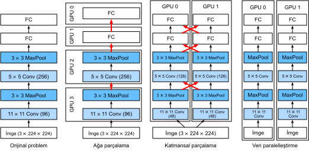
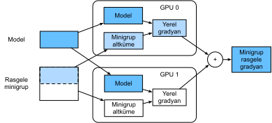

# Birden Fazla GPU Eğitmek
:label:`sec_multi_gpu`

Şimdiye kadar modellerin CPU'lar ve GPU'lar üzerinde nasıl verimli bir şekilde eğitileceğini tartıştık. Hatta derin öğrenme çerçevelerinin :numref:`sec_auto_para` içinde hesaplama ve iletişimi otomatik olarak nasıl paralelleştirmesine izin verdiğini gösterdik. Ayrıca :numref:`sec_use_gpu` içinde `nvidia-smi` komutunu kullanarak bir bilgisayardaki mevcut tüm GPU'ların nasıl listeleneceğini de gösterdik. Konuşmadığımız şey derin öğrenme eğitiminin nasıl paralelleştirileceğidir. Bunun yerine, bir şekilde verilerin birden fazla cihaza bölüneceğini ve çalışmasının sağlanacağını ima ettik. Mevcut bölüm ayrıntıları doldurur ve sıfırdan başladığınızda bir ağın paralel olarak nasıl eğitileceğini gösterir. Üst düzey API'lerde işlevsellikten nasıl yararlanılacağına ilişkin ayrıntılar :numref:`sec_multi_gpu_concise` içinde kümelendirilmiştir. :numref:`sec_minibatch_sgd` içinde açıklananlar gibi minigrup rasgele gradyan iniş algoritmalarına aşina olduğunuzu varsayıyoruz. 

## Sorunu Bölmek

Basit bir bilgisayarla görme problemi ve biraz modası geçmiş bir ağ ile başlayalım, örn. birden fazla evrişim katmanı, ortaklama ve en sonda muhtemelen birkaç tam bağlı katman. Yani, LeNet :cite:`LeCun.Bottou.Bengio.ea.1998` veya AlexNet :cite:`Krizhevsky.Sutskever.Hinton.2012`'e oldukça benzeyen bir ağ ile başlayalım. Birden fazla GPU (eğer bir masaüstü sunucusu ise 2, AWS g4dn.12xlarge üzerinde 4, p3.16xlarge üzerinde 8 veya p2.16xlarge üzerinde 16), aynı anda basit ve tekrarlanabilir tasarım seçimlerinden yararlanarak iyi bir hız elde edecek şekilde eğitimi parçalara bölmek istiyoruz. Sonuçta birden fazla GPU hem *bellek* hem de *hesaplama* yeteneğini artırır. Özetle, sınıflandırmak istediğimiz bir minigrup eğitim verisi göz önüne alındığında aşağıdaki seçeneklere sahibiz. 

İlk olarak, ağı birden fazla GPU arasında bölümleyebiliriz. Yani, her GPU belirli bir katmana akan verileri girdi olarak alır, sonraki birkaç katmanda verileri işler ve ardından verileri bir sonraki GPU'ya gönderir. Bu, tek bir GPU'nun işleyebileceği şeylerle karşılaştırıldığında verileri daha büyük ağlarla işlememize olanak tanır. Ayrıca, GPU başına bellek ayak izi iyi kontrol edilebilir (toplam ağ ayak izinin bir kısmıdır). 

Ancak, katmanlar arasındaki arayüz (ve dolayısıyla GPU'lar) sıkı eşzamanlama gerektirir. Bu, özellikle hesaplamalı iş yükleri katmanlar arasında düzgün bir şekilde eşleştirilmemişse zor olabilir. Sorun çok sayıda GPU için daha da şiddetlenir. Katmanlar arasındaki arayüz, etkinleştirme ve gradyanlar gibi büyük miktarda veri aktarımı gerektirir. Bu, GPU veri yollarının bant genişliğini kasabilir. Ayrıca, yoğun işlem gerektiren ancak sıralı işlemler, bölümleme açısından önemsizdir. Bu konuda en iyi yaklaşım için örneğin :cite:`Mirhoseini.Pham.Le.ea.2017`'e bakın. Zor bir sorun olmaya devam ediyor ve apaçık olmayan problemlerde iyi (doğrusal) ölçeklendirme elde etmenin mümkün olup olmadığı belirsizdir. Birden fazla GPU'ları birbirine zincirlemek için mükemmel bir çerçeve veya işletim sistemi desteği olmadığı sürece bunu önermiyoruz. 

İkincisi, işi katmanlara bölüşebiliriz. Örneğin, tek bir GPU'da 64 kanalı hesaplamak yerine, sorunu her biri 16 kanal için veri üreten 4 GPU'ya bölebiliriz. Aynı şekilde, tam bağlı bir katman için çıktı birimlerinin sayısını bölebiliriz. :numref:`fig_alexnet_original` (:cite:`Krizhevsky.Sutskever.Hinton.2012`'ten alınmıştır), bu stratejinin çok küçük bir bellek ayak izine sahip GPU'larla uğraşmak için kullanıldığı bu tasarımı göstermektedir (aynı anda 2 GB). Bu, kanalların (veya birimlerin) sayısının çok küçük olmaması koşuluyla hesaplama açısından iyi ölçeklendirmeye izin verir. Ayrıca, kullanılabilir bellek doğrusal ölçeklendiğinden, birden fazla GPU gitgide artan daha büyük ağları işleyebilir. 


:label:`fig_alexnet_original`

Bununla birlikte, her katman diğer tüm katmanların sonuçlarına bağlı olduğundan, *çok büyük* eşzamanlama veya bariyer işlemlerine ihtiyacımız var. Ayrıca, aktarılması gereken veri miktarı, GPU'lar arasındaki katmanlara dağıtılırken olduğundan daha büyük olabilir. Bu nedenle, bant genişliği maliyeti ve karmaşıklığı nedeniyle bu yaklaşımı önermiyoruz. 

Son olarak, verileri birden fazla GPU arasında bölümlendirebiliriz. Bu şekilde tüm GPU'lar farklı gözlemlerde de olsa aynı tür çalışmaları gerçekleştirir. Gradyanlar, eğitim verilerinin her minigrup işleminden sonra GPU'lar arasında toplanır. Bu en basit yaklaşımdır ve her durumda uygulanabilir. Sadece her minigrup işleminden sonra eşzamanlı hale getirmemiz gerekiyor. Yani, diğerleri hala hesaplanırken gradyan parametreleri alışverişine başlamak son derece arzu edilir. Dahası, daha fazla sayıda GPU daha büyük minigrup boyutlarına yol açarak eğitim verimliliğini arttırır. Ancak, daha fazla GPU eklemek daha büyük modeller eğitmemize izin vermez. 


:label:`fig_splitting`

Birden fazla GPU üzerinde farklı paralelleştirme yollarının karşılaştırılması :numref:`fig_splitting` içinde tasvir edilmiştir. Yeterince büyük belleğe sahip GPU'lara erişimimiz olması koşuluyla, genel olarak veri paralelliği ilerlemenin en uygun yoludur. Dağıtılmış eğitim için bölümlemenin ayrıntılı bir açıklaması için  ayrıca bkz. :cite:`Li.Andersen.Park.ea.2014`. GPU belleği derin öğrenmenin ilk günlerinde bir sorundu. Şimdiye kadar bu sorun aşırı sıradışı durumlar haricinde herkes için çözülmüştür. Aşağıda veri paralelliğine odaklanıyoruz. 

## Veri Paralelleştirme

Bir makinede $k$ tane GPU olduğunu varsayalım. Eğitilecek model göz önüne alındığında, GPU'lardaki parametre değerleri aynı ve eşzamanlı olsa da, her GPU bağımsız olarak eksiksiz bir model parametreleri kümesini koruyacaktır. Örnek olarak, :numref:`fig_data_parallel` $k=2$ olduğunda veri paralelleştirme ile eğitimi göstermektedir. 


:label:`fig_data_parallel`

Genel olarak, eğitim aşağıdaki gibi devam eder: 

* Eğitimin herhangi bir yinelemesinde, rastgele bir minigrup verildiğinde, toplu iş örnekleri $k$ tane parçaya ayırır ve GPU'lara eşit olarak dağıtırız.
* Her GPU, atandığı minigrup altkümesine göre model parametrelerinin kaybını ve gradyanlarını hesaplar.
* $k$ tane GPU'nun her birinin yerel gradyanları, geçerli minigrup rasgele gradyanı elde etmek için toplanır.
* Toplam gradyan her GPU'ya yeniden dağıtılır.
* Her GPU, koruduğu model parametrelerinin tamamını güncelleştirmek için bu minigrup rasgele gradyanını kullanır.

Pratikte, $k$ tane GPU üzerinde eğitim yaparken minigrup boyutunu $k$-kat *artırdığımızı*, böylece her GPU'nun yalnızca tek bir GPU üzerinde eğitim yapıyormuşuz gibi aynı miktarda iş yapması gerektiğini unutmayın. 16 GPU'lu bir sunucuda bu, minigrup boyutunu önemli ölçüde artırabilir ve buna göre öğrenme oranını artırmamız gerekebilir. Ayrıca, :numref:`sec_batch_norm` içindeki toplu normalleştirmenin, örneğin GPU başına ayrı bir toplu normalleştirme katsayısı tutularak ayarlanması gerektiğini unutmayın. Aşağıda, çoklu GPU eğitimini göstermek için basit bir ağ kullanacağız.

```{.python .input}
%matplotlib inline
from d2l import mxnet as d2l
from mxnet import autograd, gluon, np, npx
npx.set_np()
```

```{.python .input}
#@tab pytorch
%matplotlib inline
from d2l import torch as d2l
import torch
from torch import nn
from torch.nn import functional as F
```

## [**Basit Bir Örnek Ağ**]

LeNet'i :numref:`sec_lenet` içinde tanıtıldığı gibi kullanıyoruz (hafif değiştirmeler ile). Parametre değişimini ve eşzamanlılığı ayrıntılı olarak göstermek için sıfırdan tanımlıyoruz.

```{.python .input}
# Model parametrelerini ilklet
scale = 0.01
W1 = np.random.normal(scale=scale, size=(20, 1, 3, 3))
b1 = np.zeros(20)
W2 = np.random.normal(scale=scale, size=(50, 20, 5, 5))
b2 = np.zeros(50)
W3 = np.random.normal(scale=scale, size=(800, 128))
b3 = np.zeros(128)
W4 = np.random.normal(scale=scale, size=(128, 10))
b4 = np.zeros(10)
params = [W1, b1, W2, b2, W3, b3, W4, b4]

# Modeli tanımla
def lenet(X, params):
    h1_conv = npx.convolution(data=X, weight=params[0], bias=params[1],
                              kernel=(3, 3), num_filter=20)
    h1_activation = npx.relu(h1_conv)
    h1 = npx.pooling(data=h1_activation, pool_type='avg', kernel=(2, 2),
                     stride=(2, 2))
    h2_conv = npx.convolution(data=h1, weight=params[2], bias=params[3],
                              kernel=(5, 5), num_filter=50)
    h2_activation = npx.relu(h2_conv)
    h2 = npx.pooling(data=h2_activation, pool_type='avg', kernel=(2, 2),
                     stride=(2, 2))
    h2 = h2.reshape(h2.shape[0], -1)
    h3_linear = np.dot(h2, params[4]) + params[5]
    h3 = npx.relu(h3_linear)
    y_hat = np.dot(h3, params[6]) + params[7]
    return y_hat

# Çapraz Entropi Kayıp İşlevi
loss = gluon.loss.SoftmaxCrossEntropyLoss()
```

```{.python .input}
#@tab pytorch
# Model parametrelerini ilklet
scale = 0.01
W1 = torch.randn(size=(20, 1, 3, 3)) * scale
b1 = torch.zeros(20)
W2 = torch.randn(size=(50, 20, 5, 5)) * scale
b2 = torch.zeros(50)
W3 = torch.randn(size=(800, 128)) * scale
b3 = torch.zeros(128)
W4 = torch.randn(size=(128, 10)) * scale
b4 = torch.zeros(10)
params = [W1, b1, W2, b2, W3, b3, W4, b4]

# Modeli tanımla
def lenet(X, params):
    h1_conv = F.conv2d(input=X, weight=params[0], bias=params[1])
    h1_activation = F.relu(h1_conv)
    h1 = F.avg_pool2d(input=h1_activation, kernel_size=(2, 2), stride=(2, 2))
    h2_conv = F.conv2d(input=h1, weight=params[2], bias=params[3])
    h2_activation = F.relu(h2_conv)
    h2 = F.avg_pool2d(input=h2_activation, kernel_size=(2, 2), stride=(2, 2))
    h2 = h2.reshape(h2.shape[0], -1)
    h3_linear = torch.mm(h2, params[4]) + params[5]
    h3 = F.relu(h3_linear)
    y_hat = torch.mm(h3, params[6]) + params[7]
    return y_hat

# Çapraz Entropi Kayıp İşlevi
loss = nn.CrossEntropyLoss(reduction='none')
```

## Veri Eşzamanlama

Verimli çoklu GPU eğitimi için iki temel işleme ihtiyacımız var. Öncelikle [**birden fazla cihaza parametre listesini dağıtabilme**] ve gradyanları (`get_params`) iliştirme yeteneğine sahip olmamız gerekir. Parametreler olmadan ağı bir GPU üzerinde değerlendirmek imkansızdır. İkincisi, birden fazla cihazda parametreleri toplama yeteneğine ihtiyacımız var, yani bir `allreduce` işlevine ihtiyacımız var.

```{.python .input}
def get_params(params, device):
    new_params = [p.copyto(device) for p in params]
    for p in new_params:
        p.attach_grad()
    return new_params
```

```{.python .input}
#@tab pytorch
def get_params(params, device):
    new_params = [p.to(device) for p in params]
    for p in new_params:
        p.requires_grad_()
    return new_params
```

Model parametrelerini bir GPU'ya kopyalayarak deneyelim.

```{.python .input}
#@tab all
new_params = get_params(params, d2l.try_gpu(0))
print('b1 agirligi:', new_params[1])
print('b1 grad:', new_params[1].grad)
```

Henüz herhangi bir hesaplama yapmadığımız için, ek girdi parametresi ile ilgili gradyan hala sıfırdır. Şimdi birden fazla GPU arasında dağıtılmış bir vektör olduğunu varsayalım. Aşağıdaki [**`allreduce` işlevi tüm vektörleri toplar ve sonucu tüm GPU'lara geri gönderir**]. Bunun işe yaraması için verileri sonuçları toplayan cihaza kopyalamamız gerektiğini unutmayın.

```{.python .input}
def allreduce(data):
    for i in range(1, len(data)):
        data[0][:] += data[i].copyto(data[0].ctx)
    for i in range(1, len(data)):
        data[0].copyto(data[i])
```

```{.python .input}
#@tab pytorch
def allreduce(data):
    for i in range(1, len(data)):
        data[0][:] += data[i].to(data[0].device)
    for i in range(1, len(data)):
        data[i][:] = data[0].to(data[i].device)
```

Farklı cihazlarda farklı değerlere sahip vektörler oluşturarak ve bunları toplayarak bunu test edelim.

```{.python .input}
data = [np.ones((1, 2), ctx=d2l.try_gpu(i)) * (i + 1) for i in range(2)]
print('allreduce oncesi:\n', data[0], '\n', data[1])
allreduce(data)
print('allreduce sonrasi:\n', data[0], '\n', data[1])
```

```{.python .input}
#@tab pytorch
data = [torch.ones((1, 2), device=d2l.try_gpu(i)) * (i + 1) for i in range(2)]
print('allreduce oncesi:\n', data[0], '\n', data[1])
allreduce(data)
print('allreduce sonrasi:\n', data[0], '\n', data[1])
```

## Veri Dağıtımı

[**Bir minigrubu birden çok GPU boyunca eşit olarak dağıtmak için**] basit bir yardımcı işleve ihtiyacımız vardır. Örneğin, iki GPU'da verilerin yarısının GPU'lardan birine kopyalanmasını istiyoruz. Daha kullanışlı ve daha özlü olduğu için, $4 \times 5$ matrisinde denemek için derin öğrenme çerçevesindeki yerleşik işlevi kullanıyoruz.

```{.python .input}
data = np.arange(20).reshape(4, 5)
devices = [npx.gpu(0), npx.gpu(1)]
split = gluon.utils.split_and_load(data, devices)
print('girdi :', data)
print('suraya yukle', devices)
print('cikti:', split)
```

```{.python .input}
#@tab pytorch
data = torch.arange(20).reshape(4, 5)
devices = [torch.device('cuda:0'), torch.device('cuda:1')]
split = nn.parallel.scatter(data, devices)
print('girdi :', data)
print('suraya yukle', devices)
print('cikti:', split)
```

Daha sonra yeniden kullanım için hem verileri hem de etiketleri parçalara bölen bir `split_batch` işlevi tanımlıyoruz.

```{.python .input}
#@save
def split_batch(X, y, devices):
    """`X` ve `y`'yi birçok cihaza parçala."""
    assert X.shape[0] == y.shape[0]
    return (gluon.utils.split_and_load(X, devices),
            gluon.utils.split_and_load(y, devices))
```

```{.python .input}
#@tab pytorch
#@save
def split_batch(X, y, devices):
    """`X` ve `y`'yi birçok cihaza parçala."""
    assert X.shape[0] == y.shape[0]
    return (nn.parallel.scatter(X, devices),
            nn.parallel.scatter(y, devices))
```

## Eğitim

Artık [**çoklu-GPU eğitimini tek bir minigrupta**] uygulayabiliriz. Uygulaması öncelikle bu bölümde açıklanan veriyi paralelleştirme yaklaşımına dayanmaktadır. Verileri birden fazla GPU arasında eşzamanlamak için az önce tartıştığımız `allreduce` ve `split_and_load` yardımcı fonksiyonlarını kullanacağız. Paralellik elde etmek için herhangi bir özel kod yazmamıza gerek olmadığını unutmayın. Hesaplama çizgesinin bir minigrup içindeki cihazlar arasında herhangi bir bağımlılığı olmadığından, paralel olarak *otomatik* yürütülür.

```{.python .input}
def train_batch(X, y, device_params, devices, lr):
    X_shards, y_shards = split_batch(X, y, devices)
    with autograd.record():  # Kayıp her GPU'da ayrı ayrı hesaplanır
        ls = [loss(lenet(X_shard, device_W), y_shard)
              for X_shard, y_shard, device_W in zip(
                  X_shards, y_shards, device_params)]
    for l in ls:  # Geri yayma her GPU'da ayrı ayrı uygulanır
        l.backward()
    # Her GPU'dan gelen tüm gradyanları toplayın ve bunları tüm GPU'lara yayınlayın
    for i in range(len(device_params[0])):
        allreduce([device_params[c][i].grad for c in range(len(devices))])
    # Model parametreleri her GPU'da ayrı ayrı güncellenir
    for param in device_params:
        d2l.sgd(param, lr, X.shape[0])  # Burada tam boyutlu bir toplu iş kullanıyoruz
```

```{.python .input}
#@tab pytorch
def train_batch(X, y, device_params, devices, lr):
    X_shards, y_shards = split_batch(X, y, devices)
    # Kayıp her GPU'da ayrı ayrı hesaplanır
    ls = [loss(lenet(X_shard, device_W), y_shard).sum()
          for X_shard, y_shard, device_W in zip(
              X_shards, y_shards, device_params)]
    for l in ls:  # Geri yayma her GPU'da ayrı ayrı uygulanır
        l.backward()
    # Her GPU'dan gelen tüm gradyanları toplayın ve bunları tüm GPU'lara yayınlayın
    with torch.no_grad():
        for i in range(len(device_params[0])):
            allreduce([device_params[c][i].grad for c in range(len(devices))])
    # Model parametreleri her GPU'da ayrı ayrı güncellenir
    for param in device_params:
        d2l.sgd(param, lr, X.shape[0]) # Burada tam boyutlu bir toplu iş kullanıyoruz
```

Şimdi [**eğitim fonksiyonunu**] tanımlayabiliriz. Önceki bölümlerde kullanılanlardan biraz farklıdır: GPU'ları tahsis etmeliyiz ve tüm model parametrelerini tüm cihazlara kopyalamalıyız. Açıkçası her grup birden çok GPU ile başa çıkmak için `train_batch` işlevi kullanılarak işlenir. Kolaylık sağlamak (ve kodun özlü olması) için doğruluğu tek bir GPU üzerinde hesaplıyoruz, ancak diğer GPU'lar boşta olduğundan bu *verimsiz*dir.

```{.python .input}
def train(num_gpus, batch_size, lr):
    train_iter, test_iter = d2l.load_data_fashion_mnist(batch_size)
    devices = [d2l.try_gpu(i) for i in range(num_gpus)]
    # Model parametrelerini `num_gpus` tane GPU'ya kopyalayın
    device_params = [get_params(params, d) for d in devices]
    num_epochs = 10
    animator = d2l.Animator('donem', 'test dogrulugu', xlim=[1, num_epochs])
    timer = d2l.Timer()
    for epoch in range(num_epochs):
        timer.start()
        for X, y in train_iter:
            # Tek bir minigrup için çoklu GPU eğitimi gerçekleştirin
            train_batch(X, y, device_params, devices, lr)
            npx.waitall()
        timer.stop()
        # Modeli GPU 0'da değerlendirin
        animator.add(epoch + 1, (d2l.evaluate_accuracy_gpu(
            lambda x: lenet(x, device_params[0]), test_iter, devices[0]),))
    print(f'test dogrulugu: {animator.Y[0][-1]:.2f}, {timer.avg():.1f} saniye/donem '
          f'on {str(devices)}')
```

```{.python .input}
#@tab pytorch
def train(num_gpus, batch_size, lr):
    train_iter, test_iter = d2l.load_data_fashion_mnist(batch_size)
    devices = [d2l.try_gpu(i) for i in range(num_gpus)]
    # Model parametrelerini `num_gpus` tane GPU'ya kopyalayın
    device_params = [get_params(params, d) for d in devices]
    num_epochs = 10
    animator = d2l.Animator('donem', 'test dogrulugu', xlim=[1, num_epochs])
    timer = d2l.Timer()
    for epoch in range(num_epochs):
        timer.start()
        for X, y in train_iter:
            # Tek bir minigrup için çoklu GPU eğitimi gerçekleştirin
            train_batch(X, y, device_params, devices, lr)
            torch.cuda.synchronize()
        timer.stop()
        # Modeli GPU 0'da değerlendirin
        animator.add(epoch + 1, (d2l.evaluate_accuracy_gpu(
            lambda x: lenet(x, device_params[0]), test_iter, devices[0]),))
    print(f'test dogrulugu: {animator.Y[0][-1]:.2f}, {timer.avg():.1f} saniye/donem '
          f'on {str(devices)}')
```

Bunun [**tek bir GPU**] üzerinde ne kadar iyi çalıştığını görelim. İlk olarak 256'lık iş boyutunu ve 0.2 öğrenme oranını kullanıyoruz.

```{.python .input}
#@tab all
train(num_gpus=1, batch_size=256, lr=0.2)
```

Toplu iş boyutunu ve öğrenme oranını değişmeden tutarak ve [**GPU sayısını 2'ye artırarak**], test doğruluğunun önceki deneye kıyasla kabaca aynı kaldığını görebiliriz. Optimizasyon algoritmaları açısından aynıdırlar. Ne yazık ki burada kazanılacak anlamlı bir hız yok: Model basitçe çok küçük; dahası, çoklu GPU eğitimini uygulamaya yönelik biraz gelişmiş yaklaşımımızın önemli Python ek yükünden muzdarip olduğu küçük bir veri kümesine sahibiz. Daha karmaşık modellerle ve daha gelişmiş paralelleşme yollarıyla karşılaşacağız. Fashion-MNIST için yine ne olacağını görelim.

```{.python .input}
#@tab all
train(num_gpus=2, batch_size=256, lr=0.2)
```

## Özet

* Derin ağ eğitimini birden fazla GPU üzerinden bölmenin birden çok yolu vardır. Katmanlar arasında, karşılıklı katmanlar arasında veya veriler arasında bölebiliriz. İlk ikisi, sıkı bir şekilde koreografisi yapılmış veri aktarımları gerektirir. Veri paralelliği en basit stratejidir.
* Veri paralel eğitimi basittir. Bununla birlikte, bu, verimli olması için etkili minigrup boyutunu artırır.
* Veri paralelliğinde veriler birden çok GPU'ya bölünür; burada her GPU'nun kendi ileri ve geri işlemlerini yürütür ve daha sonra gradyanlar toplanır ve sonuçlar GPU'lara geri yayınlanır.
* Daha büyük minigruplar için biraz daha yüksek öğrenme oranları kullanabiliriz.

## Alıştırmalar

1. $k$ tane GPU'da eğitim yaparken, minigrup boyutunu $b$'den $k \cdot b$'e değiştirin, yani GPU sayısına göre ölçeklendirin.
1. Farklı öğrenme oranları için doğruluğu karşılaştırın. GPU sayısıyla nasıl ölçeklenir?
1. Farklı GPU'larda farklı parametreleri toplayan daha verimli bir `allreduce` işlevini uygulayın. Neden daha verimlidir?
1. Çoklu GPU test doğruluğu hesaplamasını gerçekleştirin.

:begin_tab:`mxnet`
[Tartışmalar](https://discuss.d2l.ai/t/364)
:end_tab:

:begin_tab:`pytorch`
[Tartışmalar](https://discuss.d2l.ai/t/1669)
:end_tab:
