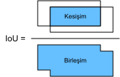
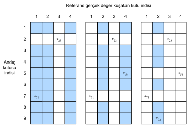

# Çapa Kutuları
:label:`sec_anchor`

Nesne algılama algoritmaları genellikle girdi imgesinde çok sayıda bölgeyi örnekler, bu bölgelerin ilgilenilen nesneleri içerip içermediğini belirler ve nesnelerin *gerçek referans değeri kuşatan kutularını* daha doğru bir şekilde tahmin etmek için bölgelerin sınırlarını ayarlar. Farklı modeller farklı bölge örnekleme düzenleri benimseyebilir. Burada bu tür yöntemlerden birini sunuyoruz: Her pikselde ortalanmış değişen ölçeklere ve en-boy oranlarına sahip birden çok kuşatan kutu oluşturur. Bu kuşatan kutulara *çapa kutuları* denir. :numref:`sec_ssd` içinde çapa kutularına dayalı bir nesne algılama modeli tasarlayacağız. 

Öncelikle, sadece daha özlü çıktılar için doğruluk yazdırmayı değiştirelim.

```{.python .input}
%matplotlib inline
from d2l import mxnet as d2l
from mxnet import gluon, image, np, npx

np.set_printoptions(2)  # Doğruluğunu basmayı basitleştirin
npx.set_np()
```

```{.python .input}
#@tab pytorch
%matplotlib inline
from d2l import torch as d2l
import torch

torch.set_printoptions(2)  # Doğruluğunu basmayı basitleştirin
```

## Çoklu Çapa Kutuları Oluşturma

Girdi imgesinin $h$ yüksekliğine ve $w$ genişliğine sahip olduğunu varsayalım. İmgenin her pikselinde ortalanmış farklı şekillere sahip çapa kutuları oluşturuyoruz. *Ölçek* $s\in (0, 1]$ ve *en-boy oranı* (genişliğin yüksekliğe oranı) $r > 0$ olsun. O zaman [**çapa kutusunun genişliği ve yüksekliği sırasıyla $ws\sqrt{r}$ ve $hs/\sqrt{r}$'dür.**] Merkez konumu verildiğinde, bilinen genişlik ve yüksekliğe sahip bir çapa kutusu belirlendiğini unutmayın. 

Farklı şekillerde birden çok çapa kutusu oluşturmak için, bir dizi ölçek $s_1,\ldots, s_n$ ve bir dizi en boy oranı $r_1,\ldots, r_m$ ayarlayalım. Bu ölçeklerin ve en boy oranlarının tüm kombinasyonlarını merkez olarak her pikselle birlikte kullanırken, girdi imgesinde toplam $whnm$ çapa kutusu bulunur. Bu çapa kutuları gerçek referans değerleri kuşatan kutuları kapsayabilmesine rağmen, hesaplama karmaşıklığı basitçe çok yüksektir. Uygulamada, yalnızca $s_1$ veya $r_1$ (**içeren kombinasyonları dikkate alalım**): 

(**$$(s_1, r_1), (s_1, r_2), \ldots, (s_1, r_m), (s_2, r_1), (s_3, r_1), \ldots, (s_n, r_1).$$**) 

Yani, aynı pikselde ortalanmış çapa kutularının sayısı $n+m-1$'dir. Tüm girdi imgesi için toplam $wh(n+m-1)$ çapa kutusu oluşturacağız. 

Yukarıdaki çapa kutuları oluşturma yöntemi aşağıdaki `multibox_prior` işlevinde uygulanır. Girdi imgesini, ölçeklerin bir listesini ve en-boy oranlarının bir listesini belirleriz, daha sonra bu işlev tüm çapa kutularını döndürür.

```{.python .input}
#@save
def multibox_prior(data, sizes, ratios):
    """Her pikselde ortalanmış farklı şekillere sahip çapa kutuları oluşturun."""
    in_height, in_width = data.shape[-2:]
    device, num_sizes, num_ratios = data.ctx, len(sizes), len(ratios)
    boxes_per_pixel = (num_sizes + num_ratios - 1)
    size_tensor = d2l.tensor(sizes, ctx=device)
    ratio_tensor = d2l.tensor(ratios, ctx=device)
    # Bağlantıyı bir pikselin merkezine taşımak için kaydırmalar gereklidir. 
    # Bir pikselin yüksekliği=1 ve genişliği=1 olduğundan, merkezlerimizi 0.5 
    # ile kaydırmayı seçiyoruz.
    offset_h, offset_w = 0.5, 0.5
    steps_h = 1.0 / in_height  # y ekseninde ölçeklenmiş adımlar
    steps_w = 1.0 / in_width  # x ekseninde ölçeklenmiş adımlar

    # Çapa kutuları için tüm merkez noktalarını oluştur
    center_h = (d2l.arange(in_height, ctx=device) + offset_h) * steps_h
    center_w = (d2l.arange(in_width, ctx=device) + offset_w) * steps_w
    shift_x, shift_y = d2l.meshgrid(center_w, center_h)
    shift_x, shift_y = shift_x.reshape(-1), shift_y.reshape(-1)

    # Daha sonra çapa kutusu köşe koordinatları (xmin, xmax, ymin, ymax) 
    # oluşturmak için kullanılacak yükseklik ve genişliklerin `boxes_per_pixel` 
    # sayısını oluşturun
    w = np.concatenate((size_tensor * np.sqrt(ratio_tensor[0]),
                        sizes[0] * np.sqrt(ratio_tensor[1:]))) \
                        * in_height / in_width  # Dikdörtgen girdileri yönet
    h = np.concatenate((size_tensor / np.sqrt(ratio_tensor[0]),
                        sizes[0] / np.sqrt(ratio_tensor[1:])))
    # Yarım yükseklik ve yarım genişlik elde etmek için 2'ye bölün
    anchor_manipulations = np.tile(np.stack((-w, -h, w, h)).T,
                                   (in_height * in_width, 1)) / 2

    # Her merkez noktasında `boxes_per_pixel` sayısı çapa kutusu olacaktır, 
    # bu nedenle `boxes_per_pixel` tekrarlarıyla tüm çapa kutusu 
    # merkezlerinin bir ızgarasını oluşturun
    out_grid = d2l.stack([shift_x, shift_y, shift_x, shift_y],
                         axis=1).repeat(boxes_per_pixel, axis=0)
    output = out_grid + anchor_manipulations
    return np.expand_dims(output, axis=0)
```

```{.python .input}
#@tab pytorch
#@save
def multibox_prior(data, sizes, ratios):
    """Her pikselde ortalanmış farklı şekillere sahip çapa kutuları oluşturun."""
    in_height, in_width = data.shape[-2:]
    device, num_sizes, num_ratios = data.device, len(sizes), len(ratios)
    boxes_per_pixel = (num_sizes + num_ratios - 1)
    size_tensor = d2l.tensor(sizes, device=device)
    ratio_tensor = d2l.tensor(ratios, device=device)
    # Bağlantıyı bir pikselin merkezine taşımak için kaydırmalar gereklidir. 
    # Bir pikselin yüksekliği=1 ve genişliği=1 olduğundan, merkezlerimizi 0.5 
    # ile kaydırmayı seçiyoruz.
    offset_h, offset_w = 0.5, 0.5
    steps_h = 1.0 / in_height  # y ekseninde ölçeklenmiş adımlar
    steps_w = 1.0 / in_width  # x ekseninde ölçeklenmiş adımlar

    # Çapa kutuları için tüm merkez noktalarını oluştur
    center_h = (torch.arange(in_height, device=device) + offset_h) * steps_h
    center_w = (torch.arange(in_width, device=device) + offset_w) * steps_w
    shift_y, shift_x = torch.meshgrid(center_h, center_w)
    shift_y, shift_x = shift_y.reshape(-1), shift_x.reshape(-1)

    # Daha sonra çapa kutusu köşe koordinatları (xmin, xmax, ymin, ymax) 
    # oluşturmak için kullanılacak yükseklik ve genişliklerin `boxes_per_pixel` 
    # sayısını oluşturun
    w = torch.cat((size_tensor * torch.sqrt(ratio_tensor[0]),
                   sizes[0] * torch.sqrt(ratio_tensor[1:])))\
                   * in_height / in_width  # Dikdörtgen girdileri yönet
    h = torch.cat((size_tensor / torch.sqrt(ratio_tensor[0]),
                   sizes[0] / torch.sqrt(ratio_tensor[1:])))
    # Yarım yükseklik ve yarım genişlik elde etmek için 2'ye bölün
    anchor_manipulations = torch.stack((-w, -h, w, h)).T.repeat(
                                        in_height * in_width, 1) / 2

    # Her merkez noktasında `boxes_per_pixel` sayısı çapa kutusu olacaktır, 
    # bu nedenle `boxes_per_pixel` tekrarlarıyla tüm çapa kutusu 
    # merkezlerinin bir ızgarasını oluşturun
    out_grid = torch.stack([shift_x, shift_y, shift_x, shift_y],
                dim=1).repeat_interleave(boxes_per_pixel, dim=0)
    output = out_grid + anchor_manipulations
    return output.unsqueeze(0)
```

[**Döndürülen çapa kutusu değişkeni `Y`'nin**] şeklinin (parti boyutu, çapa kutusu sayısı, 4) olduğunu görebiliriz.

```{.python .input}
img = image.imread('../img/catdog.jpg').asnumpy()
h, w = img.shape[:2]

print(h, w)
X = np.random.uniform(size=(1, 3, h, w))  # Girdi verisi oluştur
Y = multibox_prior(X, sizes=[0.75, 0.5, 0.25], ratios=[1, 2, 0.5])
Y.shape
```

```{.python .input}
#@tab pytorch
img = d2l.plt.imread('../img/catdog.jpg')
h, w = img.shape[:2]

print(h, w)
X = torch.rand(size=(1, 3, h, w))  # Girdi verisi oluştur
Y = multibox_prior(X, sizes=[0.75, 0.5, 0.25], ratios=[1, 2, 0.5])
Y.shape
```

Çapa kutusu değişkeninin şeklini değiştirdikten sonra `Y` olarak (imge yüksekliği, imge genişliği, aynı piksel üzerinde ortalanmış çapa kutularının sayısı, 4), belirtilen piksel konumuna ortalanmış tüm çapa kutularını elde edebiliriz. Aşağıda [**(250, 250) merkezli ilk çapa kutusuna erişiyoruz**]. Dört öğeye sahiptir: Sol üst köşedeki $(x, y)$ eksen koordinatları ve çapa kutusunun sağ alt köşesindeki $(x, y)$ eksen koordinatları. Her iki eksenin koordinat değerleri sırasıyla imgenin genişliği ve yüksekliğine bölünür; böylece değer aralığı 0 ile 1 arasındadır.

```{.python .input}
#@tab all
boxes = Y.reshape(h, w, 5, 4)
boxes[250, 250, 0, :]
```

[**İmgedeki tüm çapa kutularını bir pikselde ortalanmış olarak gösterirken**], imge üzerinde birden çok kuşatan kutu çizmek için aşağıdaki `show_bboxes` işlevini tanımlarız.

```{.python .input}
#@tab all
#@save
def show_bboxes(axes, bboxes, labels=None, colors=None):
    """Çapa kutularını göster."""

    def make_list(obj, default_values=None):
        if obj is None:
            obj = default_values
        elif not isinstance(obj, (list, tuple)):
            obj = [obj]
        return obj

    labels = make_list(labels)
    colors = make_list(colors, ['b', 'g', 'r', 'm', 'c'])
    for i, bbox in enumerate(bboxes):
        color = colors[i % len(colors)]
        rect = d2l.bbox_to_rect(d2l.numpy(bbox), color)
        axes.add_patch(rect)
        if labels and len(labels) > i:
            text_color = 'k' if color == 'w' else 'w'
            axes.text(rect.xy[0], rect.xy[1], labels[i],
                      va='center', ha='center', fontsize=9, color=text_color,
                      bbox=dict(facecolor=color, lw=0))
```

Gördüğümüz gibi, `boxes` değişkenindeki $x$ ve $y$ eksenlerinin koordinat değerleri sırasıyla imgenin genişliği ve yüksekliğine bölünmüştür. Çapa kutularını çizerken, orijinal koordinat değerlerini geri yüklememiz gerekir; bu nedenle, aşağıda `bbox_scale` değişkeni tanımlarız. Şimdi, resimde (250, 250) merkezli tüm çapa kutularını çizebiliriz. Gördüğünüz gibi, 0.75 ölçekli ve 1 en boy oranına sahip mavi çapa kutusu, imgedeki köpeği iyi çevreler.

```{.python .input}
#@tab all
d2l.set_figsize()
bbox_scale = d2l.tensor((w, h, w, h))
fig = d2l.plt.imshow(img)
show_bboxes(fig.axes, boxes[250, 250, :, :] * bbox_scale,
            ['s=0.75, r=1', 's=0.5, r=1', 's=0.25, r=1', 's=0.75, r=2',
             's=0.75, r=0.5'])
```

## [**Birleşim (IoU) üzerinde Kesişim**]

Sadece bir çapa kutusunun köpeği imgede “iyi” çevrelediğini belirttik. Nesnenin gerçek referans değeri kuşatan kutusu biliniyorsa, burada “iyi” nasıl ölçülebilir? Sezgisel olarak, çapa kutusu ile gerçek referans değeri kuşatan kutu arasındaki benzerliği ölçebiliriz. *Jaccard indeksi*nin iki küme arasındaki benzerliği ölçebileceğini biliyoruz. $\mathcal{A}$ ve $\mathcal{B}$ kümeleri verildiğinde, bunların Jaccard indeksi kesişimlerinin boyutunun birleşimlerinin boyutuna bölünmesidir: 

$$J(\mathcal{A},\mathcal{B}) = \frac{\left|\mathcal{A} \cap \mathcal{B}\right|}{\left| \mathcal{A} \cup \mathcal{B}\right|}.$$

Aslında, herhangi bir kuşatan kutunun piksel alanını bir piksel kümesi olarak düşünebiliriz. Bu şekilde, iki kuşatan kutunun benzerliğini piksel kümelerinin Jaccard indeksi ile ölçebiliriz. İki kuşatan kutu için, Jaccard indeksini genellikle :numref:`fig_iou` içinde gösterildiği gibi, kesişme alanlarının birleşme alanlarına oranı olan *bileşim üzerinden kesişme* (*IoU*) olarak adlandırırız. Bir IoU aralığı 0 ile 1 arasındadır: 0 iki kuşatan kutunun hiç örtüşmediği anlamına gelirken 1, iki kuşatan kutunun eşit olduğunu gösterir. 


:label:`fig_iou`

Bu bölümün geri kalanında, çapa kutuları ile gerçek referans değeri kuşatan kutular ve farklı çapa kutuları arasındaki benzerliği ölçmek için IoU kullanacağız. İki çapa veya kuşatan kutular listesi göz önüne alındığında, aşağıdaki `box_iou`, bu iki listede çift yönlü IoU hesaplar.

```{.python .input}
#@save
def box_iou(boxes1, boxes2):
    """İki çapa veya kuşatan kutu listesinde ikili IoU hesaplayın."""
    box_area = lambda boxes: ((boxes[:, 2] - boxes[:, 0]) *
                              (boxes[:, 3] - boxes[:, 1]))
    # Shape of `boxes1`, `boxes2`, `areas1`, `areas2`: (no. of boxes1, 4),
    # (no. of boxes2, 4), (no. of boxes1,), (no. of boxes2,)
    areas1 = box_area(boxes1)
    areas2 = box_area(boxes2)
    # Shape of `inter_upperlefts`, `inter_lowerrights`, `inters`: (no. of
    # boxes1, no. of boxes2, 2)
    inter_upperlefts = np.maximum(boxes1[:, None, :2], boxes2[:, :2])
    inter_lowerrights = np.minimum(boxes1[:, None, 2:], boxes2[:, 2:])
    inters = (inter_lowerrights - inter_upperlefts).clip(min=0)
    # Shape of `inter_areas` and `union_areas`: (no. of boxes1, no. of boxes2)
    inter_areas = inters[:, :, 0] * inters[:, :, 1]
    union_areas = areas1[:, None] + areas2 - inter_areas
    return inter_areas / union_areas
```

```{.python .input}
#@tab pytorch
#@save
def box_iou(boxes1, boxes2):
    """İki çapa veya kuşatan kutu listesinde ikili IoU hesaplayın."""
    box_area = lambda boxes: ((boxes[:, 2] - boxes[:, 0]) *
                              (boxes[:, 3] - boxes[:, 1]))
    # Shape of `boxes1`, `boxes2`, `areas1`, `areas2`: (no. of boxes1, 4),
    # (no. of boxes2, 4), (no. of boxes1,), (no. of boxes2,)
    areas1 = box_area(boxes1)
    areas2 = box_area(boxes2)
    # Shape of `inter_upperlefts`, `inter_lowerrights`, `inters`: (no. of
    # boxes1, no. of boxes2, 2)
    inter_upperlefts = torch.max(boxes1[:, None, :2], boxes2[:, :2])
    inter_lowerrights = torch.min(boxes1[:, None, 2:], boxes2[:, 2:])
    inters = (inter_lowerrights - inter_upperlefts).clamp(min=0)
    # Shape of `inter_areas` and `union_areas`: (no. of boxes1, no. of boxes2)
    inter_areas = inters[:, :, 0] * inters[:, :, 1]
    union_areas = areas1[:, None] + areas2 - inter_areas
    return inter_areas / union_areas
```

## Eğitim Verilerinde Çapa Kutuları Etiketleme
:label:`subsec_labeling-anchor-boxes`

Bir eğitim veri kümesinde, her çapa kutusunu bir eğitim örneği olarak değerlendiririz. Bir nesne algılama modelini eğitmek için, her bir çapa kutusu için *sınıf* ve *uzaklık* etiketlerine ihtiyacımız var; burada birincisi, çapa kutusuyla ilgili nesnenin sınıfıdır ve ikincisi ise çapa kutusuna göre gerçek referans değeri kuşatan kutunun uzaklığıdır. Tahmin sırasında, her imge için birden çok çapa kutusu oluşturur, tüm bağlantı kutuları için sınıfları ve uzaklıkları tahmin eder, tahmini kuşatan kutuları elde etmek için konumlarını tahmin edilen uzaklıklara göre ayarlarız ve son olarak yalnızca belirli kriterleri karşılayan tahmini kuşatan kutuları çıktılarız. 

Bildiğimiz gibi, bir nesne algılama eğitim kümesi, *gerçek referans değeri kuşatan kutular* ve çevrelenmiş nesnelerin sınıfları için etiketlerle birlikte gelir. Oluşturulan herhangi bir *çapa kutusu* etiketlemek için, çapa kutusuna en yakın olan *atanmış* gerçek referans değeri kuşatan kutunun etiketlenmiş konumuna ve sınıfına başvururuz. Aşağıda, çapa kutularına en yakın gerçek referans değeri kuşatan kutuları atamak için bir algoritma tanımlıyoruz.  

### [**Çapa Kutularına Gerçek Referans Değeri Kuşatan Kutuları Atama**]

Bir imge göz önüne alındığında, çapa kutularının $A_1, A_2, \ldots, A_{n_a}$ ve gerçek referans değeri kuşatan kutuların $B_1, B_2, \ldots, B_{n_b}$ olduğunu varsayalım, burada $n_a \geq n_b$. $i.$ satırında ve $j.$ sütununda $x_{ij}$ elemanı, $A_i$ çapa kutusunun ve $B_j$ gerçek referans değer kuşatan kutusunun IoU değeri olan bir $\mathbf{X} \in \mathbb{R}^{n_a \times n_b}$ matrisini tanımlayalım. Algoritma aşağıdaki adımlardan oluşur: 

1. $\mathbf{X}$ matrisindeki en büyük elemanı bulun ve satır ve sütun indekslerini sırasıyla $i_1$ ve $j_1$ olarak belirtin. Daha sonra $B_{j_1}$ gerçek referans değeri kuşatan kutu $A_{i_1}$ çapa kutusuna atanır. Bu oldukça sezgiseldir, çünkü $A_{i_1}$ ve $B_{j_1}$, tüm çapa kutuları ve gerçek referans değeri kuşatan kutular arasında en yakın olanlardır. İlk atamadan sonra, $\mathbf{X}$ matrisindeki ${i_1}.$ satırındaki ve ${j_1}.$ sütunundaki tüm öğeleri atın.
1. $\mathbf{X}$ matrisinde kalan elemanların en büyüğünü bulun ve satır ve sütun indekslerini sırasıyla $i_2$ ve $j_2$ olarak belirtin. $B_{j_2}$ gerçek referans değeri kuşatan kutusunu $A_{i_2}$ çapa kutusuna atarız ve $\mathbf{X}$ matrisindeki ${i_2}.$ satırındaki ve ${j_2}.$ sütunundaki tüm öğeleri atarız.
1. Bu noktada, $\mathbf{X}$ matrisindeki iki satır ve iki sütundaki öğeler atılmıştır. $\mathbf{X}$ matrisindeki $n_b$ sütunundaki tüm öğeler atılana kadar devam ederiz. Şu anda, $n_b$ çapa kutusunun her birine bir gerçek referans değeri kuşatan kutu atadık.
1. Sadece kalan $n_a - n_b$ tane çapa kutusundan geçiş yapın. Örneğin, herhangi bir $A_i$ çapa kutusu verildiğinde, $i.$ matrisinin $\mathbf{X}$ satırı boyunca $A_i$ ile en büyük IoU'ya sahip $B_j$ gerçek referans değeri kuşatan kutusunu bulun ve yalnızca bu IoU önceden tanımlanmış bir eşikten büyükse $B_j$ öğesini $A_i$ öğesine atayın.

Yukarıdaki algoritmayı somut bir örnek kullanarak gösterelim. :numref:`fig_anchor_label` içinde(solda) gösterildiği gibi, $\mathbf{X}$ matrisindeki maksimum değerin $x_{23}$ olduğunu varsayarak $x_{23}$, $B_3$ numaralı gerçek referans değeri kuşatan kutusunu $A_2$ numaralı çapa kutusuna atarız. Daha sonra, matrisin satır 2 ve sütun 3'teki tüm elemanlarını atırız, kalan elemanlarda (gölgeli alan) en büyük $x_{71}$'i buluruz ve $A_7$ çapa kutusuna $B_1$ numaralı gerçek referans değeri kuşatan kutuyu atarız. Daha sonra, :numref:`fig_anchor_label` (ortada) içinde gösterildiği gibi, matrisin 7. satırı ve 1. sütunundaki tüm öğeleri atın, kalan elemanlardaki (gölgeli alan) en büyük $x_{54}$ öğesini bulun ve $B_4$ gerçek referans değeri kuşatan kutusunu $A_5$ çapa kutusuna atayın. Son olarak, :numref:`fig_anchor_label` içinde (sağda) gösterildiği gibi, matrisin 5. satırı ve 4. sütunundaki tüm elemanları atın, kalan elemanlardaki (gölgeli alan) en büyük $x_{92}$ değerini bulun ve $B_2$ gerçek referans değeri kuşatan kutusunu $A_9$ çapa kutusuna atayın. Bundan sonra, yalnızca geri kalan $A_1, A_3, A_4, A_6, A_8$ çapa kutularından geçmemiz ve eşiğe göre gerçek referans değeri kuşatan kutular atanıp atanmayacağına karar vermemiz gerekiyor.


:label:`fig_anchor_label`

Bu algoritma aşağıdaki `assign_anchor_to_bbox` işlevinde uygulanır.

```{.python .input}
#@save
def assign_anchor_to_bbox(ground_truth, anchors, device, iou_threshold=0.5):
    """En yakın gerçek referans değeri kuşatan kutuları çapa kutularına atayın."""
    num_anchors, num_gt_boxes = anchors.shape[0], ground_truth.shape[0]
    # i. satır ve j. sütundaki x_ij öğesi, i çapa kutusunun ve j gerçek referans değeri kuşatan kutusunu IoU'sudur.
    jaccard = box_iou(anchors, ground_truth)
    # Her çapa için atanmış gerçek referans değeri kuşatan kutuyu tutmak için 
    # tensörü ilklet
    anchors_bbox_map = np.full((num_anchors,), -1, dtype=np.int32, ctx=device)
    # Eşiğe göre gerçek referans değeri kuşatan kutuları atayın    
    max_ious, indices = np.max(jaccard, axis=1), np.argmax(jaccard, axis=1)
    anc_i = np.nonzero(max_ious >= 0.5)[0]
    box_j = indices[max_ious >= 0.5]
    anchors_bbox_map[anc_i] = box_j
    col_discard = np.full((num_anchors,), -1)
    row_discard = np.full((num_gt_boxes,), -1)
    for _ in range(num_gt_boxes):
        max_idx = np.argmax(jaccard)  # En büyük IoU'yu bul
        box_idx = (max_idx % num_gt_boxes).astype('int32')
        anc_idx = (max_idx / num_gt_boxes).astype('int32')
        anchors_bbox_map[anc_idx] = box_idx
        jaccard[:, box_idx] = col_discard
        jaccard[anc_idx, :] = row_discard
    return anchors_bbox_map
```

```{.python .input}
#@tab pytorch
#@save
def assign_anchor_to_bbox(ground_truth, anchors, device, iou_threshold=0.5):
    """En yakın gerçek referans değeri kuşatan kutuları çapa kutularına atayın."""
    num_anchors, num_gt_boxes = anchors.shape[0], ground_truth.shape[0]
    # i. satır ve j. sütundaki x_ij öğesi, i çapa kutusunun ve j gerçek referans değeri kuşatan kutusunu IoU'sudur.
    jaccard = box_iou(anchors, ground_truth)
    # Her çapa için atanmış gerçek referans değeri kuşatan kutuyu tutmak için 
    # tensörü ilklet
    anchors_bbox_map = torch.full((num_anchors,), -1, dtype=torch.long,
                                  device=device)
    # Eşiğe göre gerçek referans değeri kuşatan kutuları atayın  
    max_ious, indices = torch.max(jaccard, dim=1)
    anc_i = torch.nonzero(max_ious >= 0.5).reshape(-1)
    box_j = indices[max_ious >= 0.5]
    anchors_bbox_map[anc_i] = box_j
    col_discard = torch.full((num_anchors,), -1)
    row_discard = torch.full((num_gt_boxes,), -1)
    for _ in range(num_gt_boxes):
        max_idx = torch.argmax(jaccard)  # En büyük IoU'yu bul
        box_idx = (max_idx % num_gt_boxes).long()
        anc_idx = (max_idx / num_gt_boxes).long()
        anchors_bbox_map[anc_idx] = box_idx
        jaccard[:, box_idx] = col_discard
        jaccard[anc_idx, :] = row_discard
    return anchors_bbox_map
```

### Etiketleme Sınıfları ve Uzaklıklar

Artık her çapa kutusu için sınıfı ve uzaklığı etiketleyebiliriz. Bir $A$ çapa kutusunun bir $B$ gerçek referans değer kuşatan kutusuna atandığını varsayalım. Bir yandan, $A$ çapa kutusu sınıfı $B$'ninkiyle aynı olarak etiketlenecektir. Öte yandan, $A$ çapa kutusunun uzaklığı, $B$ ve $A$ arasındaki merkezi koordinatlar arasındaki göreli konuma göre bu iki kutu arasındaki göreli boyutla birlikte etiketlenecektir. Veri kümesindeki farklı kutuların değişen konumları ve boyutları verildiğinde, sığdırılması daha kolay olan daha düzgün dağıtılmış ofsetlere yol açabilecek bu göreli konumlara ve boyutlara dönüşümler uygulayabiliriz. Burada genel bir dönüşümü tanımlıyoruz. [**$A$ ve $B$'nin merkezi koordinatları $(x_a, y_a)$ ve $(x_b, y_b)$ olarak verildiğinde, sırasıyla genişlikleri $w_a$ ve $w_b$ ve yükseklikleri $h_a$ ve $h_b$ olarak verilir. $A$ ofsetini şu şekilde etiketleyebiliriz:

$$\left( \frac{ \frac{x_b - x_a}{w_a} - \mu_x }{\sigma_x},
\frac{ \frac{y_b - y_a}{h_a} - \mu_y }{\sigma_y},
\frac{ \log \frac{w_b}{w_a} - \mu_w }{\sigma_w},
\frac{ \log \frac{h_b}{h_a} - \mu_h }{\sigma_h}\right),$$
**]
burada sabitlerin varsayılan değerleri $\mu_x = \mu_y = \mu_w = \mu_h = 0, \sigma_x=\sigma_y=0.1$ ve $\sigma_w=\sigma_h=0.2$'dır.
Bu dönüştürme, aşağıda `offset_boxes` işlevinde uygulanmaktadır.

```{.python .input}
#@tab all
#@save
def offset_boxes(anchors, assigned_bb, eps=1e-6):
    """Çapa kutu ofsetlerini dönüştür"""
    c_anc = d2l.box_corner_to_center(anchors)
    c_assigned_bb = d2l.box_corner_to_center(assigned_bb)
    offset_xy = 10 * (c_assigned_bb[:, :2] - c_anc[:, :2]) / c_anc[:, 2:]
    offset_wh = 5 * d2l.log(eps + c_assigned_bb[:, 2:] / c_anc[:, 2:])
    offset = d2l.concat([offset_xy, offset_wh], axis=1)
    return offset
```

Bir çapa kutusuna bir gerçek referans değeri kuşatan kutu atanmamışsa, sadece çapa kutusunun sınıfını "arka plan" olarak etiketleriz. Sınıfları arka plan olan çapa kutuları genellikle *negatif* çapa kutuları olarak adlandırılır ve geri kalanı ise *pozitif* çapa kutuları olarak adlandırılır. Aşağıdaki `multibox_target` işlevini gerçek referans değeri kuşatan kutuları (`labels` bağımsız değişkeni) kullanarak [**sınıfları ve çapa kutuları (`anchors` bağımsız değişkeni) için uzaklıkları etiketlemek**] için uyguluyoruz. Bu işlev, arka plan sınıfını sıfıra ayarlar ve yeni bir sınıfın tamsayı dizinini bir artırır.

```{.python .input}
#@save
def multibox_target(anchors, labels):
    """Gerçeği referans değeri kuşatan kutuları kullanarak çapa kutularını etiketleyin."""
    batch_size, anchors = labels.shape[0], anchors.squeeze(0)
    batch_offset, batch_mask, batch_class_labels = [], [], []
    device, num_anchors = anchors.ctx, anchors.shape[0]
    for i in range(batch_size):
        label = labels[i, :, :]
        anchors_bbox_map = assign_anchor_to_bbox(
            label[:, 1:], anchors, device)
        bbox_mask = np.tile((np.expand_dims((anchors_bbox_map >= 0),
                                            axis=-1)), (1, 4)).astype('int32')
        # Sınıf etiketlerini ve atanmış kuşatan kutu koordinatlarını sıfırlarla ilklet
        class_labels = d2l.zeros(num_anchors, dtype=np.int32, ctx=device)
        assigned_bb = d2l.zeros((num_anchors, 4), dtype=np.float32,
                                ctx=device)
        # Çapa kutularının sınıflarını kendilerine atanan gerçek referans değeri
        # kuşatan kutularını kullanarak etiketleyin. Bir çapa kutusu
        # atanmamışsa, sınıfını arka plan olarak etiketliyoruz (değer sıfır 
        # olarak kalıyor)
        indices_true = np.nonzero(anchors_bbox_map >= 0)[0]
        bb_idx = anchors_bbox_map[indices_true]
        class_labels[indices_true] = label[bb_idx, 0].astype('int32') + 1
        assigned_bb[indices_true] = label[bb_idx, 1:]
        # Ofset dönüşümü
        offset = offset_boxes(anchors, assigned_bb) * bbox_mask
        batch_offset.append(offset.reshape(-1))
        batch_mask.append(bbox_mask.reshape(-1))
        batch_class_labels.append(class_labels)
    bbox_offset = d2l.stack(batch_offset)
    bbox_mask = d2l.stack(batch_mask)
    class_labels = d2l.stack(batch_class_labels)
    return (bbox_offset, bbox_mask, class_labels)
```

```{.python .input}
#@tab pytorch
#@save
def multibox_target(anchors, labels):
    """Gerçeği referans değeri kuşatan kutuları kullanarak çapa kutularını etiketleyin."""
    batch_size, anchors = labels.shape[0], anchors.squeeze(0)
    batch_offset, batch_mask, batch_class_labels = [], [], []
    device, num_anchors = anchors.device, anchors.shape[0]
    for i in range(batch_size):
        label = labels[i, :, :]
        anchors_bbox_map = assign_anchor_to_bbox(
            label[:, 1:], anchors, device)
        bbox_mask = ((anchors_bbox_map >= 0).float().unsqueeze(-1)).repeat(
            1, 4)
        # Sınıf etiketlerini ve atanmış kuşatan kutu koordinatlarını sıfırlarla ilklet
        class_labels = torch.zeros(num_anchors, dtype=torch.long,
                                   device=device)
        assigned_bb = torch.zeros((num_anchors, 4), dtype=torch.float32,
                                  device=device)
        # Çapa kutularının sınıflarını kendilerine atanan gerçek referans değeri
        # kuşatan kutularını kullanarak etiketleyin. Bir çapa kutusu
        # atanmamışsa, sınıfını arka plan olarak etiketliyoruz (değer sıfır 
        # olarak kalıyor)
        indices_true = torch.nonzero(anchors_bbox_map >= 0)
        bb_idx = anchors_bbox_map[indices_true]
        class_labels[indices_true] = label[bb_idx, 0].long() + 1
        assigned_bb[indices_true] = label[bb_idx, 1:]
        # Ofset dönüşümü
        offset = offset_boxes(anchors, assigned_bb) * bbox_mask
        batch_offset.append(offset.reshape(-1))
        batch_mask.append(bbox_mask.reshape(-1))
        batch_class_labels.append(class_labels)
    bbox_offset = torch.stack(batch_offset)
    bbox_mask = torch.stack(batch_mask)
    class_labels = torch.stack(batch_class_labels)
    return (bbox_offset, bbox_mask, class_labels)
```

### Bir Örnek

Çapa kutusu etiketlemeyi somut bir örnekle gösterelim. İlk öğenin sınıf olduğu (köpek için 0 ve kedi için 1) ve kalan dört öğenin sol üst köşede ve sağ alt köşedeki $(x, y)$-ekseni koordinatlarının (aralık 0 ile 1 arasındadır) olduğu, yüklenen imgedeki köpek ve kedi için gerçek referans değeri kuşatan kutular tanımlarız. Ayrıca sol üst köşenin ve sağ alt köşenin koordinatlarını kullanarak etiketlenecek beş çapa kutusu oluşturuyoruz: $A_0, \ldots, A_4$ (indeks 0'dan başlar). Sonra [**resimdeki bu gerçek referans değeri kuşatan kutuları ve çapa kutularını çiziyoruz.**]

```{.python .input}
#@tab all
ground_truth = d2l.tensor([[0, 0.1, 0.08, 0.52, 0.92],
                         [1, 0.55, 0.2, 0.9, 0.88]])
anchors = d2l.tensor([[0, 0.1, 0.2, 0.3], [0.15, 0.2, 0.4, 0.4],
                    [0.63, 0.05, 0.88, 0.98], [0.66, 0.45, 0.8, 0.8],
                    [0.57, 0.3, 0.92, 0.9]])

fig = d2l.plt.imshow(img)
show_bboxes(fig.axes, ground_truth[:, 1:] * bbox_scale, ['dog', 'cat'], 'k')
show_bboxes(fig.axes, anchors * bbox_scale, ['0', '1', '2', '3', '4']);
```

Yukarıda tanımlanan `multibox_target` işlevini kullanarak, köpek ve kedi için bu [**çapa kutularının sınıflarını ve ofsetlerini gerçek referans değeri kuşatan kutulara dayanarak etiketleyebiliriz**]. Bu örnekte, arka plan, köpek ve kedi sınıflarının indeksleri sırasıyla 0, 1 ve 2'dir. Aşağıda, çapa kutularının ve gerçek referans değeri kuşatan kutuların örnekleri için bir boyut ekliyoruz.

```{.python .input}
labels = multibox_target(np.expand_dims(anchors, axis=0),
                         np.expand_dims(ground_truth, axis=0))
```

```{.python .input}
#@tab pytorch
labels = multibox_target(anchors.unsqueeze(dim=0),
                         ground_truth.unsqueeze(dim=0))
```

Döndürülen sonuçta, hepsi tensör formatında olan üç öğe vardır. Üçüncü öğe, girdi çapa kutularının etiketli sınıflarını içerir. 

Aşağıdaki döndürülen sınıf etiketlerini, çapa kutusu ve resimdeki gerçek referans değeri kuşatan kutu konumlarına göre analiz edelim. İlk olarak, tüm çapa kutuları ve gerçek referans değeri kuşatan kutu çiftleri arasında, $A_4$ bağlantı kutusunun ve kedinin gerçek referans değeri kuşatan kutusunun IoU'su en büyüğüdür. Böylece, $A_4$'nın sınıfı kedi olarak etiketlenmiştir. $A_4$ veya kedinin gerçek referans değeri kuşatan kutusunu içeren çiftleri çıkarırken, geri kalanlar arasında $A_1$ çapa kutusunun ve köpeğin gerçek referans değeri kuşatan kutusunun çifti en büyük IoU'ya sahiptir. Büylece $A_1$ sınıfı köpek olarak etiketlenir. Ardından, kalan üç etiketlenmemiş çapa kutusundan geçmemiz gerekiyor: $A_0$, $A_2$ ve $A_3$. $A_0$ için, en büyük IoU'ya sahip gerçek referans değeri kuşatan kutunun sınıfı köpektir, ancak IoU önceden tanımlanmış eşiğin (0.5) altındadır, bu nedenle sınıf arka plan olarak etiketlenir; $A_2$ için, en büyük IoU'ya sahip gerçek referans değeri kuşatan kutunun sınıfı kedidir ve IoU eşiği aştığından sınıf kedi olarak etiketlenir; $A_3$ için, en büyük IoU'ya sahip gerçek referans değeri kuşatan kutunun sınıfı kedidir, ancak değer eşiğin altındadır, bu nedenle sınıf arka plan olarak etiketlenir.

```{.python .input}
#@tab all
labels[2]
```

Döndürülen ikinci öğe şeklin bir maske değişkenidir (toplu iş boyutu, çapa kutularının sayısının dört katı). Maske değişkenindeki her dört öğe, her bir çapa kutusunun dört ofset değerine karşılık gelir. Arka plan algılama umurumuzda olmadığından, bu negatif sınıfın ofsetleri amaç işlevini etkilememelidir. Eleman yönlü çarpımlar sayesinde, maske değişkenindeki sıfırlar, amaç işlevini hesaplamadan önce negatif sınıf ofsetlerini filtreler.

```{.python .input}
#@tab all
labels[1]
```

İlk döndürülen öğe, her çapa kutusu için etiketlenmiş dört ofset değeri içerir. Negatif sınıf çapa kutularının ofsetlerinin sıfır olarak etiketlendiğini unutmayın.

```{.python .input}
#@tab all
labels[0]
```

## Maksimum Olmayanı Bastırma ile Kuşatan Kutuları Tahmin Etme
:label:`subsec_predicting-bounding-boxes-nms`

Tahmin esnasında, imge için birden çok çapa kutusu oluşturur ve her biri için sınıfları ve ofsetleri tahmin ederiz. Bir *tahmin edilen kuşatan kutu* böylece, tahmin edilen ofseti olan bir çapa kutusuna göre elde edilir. Aşağıda, girdiler olarak çapaları ve ofset tahminlerini alan ve [**tahmin edilen kuşatan kutu koordinatlarını döndürmek için ters ofset dönüşümleri uygulayan**] `offset_inverse` işlevini uyguluyoruz.

```{.python .input}
#@tab all
#@save
def offset_inverse(anchors, offset_preds):
    """Tahmin edilen uzaklıklara sahip çapa kutularına dayalı kuşatan kutuları tahmin edin."""
    anc = d2l.box_corner_to_center(anchors)
    pred_bbox_xy = (offset_preds[:, :2] * anc[:, 2:] / 10) + anc[:, :2]
    pred_bbox_wh = d2l.exp(offset_preds[:, 2:] / 5) * anc[:, 2:]
    pred_bbox = d2l.concat((pred_bbox_xy, pred_bbox_wh), axis=1)
    predicted_bbox = d2l.box_center_to_corner(pred_bbox)
    return predicted_bbox
```

Çok sayıda bağlantı kutusu olduğunda, aynı nesneyi çevreleyen birçok benzer (önemli ölçüde örtüşen) tahmin edilen kuşatan kutular potansiyel olarak çıktılanabilir. Çıktıyı basitleştirmek için, aynı nesneye ait benzer tahmin edilen kuşatan kutuları *maksimum olmayanı bastırma (non-maximum suppression)* (NMS) kullanarak birleştirebiliriz. 

Şimdi maksimum olmayanı bastırma nasıl çalışır anlayalım. Tahmin edilen bir kuşatan kutu $B$ için nesne algılama modeli her sınıf için tahmin edilen olasılığı hesaplar. $p$ ile tahmin edilen en büyük olasılığı ifade edersek, bu olasılığa karşılık gelen sınıf, $B$ için tahmin edilen sınıftır. Daha özel belirtirsek, $p$'yi tahmini kuşatan kutu $B$'nin *güveni* (skoru) olarak adlandırıyoruz. Aynı imgede, tahmin edilen tüm arka plan olmayan kuşatan kutular, bir $L$ listesi oluşturmak için azalan düzende güvene göre sıralanır. Ardından, aşağıdaki adımlarda sıralanmış listeyi $L$'yi değiştiriyoruz.: 

1. $L$'ten en yüksek güvenle tahmin edilen kuşatan kutu $B_1$'yi temel olarak seçin ve $L$'den $B_1$ ile IoU'su önceden tanımlanmış $\epsilon$ eşiğini aşan temel dışı tahmin edilen tüm kuşatan kutuları kaldırın. Bu noktada, $L$ tahmin edilen kuşatan kutuyu en yüksek güvenle tutar, ancak buna çok benzer olan başkalarını atar. Özetle, *maksimum olmayan* güven puanı olanlar *bastırılır*.
1. Başka bir temel olarak $L$'dan ikinci en yüksek güvenle tahmin edilen kuşatan kutu $B_2$'yi seçin ve $L$'dan  $B_2$ ile IoU $\epsilon$'u aşan temel olmayan tüm tahmini kuşatan kutuları kaldırın.
1. $L$'deki tüm tahmini kuşatan kutuları temel olarak kullanılıncaya kadar yukarıdaki işlemi yineleyin. Şu anda, $L$'deki tahmini kuşatan kutuların herhangi bir çiftinin IoU'su $\epsilon$ eşiğinin altındadır; bu nedenle, hiçbir çift birbiriyle çok benzer değildir. 
1. $L$ listedeki tüm tahmini kuşatan kutuları çıktı olarak verin.

[**Aşağıdaki `nms` işlevi, güven skorlarını azalan sırada sıralar ve indekslerini döndürür.**]

```{.python .input}
#@save
def nms(boxes, scores, iou_threshold):
    """Tahmin edilen kuşatan kutuların güven puanlarını sıralama."""
    B = scores.argsort()[::-1]
    keep = []  # Tutulacak tahmini sınırlayıcı kutuların endeksleri
    while B.size > 0:
        i = B[0]
        keep.append(i)
        if B.size == 1: break
        iou = box_iou(boxes[i, :].reshape(-1, 4),
                      boxes[B[1:], :].reshape(-1, 4)).reshape(-1)
        inds = np.nonzero(iou <= iou_threshold)[0]
        B = B[inds + 1]
    return np.array(keep, dtype=np.int32, ctx=boxes.ctx)
```

```{.python .input}
#@tab pytorch
#@save
def nms(boxes, scores, iou_threshold):
    """Tahmin edilen kuşatan kutuların güven puanlarını sıralama."""
    B = torch.argsort(scores, dim=-1, descending=True)
    keep = []  # Tutulacak tahmini sınırlayıcı kutuların endeksleri
    while B.numel() > 0:
        i = B[0]
        keep.append(i)
        if B.numel() == 1: break
        iou = box_iou(boxes[i, :].reshape(-1, 4),
                      boxes[B[1:], :].reshape(-1, 4)).reshape(-1)
        inds = torch.nonzero(iou <= iou_threshold).reshape(-1)
        B = B[inds + 1]
    return d2l.tensor(keep, device=boxes.device)
```

Aşağıdaki `multibox_detection` işlevi [**kuşatan kutuları tahmin ederken maksimum olmayanı bastırmayı uygulamak**] için tanımlıyoruz. Uygulamanın biraz karmaşık olduğunu görürseniz endişelenmeyin: Uygulamadan hemen sonra somut bir örnekle nasıl çalıştığını göstereceğiz.

```{.python .input}
#@save
def multibox_detection(cls_probs, offset_preds, anchors, nms_threshold=0.5,
                       pos_threshold=0.009999999):
    """Maksimum olmayan bastırma kullanarak kuşatan kutuları tahmin edin."""
    device, batch_size = cls_probs.ctx, cls_probs.shape[0]
    anchors = np.squeeze(anchors, axis=0)
    num_classes, num_anchors = cls_probs.shape[1], cls_probs.shape[2]
    out = []
    for i in range(batch_size):
        cls_prob, offset_pred = cls_probs[i], offset_preds[i].reshape(-1, 4)
        conf, class_id = np.max(cls_prob[1:], 0), np.argmax(cls_prob[1:], 0)
        predicted_bb = offset_inverse(anchors, offset_pred)
        keep = nms(predicted_bb, conf, nms_threshold)
        # Tüm "tutmayan" dizinleri bulun ve sınıfı arka plana ayarlayın
        all_idx = np.arange(num_anchors, dtype=np.int32, ctx=device)
        combined = d2l.concat((keep, all_idx))
        unique, counts = np.unique(combined, return_counts=True)
        non_keep = unique[counts == 1]
        all_id_sorted = d2l.concat((keep, non_keep))
        class_id[non_keep] = -1
        class_id = class_id[all_id_sorted].astype('float32')
        conf, predicted_bb = conf[all_id_sorted], predicted_bb[all_id_sorted]
        # Burada `pos_threshold`, pozitif (arka plan dışı) tahminler için bir eşik değeridir
        below_min_idx = (conf < pos_threshold)
        class_id[below_min_idx] = -1
        conf[below_min_idx] = 1 - conf[below_min_idx]
        pred_info = d2l.concat((np.expand_dims(class_id, axis=1),
                                np.expand_dims(conf, axis=1),
                                predicted_bb), axis=1)
        out.append(pred_info)
    return d2l.stack(out)
```

```{.python .input}
#@tab pytorch
#@save
def multibox_detection(cls_probs, offset_preds, anchors, nms_threshold=0.5,
                       pos_threshold=0.009999999):
    """Maksimum olmayan bastırma kullanarak kuşatan kutuları tahmin edin."""
    device, batch_size = cls_probs.device, cls_probs.shape[0]
    anchors = anchors.squeeze(0)
    num_classes, num_anchors = cls_probs.shape[1], cls_probs.shape[2]
    out = []
    for i in range(batch_size):
        cls_prob, offset_pred = cls_probs[i], offset_preds[i].reshape(-1, 4)
        conf, class_id = torch.max(cls_prob[1:], 0)
        predicted_bb = offset_inverse(anchors, offset_pred)
        keep = nms(predicted_bb, conf, nms_threshold)
        # Tüm "tutmayan" dizinleri bulun ve sınıfı arka plana ayarlayın
        all_idx = torch.arange(num_anchors, dtype=torch.long, device=device)
        combined = torch.cat((keep, all_idx))
        uniques, counts = combined.unique(return_counts=True)
        non_keep = uniques[counts == 1]
        all_id_sorted = torch.cat((keep, non_keep))
        class_id[non_keep] = -1
        class_id = class_id[all_id_sorted]
        conf, predicted_bb = conf[all_id_sorted], predicted_bb[all_id_sorted]
        # Burada `pos_threshold`, pozitif (arka plan dışı) tahminler için bir eşik değeridir
        below_min_idx = (conf < pos_threshold)
        class_id[below_min_idx] = -1
        conf[below_min_idx] = 1 - conf[below_min_idx]
        pred_info = torch.cat((class_id.unsqueeze(1),
                               conf.unsqueeze(1),
                               predicted_bb), dim=1)
        out.append(pred_info)
    return d2l.stack(out)
```

Şimdi [**yukarıdaki uygulamaları dört çapa kutusuna sahip somut bir örneğe uygulayalım**]. Basitlik için, tahmin edilen ofsetlerin tümünün sıfır olduğunu varsayıyoruz. Bu, tahmin edilen kuşatan kutuların çapa kutuları olduğu anlamına gelir. Arka plan, köpek ve kedi arasındaki her sınıf için, tahmin edilen olasılığını da tanımlıyoruz.

```{.python .input}
#@tab all
anchors = d2l.tensor([[0.1, 0.08, 0.52, 0.92], [0.08, 0.2, 0.56, 0.95],
                      [0.15, 0.3, 0.62, 0.91], [0.55, 0.2, 0.9, 0.88]])
offset_preds = d2l.tensor([0] * d2l.size(anchors))
cls_probs = d2l.tensor([[0] * 4,  # Tahmini arka plan olabilirliği
                      [0.9, 0.8, 0.7, 0.1],  # Tahmini köpek olabilirliği
                      [0.1, 0.2, 0.3, 0.9]])  #  Tahmini kedi olabilirliği
```

Bu tahmini kuşatan kutuları resimdeki güvenleriyle çizebiliriz.

```{.python .input}
#@tab all
fig = d2l.plt.imshow(img)
show_bboxes(fig.axes, anchors * bbox_scale,
            ['dog=0.9', 'dog=0.8', 'dog=0.7', 'cat=0.9'])
```

Şimdi, eşiğin 0.5'e ayarlandığı maksimum olmayanı bastırmayı gerçekleştirmek için `multibox_detection` işlevini çağırabiliriz. Tensör girdideki örnekler için bir boyut eklediğimizi unutmayın. 

[**Döndürülen sonucun şeklinin**] (parti boyutu, çapa kutusu sayısı, 6) olduğunu görebiliriz. En iç boyuttaki altı eleman, aynı tahmini kuşatan kutunun çıktı bilgilerini verir. İlk eleman, 0'dan başlayan tahmini sınıf dizinidir (0 köpektir ve 1 kedidir). -1 değeri, arka planı veya maksimum olmayanı bastırmada kaldırmayı gösterir. İkinci eleman, tahmin edilen kuşatan kutunun güvenidir. Kalan dört öğe, tahmini kuşatan kutunun sırasıyla sol üst köşesinin ve sağ alt köşesinın $(x, y)$ eksen koordinatlarıdır (aralık 0 ile 1 arasındadır).

```{.python .input}
output = multibox_detection(np.expand_dims(cls_probs, axis=0),
                            np.expand_dims(offset_preds, axis=0),
                            np.expand_dims(anchors, axis=0),
                            nms_threshold=0.5)
output
```

```{.python .input}
#@tab pytorch
output = multibox_detection(cls_probs.unsqueeze(dim=0),
                            offset_preds.unsqueeze(dim=0),
                            anchors.unsqueeze(dim=0),
                            nms_threshold=0.5)
output
```

Sınıfı -1 olan bu tahmini kuşatan kutuları kaldırdıktan sonra [**maksimum olmayanı bastırma ile tutulan son tahmini kuşatan kutuyu çıktı**] yapabiliriz.

```{.python .input}
#@tab all
fig = d2l.plt.imshow(img)
for i in d2l.numpy(output[0]):
    if i[0] == -1:
        continue
    label = ('dog=', 'cat=')[int(i[0])] + str(i[1])
    show_bboxes(fig.axes, [d2l.tensor(i[2:]) * bbox_scale], label)
```

Pratikte, maksimum olmayanı bastırmayı gerçekleştirmeden önce bile daha düşük güvenli tahmini kuşatan kutuları kaldırabilir, böylece bu algoritmadaki hesaplamayı azaltabiliriz. Aynı zamanda maksimum olmayanı bastırmanın çıktısını da sonradan işleyebiliriz, örneğin, nihai çıktıda yalnızca daha yüksek güvenli sonuçları tutarabiliriz. 

## Özet

* İmgenin her pikselinde ortalanmış farklı şekillere sahip çapa kutuları oluşturuyoruz.
* Jaccard indeksi olarak da bilinen birleşme (IoU) üzerindeki kesişme, iki kuşatan kutunun benzerliğini ölçer. Kesişme alanlarının birleşme alanlarına oranıdır.
* Bir eğitim kümesinde, her bir çapa kutusu için iki tip etikete ihtiyacımız vardır. Biri, çapa kutusundaki ilgili nesnenin sınıfıdır ve diğeri ise çapa kutusuna göre gerçek referans değeri kuşatan kutunun ofsetidir.
* Tahmin sırasında, benzer tahmini kuşatan kutuları kaldırmak için maksimum olmayanı bastırma (NMS) kullanabiliriz ve böylece çıktıyı basitleştiririz.

## Alıştırmalar

1. `multibox_prior` işlevinde `sizes` ve `ratios` değerlerini değiştirin. Oluşturulan çapa kutularındaki değişiklikler nelerdir?
1. 0.5 IoU ile iki kuşatan kutu oluşturun ve görselleştirin. Birbirleriyle nasıl örtüşürler?
1. :numref:`subsec_labeling-anchor-boxes` ve :numref:`subsec_predicting-bounding-boxes-nms` içindeki `anchors` değişkenini değiştirin. Sonuçlar nasıl değişir?
1. Maksimum olmayanı bastırma, tahmini kuşatan kutuları *kaldırarak* bastıran açgözlü bir algoritmadır. Bu kaldırılmış olanlardan bazılarının gerçekten yararlı olması mümkün mü? *Yumuşak* bastırma için bu algoritma nasıl değiştirilebilir? Soft-NMS :cite:`Bodla.Singh.Chellappa.ea.2017`'e başvurabilirsiniz.
1. El yapımı olmaktan ziyade, maksimum olmayanı bastırma öğrenilebilir mi?

:begin_tab:`mxnet`
[Tartışmalar](https://discuss.d2l.ai/t/370)
:end_tab:

:begin_tab:`pytorch`
[Tartışmalar](https://discuss.d2l.ai/t/1603)
:end_tab:
