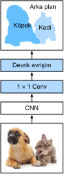

# Tam Evrişimli Ağlar
:label:`sec_fcn`

:numref:`sec_semantic_segmentation` içinde tartışıldığı gibi, anlamsal bölümleme imgeleri piksel düzeyinde sınıflandırır. Bir tam evrişimli ağ (FCN), imge piksellerini :cite:`Long.Shelhamer.Darrell.2015` piksel sınıflarına dönüştürmek için bir evrişimli sinir ağı kullanır. İmge sınıflandırması veya nesne algılama için daha önce karşılaştığımız CNN'lerden farklı olarak, tam evrişimli bir ağ, ara öznitelik haritalarının yüksekliğini ve genişliğini girdi imgesindekine geri dönüştürür: bu, :numref:`sec_transposed_conv` içinde tanıtılan devrik evrişimli katman ile elde edilir. Sonuç olarak, sınıflandırma çıktısı ve girdi imgesi, piksel düzeyinde bire bir karşılığa sahiptir: Herhangi bir çıktı pikselindeki kanal boyutu, girdi pikseli için sınıflandırma sonuçlarını aynı uzamsal konumda tutar.

```{.python .input}
%matplotlib inline
from d2l import mxnet as d2l
from mxnet import gluon, image, init, np, npx
from mxnet.gluon import nn

npx.set_np()
```

```{.python .input}
#@tab pytorch
%matplotlib inline
from d2l import torch as d2l
import torch
import torchvision
from torch import nn
from torch.nn import functional as F
```

## Model

Burada tam evrişimli ağ modelinin temel tasarımını açıklıyoruz. :numref:`fig_fcn` içinde gösterildiği gibi, bu model ilk olarak imge özniteliklerini ayıklamak için bir CNN kullanır, daha sonra $1\times 1$ evrişimli katman aracılığıyla kanal sayısını sınıf sayısına dönüştürür ve son olarak öznitelik haritalarının yüksekliğini ve genişliğini :numref:`sec_transposed_conv` içinde tanıtılan devrik evrişim yoluyla girdi imgesine dönüştürür. Sonuç olarak, model çıktısı, girdi imgesi ile aynı yüksekliğe ve genişliğe sahiptir; burada çıktı kanalı, aynı uzaysal konumda girdi pikseli için tahmin edilen sınıfları içerir. 


:label:`fig_fcn`

Aşağıda, [**imge özelliklerini ayıklamak için ImageNet veri kümesi üzerinde önceden eğitilmiş bir ResNet-18 modeli kullanıyor**] ve model örneğini `pretrained_net` olarak belirtiyoruz. Bu modelin son birkaç katmanı küresel ortalama ortaklama katmanı ve tam bağlı bir katman içerir: Bunlar tam evrişimli ağda gerekli değildir.

```{.python .input}
pretrained_net = gluon.model_zoo.vision.resnet18_v2(pretrained=True)
pretrained_net.features[-3:], pretrained_net.output
```

```{.python .input}
#@tab pytorch
pretrained_net = torchvision.models.resnet18(pretrained=True)
list(pretrained_net.children())[-3:]
```

Ardından, [**tam evrişimli ağ örneği `net`**]'i oluşturuyoruz. Son global ortalama ortaklama katmanı ve çıktıya en yakın tam bağlı katman dışında ResNet-18'deki tüm önceden eğitilmiş katmanları kopyalar.

```{.python .input}
net = nn.HybridSequential()
for layer in pretrained_net.features[:-2]:
    net.add(layer)
```

```{.python .input}
#@tab pytorch
net = nn.Sequential(*list(pretrained_net.children())[:-2])
```

Yüksekliği ve genişliği sırasıyla 320 ve 480 olan bir girdi göz önüne alındığında, `net`'in ileri yayması girdi yüksekliğini ve genişliğini orijinalin 1/32'sine, yani 10 ve 15'e düşürür.

```{.python .input}
X = np.random.uniform(size=(1, 3, 320, 480))
net(X).shape
```

```{.python .input}
#@tab pytorch
X = torch.rand(size=(1, 3, 320, 480))
net(X).shape
```

Ardından, [**çıktı kanallarının sayısını Pascal VOC2012 veri kümesinin sınıf sayısına (21) dönüştürmek için bir $1\times 1$ evrişimli katman kullanıyoruz.**] Son olarak, girdi imgesinin yüksekliğine ve genişliğine geri döndürmek için (**öznitelik haritalarının yüksekliğini ve genişliğini 32 kat artırmaya**) ihtiyacımız var. :numref:`sec_padding` içindeki bir evrişimli katmanının çıktı şeklini nasıl hesaplayacağınızı hatırlayın. $(320-64+16\times2+32)/32=10$ ve $(480-64+16\times2+32)/32=15$ olduğundan, çekirdeğin yüksekliği ve genişliği $64$'e, dolguyu ise $16$'ya ayarlayarak $32$ uzun adımlı olan devrik bir evrişim katmanı oluşturuyoruz. Genel olarak, $s$ uzun adımı için, dolgu $s/2$ ($s/2$ bir tam sayı olduğu varsayılarak) ve çekirdek yüksekliği ve genişliği $2s$'dir, devrik evrişimin girdi yüksekliğini ve genişliğini $s$ kat artıracağını görebilirsiniz.

```{.python .input}
num_classes = 21
net.add(nn.Conv2D(num_classes, kernel_size=1),
        nn.Conv2DTranspose(
            num_classes, kernel_size=64, padding=16, strides=32))
```

```{.python .input}
#@tab pytorch
num_classes = 21
net.add_module('final_conv', nn.Conv2d(512, num_classes, kernel_size=1))
net.add_module('transpose_conv', nn.ConvTranspose2d(num_classes, num_classes,
                                    kernel_size=64, padding=16, stride=32))
```

## [**Devrik Evrişimli Katmanları İlkleme**]

Devrik evrişimli katmanların öznitelik haritalarının yüksekliğini ve genişliğini artırabileceğini zaten biliyoruz. İmge işlemede, bir imgeyi büyütmemiz gerekebilir, yani, *örnek sıklaştırma*. *Çift doğrusal aradeğerleme* yaygın olarak kullanılan örnek sıklaştırma tekniklerinden biridir. Ayrıca, devrik evrişimli tabakaların ilklenmesi için de sıklıkla kullanılır. 

Çift doğrusal aradeğerlemeyi açıklamak için, bir girdi imgesi göz önüne alındığında, örnek sıklaştırılan çıktı imgesinin her pikselini hesaplamak istediğimizi varsayalım. Çıktı imgesinin pikselini $(x, y)$ koordinatında hesaplamak için, ilk önce $(x, y)$ ile girdi imgesindeki $(x', y')$ koordinatını eşleyin, örneğin, girdi boyutunun çıktı boyutuna oranı. Eşlenen $x′$ ve $y′$'nin gerçel sayılar olduğuna dikkat edin. Ardından, girdi imgesinde $(x', y')$ koordinatına en yakın dört pikseli bulun. Son olarak, $(x, y)$ koordinatındaki çıktı imgesinin pikseli, girdi imgesindeki bu dört en yakın piksele ve onların $(x', y')$'dan göreli mesafelerine dayanarak hesaplanır.  

Çift doğrusal aradeğerleme örnek sıklaştırması, aşağıdaki `bilinear_kernel` işlevi tarafından oluşturulan çekirdek ile devrik evrişimli katman tarafından gerçekleştirilebilir. Alan kısıtlamaları nedeniyle, algoritma tasarımı hakkında tartışmadan sadece aşağıdaki `bilinear_kernel` işlevinin uygulanmasını sağlıyoruz.

```{.python .input}
def bilinear_kernel(in_channels, out_channels, kernel_size):
    factor = (kernel_size + 1) // 2
    if kernel_size % 2 == 1:
        center = factor - 1
    else:
        center = factor - 0.5
    og = (np.arange(kernel_size).reshape(-1, 1),
          np.arange(kernel_size).reshape(1, -1))
    filt = (1 - np.abs(og[0] - center) / factor) * \
           (1 - np.abs(og[1] - center) / factor)
    weight = np.zeros((in_channels, out_channels, kernel_size, kernel_size))
    weight[range(in_channels), range(out_channels), :, :] = filt
    return np.array(weight)
```

```{.python .input}
#@tab pytorch
def bilinear_kernel(in_channels, out_channels, kernel_size):
    factor = (kernel_size + 1) // 2
    if kernel_size % 2 == 1:
        center = factor - 1
    else:
        center = factor - 0.5
    og = (torch.arange(kernel_size).reshape(-1, 1),
          torch.arange(kernel_size).reshape(1, -1))
    filt = (1 - torch.abs(og[0] - center) / factor) * \
           (1 - torch.abs(og[1] - center) / factor)
    weight = torch.zeros((in_channels, out_channels,
                          kernel_size, kernel_size))
    weight[range(in_channels), range(out_channels), :, :] = filt
    return weight
```

Bir devrik evrişimli katman tarafından uygulanan [**çift doğrusal aradeğerleme örnek sıklaştırmasını**] deneyelim. Yüksekliği ve ağırlığı iki katına çıkaran ve çekirdeğini `bilinear_kernel` işleviyle ilkleten bir devrik evrişimli katman oluşturuyoruz.

```{.python .input}
conv_trans = nn.Conv2DTranspose(3, kernel_size=4, padding=1, strides=2)
conv_trans.initialize(init.Constant(bilinear_kernel(3, 3, 4)))
```

```{.python .input}
#@tab pytorch
conv_trans = nn.ConvTranspose2d(3, 3, kernel_size=4, padding=1, stride=2,
                                bias=False)
conv_trans.weight.data.copy_(bilinear_kernel(3, 3, 4));
```

`X` imgesini okuyun ve örnekleme sıklaştırma çıktısını `Y`'ye atayın. İmgeyi yazdırmak için kanal boyutunun konumunu ayarlamamız gerekiyor.

```{.python .input}
img = image.imread('../img/catdog.jpg')
X = np.expand_dims(img.astype('float32').transpose(2, 0, 1), axis=0) / 255
Y = conv_trans(X)
out_img = Y[0].transpose(1, 2, 0)
```

```{.python .input}
#@tab pytorch
img = torchvision.transforms.ToTensor()(d2l.Image.open('../img/catdog.jpg'))
X = img.unsqueeze(0)
Y = conv_trans(X)
out_img = Y[0].permute(1, 2, 0).detach()
```

Gördüğümüz gibi, devrik evrişimli tabaka, imgenin yüksekliğini ve genişliğini iki kat arttırır. Koordinatlardaki farklı ölçekler haricinde, çift doğrusal aradeğerleme ile büyütülmüş imge ve :numref:`sec_bbox` içinde basılan orijinal imge aynı görünüyor.

```{.python .input}
d2l.set_figsize()
print('input image shape:', img.shape)
d2l.plt.imshow(img.asnumpy());
print('output image shape:', out_img.shape)
d2l.plt.imshow(out_img.asnumpy());
```

```{.python .input}
#@tab pytorch
d2l.set_figsize()
print('input image shape:', img.permute(1, 2, 0).shape)
d2l.plt.imshow(img.permute(1, 2, 0));
print('output image shape:', out_img.shape)
d2l.plt.imshow(out_img);
```

[**Bir tam evrişimli ağda, çift doğrusal aradeğerleme örnek sıklaştırma ile devrik evrişimli katmanı ilkliyoruz. $1\times 1$ evrişimli katman için Xavier ilkleme kullanıyoruz.**]

```{.python .input}
W = bilinear_kernel(num_classes, num_classes, 64)
net[-1].initialize(init.Constant(W))
net[-2].initialize(init=init.Xavier())
```

```{.python .input}
#@tab pytorch
W = bilinear_kernel(num_classes, num_classes, 64)
net.transpose_conv.weight.data.copy_(W);
```

## [**Veri Kümesini Okuma**]

:numref:`sec_semantic_segmentation` içinde tanıtıldığı gibi anlamsal bölümleme veri kümesini okuduk. Rastgele kırpmanın çıktı imgesi şekli $320\times 480$ olarak belirtilir: Hem yükseklik hem de genişlik $32$ ile bölünebilir.

```{.python .input}
#@tab all
batch_size, crop_size = 32, (320, 480)
train_iter, test_iter = d2l.load_data_voc(batch_size, crop_size)
```

## [**Eğitim**]

Şimdi oluşturduğumuz tam evrişimli ağımızı eğitebiliriz. Buradaki kayıp fonksiyonu ve doğruluk hesaplaması, önceki bölümlerin imge sınıflandırılmasındakilerden farklı değildir. Her piksel için sınıfı tahmin etmek için devrik evrişimli katmanın çıktı kanalını kullandığımızdan, kanal boyutu kayıp hesaplamasında belirtilir. Buna ek olarak, doğruluk, tüm pikseller için tahmin edilen sınıfın doğruluğuna göre hesaplanır.

```{.python .input}
num_epochs, lr, wd, devices = 5, 0.1, 1e-3, d2l.try_all_gpus()
loss = gluon.loss.SoftmaxCrossEntropyLoss(axis=1)
net.collect_params().reset_ctx(devices)
trainer = gluon.Trainer(net.collect_params(), 'sgd',
                        {'learning_rate': lr, 'wd': wd})
d2l.train_ch13(net, train_iter, test_iter, loss, trainer, num_epochs, devices)
```

```{.python .input}
#@tab pytorch
def loss(inputs, targets):
    return F.cross_entropy(inputs, targets, reduction='none').mean(1).mean(1)

num_epochs, lr, wd, devices = 5, 0.001, 1e-3, d2l.try_all_gpus()
trainer = torch.optim.SGD(net.parameters(), lr=lr, weight_decay=wd)
d2l.train_ch13(net, train_iter, test_iter, loss, trainer, num_epochs, devices)
```

## [**Tahminleme**]

Tahmin ederken, her kanaldaki girdi imgesini standartlaştırmamız ve imgeyi CNN'nin gerek duyduğu dört boyutlu girdi formatına dönüştürmemiz gerekir.

```{.python .input}
def predict(img):
    X = test_iter._dataset.normalize_image(img)
    X = np.expand_dims(X.transpose(2, 0, 1), axis=0)
    pred = net(X.as_in_ctx(devices[0])).argmax(axis=1)
    return pred.reshape(pred.shape[1], pred.shape[2])
```

```{.python .input}
#@tab pytorch
def predict(img):
    X = test_iter.dataset.normalize_image(img).unsqueeze(0)
    pred = net(X.to(devices[0])).argmax(dim=1)
    return pred.reshape(pred.shape[1], pred.shape[2])
```

Her pikselin [**tahmin edilen sınıfını**] görselleştirmek için, tahmini sınıfı veri kümesindeki etiket rengine geri eşleriz.

```{.python .input}
def label2image(pred):
    colormap = np.array(d2l.VOC_COLORMAP, ctx=devices[0], dtype='uint8')
    X = pred.astype('int32')
    return colormap[X, :]
```

```{.python .input}
#@tab pytorch
def label2image(pred):
    colormap = torch.tensor(d2l.VOC_COLORMAP, device=devices[0])
    X = pred.long()
    return colormap[X, :]
```

Test veri kümelerindeki imgeler boyut ve şekil bakımından farklılık gösterir. Model, bir girdi imgesinin yüksekliği veya genişliği 32 ile bölünmez olduğunda, 32 adımlı bir devrik evrişimli katman kullandığından, devrik evrişimli katmanın çıktı yüksekliği veya genişliği girdi imgesinin şeklinden sapacaktır. Bu sorunu gidermek için, imgedeki 32 tamsayı katları olan yükseklik ve genişliğe sahip çoklu dikdörtgen alanı kırpabilir ve bu alanlardaki piksellerde ileri yaymayı ayrı ayrı gerçekleştirebiliriz. Bu dikdörtgen alanların birleşmesinin girdi imgesini tamamen örtmesi gerektiğini unutmayın. Bir piksel birden fazla dikdörtgen alanla kaplandığında, aynı piksel için ayrı alanlardaki devrik evrişim çıktılarının ortalaması sınıfı tahmin etmek için softmaks işlemine girilebilir. 

Basitlik açısından, sadece birkaç büyük test imgesi okuruz ve imgenin sol üst köşesinden başlayarak tahmin için $320\times480$'lik bir alan kırpıyoruz. Bu test imgeleri için kırpılmış alanlarını, tahmin sonuçlarını ve gerçek referans değeri satır satır yazdırıyoruz.

```{.python .input}
voc_dir = d2l.download_extract('voc2012', 'VOCdevkit/VOC2012')
test_images, test_labels = d2l.read_voc_images(voc_dir, False)
n, imgs = 4, []
for i in range(n):
    crop_rect = (0, 0, 480, 320)
    X = image.fixed_crop(test_images[i], *crop_rect)
    pred = label2image(predict(X))
    imgs += [X, pred, image.fixed_crop(test_labels[i], *crop_rect)]
d2l.show_images(imgs[::3] + imgs[1::3] + imgs[2::3], 3, n, scale=2);
```

```{.python .input}
#@tab pytorch
voc_dir = d2l.download_extract('voc2012', 'VOCdevkit/VOC2012')
test_images, test_labels = d2l.read_voc_images(voc_dir, False)
n, imgs = 4, []
for i in range(n):
    crop_rect = (0, 0, 320, 480)
    X = torchvision.transforms.functional.crop(test_images[i], *crop_rect)
    pred = label2image(predict(X))
    imgs += [X.permute(1,2,0), pred.cpu(),
             torchvision.transforms.functional.crop(
                 test_labels[i], *crop_rect).permute(1,2,0)]
d2l.show_images(imgs[::3] + imgs[1::3] + imgs[2::3], 3, n, scale=2);
```

## Özet

* Tam evrişimli ağ önce imge özniteliklerini ayıklamak için bir CNN kullanır, daha sonra $1\times 1$'lik bir evrişimli katman aracılığıyla kanal sayısını sınıf sayısına dönüştürür ve son olarak öznitelik haritalarının yüksekliğini ve genişliğini devrik evrişim yoluyla girdi imgesine dönüştürür.
* Tam evrişimli bir ağda, devrik evrişimli tabakayı ilklemek için çift doğrusal aradeğerlendirme örnek sıklaştırmayı kullanabiliriz.

## Alıştırmalar

1. Deneyde devrik evrişimli katman için Xavier ilkleme kullanırsak, sonuç nasıl değişir?
1. Hiper parametreleri ayarlayarak modelin doğruluğunu daha da iyileştirebilir misiniz?
1. Test imgelerindeki tüm piksellerin sınıflarını tahmin edin.
1. Orijinal tam evrişimli ağ makalesi, bazı ara CNN katmanlarının :cite:`Long.Shelhamer.Darrell.2015` çıktılarını da kullanır. Bu fikri uygulamaya çalışın.

:begin_tab:`mxnet`
[Tartışmalar](https://discuss.d2l.ai/t/377)
:end_tab:

:begin_tab:`pytorch`
[Tartışmalar](https://discuss.d2l.ai/t/1582)
:end_tab:
