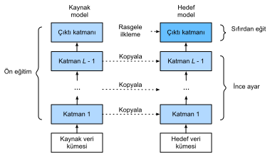

# İnce Ayar
:label:`sec_fine_tuning`

Daha önceki bölümlerde, Fashion-MNIST eğitim veri kümesindeki sadece 60000 resim ile modellerin nasıl eğitileceğini tartıştık. Ayrıca, 10 milyondan fazla imge ve 1000 nesneye sahip olan, akademide en yaygın kullanılan büyük ölçekli imge veri kümesi olan ImageNet'i de tanımladık. Ancak, genellikle karşılaştığımız veri kümesinin boyutu iki veri kümesinin arasındadır. 

İmgelerden farklı sandalye türlerini tanımak istediğimizi ve kullanıcılara satın alma bağlantılarını önerdiğimizi varsayalım. Olası bir yöntem, önce 100 ortak sandalyeyi tanımlamak, her sandalye için farklı açılardan 1000 imge almak ve daha sonra toplanan imge veri kümesinde bir sınıflandırma modeli eğitmektir. Bu sandalye veri kümesi Fashion-MNIST veri kümesinden daha büyük olsa da, örneklerin sayısı hala ImageNet'in onda birinden daha azdır. Bu, bu sandalye veri kümesinde ImageNet için uygun karmaşık modellerin aşırı öğrenmesine neden olabilir. Ayrıca, sınırlı sayıda eğitim örneği nedeniyle, eğitimli modelin doğruluğu pratik gereklilikleri karşılamayabilir. 

Yukarıdaki sorunları gidermek için, bariz bir çözüm daha fazla veri toplamaktır. Bununla birlikte, verilerin toplanması ve etiketlenmesi çok zaman ve para alabilir. Örneğin, ImageNet veri kümesini toplamak için, araştırmacılar araştırma fonundan milyonlarca dolar harcadı. Geçerli veri toplama maliyeti önemli ölçüde düşmüş olsa da, bu maliyet yine de göz ardı edilemez. 

Diğer bir çözüm, *kaynak veri kümesinden* öğrenilen bilgileri *hedef veri kümesine* aktarmak için *öğrenme aktarımı* uygulamaktır. Örneğin, ImageNet veri kümelerindeki imgelerin çoğunun sandalyelerle ilgisi olmasa da, bu veri kümesinde eğitilen model, kenarları, dokuları, şekilleri ve nesne bileşimini tanımlamaya yardımcı olabilecek daha genel imge özelliklerini ortaya çıkarabilir. Bu benzer özellikler sandalyeleri tanımak için de etkili olabilir. 

## Adımlar

Bu bölümde, öğrenme aktarımında yaygın bir teknik tanıtacağız: *İnce ayar*. :numref:`fig_finetune` içinde gösterildiği gibi, ince ayar aşağıdaki dört adımdan oluşur: 

1. Bir sinir ağı modelini (yani *kaynak modeli*) kaynak veri kümesinde (örn. ImageNet veri kümesi) ön eğitin.
1. Yeni bir sinir ağı modeli oluşturun, yani *hedef modeli*. Bu, çıktı katmanı dışındaki tüm model tasarımlarını ve parametrelerini kaynak modelden kopyalar. Bu model parametrelerinin kaynak veri kümesinden öğrenilen bilgileri içerdiğini ve bu bilginin hedef veri kümesine de uygulanacağını varsayıyoruz. Kaynak modelin çıktı katmanının kaynak veri kümesinin etiketleriyle yakından ilişkili olduğunu varsayıyoruz; bu nedenle hedef modelde kullanılmaz.
1. Hedef modele çıktı sayısı hedef veri kümesindeki kategorilerin sayısı kadar olan bir çıktı katmanı ekleyin. Ardından bu katmanın model parametrelerini rastgele ilkletin.
1. Hedef modeli hedef veri kümelerinde eğitin, mesela sandalye veri kümesi. Çıktı katmanı sıfırdan eğitilirken, diğer tüm katmanların parametreleri kaynak modelin parametrelerine göre ince ayarlanır.


:label:`fig_finetune`

Hedef veri kümeleri kaynak veri kümelerinden çok daha küçük olduğunda ince ayar modellerin genelleme yeteneğini geliştirmeye yardımcı olur. 

## Sosisli Sandviç Tanıma

Somut bir vaka aracılığıyla ince ayarı gösterelim: Sosisli sandviç tanıma. ImageNet veri kümesinde önceden eğitilmiş bir ResNet modelini küçük bir veri kümesine ince ayar yapacağız. Bu küçük veri kümesi, sosisli sandviçli ve sandviçsiz binlerce imgeden oluşur. İmgelerden sosisli sandviçleri tanımak için ince ayarlanmış model kullanacağız.

```{.python .input}
%matplotlib inline
from d2l import mxnet as d2l
from mxnet import gluon, init, np, npx
from mxnet.gluon import nn
import os

npx.set_np()
```

```{.python .input}
#@tab pytorch
%matplotlib inline
from d2l import torch as d2l
from torch import nn
import torch
import torchvision
import os
```

### Veri Kümesini Okuma

[**Kullandığımız sosisli sandviç veri kümesi çevrimiçi imgelerden alındı**]. Bu veri kümesi, sosisli sandviç içeren 1400 pozitif etiketli imgeden ve diğer yiyecekleri içeren birçok negatif etiketli imgeden oluşur. Her iki sınıfın 1000 imgesi eğitim için kullanılır ve geri kalanı test içindir.

İndirilen veri kümesini açtıktan sonra, iki klasör, `hotdog/train` ve `hotdog/test`, elde ediyoruz. Her iki klasörde de `hotdog` (sosisli sandviç) ve `not-hotdog` (sosisli sandviç olmayan) alt klasörleri vardır; bunlardan herbiri karşılık gelen sınıfın imgelerini içerir.

```{.python .input}
#@tab all
#@save
d2l.DATA_HUB['hotdog'] = (d2l.DATA_URL + 'hotdog.zip', 
                         'fba480ffa8aa7e0febbb511d181409f899b9baa5')

data_dir = d2l.download_extract('hotdog')
```

Eğitim ve test veri kümelerindeki tüm imge dosyalarını okumak için iki örnek oluşturuyoruz.

```{.python .input}
train_imgs = gluon.data.vision.ImageFolderDataset(
    os.path.join(data_dir, 'train'))
test_imgs = gluon.data.vision.ImageFolderDataset(
    os.path.join(data_dir, 'test'))
```

```{.python .input}
#@tab pytorch
train_imgs = torchvision.datasets.ImageFolder(os.path.join(data_dir, 'train'))
test_imgs = torchvision.datasets.ImageFolder(os.path.join(data_dir, 'test'))
```

İlk 8 pozitif örnek ve son 8 negatif imge aşağıda gösterilmiştir. Gördüğünüz gibi, [**resimler boyut ve en-boy oranı bakımından farklılık gösterir**].

```{.python .input}
#@tab all
hotdogs = [train_imgs[i][0] for i in range(8)]
not_hotdogs = [train_imgs[-i - 1][0] for i in range(8)]
d2l.show_images(hotdogs + not_hotdogs, 2, 8, scale=1.4);
```

Eğitim sırasında, önce imgeden rastgele boyut ve rastgele en-boy oranına sahip bir alanı kırpıyoruz ve sonra bu alanı $224 \times 224$ girdi imgesine ölçeklendiriyoruz. Test sırasında, imgenin hem yüksekliğini hem de genişliğini 256 piksele ölçeklendirir ve ardından merkezi bir $224 \times 224$ alanı girdi olarak kırpırız. Buna ek olarak, üç RGB (kırmızı, yeşil ve mavi) renk kanalı için değerlerini kanala göre standartlaştırıyoruz. Bir kanalın ortalama değeri, bu kanalın her değerinden çıkarılır ve sonuç bu kanalın standart sapmasına bölünür. 

[~~Veri artırımları~~]

```{.python .input}
# Her kanalı standartlaştırmak için üç RGB kanalının ortalamalarını ve standart sapmalarını belirtin
normalize = gluon.data.vision.transforms.Normalize(
    [0.485, 0.456, 0.406], [0.229, 0.224, 0.225])

train_augs = gluon.data.vision.transforms.Compose([
    gluon.data.vision.transforms.RandomResizedCrop(224),
    gluon.data.vision.transforms.RandomFlipLeftRight(),
    gluon.data.vision.transforms.ToTensor(),
    normalize])

test_augs = gluon.data.vision.transforms.Compose([
    gluon.data.vision.transforms.Resize(256),
    gluon.data.vision.transforms.CenterCrop(224),
    gluon.data.vision.transforms.ToTensor(),
    normalize])
```

```{.python .input}
#@tab pytorch
# Her kanalı standartlaştırmak için üç RGB kanalının ortalamalarını ve standart sapmalarını belirtin
normalize = torchvision.transforms.Normalize(
    [0.485, 0.456, 0.406], [0.229, 0.224, 0.225])

train_augs = torchvision.transforms.Compose([
    torchvision.transforms.RandomResizedCrop(224),
    torchvision.transforms.RandomHorizontalFlip(),
    torchvision.transforms.ToTensor(),
    normalize])

test_augs = torchvision.transforms.Compose([
    torchvision.transforms.Resize(256),
    torchvision.transforms.CenterCrop(224),
    torchvision.transforms.ToTensor(),
    normalize])
```

### [**Modelin Tanımlanması ve İlklenmesi**]

Kaynak model olarak ImageNet veri kümesi üzerinde önceden eğitilmiş olan ResNet-18'i kullanıyoruz. Burada, önceden eğitilmiş model parametrelerini otomatik olarak indirmek için `pretrained=True`'yi belirtiyoruz. Bu model ilk kez kullanılıyorsa, indirmek için İnternet bağlantısı gereklidir.

```{.python .input}
pretrained_net = gluon.model_zoo.vision.resnet18_v2(pretrained=True)
```

```{.python .input}
#@tab pytorch
pretrained_net = torchvision.models.resnet18(pretrained=True)
```

:begin_tab:`mxnet`
Önceden eğitilmiş kaynak model örneği iki üye değişken içerir: `features` (öznitelikler) ve `output` (çıktı). Birincisi, çıktı katmanı dışındaki modelin tüm katmanlarını içerir ve ikincisi modelin çıktı katmanıdır. Bu bölümün temel amacı, çıktı katmanı dışındaki tüm katmanların model parametrelerinin ince ayarını kolaylaştırmaktır. Kaynak modelin `output` (çıktı) üye değişkeni aşağıda gösterilmiştir.
:end_tab:

:begin_tab:`pytorch`
Önceden eğitilmiş kaynak model örneği, bir dizi öznitelik katmanı ve bir çıktı katmanı `fc` içerir. Bu bölümün temel amacı, tüm katmanların ancak çıktı tabakasının model parametrelerinin ince ayarlanmasını kolaylaştırmaktır. Kaynak modelin `fc` üye değişkeni aşağıda verilmiştir.
:end_tab:

```{.python .input}
pretrained_net.output
```

```{.python .input}
#@tab pytorch
pretrained_net.fc
```

Tam bağlı bir katman olarak ResNet'in son küresel ortalama ortaklama çıktılarını ImageNet veri kümesinin 1000 sınıf çıktısına dönüştürür. Daha sonra hedef model olarak yeni bir sinir ağı kurarız. Son katmandaki çıktı sayısının hedef veri kümesindeki sınıf sayısına (1000 yerine) ayarlanması dışında, önceden eğitilmiş kaynak modeliyle aynı şekilde tanımlanır. 

Aşağıdaki kodda, hedef model örneğinin üye değişken özniteliklerindeki model parametreleri, kaynak modelin karşılık gelen katmanının model parametrelerine ilkletilir. Özniteliklerdeki model parametreleri ImageNet veri kümesinde önceden eğitildiğinden ve yeterince iyi olduğundan, bu parametrelerin ince ayarlanması için genellikle yalnızca küçük bir öğrenme oranına ihtiyaç vardır.  

Üye değişken çıktısındaki model parametreleri rastgele ilkletilir ve genellikle sıfırdan eğitmek için daha büyük bir öğrenme oranı gerektirir. Trainer (eğtici) örneğindeki öğrenme oranının η olduğunu varsayarsak, üye değişken çıktısındaki model parametrelerinin öğrenme oranını yinelemede 10η olarak ayarlarız. 

Aşağıdaki kodda, hedef model örneğinin `finetune_net` çıktı katmanından önceki model parametreleri, kaynak modelden karşılık gelen katmanların model parametrelerine ilklenir. Bu model parametreleri ImageNet'te ön eğitim yoluyla elde edildiğinden etkilidir. Bu nedenle, bu tür önceden eğitilmiş parametreleri *ince ayarlamak* için yalnızca küçük bir öğrenme oranını kullanabiliriz. Buna karşılık, çıktı katmanındaki model parametreleri rastgele ilklenir ve genellikle sıfırdan öğrenilmesi için daha büyük bir öğrenme oranı gereklidir. Temel öğrenme oranının $\eta$ olursa, çıktı katmanındaki model parametrelerini yinelemek için $10\eta$ öğrenme oranı kullanılacaktır.

```{.python .input}
finetune_net = gluon.model_zoo.vision.resnet18_v2(classes=2)
finetune_net.features = pretrained_net.features
finetune_net.output.initialize(init.Xavier())
# The model parameters in the output layer will be iterated using a learning
# rate ten times greater
finetune_net.output.collect_params().setattr('lr_mult', 10)
```

```{.python .input}
#@tab pytorch
finetune_net = torchvision.models.resnet18(pretrained=True)
finetune_net.fc = nn.Linear(finetune_net.fc.in_features, 2)
nn.init.xavier_uniform_(finetune_net.fc.weight);
```

### [**Modeli İnce Ayarlama**]

İlk olarak, ince ayar kullanan `train_fine_tuning` eğitim fonksiyonunu tanımlıyoruz, böylece birden çok kez çağrılabilir.

```{.python .input}
def train_fine_tuning(net, learning_rate, batch_size=128, num_epochs=5):
    train_iter = gluon.data.DataLoader(
        train_imgs.transform_first(train_augs), batch_size, shuffle=True)
    test_iter = gluon.data.DataLoader(
        test_imgs.transform_first(test_augs), batch_size)
    devices = d2l.try_all_gpus()
    net.collect_params().reset_ctx(devices)
    net.hybridize()
    loss = gluon.loss.SoftmaxCrossEntropyLoss()
    trainer = gluon.Trainer(net.collect_params(), 'sgd', {
        'learning_rate': learning_rate, 'wd': 0.001})
    d2l.train_ch13(net, train_iter, test_iter, loss, trainer, num_epochs,
                   devices)
```

```{.python .input}
#@tab pytorch
# If `param_group=True`, the model parameters in the output layer will be
# updated using a learning rate ten times greater
def train_fine_tuning(net, learning_rate, batch_size=128, num_epochs=5,
                      param_group=True):
    train_iter = torch.utils.data.DataLoader(torchvision.datasets.ImageFolder(
        os.path.join(data_dir, 'train'), transform=train_augs),
        batch_size=batch_size, shuffle=True)
    test_iter = torch.utils.data.DataLoader(torchvision.datasets.ImageFolder(
        os.path.join(data_dir, 'test'), transform=test_augs),
        batch_size=batch_size)
    devices = d2l.try_all_gpus()
    loss = nn.CrossEntropyLoss(reduction="none")
    if param_group:
        params_1x = [param for name, param in net.named_parameters()
             if name not in ["fc.weight", "fc.bias"]]
        trainer = torch.optim.SGD([{'params': params_1x},
                                   {'params': net.fc.parameters(),
                                    'lr': learning_rate * 10}],
                                lr=learning_rate, weight_decay=0.001)
    else:
        trainer = torch.optim.SGD(net.parameters(), lr=learning_rate,
                                  weight_decay=0.001)    
    d2l.train_ch13(net, train_iter, test_iter, loss, trainer, num_epochs,
                   devices)
```

Ön eğitim yoluyla elde edilen model parametreleri *ince ayarlayabilmek* için temel öğrenme oranını küçük bir değere ayarladık. Önceki ayarlara dayanarak, hedef modelin çıktı katmanı parametrelerini on kat daha büyük bir öğrenme oranı kullanarak sıfırdan eğiteceğiz.

```{.python .input}
train_fine_tuning(finetune_net, 0.01)
```

```{.python .input}
#@tab pytorch
train_fine_tuning(finetune_net, 5e-5)
```

[**Karşılaştırma için,**] özdeş bir model tanımlarız, ancak (**tüm model parametrelerini rastgele değerlere ilklenir**). Tüm modelin sıfırdan eğitilmesi gerektiğinden, daha büyük bir öğrenme oranı kullanabiliriz.

```{.python .input}
scratch_net = gluon.model_zoo.vision.resnet18_v2(classes=2)
scratch_net.initialize(init=init.Xavier())
train_fine_tuning(scratch_net, 0.1)
```

```{.python .input}
#@tab pytorch
scratch_net = torchvision.models.resnet18()
scratch_net.fc = nn.Linear(scratch_net.fc.in_features, 2)
train_fine_tuning(scratch_net, 5e-4, param_group=False)
```

Gördüğümüz gibi, ince ayarlı model aynı dönem için daha iyi performans gösterme eğilimindedir, çünkü ilk parametre değerleri daha etkilidir. 

## Özet

* Öğrenme aktarımı kaynak veri kümesinden öğrenilen bilgiyi hedef veri kümesine aktarır. İnce ayar, öğrenim aktarımı için yaygın bir tekniktir.
* Hedef model, çıktı katmanı hariç, kaynak modelden parametreleriyle tüm model tasarımlarını kopyalar ve hedef veri kümesine göre bu parametreleri ince ayarlar. Buna karşılık, hedef modelin çıktı katmanının sıfırdan eğitilmesi gerekir.
* Genel olarak, ince ayar parametreleri daha küçük bir öğrenme oranı kullanırken, çıktı katmanını sıfırdan eğitmek daha büyük bir öğrenme oranı kullanabilir.

## Alıştırmalar

1. `finetune_net`'in öğrenme oranını artırmaya devam edin. Modelin doğruluğu nasıl değişir?
2. Karşılaştırmalı deneyde `finetune_net` ve `scratch_net`'in hiper parametrelerini daha detaylı ayarlayın. Hala doğrulukta farklılık gösteriyorlar mı?
3. `finetune_net` çıktı katmanından önceki parametreleri kaynak modelininkine ayarlayın ve eğitim sırasında bunları *güncellemeyin*. Modelin doğruluğu nasıl değişir? Aşağıdaki kodu kullanabilirsiniz.

```{.python .input}
finetune_net.features.collect_params().setattr('grad_req', 'null')
```

```{.python .input}
#@tab pytorch
for param in finetune_net.parameters():
    param.requires_grad = False
```

4. Aslında, `ImageNet` veri kümesinde bir "sosisli sandviç” sınıfı var. Çıktı katmanındaki karşılık gelen ağırlık parametresi aşağıdaki kodla elde edilebilir. Bu ağırlık parametresinden nasıl yararlanabiliriz?

```{.python .input}
weight = pretrained_net.output.weight
hotdog_w = np.split(weight.data(), 1000, axis=0)[713]
hotdog_w.shape
```

```{.python .input}
#@tab pytorch
weight = pretrained_net.fc.weight
hotdog_w = torch.split(weight.data, 1, dim=0)[934]
hotdog_w.shape
```

:begin_tab:`mxnet`
[Tartışmalar](https://discuss.d2l.ai/t/368)
:end_tab:

:begin_tab:`pytorch`
[Tartışmalar](https://discuss.d2l.ai/t/1439)
:end_tab:
