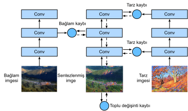

# Sinir Tarzı Transfer

Eğer bir fotoğraf meraklısı iseniz, filtreye aşina olabilirsiniz. Fotoğrafların renk stilini değiştirebilir, böylece manzara fotoğraflarının daha keskin hale gelmesi veya portre fotoğraflarının beyazlatılmış derileri vardır. Ancak, bir filtre genellikle fotoğrafın yalnızca bir yönünü değiştirir. Bir fotoğrafa ideal bir stil uygulamak için muhtemelen birçok farklı filtre kombinasyonunu denemeniz gerekir. Bu işlem, bir modelin hiperparametrelerini ayarlamak kadar karmaşıktır. 

Bu bölümde, bir görüntünün stilini otomatik olarak başka bir görüntüye (örn. stil aktarımı* :cite:`Gatys.Ecker.Bethge.2016`) uygulamak için CNN'nin katmanlı temsillerinden yararlanacağız. Bu görevin iki girdi görüntüsü gerekir: biri*içerik görüntüsü*, diğeri ise *stil görüntüsü*. İçerik görüntüsünü stil görüntüsüne yakın hale getirmek için sinir ağlarını kullanacağız. Örneğin, :numref:`fig_style_transfer`'teki içerik görüntüsü Seattle'ın banliyölerindeki Rainier Milli Parkı'nda tarafımızdan çekilen bir manzara fotoğrafıdır ve stil görüntüsü sonbahar meşe ağaçları temalı bir yağlı boya tablosudur. Çıktı sentezlenen görüntüde, stil görüntüsünün yağ fırçası darbeleri uygulanır ve içerik görüntüsünde nesnelerin ana şeklini korurken daha canlı renklere yol açar. 


:label:`fig_style_transfer`

## Yöntem

:numref:`fig_style_transfer_model`, CNN tabanlı stil aktarım yöntemini basitleştirilmiş bir örnekle gösterir. İlk olarak, sentezlenen görüntüyü, örneğin içerik görüntüsüne başlatırız. Bu sentezlenen görüntü, stil aktarımı işlemi sırasında güncellenmesi gereken tek değişkendir, yani eğitim sırasında güncellenecek model parametreleri. Daha sonra görüntü özelliklerini ayıklamak ve eğitim sırasında model parametrelerini dondurmak için önceden eğitilmiş bir CNN seçiyoruz. Bu derin CNN görüntüler için hiyerarşik özellikleri ayıklamak için birden çok katman kullanır. İçerik özellikleri veya stil özellikleri olarak bu katmanlardan bazılarının çıktısını seçebiliriz. Örnek olarak :numref:`fig_style_transfer_model`'ü ele alın. Buradaki önceden eğitilmiş sinir ağı, ikinci katmanın içerik özelliklerini çıkardığı ve birinci ve üçüncü katmanlar stil özelliklerini çıkardığı 3 kıvrımlı katmana sahiptir. 


:label:`fig_style_transfer_model`

Daha sonra, ileriye yayılma yoluyla stil aktarımının kayıp işlevini hesaplıyoruz (katı okların yönü) ve model parametrelerini (çıktı için sentezlenmiş görüntü) geri yayılma (kesikli okların yönü) ile güncelleriz. Stil aktarımında yaygın olarak kullanılan kayıp fonksiyonu üç bölümden oluşur: (i) *içerik kaybı* sentezlenen görüntüyü ve içerik görüntüsünü içerik özelliklerinde yakınlaştırır; (ii) *stil kaybı* sentezlenen görüntü ve stil görüntüsünü stil özelliklerinde yakınlaştırır; ve (iii) *toplam varyasyon kaybı* sentezlenen görüntüde gürültü. Son olarak, model eğitimi bittiğinde, son sentezlenmiş görüntüyü oluşturmak için stil aktarımının model parametrelerini çıkarırız. 

Aşağıda, somut bir deney yoluyla stil transferinin teknik detaylarını açıklayacağız. 

## [**İçerik ve Stil Görüntüleri Okunma**]

İlk olarak, içeriği ve stil görüntülerini okuyoruz. Basılı koordinat eksenlerinden, bu görüntülerin farklı boyutlarda olduğunu söyleyebiliriz.

```{.python .input}
%matplotlib inline
from d2l import mxnet as d2l
from mxnet import autograd, gluon, image, init, np, npx
from mxnet.gluon import nn

npx.set_np()

d2l.set_figsize()
content_img = image.imread('../img/rainier.jpg')
d2l.plt.imshow(content_img.asnumpy());
```

```{.python .input}
#@tab pytorch
%matplotlib inline
from d2l import torch as d2l
import torch
import torchvision
from torch import nn

d2l.set_figsize()
content_img = d2l.Image.open('../img/rainier.jpg')
d2l.plt.imshow(content_img);
```

```{.python .input}
style_img = image.imread('../img/autumn-oak.jpg')
d2l.plt.imshow(style_img.asnumpy());
```

```{.python .input}
#@tab pytorch
style_img = d2l.Image.open('../img/autumn-oak.jpg')
d2l.plt.imshow(style_img);
```

## [**Önişleme ve Sonrası İşleme Sonrası]

Aşağıda, önişleme ve postprocessing görüntüleri için iki işlev tanımlıyoruz. `preprocess` işlevi, giriş görüntüsünün üç RGB kanalının her birini standartlaştırır ve sonuçları CNN giriş biçimine dönüştürür. `postprocess` işlevi, standardizasyondan önce çıktı görüntüsünde piksel değerlerini orijinal değerlerine geri yükler. Görüntü yazdırma işlevi, her pikselin 0'dan 1'e kadar kayan nokta değerine sahip olmasını gerektirdiğinden, 0'dan küçük veya 1'den büyük herhangi bir değeri sırasıyla 0 veya 1 ile değiştiririz.

```{.python .input}
rgb_mean = np.array([0.485, 0.456, 0.406])
rgb_std = np.array([0.229, 0.224, 0.225])

def preprocess(img, image_shape):
    img = image.imresize(img, *image_shape)
    img = (img.astype('float32') / 255 - rgb_mean) / rgb_std
    return np.expand_dims(img.transpose(2, 0, 1), axis=0)

def postprocess(img):
    img = img[0].as_in_ctx(rgb_std.ctx)
    return (img.transpose(1, 2, 0) * rgb_std + rgb_mean).clip(0, 1)
```

```{.python .input}
#@tab pytorch
rgb_mean = torch.tensor([0.485, 0.456, 0.406])
rgb_std = torch.tensor([0.229, 0.224, 0.225])

def preprocess(img, image_shape):
    transforms = torchvision.transforms.Compose([
        torchvision.transforms.Resize(image_shape),
        torchvision.transforms.ToTensor(),
        torchvision.transforms.Normalize(mean=rgb_mean, std=rgb_std)])
    return transforms(img).unsqueeze(0)

def postprocess(img):
    img = img[0].to(rgb_std.device)
    img = torch.clamp(img.permute(1, 2, 0) * rgb_std + rgb_mean, 0, 1)
    return torchvision.transforms.ToPILImage()(img.permute(2, 0, 1))
```

## [**Özellik Çıkarma**]

Görüntü özelliklerini :cite:`Gatys.Ecker.Bethge.2016` ayıklamak için ImageNet veri setinde önceden eğitilmiş VGG-19 modelini kullanıyoruz.

```{.python .input}
pretrained_net = gluon.model_zoo.vision.vgg19(pretrained=True)
```

```{.python .input}
#@tab pytorch
pretrained_net = torchvision.models.vgg19(pretrained=True)
```

Görüntünün içerik özelliklerini ve stil özelliklerini ayıklamak için, VGG ağındaki belirli katmanların çıktısını seçebiliriz. Genel olarak, giriş katmanına ne kadar yakın olursa, görüntünün ayrıntılarını çıkarmak daha kolay olur ve tersi de, görüntünün küresel bilgilerini çıkarmak daha kolay olur. Sentezlenen görüntüdeki içerik görüntüsünün ayrıntılarını aşırı derecede korumaktan kaçınmak için, görüntünün içerik özelliklerini çıkarmak için çıktıya *içerik katmanı* olarak daha yakın bir VGG katmanı seçiyoruz. Yerel ve küresel stil özelliklerini ayıklamak için farklı VGG katmanlarının çıktısını da seçiyoruz. Bu katmanlar*stil katmanları* olarak da adlandırılır. :numref:`sec_vgg`'te belirtildiği gibi, VGG ağı 5 konvolüsyonel blok kullanır. Deneyde, dördüncü kıvrımlı bloğun içerik katmanı olarak son kıvrımlı tabakasını ve stil katmanı olarak her bir kıvrımsal bloğun ilk kıvrımlı katmanını seçiyoruz. Bu katmanların indeksleri `pretrained_net` örneğini yazdırarak elde edilebilir.

```{.python .input}
#@tab all
style_layers, content_layers = [0, 5, 10, 19, 28], [25]
```

VGG katmanlarını kullanarak özellikleri ayıklarken, yalnızca giriş katmanından içerik katmanına veya çıktı katmanına en yakın stil katmanına kadar tüm bunları kullanmamız gerekir. Yeni bir ağ örneği oluşturalım `net`, yalnızca özellik ayıklama için kullanılacak tüm VGG katmanlarını korur.

```{.python .input}
net = nn.Sequential()
for i in range(max(content_layers + style_layers) + 1):
    net.add(pretrained_net.features[i])
```

```{.python .input}
#@tab pytorch
net = nn.Sequential(*[pretrained_net.features[i] for i in
                      range(max(content_layers + style_layers) + 1)])
```

`X` girişi göz önüne alındığında, sadece ileriye yayılmasını `net(X)`'i çağırırsak, yalnızca son katmanın çıktısını alabiliriz. Ara katmanların çıktılarına da ihtiyacımız olduğundan, katman bazında hesaplama yapmamız ve içeriği ve stil katmanı çıkışlarını korumalıyız.

```{.python .input}
#@tab all
def extract_features(X, content_layers, style_layers):
    contents = []
    styles = []
    for i in range(len(net)):
        X = net[i](X)
        if i in style_layers:
            styles.append(X)
        if i in content_layers:
            contents.append(X)
    return contents, styles
```

Aşağıda iki işlev tanımlanmıştır: `get_contents` işlevi içerik görüntüsünden içerik özelliklerini çıkarır ve `get_styles` işlevi stil görüntüsünden stil özelliklerini çıkarır. Eğitim sırasında önceden eğitilmiş VGG'nin model parametrelerini güncellemeye gerek olmadığından, eğitim başlamadan bile içeriği ve stil özelliklerini çıkarabiliriz. Sentezlenen görüntü, stil aktarımı için güncellenecek bir model parametreleri kümesi olduğundan, yalnızca sentezlenen görüntünün içerik ve stil özelliklerini eğitim sırasında `extract_features` işlevini çağırarak ayıklayabiliriz.

```{.python .input}
def get_contents(image_shape, device):
    content_X = preprocess(content_img, image_shape).copyto(device)
    contents_Y, _ = extract_features(content_X, content_layers, style_layers)
    return content_X, contents_Y

def get_styles(image_shape, device):
    style_X = preprocess(style_img, image_shape).copyto(device)
    _, styles_Y = extract_features(style_X, content_layers, style_layers)
    return style_X, styles_Y
```

```{.python .input}
#@tab pytorch
def get_contents(image_shape, device):
    content_X = preprocess(content_img, image_shape).to(device)
    contents_Y, _ = extract_features(content_X, content_layers, style_layers)
    return content_X, contents_Y

def get_styles(image_shape, device):
    style_X = preprocess(style_img, image_shape).to(device)
    _, styles_Y = extract_features(style_X, content_layers, style_layers)
    return style_X, styles_Y
```

## [**Kayıp Fonksiyonunu Tanımlama**]

Şimdi stil transferi için kayıp işlevini açıklayacağız. Kayıp fonksiyonu içerik kaybı, stil kaybı ve toplam varyasyon kaybından oluşur. 

### İçerik Kaybı

Doğrusal regresyondaki kayıp işlevine benzer şekilde, içerik kaybı, kareli kayıp fonksiyonu aracılığıyla sentezlenen görüntü ile içerik görüntüsü arasındaki içerik özelliklerindeki farkı ölçer. Kare kayıp fonksiyonunun iki girişi, `extract_features` işlevi tarafından hesaplanan içerik katmanının her iki çıkışıdır.

```{.python .input}
def content_loss(Y_hat, Y):
    return np.square(Y_hat - Y).mean()
```

```{.python .input}
#@tab pytorch
def content_loss(Y_hat, Y):
    # We detach the target content from the tree used to dynamically compute
    # the gradient: this is a stated value, not a variable. Otherwise the loss
    # will throw an error.
    return torch.square(Y_hat - Y.detach()).mean()
```

### Stil Kaybı

İçerik kaybına benzer şekilde stil kaybı, aynı zamanda sentezlenen görüntü ile stil görüntüsü arasındaki stil farkını ölçmek için kare kaybı işlevini kullanır. Herhangi bir stil katmanının stil çıktısını ifade etmek için önce stil katmanı çıktısını hesaplamak için `extract_features` işlevini kullanırız. Çıktının 1 örnek, $c$ kanal, yükseklik $h$ ve genişlik $w$ olduğunu varsayalım, bu çıktıyı $c$ satır ve $hw$ sütunlarla matris $\mathbf{X}$'a dönüştürebiliriz. Bu matris $hw$ uzunluğuna sahip her biri $c$ vektörlerinin $\mathbf{x}_1, \ldots, \mathbf{x}_c$'in birleştirilmesi olarak düşünülebilir. Burada vektör $\mathbf{x}_i$, $i$ kanalının stil özelliğini temsil eder. 

Bu vektörlerin*Gram matrisinde* $\mathbf{X}\mathbf{X}^\top \in \mathbb{R}^{c \times c}$, $i$ satırında $x_{ij}$ ve sütun $j$ numaralı öğe $\mathbf{x}_j$ vektörlerinin nokta çarpımıdır. $i$ ve $j$ kanallarının stil özelliklerinin korelasyonunu temsil eder. Bu Gram matrisini herhangi bir stil katmanının stil çıktısını temsil etmek için kullanırız. $hw$ değeri daha büyük olduğunda, büyük olasılıkla Gram matrisinde daha büyük değerlere yol açtığını unutmayın. Gram matrisinin yüksekliği ve genişliğinin hem kanal sayısı $c$ olduğunu da unutmayın. Stil kaybının bu değerlerden etkilenmemesine izin vermek için, aşağıdaki `gram` işlevi Gram matrisini öğelerinin sayısına (yani $chw$) böler.

```{.python .input}
#@tab all
def gram(X):
    num_channels, n = X.shape[1], d2l.size(X) // X.shape[1]
    X = d2l.reshape(X, (num_channels, n))
    return d2l.matmul(X, X.T) / (num_channels * n)
```

Açıkçası, stil kaybı için kare kayıp fonksiyonunun iki Gram matris girişi, sentezlenen görüntü ve stil görüntüsü için stil katmanı çıkışlarına dayanır. Burada stil görüntüsüne dayanan Gram matrisi `gram_Y`'ün önceden hesaplandığı varsayılmaktadır.

```{.python .input}
def style_loss(Y_hat, gram_Y):
    return np.square(gram(Y_hat) - gram_Y).mean()
```

```{.python .input}
#@tab pytorch
def style_loss(Y_hat, gram_Y):
    return torch.square(gram(Y_hat) - gram_Y.detach()).mean()
```

### Toplam Varyasyon Kaybı

Bazen, öğrenilen sentezlenen görüntü çok yüksek frekanslı gürültüye, yani özellikle parlak veya koyu piksellere sahiptir. Bir yaygın gürültü azaltma yöntemi
*toplam varyasyon*.
$(i, j)$ koordinatında piksel değerini $x_{i, j}$ ile belirtin. Toplam varyasyon kaybının azaltılması 

$$\sum_{i, j} \left|x_{i, j} - x_{i+1, j}\right| + \left|x_{i, j} - x_{i, j+1}\right|$$

, sentezlenen görüntüdeki komşu piksellerin değerlerini yakınlaştırır.

```{.python .input}
#@tab all
def tv_loss(Y_hat):
    return 0.5 * (d2l.abs(Y_hat[:, :, 1:, :] - Y_hat[:, :, :-1, :]).mean() +
                  d2l.abs(Y_hat[:, :, :, 1:] - Y_hat[:, :, :, :-1]).mean())
```

### Kayıp Fonksiyonu

[**Stil aktarımının kayıp fonksiyonu, içerik kaybı, stil kaybı ve toplam varyasyon kaybının ağırlıklı toplamı**]. Bu ağırlık hiperparametrelerini ayarlayarak, sentezlenen görüntüdeki içerik tutma, stil aktarımı ve parazit azaltma arasında denge kurabiliriz.

```{.python .input}
#@tab all
content_weight, style_weight, tv_weight = 1, 1e3, 10

def compute_loss(X, contents_Y_hat, styles_Y_hat, contents_Y, styles_Y_gram):
    # Calculate the content, style, and total variance losses respectively
    contents_l = [content_loss(Y_hat, Y) * content_weight for Y_hat, Y in zip(
        contents_Y_hat, contents_Y)]
    styles_l = [style_loss(Y_hat, Y) * style_weight for Y_hat, Y in zip(
        styles_Y_hat, styles_Y_gram)]
    tv_l = tv_loss(X) * tv_weight
    # Add up all the losses
    l = sum(10 * styles_l + contents_l + [tv_l])
    return contents_l, styles_l, tv_l, l
```

## [**Sentezlenmiş Görüntü Başlatılıyor**]

Stil transferinde, sentezlenen görüntü, eğitim sırasında güncellenmesi gereken tek değişkendir. Böylece, basit bir model, `SynthesizedImage` tanımlayabilir ve sentezlenen görüntüyü model parametreleri olarak ele alabiliriz. Bu modelde, ileriye yayılma sadece model parametrelerini döndürür.

```{.python .input}
class SynthesizedImage(nn.Block):
    def __init__(self, img_shape, **kwargs):
        super(SynthesizedImage, self).__init__(**kwargs)
        self.weight = self.params.get('weight', shape=img_shape)

    def forward(self):
        return self.weight.data()
```

```{.python .input}
#@tab pytorch
class SynthesizedImage(nn.Module):
    def __init__(self, img_shape, **kwargs):
        super(SynthesizedImage, self).__init__(**kwargs)
        self.weight = nn.Parameter(torch.rand(*img_shape))

    def forward(self):
        return self.weight
```

Ardından, `get_inits` işlevini tanımlıyoruz. Bu işlev, sentezlenmiş bir görüntü modeli örneği oluşturur ve `X` görüntüsüne başlatır. Çeşitli stil katmanlarındaki stil görüntüsü için Gram matrisleri, `styles_Y_gram`, eğitimden önce hesaplanır.

```{.python .input}
def get_inits(X, device, lr, styles_Y):
    gen_img = SynthesizedImage(X.shape)
    gen_img.initialize(init.Constant(X), ctx=device, force_reinit=True)
    trainer = gluon.Trainer(gen_img.collect_params(), 'adam',
                            {'learning_rate': lr})
    styles_Y_gram = [gram(Y) for Y in styles_Y]
    return gen_img(), styles_Y_gram, trainer
```

```{.python .input}
#@tab pytorch
def get_inits(X, device, lr, styles_Y):
    gen_img = SynthesizedImage(X.shape).to(device)
    gen_img.weight.data.copy_(X.data)
    trainer = torch.optim.Adam(gen_img.parameters(), lr=lr)
    styles_Y_gram = [gram(Y) for Y in styles_Y]
    return gen_img(), styles_Y_gram, trainer
```

## [**Eğitim**]

Modeli stil aktarımı için eğitirken, sentezlenen görüntünün içerik özelliklerini ve stil özelliklerini sürekli olarak çıkarır ve kayıp işlevini hesaplarız. Aşağıda eğitim döngüsünü tanımlar.

```{.python .input}
def train(X, contents_Y, styles_Y, device, lr, num_epochs, lr_decay_epoch):
    X, styles_Y_gram, trainer = get_inits(X, device, lr, styles_Y)
    animator = d2l.Animator(xlabel='epoch', ylabel='loss',
                            xlim=[10, num_epochs], ylim=[0, 20],
                            legend=['content', 'style', 'TV'],
                            ncols=2, figsize=(7, 2.5))
    for epoch in range(num_epochs):
        with autograd.record():
            contents_Y_hat, styles_Y_hat = extract_features(
                X, content_layers, style_layers)
            contents_l, styles_l, tv_l, l = compute_loss(
                X, contents_Y_hat, styles_Y_hat, contents_Y, styles_Y_gram)
        l.backward()
        trainer.step(1)
        if (epoch + 1) % lr_decay_epoch == 0:
            trainer.set_learning_rate(trainer.learning_rate * 0.8)
        if (epoch + 1) % 10 == 0:
            animator.axes[1].imshow(postprocess(X).asnumpy())
            animator.add(epoch + 1, [float(sum(contents_l)),
                                     float(sum(styles_l)), float(tv_l)])
    return X
```

```{.python .input}
#@tab pytorch
def train(X, contents_Y, styles_Y, device, lr, num_epochs, lr_decay_epoch):
    X, styles_Y_gram, trainer = get_inits(X, device, lr, styles_Y)
    scheduler = torch.optim.lr_scheduler.StepLR(trainer, lr_decay_epoch, 0.8)
    animator = d2l.Animator(xlabel='epoch', ylabel='loss',
                            xlim=[10, num_epochs],
                            legend=['content', 'style', 'TV'],
                            ncols=2, figsize=(7, 2.5))
    for epoch in range(num_epochs):
        trainer.zero_grad()
        contents_Y_hat, styles_Y_hat = extract_features(
            X, content_layers, style_layers)
        contents_l, styles_l, tv_l, l = compute_loss(
            X, contents_Y_hat, styles_Y_hat, contents_Y, styles_Y_gram)
        l.backward()
        trainer.step()
        scheduler.step()
        if (epoch + 1) % 10 == 0:
            animator.axes[1].imshow(postprocess(X))
            animator.add(epoch + 1, [float(sum(contents_l)),
                                     float(sum(styles_l)), float(tv_l)])
    return X
```

Şimdi [**modeli eğitmeye başlıyoruz **]. İçerik ve stil görüntülerinin yüksekliğini ve genişliğini 300 x 450 piksele yeniden ölçeklendiriyoruz. Sentezlenen görüntüyü başlatmak için içerik görüntüsünü kullanırız.

```{.python .input}
device, image_shape = d2l.try_gpu(), (450, 300)
net.collect_params().reset_ctx(device)
content_X, contents_Y = get_contents(image_shape, device)
_, styles_Y = get_styles(image_shape, device)
output = train(content_X, contents_Y, styles_Y, device, 0.9, 500, 50)
```

```{.python .input}
#@tab pytorch
device, image_shape = d2l.try_gpu(), (300, 450)  # PIL Image (h, w)
net = net.to(device)
content_X, contents_Y = get_contents(image_shape, device)
_, styles_Y = get_styles(image_shape, device)
output = train(content_X, contents_Y, styles_Y, device, 0.3, 500, 50)
```

Sentezlenen görüntünün içerik görüntüsünün manzarasını ve nesnelerini koruduğunu ve stil görüntüsünün rengini aynı anda aktardığını görebiliriz. Örneğin, sentezlenen görüntünün stil görüntüsünde olduğu gibi renk blokları vardır. Bu blokların bazıları fırça darbelerinin ince dokusuna bile sahiptir. 

## Özet

* Stil aktarımında yaygın olarak kullanılan kayıp fonksiyonu üç bölümden oluşur: (i) içerik kaybı, sentezlenen görüntüyü ve içerik görüntüsünü içerik özelliklerinde yakınlaştırır; (ii) stil kaybı, sentezlenen görüntü ve stil görüntüsünü stil özelliklerinde yakınlaştırır; ve (iii) toplam varyasyon kaybı sentezlenmiş görüntü.
* Antrenman sırasında sentezlenen görüntüyü sürekli olarak model parametreleri olarak güncellemek için görüntü özelliklerini ayıklamak ve kayıp işlevini en aza indirmek için önceden eğitilmiş bir CNN kullanabiliriz.
* Stil katmanlarından stil çıktılarını temsil etmek için Gram matrisleri kullanırız.

## Egzersizler

1. Farklı içerik ve stil katmanları seçtiğinizde çıktı nasıl değişir?
1. Kayıp işlevindeki ağırlık hiperparametrelerini ayarlayın. Çıktıda daha fazla içerik mi yoksa daha az gürültü mü var?
1. Farklı içerik ve stil görüntüleri kullanın. Sentezlenmiş daha ilginç görüntüler oluşturabilir misiniz?
1. Metin için stil aktarımı uygulayabilir miyiz? Hint: you may refer to the survey paper by Hu et al. :cite:`Hu.Lee.Aggarwal.ea.2020`.

:begin_tab:`mxnet`
[Discussions](https://discuss.d2l.ai/t/378)
:end_tab:

:begin_tab:`pytorch`
[Discussions](https://discuss.d2l.ai/t/1476)
:end_tab:
