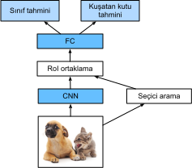

# Bölge tabanlı CNN'ler (R-CNN'ler)
:label:`sec_rcnn`

:numref:`sec_ssd` içinde açıklanan tek atışta çoklu kutu algılamanın yanı sıra, bölge tabanlı CNN'ler veya CNN özniteliklerine (R-CNN) sahip bölgeler de nesne algılamaya :cite:`Girshick.Donahue.Darrell.ea.2014` derin öğrenmeyi uygulamanın öncü yaklaşımları arasında yer almaktadır. Bu bölümde R-CNN ve onun iyileştirilmiş serilerini tanıtacağız: Hızlı R-CNN :cite:`Girshick.2015`, daha hızlı R-CNN :cite:`Ren.He.Girshick.ea.2015` ve maske R-CNN :cite:`He.Gkioxari.Dollar.ea.2017`. Sınırlı alan nedeniyle, sadece bu modellerin tasarımına odaklanacağız. 

## R-CNN'ler

*R-CNN* ilk olarak girdi imgesinden birçok (örneğin, 2000) *bölge önerisi* ayıklar (örneğin, çapa kutuları bölge önerileri olarak da kabul edilebilir), sınıflarını ve kuşatan kutuları (örneğin, ofsetler) etiketler :cite:`Girshick.Donahue.Darrell.ea.2014`. Sonra bir CNN, her bölge önerisi üzerinde ileri yaymayı gerçekleştirmek için öznitelikleri kullanır. Sonrasında, her bölge önerisinin öznitelikleri, bu bölge önerisinin sınıfını ve kuşatan kutusunu tahmin etmek için kullanılır. 


:label:`fig_r-cnn`

:numref:`fig_r-cnn` R-CNN modelini gösterir. Daha somut olarak, R-CNN aşağıdaki dört adımdan oluşur: 

1. :cite:`Uijlings.Van-De-Sande.Gevers.ea.2013` girdi imgesinden birden fazla yüksek kaliteli bölge önerisi ayıklamak için *seçici arama* gerçekleştirin. Önerilen bu bölgeler genellikle farklı şekil ve boyutlarda çoklu ölçeklerde seçilir. Her bölge önerisi bir sınıf ve bir gerçek referans değeri kuşatan kutu ile etiketlenecektir.
1. Önceden eğitilmiş bir CNN seçin ve çıktı katmanından önce budayın. Her bölge önerisini ağın gerektirdiği girdi boyutuna yeniden boyutlandırın ve bölge önerisi için ayıklanan öznitelikleri ileri yayma yoluyla çıktılayın. 
1. Her bölge önerisinin çıkarılan özniteliklerini ve etiketlenmiş sınıfını örnek olarak ele alın. Her destek vektör makinesinin, örneğin belirli bir sınıfı içerip içermediğini ayrı ayrı belirlediği nesneleri sınıflandırmak için birden fazla destek vektör makinesini eğitin.
1. Örnek olarak her bölge önerisinin ayıklanan öznitelikleri ve etiketli kuşatan kutusunu alın. Gerçek referans değer kuşatan kutuyu tahmin etmek için doğrusal bağlanım modelini eğitin.

R-CNN modeli imge özniteliklerini etkili bir şekilde ayıklamak için önceden eğitilmiş CNN'ler kullansa da yavaştır. Tek bir girdi imgesinden binlerce bölge önerisini seçtiğimizi düşünün: Bu nesne algılamayı gerçekleştirmek için binlerce CNN ileri yaymasını gerektirir. Bu devasa bilgi işlem yükünden dolayı, R-CNN'lerin gerçek dünyadaki uygulamalarda yaygın olarak kullanılmasını mümkün değildir. 

## Hızlı R-CNN

Bir R-CNN'nin ana performans darboğazı, her bölge önerisi için hesaplamayı paylaşmadan bağımsız CNN ileri yaymasında yatmaktadır. Bu bölgelerde genellikle çakışmalar olduğundan, bağımsız öznitelik ayıklamaları çok fazla tekrarlanan hesaplamaya yol açar. *Hızlı R-CNN*'nin R-CNN'den sağladığı en önemli iyileştirmelerden biri, CNN ileri yaymasının yalnızca tüm imge üzerinde :cite:`Girshick.2015` gerçekleştirilmesidir.


:label:`fig_fast_r-cnn`

:numref:`fig_fast_r-cnn` hızlı R-CNN modelini açıklar. Başlıca hesaplamaları şöyledir: 

1. R-CNN ile karşılaştırıldığında, hızlı R-CNN'de, öznitelik ayıklama için CNN'nin girdisi, bireysel bölge önerilerinden ziyade tüm imgedir. Dahası, bu CNN eğitilebilir. Bir girdi imgesi göz önüne alındığında, CNN çıktısının şekli $1 \times c \times h_1  \times w_1$ olsun.
1. Seçici aramanın $n$ bölge önerileri oluşturduğunu varsayalım. Bu bölge önerileri (farklı şekillerde) CNN çıktısındaki ilgi bölgelerini (farklı şekillerdeki) işaretler. Daha sonra kolayca birleştirilebilmesi için ilgili bu bölgelerin aynı şekle sahip öznitelikleri ayıklanır (yükseklik $h_2$ ve genişlik $w_2$ diye belirtilir). Bunu başarmak için hızlı R-CNN, *ilgili bölge (RoI) ortaklama* katmanı sunar: CNN çıktısı ve bölge önerileri bu katmana girilir ve tüm bölge önerileri için daha da ayıklanmış $n \times c \times h_2 \times w_2$ şekilli bitiştirilmiş öznitelikleri ortaya çıkarır.
1. Tam bağlı bir katman kullanarak, bitiştirilmiş öznitelikleri $n \times d$ şeklinde bir çıktıya dönüştürün; burada $d$ model tasarımına bağlıdır.
1. $n$ bölge önerilerinin her biri için sınıfı ve kuşatan kutuyu tahmin edin. Daha somut olarak, sınıf ve kuşatan kutu tahmininde, tam bağlı katman çıktısını $n \times q$ şeklinde ($q$ sınıf sayısıdır) ve $n \times 4$ şeklinde çıktıya dönüştürün. Sınıf tahmini softmaks bağlanım kullanır.

Hızlı R-CNN'de önerilen ilgi bölgesi ortaklama katmanı :numref:`sec_pooling` içinde tanıtılan ortaklama katmanından farklıdır. Ortaklama katmanında, ortaklama penceresinin, dolgunun ve adımın boyutlarını belirterek çıktı şeklini dolaylı olarak kontrol ediyoruz. Buna karşılık, doğrudan ilgi bölgesi ortaklama katmanı çıktı şeklini belirtebilirsiniz. 

Örneğin, her bölge için çıktı yüksekliğini ve genişliğini sırasıyla $h_2$ ve $w_2$ olarak belirtelim. $h \times w$ şeklindeki herhangi bir ilgi bölgesinin penceresi için, bu pencere, her alt pencerenin şekli yaklaşık $(h/h_2) \times (w/w_2)$ olduğu $h_2 \times w_2$ bir alt pencere ızgarasına ayrılmıştır. Pratikte, herhangi bir alt pencerenin yüksekliği ve genişliği tamsayıya yuvarlanır ve en büyük eleman, alt pencerenin çıktısı olarak kullanılacaktır. Bu nedenle, ilgi bölgeleri farklı şekillere sahip olsa bile ilgi bölgesi ortaklama katmanı aynı şekle sahip öznitelikler ayıklayabilir. 

Açıklayıcı bir örnek olarak, :numref:`fig_roi` içinde, $4 \times 4$ girdisinde sol üst $3\times 3$ ilgi bölgesi seçilir. Bu ilgi bölgesinde $2\times 2$'lik çıktı elde etmek için bir $2\times 2$ ilgi bölgesi ortaklama katmanı kullanıyoruz. Dört bölünmüş alt pencerenin her birinin 0, 1, 4 ve 5 (5 maksimumdur) öğelerini içerdiğini unutmayın; 2 ve 6 (6 maksimumdur); 8 ve 9 (9 maksimumdur) ve 10. 


:label:`fig_roi`

Aşağıda ilgi bölgesi ortaklama katmanı hesaplanması gösterilmektedir. CNN çıkarılan özniteliklerin, `X`'in, yüksekliğinin ve genişliğinin, her ikisinin de 4 olduğunu ve yalnızca tek bir kanal olduğunu varsayalım.

```{.python .input}
from mxnet import np, npx

npx.set_np()

X = np.arange(16).reshape(1, 1, 4, 4)
X
```

```{.python .input}
#@tab pytorch
import torch
import torchvision

X = torch.arange(16.).reshape(1, 1, 4, 4)
X
```

Girdi imgesinin hem yüksekliğinin hem de genişliğinin  40 piksel olduğunu ve seçici aramanın bu imgede iki bölge önerisi oluşturduğunu varsayalım. Her bölge önerisi beş öğe olarak ifade edilir: Nesne sınıfını, ardından, sol üst ve sağ alt köşelerinin $(x, y)$-koordinatları takip eder.

```{.python .input}
rois = np.array([[0, 0, 0, 20, 20], [0, 0, 10, 30, 30]])
```

```{.python .input}
#@tab pytorch
rois = torch.Tensor([[0, 0, 0, 20, 20], [0, 0, 10, 30, 30]])
```

`X`'in yüksekliği ve genişliği, girdi imgesinin yüksekliğinin ve genişliğinin $1/10$'u olduğu için, iki bölge önerisinin koordinatları belirtilen `spatial_scale` argümanına göre 0.1 ile çarpılır. Böylece iki ilgi bölgesi `X` üzerinde sırasıyla `X[:, :, 0:3, 0:3]` ve `X[:, :, 1:4, 0:4]` olarak işaretlenmiştir. Son olarak $2\times 2$'lık ilgi bölgesi ortaklamasında, her bir ilgi bölgesi, aynı şekilde $2\times 2$ olan öznitelikleri daha fazla çıkarmak için bir alt pencere ızgarasına bölünür. 

```{.python .input}
npx.roi_pooling(X, rois, pooled_size=(2, 2), spatial_scale=0.1)
```

```{.python .input}
#@tab pytorch
torchvision.ops.roi_pool(X, rois, output_size=(2, 2), spatial_scale=0.1)
```

## Daha Hızlı R-CNN

Nesne algılamada daha doğru olması için hızlı R-CNN modeli genellikle seçici aramada çok sayıda bölge teklifi üretmelidir. Doğruluk kaybı olmadan bölge önerilerini azaltmak için *daha hızlı R-CNN* seçici aramayı *bölge önerisi ağı* :cite:`Ren.He.Girshick.ea.2015` ile değiştirmeyi önermektedir. 


:label:`fig_faster_r-cnn`

:numref:`fig_faster_r-cnn` daha hızlı R-CNN modelini gösterir. Hızlı R-CNN ile karşılaştırıldığında, daha hızlı R-CNN yalnızca bölge önerisi yöntemini seçici aramadan bölge önerisi ağına değiştirir. Modelin geri kalanı değişmeden kalır. Bölge önerisi ağı aşağıdaki adımlarla çalışır: 

1. CNN çıktısını $c$ kanal ile yeni bir çıktıya dönüştürmek için 1 dolgulu $3\times 3$ evrişimli katman kullanın. Bu şekilde, CNN çıkarılan öznitelik haritalarının uzamsal boyutları boyunca her birimi $c$ uzunluğunda yeni bir öznitelik vektörü alır.
1. Öznitelik haritalarının her pikselinde ortalanan, farklı ölçeklerde ve en boy oranlarında çoklu çapa kutusu oluşturun ve bunları etiketleyin.
1. Her bir çapa kutusunun ortasındaki $c$ uzunluklu öznitelik vektörünü kullanarak, bu çapa kutusu için ikili sınıfı (arkaplan veya nesneler) ve kuşatan kutuyu tahmin edin.
1. Tahmin edilen sınıfları nesneler olan tahmin edilen kuşatan kutuları düşünün. Maksimum olmayanı bastırmayı kullanarak örtüşen sonuçları kaldırın. Nesneler için kalan tahmini kuşatan kutuları, ilgi bölgesi ortaklama katmanının ihtiyaç duyduğu bölge önerileridir.

Daha hızlı R-CNN modelinin bir parçası olarak, bölge önerisi ağının modelin geri kalanı ile birlikte eğitildiğini belirtmek gerekir. Başka bir deyişle, daha hızlı R-CNN'nin amaç işlevi yalnızca nesne algılamada sınıf ve kuşatan kutu tahminini değil, aynı zamanda bölge önerisi ağındaki çapa kutularının ikili sınıfı ve kuşatan kutu tahminini de içerir. Uçtan uca eğitim sonucunda bölge önerisi ağı, verilerden öğrenilen daha az sayıda bölge teklifiyle nesne algılamada doğru kalabilmek için yüksek kaliteli bölge tekliflerinin nasıl üretileceğini öğrenir. 

## Maske R-CNN

Eğitim veri kümesinde, nesnenin piksel düzeyindeki konumları imgelerde de etiketlenmişse, *mask R-CNN*, nesne algılamanın :cite:`He.Gkioxari.Dollar.ea.2017` doğruluğunu daha da geliştirmek için bu tür ayrıntılı etiketleri etkili bir şekilde kullanabilir. 


:label:`fig_mask_r-cnn`

:numref:`fig_mask_r-cnn` içinde gösterildiği gibi, maske R-CNN daha hızlı R-CNN'den devşirilmiştir. Özellikle, maske R-CNN ilgi bölgesi ortaklama katmanını *ilgi bölgesi (RoI) hizalama* katmanı ile değiştirir. 
Bu ilgi bölgesi hizalama katmanı, öznitellik haritalarındaki uzamsal bilgileri korumak için ikili aradeğerleme kullanır; bu da piksel düzeyinde tahmin için daha uygundur. Bu katmanın çıktısı, tüm ilgi bölgeleri için aynı şekildeki öznitelik haritaları içerir. Bunlar, yalnızca her bir ilgi bölgesi için sınıfı ve kuşatan kutuyu değil, aynı zamanda ek bir tam evrişimli ağ aracılığıyla nesnenin piksel düzeyinde konumunu da tahmin etmek için kullanılırlar. Bir imgenin piksel düzeyinde anlamını tahmin etmek için tam evrişimli bir ağ kullanma hakkında daha fazla ayrıntı, bu ünitenin sonraki bölümlerinde sağlanacaktır. 

## Özet

* R-CNN, girdi imgesinden birçok bölge önerisi çıkarır, özniteliklerini ayıklamak için her bölge önerisi üzerinde ileri yaymayı gerçekleştirmek için bir CNN kullanır, ardından bu öznitelikleri bu bölge önerisinin sınıfını ve kuşatan kutuyu tahmin etmek için kullanır.
* Hızlı R-CNN,  R-CNN'den önemli iyileştirmelerinden biri CNN ileri yaymasının sadece tüm imge üzerinde gerçekleştirilir olmasıdır. Aynı zamanda ilgi bölgesi ortaklama katmanını takdim eder, böylece aynı şekle sahip öznitelikler daha farklı şekillere sahip ilgi bölgeleri için çıkartılabilir.
* Daha hızlı R-CNN, hızlı R-CNN'de kullanılan seçici aramayı ortak eğitilmiş bir bölge öneri ağıyla değiştirir, böylece eski, daha az sayıda bölge önerisiyle nesne algılamada doğru kalabilir.
* Daha hızlı R-CNN'e dayanan maske R-CNN, nesne algılamanın doğruluğunu daha da artırmak için piksel düzeyinde etiketlerden yararlanmak için ek olarak tam evrişimli bir ağ sunar.

## Alıştırmalar

1. Nesne algılamasını, kuşatan kutuları ve sınıf olasılıklarını tahmin etme gibi, tek bir bağlanım sorunu olarak çerçeveleyebilir miyiz? YOLO model :cite:`Redmon.Divvala.Girshick.ea.2016` tasarımına başvurabilirsiniz.
1. Tek atışta çoklu kutu algılamayı bu bölümde tanıtılan yöntemlerle karşılaştırın. Büyük farklılıklar nelerdir? :cite:`Zhao.Zheng.Xu.ea.2019`'deki Şekil 2'ye başvurabilirsiniz.

:begin_tab:`mxnet`
[Tartışmalar](https://discuss.d2l.ai/t/374)
:end_tab:

:begin_tab:`pytorch`
[Tartışmalar](https://discuss.d2l.ai/t/1409)
:end_tab:
