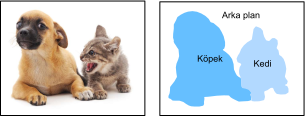

# Anlamsal Bölümleme ve Veri Kümesi
:label:`sec_semantic_segmentation`

:numref:`sec_bbox`—:numref:`sec_rcnn`'te nesne algılama görevleri tartışılırken, imgelerdeki nesneleri etiketlemek ve tahmin etmek için dikdörtgen kuşatan kutular kullanıldı. Bu bölümde, bir imgenin farklı anlamsal sınıflara ait bölgelere nasıl bölüneceğine odaklanan *anlamsal bölümleme* sorununu tartışacaktır. Nesne algılamasından farklı olarak, anlamsal bölümleme piksel düzeyinde imgelerde ne olduğunu tanır ve anlar: Anlamsal bölgelerin etiketlenmesi ve tahmini piksel düzeydedir. :numref:`fig_segmentation`, anlamsal bölümlemede imgenin köpek, kedi ve arkaplanının etiketlerini gösterir. Nesne algılama ile karşılaştırıldığında, anlamsal bölümlemede etiketlenmiş piksel düzeyinde sınırlar açıkça daha ince tanelidir. 


:label:`fig_segmentation`

## Görüntü Bölümleme ve Örnek Bölümleme

Bilgisayarla görme alanında anlamsal bölümlemeye benzer iki önemli görev vardır, yani imge bölümleme ve örnek bölümleme. Onları anlamsal bölümlemeden kısaca aşağıdaki gibi ayırt edeceğiz. 

* *İmge bölümleme* bir imgeyi birkaç kurucu bölgeye böler. Bu tür bir soruna yönelik yöntemler genellikle imgedeki pikseller arasındaki korelasyonu kullanır. Eğitim sırasında imge pikselleri hakkında etiket bilgisine ihtiyaç duymaz ve bölümlere ayrılmış bölgelerin tahmin sırasında elde etmeyi umduğumuz anlamsal bilgilere sahip olacağını garanti edemez. İmgeyi :numref:`fig_segmentation`'te girdi olarak alarak, imge bölümleme köpeği iki bölgeye bölebilir: Biri ağırlıklı olarak siyah olan ağız ve gözleri kaplar, diğeri ise esas olarak sarı olan vücudun geri kalanını kaplar.
* *Örnek bölümleme* aynı zamanda *eşzamanlı algılama ve bölümleme* olarak da adlandırılır. İmgedeki her nesne örneğinin piksel düzeyinde bölgelerinin nasıl tanınacağını inceler. Anlamsal bölümlemeden farklı olarak, örnek bölümlemenin yalnızca anlamı değil, aynı zamanda farklı nesne örneklerini de ayırt etmesi gerekir.Örneğin, görüntüde iki köpek varsa, örnek bölümlemenin bir pikselin iki köpekten hangisine ait olduğunu ayırt etmesi gerekir.

## Pascal VOC2012 Semantik Segmentasyon Veri Kümesi

[**En önemli anlamsal bölümleme veri kümesinin üzerinde [Pascal VOC2012](http://host.robots.ox.ac.uk/pascal/VOC/voc2012/).**] Aşağıda, bu veri kümesine bir göz atacağız.

```{.python .input}
%matplotlib inline
from d2l import mxnet as d2l
from mxnet import gluon, image, np, npx
import os

npx.set_np()
```

```{.python .input}
#@tab pytorch
%matplotlib inline
from d2l import torch as d2l
import torch
import torchvision
import os
```

Veri kümesinin tar dosyası yaklaşık 2 GB'dir, bu nedenle dosyayı indirmek biraz zaman alabilir. Ayıklanan veri kümesi `../data/VOCdevkit/VOC2012` adresinde bulunur.

```{.python .input}
#@tab all
#@save
d2l.DATA_HUB['voc2012'] = (d2l.DATA_URL + 'VOCtrainval_11-May-2012.tar',
                           '4e443f8a2eca6b1dac8a6c57641b67dd40621a49')

voc_dir = d2l.download_extract('voc2012', 'VOCdevkit/VOC2012')
```

`../data/VOCdevkit/VOC2012` yoluna girdikten sonra, veri kümesinin farklı bileşenlerini görebiliriz. `ImageSets/Segmentation` yolu, eğitim ve test örneklerini belirten metin dosyaları içerirken, `JPEGImages` ve `SegmentationClass` yolları sırasıyla her örnek için giriş imgesünü ve etiketini depolar. Buradaki etiket aynı zamanda etiketlenmiş giriş imgesüyle aynı boyutta imge biçimindedir. Ayrıca, herhangi bir etiket imgesünde aynı renge sahip pikseller aynı anlamsal sınıfa aittir. Aşağıdakiler, `read_voc_images` işlevini [**tüm giriş imgelerini ve etiketlerini belleğe okuyun**] için tanımlar.

```{.python .input}
#@save
def read_voc_images(voc_dir, is_train=True):
    """Read all VOC feature and label images."""
    txt_fname = os.path.join(voc_dir, 'ImageSets', 'Segmentation',
                             'train.txt' if is_train else 'val.txt')
    with open(txt_fname, 'r') as f:
        images = f.read().split()
    features, labels = [], []
    for i, fname in enumerate(images):
        features.append(image.imread(os.path.join(
            voc_dir, 'JPEGImages', f'{fname}.jpg')))
        labels.append(image.imread(os.path.join(
            voc_dir, 'SegmentationClass', f'{fname}.png')))
    return features, labels

train_features, train_labels = read_voc_images(voc_dir, True)
```

```{.python .input}
#@tab pytorch
#@save
def read_voc_images(voc_dir, is_train=True):
    """Read all VOC feature and label images."""
    txt_fname = os.path.join(voc_dir, 'ImageSets', 'Segmentation',
                             'train.txt' if is_train else 'val.txt')
    mode = torchvision.io.image.ImageReadMode.RGB
    with open(txt_fname, 'r') as f:
        images = f.read().split()
    features, labels = [], []
    for i, fname in enumerate(images):
        features.append(torchvision.io.read_image(os.path.join(
            voc_dir, 'JPEGImages', f'{fname}.jpg')))
        labels.append(torchvision.io.read_image(os.path.join(
            voc_dir, 'SegmentationClass' ,f'{fname}.png'), mode))
    return features, labels

train_features, train_labels = read_voc_images(voc_dir, True)
```

We [**draw the first five input images and their labels**]. Etiket imgelerinde, beyaz ve siyah sırasıyla kenarlıkları ve arka planı temsil ederken, diğer renkler farklı sınıflara karşılık gelir.

```{.python .input}
n = 5
imgs = train_features[0:n] + train_labels[0:n]
d2l.show_images(imgs, 2, n);
```

```{.python .input}
#@tab pytorch
n = 5
imgs = train_features[0:n] + train_labels[0:n]
imgs = [img.permute(1,2,0) for img in imgs]
d2l.show_images(imgs, 2, n);
```

Ardından, bu veri kümesindeki tüm etiketler için [**RGB renk değerlerini ve sınıf adları**] numaralandırırız.

```{.python .input}
#@tab all
#@save
VOC_COLORMAP = [[0, 0, 0], [128, 0, 0], [0, 128, 0], [128, 128, 0],
                [0, 0, 128], [128, 0, 128], [0, 128, 128], [128, 128, 128],
                [64, 0, 0], [192, 0, 0], [64, 128, 0], [192, 128, 0],
                [64, 0, 128], [192, 0, 128], [64, 128, 128], [192, 128, 128],
                [0, 64, 0], [128, 64, 0], [0, 192, 0], [128, 192, 0],
                [0, 64, 128]]

#@save
VOC_CLASSES = ['background', 'aeroplane', 'bicycle', 'bird', 'boat',
               'bottle', 'bus', 'car', 'cat', 'chair', 'cow',
               'diningtable', 'dog', 'horse', 'motorbike', 'person',
               'potted plant', 'sheep', 'sofa', 'train', 'tv/monitor']
```

Yukarıda tanımlanan iki sabit ile [**etiketteki her piksel için sınıf dizinini bulabiliriz**]. Yukarıdaki RGB renk değerlerinden sınıf indekslerine eşleştirmeyi oluşturmak için `voc_colormap2label` işlevini ve bu Pascal VOC2012 veri kümesindeki herhangi bir RGB değerlerini sınıf dizinleriyle eşlemek için `voc_label_indices` işlevini tanımlıyoruz.

```{.python .input}
#@save
def voc_colormap2label():
    """Build the mapping from RGB to class indices for VOC labels."""
    colormap2label = np.zeros(256 ** 3)
    for i, colormap in enumerate(VOC_COLORMAP):
        colormap2label[
            (colormap[0] * 256 + colormap[1]) * 256 + colormap[2]] = i
    return colormap2label

#@save
def voc_label_indices(colormap, colormap2label):
    """Map any RGB values in VOC labels to their class indices."""
    colormap = colormap.astype(np.int32)
    idx = ((colormap[:, :, 0] * 256 + colormap[:, :, 1]) * 256
           + colormap[:, :, 2])
    return colormap2label[idx]
```

```{.python .input}
#@tab pytorch
#@save
def voc_colormap2label():
    """Build the mapping from RGB to class indices for VOC labels."""
    colormap2label = torch.zeros(256 ** 3, dtype=torch.long)
    for i, colormap in enumerate(VOC_COLORMAP):
        colormap2label[
            (colormap[0] * 256 + colormap[1]) * 256 + colormap[2]] = i
    return colormap2label

#@save
def voc_label_indices(colormap, colormap2label):
    """Map any RGB values in VOC labels to their class indices."""
    colormap = colormap.permute(1, 2, 0).numpy().astype('int32')
    idx = ((colormap[:, :, 0] * 256 + colormap[:, :, 1]) * 256
           + colormap[:, :, 2])
    return colormap2label[idx]
```

[**Örnek**], ilk örnek imgede, uçağın ön kısmının sınıf indeksi 1 iken arka plan indeksi 0 olur.

```{.python .input}
#@tab all
y = voc_label_indices(train_labels[0], voc_colormap2label())
y[105:115, 130:140], VOC_CLASSES[1]
```

### Veri Önişleme

:numref:`sec_alexnet`—:numref:`sec_googlenet`'te olduğu gibi önceki deneylerde imgeler modelin gerekli giriş şekline uyacak şekilde yeniden ölçeklendirilir. Ancak, anlamsal bölümlemeda, bunun yapılması, öngörülen piksel sınıflarının giriş imgesünün orijinal şekline geri ölçeklenmesini gerektirir. Bu tür yeniden ölçeklendirme, özellikle farklı sınıflara sahip segmentli bölgeler için yanlış olabilir. Bu sorunu önlemek için, imgeyü yeniden ölçekleme yerine *sabit* şekle kırpıyoruz. Özellikle, [**imge büyütme rasgele kırpma kullanarak, giriş imgesünün ve etiketinin aynı alanını keseriz**].

```{.python .input}
#@save
def voc_rand_crop(feature, label, height, width):
    """Randomly crop both feature and label images."""
    feature, rect = image.random_crop(feature, (width, height))
    label = image.fixed_crop(label, *rect)
    return feature, label
```

```{.python .input}
#@tab pytorch
#@save
def voc_rand_crop(feature, label, height, width):
    """Randomly crop both feature and label images."""
    rect = torchvision.transforms.RandomCrop.get_params(
        feature, (height, width))
    feature = torchvision.transforms.functional.crop(feature, *rect)
    label = torchvision.transforms.functional.crop(label, *rect)
    return feature, label
```

```{.python .input}
imgs = []
for _ in range(n):
    imgs += voc_rand_crop(train_features[0], train_labels[0], 200, 300)
d2l.show_images(imgs[::2] + imgs[1::2], 2, n);
```

```{.python .input}
#@tab pytorch
imgs = []
for _ in range(n):
    imgs += voc_rand_crop(train_features[0], train_labels[0], 200, 300)

imgs = [img.permute(1, 2, 0) for img in imgs]
d2l.show_images(imgs[::2] + imgs[1::2], 2, n);
```

### [**Özel Anlamsal Segmentasyon Veri Kümesi Sınıfı**]

Yüksek düzey API'ler tarafından sağlanan `Dataset` sınıfını devralarak özel bir anlamsal bölümleme veri kümesi sınıfı `VOCSegDataset` tanımlıyoruz. `__getitem__` işlevini uygulayarak, veri kümesindeki `idx` olarak dizinlenmiş giriş imgesüne ve bu imgedeki her pikselin sınıf dizinine keyfi olarak erişebiliriz. Veri kümelerindeki bazı imgeler rasgele kırpma çıktı boyutundan daha küçük bir boyuta sahip olduğundan, bu örnekler özel bir `filter` işlevi tarafından filtrelenir. Buna ek olarak, giriş imgelerinin üç RGB kanalının değerlerini standartlaştırmak için `normalize_image` işlevini de tanımlıyoruz.

```{.python .input}
#@save
class VOCSegDataset(gluon.data.Dataset):
    """A customized dataset to load the VOC dataset."""
    def __init__(self, is_train, crop_size, voc_dir):
        self.rgb_mean = np.array([0.485, 0.456, 0.406])
        self.rgb_std = np.array([0.229, 0.224, 0.225])
        self.crop_size = crop_size
        features, labels = read_voc_images(voc_dir, is_train=is_train)
        self.features = [self.normalize_image(feature)
                         for feature in self.filter(features)]
        self.labels = self.filter(labels)
        self.colormap2label = voc_colormap2label()
        print('read ' + str(len(self.features)) + ' examples')

    def normalize_image(self, img):
        return (img.astype('float32') / 255 - self.rgb_mean) / self.rgb_std

    def filter(self, imgs):
        return [img for img in imgs if (
            img.shape[0] >= self.crop_size[0] and
            img.shape[1] >= self.crop_size[1])]

    def __getitem__(self, idx):
        feature, label = voc_rand_crop(self.features[idx], self.labels[idx],
                                       *self.crop_size)
        return (feature.transpose(2, 0, 1),
                voc_label_indices(label, self.colormap2label))

    def __len__(self):
        return len(self.features)
```

```{.python .input}
#@tab pytorch
#@save
class VOCSegDataset(torch.utils.data.Dataset):
    """A customized dataset to load the VOC dataset."""

    def __init__(self, is_train, crop_size, voc_dir):
        self.transform = torchvision.transforms.Normalize(
            mean=[0.485, 0.456, 0.406], std=[0.229, 0.224, 0.225])
        self.crop_size = crop_size
        features, labels = read_voc_images(voc_dir, is_train=is_train)
        self.features = [self.normalize_image(feature)
                         for feature in self.filter(features)]
        self.labels = self.filter(labels)
        self.colormap2label = voc_colormap2label()
        print('read ' + str(len(self.features)) + ' examples')

    def normalize_image(self, img):
        return self.transform(img.float() / 255)

    def filter(self, imgs):
        return [img for img in imgs if (
            img.shape[1] >= self.crop_size[0] and
            img.shape[2] >= self.crop_size[1])]

    def __getitem__(self, idx):
        feature, label = voc_rand_crop(self.features[idx], self.labels[idx],
                                       *self.crop_size)
        return (feature, voc_label_indices(label, self.colormap2label))

    def __len__(self):
        return len(self.features)
```

### [**Veri Kümesi Okuma**]

Eğitim seti ve test setinin örneklerini oluşturmak için özel `VOCSegDatase`t sınıfını kullanıyoruz. Rastgele kırpılmış imgelerin çıkış şeklinin $320\times 480$ olduğunu belirttiğimizi varsayalım. Aşağıda, eğitim setinde ve test setinde tutulan örneklerin sayısını imgeleyebiliriz.

```{.python .input}
#@tab all
crop_size = (320, 480)
voc_train = VOCSegDataset(True, crop_size, voc_dir)
voc_test = VOCSegDataset(False, crop_size, voc_dir)
```

Toplu iş boyutunu 64 olarak ayarlarken, eğitim kümesi için veri yineleyicisini tanımlarız. İlk mini batch şeklini yazdıralım. Görüntü sınıflandırması veya nesne algılamasından farklı olarak, buradaki etiketler üç boyutlu tensörlerdir.

```{.python .input}
batch_size = 64
train_iter = gluon.data.DataLoader(voc_train, batch_size, shuffle=True,
                                   last_batch='discard',
                                   num_workers=d2l.get_dataloader_workers())
for X, Y in train_iter:
    print(X.shape)
    print(Y.shape)
    break
```

```{.python .input}
#@tab pytorch
batch_size = 64
train_iter = torch.utils.data.DataLoader(voc_train, batch_size, shuffle=True,
                                    drop_last=True,
                                    num_workers=d2l.get_dataloader_workers())
for X, Y in train_iter:
    print(X.shape)
    print(Y.shape)
    break
```

### [**Her Şeyleri Bir Arada Yapıyor**]

Son olarak, Pascal VOC2012 anlamsal bölümleme veri kümesini indirmek ve okumak için aşağıdaki `load_data_voc` işlevini tanımlıyoruz. Hem eğitim hem de test veri kümeleri için veri yineleyicileri döndürür.

```{.python .input}
#@save
def load_data_voc(batch_size, crop_size):
    """Load the VOC semantic segmentation dataset."""
    voc_dir = d2l.download_extract('voc2012', os.path.join(
        'VOCdevkit', 'VOC2012'))
    num_workers = d2l.get_dataloader_workers()
    train_iter = gluon.data.DataLoader(
        VOCSegDataset(True, crop_size, voc_dir), batch_size,
        shuffle=True, last_batch='discard', num_workers=num_workers)
    test_iter = gluon.data.DataLoader(
        VOCSegDataset(False, crop_size, voc_dir), batch_size,
        last_batch='discard', num_workers=num_workers)
    return train_iter, test_iter
```

```{.python .input}
#@tab pytorch
#@save
def load_data_voc(batch_size, crop_size):
    """Load the VOC semantic segmentation dataset."""
    voc_dir = d2l.download_extract('voc2012', os.path.join(
        'VOCdevkit', 'VOC2012'))
    num_workers = d2l.get_dataloader_workers()
    train_iter = torch.utils.data.DataLoader(
        VOCSegDataset(True, crop_size, voc_dir), batch_size,
        shuffle=True, drop_last=True, num_workers=num_workers)
    test_iter = torch.utils.data.DataLoader(
        VOCSegDataset(False, crop_size, voc_dir), batch_size,
        drop_last=True, num_workers=num_workers)
    return train_iter, test_iter
```

## Özet

* Anlamsal bölümleme, imgeyü farklı anlamsal sınıflara ait bölgelere bölerek piksel düzeyinde bir imgede ne olduğunu tanır ve anlar.
* On en önemli anlamsal bölümleme veri kümesi Pascal VOC2012 olduğunu.
* Anlamsal bölümlemeda, girdi imgesü ve etiketi piksel üzerinde bire bir karşılık geldiğinden, girdi imgesü yeniden ölçeklenmek yerine rastgele sabit bir şekle kırpılır.

## Egzersizler

1. Özerk araçlarda ve tıbbi imge teşhislerinde anlamsal bölümleme nasıl uygulanabilir? Başka uygulamalar düşünebiliyor musun?
1. :numref:`sec_image_augmentation`'teki veri büyütme açıklamalarını hatırlayın. Görüntü sınıflandırmasında kullanılan imge büyütme yöntemlerinden hangisinin anlamsal bölümlemeda uygulanması mümkün olmayacaktır?

:begin_tab:`mxnet`
[Discussions](https://discuss.d2l.ai/t/375)
:end_tab:

:begin_tab:`pytorch`
[Discussions](https://discuss.d2l.ai/t/1480)
:end_tab:
