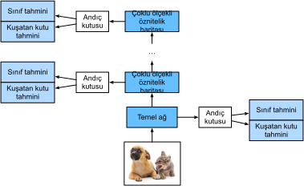

# Tek Atışta Çoklu Kutu Algılama
:label:`sec_ssd`

:numref:`sec_bbox`—-:numref:`sec_object-detection-dataset` içinde kuşatan kutuları, çapa kutularını, çoklu ölçekli nesne algılamayı ve nesne algılama için veri kümesini kullanıma sunduk. Şimdi bir nesne algılama modeli tasarlamak için bu tür arkaplan bilgisini kullanmaya hazırız: Tek atışta çoklu kutu algılama (SSD) :cite:`Liu.Anguelov.Erhan.ea.2016`. Bu model basittir, hızlıdır ve yaygın olarak kullanılmaktadır. Bu, çok büyük miktardaki nesne algılama modellerinden sadece biri olmasına rağmen, bu bölümdeki tasarım ilkeleri ve uygulama detaylarından bazıları diğer modeller için de geçerlidir. 

## Model

:numref:`fig_ssd`, tek atışta çoklu kutu algılama tasarımına genel bir bakış sağlar. Bu model esas olarak bir temel ağdan ve ardından birkaç çoklu ölçekli öznitelik haritası bloğundan oluşur. Temel ağ, girdi imgesinden öznitelikleri ayıklamak içindir, bu nedenle derin bir CNN kullanabilir. Örneğin, özgün tek atışta çoklu kutu algılama makalesi :cite:`Liu.Anguelov.Erhan.ea.2016` sınıflandırma katmanında önce budanmış bir VGG ağı benimser, her ne kadar ResNet de yaygın olarak kullanılır olsa da. Tasarımımız sayesinde, daha küçük nesneleri algılamak için daha fazla çapa kutusu üretmek için temel ağ çıktısının daha büyük öznitelik haritaları yapmasını sağlarız. Daha sonra, her çoklu ölçekli öznitelik harita bloğu önceki bloktan öznitelik haritalarının yüksekliğini ve genişliğini azaltır (örn. yarı yarıya) ve öznitelik haritalarının her biriminin girdi imgesindeki alıcı alanını artırmasını sağlar. 

:numref:`sec_multiscale-object-detection` içinde derin sinir ağları tarafından imgelerin katmansal gösterimleri yoluyla çoklu ölçekli nesne algılama tasarımını hatırlayın. :numref:`fig_ssd` içinde gösterilen üst kısmına daha yakın olan çoklu ölçekli öznitelik haritaları daha küçük olduğundan ancak daha büyük alıcı alanlara sahip olduklarından, daha az ama daha büyük nesneleri algılamak için uygundur. 

Özetle, temel ağı ve birkaç çoklu ölçekli öznitelik haritası bloğu aracılığıyla, tek atışta çoklu kutu algılama, farklı boyutlarda değişen sayıda çapa kutusu oluşturur ve bu çapa kutularının sınıflarını ve ofsetlerini (dolayısıyla kuşatan kutuları) tahmin ederek değişen boyuttaki nesneleri algılar; bu nedenle, bu bir çoklu ölçekli nesne algılama modelidir. 


:label:`fig_ssd`

Aşağıda, :numref:`fig_ssd` içindeki farklı blokların uygulama ayrıntılarını açıklayacağız. Başlangıç olarak, sınıf ve kuşatan kutu tahmininin nasıl uygulanacağını tartışıyoruz. 

### [**Sınıf Tahmin Katmanı**]

Nesne sınıflarının sayısı $q$ olsun. O zaman çapa kutuları $q+1$ sınıfa sahiptir, burada sınıf 0 arkaplandır. Bazı ölçeklerde, öznitelik haritalarının yüksekliği ve genişliğinin sırasıyla $h$ ve $w$ olduğunu varsayalım. $a$ tane çapa kutusu, bu öznitelik haritalarının her mekansal konumu ile merkezi olarak oluşturulduğunda, toplam $hwa$ çapa kutusunun sınıflandırılması gerekir. Bu durum genellikle büyük olasılıkla ağır parametreleme maliyetleri nedeniyle tam bağlı katmanlarla sınıflandırmayı olanaksız kılar. :numref:`sec_nin` içinde sınıfları tahmin etmek için evrişimli katman kanallarını nasıl kullandığımızı hatırlayın. Tek atışta çoklu kutu algılama, model karmaşıklığını azaltmak için aynı tekniği kullanır. 

Özellikle, sınıf tahmini katmanı, öznitelik haritalarının genişliğini veya yüksekliğini değiştirmeden bir evrişimli katman kullanır. Bu şekilde, öznitelik haritalarının aynı uzamsal boyutlarında (genişlik ve yükseklik) çıktılar ve girdiler arasında birebir karşılık olabilir. Daha somut olarak, çıktı öznitelik haritalarının kanallarının herhangi bir ($x$, $y$) uzamsal konumu, girdi öznitelik haritalarının ($x$, $y$) merkezli tüm çapa kutuları için sınıf tahminlerini temsil eder. Geçerli tahminler üretmek için, $a(q+1)$ çıktı kanalı olmalıdır; burada aynı uzamsal konum için $i(q+1) + j$ dizinli çıktı kanalı, $i$ ($0 \leq i < a$) çapa kutusu için $j$ ($0 \leq j \leq q$) sınıfının tahminini temsil eder. 

Aşağıda, sırasıyla `num_anchors` ve `num_classes` argümanları vasıtasıyla $a$'yı ve $q$'yu belirten böyle bir sınıf tahmini katmanı tanımlıyoruz. Bu katman, 1 dolgulu bir $3\times3$'lük evrişimli tabaka kullanır. Bu evrişimli katmanın girdisinin ve çıktısının genişliği ve yüksekliği değişmeden kalır.

```{.python .input}
%matplotlib inline
from d2l import mxnet as d2l
from mxnet import autograd, gluon, image, init, np, npx
from mxnet.gluon import nn

npx.set_np()

def cls_predictor(num_anchors, num_classes):
    return nn.Conv2D(num_anchors * (num_classes + 1), kernel_size=3,
                     padding=1)
```

```{.python .input}
#@tab pytorch
%matplotlib inline
from d2l import torch as d2l
import torch
import torchvision
from torch import nn
from torch.nn import functional as F

def cls_predictor(num_inputs, num_anchors, num_classes):
    return nn.Conv2d(num_inputs, num_anchors * (num_classes + 1),
                     kernel_size=3, padding=1)
```

### (**Kuşatan Kutu Tahmin Katmanı**)

Kuşatan kutu tahmin katmanının tasarımı, sınıf tahmini katmanınkine benzer. Tek fark, her bir çapa kutusu için çıktı sayısında yatmaktadır: Burada $q+1$ sınıfından ziyade dört ofset tahmin etmeliyiz.

```{.python .input}
def bbox_predictor(num_anchors):
    return nn.Conv2D(num_anchors * 4, kernel_size=3, padding=1)
```

```{.python .input}
#@tab pytorch
def bbox_predictor(num_inputs, num_anchors):
    return nn.Conv2d(num_inputs, num_anchors * 4, kernel_size=3, padding=1)
```

### [**Çoklu Ölçekler için Tahminleri Bitiştirme**]

Belirttiğimiz gibi, tek atışta çok kutulu algılama, çapa kutuları oluşturmak ve sınıflarını ve uzaklıklarını tahmin etmek için çoklu ölçekli öznitelik haritaları kullanır. Farklı ölçeklerde, öznitelik haritalarının şekilleri veya aynı birimde ortalanmış çapa kutularının sayısı değişebilir. Bu nedenle, farklı ölçeklerde tahmin çıktılarının şekilleri değişebilir. 

Aşağıdaki örnekte, aynı minigrup için `Y1` ve `Y2` olmak üzere iki farklı ölçekte öznitelik haritası oluşturuyoruz; burada `Y2`'nin yüksekliği ve genişliği `Y1`'inkinin yarısı kadardır. Örnek olarak sınıf tahminini ele alalım. Her birim için sırasıyla `Y1` ve `Y2`'teki 5 ve 3 çapa kutusunun oluşturulduğunu varsayalım. Nesne sınıflarının sayısının 10 olduğunu varsayalım. Öznitelik haritaları `Y1` ve `Y2` için sınıf tahmini çıktılarındaki kanal sayısı sırasıyla $5\times(10+1)=55$ ve $3\times(10+1)=33$'tür, burada (toplu iş boyutu, kanal sayısı, yükseklik, genişlik) her iki çıktının şeklidir.

```{.python .input}
def forward(x, block):
    block.initialize()
    return block(x)

Y1 = forward(np.zeros((2, 8, 20, 20)), cls_predictor(5, 10))
Y2 = forward(np.zeros((2, 16, 10, 10)), cls_predictor(3, 10))
Y1.shape, Y2.shape
```

```{.python .input}
#@tab pytorch
def forward(x, block):
    return block(x)

Y1 = forward(torch.zeros((2, 8, 20, 20)), cls_predictor(8, 5, 10))
Y2 = forward(torch.zeros((2, 16, 10, 10)), cls_predictor(16, 3, 10))
Y1.shape, Y2.shape
```

Gördüğümüz gibi, toplu iş boyutu hariç, diğer üç boyutun hepsinin farklı boyutları var. Daha verimli hesaplama için bu iki tahmin çıktısını bitiştirmek için bu tensörleri daha tutarlı bir formata dönüştüreceğiz. 

Kanal boyutunun aynı merkeze sahip çapa kutuları için tahminleri tuttuğunu unutmayın. İlk önce bu boyutu en içteki boyuta taşıyacağız. Toplu iş boyutu farklı ölçekler için aynı kaldığından, tahmin çıktısını (toplu iş boyutu, yükseklik $\times$ genişlik $\times$ kanal sayısı) şekline sahip iki boyutlu bir tensöre dönüştürebiliriz. O zaman bu tür çıktıları 1. boyut boyunca farklı ölçeklerde birleştiririz.

```{.python .input}
def flatten_pred(pred):
    return npx.batch_flatten(pred.transpose(0, 2, 3, 1))

def concat_preds(preds):
    return np.concatenate([flatten_pred(p) for p in preds], axis=1)
```

```{.python .input}
#@tab pytorch
def flatten_pred(pred):
    return torch.flatten(pred.permute(0, 2, 3, 1), start_dim=1)

def concat_preds(preds):
    return torch.cat([flatten_pred(p) for p in preds], dim=1)
```

Bu şekilde, `Y1` ve `Y2` kanal, yükseklik ve genişliklerde farklı boyutlara sahip olmasına rağmen, bu iki tahmin çıktısını aynı minigrup için iki farklı ölçekte birleştirebiliriz.

```{.python .input}
#@tab all
concat_preds([Y1, Y2]).shape
```

### [**Örnek Seyreltme Bloğu**]

Nesneleri çoklu ölçekte algılamak için girdi öznitelik haritalarının yüksekliğini ve genişliğini yarıya indiren aşağıdaki örnek seyreltme bloğu `down_sample_blk`'i tanımlarız. Aslında, bu blok :numref:`subsec_vgg-blocks` içindeki VGG bloklarının tasarımını uygular. Daha somut olarak, her bir örnek seyreltme bloğu, 1 dolgulu iki $3\times3$ evrişimli katmandan ve ardından 2 uzun adımlı bir $2\times2$ maksimum ortaklama katmanından oluşur. Bildiğimiz gibi, 1 dolgulu $3\times3$ evrişimli katmanlar, öznitelik haritalarının şeklini değiştirmez. Ancak, sonraki $2\times2$ maksimum ortaklama, girdi öznitelik haritalarının yüksekliğini ve genişliğini yarı yarıya azaltır. Bu örnek seyreltme bloğunun hem girdi hem de çıktı öznitelik haritaları için $1\times 2+(3-1)+(3-1)=6$ olduğundan, çıktıdaki her birim girdi üzerinde $6\times6$ alıcı alanına sahiptir. Bu nedenle, aşağı örnek seyreltme bloğu, çıktı öznitelik haritalarında her birim alıcı alanını genişletir.

```{.python .input}
def down_sample_blk(num_channels):
    blk = nn.Sequential()
    for _ in range(2):
        blk.add(nn.Conv2D(num_channels, kernel_size=3, padding=1),
                nn.BatchNorm(in_channels=num_channels),
                nn.Activation('relu'))
    blk.add(nn.MaxPool2D(2))
    return blk
```

```{.python .input}
#@tab pytorch
def down_sample_blk(in_channels, out_channels):
    blk = []
    for _ in range(2):
        blk.append(nn.Conv2d(in_channels, out_channels,
                             kernel_size=3, padding=1))
        blk.append(nn.BatchNorm2d(out_channels))
        blk.append(nn.ReLU())
        in_channels = out_channels
    blk.append(nn.MaxPool2d(2))
    return nn.Sequential(*blk)
```

Aşağıdaki örnekte, inşa edilmiş örnek seyreltme bloğumuz girdi kanallarının sayısını değiştirir ve girdi öznitelik haritalarının yüksekliğini ve genişliğini yarıya indirir.

```{.python .input}
forward(np.zeros((2, 3, 20, 20)), down_sample_blk(10)).shape
```

```{.python .input}
#@tab pytorch
forward(torch.zeros((2, 3, 20, 20)), down_sample_blk(3, 10)).shape
```

### [**Temel Ağ Bloğu**]

Temel ağ bloğu, girdi imgelerinden öznitelikleri ayıklamak için kullanılır. Basitlik açısından, her bloktaki kanal sayısını iki katına çıkaran üç örnek seyreltme bloğundan oluşan küçük bir temel ağ oluşturuyoruz. $256\times256$'lik girdi imgesi göz önüne alındığında, bu temel ağ bloğu $32 \times 32$ tane ($256/2^3=32$)'lik öznitelik haritası çıkarır.

```{.python .input}
def base_net():
    blk = nn.Sequential()
    for num_filters in [16, 32, 64]:
        blk.add(down_sample_blk(num_filters))
    return blk

forward(np.zeros((2, 3, 256, 256)), base_net()).shape
```

```{.python .input}
#@tab pytorch
def base_net():
    blk = []
    num_filters = [3, 16, 32, 64]
    for i in range(len(num_filters) - 1):
        blk.append(down_sample_blk(num_filters[i], num_filters[i+1]))
    return nn.Sequential(*blk)

forward(torch.zeros((2, 3, 256, 256)), base_net()).shape
```

### Tam Model

[**Tek atışta çoklu kutu algılama modeli beş bloktan oluşur.**] Her blok tarafından üretilen öznitelik haritaları, (i) çapa kutuları oluşturmak ve (ii) bu çapa kutularının sınıflarını ve ofsetlerini tahmin etmek için kullanılır. Bu beş blok arasında, ilki temel ağ bloğudur, ikincisinden dördüncüsüne kadarkiler örnek seyreltme bloklarıdır ve son blok hem yüksekliği hem de genişliği 1'e düşürmek için küresel maksimum ortaklama kullanır. Teknik olarak, ikincisinden beşinciye bütün bloklar, :numref:`fig_ssd` içindeki çoklu ölçekli öznitelik harita bloklarıdır.

```{.python .input}
def get_blk(i):
    if i == 0:
        blk = base_net()
    elif i == 4:
        blk = nn.GlobalMaxPool2D()
    else:
        blk = down_sample_blk(128)
    return blk
```

```{.python .input}
#@tab pytorch
def get_blk(i):
    if i == 0:
        blk = base_net()
    elif i == 1:
        blk = down_sample_blk(64, 128)
    elif i == 4:
        blk = nn.AdaptiveMaxPool2d((1,1))
    else:
        blk = down_sample_blk(128, 128)
    return blk
```

Şimdi her blok için [**ileri yaymayı tanımlıyoruz**]. İmge sınıflandırma görevlerinden farklı olarak, buradaki çıktılar arasında (i) CNN öznitelik haritaları `Y`, (ii) geçerli ölçekte `Y` kullanılarak oluşturulan çapa kutuları ve (iii) (`Y`'ye dayalı) bu çapa kutuları için tahmin edilen sınıfları ve uzaklıkları (ofsetleri) içerir.

```{.python .input}
def blk_forward(X, blk, size, ratio, cls_predictor, bbox_predictor):
    Y = blk(X)
    anchors = d2l.multibox_prior(Y, sizes=size, ratios=ratio)
    cls_preds = cls_predictor(Y)
    bbox_preds = bbox_predictor(Y)
    return (Y, anchors, cls_preds, bbox_preds)
```

```{.python .input}
#@tab pytorch
def blk_forward(X, blk, size, ratio, cls_predictor, bbox_predictor):
    Y = blk(X)
    anchors = d2l.multibox_prior(Y, sizes=size, ratios=ratio)
    cls_preds = cls_predictor(Y)
    bbox_preds = bbox_predictor(Y)
    return (Y, anchors, cls_preds, bbox_preds)
```

:numref:`fig_ssd` içinde, tepeye daha yakın olan çoklu ölçekli bir öznitelik harita bloğunun daha büyük nesneleri algılamak için olduğunu hatırlayın; bu nedenle, daha büyük çapa kutuları oluşturması gerekir. Yukarıdaki ileri yaymada, her çoklu ölçekli öznitelik harita bloğunda, çağrılan `multibox_prior` işlevinin `sizes` argümanı (:numref:`sec_anchor` içinde açıklanmıştır) vasıtasıyla iki ölçekli değerlerden oluşan bir liste geçeririz. Aşağıda, 0.2 ile 1.05 arasındaki aralık, beş bloktaki daha küçük ölçek değerlerini belirlemek için eşit olarak beş bölüme ayrılmıştır: 0.2, 0.37, 0.54, 0.71 ve 0.88. Daha sonra daha büyük ölçek değerleri $\sqrt{0.2 \times 0.37} = 0.272$, $\sqrt{0.37 \times 0.54} = 0.447$ vb. şeklinde verilir.

[~~Her blok için Hiper parametreler ~~]

```{.python .input}
#@tab all
sizes = [[0.2, 0.272], [0.37, 0.447], [0.54, 0.619], [0.71, 0.79],
         [0.88, 0.961]]
ratios = [[1, 2, 0.5]] * 5
num_anchors = len(sizes[0]) + len(ratios[0]) - 1
```

Şimdi [**tüm modeli**], `TinySSD`, aşağıdaki gibi tanımlayabiliriz.

```{.python .input}
class TinySSD(nn.Block):
    def __init__(self, num_classes, **kwargs):
        super(TinySSD, self).__init__(**kwargs)
        self.num_classes = num_classes
        for i in range(5):
            # Eşdeğer atama `self.blk_i = get_blk(i)`
            setattr(self, f'blk_{i}', get_blk(i))
            setattr(self, f'cls_{i}', cls_predictor(num_anchors, num_classes))
            setattr(self, f'bbox_{i}', bbox_predictor(num_anchors))

    def forward(self, X):
        anchors, cls_preds, bbox_preds = [None] * 5, [None] * 5, [None] * 5
        for i in range(5):
            # Burada `getattr(self, 'blk_%d' % i)` `self.blk_i`'ye ulaşır
            X, anchors[i], cls_preds[i], bbox_preds[i] = blk_forward(
                X, getattr(self, f'blk_{i}'), sizes[i], ratios[i],
                getattr(self, f'cls_{i}'), getattr(self, f'bbox_{i}'))
        anchors = np.concatenate(anchors, axis=1)
        cls_preds = concat_preds(cls_preds)
        cls_preds = cls_preds.reshape(
            cls_preds.shape[0], -1, self.num_classes + 1)
        bbox_preds = concat_preds(bbox_preds)
        return anchors, cls_preds, bbox_preds
```

```{.python .input}
#@tab pytorch
class TinySSD(nn.Module):
    def __init__(self, num_classes, **kwargs):
        super(TinySSD, self).__init__(**kwargs)
        self.num_classes = num_classes
        idx_to_in_channels = [64, 128, 128, 128, 128]
        for i in range(5):
            # Eşdeğer atama  `self.blk_i = get_blk(i)`
            setattr(self, f'blk_{i}', get_blk(i))
            setattr(self, f'cls_{i}', cls_predictor(idx_to_in_channels[i],
                                                    num_anchors, num_classes))
            setattr(self, f'bbox_{i}', bbox_predictor(idx_to_in_channels[i],
                                                      num_anchors))

    def forward(self, X):
        anchors, cls_preds, bbox_preds = [None] * 5, [None] * 5, [None] * 5
        for i in range(5):
            # Burada `getattr(self, 'blk_%d' % i)` `self.blk_i`'ye ulaşır
            X, anchors[i], cls_preds[i], bbox_preds[i] = blk_forward(
                X, getattr(self, f'blk_{i}'), sizes[i], ratios[i],
                getattr(self, f'cls_{i}'), getattr(self, f'bbox_{i}'))
        anchors = torch.cat(anchors, dim=1)
        cls_preds = concat_preds(cls_preds)
        cls_preds = cls_preds.reshape(
            cls_preds.shape[0], -1, self.num_classes + 1)
        bbox_preds = concat_preds(bbox_preds)
        return anchors, cls_preds, bbox_preds
```

$256 \times 256$'lik imgelerden oluşan `X` minigrubundan [**bir model örneği oluşturup ileri yaymayı gerçekleştirmek için kullanıyoruz**]. 

Bu bölümde daha önce gösterildiği gibi, ilk blok $32 \times 32$ öznitelik haritalarını çıkarır. İkinci ila dördüncü örnek seyreltme bloklarının yükseklik ve genişliği yarıya indirdiğini ve beşinci bloğun genel ortaklama kullandığını hatırlayın. Özellik haritalarının uzamsal boyutları boyunca her birim için 4 çapa kutusu oluşturulduğundan, beş ölçekli her imge için toplam $(32^2 + 16^2 + 8^2 + 4^2 + 1)\times 4 = 5444$ çapa kutusu oluşturulur.

```{.python .input}
net = TinySSD(num_classes=1)
net.initialize()
X = np.zeros((32, 3, 256, 256))
anchors, cls_preds, bbox_preds = net(X)

print('output anchors:', anchors.shape)
print('output class preds:', cls_preds.shape)
print('output bbox preds:', bbox_preds.shape)
```

```{.python .input}
#@tab pytorch
net = TinySSD(num_classes=1)
X = torch.zeros((32, 3, 256, 256))
anchors, cls_preds, bbox_preds = net(X)

print('output anchors:', anchors.shape)
print('output class preds:', cls_preds.shape)
print('output bbox preds:', bbox_preds.shape)
```

## Eğitim

Şimdi tek atışta çoklu kutu algılama modelini nesne algılama için nasıl eğiteceğimizi açıklayacağız. 

### Veri Kümesini Okuma ve Modeli İlkleme

Başlangıç olarak, :numref:`sec_object-detection-dataset` içinde açıklanan [**muz algılama veri kümesini okuyalım**].

```{.python .input}
#@tab all
batch_size = 32
train_iter, _ = d2l.load_data_bananas(batch_size)
```

Muz algılama veri kümesindeki tek bir sınıf var. Modeli tanımladıktan sonra (**parametrelerini ilklememiz ve optimizasyon algoritmasını tanımlamamız**) gerekir.

```{.python .input}
device, net = d2l.try_gpu(), TinySSD(num_classes=1)
net.initialize(init=init.Xavier(), ctx=device)
trainer = gluon.Trainer(net.collect_params(), 'sgd',
                        {'learning_rate': 0.2, 'wd': 5e-4})
```

```{.python .input}
#@tab pytorch
device, net = d2l.try_gpu(), TinySSD(num_classes=1)
trainer = torch.optim.SGD(net.parameters(), lr=0.2, weight_decay=5e-4)
```

### [**Kayıp ve Değerlendirme Fonksiyonlarını Tanımlama**]

Nesne algılaması iki tür kayba sahiptir. İlk kayıp, çapa kutularının sınıflarıyla ilgilidir: Hesaplama, imge sınıflandırması için kullandığımız çapraz entropi kayıp işlevini yeniden kullanabilir. İkinci kayıp pozitif (arkaplan olmayan) çapa kutularının ofsetlerini ile ilgilenir: Bu bir bağlanım problemidir. Bununla birlikte, bu bağlanım sorunu için, burada :numref:`subsec_normal_distribution_and_squared_loss` içinde açıklanan kare kaybı kullanmıyoruz. Bunun yerine, $L_1$ norm kaybını, tahmin ve gerçek referans değer arasındaki farkın mutlak değerini kullanıyoruz. Maske değişkeni `bbox_masks`, kayıp hesaplamasında negatif çapa kutularını ve geçersiz (dolgulu) çapa kutularını filtreler. Sonunda, model için yitim fonksiyonunu elde etmek için çapa kutusu sınıf kaybını ve çapa kutusu ofset kaybını toplarız.

```{.python .input}
cls_loss = gluon.loss.SoftmaxCrossEntropyLoss()
bbox_loss = gluon.loss.L1Loss()

def calc_loss(cls_preds, cls_labels, bbox_preds, bbox_labels, bbox_masks):
    cls = cls_loss(cls_preds, cls_labels)
    bbox = bbox_loss(bbox_preds * bbox_masks, bbox_labels * bbox_masks)
    return cls + bbox
```

```{.python .input}
#@tab pytorch
cls_loss = nn.CrossEntropyLoss(reduction='none')
bbox_loss = nn.L1Loss(reduction='none')

def calc_loss(cls_preds, cls_labels, bbox_preds, bbox_labels, bbox_masks):
    batch_size, num_classes = cls_preds.shape[0], cls_preds.shape[2]
    cls = cls_loss(cls_preds.reshape(-1, num_classes),
                   cls_labels.reshape(-1)).reshape(batch_size, -1).mean(dim=1)
    bbox = bbox_loss(bbox_preds * bbox_masks,
                     bbox_labels * bbox_masks).mean(dim=1)
    return cls + bbox
```

Sınıflandırma sonuçlarını değerlendirmek için doğruluğu kullanabiliriz. Ofsetler için kullanılan $L_1$ norm kaybı nedeniyle, tahmini kuşatan kutuları değerlendirmek için *ortalama mutlak hata* kullanıyoruz. Bu tahmin sonuçları, üretilen çapa kutularından ve bunlar için tahmin edilen ofsetlerden elde edilir.

```{.python .input}
def cls_eval(cls_preds, cls_labels):
    # Sınıf tahmini sonuçları son boyutta olduğundan, 
    # `argmax`'ın bu boyutu belirtmesi gerekiyor
    return float((cls_preds.argmax(axis=-1).astype(
        cls_labels.dtype) == cls_labels).sum())

def bbox_eval(bbox_preds, bbox_labels, bbox_masks):
    return float((np.abs((bbox_labels - bbox_preds) * bbox_masks)).sum())
```

```{.python .input}
#@tab pytorch
def cls_eval(cls_preds, cls_labels):
    # Sınıf tahmini sonuçları son boyutta olduğundan, 
    # `argmax`'ın bu boyutu belirtmesi gerekiyor
    return float((cls_preds.argmax(dim=-1).type(
        cls_labels.dtype) == cls_labels).sum())

def bbox_eval(bbox_preds, bbox_labels, bbox_masks):
    return float((torch.abs((bbox_labels - bbox_preds) * bbox_masks)).sum())
```

### [**Modeli Eğitme**]

Modelin eğitimini yaparken, çoklu ölçekli çapa kutuları (`anchors`) oluşturmamız ve ileri yaymada sınıflarını (`cls_preds`) ve ofsetleri (`bbox_preds`) tahmin etmemiz gerekir. Daha sonra `Y` etiket bilgisine dayanarak bu tür üretilen çapa kutularının sınıflarını (`cls_labels`) ve ofsetlerini (`bbox_labels`) etiketleriz. Son olarak, sınıfların ve ofsetlerin tahmini ve etiketlenmiş değerlerini kullanarak kayıp işlevini hesaplıyoruz. Özlü uygulamalar için, test veri kümesinin değerlendirilmesini burada atlıyoruz.

```{.python .input}
num_epochs, timer = 20, d2l.Timer()
animator = d2l.Animator(xlabel='epoch', xlim=[1, num_epochs],
                        legend=['class error', 'bbox mae'])
for epoch in range(num_epochs):
    # Eğitim doğruluğu toplamı, eğitim doğruluğu toplamında örnek sayısı, 
    # Mutlak hata toplamı, mutlak hata toplamında örnek sayısı
    metric = d2l.Accumulator(4)
    for features, target in train_iter:
        timer.start()
        X = features.as_in_ctx(device)
        Y = target.as_in_ctx(device)
        with autograd.record():
            # Çok ölçekli bağlantı kutuları oluşturun ve sınıflarını 
            # ve ofsetlerini tahmin edin
            anchors, cls_preds, bbox_preds = net(X)
            # Bu çapa kutularının sınıflarını ve uzaklıklarını etiketleyin
            bbox_labels, bbox_masks, cls_labels = d2l.multibox_target(anchors,
                                                                      Y)
            # Sınıfların ve ofsetlerin tahmin edilen ve etiketlenen 
            # değerlerini kullanarak kayıp fonksiyonunu hesaplayın
            l = calc_loss(cls_preds, cls_labels, bbox_preds, bbox_labels,
                          bbox_masks)
        l.backward()
        trainer.step(batch_size)
        metric.add(cls_eval(cls_preds, cls_labels), cls_labels.size,
                   bbox_eval(bbox_preds, bbox_labels, bbox_masks),
                   bbox_labels.size)
    cls_err, bbox_mae = 1 - metric[0] / metric[1], metric[2] / metric[3]
    animator.add(epoch + 1, (cls_err, bbox_mae))
print(f'class err {cls_err:.2e}, bbox mae {bbox_mae:.2e}')
print(f'{len(train_iter._dataset) / timer.stop():.1f} examples/sec on '
      f'{str(device)}')
```

```{.python .input}
#@tab pytorch
num_epochs, timer = 20, d2l.Timer()
animator = d2l.Animator(xlabel='epoch', xlim=[1, num_epochs],
                        legend=['class error', 'bbox mae'])
net = net.to(device)
for epoch in range(num_epochs):
    # Eğitim doğruluğu toplamı, eğitim doğruluğu toplamında örnek sayısı, 
    # Mutlak hata toplamı, mutlak hata toplamında örnek sayısı
    metric = d2l.Accumulator(4)
    net.train()
    for features, target in train_iter:
        timer.start()
        trainer.zero_grad()
        X, Y = features.to(device), target.to(device)
        # Çok ölçekli bağlantı kutuları oluşturun ve sınıflarını 
        # ve ofsetlerini tahmin edin
        anchors, cls_preds, bbox_preds = net(X)
        # Bu çapa kutularının sınıflarını ve uzaklıklarını etiketleyin
        bbox_labels, bbox_masks, cls_labels = d2l.multibox_target(anchors, Y)
        # Sınıfların ve ofsetlerin tahmin edilen ve etiketlenen 
        # değerlerini kullanarak kayıp fonksiyonunu hesaplayın
        l = calc_loss(cls_preds, cls_labels, bbox_preds, bbox_labels,
                      bbox_masks)
        l.mean().backward()
        trainer.step()
        metric.add(cls_eval(cls_preds, cls_labels), cls_labels.numel(),
                   bbox_eval(bbox_preds, bbox_labels, bbox_masks),
                   bbox_labels.numel())
    cls_err, bbox_mae = 1 - metric[0] / metric[1], metric[2] / metric[3]
    animator.add(epoch + 1, (cls_err, bbox_mae))
print(f'class err {cls_err:.2e}, bbox mae {bbox_mae:.2e}')
print(f'{len(train_iter.dataset) / timer.stop():.1f} examples/sec on '
      f'{str(device)}')
```

## [**Tahminleme**]

Tahmin sırasında amaç, imge üzerindeki tüm nesneleri tespit etmektir. Aşağıda, bir test imgesini okuruz ve yeniden boyutlandırırız, onu evrişimli katmanların gerektirdiği dört boyutlu bir tensöre dönüştürürüz.

```{.python .input}
img = image.imread('../img/banana.jpg')
feature = image.imresize(img, 256, 256).astype('float32')
X = np.expand_dims(feature.transpose(2, 0, 1), axis=0)
```

```{.python .input}
#@tab pytorch
X = torchvision.io.read_image('../img/banana.jpg').unsqueeze(0).float()
img = X.squeeze(0).permute(1, 2, 0).long()
```

Aşağıdaki `multibox_detection` işlevini kullanarak, tahmini kuşatan kutuları çapa kutularından ve tahmin edilen ofsetlerden elde edilir. Daha sonra, benzer tahmini kuşatan kutuları kaldırmak için maksimum olmayanı bastırma kullanılır.

```{.python .input}
def predict(X):
    anchors, cls_preds, bbox_preds = net(X.as_in_ctx(device))
    cls_probs = npx.softmax(cls_preds).transpose(0, 2, 1)
    output = d2l.multibox_detection(cls_probs, bbox_preds, anchors)
    idx = [i for i, row in enumerate(output[0]) if row[0] != -1]
    return output[0, idx]

output = predict(X)
```

```{.python .input}
#@tab pytorch
def predict(X):
    net.eval()
    anchors, cls_preds, bbox_preds = net(X.to(device))
    cls_probs = F.softmax(cls_preds, dim=2).permute(0, 2, 1)
    output = d2l.multibox_detection(cls_probs, bbox_preds, anchors)
    idx = [i for i, row in enumerate(output[0]) if row[0] != -1]
    return output[0, idx]

output = predict(X)
```

Son olarak, çıktı olarak [**0.9 veya üzeri güvene sahip tüm tahmini kuşatan kutuları**] gösteriyoruz.

```{.python .input}
def display(img, output, threshold):
    d2l.set_figsize((5, 5))
    fig = d2l.plt.imshow(img.asnumpy())
    for row in output:
        score = float(row[1])
        if score < threshold:
            continue
        h, w = img.shape[0:2]
        bbox = [row[2:6] * np.array((w, h, w, h), ctx=row.ctx)]
        d2l.show_bboxes(fig.axes, bbox, '%.2f' % score, 'w')

display(img, output, threshold=0.9)
```

```{.python .input}
#@tab pytorch
def display(img, output, threshold):
    d2l.set_figsize((5, 5))
    fig = d2l.plt.imshow(img)
    for row in output:
        score = float(row[1])
        if score < threshold:
            continue
        h, w = img.shape[0:2]
        bbox = [row[2:6] * torch.tensor((w, h, w, h), device=row.device)]
        d2l.show_bboxes(fig.axes, bbox, '%.2f' % score, 'w')

display(img, output.cpu(), threshold=0.9)
```

## Özet

* Tek atışta çoklu kutu algılama, çoklu ölçekli bir nesne algılama modelidir. Temel ağı ve birkaç çoklu ölçekli öznitelik harita bloğu aracılığıyla, tek atışta çoklu kutulu algılama, farklı boyutlarda değişen sayıda çapa kutusu oluşturur ve bu çapa kutularının sınıflarını ve ofsetlerini (dolayısıyla kuşatan kutuları) tahmin ederek değişen boyuttaki nesneleri algılar.
* Tek atışta çoklu kutu algılama modelini eğitirken, kayıp işlevi, çapa kutusu sınıflarının ve ofsetlerinin tahmin edilen ve etiketlenmiş değerlerine göre hesaplanır.

## Alıştırmalar

1. Kayıp işlevini geliştirerek tek atışta çoklu kutu algılamasını geliştirebilir misiniz? Örneğin, tahmini ofsetler için pürüzsüz $L_1$ norm kaybı ile $L_1$ norm kaybını değiştirin. Bu kayıp fonksiyonu, hiper parametre $\sigma$ tarafından kontrol edilen pürüzsüzlük için sıfır çevresinde bir kare işlevi kullanır:

$$
f(x) =
    \begin{cases}
    (\sigma x)^2/2,& \text{if }|x| < 1/\sigma^2\\
    |x|-0.5/\sigma^2,& \text{otherwise}
    \end{cases}
$$

$\sigma$ çok büyük olduğunda, bu kayıp $L_1$ norm kaybına benzer. Değeri daha küçük olduğunda, kayıp fonksiyonu daha pürüzsüzdür.

```{.python .input}
sigmas = [10, 1, 0.5]
lines = ['-', '--', '-.']
x = np.arange(-2, 2, 0.1)
d2l.set_figsize()

for l, s in zip(lines, sigmas):
    y = npx.smooth_l1(x, scalar=s)
    d2l.plt.plot(x.asnumpy(), y.asnumpy(), l, label='sigma=%.1f' % s)
d2l.plt.legend();
```

```{.python .input}
#@tab pytorch
def smooth_l1(data, scalar):
    out = []
    for i in data:
        if abs(i) < 1 / (scalar ** 2):
            out.append(((scalar * i) ** 2) / 2)
        else:
            out.append(abs(i) - 0.5 / (scalar ** 2))
    return torch.tensor(out)

sigmas = [10, 1, 0.5]
lines = ['-', '--', '-.']
x = torch.arange(-2, 2, 0.1)
d2l.set_figsize()

for l, s in zip(lines, sigmas):
    y = smooth_l1(x, scalar=s)
    d2l.plt.plot(x, y, l, label='sigma=%.1f' % s)
d2l.plt.legend();
```

Ayrıca, deneyde sınıf tahmini için çapraz entropi kaybı kullandık: $p_j$ ile $p_j$ ile gerçek referans değer sınıfı $j$ için tahmin edilen olasılığı ifade edersek, çapraz entropi kaybı $-\log p_j$ olur. Ayrıca odak kaybı :cite:`Lin.Goyal.Girshick.ea.2017` kullanabilirsiniz: $\gamma > 0$ ve $\alpha > 0$ hiper parametre ile, bu kayıp şu şekilde tanımlanır: 

$$ - \alpha (1-p_j)^{\gamma} \log p_j.$$

Gördüğümüz gibi, $\gamma$'i arttırmak, iyi sınıflandırılmış örnekler için göreli kaybı etkili bir şekilde azaltabilir (örneğin, $p_j > 0.5$), böylece eğitim yanlış sınıflandırılmış bu zor örneklere daha fazla odaklanabilir.

```{.python .input}
def focal_loss(gamma, x):
    return -(1 - x) ** gamma * np.log(x)

x = np.arange(0.01, 1, 0.01)
for l, gamma in zip(lines, [0, 1, 5]):
    y = d2l.plt.plot(x.asnumpy(), focal_loss(gamma, x).asnumpy(), l,
                     label='gamma=%.1f' % gamma)
d2l.plt.legend();
```

```{.python .input}
#@tab pytorch
def focal_loss(gamma, x):
    return -(1 - x) ** gamma * torch.log(x)

x = torch.arange(0.01, 1, 0.01)
for l, gamma in zip(lines, [0, 1, 5]):
    y = d2l.plt.plot(x, focal_loss(gamma, x), l, label='gamma=%.1f' % gamma)
d2l.plt.legend();
```

2. Alan kısıtları nedeniyle, bu bölümdeki tek atışta çoklu kutu algılama modelinin bazı uygulama ayrıntılarını atladık. Modeli aşağıdaki yönlerden daha da geliştirebilir misiniz?
    1. Nesne imgeye kıyasla çok daha küçük olduğunda, model girdi imgesini daha büyük boyutlandırabilir.
    1. Genellikle çok sayıda negatif çapa kutusu vardır. Sınıf dağılımını daha dengeli hale getirmek için negatif çapa kutularını azaltabiliriz.
    1. Kayıp işlevinde, sınıf kaybına ve ofset kaybına farklı ağırlık hiper parametreleri atayın.
    1. Nesne algılama modelini değerlendirmek için, tek atışta çoklu kutu algılama çalışması :cite:`Liu.Anguelov.Erhan.ea.2016` gibi diğer yöntemleri kullanın.

:begin_tab:`mxnet`
[Tartışmalar](https://discuss.d2l.ai/t/373)
:end_tab:

:begin_tab:`pytorch`
[Tartışmalar](https://discuss.d2l.ai/t/1604)
:end_tab:
