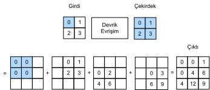
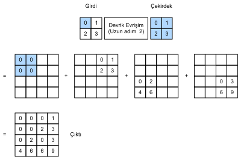

# Devrik Evrişim
:label:`sec_transposed_conv`

Bugüne kadar gördüğümüz CNN katmanları, evrişimli katmanlar (:numref:`sec_conv_layer`) ve ortaklama katmanları (:numref:`sec_pooling`) gibi, genellikle girdinin uzamsal boyutlarını (yükseklik ve genişlik) azaltır (örnek seyreltme) veya değişmeden tutar. Piksel düzeyinde sınıflandırılan anlamsal bölümlemede, girdi ve çıktının mekansal boyutları aynı ise uygun olacaktır. Örneğin, bir çıktı pikselindeki kanal boyutu, girdi pikselinin sınıflandırma sonuçlarını aynı uzamsal konumda tutabilir. 

Bunu başarmak için, özellikle uzamsal boyutlar CNN katmanları tarafından azaltıldıktan sonra, ara öznitelik haritalarının mekansal boyutlarını artırabilecek (örnek sıklaştırma) yapabilen başka bir CNN katmanlarını kullanabiliriz. Bu bölümde, evrişim tarafından örnek seyreltme işlemlerini tersine çevirmek için *kesirli adımlı evrişim* :cite:`Dumoulin.Visin.2016` olarak da adlandırılan *devrik evrişimi* tanıtacağız.

```{.python .input}
from mxnet import np, npx, init
from mxnet.gluon import nn
from d2l import mxnet as d2l

npx.set_np()
```

```{.python .input}
#@tab pytorch
import torch
from torch import nn
from d2l import torch as d2l
```

## Temel İşlem

Şimdilik kanalları görmezden gelerek, 1 adımlı ve dolgusuz temel devrik evrişim işlemiyle başlayalım. Bir $n_h \times n_w$ girdi tensörü ve bir $k_h \times k_w$ çekirdeği verildiğini varsayalım. Çekirdek penceresini her satırda $n_w$ kez ve her sütundaki $n_h$ kez 1 adımıyla kaydırılması toplam $n_h n_w$ ara sonuç verir. Her ara sonuç sıfır olarak ilklenen bir $(n_h + k_h - 1) \times (n_w + k_w - 1)$ tensördür. Her ara tensörün hesaplanması için, girdi tensöründe bulunan her eleman çekirdek ile çarpılır, böylece sonuçta ortaya çıkan $k_h \times k_w$ tensörü her ara tensörde bir kısmın yerini alır. Her ara tensördeki değiştirilen kısmın konumunun, hesaplama için kullanılan girdi tensöründe elemanın konumuna karşılık geldiğini unutmayın. Sonunda, çıktı üretmek için tüm ara sonuçlar toplanır. 

Örneğin, :numref:`fig_trans_conv`, $2\times 2$ girdi tensörü için $2\times 2$ çekirdeği ile devrik evrişimin nasıl hesaplandığını göstermektedir. 


:label:`fig_trans_conv`

Bir girdi matrisi `X` ve bir çekirdek matrisi `K` için (**bu temel devrik evrişim işlemi**)  `trans_conv`'u uygulayabiliriz.

```{.python .input}
#@tab all
def trans_conv(X, K):
    h, w = K.shape
    Y = d2l.zeros((X.shape[0] + h - 1, X.shape[1] + w - 1))
    for i in range(X.shape[0]):
        for j in range(X.shape[1]):
            Y[i: i + h, j: j + w] += X[i, j] * K
    return Y
```

Çekirdek yoluyla girdi öğelerini *azaltan* olağan evrişimin (:numref:`sec_conv_layer`) aksine, devrik evrişim, girdi öğelerini çekirdek yoluyla *yayınlar*, böylece girdiden daha büyük bir çıktı üretir. Temel iki boyutlu devrik evrişim işleminin [**yukarıdaki uygulamanın çıktısını doğrulamak**] için :numref:`fig_trans_conv` şeklindeki girdi tensörü `X`'i ve çekirdek tensörü `K`'yi oluşturabiliriz.
```{.python .input}
#@tab all
X = d2l.tensor([[0.0, 1.0], [2.0, 3.0]])
K = d2l.tensor([[0.0, 1.0], [2.0, 3.0]])
trans_conv(X, K)
```

Alternatif olarak, girdi `X` ve çekirdek `K` dört boyutlu tensörler olduğunda, [**aynı sonuçları elde etmek için üst seviye API'leri kullanabiliriz**].

```{.python .input}
X, K = X.reshape(1, 1, 2, 2), K.reshape(1, 1, 2, 2)
tconv = nn.Conv2DTranspose(1, kernel_size=2)
tconv.initialize(init.Constant(K))
tconv(X)
```

```{.python .input}
#@tab pytorch
X, K = X.reshape(1, 1, 2, 2), K.reshape(1, 1, 2, 2)
tconv = nn.ConvTranspose2d(1, 1, kernel_size=2, bias=False)
tconv.weight.data = K
tconv(X)
```

## [**Dolgu, Adım ve Çoklu Kanallar**]

Dolgunun girdiye uygulandığı düzenli evrişimden farklı olarak, devrik evrişim içindeki çıktıya uygulanır. Örneğin, yükseklik ve genişliğin her iki tarafındaki dolgu sayısı 1 olarak belirtilirken, ilk ve son satırlar ve sütunlar devrik evrişim çıktısından kaldırılır.

```{.python .input}
tconv = nn.Conv2DTranspose(1, kernel_size=2, padding=1)
tconv.initialize(init.Constant(K))
tconv(X)
```

```{.python .input}
#@tab pytorch
tconv = nn.ConvTranspose2d(1, 1, kernel_size=2, padding=1, bias=False)
tconv.weight.data = K
tconv(X)
```

Devrik evrişimde, girdi için değil, ara sonuçlar (böylece çıktı) için adımlar belirtilir. :numref:`fig_trans_conv` içinde bahsedilen aynı girdi ve çekirdek tensörleri kullanılırken, adımın 1'den 2'ye değiştirilmesi, ara tensörlerin, dolayısıyla :numref:`fig_trans_conv_stride2` şeklinde gösterilen çıktı tensörünün, hem yüksekliğini hem de ağırlığını artırır. 


:label:`fig_trans_conv_stride2`

Aşağıdaki kod parçacığı, :numref:`fig_trans_conv_stride2`'te 2 uzun adım için devrik evrişim çıktısını doğrulayabilir.

```{.python .input}
tconv = nn.Conv2DTranspose(1, kernel_size=2, strides=2)
tconv.initialize(init.Constant(K))
tconv(X)
```

```{.python .input}
#@tab pytorch
tconv = nn.ConvTranspose2d(1, 1, kernel_size=2, stride=2, bias=False)
tconv.weight.data = K
tconv(X)
```

Çoklu girdi ve çıktı kanalı için, devrik evrişim normal evrişim ile aynı şekilde çalışır. Girdinin $c_i$ kanallara sahip olduğunu ve devrik evrişimin her girdi kanalına bir $k_h\times k_w$ çekirdek tensörü atadığını varsayalım. Birden fazla çıktı kanalı belirtildiğinde, her çıktı kanalı için bir $c_i\times k_h\times k_w$ çekirdeğine sahip olacağız. 


Her durumda, $\mathsf{X}$'i $\mathsf{Y}=f(\mathsf{X})$ çıktısı almak için bir $f$ evrişim katmanına beslersek ve $\mathsf{X}$ içindeki kanalların sayısı olan çıktı kanallarının sayısı dışında $f$ ile aynı hiper parametrelere sahip bir $g$ devrik evrimsel katman oluşturursak, o zaman $g(Y)$ $\mathsf{X}$ ile aynı şekle sahip olacaktır. Bu, aşağıdaki örnekte gösterilebilir.
```{.python .input}
X = np.random.uniform(size=(1, 10, 16, 16))
conv = nn.Conv2D(20, kernel_size=5, padding=2, strides=3)
tconv = nn.Conv2DTranspose(10, kernel_size=5, padding=2, strides=3)
conv.initialize()
tconv.initialize()
tconv(conv(X)).shape == X.shape
```

```{.python .input}
#@tab pytorch
X = torch.rand(size=(1, 10, 16, 16))
conv = nn.Conv2d(10, 20, kernel_size=5, padding=2, stride=3)
tconv = nn.ConvTranspose2d(20, 10, kernel_size=5, padding=2, stride=3)
tconv(conv(X)).shape == X.shape
```

## [**Matris Devirme ile Bağlantı**]
:label:`subsec-connection-to-mat-transposition`

Devrik evrişim, matris devirme sonrasından adlandırılmıştır. Açıklamak için, önce matris çarpımlarını kullanarak evrişimlerin nasıl uygulanacağını görelim. Aşağıdaki örnekte, $3\times 3$'lük girdi `X` ve $2\times 2$'lik evrişim çekirdeği `K` tanımlıyoruz ve `Y` evrişim çıktısını hesaplamak için `corr2d` işlevini kullanıyoruz.

```{.python .input}
#@tab all
X = d2l.arange(9.0).reshape(3, 3)
K = d2l.tensor([[1.0, 2.0], [3.0, 4.0]])
Y = d2l.corr2d(X, K)
Y
```

Daha sonra, çok sayıda sıfır içeren seyrek ağırlık matrisi `W` olarak evrişim çekirdeği `K`'yi yeniden yazıyoruz. Ağırlık matrisinin şekli ($4$, $9$) olup sıfır olmayan elemanlar evrişim çekirdeği `K`'den gelmektedir.

```{.python .input}
#@tab all
def kernel2matrix(K):
    k, W = d2l.zeros(5), d2l.zeros((4, 9))
    k[:2], k[3:5] = K[0, :], K[1, :]
    W[0, :5], W[1, 1:6], W[2, 3:8], W[3, 4:] = k, k, k, k
    return W

W = kernel2matrix(K)
W
```

9 uzunluğunda bir vektör elde etmek için girdi `X`'i satır satır bitiştirin. Daha sonra `W` ve vektörleştirilmiş `X`'in matris çarpımı, 4 uzunluğunda bir vektör verir. Yeniden şekillendirdikten sonra, yukarıdaki orijinal evrişim işlemindeki aynı `Y` sonucunu elde edebiliriz: Matris çarpımlarını kullanarak evrişimleri uyguladık.

```{.python .input}
#@tab all
Y == d2l.matmul(W, d2l.reshape(X, -1)).reshape(2, 2)
```

Aynı şekilde, matris çarpımlarını kullanarak devrik evrişimleri de uygulayabiliriz. Aşağıdaki örnekte, yukarıdaki olağan evrişimin $2 \times 2$ çıktısı `Y`'yi devrik evrişime girdi olarak alıyoruz. Bu işlemi matrisleri çarparak uygulamak için, `W` ağırlık matrisini yeni şekli $(9, 4)$ ile devirmemiz yeterlidir.

```{.python .input}
#@tab all
Z = trans_conv(Y, K)
Z == d2l.matmul(W.T, d2l.reshape(Y, -1)).reshape(3, 3)
```

Matrisleri çarparak evrişimi uygulamayı düşünün. Bir girdi vektörü $\mathbf{x}$ ve bir ağırlık matrisi $\mathbf{W}$ göz önüne alındığında, evrişimin ileri yayma fonksiyonu, girdi ağırlık matrisi ile çarpımından bir $\mathbf{y}=\mathbf{W}\mathbf{x}$ vektör çıktısı verilerek uygulanabilir. Geriye yayma zincir kuralını ve $\nabla_{\mathbf{x}}\mathbf{y}=\mathbf{W}^\top$'i izlediğinden, evrişimin geriye yayma fonksiyonu, girdisini devrik ağırlık matrisi $\mathbf{W}^\top$ ile çarparak uygulanabilir. Bu nedenle, devrik evrişim katmanı sadece ileri yayma fonksiyonunu ve evrişim tabakasının geri yayma fonksiyonunu değiştirebilir: İleri yayma ve geri yayma fonksiyonları sırasıyla $\mathbf{W}^\top$ ve $\mathbf{W}$ ile girdi vektörünü çarpar. 

## Özet

* Çekirdek üzerinden girdi elemanlarını azaltan olağan evrişimin aksine, devrik evrişim çekirdek üzerinden girdi öğelerini yayınlar ve böylece girdiden daha büyük bir çıktı üretir.
* $\mathsf{X}$'i $\mathsf{Y}=f(\mathsf{X})$ çıktısı almak için bir $f$ evrişim katmanına beslersek ve çıktı kanallarının sayısının $\mathsf{X}$ içindeki kanalların sayısı olması dışında $f$ ile aynı hiper parametrelere sahip bir devrik evrişim katmanı $g$ oluşturursak,  $g(Y)$ $\mathsf{X}$ ile aynı şekle sahip olacaktır.
* Matris çarpımlarını kullanarak evrişimleri gerçekleştirebiliriz. Devrik evrişimli katman sadece ileri yayma fonksiyonunu ve evrişimli katmanın geri yayma işlevini değiştirebilir.

## Alıştırmalar

1. :numref:`subsec-connection-to-mat-transposition` içinde, evrişim girdisi `X`  ve devrik evrişim çıktısı `Z` aynı şekle sahiptir. Aynı değere sahipler mi? Neden?
1. Evrişimleri uygulamak için matris çarpımlarını kullanmak verimli midir? Neden?

:begin_tab:`mxnet`
[Tartışmalar](https://discuss.d2l.ai/t/376)
:end_tab:

:begin_tab:`pytorch`
[Tartışmalar](https://discuss.d2l.ai/t/1450)
:end_tab:
