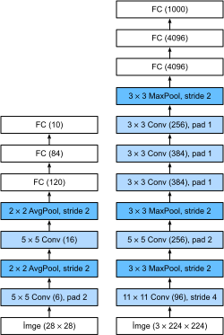

# Derin Evrişimli Sinir Ağları (AlexNet)
:label:`sec_alexnet`

CNN'ler LeNet'in ortaya çıkışını takiben bilgisayarla görme ve makine öğrenmesi topluluklarında iyi bilinse de, alanda hemen baskın olmadılar. LeNet, ilk küçük veri kümelerinde iyi sonuçlar elde etse de, CNN'leri daha büyük, daha gerçekçi veri kümeleri üzerinde eğitmenin başarımı ve uygulanabilirliği henüz belirlenmemişti. Aslında, 1990'ların başları ile 2012 yılının dönüm noktası sonuçları ortasındaki ara dönemin büyük bir bölümünde, sinir ağları genellikle destek vektör makineleri gibi diğer makine öğrenmesi yöntemleri tarafından aşıldı.

Bilgisayarla görme için, bu karşılaştırma belki de adil değildir. Bu, evrişimli ağlara girdiler ham veya hafif işlenmiş (örneğin, ortalama yoluyla) piksel değerlerinden oluşsa da, uygulayıcılar asla ham pikselleri geleneksel modellere beslemezlerdir. Bunun yerine, tipik bilgisayarla görmedeki işlem hatları, manuel, öznitelik çıkarma işlem hatlarından oluşuyordu. *Öznitelikleri öğrenmek* yerine, öznitelikler *hazırlanırdı*. İlerlemenin çoğu, öznitelikler için daha akıllı fikirlere sahip olunmasından gelirdi ve öğrenme algoritması genellikle sonradan düşünülürdü.

Bazı sinir ağı hızlandırıcıları 1990'larda da mevcut olmasına rağmen, çok sayıda parametreyle derin çok kanallı, çok katmanlı CNN'ler yapmak için henüz yeterince güçlü değillerdi. Dahası, veri kümeleri hala nispeten küçüktü. Bu engellere ek olarak, parametre ilkleme sezgisel yöntemleri, rasgele eğim inişin akıllı biçimleri, daralmayan etkinleştirme fonksiyonları ve etkili düzenlileştirme teknikleri de dahil olmak üzere sinir ağlarını eğitmek için anahtar püf noktaları hala eksikti.

Böylece, *uçtan uça* (pikselden sınıflandırmaya) sistemleri eğitmekten ziyade, klasik işlem hatları daha çok şöyle görünüyordu:

1. İlginç bir veri kümesi elde edin. İlk günlerde, bu veri kümeleri pahalı sensörlere ihtiyaç duyuyordu (o zamanlarda 1 megapiksel görüntüler son teknolojiydi).
2. Veri kümesini, optik, geometri, diğer analitik araçlar ve bazen şanslı lisansüstü öğrencilerin rastlantısal keşiflerine dayanan elle hazırlanmış özniteliklerle ön işleyin.
3. Verileri SIFT (ölçek-değişmez öznitelik dönüşümü) :cite:`Lowe.2004`, SURF (hızlandırılmış gürbüz öznitelikler) :cite:`Bay.Tuytelaars.Van-Gool.2006` veya herhangi bir sayıda diğer elle ayarlanmış işlem hatları gibi standart öznitelik çıkarıcılar kümesine besleyin.
4. Bir sınıflandırıcı eğitmek için ortaya çıkan temsilleri en sevdiğiniz sınıflandırıcıya (muhtemelen doğrusal bir model veya çekirdek yöntemi) yığın.

Makine öğrenmesi araştırmacılarıyla konuştuysanız, makine öğrenmesinin hem önemli hem de güzel olduğuna inanırlardı. Zarif teoriler çeşitli sınıflandırıcıların özelliklerini kanıtladı. Makine öğrenmesi alanı gelişen, titiz ve son derece yararlıydı. Ancak, bir bilgisayarla görme araştırmacısı ile konuştuysanız, çok farklı bir hikaye duyardınız. İmge tanımanın kirli gerçeğini size söylerlerdi; öğrenme algoritmaları değil, öznitelikler ilerlemeyi yönlendirir. Bilgisayarla görme araştırmacıları haklı olarak, biraz daha büyük veya daha temiz bir veri kümesinin veya biraz geliştirilmiş öznitelik çıkarma işlem hattının nihai doğruluk oranı için herhangi bir öğrenme algoritmasından çok daha önemli olduğuna inanıyordu.

## Temsilleri Öğrenme

Vaziyeti ortaya dökmenin bir diğer yolu da işlem hattının en önemli kısmının temsil olmasıdır. 2012 yılına kadar temsil mekanik olarak hesaplanırdı. Aslında, yeni bir öznitelik fonksiyonu kümesi işleme, sonuçları iyileştirme ve yöntemi yazma belirgin bir makale türüydü. SIFT :cite:`Lowe.2004`, SURF :cite:`Bay.Tuytelaars.Van-Gool.2006`, HOG (yönlendirilmiş gradyan histogramları) :cite:`Dalal.Triggs.2005`, [görsel sözcük torbası](https://en.wikipedia.org/wiki/Bag-of-words_model_in_computer_vision) ve benzeri öznitelik çıkarıcılar sözünü dinletti.

Yann LeCun, Geoff Hinton, Yoshua Bengio, Andrew Ng, Shun-ichi Amari ve Juergen Schmidhuber de dahil olmak üzere bir başka araştırmacı grubunun farklı planları vardı. Onlar özniteliklerin kendilerinin öğrenilmesi gerektiğine inanıyordu. Dahası, makul derecede karmaşık olması için, özniteliklerin hiyerarşik olarak, her biri öğrenilebilir parametrelere sahip birden çok ortak öğrenilen katmanla oluşması gerektiğine inanıyorlardı. İmge durumunda, en düşük katmanlar kenarları, renkleri ve dokuları algılayabilir. Gerçekten de, Alex Krizhevsky, Ilya Sutskever ve Geoff Hinton, yeni bir CNN biçimi önerdi *AlexNet* ve 2012 ImageNet yarışmasında mükemmel performans elde etti. AlexNet, :cite:`Krizhevsky.Sutskever.Hinton.2012`'ün atılım yapan ImageNet sınıflandırma makalesinin ilk yazarı olan Alex Krizhevsky'nin adını aldı.

İlginçtir ki, ağın en düşük katmanlarında, model bazı geleneksel filtrelere benzeyen öznitelik çıkarıcıları öğrendi. Şekil :numref:`fig_filters`, AlexNet :cite:`Krizhevsky.Sutskever.Hinton.2012` makalesinden tekrar üretilmiştir ve alt düzey imge tanımlayıcılarını göstermektedir.


:width:`400px`
:label:`fig_filters`

Ağdaki daha üst katmanlar, gözler, burunlar, çimen çizgileri vb. gibi daha büyük yapıları temsil edecek şekilde bu temsillerin üzerine inşa edilebilir. Daha üst katmanlar bile insanlar, uçaklar, köpekler veya frizbi gibi tüm nesneleri temsil edebilir. Nihayetinde, son gizli hal, farklı kategorilere ait verilerin kolayca ayrılabilmesi için içeriğini özetleyen imgenin sıkıştırılmış bir temsilini öğrenir.

Çok katmanlı CNN'ler için nihai atılım 2012'de gelirken, çekirdek bir grup araştırmacı, uzun yıllar görsel verilerin hiyerarşik temsillerini öğrenmeye çalışarak kendilerini bu fikre adamıştı. 2012'deki nihai atılım iki temel faktöre bağlanabilir.

### Eksik Bileşen: Veri

Birçok katmana sahip derin modeller, dışbükey optimizasyonlara (örneğin doğrusal ve çekirdek yöntemleri) dayalı geleneksel yöntemlerden önemli ölçüde daha iyi performans gösterdikleri düzene girmek için büyük miktarda veri gerektirirler. Bununla birlikte, bilgisayarların sınırlı depolama kapasitesi, sensörlerin göreceli pahalı fiyatları ve 1990'lardaki nispeten daha kısıtlı araştırma bütçeleri göz önüne alındığında, çoğu araştırma küçük veri kümelerine dayanıyordu. Çok sayıda makale, UCI veri kümelerinin koleksiyonuna değiniyordi, bunların birçoğu düşük çözünürlükte doğal olmayan ortamlarda çekilmiş sadece yüzlerce veya (birkaç) binlerce imge içeriyordu.

2009'da ImageNet veri kümesi yayımlandı ve araştırmacıları 1000 farklı nesne kategorisinden her biri farklı 1000 eleman içeren toplamda 1 milyon örnek ile modeller öğrenmeye zorladı. Bu veri kümesini tanıtan Fei-Fei Li liderliğindeki araştırmacılar, her kategori için büyük aday kümelerini ön filtrelemek için Google Image Search kullandı ve her imgenin ilgili kategoriye ait olup olmadığını onaylatmak için Amazon Mechanical Turk kitle kaynak kullanımı işlem hattını kullandı. Bu eşi görülmemiş bir ölçekti. ImageNet yarışması olarak adlandırılan ilgili rekabet, bilgisayarla görme ve makine öğrenmesi araştırmalarını ileriye itti, araştırmacıları hangi modellerin daha önce akademisyenlerin düşündüklerinden daha büyük bir ölçekte en iyi performans gösterdiğini belirlemelerine zorladı.

### Eksik Malzeme: Donanım

Derin öğrenme modelleri, bilgi işlem döngülerinin doymak bilmeyen tüketicileridir. Eğitim yüzlerce dönem alabilir ve her yineleme, veriyi hesaplamalı olarak pahalı doğrusal cebir işlemlerine sahip birçok katmanından geçirmeyi gerektirir. Bu, 1990'ların ve 2000'lerin başında, daha verimli bir şekilde optimize edilmiş dışbükey amaç fonksiyonlarına dayanan basit algoritmaların tercih edilmesinin başlıca nedenlerinden biridir.

*Grafik işleme birimleri* (GPU'lar) derin öğrenmeyi mümkün kılmada bir oyun değiştirici olduğu kanıtladı. Bu yongalar uzun zamandan beri bilgisayar oyunlarında faydalanmak için grafik işlemeyi hızlandırmak amacıyla geliştirilmiştir. Özellikle, birçok bilgisayar grafik görevimde gerekli olan yüksek verim $4 \times 4$ matris vektör çarpımları için optimize edilmişlerdir. Neyse ki, buradaki matematik, evrişimli katmanları hesaplamak için gerekli olana çarpıcı bir şekilde benzer. Bu süre zarfında NVIDIA ve ATI, GPU'ları genel hesaplama işlemleri için optimize etmeye ve bunları *genel amaçlı GPU'lar* (GPGPU) olarak pazarlamaya başlamıştı.

Biraz sezgi sağlamak için, modern bir mikroişlemcinin (CPU) çekirdeklerini göz önünde bulundurun. Çekirdeklerin her biri, yüksek bir saat frekansı ve gösterişli büyük önbellekleri (birkaç megabayta kadar L3) ile oldukça güçlü çalışır. Her çekirdek, dallanma tahmincileri, derin bir işlem hattı ve çok çeşitli programları çalıştırmasını sağlayan diğer çekici ek özellikleri ile birlikte birçok çeşitli talimatı uygulamak için çok uygundur. Bununla birlikte, bu belirgin güç aynı zamanda Aşil topuğudur: Genel amaçlı çekirdekler inşa etmek çok pahalıdır. Çok sayıda yonga alanı, karmaşık bir destek yapısı (bellek arabirimleri, çekirdekler arasında önbelleğe alma mantığı, yüksek hızlı ara bağlantılar vb.) gerektirirler ve herhangi bir özel görevde nispeten kötüdürler. Modern dizüstü bilgisayarlar 4 adede kadar çekirdeğe sahiptir ve hatta üst düzey sunucular bile 64 çekirdeği nadiren aşmaktadır, çünkü uygun maliyetli değildir.

Karşılaştırma olarak, GPU'lar $100 \sim 1000$ arasında küçük işleme elemanlarından oluşur (ayrıntılar NVIDIA, ATI, ARM ve diğer yonga satıcıları arasında biraz farklılık gösterir), genellikle daha büyük gruplar halinde gruplandırılır (NVIDIA bunları bükülme (warp) olarak adlandırır). Her çekirdek nispeten zayıfken, bazen 1GHz altı saat frekansında bile olsa, GPU'ların büyüklük mertebesini CPU'lardan daha hızlı hale getiren bu tür çekirdeklerin toplam sayısıdır. Örneğin, NVIDIA'nın yeni Volta nesli, özel talimatlar için çip başına 120 TFlop (ve daha genel amaçlı olanlar için 24 TFlop'a kadar) sunarken, CPU'ların kayan virgüllü sayı performansı bugüne kadar 1 TFlop'u aşmadı. Bunun mümkün olmasının nedeni aslında oldukça basittir: Birincisi, güç tüketimi saat frekansı ile *dört kat* büyümeye eğilimlidir. Bu nedenle, 4 kat daha hızlı çalışan bir CPU çekirdeğinin güç bütçesi ile (tipik bir sayı), $1/4$ hızında 16 GPU çekirdeğini kullanabilirsiniz, bu da performansın $16 \times 1/4 = 4$ katını verir. Ayrıca, GPU çekirdekleri çok daha basittir (aslında, uzun bir süre için genel amaçlı kod *yürütebilir* bile değillerdi), bu da onları daha verimli kılar. Son olarak, derin öğrenmede birçok işlem yüksek bellek bant genişliği gerektirir. Yine, GPU'lar burada en az 10 kat daha geniş olan veriyolları ile parlıyor.

2012'ye geri dön. Alex Krizhevsky ve Ilya Sutskever GPU donanımı üzerinde çalışabilecek derin bir CNN uyguladığında büyük bir atılım oldu. CNN'lerdeki hesaplamalı darboğazların, kıvrımların ve matris çarpımlarının, donanımda paralelleştirilebilecek tüm işlemler olduğunu fark ettiler. 3GB belleğe sahip iki NVIDIA GTX 580s kullanarak hızlı kıvrımlar uyguladılar. [cuda-convnet](https://code.google.com/archive/p/cuda-convnet/) kodu, birkaç yıldır endüstri standardı olduğu ve derin öğrenme patlamasının ilk birkaç yılını desteklediği için yeterince iyiydi.

## AlexNet

8 katmanlı CNN kullanan AlexNet, ImageNet Büyük Ölçekli Görsel Tanıma Yarışması'nı olağanüstü derecede büyük bir farkla kazandı. Bu ağ, ilk kez, öğrenme yoluyla elde edilen özelliklerin el ile tasarlanmış özellikleri aşabildiğini ve bilgisayar görüşünde önceki paradigmayı kırabileceğini gösterdi.

:numref:`fig_alexnet`'ün gösterdiği gibi AlexNet ve LeNet'in mimarileri çok benzer. Modelin iki küçük GPU'ya uyması için 2012'de gerekli olan tasarım tuhaflıklarından bazılarını kaldırarak AlexNet'in biraz aerodinamik bir versiyonunu sunduğumuzu unutmayın.


:label:`fig_alexnet`

AlexNet ve LeNet'in tasarım felsefeleri çok benzer, ancak önemli farklılıklar da vardır. İlk olarak, AlexNet nispeten küçük LeNet5'ten çok daha derin. AlexNet sekiz katmandan oluşur: beş kıvrımsal katman, iki tam bağlı gizli katman ve bir tam bağlı çıkış katmanı. İkincisi, AlexNet aktivasyon fonksiyonu olarak sigmoid yerine ReLU'yu kullandı. Bize aşağıdaki ayrıntıları inceleyelim.

### Mimarlık

AlexNet'in ilk katmanında, evrim penceresi şekli $11\times11$'dir. ImageNet'teki çoğu görüntü MNIST görüntülerinden on kat daha yüksek ve daha geniş olduğundan, ImageNet verilerindeki nesneler daha fazla piksel işgal etme eğilimindedir. Sonuç olarak, nesneyi yakalamak için daha büyük bir evrim penceresi gereklidir. İkinci kattaki evrişim pencere şekli $5\times5$'ya, ardından $3\times3$'e indirgenir. Buna ek olarak, birinci, ikinci ve beşinci kıvrımsal katmanlardan sonra, ağ $3\times3$ pencere şekli ve 2'lik bir adım ile maksimum havuzlama katmanları ekler. Ayrıca, AlexNet'in LeNet'ten on kat daha fazla evrişim kanalı vardır.

Son konvolüsyonel tabakadan sonra 4096 çıkışlı iki tam bağlı katman vardır. Bu iki büyük tam bağlı katman, yaklaşık 1 GB'lık model parametreleri üretir. Erken GPU'lardaki sınırlı bellek nedeniyle, orijinal AlexNet çift veri akışı tasarımı kullandı, böylece iki GPU'larının her biri modelin yalnızca yarısını depolamaktan ve hesaplamaktan sorumlu olabilir. Neyse ki, GPU belleği artık nispeten bol, bu yüzden nadiren GPU'lar arasında modelleri parçalamamız gerekiyor (AlexNet modelinin versiyonumuz bu açıdan orijinal kağıttan sapıyor).

### Etkinleştirme İşlevleri

Ayrıca, AlexNet sigmoid aktivasyon işlevini daha basit bir ReLU aktivasyon fonksiyonuna değiştirdi. Bir yandan, ReLU aktivasyon işlevinin hesaplanması daha kolaydır. Örneğin, sigmoid etkinleştirme işlevinde bulunan üsleme işlemi yoktur. Öte yandan, ReLU etkinleştirme işlevi, farklı parametre başlatma yöntemleri kullanıldığında model eğitimini kolaylaştırır. Bunun nedeni, sigmoid etkinleştirme işlevinin çıktısı 0 veya 1'e çok yakın olduğunda, bu bölgelerin degradesinin neredeyse 0 olmasıdır, böylece geri yayılım model parametrelerinin bazılarını güncelleştirmeye devam edemez. Buna karşılık, pozitif aralıktaki ReLU etkinleştirme işlevinin degrade her zaman 1'dir. Bu nedenle, model parametreleri düzgün başlatılmazsa, sigmoid işlevi pozitif aralıkta neredeyse 0 degrade elde edebilir, böylece model etkili bir şekilde eğitilemez.

### Kapasite Kontrolü ve Ön İşleme

AlexNet, tam bağlı katmanın model karmaşıklığını bırakarak (:numref:`sec_dropout`) kontrol ederken, LeNet sadece ağırlık çürümesini kullanır. Verileri daha da artırmak için AlexNet'in eğitim döngüsü, ters çevirme, kırpma ve renk değişiklikleri gibi çok fazla görüntü büyütme ekledi. Bu, modeli daha sağlam hale getirir ve daha büyük numune boyutu aşırı uyumu etkili bir şekilde azaltır. Veri büyütme işlemlerini :numref:`sec_image_augmentation`'te daha ayrıntılı olarak tartışacağız.

```{.python .input}
from d2l import mxnet as d2l
from mxnet import np, npx
from mxnet.gluon import nn
npx.set_np()

net = nn.Sequential()
# Here, we use a larger 11 x 11 window to capture objects. At the same time,
# we use a stride of 4 to greatly reduce the height and width of the output.
# Here, the number of output channels is much larger than that in LeNet
net.add(nn.Conv2D(96, kernel_size=11, strides=4, activation='relu'),
        nn.MaxPool2D(pool_size=3, strides=2),
        # Make the convolution window smaller, set padding to 2 for consistent
        # height and width across the input and output, and increase the
        # number of output channels
        nn.Conv2D(256, kernel_size=5, padding=2, activation='relu'),
        nn.MaxPool2D(pool_size=3, strides=2),
        # Use three successive convolutional layers and a smaller convolution
        # window. Except for the final convolutional layer, the number of
        # output channels is further increased. Pooling layers are not used to
        # reduce the height and width of input after the first two
        # convolutional layers
        nn.Conv2D(384, kernel_size=3, padding=1, activation='relu'),
        nn.Conv2D(384, kernel_size=3, padding=1, activation='relu'),
        nn.Conv2D(256, kernel_size=3, padding=1, activation='relu'),
        nn.MaxPool2D(pool_size=3, strides=2),
        # Here, the number of outputs of the fully-connected layer is several
        # times larger than that in LeNet. Use the dropout layer to mitigate
        # overfitting
        nn.Dense(4096, activation='relu'), nn.Dropout(0.5),
        nn.Dense(4096, activation='relu'), nn.Dropout(0.5),
        # Output layer. Since we are using Fashion-MNIST, the number of
        # classes is 10, instead of 1000 as in the paper
        nn.Dense(10))
```

```{.python .input}
#@tab pytorch
from d2l import torch as d2l
import torch
from torch import nn

net = nn.Sequential(
    # Here, we use a larger 11 x 11 window to capture objects. At the same
    # time, we use a stride of 4 to greatly reduce the height and width of the
    # output. Here, the number of output channels is much larger than that in
    # LeNet
    nn.Conv2d(1, 96, kernel_size=11, stride=4, padding=1), nn.ReLU(),
    nn.MaxPool2d(kernel_size=3, stride=2),
    # Make the convolution window smaller, set padding to 2 for consistent
    # height and width across the input and output, and increase the number of
    # output channels
    nn.Conv2d(96, 256, kernel_size=5, padding=2), nn.ReLU(),
    nn.MaxPool2d(kernel_size=3, stride=2),
    # Use three successive convolutional layers and a smaller convolution
    # window. Except for the final convolutional layer, the number of output
    # channels is further increased. Pooling layers are not used to reduce the
    # height and width of input after the first two convolutional layers
    nn.Conv2d(256, 384, kernel_size=3, padding=1), nn.ReLU(),
    nn.Conv2d(384, 384, kernel_size=3, padding=1), nn.ReLU(),
    nn.Conv2d(384, 256, kernel_size=3, padding=1), nn.ReLU(),
    nn.MaxPool2d(kernel_size=3, stride=2),
    nn.Flatten(),
    # Here, the number of outputs of the fully-connected layer is several
    # times larger than that in LeNet. Use the dropout layer to mitigate
    # overfitting
    nn.Linear(6400, 4096), nn.ReLU(),
    nn.Dropout(p=0.5),
    nn.Linear(4096, 4096), nn.ReLU(),
    nn.Dropout(p=0.5),
    # Output layer. Since we are using Fashion-MNIST, the number of classes is
    # 10, instead of 1000 as in the paper
    nn.Linear(4096, 10))
```

```{.python .input}
#@tab tensorflow
from d2l import tensorflow as d2l
import tensorflow as tf

def net():
    return tf.keras.models.Sequential([
        # Here, we use a larger 11 x 11 window to capture objects. At the same
        # time, we use a stride of 4 to greatly reduce the height and width of
        # the output. Here, the number of output channels is much larger than
        # that in LeNet
        tf.keras.layers.Conv2D(filters=96, kernel_size=11, strides=4,
                               activation='relu'),
        tf.keras.layers.MaxPool2D(pool_size=3, strides=2),
        # Make the convolution window smaller, set padding to 2 for consistent
        # height and width across the input and output, and increase the
        # number of output channels
        tf.keras.layers.Conv2D(filters=256, kernel_size=5, padding='same',
                               activation='relu'),
        tf.keras.layers.MaxPool2D(pool_size=3, strides=2),
        # Use three successive convolutional layers and a smaller convolution
        # window. Except for the final convolutional layer, the number of
        # output channels is further increased. Pooling layers are not used to
        # reduce the height and width of input after the first two
        # convolutional layers
        tf.keras.layers.Conv2D(filters=384, kernel_size=3, padding='same',
                               activation='relu'),
        tf.keras.layers.Conv2D(filters=384, kernel_size=3, padding='same',
                               activation='relu'),
        tf.keras.layers.Conv2D(filters=256, kernel_size=3, padding='same',
                               activation='relu'),
        tf.keras.layers.MaxPool2D(pool_size=3, strides=2),
        tf.keras.layers.Flatten(),
        # Here, the number of outputs of the fully-connected layer is several
        # times larger than that in LeNet. Use the dropout layer to mitigate
        # overfitting
        tf.keras.layers.Dense(4096, activation='relu'),
        tf.keras.layers.Dropout(0.5),
        tf.keras.layers.Dense(4096, activation='relu'),
        tf.keras.layers.Dropout(0.5),
        # Output layer. Since we are using Fashion-MNIST, the number of
        # classes is 10, instead of 1000 as in the paper
        tf.keras.layers.Dense(10)
    ])
```

Her katmanın çıkış şeklini gözlemlemek için hem yükseklik hem de 224 genişliğinde tek kanallı bir veri örneği oluşturuyoruz. :numref:`fig_alexnet`'teki AlexNet mimarisine uyuyor.

```{.python .input}
X = np.random.uniform(size=(1, 1, 224, 224))
net.initialize()
for layer in net:
    X = layer(X)
    print(layer.name, 'output shape:\t', X.shape)
```

```{.python .input}
#@tab pytorch
X = torch.randn(1, 1, 224, 224)
for layer in net:
    X=layer(X)
    print(layer.__class__.__name__,'Output shape:\t',X.shape)
```

```{.python .input}
#@tab tensorflow
X = tf.random.uniform((1, 224, 224, 1))
for layer in net().layers:
    X = layer(X)
    print(layer.__class__.__name__, 'Output shape:\t', X.shape)
```

## Veri kümesini okuma

AlexNet gazetede ImageNet üzerinde eğitilmiş olsa da, bir ImageNet modelini modern bir GPU'da bile saatler veya günler sürebileceğinden, burada Moda-MNIST kullanıyoruz. AlexNet'in doğrudan Moda-MNIST üzerine uygulanmasıyla ilgili sorunlardan biri, görüntülerinin ImageNet görüntülerinden daha düşük çözünürlüğe ($28 \times 28$ piksel) sahip olmasıdır. İşleri yürütebilmek için onları $224 \times 224$'ya yükseltiyoruz (genellikle akıllı bir uygulama değil, ama burada AlexNet mimarisine sadık olmak için yapıyoruz). Bu yeniden boyutlandırma `resize` bağımsız değişkeni ile `d2l.load_data_fashion_mnist` işlevinde gerçekleştiriyoruz.

```{.python .input}
#@tab all
batch_size = 128
train_iter, test_iter = d2l.load_data_fashion_mnist(batch_size, resize=224)
```

## Eğitim

Şimdi AlexNet'i eğitmeye başlayabiliriz. :numref:`sec_lenet`'teki LeNet ile karşılaştırıldığında, buradaki ana değişiklik, daha derin ve daha geniş ağ, daha yüksek görüntü çözünürlüğü ve daha maliyetli kıvrımlar nedeniyle daha küçük bir öğrenme hızı ve çok daha yavaş eğitim kullanılmasıdır.

```{.python .input}
#@tab all
lr, num_epochs = 0.01, 10
d2l.train_ch6(net, train_iter, test_iter, num_epochs, lr)
```

## Özet

* AlexNet, LeNet'e benzer bir yapıya sahiptir, ancak büyük ölçekli ImageNet veri kümesine uyacak şekilde daha fazla kıvrımsal katman ve daha büyük bir parametre alanı kullanır.
* Bugün AlexNet çok daha etkili mimariler tarafından aşıldı, ancak günümüzde kullanılan sığ derin ağlara kadar önemli bir adımdır.
* AlexNet'in uygulamasında LeNet'ten sadece birkaç satır daha var gibi görünse de, akademik topluluğun bu kavramsal değişimi benimsemesi ve mükemmel deneysel sonuçlarından yararlanması uzun yıllar aldı. Bu aynı zamanda verimli hesaplama araçlarının eksikliğinden kaynaklanıyordu.
* Dropout, ReLU ve ön işleme, bilgisayar görme görevlerinde mükemmel performans elde etmedeki diğer önemli adımlardı.

## Alıştırmalar

1. Çadırların sayısını artırmayı deneyin. LeNet ile karşılaştırıldığında, sonuçlar nasıl farklı? Neden?
1. AlexNet Moda-MNIST veri kümesi için çok karmaşık olabilir.
    1. Doğruluğun önemli ölçüde düşmemesini sağlarken, eğitimi daha hızlı yapmak için modeli basitleştirmeyi deneyin.
    1. Doğrudan $28 \times 28$ görüntülerde çalışan daha iyi bir model tasarlayın.
1. Toplu iş boyutunu değiştirin ve doğruluk ve GPU belleğindeki değişiklikleri gözlemleyin.
1. AlexNet'in hesaplama performansını analiz eder.
    1. AlexNet'in bellek ayak izi için baskın kısım nedir?
    1. AlexNet'te hesaplama için baskın kısım nedir?
    1. Sonuçları hesaplarken bellek bant genişliğine ne dersiniz?
1. LeNet-5'e bırakma ve ReLU uygulayın. İyileşiyor mu? Ön işleme ne dersin?

:begin_tab:`mxnet`
[Tartışmalar](https://discuss.d2l.ai/t/75)
:end_tab:

:begin_tab:`pytorch`
[Tartışmalar](https://discuss.d2l.ai/t/76)
:end_tab:

:begin_tab:`tensorflow`
[Tartışmalar](https://discuss.d2l.ai/t/276)
:end_tab:
