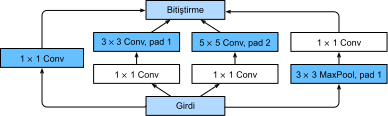

# Paralel Bitiştirmeli Ağlar (GoogLeNet)
:label:`sec_googlenet`

2014'te, *GoogLeNet* ImageNet Yarışması'nı kazandı ve NiN'in güçlü yanlarını ve :cite:`Szegedy.Liu.Jia.ea.2015`'ün tekrarlanan bloklarının faydalarını birleştiren bir yapı önerdi. Makalenin odak noktası, hangi büyüklükteki evrişim çekirdeklerinin en iyi olduğu sorusunu ele almaktı. Sonuçta, önceki popüler ağlar $1 \times 1$ gibi küçük ve $11 \times 11$ kadar büyük seçimler kullandı. Bu makaledeki bir öngörü, bazen çeşitli boyutlarda çekirdeklerin bir kombinasyonunu kullanmanın avantajlı olabileceğiydi. Bu bölümde, orijinal modelin biraz basitleştirilmiş bir versiyonunu sunarak GoogLeNet'i tanıtacağız: Eğitimi kararlı hale getirmek için eklenen ancak artık daha iyi eğitim algoritmaları ile gereksiz olan birkaç geçici özelliği atlıyoruz.

## (**Başlangıç (Inception) Blokları**)

GoogLeNet'teki temel evrişimli bloğa, viral bir mizah unsuru (meme) başlatan *Başlangıç (Inception)* (“Daha derine gitmemiz gerekiyor”) filminden bir alıntı nedeniyle adlandırılmış bir *başlangıç bloğu* denir.


:label:`fig_inception`

:numref:`fig_inception` içinde gösterildiği gibi, başlangıç bloğu dört paralel yoldan oluşur. İlk üç yol, farklı uzamsal boyutlardan bilgi ayıklamak için $1\times 1$, $3\times 3$ ve $5\times 5$ pencere boyutlarına sahip evrişimli katmanlar kullanır. Orta iki yol, kanalların sayısını azaltmak ve modelin karmaşıklığını azaltmak için girdi üzerinde bir $1\times 1$ evrişim gerçekleştirir. Dördüncü yol, $3\times 3$ maksimum ortaklama katmanı kullanır ve onu ardından kanal sayısını değiştiren $1\times 1$ evrişimli katman izler. Dört yol, girdi ve çıktıya aynı yüksekliği ve genişliği vermek için uygun dolguyu kullanır. Son olarak, her yol boyunca çıktılar kanal boyutu boyunca bitiştirilir ve bloğun çıktısını oluşturur. Başlangıç bloğunun yaygın olarak ayarlanan hiper parametreleri, katman başına çıktı kanallarının sayısıdır.

```{.python .input}
from d2l import mxnet as d2l
from mxnet import np, npx
from mxnet.gluon import nn
npx.set_np()

class Inception(nn.Block):
    # `c1`--`c4` her yoldaki çıktı kanallarının sayısıdır
    def __init__(self, c1, c2, c3, c4, **kwargs):
        super(Inception, self).__init__(**kwargs)
        # Yol 1, tek bir 1 x 1 evrişimli katmandır
        self.p1_1 = nn.Conv2D(c1, kernel_size=1, activation='relu')
        # Yol 2, 1 x 1 evrişimli katmanı ve ardından 
        # 3 x 3 evrişimli katmandır
        self.p2_1 = nn.Conv2D(c2[0], kernel_size=1, activation='relu')
        self.p2_2 = nn.Conv2D(c2[1], kernel_size=3, padding=1,
                              activation='relu')
        # Yol 3, 1 x 1 evrişimli katmanı ve ardından 
        # 5 x 5 evrişimli katmandır
        self.p3_1 = nn.Conv2D(c3[0], kernel_size=1, activation='relu')
        self.p3_2 = nn.Conv2D(c3[1], kernel_size=5, padding=2,
                              activation='relu')
        # Yol 4, 3 x 3 maksimum ortaklama katmanı ve 
        # ardından 1 x 1 evrişimli katmandır
        self.p4_1 = nn.MaxPool2D(pool_size=3, strides=1, padding=1)
        self.p4_2 = nn.Conv2D(c4, kernel_size=1, activation='relu')

    def forward(self, x):
        p1 = self.p1_1(x)
        p2 = self.p2_2(self.p2_1(x))
        p3 = self.p3_2(self.p3_1(x))
        p4 = self.p4_2(self.p4_1(x))
        # Concatenate the outputs on the channel dimension
        return np.concatenate((p1, p2, p3, p4), axis=1)
```

```{.python .input}
#@tab pytorch
from d2l import torch as d2l
import torch
from torch import nn
from torch.nn import functional as F

class Inception(nn.Module):
    # `c1`--`c4` her yoldaki çıktı kanallarının sayısıdır
    def __init__(self, in_channels, c1, c2, c3, c4, **kwargs):
        super(Inception, self).__init__(**kwargs)
        # Yol 1, tek bir 1 x 1 evrişimli katmandır
        self.p1_1 = nn.Conv2d(in_channels, c1, kernel_size=1)
        # Yol 2, 1 x 1 evrişimli katmanı ve ardından 
        # 3 x 3 evrişimli katmandır
        self.p2_1 = nn.Conv2d(in_channels, c2[0], kernel_size=1)
        self.p2_2 = nn.Conv2d(c2[0], c2[1], kernel_size=3, padding=1)
        # Yol 3, 1 x 1 evrişimli katmanı ve ardından 
        # 5 x 5 evrişimli katmandır
        self.p3_1 = nn.Conv2d(in_channels, c3[0], kernel_size=1)
        self.p3_2 = nn.Conv2d(c3[0], c3[1], kernel_size=5, padding=2)
        # Yol 4, 3 x 3 maksimum ortaklama katmanı ve 
        # ardından 1 x 1 evrişimli katmandır
        self.p4_1 = nn.MaxPool2d(kernel_size=3, stride=1, padding=1)
        self.p4_2 = nn.Conv2d(in_channels, c4, kernel_size=1)

    def forward(self, x):
        p1 = F.relu(self.p1_1(x))
        p2 = F.relu(self.p2_2(F.relu(self.p2_1(x))))
        p3 = F.relu(self.p3_2(F.relu(self.p3_1(x))))
        p4 = F.relu(self.p4_2(self.p4_1(x)))
        # Concatenate the outputs on the channel dimension
        return torch.cat((p1, p2, p3, p4), dim=1)
```

```{.python .input}
#@tab tensorflow
from d2l import tensorflow as d2l
import tensorflow as tf

class Inception(tf.keras.Model):
    # `c1`--`c4` her yoldaki çıktı kanallarının sayısıdır
    def __init__(self, c1, c2, c3, c4):
        super().__init__()
        # Yol 1, tek bir 1 x 1 evrişimli katmandır
        self.p1_1 = tf.keras.layers.Conv2D(c1, 1, activation='relu')
        # Yol 2, 1 x 1 evrişimli katmanı ve ardından 
        # 3 x 3 evrişimli katmandır
        self.p2_1 = tf.keras.layers.Conv2D(c2[0], 1, activation='relu')
        self.p2_2 = tf.keras.layers.Conv2D(c2[1], 3, padding='same',
                                           activation='relu')
        # Yol 3, 1 x 1 evrişimli katmanı ve ardından 
        # 5 x 5 evrişimli katmandır
        self.p3_1 = tf.keras.layers.Conv2D(c3[0], 1, activation='relu')
        self.p3_2 = tf.keras.layers.Conv2D(c3[1], 5, padding='same',
                                           activation='relu')
        # Yol 4, 3 x 3 maksimum ortaklama katmanı ve 
        # ardından 1 x 1 evrişimli katmandır
        self.p4_1 = tf.keras.layers.MaxPool2D(3, 1, padding='same')
        self.p4_2 = tf.keras.layers.Conv2D(c4, 1, activation='relu')


    def call(self, x):
        p1 = self.p1_1(x)
        p2 = self.p2_2(self.p2_1(x))
        p3 = self.p3_2(self.p3_1(x))
        p4 = self.p4_2(self.p4_1(x))
        # Concatenate the outputs on the channel dimension
        return tf.keras.layers.Concatenate()([p1, p2, p3, p4])
```

Bu ağın neden bu kadar iyi çalıştığına dair sezgi kazanmak için filtrelerin kombinasyonunu göz önünde bulundurun. İmgeyi çeşitli filtre boyutlarında tarıyorlar. Bu, farklı boyutlardaki ayrıntıların farklı boyutlardaki filtrelerle verimli bir şekilde tanınabileceği anlamına gelir. Aynı zamanda, farklı filtreler için farklı miktarlarda parametre tahsis edebiliriz.

## [**GoogLeNet Modeli**]

:numref:`fig_inception_full` içinde gösterildiği gibi, GoogLeNet tahminlerini oluşturmak için toplam 9 başlangıç bloğu ve global ortalama ortaklamadan oluşan bir yığın kullanır. Başlangıç blokları arasındaki maksimum ortaklama boyutsallığı azaltır. İlk modül AlexNet ve LeNet'e benzer. Blokların yığını VGG'den devralınır ve küresel ortalama ortaklama ile sondaki tam bağlı katman yığınından kaçınır.


:label:`fig_inception_full`

Artık GoogLeNet'i parça parça uygulayabiliriz. İlk modül 64 kanallı bir $7\times 7$ evrişimli katman kullanır.

```{.python .input}
b1 = nn.Sequential()
b1.add(nn.Conv2D(64, kernel_size=7, strides=2, padding=3, activation='relu'),
       nn.MaxPool2D(pool_size=3, strides=2, padding=1))
```

```{.python .input}
#@tab pytorch
b1 = nn.Sequential(nn.Conv2d(1, 64, kernel_size=7, stride=2, padding=3),
                   nn.ReLU(),
                   nn.MaxPool2d(kernel_size=3, stride=2, padding=1))
```

```{.python .input}
#@tab tensorflow
def b1():
    return tf.keras.models.Sequential([
        tf.keras.layers.Conv2D(64, 7, strides=2, padding='same',
                               activation='relu'),
        tf.keras.layers.MaxPool2D(pool_size=3, strides=2, padding='same')])
```

İkinci modül iki evrişimli katman kullanır: Birincisi, 64 kanallı $1\times 1$ evrişimli tabaka, daha sonra kanal sayısını üçe katlayan bir $3\times 3$ evrişimli tabaka. Bu, başlangıç bloğundaki ikinci yola karşılık gelir.

```{.python .input}
b2 = nn.Sequential()
b2.add(nn.Conv2D(64, kernel_size=1, activation='relu'),
       nn.Conv2D(192, kernel_size=3, padding=1, activation='relu'),
       nn.MaxPool2D(pool_size=3, strides=2, padding=1))
```

```{.python .input}
#@tab pytorch
b2 = nn.Sequential(nn.Conv2d(64, 64, kernel_size=1),
                   nn.ReLU(),
                   nn.Conv2d(64, 192, kernel_size=3, padding=1),
                   nn.ReLU(),
                   nn.MaxPool2d(kernel_size=3, stride=2, padding=1))
```

```{.python .input}
#@tab tensorflow
def b2():
    return tf.keras.Sequential([
        tf.keras.layers.Conv2D(64, 1, activation='relu'),
        tf.keras.layers.Conv2D(192, 3, padding='same', activation='relu'),
        tf.keras.layers.MaxPool2D(pool_size=3, strides=2, padding='same')])
```

Üçüncü modül, iki bütün başlangıç bloğunu seri olarak bağlar. İlk başlangıç bloğunun çıktı kanallarının sayısı $64+128+32+32=256$'dır ve dört yol arasındaki çıktı kanalı oranı $64:128:32:32=2:4:1:1$'dir. İkinci ve üçüncü yollar önce girdi kanallarının sayısını sırasıyla $96/192=1/2$ ve $16/192=1/12$'ye düşürür ve daha sonra ikinci evrişimli tabakayı bağlar. İkinci başlangıç bloğunun çıktı kanallarının sayısı $128+192+96+64=480$'e yükseltilir ve dört yol arasındaki çıktı kanalı oranı $128:192:96:64 = 4:6:3:2$'dir. İkinci ve üçüncü yollar önce girdi kanalı sayısını sırasıyla $128/256=1/2$ ve $32/256=1/8$'e düşürür.

```{.python .input}
b3 = nn.Sequential()
b3.add(Inception(64, (96, 128), (16, 32), 32),
       Inception(128, (128, 192), (32, 96), 64),
       nn.MaxPool2D(pool_size=3, strides=2, padding=1))
```

```{.python .input}
#@tab pytorch
b3 = nn.Sequential(Inception(192, 64, (96, 128), (16, 32), 32),
                   Inception(256, 128, (128, 192), (32, 96), 64),
                   nn.MaxPool2d(kernel_size=3, stride=2, padding=1))
```

```{.python .input}
#@tab tensorflow
def b3():
    return tf.keras.models.Sequential([
        Inception(64, (96, 128), (16, 32), 32),
        Inception(128, (128, 192), (32, 96), 64),
        tf.keras.layers.MaxPool2D(pool_size=3, strides=2, padding='same')])
```

Dördüncü modül daha karmaşıktır. Beş başlangıç bloğunu seri olarak bağlar ve sırasıyla $192+208+48+64=512$, $160+224+64+64=512$, $128+256+64+64=512$, $112+288+64+64=528$ ve $256+320+128+128=832$ çıktı kanalına sahiptir. Bu yollara atanan kanalların sayısı üçüncü modüldekine benzerdir: En fazla kanal sayısına sahip $3\times 3$ evrişimli tabaka ile ikinci yol, onu izleyen sadece $1\times 1$ evrişimli tabaka ile ilk yol, $5\times 5$ evrişimli tabaka ile üçüncü yol ve $3\times 3$ maksimum biriktirme katmanı ile dördüncü yol. İkinci ve üçüncü yollar orana göre önce kanal sayısını azaltacaktır. Bu oranlar farklı başlangıç bloklarında biraz farklıdır.

```{.python .input}
b4 = nn.Sequential()
b4.add(Inception(192, (96, 208), (16, 48), 64),
       Inception(160, (112, 224), (24, 64), 64),
       Inception(128, (128, 256), (24, 64), 64),
       Inception(112, (144, 288), (32, 64), 64),
       Inception(256, (160, 320), (32, 128), 128),
       nn.MaxPool2D(pool_size=3, strides=2, padding=1))
```

```{.python .input}
#@tab pytorch
b4 = nn.Sequential(Inception(480, 192, (96, 208), (16, 48), 64),
                   Inception(512, 160, (112, 224), (24, 64), 64),
                   Inception(512, 128, (128, 256), (24, 64), 64),
                   Inception(512, 112, (144, 288), (32, 64), 64),
                   Inception(528, 256, (160, 320), (32, 128), 128),
                   nn.MaxPool2d(kernel_size=3, stride=2, padding=1))
```

```{.python .input}
#@tab tensorflow
def b4():
    return tf.keras.Sequential([
        Inception(192, (96, 208), (16, 48), 64),
        Inception(160, (112, 224), (24, 64), 64),
        Inception(128, (128, 256), (24, 64), 64),
        Inception(112, (144, 288), (32, 64), 64),
        Inception(256, (160, 320), (32, 128), 128),
        tf.keras.layers.MaxPool2D(pool_size=3, strides=2, padding='same')])
```

Beşinci modül, $256+320+128+128=832$ ve $384+384+128+128=1024$ çıktı kanallarına sahip iki başlangıç bloğu içerir. Her yola atanan kanal sayısı, üçüncü ve dördüncü modüllerdeki kanallarla aynıdır, ancak belirli değerlerde farklılık gösterir. Beşinci bloğu çıktı katmanının takip edildiğine dikkat edilmelidir. Bu blok, her kanalın yüksekliğini ve genişliğini NiN'de olduğu gibi 1'e değiştirmek için küresel ortalama ortaklama katmanını kullanır. Son olarak, çıktıyı iki boyutlu bir diziye dönüştürüyoruz ve ardından çıktı sayısı etiket sınıflarının sayısı olan tam bağlı bir katman oluşturuyoruz.

```{.python .input}
b5 = nn.Sequential()
b5.add(Inception(256, (160, 320), (32, 128), 128),
       Inception(384, (192, 384), (48, 128), 128),
       nn.GlobalAvgPool2D())

net = nn.Sequential()
net.add(b1, b2, b3, b4, b5, nn.Dense(10))
```

```{.python .input}
#@tab pytorch
b5 = nn.Sequential(Inception(832, 256, (160, 320), (32, 128), 128),
                   Inception(832, 384, (192, 384), (48, 128), 128),
                   nn.AdaptiveAvgPool2d((1,1)),
                   nn.Flatten())

net = nn.Sequential(b1, b2, b3, b4, b5, nn.Linear(1024, 10))
```

```{.python .input}
#@tab tensorflow
def b5():
    return tf.keras.Sequential([
        Inception(256, (160, 320), (32, 128), 128),
        Inception(384, (192, 384), (48, 128), 128),
        tf.keras.layers.GlobalAvgPool2D(),
        tf.keras.layers.Flatten()
    ])
# Recall that this has to be a function that will be passed to
# `d2l.train_ch6()` so that model building/compiling need to be within
# `strategy.scope()` in order to utilize the CPU/GPU devices that we have
def net():
    return tf.keras.Sequential([b1(), b2(), b3(), b4(), b5(),
                                tf.keras.layers.Dense(10)])
```

GoogLeNet modeli hesaplama açısından karmaşıktır, bu nedenle VGG'deki gibi kanal sayısını değiştirmek kolay değildir. [**Fashion-MNIST üzerinde makul bir eğitim süresine sahip olmak için girdi yüksekliğini ve genişliğini 224'ten 96'ya düşürüyoruz.**] Bu, hesaplamayı basitleştirir. Çeşitli modüller arasındaki çıktı şeklindeki değişiklikler aşağıda gösterilmiştir.

```{.python .input}
X = np.random.uniform(size=(1, 1, 96, 96))
net.initialize()
for layer in net:
    X = layer(X)
    print(layer.name, 'output shape:\t', X.shape)
```

```{.python .input}
#@tab pytorch
X = torch.rand(size=(1, 1, 96, 96))
for layer in net:
    X = layer(X)
    print(layer.__class__.__name__,'output shape:\t', X.shape)
```

```{.python .input}
#@tab tensorflow
X = tf.random.uniform(shape=(1, 96, 96, 1))
for layer in net().layers:
    X = layer(X)
    print(layer.__class__.__name__, 'output shape:\t', X.shape)
```

## [**Eğitim**]

Daha önce olduğu gibi modelimizi Fashion-MNIST veri kümesini kullanarak eğitiyoruz. Eğitim prosedürünü çağırmadan önce veriyi $96 \times 96$ piksel çözünürlüğüne dönüştürüyoruz.

```{.python .input}
#@tab all
lr, num_epochs, batch_size = 0.1, 10, 128
train_iter, test_iter = d2l.load_data_fashion_mnist(batch_size, resize=96)
d2l.train_ch6(net, train_iter, test_iter, num_epochs, lr, d2l.try_gpu())
```

## Özet

* Başlangıç bloğu, dört yolu olan bir alt ağa eşdeğerdir. Farklı pencere şekillerinin ve maksimum biriktirme katmanlarının evrişimli katmanları aracılığıyla bilgileri paralel olarak ayıklar. $1 \times 1$ evrişim piksel başına seviyesinde kanal boyutsallığını azaltır. Maksimum biriktirme çözünürlüğü azaltır.
* GoogLeNet, çok iyi tasarlanmış başlangıç bloklarını seri olarak diğer katmanlarla bağlar. Başlangıç bloğunda atanan kanal sayısının oranı, ImageNet veri kümesi üzerinde çok sayıda deney yoluyla elde edilmiştir.
* GoogLeNet ve onun başarılı sürümleri, ImageNet'teki en verimli modellerden biriydi ve daha düşük hesaplama karmaşıklığı ile benzer test doğruluğunu sağladı.

## Alıştırmalar

1. GoogLeNet'in birkaç yinelemesi vardır. Uygulamayı ve çalıştırmayı deneyin. Bazıları aşağıda verilmiştir:
    * :numref:`sec_batch_norm` içinde de daha sonra açıklandığı gibi bir toplu normalleştirme katmanı :cite:`Ioffe.Szegedy.2015` ekleyin.
    * :cite:`Szegedy.Vanhoucke.Ioffe.ea.2016` Başlangıç bloğu için ayarlamalar yapın.
    * Model düzenlileştirme için etiket yumuşatma kullanın :cite:`Szegedy.Vanhoucke.Ioffe.ea.2016`.
    * :numref:`sec_resnet` içinde de daha sonra açıklandığı gibi artık bağlantı :cite:`Szegedy.Ioffe.Vanhoucke.ea.2017` dahil edin.
1. GoogLeNet'in çalışması için minimum imge boyutu nedir?
1. AlexNet, VGG ve NiN model parametre boyutlarını GoogLeNet ile karşılaştırın. Son iki ağ mimarisi, model parametre boyutunu önemli ölçüde nasıl azaltır?

:begin_tab:`mxnet`
[Tartışmalar](https://discuss.d2l.ai/t/81)
:end_tab:

:begin_tab:`pytorch`
[Tartışmalar](https://discuss.d2l.ai/t/82)
:end_tab:

:begin_tab:`tensorflow`
[Tartışmalar](https://discuss.d2l.ai/t/316)
:end_tab:
