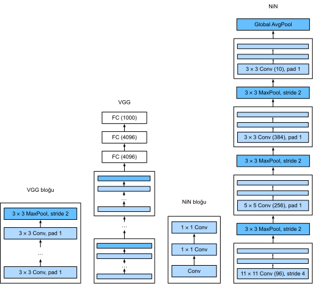

# Ağ İçinde Ağ (Network in Network - NiN)
:label:`sec_nin`

LeNet, AlexNet ve VGG ortak bir tasarım deseni paylaşır: Öznitelikleri bir dizi evrişim ve ortaklama katmanları aracılığıyla *mekansal* yapıdan faydalanarak çıkar ve daha sonra tam bağlı katmanlar aracılığıyla temsilleri sonradan işle. AlexNet ve VGG tarafından LeNet üzerindeki iyileştirmeler, esas olarak bu sonraki ağların bu iki modülü nasıl genişlettiği ve derinleştirdiği konusunda yatmaktadır. Alternatif olarak, tam bağlı katmanları süreç içinde daha önce kullanmayı hayal edebiliriz. Bununla birlikte, yoğun katmanların dikkatsiz kullanımı, temsilin mekansal yapısını tamamen görmezden gelebilir; *ağ içindeki ağ* (*NiN*) blokları burada bir alternatif sunuyor. Çok basit bir anlayışa dayalı olarak önerildiler: Her piksel için kanallarda ayrı ayrı bir MLP kullanmak :cite:`Lin.Chen.Yan.2013`.

## (**NiN Blokları**)

Evrişimli katmanların girdi ve çıktılarının, örneğe, kanala, yüksekliğe ve genişliğe karşılık gelen eksenlere sahip dört boyutlu tensörlerden oluştuğunu hatırlayın. Ayrıca, tam bağlı katmanların girdi ve çıktılarının tipik olarak örneğe ve özniteliğe karşılık gelen iki boyutlu tensörler olduğunu hatırlayın. NiN'in arkasındaki fikir, her piksel konumuna (her yükseklik ve genişlik için) tam bağlı bir katman uygulamaktır. Ağırlıkları her mekansal konum boyunca bağlarsak, bunu bir $1\times 1$ evrişimli katman (:numref:`sec_channels` içinde açıklandığı gibi) veya her piksel konumunda bağımsız olarak hareket eden tam bağlı bir katman olarak düşünebiliriz. Bunu görmenin bir başka yolu da mekansal boyuttaki her elemanın (yükseklik ve genişlik) bir örneğe eşdeğer ve bir kanalın bir özniteliğe eşdeğer olduğunu düşünmektir.

:numref:`fig_nin`, VGG ve NiN arasındaki ana yapısal farklılıkları ve bloklarını göstermektedir. NiN bloğu, bir evrişimli katmandan ve ardından ReLU etkinleştirmeleri ile piksel başına tam bağlı katmanlar olarak hareket eden iki $1\times 1$ evrişimli katmandan oluşur. İlk katmanın evrişim penceresi şekli genellikle kullanıcı tarafından ayarlanır. Sonraki pencere şekilleri $1 \times 1$'e sabitlenir.


:width:`600px`
:label:`fig_nin`

```{.python .input}
from d2l import mxnet as d2l
from mxnet import np, npx
from mxnet.gluon import nn
npx.set_np()

def nin_block(num_channels, kernel_size, strides, padding):
    blk = nn.Sequential()
    blk.add(nn.Conv2D(num_channels, kernel_size, strides, padding,
                      activation='relu'),
            nn.Conv2D(num_channels, kernel_size=1, activation='relu'),
            nn.Conv2D(num_channels, kernel_size=1, activation='relu'))
    return blk
```

```{.python .input}
#@tab pytorch
from d2l import torch as d2l
import torch
from torch import nn

def nin_block(in_channels, out_channels, kernel_size, strides, padding):
    return nn.Sequential(
        nn.Conv2d(in_channels, out_channels, kernel_size, strides, padding),
        nn.ReLU(),
        nn.Conv2d(out_channels, out_channels, kernel_size=1), nn.ReLU(),
        nn.Conv2d(out_channels, out_channels, kernel_size=1), nn.ReLU())
```

```{.python .input}
#@tab tensorflow
from d2l import tensorflow as d2l
import tensorflow as tf

def nin_block(num_channels, kernel_size, strides, padding):
    return tf.keras.models.Sequential([
        tf.keras.layers.Conv2D(num_channels, kernel_size, strides=strides,
                               padding=padding, activation='relu'),
        tf.keras.layers.Conv2D(num_channels, kernel_size=1,
                               activation='relu'),
        tf.keras.layers.Conv2D(num_channels, kernel_size=1,
                               activation='relu')])
```

## [**NiN Modeli**]

Orijinal NiN ağı, AlexNet'ten kısa bir süre sonra önerildi ve açıkçası ondan biraz ilham almıştır. NiN, $11\times 11$, $5\times 5$ ve $3\times 3$ pencere şekilleri ile evrişimli katmanlar kullanır ve karşılık gelen çıktı kanalı sayıları AlexNet'teki ile aynıdır. Her NiN bloğunu, 2'lik bir adım ve $3\times 3$'lük bir pencere şekli ile bir maksimum ortaklama katmanı izler.

NiN ve AlexNet arasındaki önemli bir fark, NiN'in tam bağlı katmanlardan kaçınmasıdır. Bunun yerine NiN, etiket sınıflarının sayısına eşit sayıda çıktı kanalı içeren bir NiN bloğu kullanır ve onun ardından gelen *global* ortalama ortaklama katmanı ile bir logit vektörü oluşturur. NiN'in tasarımının bir avantajı, gerekli model parametrelerinin sayısını önemli ölçüde azaltmasıdır. Bununla birlikte, pratikte, bu tasarım bazen artan model eğitim süresi gerektirir.

```{.python .input}
net = nn.Sequential()
net.add(nin_block(96, kernel_size=11, strides=4, padding=0),
        nn.MaxPool2D(pool_size=3, strides=2),
        nin_block(256, kernel_size=5, strides=1, padding=2),
        nn.MaxPool2D(pool_size=3, strides=2),
        nin_block(384, kernel_size=3, strides=1, padding=1),
        nn.MaxPool2D(pool_size=3, strides=2),
        nn.Dropout(0.5),
        # 10 etiket sınıfı var
        nin_block(10, kernel_size=3, strides=1, padding=1),
        # Global ortalama ortaklama katmanı, pencere şeklini girdinin 
        # yüksekliğine ve genişliğine otomatik olarak ayarlar
        nn.GlobalAvgPool2D(),
        # Dört boyutlu çıktıyı (toplu iş boyutu, 10) 
        # şeklinde iki boyutlu çıktıya dönüştür
        nn.Flatten())
```

```{.python .input}
#@tab pytorch
net = nn.Sequential(
    nin_block(1, 96, kernel_size=11, strides=4, padding=0),
    nn.MaxPool2d(3, stride=2),
    nin_block(96, 256, kernel_size=5, strides=1, padding=2),
    nn.MaxPool2d(3, stride=2),
    nin_block(256, 384, kernel_size=3, strides=1, padding=1),
    nn.MaxPool2d(3, stride=2),
    nn.Dropout(0.5),
    # 10 etiket sınıfı var
    nin_block(384, 10, kernel_size=3, strides=1, padding=1),
    nn.AdaptiveAvgPool2d((1, 1)),
    # Dört boyutlu çıktıyı (toplu iş boyutu, 10) 
    # şeklinde iki boyutlu çıktıya dönüştür
    nn.Flatten())
```

```{.python .input}
#@tab tensorflow
def net():
    return tf.keras.models.Sequential([
        nin_block(96, kernel_size=11, strides=4, padding='valid'),
        tf.keras.layers.MaxPool2D(pool_size=3, strides=2),
        nin_block(256, kernel_size=5, strides=1, padding='same'),
        tf.keras.layers.MaxPool2D(pool_size=3, strides=2),
        nin_block(384, kernel_size=3, strides=1, padding='same'),
        tf.keras.layers.MaxPool2D(pool_size=3, strides=2),
        tf.keras.layers.Dropout(0.5),
        # 10 etiket sınıfı var
        nin_block(10, kernel_size=3, strides=1, padding='same'),
        tf.keras.layers.GlobalAveragePooling2D(),
        tf.keras.layers.Reshape((1, 1, 10)),
        # Dört boyutlu çıktıyı (toplu iş boyutu, 10) 
        # şeklinde iki boyutlu çıktıya dönüştür
        tf.keras.layers.Flatten(),
        ])
```

[**Her bloğun çıktı şeklini**] görmek için bir veri örneği oluşturuyoruz.

```{.python .input}
X = np.random.uniform(size=(1, 1, 224, 224))
net.initialize()
for layer in net:
    X = layer(X)
    print(layer.name, 'cikti sekli:\t', X.shape)
```

```{.python .input}
#@tab pytorch
X = torch.rand(size=(1, 1, 224, 224))
for layer in net:
    X = layer(X)
    print(layer.__class__.__name__,'cikti sekli:\t', X.shape)
```

```{.python .input}
#@tab tensorflow
X = tf.random.uniform((1, 224, 224, 1))
for layer in net().layers:
    X = layer(X)
    print(layer.__class__.__name__,'cikti sekli:\t', X.shape)
```

## [**Eğitim**]

Daha önce olduğu gibi modeli eğitmek için Fashion-MNIST'i kullanıyoruz. NiN'in eğitimi AlexNet ve VGG'ninkine benzerdir.

```{.python .input}
#@tab all
lr, num_epochs, batch_size = 0.1, 10, 128
train_iter, test_iter = d2l.load_data_fashion_mnist(batch_size, resize=224)
d2l.train_ch6(net, train_iter, test_iter, num_epochs, lr, d2l.try_gpu())
```

## Özet

* NiN, evrişimli bir tabaka ve birden fazla $1\times 1$ evrişimli katmanlardan oluşan bloklar kullanır. Bu, piksel başına daha fazla doğrusal olmayan işleve izin vermek için evrişimli yığın içinde kullanılabilir.
* NiN, tam bağlı katmanları kaldırır ve onları kanal sayısını istenen çıktı sayısına indirdikten sonra (örneğin, Fashion-MNIST için 10) küresel ortalama ortaklama ile yer değiştirir (yani, tüm konumlar üzerinden toplar).
* Tam bağlı katmanların çıkarılması aşırı öğrenmeyi azaltır. NiN önemli ölçüde daha az parametreye sahiptir.
* NiN tasarımı, müteakip birçok CNN tasarımını etkiledi.

## Alıştırmalar

1. Sınıflandırma doğruluğunu artırmak için hiper parametreleri ayarlayın.
1. NiN bloğunda neden iki $1\times 1$ evrişimli katman var? Bunlardan birini çıkarın, deneysel olguları gözlemleyin ve çözümleyin.
1. NiN için kaynak kullanımını hesaplayın.
    1. Parametrelerin sayısı nedir?
    1. Hesaplama miktarı nedir?
    1. Eğitim sırasında ihtiyaç duyulan bellek miktarı nedir?
    1. Tahmin sırasında gereken bellek miktarı nedir?
1. $384 \times 5 \times 5$ gösterimini bir adımda $10 \times 5 \times 5$ gösterimine indirgeme ile ilgili olası sorunlar nelerdir?

:begin_tab:`mxnet`
[Tartışmalar](https://discuss.d2l.ai/t/79)
:end_tab:

:begin_tab:`pytorch`
[Tartışmalar](https://discuss.d2l.ai/t/80)
:end_tab:

:begin_tab:`tensorflow`
[Tartışmalar](https://discuss.d2l.ai/t/332)
:end_tab:
