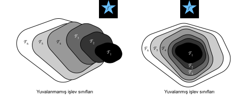
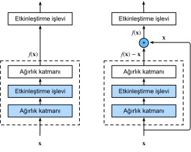
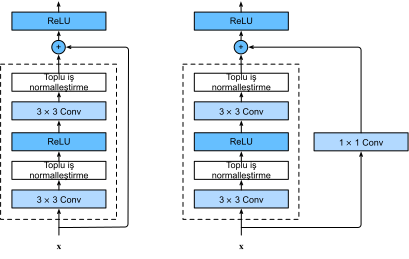
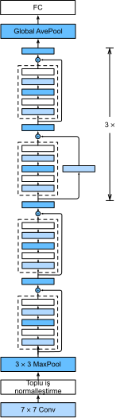

# Artık Ağlar (ResNet)
:label:`sec_resnet`

Giderek daha derin ağlar tasarlarken, katman eklemenin ağın karmaşıklığını ve ifade gücünü nasıl artırabileceğini anlamak zorunluluk haline gelmektedir. Daha da önemlisi, katmanlar ekleyerek ağları sadece farklı olmaktan çok daha açıklayıcı hale getiren ağları tasarlama yeteneğidir. Biraz ilerleme sağlamak için bir parça matematiğe ihtiyacımız var.

## Fonksiyon Sınıfları

Belirli bir ağ mimarisinin (öğrenme hızları ve diğer hiperparametre ayarları ile birlikte) ulaşabileceği işlevlerin sınıfı olan $\mathcal{F}$'i düşünün. Yani, $f \in \mathcal{F}$'un tümü için uygun bir veri kümesi üzerinde eğitim yoluyla elde edilebilecek bazı parametreler (örneğin, ağırlıklar ve ek girdiler) vardır. $f^*$'in gerçekten bulmak istediğimiz “gerçek” fonksiyon olduğunu varsayalım. Eğer $\mathcal{F}$'te ise, iyi durumdayız ancak tipik olarak bu kadar şanslı olmayacağız. Bunun yerine, $\mathcal{F}$ içinde en iyi aday olan herhangi bir $f^*_\mathcal{F}$ bulmaya çalışacağız. Örneğin, $\mathbf{X}$ öznitelikleri ve $\mathbf{y}$ etiketleri olan bir veri kümesi göz önüne alındığında, aşağıdaki eniyileme sorununu çözerek aday bulmayı deneyebiliriz:

$$f^*_\mathcal{F} \stackrel{\mathrm{def}}{=} \mathop{\mathrm{argmin}}_f L(\mathbf{X}, \mathbf{y}, f) \text{ subject to } f \in \mathcal{F}.$$

Sadece farklı ve daha güçlü bir mimari tasarlarsak $\mathcal{F}'$ daha iyi bir sonuca varmamız gerektiğini varsaymak mantıklıdır. Başka bir deyişle, $f^*_{\mathcal{F}'}$'nin $f^*_{\mathcal{F}}$'dan “daha iyi” olmasını bekleriz. Ancak, eğer $\mathcal{F} \not\subseteq \mathcal{F}'$ ise, bunun gerçekleşmesi gerektiğinin garantisi yoktur. Aslında, $f^*_{\mathcal{F}'}$ daha kötü olabilir. :numref:`fig_functionclasses`'de gösterildiği gibi, iç içe olmayan işlev sınıfları için, daha büyük bir işlev sınıfı her zaman “gerçek” işlevi $f^*$'ye yakınlaşmaz. Örneğin, :numref:`fig_functionclasses`'in solunda $\mathcal{F}_3$'ün $f^*$'a $\mathcal{F}_1$'den daha yakın olmasına rağmen, $\mathcal{F}_6$ uzaklaşıyor ve karmaşıklığın daha da arttırılmasının $f^*$'ye mesafeyi azaltabileceğinin garantisi yoktur. İç içe işlev sınıfları ile, $\mathcal{F}_1 \subseteq \ldots \subseteq \mathcal{F}_6$, burada :numref:`fig_functionclasses`'ın sağında gösteriliyor, yukarıda bahsedilen iç içe olmayan işlev sınıfları sorunundan kaçınabilirsiniz.


:label:`fig_functionclasses`

Böylece, daha büyük fonksiyon sınıfları daha küçük olanları içeriyorsa, onları artırmanın ağın açıklayıcı gücünü kesinlikle arttırdığını garanti ederiz. Derin sinir ağları için, yeni eklenen katmanı bir birim fonksiyonu $f(\mathbf{x}) = \mathbf{x}$ olarak eğitebilirsek, yeni model orijinal model kadar etkili olacaktır. Yeni model, eğitim veri kümesine uyacak şekilde daha iyi bir çözüm elde edebileceğinden, eklenen katman eğitim hatalarını azaltmayı kolaylaştırabilir.

Bu çok derin bilgisayarla görme modelleri üzerinde çalışırken He ve diğerlerinin :cite:`He.Zhang.Ren.ea.2016` üstünde düşündüğü sorudur. Önerilen *artık ağ*ın (*ResNet*) özünde, her ek katmanın kendi elemanlarıdan biri olarak birim işlevini daha kolaylıkla içermesi gerektiği fikri vardır. Bu fikirler oldukça derindi, fakat şaşırtıcı derecede basit bir çözüme ulaştılar; *artık blok*. ResNet, 2015 yılında ImageNet Büyük Ölçekli Görsel Tanıma Yarışmasını kazandı. Tasarımın derin sinir ağlarının nasıl kurulacağı üzerinde derin bir etkisi oldu.

## Kalıntı Blokları

:numref:`fig_residual_block`'te gösterildiği gibi, bir sinir ağının yerel bir bölümüne odaklanalım. Girişi $\mathbf{x}$ ile belirtin. Öğrenerek elde etmek istediğimiz altta yatan eşlemenin üstteki aktivasyon işlevine giriş olarak kullanılacak $f(\mathbf{x})$ olduğunu varsayıyoruz. :numref:`fig_residual_block`'ün solunda, noktalı çizgi kutusundaki kısım doğrudan $f(\mathbf{x})$ eşlemeyi öğrenmelidir. Sağda, noktalı çizgi kutusundaki bölümün, artık bloğun adını nasıl elde ettiği *artık eşleme* $f(\mathbf{x}) - \mathbf{x}$'i öğrenmesi gerekir. Kimlik eşlemesi $f(\mathbf{x}) = \mathbf{x}$ istenen altta yatan eşleme ise, artık eşlemeyi öğrenmek daha kolaydır: Sadece noktalı çizgi kutusundaki üst ağırlık katmanının ağırlıklarını ve önyargılarını (örn. tam bağlı katman ve kıvrımsal katman) sıfıra itmemiz gerekir. :numref:`fig_residual_block`'teki doğru şekil, ResNet'in *artık bloğu* rezidüel bloğunu göstermektedir; burada $\mathbf{x}$ katman girişini ekleme operatörüne taşıyan düz çizgiye *artık bağlantı* (veya *kısayol bağlantısı*) denir. Artık bloklarla girişler, katmanlar arasında kalan bağlantılar üzerinden daha hızlı yayılabilir.


:label:`fig_residual_block`

ResNet, VGG'nin tam $3\times 3$ kıvrımsal katman tasarımını takip eder. Artık blok, aynı sayıda çıkış kanalına sahip iki $3\times 3$ evrimsel katmana sahiptir. Her bir kıvrımsal katman, bir toplu normalleştirme katmanı ve bir ReLU etkinleştirme işlevi izler. Ardından, bu iki evrişim işlemini atlayıp girişi doğrudan son ReLU etkinleştirme işlevinden önce ekleriz. Bu tür bir tasarım, iki kıvrımsal katmanın çıktısının girdiyle aynı şekle sahip olmasını gerektirir, böylece birlikte eklenebilirler. Kanal sayısını değiştirmek istiyorsak, girişi ekleme işlemi için istenen şekle dönüştürmek için ek bir $1\times 1$ evrimsel katman tanıtmamız gerekir. Aşağıdaki koda bir göz atalım.

```{.python .input}
from d2l import mxnet as d2l
from mxnet import np, npx
from mxnet.gluon import nn
npx.set_np()

class Residual(nn.Block):  #@save
    """The Residual block of ResNet."""
    def __init__(self, num_channels, use_1x1conv=False, strides=1, **kwargs):
        super().__init__(**kwargs)
        self.conv1 = nn.Conv2D(num_channels, kernel_size=3, padding=1,
                               strides=strides)
        self.conv2 = nn.Conv2D(num_channels, kernel_size=3, padding=1)
        if use_1x1conv:
            self.conv3 = nn.Conv2D(num_channels, kernel_size=1,
                                   strides=strides)
        else:
            self.conv3 = None
        self.bn1 = nn.BatchNorm()
        self.bn2 = nn.BatchNorm()

    def forward(self, X):
        Y = npx.relu(self.bn1(self.conv1(X)))
        Y = self.bn2(self.conv2(Y))
        if self.conv3:
            X = self.conv3(X)
        return npx.relu(Y + X)
```

```{.python .input}
#@tab pytorch
from d2l import torch as d2l
import torch
from torch import nn
from torch.nn import functional as F

class Residual(nn.Module):  #@save
    """The Residual block of ResNet."""
    def __init__(self, input_channels, num_channels,
                 use_1x1conv=False, strides=1):
        super().__init__()
        self.conv1 = nn.Conv2d(input_channels, num_channels,
                               kernel_size=3, padding=1, stride=strides)
        self.conv2 = nn.Conv2d(num_channels, num_channels,
                               kernel_size=3, padding=1)
        if use_1x1conv:
            self.conv3 = nn.Conv2d(input_channels, num_channels,
                                   kernel_size=1, stride=strides)
        else:
            self.conv3 = None
        self.bn1 = nn.BatchNorm2d(num_channels)
        self.bn2 = nn.BatchNorm2d(num_channels)
        self.relu = nn.ReLU(inplace=True)

    def forward(self, X):
        Y = F.relu(self.bn1(self.conv1(X)))
        Y = self.bn2(self.conv2(Y))
        if self.conv3:
            X = self.conv3(X)
        Y += X
        return F.relu(Y)
```

```{.python .input}
#@tab tensorflow
from d2l import tensorflow as d2l
import tensorflow as tf

class Residual(tf.keras.Model):  #@save
    """The Residual block of ResNet."""
    def __init__(self, num_channels, use_1x1conv=False, strides=1):
        super().__init__()
        self.conv1 = tf.keras.layers.Conv2D(
            num_channels, padding='same', kernel_size=3, strides=strides)
        self.conv2 = tf.keras.layers.Conv2D(
            num_channels, kernel_size=3, padding='same')
        self.conv3 = None
        if use_1x1conv:
            self.conv3 = tf.keras.layers.Conv2D(
                num_channels, kernel_size=1, strides=strides)
        self.bn1 = tf.keras.layers.BatchNormalization()
        self.bn2 = tf.keras.layers.BatchNormalization()

    def call(self, X):
        Y = tf.keras.activations.relu(self.bn1(self.conv1(X)))
        Y = self.bn2(self.conv2(Y))
        if self.conv3 is not None:
            X = self.conv3(X)
        Y += X
        return tf.keras.activations.relu(Y)
```

Bu kod iki tür ağ oluşturur: biri, `use_1x1conv=False`'te ReLU doğrusal olmayanlığını uygulamadan önce çıktıya girdiyi eklediğimiz ve eklemeden önce $1 \times 1$ evrişim vasıtasıyla kanalları ve çözünürlüğü ayarladığımız bir yer. :numref:`fig_resnet_block` şunu göstermektedir:


:label:`fig_resnet_block`

Şimdi giriş ve çıkışın aynı şekle sahip olduğu bir duruma bakalım.

```{.python .input}
blk = Residual(3)
blk.initialize()
X = np.random.uniform(size=(4, 3, 6, 6))
blk(X).shape
```

```{.python .input}
#@tab pytorch
blk = Residual(3,3)
X = torch.rand(4, 3, 6, 6)
Y = blk(X)
Y.shape
```

```{.python .input}
#@tab tensorflow
blk = Residual(3)
X = tf.random.uniform((4, 6, 6, 3))
Y = blk(X)
Y.shape
```

Ayrıca çıkış kanallarının sayısını artırırken çıkış yüksekliğini ve genişliğini yarıya indirme seçeneğine de sahibiz.

```{.python .input}
blk = Residual(6, use_1x1conv=True, strides=2)
blk.initialize()
blk(X).shape
```

```{.python .input}
#@tab pytorch
blk = Residual(3,6, use_1x1conv=True, strides=2)
blk(X).shape
```

```{.python .input}
#@tab tensorflow
blk = Residual(6, use_1x1conv=True, strides=2)
blk(X).shape
```

## ResNet Modeli

ResNet'in ilk iki katmanı, daha önce tarif ettiğimiz GoogLeNet'inkiyle aynıdır: 64 çıkış kanalı ile $7\times 7$ evrimsel katman ve 2'lik bir adım ile $3\times 3$ maksimum havuzlama katmanı takip eder. Fark, ResNet'teki her konvolüsyonel katmandan sonra eklenen toplu normalleştirme tabakasıdır.

```{.python .input}
net = nn.Sequential()
net.add(nn.Conv2D(64, kernel_size=7, strides=2, padding=3),
        nn.BatchNorm(), nn.Activation('relu'),
        nn.MaxPool2D(pool_size=3, strides=2, padding=1))
```

```{.python .input}
#@tab pytorch
b1 = nn.Sequential(nn.Conv2d(1, 64, kernel_size=7, stride=2, padding=3),
                   nn.BatchNorm2d(64), nn.ReLU(),
                   nn.MaxPool2d(kernel_size=3, stride=2, padding=1))
```

```{.python .input}
#@tab tensorflow
b1 = tf.keras.models.Sequential([
    tf.keras.layers.Conv2D(64, kernel_size=7, strides=2, padding='same'),
    tf.keras.layers.BatchNormalization(),
    tf.keras.layers.Activation('relu'),
    tf.keras.layers.MaxPool2D(pool_size=3, strides=2, padding='same')])
```

GoogLeNet, Inception bloklarından oluşan dört modül kullanır. Bununla birlikte, ResNet, her biri aynı sayıda çıkış kanalına sahip birkaç artık blok kullanan artık bloklardan oluşan dört modül kullanır. İlk modüldeki kanal sayısı, giriş kanallarının sayısı ile aynıdır. 2 adımlı maksimum bir havuzlama tabakası kullanıldığından, yüksekliği ve genişliği azaltmak gerekli değildir. Sonraki modüllerin her biri için ilk artık blokta, kanal sayısı önceki modülünkine kıyasla iki katına çıkarılır ve yükseklik ve genişlik yarıya indirilir.

Şimdi, bu modülü uyguluyoruz. İlk modülde özel işlemin gerçekleştirildiğini unutmayın.

```{.python .input}
def resnet_block(num_channels, num_residuals, first_block=False):
    blk = nn.Sequential()
    for i in range(num_residuals):
        if i == 0 and not first_block:
            blk.add(Residual(num_channels, use_1x1conv=True, strides=2))
        else:
            blk.add(Residual(num_channels))
    return blk
```

```{.python .input}
#@tab pytorch
def resnet_block(input_channels, num_channels, num_residuals,
                 first_block=False):
    blk = []
    for i in range(num_residuals):
        if i == 0 and not first_block:
            blk.append(Residual(input_channels, num_channels,
                                use_1x1conv=True, strides=2))
        else:
            blk.append(Residual(num_channels, num_channels))
    return blk
```

```{.python .input}
#@tab tensorflow
class ResnetBlock(tf.keras.layers.Layer):
    def __init__(self, num_channels, num_residuals, first_block=False,
                 **kwargs):
        super(ResnetBlock, self).__init__(**kwargs)
        self.residual_layers = []
        for i in range(num_residuals):
            if i == 0 and not first_block:
                self.residual_layers.append(
                    Residual(num_channels, use_1x1conv=True, strides=2))
            else:
                self.residual_layers.append(Residual(num_channels))

    def call(self, X):
        for layer in self.residual_layers.layers:
            X = layer(X)
        return X
```

Ardından, tüm modülleri ResNet'e ekliyoruz. Burada, her modül için iki artık blok kullanılır.

```{.python .input}
net.add(resnet_block(64, 2, first_block=True),
        resnet_block(128, 2),
        resnet_block(256, 2),
        resnet_block(512, 2))
```

```{.python .input}
#@tab pytorch
b2 = nn.Sequential(*resnet_block(64, 64, 2, first_block=True))
b3 = nn.Sequential(*resnet_block(64, 128, 2))
b4 = nn.Sequential(*resnet_block(128, 256, 2))
b5 = nn.Sequential(*resnet_block(256, 512, 2))
```

```{.python .input}
#@tab tensorflow
b2 = ResnetBlock(64, 2, first_block=True)
b3 = ResnetBlock(128, 2)
b4 = ResnetBlock(256, 2)
b5 = ResnetBlock(512, 2)
```

Son olarak, tıpkı GoogLeNet gibi küresel bir ortalama havuzlama katmanı ekliyoruz ve ardından tam bağlı katman çıktısını izliyoruz.

```{.python .input}
net.add(nn.GlobalAvgPool2D(), nn.Dense(10))
```

```{.python .input}
#@tab pytorch
net = nn.Sequential(b1, b2, b3, b4, b5,
                    nn.AdaptiveAvgPool2d((1,1)),
                    nn.Flatten(), nn.Linear(512, 10))
```

```{.python .input}
#@tab tensorflow
# Recall that we define this as a function so we can reuse later and run it
# within `tf.distribute.MirroredStrategy`'s scope to utilize various
# computational resources, e.g. GPUs. Also note that even though we have
# created b1, b2, b3, b4, b5 but we will recreate them inside this function's
# scope instead
def net():
    return tf.keras.Sequential([
        # The following layers are the same as b1 that we created earlier
        tf.keras.layers.Conv2D(64, kernel_size=7, strides=2, padding='same'),
        tf.keras.layers.BatchNormalization(),
        tf.keras.layers.Activation('relu'),
        tf.keras.layers.MaxPool2D(pool_size=3, strides=2, padding='same'),
        # The following layers are the same as b2, b3, b4, and b5 that we
        # created earlier
        ResnetBlock(64, 2, first_block=True),
        ResnetBlock(128, 2),
        ResnetBlock(256, 2),
        ResnetBlock(512, 2),
        tf.keras.layers.GlobalAvgPool2D(),
        tf.keras.layers.Dense(units=10)])
```

Her modülde 4 evrimsel katman vardır ($1\times 1$ evrimsel katman hariç). İlk $7\times 7$ konvolüsyonel tabaka ve son tam bağlı tabaka ile birlikte toplamda 18 katman vardır. Bu nedenle, bu model yaygın olarak ResNet-18 olarak bilinir. Modülde farklı sayıda kanal ve artık blokları yapılandırarak, daha derin 152 katmanlı ResNet-152 gibi farklı ResNet modelleri oluşturabiliriz. ResNet'in ana mimarisi GoogLeNet'e benzer olsa da, ResNet'in yapısı daha basit ve daha kolaydır. Tüm bu faktörler ResNet'in hızlı ve yaygın kullanımı ile sonuçlandı. :numref:`fig_resnet18` tam ResNet-18'i tasvir ediyor.


:label:`fig_resnet18`

ResNet'i eğitmeden önce, giriş şeklinin ResNet'teki farklı modüllerde nasıl değiştiğini gözlemleyelim. Önceki tüm mimarilerinde olduğu gibi, çözünürlük azalırken, kanal sayısı küresel ortalama havuzlama katmanının tüm özellikleri topladığı noktaya kadar artar.

```{.python .input}
X = np.random.uniform(size=(1, 1, 224, 224))
net.initialize()
for layer in net:
    X = layer(X)
    print(layer.name, 'output shape:\t', X.shape)
```

```{.python .input}
#@tab pytorch
X = torch.rand(size=(1, 1, 224, 224))
for layer in net:
    X = layer(X)
    print(layer.__class__.__name__,'output shape:\t', X.shape)
```

```{.python .input}
#@tab tensorflow
X = tf.random.uniform(shape=(1, 224, 224, 1))
for layer in net().layers:
    X = layer(X)
    print(layer.__class__.__name__,'output shape:\t', X.shape)
```

## Eğitim

ResNet'i moda-MNIST veri kümesi üzerinde eğitiyoruz, tıpkı eskisi gibi.

```{.python .input}
#@tab all
lr, num_epochs, batch_size = 0.05, 10, 256
train_iter, test_iter = d2l.load_data_fashion_mnist(batch_size, resize=96)
d2l.train_ch6(net, train_iter, test_iter, num_epochs, lr)
```

## Özet

* İç içe işlev sınıfları istenir. Derin sinir ağlarında bir kimlik fonksiyonu olarak ek bir katman öğrenmek (bu aşırı bir durum olsa da) kolaylaştırılmalıdır.
* Artık eşleme, ağırlık katmanındaki parametreleri sıfıra itmek gibi kimlik işlevini daha kolay öğrenebilir.
* Kalıntı blokları ile etkili bir derin sinir ağı eğitebiliriz. Girişler, katmanlar arasında kalan bağlantılar üzerinden daha hızlı yayılabilir.
* ResNet, hem evrimsel hem de sıralı doğa için müteakip derin sinir ağlarının tasarımı üzerinde büyük bir etkiye sahipti.

## Alıştırmalar

1. :numref:`fig_inception`'teki Inception bloğu ile artık blok arasındaki büyük farklar nelerdir? Inception bloğundaki bazı yolları kaldırdıktan sonra birbirleriyle nasıl ilişkilidir?
1. Farklı varyantları uygulamak için ResNet kağıt :cite:`He.Zhang.Ren.ea.2016` Tablo 1'e bakın.
1. Daha derin ağlar için ResNet, model karmaşıklığını azaltmak için bir “darboğaz” mimarisi sunar. Uygulamaya çalış.
1. ResNet'in sonraki sürümlerinde yazarlar “evrim, toplu normalleştirme ve aktivasyon” yapısını “toplu normalleştirme, aktivasyon ve evrim” yapısına değiştirdiler. Bu gelişmeyi kendiniz yapın. Ayrıntılar için :cite:`He.Zhang.Ren.ea.2016*1`'teki Şekil 1'e bakın.
1. İşlev sınıfları iç içe olsa bile neden işlevlerin karmaşıklığını bağlamadan artıramıyoruz?

:begin_tab:`mxnet`
[Tartışmalar](https://discuss.d2l.ai/t/85)
:end_tab:

:begin_tab:`pytorch`
[Tartışmalar](https://discuss.d2l.ai/t/86)
:end_tab:

:begin_tab:`tensorflow`
[Tartışmalar](https://discuss.d2l.ai/t/333)
:end_tab:
