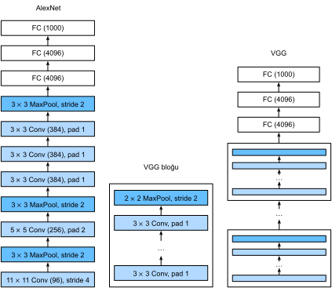

# Blokları Kullanan Ağlar (VGG)
:label:`sec_vgg`

AlexNet derin CNN'lerin iyi sonuçlar elde edebileceğine dair deneysel kanıtlar sunarken, yeni ağlar tasarlamada sonraki araştırmacılara rehberlik etmek için genel bir şablon sağlamadı. Aşağıdaki bölümlerde, derin ağları tasarlamak için yaygın olarak kullanılan çeşitli sezgisel kavramları tanıtacağız.

Bu alandaki ilerleme, mühendislerin transistörleri yerleştirilmede mantıksal elemanlardan mantık bloklarına geçtiği yonga tasarımına benzemektedir. Benzer şekilde, sinir ağı mimarilerinin tasarımı, araştırmacıların bireysel nöron tabanlı düşünmekten tam katmanlara ve şimdi de katmanların kalıplarını tekrarlayan bloklara geçerek daha soyut bir hale gelmişti.

Blokları kullanma fikri ilk olarak Oxford Üniversitesi'ndeki [Görsel Geometri Grubu](http://www.robots.ox.ac.uk/~vgg/)'nun (Visual Geometry Group  - VGG), kendi adını taşıyan *VGG* ağında ortaya çıkmıştır. Bu tekrarlanan yapıları, döngüler ve alt programlar kullanarak herhangi bir modern derin öğrenme çerçevesi ile kodda uygulamak kolaydır.

## (**VGG Blokları**)
:label:`subsec_vgg-blocks`

Klasik CNN'lerin temel yapı taşı aşağıdakilerin bir dizisidir: (i) Çözünürlüğü korumak için dolgulu bir evrişimli katman, (ii) ReLU gibi bir doğrusal olmayan işlev, (iii) Maksimum ortaklama katmanı gibi bir ortaklama katmanı. Bir VGG bloğu, uzamsal örnek seyreltme için bir maksimum ortaklama katmanı izleyen bir evrişimli katman dizisinden oluşur. Orijinal VGG makalesinde :cite:`Simonyan.Zisserman.2014`, yazarlar $3\times3$ çekirdeklerle evrişim (yüksekliği ve genişliği aynı tutarak) ve 2 birim uzun adımlı $2 \times 2$ maksimum ortaklama (her bloktan sonra çözünürlüğü yarıya indirerek) kullandılar. Aşağıdaki kodda, bir VGG bloğu uygulamak için `vgg_block` adlı bir işlev tanımlıyoruz. 

:begin_tab:`mxnet,tensorflow`
İşlev, evrişimli katmanların sayısı `num_convs`'a ve çıktı kanallarının sayısı `num_channels`'a karşılık gelen iki argüman alır.
:end_tab:

:begin_tab:`pytorch`
İşlev, `num_convs` evrişim katmanlarının sayısına, `in_channels` girdi kanallarının sayısına ve `out_channels` çıktı kanallarının sayısına karşılık gelen üç argüman alır.
:end_tab:

```{.python .input}
from d2l import mxnet as d2l
from mxnet import np, npx
from mxnet.gluon import nn
npx.set_np()

def vgg_block(num_convs, num_channels):
    blk = nn.Sequential()
    for _ in range(num_convs):
        blk.add(nn.Conv2D(num_channels, kernel_size=3,
                          padding=1, activation='relu'))
    blk.add(nn.MaxPool2D(pool_size=2, strides=2))
    return blk
```

```{.python .input}
#@tab pytorch
from d2l import torch as d2l
import torch
from torch import nn

def vgg_block(num_convs, in_channels, out_channels):
    layers = []
    for _ in range(num_convs):
        layers.append(nn.Conv2d(in_channels, out_channels,
                                kernel_size=3, padding=1))
        layers.append(nn.ReLU())
        in_channels = out_channels
    layers.append(nn.MaxPool2d(kernel_size=2,stride=2))
    return nn.Sequential(*layers)
```

```{.python .input}
#@tab tensorflow
from d2l import tensorflow as d2l
import tensorflow as tf

def vgg_block(num_convs, num_channels):
    blk = tf.keras.models.Sequential()
    for _ in range(num_convs):
        blk.add(tf.keras.layers.Conv2D(num_channels,kernel_size=3,
                                    padding='same',activation='relu'))
    blk.add(tf.keras.layers.MaxPool2D(pool_size=2, strides=2))
    return blk
```

## [**VGG Ağı**]

AlexNet ve LeNet gibi, VGG ağı iki kısma bölünebilir: Birincisi çoğunlukla evrişim ve ortaklama katmanlarından ve ikincisi tam bağlı katmanlardan oluşur. Bu :numref:`fig_vgg` içinde tasvir edilmiştir.


:width:`400px`
:label:`fig_vgg`

Ağın evrişimli kısmı, :numref:`fig_vgg` içindeki gösterilen (`vgg_block` işlevinde de tanımlanmıştır) birkaç VGG bloğunu arka arkaya bağlar. Aşağıdaki `conv_arch` değişken, her biri iki değer içeren bir çokuzlu (blok başına bir) listesinden oluşur: Evrişimli katmanların sayısı ve çıktı kanallarının sayısı, ki tam olarak `vgg_block` işlevini çağırmak için gerekli argümanlardır. VGG ağının tam bağlı kısmı AlexNet'te kapsananla aynıdır.

Orijinal VGG ağında, ilk ikisinin her birinin bir evrişimli tabakaya sahip olduğu ve sonraki üçünün her birinin iki evrişimli katman içerdiği 5 evrişimli blok vardı. İlk blokta 64 çıktı kanalı vardır ve sonraki her blok, bu sayı 512'ye ulaşıncaya kadar çıktı kanalı sayısını iki katına çıkarır. Bu ağ 8 evrişimli katman ve 3 tam bağlı katman kullandığından, genellikle VGG-11 olarak adlandırılır.

```{.python .input}
#@tab all
conv_arch = ((1, 64), (1, 128), (2, 256), (2, 512), (2, 512))
```

Aşağıdaki kodda VGG-11'i uygulanıyor. Bu, `conv_arch` üzerinde bir -for- döngüsü yürütme gibi basit bir konudur.

```{.python .input}
def vgg(conv_arch):
    net = nn.Sequential()
    # Evrişimli kısım
    for (num_convs, num_channels) in conv_arch:
        net.add(vgg_block(num_convs, num_channels))
    # Tam bağlı kısım
    net.add(nn.Dense(4096, activation='relu'), nn.Dropout(0.5),
            nn.Dense(4096, activation='relu'), nn.Dropout(0.5),
            nn.Dense(10))
    return net

net = vgg(conv_arch)
```

```{.python .input}
#@tab pytorch
def vgg(conv_arch):
    conv_blks = []
    in_channels = 1
    # Evrişimli kısım
    for (num_convs, out_channels) in conv_arch:
        conv_blks.append(vgg_block(num_convs, in_channels, out_channels))
        in_channels = out_channels

    return nn.Sequential(
        *conv_blks, nn.Flatten(),
        # Tam bağlı kısım
        nn.Linear(out_channels * 7 * 7, 4096), nn.ReLU(), nn.Dropout(0.5),
        nn.Linear(4096, 4096), nn.ReLU(), nn.Dropout(0.5),
        nn.Linear(4096, 10))

net = vgg(conv_arch)
```

```{.python .input}
#@tab tensorflow
def vgg(conv_arch):
    net = tf.keras.models.Sequential()
    # Evrişimli kısım
    for (num_convs, num_channels) in conv_arch:
        net.add(vgg_block(num_convs, num_channels))
    # Tam bağlı kısım
    net.add(tf.keras.models.Sequential([
        tf.keras.layers.Flatten(),
        tf.keras.layers.Dense(4096, activation='relu'),
        tf.keras.layers.Dropout(0.5),
        tf.keras.layers.Dense(4096, activation='relu'),
        tf.keras.layers.Dropout(0.5),
        tf.keras.layers.Dense(10)]))
    return net

net = vgg(conv_arch)
```

Daha sonra, [**her katmanın çıktı şeklini gözlemlemek için**] 224'lik yüksekliğe ve genişliğe sahip tek kanallı bir veri örneği oluşturacağız.

```{.python .input}
net.initialize()
X = np.random.uniform(size=(1, 1, 224, 224))
for blk in net:
    X = blk(X)
    print(blk.name, 'output shape:\t', X.shape)
```

```{.python .input}
#@tab pytorch
X = torch.randn(size=(1, 1, 224, 224))
for blk in net:
    X = blk(X)
    print(blk.__class__.__name__,'output shape:\t',X.shape)
```

```{.python .input}
#@tab tensorflow
X = tf.random.uniform((1, 224, 224, 1))
for blk in net.layers:
    X = blk(X)
    print(blk.__class__.__name__,'output shape:\t', X.shape)
```

Gördüğünüz gibi, her blokta yüksekliği ve genişliği yarıya indiriyoruz, nihayet ağın tam bağlı kısmı tarafından işleme için temsilleri düzleştirmeden önce 7'lik bir yüksekliğe ve genişliğe ulaşıyoruz.

## Eğitim

[**VGG-11 AlexNet'ten hesaplamalı olarak daha ağır olduğundan, daha az sayıda kanala sahip bir ağ oluşturuyoruz.**] Bu, Fashion-MNIST üzerinde eğitim için fazlasıyla yeterlidir.

```{.python .input}
#@tab mxnet, pytorch
ratio = 4
small_conv_arch = [(pair[0], pair[1] // ratio) for pair in conv_arch]
net = vgg(small_conv_arch)
```

```{.python .input}
#@tab tensorflow
ratio = 4
small_conv_arch = [(pair[0], pair[1] // ratio) for pair in conv_arch]
# Recall that this has to be a function that will be passed to
# `d2l.train_ch6()` so that model building/compiling need to be within
# `strategy.scope()` in order to utilize the CPU/GPU devices that we have
net = lambda: vgg(small_conv_arch)
```

Biraz daha büyük bir öğrenme hızı kullanmanın haricinde, [**model eğitim**] süreci :numref:`sec_alexnet` içindeki AlexNet'e benzerdir.

```{.python .input}
#@tab all
lr, num_epochs, batch_size = 0.05, 10, 128
train_iter, test_iter = d2l.load_data_fashion_mnist(batch_size, resize=224)
d2l.train_ch6(net, train_iter, test_iter, num_epochs, lr, d2l.try_gpu())
```

## Özet

* VGG-11 yeniden kullanılabilir evrişimli bloklar kullanarak bir ağ oluşturur. Farklı VGG modelleri, her bloktaki evrişimli katman ve çıktı kanallarının sayısındaki farklılıklarla tanımlanabilir.
* Blokların kullanımı, ağ tanımının çok sıkıştırılmış temsillerine yol açar. Karmaşık ağların verimli tasarımını sağlar.
* Simonyan ve Ziserman, VGG makalelerinde çeşitli mimarilerle deneyler yaptılar. Özellikle, derin ve dar evrişimlerin (yani $3 \times 3$) birkaç katmanının daha az sayıda geniş evrişimli katmandan daha etkili olduğunu buldular.

## Alıştırmalar

1. Katmanların boyutlarını yazdırırken 11 yerine sadece 8 sonuç gördük. Kalan 3 katman bilgisi nereye gitti?
1. AlexNet ile karşılaştırıldığında, VGG hesaplama açısından çok daha yavaştır ve ayrıca daha fazla GPU belleğine ihtiyaç duyar. Bunun nedenlerini analiz edin.
1. Fashion-MNIST içindeki imgelerin yüksekliğini ve genişliğini 224'ten 96'ya değiştirmeyi deneyin. Bunun deneyler üzerinde ne etkisi olur?
1. VGG-16 veya VGG-19 gibi diğer yaygın modelleri oluşturmak için VGG makalesindeki :cite:`Simonyan.Zisserman.2014` Tablo 1'e bakın.

:begin_tab:`mxnet`
[Tartışmalar](https://discuss.d2l.ai/t/77)
:end_tab:

:begin_tab:`pytorch`
[Tartışmalar](https://discuss.d2l.ai/t/78)
:end_tab:

:begin_tab:`tensorflow`
[Tartışmalar](https://discuss.d2l.ai/t/277)
:end_tab:
