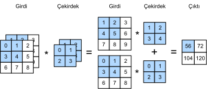
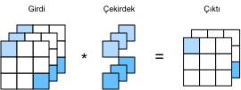

# Çoklu Girdi ve Çoklu Çıktı Kanalları
:label:`sec_channels`

Her imgeyi :numref:`subsec_why-conv-channels` içinde birden fazla kanal (örneğin, renkli görüntüler kırmızı, yeşil ve mavi miktarını belirtmek için standart RGB kanallarına sahiptir) için evrişimli katmanlar tarif etmişken, şimdiye kadar, tüm sayısal örneklerimizi sadece tek bir girdi ve tek bir çıktı kanalı kullanarak basitleştirdik. Bu, girdilerimizi, evrişim çekirdeklerini ve çıktılarımızı iki boyutlu tensörler olarak düşünmemizi sağladı.

Bu karışıma kanal eklediğimizde, girdilerimiz ve gizli temsillerimiz üç boyutlu tensörler haline gelir. Örneğin, her RGB girdi imgesi $3\times h\times w$ şeklindedir. 3 uzunluklu bu eksene, *kanal* boyutu olarak atıfta bulunuyoruz. Bu bölümde, birden fazla girdi ve birden fazla çıktı kanalı içeren evrişim çekirdeklerine daha derin bir bakış atacağız.

## Çoklu Girdi Kanalları

Girdi verileri birden çok kanal içerdiğinde, girdi verileriyle aynı sayıda girdi kanalı içeren bir evrişim çekirdeği oluşturmamız gerekir, böylece girdi verisi ile çapraz korelasyon gerçekleştirebilir. Girdi verisi için kanal sayısının $c_i$ olduğunu varsayarsak, evrişim çekirdeğinin girdi kanallarının sayısının da $c_i$ olması gerekir. Eğer evrişim çekirdeğimizin pencere şekli $k_h\times k_w$ ise, o zaman $c_i=1$ olduğunda, evrişim çekirdeğimizi $k_h\times k_w$ şeklindeki iki boyutlu bir tensör olarak düşünebiliriz.

Ancak, $c_i>1$ olduğunda, *her* girdi kanalı için $k_h\times k_w$ şeklindeki bir tensör içeren bir çekirdeğe ihtiyacımız var. Bu $c_i$ tensörlerin birleştirilmesi, $c_i\times k_h\times k_w$ şeklindeki bir evrişim çekirdeği verir. Girdi ve evrişim çekirdeğinin her biri $c_i$ kanallara sahip olduğundan, her kanal için iki boyutlu tensör girdinin ve iki boyutlu tensör evrişim çekirdeğinin üzerinde çapraz korelasyon işlemi gerçekleştirebiliriz, $c_i$ sonuçlarını da birlikte toplayarak (kanallar üzerinde toplanarak) iki boyutlu tensör elde ederiz. Bu, çok kanallı girdi ve çok girdi kanallı evrişim çekirdeği arasındaki iki boyutlu çapraz korelasyonun sonucudur.

:numref:`fig_conv_multi_in` içinde, iki girdi kanalı ile iki boyutlu çapraz korelasyon örneğini gösteriyoruz. Gölgeli kısımlar, çıktı hesaplaması için kullanılan girdi ve çekirdek tensör elemanlarının yanı sıra ilk çıktı öğesidir: $(1\times1+2\times2+4\times3+5\times4)+(0\times0+1\times1+3\times2+4\times3)=56$.


:label:`fig_conv_multi_in`

Burada neler olduğunu gerçekten anladığımızdan emin olmak için (**birden fazla girdi kanalı ile çapraz korelasyon işlemlerini kendimiz uygulayabiliriz.**) Yaptığımız tek şeyin kanal başına bir çapraz korelasyon işlemi gerçekleştirmek ve ardından sonuçları toplamak olduğuna dikkat edin.

```{.python .input}
from d2l import mxnet as d2l
from mxnet import np, npx
npx.set_np()
```

```{.python .input}
#@tab pytorch
from d2l import torch as d2l
import torch
```

```{.python .input}
#@tab mxnet, pytorch
def corr2d_multi_in(X, K):
    # İlk olarak, `X` ve `K`'nin 0. boyutunu (kanal boyutu) yineleyin.
    # Ardından, onları toplayın.
    return sum(d2l.corr2d(x, k) for x, k in zip(X, K))
```

```{.python .input}
#@tab tensorflow
from d2l import tensorflow as d2l
import tensorflow as tf

def corr2d_multi_in(X, K):
    # İlk olarak, `X` ve `K`'nin 0. boyutunu (kanal boyutu) yineleyin.
    # Ardından, onları toplayın.
    return tf.reduce_sum([d2l.corr2d(x, k) for x, k in zip(X, K)], axis=0)
```

Çapraz korelasyon (**işleminin çıktısını doğrulamak**) için :numref:`fig_conv_multi_in` içindeki değerlere karşılık gelen `X` girdi tensörünü ve `K` çekirdek tensörünü inşa edebiliriz.

```{.python .input}
#@tab all
X = d2l.tensor([[[0.0, 1.0, 2.0], [3.0, 4.0, 5.0], [6.0, 7.0, 8.0]],
               [[1.0, 2.0, 3.0], [4.0, 5.0, 6.0], [7.0, 8.0, 9.0]]])
K = d2l.tensor([[[0.0, 1.0], [2.0, 3.0]], [[1.0, 2.0], [3.0, 4.0]]])

corr2d_multi_in(X, K)
```

## Çoklu Çıktı Kanalları
:label:`subsec_multi-output-channels`

Girdi kanallarının sayısı ne olursa olsun, şimdiye kadar hep elimizde bir çıktı kanalı kaldı. Bununla birlikte, :numref:`subsec_why-conv-channels` içinde tartıştığımız gibi, her katmanda birden fazla kanalın olması gerekli olduğu ortaya çıkıyor. En popüler sinir ağı mimarilerinde, sinir ağında daha yükseğe çıktıkça kanal boyutunu artırıyoruz, tipik olarak uzamsal çözünürlüğü daha büyük bir *kanal derinliği* için takas ederek örnek seyreltme yapıyoruz. Sezgisel olarak, her kanalı bazı farklı öznitelik kümesine yanıt veriyor gibi düşünebilirsiniz. Gerçeklik, bu sezginin en saf yorumlarından biraz daha karmaşıktır, çünkü temsiller bağımsız olarak öğrenilmemiştir, ancak ortaklaşa yararlı olmak için eniyilenmişlerdir. Bu nedenle, tek bir kanalın bir kenar dedektörünü öğrenmesi değil, kanal uzayındaki bazı yönlerin kenarları algılamaya karşılık gelmesi olabilir.

$c_i$ ile $c_o$ sırasıyla girdi ve çıktı kanallarının sayısını belirtsin ve $k_h$ ile $k_w$ çekirdeğin yüksekliği ve genişliği olsun. Birden fazla kanal içeren bir çıktı elde etmek amacıyla, *her* çıktı kanalı için $c_i\times k_h\times k_w$ şeklinde bir çekirdek tensör oluşturabiliriz. Onları çıktı kanalı boyutunda birleştiririz, böylece evrişim çekirdeğinin şekli $c_o\times c_i\times k_h\times k_w$ olur. Çapraz korelasyon işlemlerinde, her çıktı kanalındaki sonuç, çıktı kanalına karşılık gelen evrişim çekirdeğinden hesaplanır ve girdi tensöründeki tüm kanallardan girdi alır.

Aşağıda gösterildiği gibi [**birden fazla kanalın çıktısını hesaplamak**] için bir çapraz korelasyon fonksiyonu uyguluyoruz.

```{.python .input}
#@tab all
def corr2d_multi_in_out(X, K):
    # `K`'nın 0. boyutunu yineleyin ve her seferinde `X` 
    # girdisiyle çapraz korelasyon işlemleri gerçekleştirin. 
    # Tüm sonuçlar birlikte istiflenir.
    return d2l.stack([corr2d_multi_in(X, k) for k in K], 0)
```

`K` çekirdek tensörünü `K+1` (`K`'deki her eleman için artı bir) ve `K+2` ile birleştirerek 3 çıktı kanalı içeren bir evrişim çekirdeği inşa ediyoruz.

```{.python .input}
#@tab all
K = d2l.stack((K, K + 1, K + 2), 0)
K.shape
```

Aşağıda, `K` çekirdek tensör ile `X` girdi tensöründe çapraz korelasyon işlemleri gerçekleştiriyoruz. Şimdi çıktı 3 kanal içeriyor. İlk kanalın sonucu, önceki `X` girdi tensörünün ve çoklu girdi kanallı, tek çıktı kanallı çekirdeğin sonucu ile tutarlıdır.

```{.python .input}
#@tab all
corr2d_multi_in_out(X, K)
```

## $1\times 1$ Evrişimli Katman

İlk başta, bir [**$1 \times 1$ evrişimi**], yani $k_h = k_w = 1$, çok mantıklı görünmüyor. Sonuçta, bir evrişim bitişik pikselleri ilişkilendirir. Bir $1 \times 1$ evrişimi besbelli öyle yapmıyor. Bununla birlikte, bazen karmaşık derin ağların tasarımlarına dahil olan popüler işlemlerdir. Aslında ne yaptığını biraz ayrıntılı olarak görelim.

En küçük pencere kullanıldığında, $1\times 1$ evrişim, daha büyük evrişimli katmanların yükseklik ve genişlik boyutlarındaki bitişik elemanlar arasındaki etkileşimlerden oluşan desenleri tanıma yeteneğini kaybeder. $1\times 1$ evrişiminin tek hesaplaması kanal boyutunda gerçekleşir.

:numref:`fig_conv_1x1`, 3 girdi kanalı ve 2 çıktı kanalı ile $1\times 1$ evrişim çekirdeği kullanılarak elde edilen çapraz korelasyon hesaplamalarını gösterir. Girdi ve çıktıların aynı yükseklik ve genişliğe sahip olduğunu unutmayın. Çıktıdaki her öğe, girdi görüntüsünün *aynı konumundaki* öğelerinin doğrusal bir kombinasyonundan türetilir. $1\times 1$ evrişimli katmanın, $c_i$'ye karşılık gelen girdi değerlerini $c_o$ çıktı değerlerine dönüştürmek için her piksel konumunda uygulanan tam bağlı bir katman oluşturduğunu düşünebilirsiniz. Bu hala bir evrişimli katman olduğundan, ağırlıklar piksel konumu boyunca bağlıdır. Böylece $1\times 1$ evrişimsel tabaka $c_o\times c_i$ ağırlık gerektirir (artı ek girdi).


:label:`fig_conv_1x1`

Bunun pratikte işe yarayıp yaramadığını kontrol edelim: Tam bağlı bir tabaka kullanarak $1 \times 1$ evrişimini uyguluyoruz. Düşünmemiz gereken tek şey, matris çarpımından önce ve sonra veri şekline bazı ayarlamalar yapmamız gerektiğidir.

```{.python .input}
#@tab all
def corr2d_multi_in_out_1x1(X, K):
    c_i, h, w = X.shape
    c_o = K.shape[0]
    X = d2l.reshape(X, (c_i, h * w))
    K = d2l.reshape(K, (c_o, c_i))
    # Tam bağlı katmanda matris çarpımı
    Y = d2l.matmul(K, X)
    return d2l.reshape(Y, (c_o, h, w))
```

$1\times 1$ evrişim gerçekleştirirken, yukarıdaki işlev daha önce uygulanan çapraz korelasyon fonksiyonu `corr2d_multi_in_out` ile eşdeğerdir. Bunu örnek verilerle kontrol edelim.

```{.python .input}
#@tab mxnet, pytorch
X = d2l.normal(0, 1, (3, 3, 3))
K = d2l.normal(0, 1, (2, 3, 1, 1))
```

```{.python .input}
#@tab tensorflow
X = d2l.normal((3, 3, 3), 0, 1)
K = d2l.normal((2, 3, 1, 1), 0, 1)
```

```{.python .input}
#@tab all
Y1 = corr2d_multi_in_out_1x1(X, K)
Y2 = corr2d_multi_in_out(X, K)
assert float(d2l.reduce_sum(d2l.abs(Y1 - Y2))) < 1e-6
```

## Özet

* Evrişimli tabakanın model parametrelerini genişletmek için birden fazla kanal kullanılabilir.
* $1\times 1$ evrişimli katman, piksel başına uygulandığında, tam bağlı katmana eşdeğerdir.
* $1\times 1$ evrişimli katman genellikle ağ katmanları arasındaki kanal sayısını ayarlamak ve model karmaşıklığını kontrol etmek için kullanılır.

## Alıştırmalar

1. Sırasıyla $k_1$ ve $k_2$ boyutunda iki evrişim çekirdeği olduğunu varsayalım (aralarında hiçbir doğrusal olmayanlık yoktur).
    1. İşlem sonucunun tek bir evrişim ile ifade edilebileceğini kanıtlayın.
    1. Eşdeğer tek evrişimin boyutsallığı nedir?
    1. Bunun tersi doğru mudur?
1. $c_i\times h\times w$ şeklinde bir girdi ve $c_o\times c_i\times k_h\times k_w$ şeklindeki bir evrişim çekirdeği, $(p_h, p_w)$ dolgu ve $(s_h, s_w)$ uzun adım varsayalım.
    1. İleri yayma için hesaplama maliyeti (çarpma ve eklemeler) nedir?
    1. Bellek ayak izi nedir?
    1. Geriye doğru hesaplama için bellek ayak izi nedir?
    1. Geri yayma için hesaplama maliyeti nedir?
1. $c_i$ girdi kanallarının sayısını ve $c_o$ çıktı kanallarının sayısını iki katına çıkarırsak, hesaplamaların sayısı hangi faktörle artar? Dolguyu ikiye katlarsak ne olur?
1. Bir evrişim çekirdeğinin yüksekliği ve genişliği $k_h=k_w=1$ ise, ileri yaymanın hesaplama karmaşıklığı nedir?
1. Bu bölümün son örneğindeki değişkenler, `Y1` ve `Y2`, tamamen aynı mı? Neden?
1. Evrişim penceresi $1\times 1$ olmadığında matris çarpımı kullanarak evrişimleri nasıl uygularsınız?

:begin_tab:`mxnet`
[Tartışmalar](https://discuss.d2l.ai/t/69)
:end_tab:

:begin_tab:`pytorch`
[Tartışmalar](https://discuss.d2l.ai/t/70)
:end_tab:

:begin_tab:`tensorflow`
[Tartışmalar](https://discuss.d2l.ai/t/273)
:end_tab:
