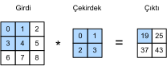

# İmgeler için Evrişimler
:label:`sec_conv_layer`

Artık evrişimli katmanların teoride nasıl çalıştığını anladığımıza göre, uygulamada nasıl çalıştıklarını görmeye hazırız. İmge verilerindeki yapıyı keşfetmek için etkili mimariler olarak evrişimli sinir ağlarının motivasyonunu temel alarak imgeler üzerinde çalışan örneğimize bağlı kalıyoruz.

## Çapraz Korelasyon İşlemi

Kesin olarak konuşursak, evrişimli katmanların yanlış adlandırıldığını hatırlayın, çünkü ifade ettikleri işlemler daha doğru bir şekilde çapraz korelasyon olarak tanımlanabilir. :numref:`sec_why-conv` içindeki evrişimli tabaka açıklamalarına göre, böyle bir katmanda, bir girdi tensör ve bir çekirdek tensör (**çapraz korelasyon işlemi**) yoluyla bir çıktı tensörü üretmek için birleştirilir.

Şimdilik kanalları yok sayalım ve bunun iki boyutlu veri ve gizli temsillerle nasıl çalıştığını görelim. :numref:`fig_correlation` içinde, girdi, yüksekliği 3 ve genişliği 3 olan iki boyutlu bir tensördür. Tensörün şeklini $3 \times 3$ veya ($3$, $3$) diye belirtiyoruz. Çekirdeğin yüksekliğinin ve genişliğinin her ikisi de 2'dir. *Çekirdek penceresinin* (veya *evrişim penceresi*) şekli çekirdeğin yüksekliği ve genişliği ile verilir (burada $2 \times 2$'dir).


:label:`fig_correlation`

İki boyutlu çapraz korelasyon işleminde, girdi tensörünün sol üst köşesinde konumlandırılmış evrişim penceresi ile başlar ve hem soldan sağa hem de yukarıdan aşağıya doğru, girdi tensörü boyunca kaydırırız. Evrişim penceresi belirli bir konuma kaydırıldığında, bu pencerede bulunan girdi alt-tensör ve çekirdek tensör eleman yönlü olarak çarpılır ve elde edilen tensör tek bir sayıl (skaler) değer oluşturacak şekilde toplanır. Bu sonuç, çıktı tensörünün ilgili konumdaki değerini verir. Burada, çıktı tensörünün yüksekliği ve genişliği 2'dir ve dört eleman iki boyutlu çapraz korelasyon işleminden türetilmiştir:

$$
0\times0+1\times1+3\times2+4\times3=19,\\
1\times0+2\times1+4\times2+5\times3=25,\\
3\times0+4\times1+6\times2+7\times3=37,\\
4\times0+5\times1+7\times2+8\times3=43.
$$

Her eksen boyunca, çıktı boyutunun girdi boyutundan biraz daha küçük olduğunu unutmayın. Çekirdeğin genişliği ve yüksekliği birden büyük olduğundan, çekirdeğin tamamen imge içine sığdığı konumlar için çapraz korelasyonu düzgün bir şekilde hesaplayabiliriz, çıktı boyutu $n_h \times n_w$ eksi evrişim çekirdeğinin boyutu $k_h \times k_w$ ile verilir.

$$(n_h-k_h+1) \times (n_w-k_w+1).$$

Evrişim çekirdeğini imge boyunca “kaydırmak” için yeterli alana ihtiyacımız olduğu durum budur. Daha sonra, imgeyi sınırının etrafında sıfırlarla doldurarak boyutun değişmeden nasıl tutulacağını göreceğiz, böylece çekirdeği kaydırmak için yeterli alanımız olacak. Daha sonra, bir girdi tensör `X` ve bir çekirdek tensör `K` kabul eden ve bir çıktı tensör `Y` döndüren `corr2d` işlevinde bu işlemi uyguluyoruz.

```{.python .input}
from d2l import mxnet as d2l
from mxnet import autograd, np, npx
from mxnet.gluon import nn
npx.set_np()
```

```{.python .input}
#@tab pytorch
from d2l import torch as d2l
import torch
from torch import nn
```

```{.python .input}
#@tab mxnet, pytorch
def corr2d(X, K):  #@save
    """2 boyutlu çapraz korelasyonu hesapla."""
    h, w = K.shape
    Y = d2l.zeros((X.shape[0] - h + 1, X.shape[1] - w + 1))
    for i in range(Y.shape[0]):
        for j in range(Y.shape[1]):
            Y[i, j] = d2l.reduce_sum((X[i: i + h, j: j + w] * K))
    return Y
```

```{.python .input}
#@tab tensorflow
from d2l import tensorflow as d2l
import tensorflow as tf

def corr2d(X, K):  #@save
    """2 boyutlu çapraz korelasyonu hesapla."""
    h, w = K.shape
    Y = tf.Variable(tf.zeros((X.shape[0] - h + 1, X.shape[1] - w + 1)))
    for i in range(Y.shape[0]):
        for j in range(Y.shape[1]):
            Y[i, j].assign(tf.reduce_sum(
                X[i: i + h, j: j + w] * K))
    return Y
```

İki boyutlu çapraz korelasyon işleminin [**yukarıdaki uygulamasının çıktısını doğrulamak**] için :numref:`fig_correlation` içinden girdi tensörünü `X`'i ve çekirdek tensörünü `K`'yı inşa edebiliriz.

```{.python .input}
#@tab all
X = d2l.tensor([[0.0, 1.0, 2.0], [3.0, 4.0, 5.0], [6.0, 7.0, 8.0]])
K = d2l.tensor([[0.0, 1.0], [2.0, 3.0]])
corr2d(X, K)
```

## Evrişimli Katmanlar

Bir evrişimli katman, girdi ve çekirdeği çapraz-ilişkilendirir (cross-correlate) ve çıktı üretmek için bir skaler ek girdi ekler. Bir evrişimli tabakanın iki parametresi çekirdek ve skaler ek girdidir. Modelleri evrişimli katmanlara göre eğitirken, tam bağlı bir katmanda olduğu gibi, çekirdekleri genelde rastgele olarak ilkleriz.

Yukarıda tanımlanan `corr2d` işlevine dayanan (**iki boyutlu bir evrişimli katmanı uygulamaya**) hazırız. `__init__` kurucu işlevinde, iki model parametresi olarak `weight` ve `bias`'i beyan ederiz. İleri yayma işlevi `corr2d` işlevini çağırır ve ek girdiyi ekler.

```{.python .input}
class Conv2D(nn.Block):
    def __init__(self, kernel_size, **kwargs):
        super().__init__(**kwargs)
        self.weight = self.params.get('weight', shape=kernel_size)
        self.bias = self.params.get('bias', shape=(1,))

    def forward(self, x):
        return corr2d(x, self.weight.data()) + self.bias.data()
```

```{.python .input}
#@tab pytorch
class Conv2D(nn.Module):
    def __init__(self, kernel_size):
        super().__init__()
        self.weight = nn.Parameter(torch.rand(kernel_size))
        self.bias = nn.Parameter(torch.zeros(1))

    def forward(self, x):
        return corr2d(x, self.weight) + self.bias
```

```{.python .input}
#@tab tensorflow
class Conv2D(tf.keras.layers.Layer):
    def __init__(self):
        super().__init__()

    def build(self, kernel_size):
        initializer = tf.random_normal_initializer()
        self.weight = self.add_weight(name='w', shape=kernel_size,
                                      initializer=initializer)
        self.bias = self.add_weight(name='b', shape=(1, ),
                                    initializer=initializer)

    def call(self, inputs):
        return corr2d(inputs, self.weight) + self.bias
```

$h \times w$ evrişiminde veya $h \times w$ evrişim çekirdeğinde, evrişim çekirdeğinin yüksekliği ve genişliği sırasıyla $h$ ve $w$'dir. Ayrıca $h \times w$ evrişim çekirdeğine sahip bir evrişimli tabakaya kısaca $h \times w$ evrişim tabaka diye atıfta bulunuyoruz.

## İmgelerde Nesne Kenarını Algılama

[**Evrişimli bir katmanın basit bir uygulamasını ayrıştırmak için biraz zaman ayıralım: Piksel değişiminin yerini bularak bir imgedeki nesnenin kenarını tespit etme**]. İlk olarak, $6\times 8$ piksellik bir “imge” oluşturuyoruz. Orta dört sütun siyah (0) ve geri kalanı beyaz (1) olsun.

```{.python .input}
#@tab mxnet, pytorch
X = d2l.ones((6, 8))
X[:, 2:6] = 0
X
```

```{.python .input}
#@tab tensorflow
X = tf.Variable(tf.ones((6, 8)))
X[:, 2:6].assign(tf.zeros(X[:, 2:6].shape))
X
```

Daha sonra, 1 yüksekliğinde ve 2 genişliğinde bir çekirdek `K` inşa ediyoruz. Girdi ile çapraz korelasyon işlemini gerçekleştirdiğimizde, yatay olarak bitişik elemanlar aynıysa, çıktı 0'dır. Aksi takdirde, çıktı sıfır değildir.

```{.python .input}
#@tab all
K = d2l.tensor([[1.0, -1.0]])
```

`X` (girdimiz) ve `K` (çekirdeğimiz) argümanlarıyla çapraz korelasyon işlemini gerçekleştirmeye hazırız. Gördüğünüz gibi, [**beyazdan siyaha kenar için 1 ve siyahtan beyaza kenar için -1 tespit ediyoruz.**] Diğer tüm çıktılar 0 değerini alır.

```{.python .input}
#@tab all
Y = corr2d(X, K)
Y
```

Artık çekirdeği devrik imgeye uygulayabiliriz. Beklendiği gibi, yok oluyor. [**Çekirdek `K` yalnızca dikey kenarları algılar.**]

```{.python .input}
#@tab all
corr2d(d2l.transpose(X), K)
```

## Bir Çekirdeği Öğrenme

Sonlu farklar `[1, -1]` ile bir kenar dedektörü tasarlamak, aradığımız şeyin tam olarak ne olduğunu biliyorsak temiz olur. Ancak, daha büyük çekirdeklere baktığımızda ve ardışık evrişim katmanlarını göz önünde bulundurduğumuzda, her filtrenin manuel olarak ne yapması gerektiğini tam olarak belirtmek imkansız olabilir.

Şimdi [**`X`'ten `Y`'yi oluşturan çekirdeği yalnızca girdi-çıktı çiftlerine bakarak öğrenip öğrenemeyeceğimizi**] görelim. Önce bir evrişimli tabaka oluşturup çekirdeğini rastgele bir tensör olarak ilkletiriz. Daha sonra, her yinelemede, `Y`'yi evrişimli tabakanın çıktısıyla karşılaştırmak için kare hatayı kullanacağız. Daha sonra çekirdeği güncellemek için gradyanı hesaplayabiliriz. Basitlik uğruna, aşağıda iki boyutlu evrişimli katmanlar için yerleşik sınıfı kullanıyoruz ve ek girdiyi görmezden geliyoruz.

```{.python .input}
# 1 çıktı kanallı ve (1, 2) şekilli çekirdekli iki boyutlu bir evrişim katmanı 
# oluşturun. Basitlik adına, burada ek girdiyi görmezden geliyoruz.
conv2d = nn.Conv2D(1, kernel_size=(1, 2), use_bias=False)
conv2d.initialize()

# İki boyutlu evrişimli katman, (örnek, kanal, yükseklik, genişlik) biçiminde 
# dört boyutlu girdi ve çıktı kullanır; burada toplu iş boyutunun (gruptaki örnek sayısı) 
# ve kanal sayısının her ikisi de 1'dir.
X = X.reshape(1, 1, 6, 8)
Y = Y.reshape(1, 1, 6, 7)
lr = 3e-2  # Öğrenme oranı

for i in range(10):
    with autograd.record():
        Y_hat = conv2d(X)
        l = (Y_hat - Y) ** 2
    l.backward()
    # Çekirdeği güncelle
    conv2d.weight.data()[:] -= lr * conv2d.weight.grad()
    if (i + 1) % 2 == 0:
        print(f'donem {i + 1}, loss {float(l.sum()):.3f}')
```

```{.python .input}
#@tab pytorch
# 1 çıktı kanallı ve (1, 2) şekilli çekirdekli iki boyutlu bir evrişim katmanı 
# oluşturun. Basitlik adına, burada ek girdiyi görmezden geliyoruz.
conv2d = nn.Conv2d(1,1, kernel_size=(1, 2), bias=False)

# İki boyutlu evrişimli katman, (örnek, kanal, yükseklik, genişlik) biçiminde 
# dört boyutlu girdi ve çıktı kullanır; burada toplu iş boyutunun (gruptaki örnek sayısı) 
# ve kanal sayısının her ikisi de 1'dir.
X = X.reshape((1, 1, 6, 8))
Y = Y.reshape((1, 1, 6, 7))
lr = 3e-2  # Öğrenme oranı

for i in range(10):
    Y_hat = conv2d(X)
    l = (Y_hat - Y) ** 2
    conv2d.zero_grad()
    l.sum().backward()
    # Çekirdeği güncelle
    conv2d.weight.data[:] -= lr * conv2d.weight.grad
    if (i + 1) % 2 == 0:
        print(f'donem {i + 1}, loss {l.sum():.3f}')
```

```{.python .input}
#@tab tensorflow
# 1 çıktı kanallı ve (1, 2) şekilli çekirdekli iki boyutlu bir evrişim katmanı 
# oluşturun. Basitlik adına, burada ek girdiyi görmezden geliyoruz.
conv2d = tf.keras.layers.Conv2D(1, (1, 2), use_bias=False)

# İki boyutlu evrişimli katman, (örnek, yükseklik, genişlik, kanal) biçiminde 
# dört boyutlu girdi ve çıktı kullanır; burada toplu iş boyutunun (gruptaki örnek sayısı) 
# ve kanal sayısının her ikisi de 1'dir.
X = tf.reshape(X, (1, 6, 8, 1))
Y = tf.reshape(Y, (1, 6, 7, 1))
lr = 3e-2  # Learning rate

Y_hat = conv2d(X)
for i in range(10):
    with tf.GradientTape(watch_accessed_variables=False) as g:
        g.watch(conv2d.weights[0])
        Y_hat = conv2d(X)
        l = (abs(Y_hat - Y)) ** 2
        # Çekirdeği güncelle
        update = tf.multiply(lr, g.gradient(l, conv2d.weights[0]))
        weights = conv2d.get_weights()
        weights[0] = conv2d.weights[0] - update
        conv2d.set_weights(weights)
        if (i + 1) % 2 == 0:
            print(f'donem {i + 1}, loss {tf.reduce_sum(l):.3f}')
```

Hatanın 10 yinelemeden sonra küçük bir değere düştüğünü fark ediniz. Şimdi [**öğrendiğimiz çekirdek tensörüne bir göz atacağız**].

```{.python .input}
d2l.reshape(conv2d.weight.data(), (1, 2))
```

```{.python .input}
#@tab pytorch
d2l.reshape(conv2d.weight.data, (1, 2))
```

```{.python .input}
#@tab tensorflow
d2l.reshape(conv2d.get_weights()[0], (1, 2))
```

Gerçekten de, öğrenilen çekirdek tensör, daha önce tanımladığımız çekirdek tensörüne `K`'e oldukça yakındır.

## Çapraz Korelasyon ve Evrişim

Çapraz korelasyon ve evrişim işlemleri arasındaki ilişkilendirmeler için :numref:`sec_why-conv` içindeki gözlemlerimizi hatırlayın. Burada iki boyutlu evrişimli katmanları düşünmeye devam edelim. Bu tür katmanlar çapraz korelasyon yerine :eqref:`eq_2d-conv-discrete` içinde tanımlandığı gibi tam evrişim işlemlerini gerçekleştirirse ne olur? Tam *evrişim* işleminin çıktısını elde etmek için, iki boyutlu çekirdek tensörünü hem yatay hem de dikey olarak çevirmemiz ve daha sonra girdi tensörüyle *çapraz korelasyon* işlemini gerçekleştirmemiz gerekir.

Çekirdekler derin öğrenmede verilerden öğrenildiğinden, bu tür katmanlar tam evrişim işlemlerini veya çapraz korelasyon işlemlerini gerçekleştirse de, evrişimli katmanların çıktılarının etkilenmeden kalması dikkat çekicidir.

Bunu göstermek için, bir evrişimli katmanın *çapraz korelasyon* gerçekleştirdiğini ve çekirdeği :numref:`fig_correlation` içinde öğrendiğini varsayalım, burada $\mathbf{K}$ matris olarak ifade ediliyor. Bu katman yerine tam *evrişim* gerçekleştirdiğinde, diğer koşulların değişmeden kaldığını varsayarsak, $\mathbf{K}'$ hem yatay hem de dikey olarak çevrildikten sonra $\mathbf{K}$ ile aynı olacaktır. Yani, evrişimli tabaka :numref:`fig_correlation` ve $\mathbf{K}'$'deki girdi için tam *evrişim* gerçekleştirdiğinde, :numref:`fig_correlation` içinde gösterilen aynı çıktı (girdi ve $\mathbf{K}$'nin çapraz korelasyon) elde edilecektir.

Derin öğrenme yazınındaki standart terminolojiye uygun olarak, çapraz korelasyon işlemine bir evrişim olarak atıfta bulunmaya devam edeceğiz, katı bir şekilde konuşursak da, biraz farklı olsa da. Ayrıca, bir katman temsilini veya bir evrişim çekirdeğini temsil eden herhangi bir tensörün girdisini (veya bileşenini) ifade etmek için *eleman (öğe)* terimini kullanıyoruz.

## Öznitelik Eşleme ve Alım Alanı (Receptive Field)

:numref:`subsec_why-conv-channels` içinde açıklandığı gibi, :numref:`fig_correlation` içindeki evrişimli katman çıktısı bazen *öznitelik eşleme (feature mapping)* olarak adlandırılır, çünkü uzamsal boyutlarda (örn. genişlik ve yükseklik) sonraki katmana öğrenilmiş temsiller (öznitelikler) olarak kabul edilebilir. CNN'lerde, herhangi tabakanın herhangi bir elemanı $x$ için, *alım alanı*, ileri yayma sırasında $x$'nin hesaplanmasını etkileyebilecek tüm elemanları (önceki katmanlardan) ifade eder. Alım alanın girdinin gerçek boyutundan daha büyük olabileceğini unutmayın.

Alım alanını açıklamak için :numref:`fig_correlation` içeriğini kullanmaya devam edelim. $2 \times 2$ evrişim çekirdeği göz önüne alındığında, gölgeli çıktı elemanının alım alanı ($19$ değeri) girdinin gölgeli kısmındaki dört öğedir. Şimdi $2 \times 2$ çıktısını $\mathbf{Y}$ olarak ifade edelim ve $\mathbf{Y}$'yi girdi alıp tek $z$ eleman çıktısı veren $2 \times 2$ evrişimli tabakalı daha derin bir CNN düşünelim. Bu durumda, $\mathbf{Y}$'deki $z$'nin alım alanı $\mathbf{Y}$'nin dört öğesini içerirken, girdideki alım alanı dokuz girdi elemanını içerir. Böylece, bir öznitelik eşlemedeki herhangi bir elemanın daha geniş bir alan üzerindeki girdi özelliklerini algılamak için daha büyük bir alım alanına ihtiyacı olduğunda, daha derin bir ağ kurabiliriz.

## Özet

* İki boyutlu bir evrişimli tabakanın çekirdek hesaplaması, iki boyutlu bir çapraz korelasyon işlemidir. En basit haliyle, bu iki boyutlu girdi verisi ve çekirdek üzerinde çapraz korelasyon işlemi gerçekleştirir ve sonra bir ek girdi ekler.
* İmgelerdeki kenarları tespit etmek için bir çekirdek tasarlayabiliriz.
* Çekirdeğin parametrelerini verilerden öğrenebiliriz.
* Verilerden öğrenilen çekirdekler ile, evrişimli katmanların çıktıları, bu tür katmanlarda gerçekleştirilen işlemlerden bağımsız kalarak (tam evrişim veya çapraz korelasyon) etkilenmez.
* Bir öznitelik eşlemedeki herhangi bir öğe, girdideki daha geniş öznitelikleri algılamak için daha büyük bir alım alanına ihtiyaç duyduğunda, daha derin bir ağ düşünülebilir.

## Alıştırmalar

1. Çapraz kenarlı bir `X` imgesi oluşturun.
    1. Çekirdek `K`'yi bu bölümde uygularsanız ne olur?
    1. `X` devrik olursa ne olur?
    1. `K` devrik olursa ne olur?
1. Oluşturduğumuz `Conv2D` sınıfının gradyanını otomatik olarak bulmaya çalıştığınızda ne tür bir hata mesajı görürsunuz?
1. Girdi ve çekirdek tensörlerini değiştirerek çapraz korelasyon işlemini nasıl bir matris çarpımı olarak temsil edebilirsiniz?
1. Bazı çekirdekleri manuel olarak tasarlayın.
    1. İkinci türev için bir çekirdeğin biçimi nedir?
    1. İntegral için bir çekirdek nedir?
    1. $d$ derece türevi elde etmek için bir çekirdeğin minimum boyutu nedir?

:begin_tab:`mxnet`
[Tartışmalar](https://discuss.d2l.ai/t/65)
:end_tab:

:begin_tab:`pytorch`
[Tartışmalar](https://discuss.d2l.ai/t/66)
:end_tab:

:begin_tab:`tensorflow`
[Tartışmalar](https://discuss.d2l.ai/t/271)
:end_tab:
