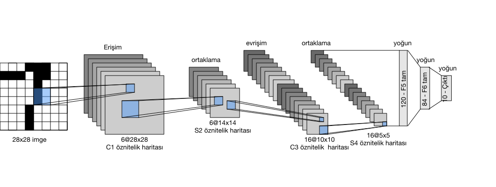
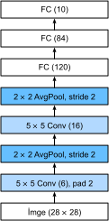

# Evrişimli Sinir Ağları (LeNet)
:label:`sec_lenet`

Artık tam fonksiyonlu bir CNN kurmak için gerekli tüm malzemelere sahibiz. İmge verileriyle daha önceki karşılaşmamızda, Fashion-MNIST veri kümesindeki giyim resimlerine bir softmaks bağlanım modeli (:numref:`sec_softmax_scratch`) ve bir MLP modeli (:numref:`sec_mlp_scratch`) uyguladık. Bu tür verileri softmaks bağlanıma ve MLP'lere uygun hale getirmek için, önce $28\times28$ matrisinden her imgeyi sabit uzunlukta $784$ boyutlu bir vektöre düzleştirdik ve daha sonra bunları tam bağlı katmanlarla işledik. Artık evrişimli katmanlar üzerinde bir kavrayışımız olduğuna göre, imgelerimizdeki konumsal yapıyı koruyabiliriz. Tam bağlı katmanları evrişimsel katmanlarla değiştirmenin ek bir avantajı olarak, çok daha az parametre gerektiren daha eli sıkı modellerin keyfini çıkaracağız.

Bu bölümde, ilk yayınlanan CNN'ler arasından bilgisayarla görme görevlerinde performansından dolayı dikkat çeken *LeNet*'i tanıtacağız. Model, (:cite:`LeCun.Bottou.Bengio.ea.1998`) imgelerdeki el yazısı rakamlarını tanımak amacıyla AT&T Bell Labs'te araştırmacı olan Yann LeCun tarafından tanıtıldı (ve adlandırıldı). Bu çalışma, bu teknolojiyi geliştiren on yıllık bir araştırmanın doruk noktalarını temsil ediyordu. 1989'da LeCun, CNN'leri geri yayma yoluyla başarılı bir şekilde eğiten ilk çalışmayı yayınladı.

LeNet, destek vektörü makinelerinin performansıyla eşleşen olağanüstü sonuçlar elde etti, daha sonra gözetimli öğrenmede baskın bir yaklaşım oldu. LeNet en sonunda ATM makinelerinde mevduat işlemede rakamları tanımak için uyarlanmıştır. Günümüze kadar, bazı ATM'ler hala Yann ve meslektaşı Leon Bottou'nun 1990'larda yazdığı kodu çalıştırıyor!

## LeNet

Yüksek düzeyde, (**LeNet (LeNet-5) iki parçadan oluşur: (i) İki evrişimli katmandan oluşan bir evrişimli kodlayıcı; ve (ii) üç tam bağlı katmandan oluşan yoğun bir blok**): Mimarisi :numref:`img_lenet` içinde özetlenmiştir.


:label:`img_lenet`

Her bir evrişimli bloktaki temel birimler, bir evrişimli tabaka, bir sigmoid etkinleştirme fonksiyonu ve sonrasında bir ortalama ortaklama işlemidir. ReLU'lar ve maksimum ortaklama daha iyi çalışırken, bu keşifler henüz 1990'larda yapılmamıştı. Her bir evrişimli katman bir $5\times 5$ çekirdeği ve sigmoid etkinleştirme işlevi kullanır. Bu katmanlar, konumsal olarak düzenlenmiş girdileri bir dizi iki boyutlu öznitelik eşlemelerine eşler ve genellikle kanal sayısını arttırır. İlk evrişimli tabaka 6 tane çıktı kanalına, ikincisi ise 16 taneye sahiptir. Her $2\times2$ ortaklama işlemi (2'lik uzun adım), uzamsal örnek seyreltme yoluyla boyutsallığı $4$ kat düşürür. Evrişimli blok tarafından verilen şekle sahip bir çıktı yayar (toplu iş boyutu, kanal sayısı, yükseklik, genişlik).

Evrişimli bloktan yoğun bloğa çıktıyı geçirmek için, minigruptaki her örneği düzleştirmeliyiz. Başka bir deyişle, bu dört boyutlu girdiyi alıp tam bağlı katmanlar tarafından beklenen iki boyutlu girdiye dönüştürüyoruz: Bir hatırlatma olarak, arzu ettiğimiz iki boyutlu gösterim, minigrup örneklerini indekslemek için ilk boyutu kullanır ve ikincisini örneği temsil eden düz vektörü vermek için kullanır. LeNet'in yoğun bloğu sırasıyla 120, 84 ve 10 çıktılı üç tam bağlı katman içerir. Hala sınıflandırma gerçekleştirdiğimiz için, 10 boyutlu çıktı katmanı olası çıktı sınıflarının sayısına karşılık gelir.

LeNet'in içinde neler olup bittiğini gerçekten anladığınız noktaya gelirken, umarım aşağıdaki kod parçacığı sizi modern derin öğrenme çerçeveleri ile bu tür modellerin uygulanmasının son derece basit olduğuna ikna edecektir. Sadece `Sequential` bloğunu örneklendirmeniz ve uygun katmanları birbirine bağlamamız gerekiyor.

```{.python .input}
from d2l import mxnet as d2l
from mxnet import autograd, gluon, init, np, npx
from mxnet.gluon import nn
npx.set_np()

net = nn.Sequential()
net.add(nn.Conv2D(channels=6, kernel_size=5, padding=2, activation='sigmoid'),
        nn.AvgPool2D(pool_size=2, strides=2),
        nn.Conv2D(channels=16, kernel_size=5, activation='sigmoid'),
        nn.AvgPool2D(pool_size=2, strides=2),
        # `Dense`, bir girdinin biçimini (toplu iş boyutu, kanal sayısı, yükseklik, genişlik) 
        # otomatik, varsayılan olarak (toplu iş boyutu, kanal sayısı * yükseklik * genişlik)
        # biçimli bir girdiye dönüştürür.
        nn.Dense(120, activation='sigmoid'),
        nn.Dense(84, activation='sigmoid'),
        nn.Dense(10))
```

```{.python .input}
#@tab pytorch
from d2l import torch as d2l
import torch
from torch import nn

net = nn.Sequential(
    nn.Conv2d(1, 6, kernel_size=5, padding=2), nn.Sigmoid(),
    nn.AvgPool2d(kernel_size=2, stride=2),
    nn.Conv2d(6, 16, kernel_size=5), nn.Sigmoid(),
    nn.AvgPool2d(kernel_size=2, stride=2),
    nn.Flatten(),
    nn.Linear(16 * 5 * 5, 120), nn.Sigmoid(),
    nn.Linear(120, 84), nn.Sigmoid(),
    nn.Linear(84, 10))
```

```{.python .input}
#@tab tensorflow
from d2l import tensorflow as d2l
import tensorflow as tf

def net():
    return tf.keras.models.Sequential([
        tf.keras.layers.Conv2D(filters=6, kernel_size=5, activation='sigmoid',
                               padding='same'),
        tf.keras.layers.AvgPool2D(pool_size=2, strides=2),
        tf.keras.layers.Conv2D(filters=16, kernel_size=5,
                               activation='sigmoid'),
        tf.keras.layers.AvgPool2D(pool_size=2, strides=2),
        tf.keras.layers.Flatten(),
        tf.keras.layers.Dense(120, activation='sigmoid'),
        tf.keras.layers.Dense(84, activation='sigmoid'),
        tf.keras.layers.Dense(10)])
```

Orijinal modelde biraz özgürce davrandık, son kattaki Gauss etkinleştirmesini kaldırdık. Bunun dışında, bu ağ orijinal LeNet-5 mimarisiyle eşleşir.

Tek kanallı (siyah beyaz) $28 \times 28$ imgesini ağ üzerinden geçirerek ve çıktı şeklini her katmanda yazdırarak, işlemlerinin :numref:`img_lenet_vert` içinde gösterilen gibi beklediğimiz şeyle hizaladığından emin olmak için [**modeli inceleyebiliriz**].


:label:`img_lenet_vert`

```{.python .input}
X = np.random.uniform(size=(1, 1, 28, 28))
net.initialize()
for layer in net:
    X = layer(X)
    print(layer.name, 'output shape:\t', X.shape)
```

```{.python .input}
#@tab pytorch
X = torch.rand(size=(1, 1, 28, 28), dtype=torch.float32)
for layer in net:
    X = layer(X)
    print(layer.__class__.__name__,'output shape: \t',X.shape)
```

```{.python .input}
#@tab tensorflow
X = tf.random.uniform((1, 28, 28, 1))
for layer in net().layers:
    X = layer(X)
    print(layer.__class__.__name__, 'output shape: \t', X.shape)
```

Evrişimli blok boyunca her katmanda (önceki katmanla karşılaştırıldığında) gösterim yüksekliğinin ve genişliğinin azaltıldığını unutmayın. İlk evrişimli katman, $5 \times 5$ çekirdeğinin kullanılmasından kaynaklanan yükseklik ve genişlik azalmasını telafi etmek için 2 piksellik dolgu kullanır. Buna karşılık, ikinci evrişimli tabaka dolgudan vazgeçer ve böylece yüksekliğin ve genişliğin her ikisi de 4'er piksel azaltılır. Katman yığınında yukarı çıktığımızda, kanalların sayısı, ilk evrişimli tabakadan sonra girdideki 1'den 6'ya ve ikinci evrişimli tabakadan sonra 16'ya yükselir. Bununla birlikte, her bir ortaklama katmanı yüksekliği ve genişliği yarıya indirir. Son olarak, her tam bağlı katman boyutsallığı azaltır ve nihai olarak boyutu sınıf sayısıyla eşleşen bir çıktı yayar.

## Eğitim

Modeli uyguladığımıza göre, [**LeNet'in Fashion-MNIST üzerinde nasıl çalışacağını görmek için bir deney yapalım**].

```{.python .input}
#@tab all
batch_size = 256
train_iter, test_iter = d2l.load_data_fashion_mnist(batch_size=batch_size)
```

CNN'lerde daha az parametre olsa da, hesaplamalar benzer derin MLP'lerden daha külfetli olabilir çünkü her parametre daha fazla çarpmada kullanılır. GPU'ya erişiminiz varsa, bu işlemi hızlandırmak için harekete geçirmenin tam zamanı olabilir.

:begin_tab:`mxnet, pytorch`
Değerlendirme için :numref:`sec_softmax_scratch` içinde tarif ettiğimiz [**`evaluate_accuracy` işlevinde hafif bir değişiklik yapmamız gerekiyor.**] Bütün veri kümesi ana bellekte olduğundan, modelin veri kümesiyle hesaplama yapabilmesi için GPU'yu kullanmadan önce veriyi GPU belleğine kopyalamamız gerekir.
:end_tab:

```{.python .input}
def evaluate_accuracy_gpu(net, data_iter, device=None):  #@save
    """GPU kullanarak bir veri kümesindeki bir modelin doğruluğunu hesapla."""
    if not device:  # İlk parametrenin kurulu olduğu ilk cihazı sorgulayın
        device = list(net.collect_params().values())[0].list_ctx()[0]
    # Doğru tahmin sayısı, tahminlerin sayısı
    metric = d2l.Accumulator(2)
    for X, y in data_iter:
        X, y = X.as_in_ctx(device), y.as_in_ctx(device)
        metric.add(d2l.accuracy(net(X), y), d2l.size(y))
    return metric[0] / metric[1]
```

```{.python .input}
#@tab pytorch
def evaluate_accuracy_gpu(net, data_iter, device=None): #@save
    """GPU kullanarak bir veri kümesindeki bir modelin doğruluğunu hesapla."""
    if isinstance(net, nn.Module):
        net.eval()  # Modeli değerlendirme moduna ayarlayın
        if not device:
            device = next(iter(net.parameters())).device
   # Doğru tahmin sayısı, tahminlerin sayısı
    metric = d2l.Accumulator(2)

    with torch.no_grad():
        for X, y in data_iter:
            if isinstance(X, list):
                # BERT ince ayarı için gerekli (daha sonra ele alınacaktır)
                X = [x.to(device) for x in X]
            else:
                X = X.to(device)
            y = y.to(device)
            metric.add(d2l.accuracy(net(X), y), d2l.size(y))
    return metric[0] / metric[1]
```

Ayrıca [**GPU'larla başa çıkmak için eğitim fonksiyonumuzu güncellememiz**] gerekiyor. :numref:`sec_softmax_scratch` içinde tanımlanan `train_epoch_ch3`'in aksine, şimdi ileri ve geri yayma yapmadan önce her bir veri minigrubunu belirlenen cihazımıza (GPU olması beklenir) taşımamız gerekiyor.

Eğitim fonksiyonu `train_ch6`, :numref:`sec_softmax_scratch` içinde tanımlanan `train_ch3`'ya da benzer. Birçok ileriye doğru ilerleyen katmanlardan oluşan ağları uygulayacağımızdan, öncelikle üst düzey API'lere güveneceğiz. Aşağıdaki eğitim işlevi, girdi olarak üst düzey API'lerden oluşturulan bir modeli varsayar ve buna göre eniyilenir. :numref:`subsec_xavier` içinde tanıtıldığı gibi Xavier ilklemede `device` argümanı ile belirtilen cihazdaki model parametrelerini ilkliyoruz. Tıpkı MLP'lerde olduğu gibi, kayıp fonksiyonumuzu çapraz entropi ve minigrup rasgele eğim inişi yoluyla en aza indiriyoruz. Her bir dönemin çalışması on saniye sürdüğünden, eğitim kaybını daha sık görselleştiriyoruz.

```{.python .input}
#@save
def train_ch6(net, train_iter, test_iter, num_epochs, lr, device):
    """GPU ile bir modeli eğitin (Bölüm 6'da tanımlanmıştır)."""
    net.initialize(force_reinit=True, ctx=device, init=init.Xavier())
    loss = gluon.loss.SoftmaxCrossEntropyLoss()
    trainer = gluon.Trainer(net.collect_params(),
                            'sgd', {'learning_rate': lr})
    animator = d2l.Animator(xlabel='epoch', xlim=[1, num_epochs],
                            legend=['train loss', 'train acc', 'test acc'])
    timer, num_batches = d2l.Timer(), len(train_iter)
    for epoch in range(num_epochs):
        # Eğitim kaybı toplamı, eğitim doğruluğu toplamı, örnek sayısı
        metric = d2l.Accumulator(3)
        for i, (X, y) in enumerate(train_iter):
            timer.start()
            # `d2l.train_epoch_ch3` ile arasındaki en büyük fark buradadır.
            X, y = X.as_in_ctx(device), y.as_in_ctx(device)
            with autograd.record():
                y_hat = net(X)
                l = loss(y_hat, y)
            l.backward()
            trainer.step(X.shape[0])
            metric.add(l.sum(), d2l.accuracy(y_hat, y), X.shape[0])
            timer.stop()
            train_l = metric[0] / metric[2]
            train_acc = metric[1] / metric[2]
            if (i + 1) % (num_batches // 5) == 0 or i == num_batches - 1:
                animator.add(epoch + (i + 1) / num_batches,
                             (train_l, train_acc, None))
        test_acc = evaluate_accuracy_gpu(net, test_iter)
        animator.add(epoch + 1, (None, None, test_acc))
    print(f'loss {train_l:.3f}, train acc {train_acc:.3f}, '
          f'test acc {test_acc:.3f}')
    print(f'{metric[2] * num_epochs / timer.sum():.1f} examples/sec '
          f'on {str(device)}')
```

```{.python .input}
#@tab pytorch
#@save
def train_ch6(net, train_iter, test_iter, num_epochs, lr, device):
    """GPU ile bir modeli eğitin (Bölüm 6'da tanımlanmıştır)."""
    def init_weights(m):
        if type(m) == nn.Linear or type(m) == nn.Conv2d:
            nn.init.xavier_uniform_(m.weight)
    net.apply(init_weights)
    print('training on', device)
    net.to(device)
    optimizer = torch.optim.SGD(net.parameters(), lr=lr)
    loss = nn.CrossEntropyLoss()
    animator = d2l.Animator(xlabel='epoch', xlim=[1, num_epochs],
                            legend=['train loss', 'train acc', 'test acc'])
    timer, num_batches = d2l.Timer(), len(train_iter)
    for epoch in range(num_epochs):
        # Eğitim kaybı toplamı, eğitim doğruluğu toplamı, örnek sayısı
        metric = d2l.Accumulator(3)
        net.train()
        for i, (X, y) in enumerate(train_iter):
            timer.start()
            optimizer.zero_grad()
            X, y = X.to(device), y.to(device)
            y_hat = net(X)
            l = loss(y_hat, y)
            l.backward()
            optimizer.step()
            with torch.no_grad():
                metric.add(l * X.shape[0], d2l.accuracy(y_hat, y), X.shape[0])
            timer.stop()
            train_l = metric[0] / metric[2]
            train_acc = metric[1] / metric[2]
            if (i + 1) % (num_batches // 5) == 0 or i == num_batches - 1:
                animator.add(epoch + (i + 1) / num_batches,
                             (train_l, train_acc, None))
        test_acc = evaluate_accuracy_gpu(net, test_iter)
        animator.add(epoch + 1, (None, None, test_acc))
    print(f'loss {train_l:.3f}, train acc {train_acc:.3f}, '
          f'test acc {test_acc:.3f}')
    print(f'{metric[2] * num_epochs / timer.sum():.1f} examples/sec '
          f'on {str(device)}')
```

```{.python .input}
#@tab tensorflow
class TrainCallback(tf.keras.callbacks.Callback):  #@save
    """Eğitim ilerlemesini görselleştirmek için bir geri arama (callback)."""
    def __init__(self, net, train_iter, test_iter, num_epochs, device_name):
        self.timer = d2l.Timer()
        self.animator = d2l.Animator(
            xlabel='epoch', xlim=[1, num_epochs], legend=[
                'train loss', 'train acc', 'test acc'])
        self.net = net
        self.train_iter = train_iter
        self.test_iter = test_iter
        self.num_epochs = num_epochs
        self.device_name = device_name
    def on_epoch_begin(self, epoch, logs=None):
        self.timer.start()
    def on_epoch_end(self, epoch, logs):
        self.timer.stop()
        test_acc = self.net.evaluate(
            self.test_iter, verbose=0, return_dict=True)['accuracy']
        metrics = (logs['loss'], logs['accuracy'], test_acc)
        self.animator.add(epoch + 1, metrics)
        if epoch == self.num_epochs - 1:
            batch_size = next(iter(self.train_iter))[0].shape[0]
            num_examples = batch_size * tf.data.experimental.cardinality(
                self.train_iter).numpy()
            print(f'loss {metrics[0]:.3f}, train acc {metrics[1]:.3f}, '
                  f'test acc {metrics[2]:.3f}')
            print(f'{num_examples / self.timer.avg():.1f} examples/sec on '
                  f'{str(self.device_name)}')

#@save
def train_ch6(net_fn, train_iter, test_iter, num_epochs, lr, device):
    """GPU ile bir modeli eğitin (Bölüm 6'da tanımlanmıştır)."""
    device_name = device._device_name
    strategy = tf.distribute.OneDeviceStrategy(device_name)
    with strategy.scope():
        optimizer = tf.keras.optimizers.SGD(learning_rate=lr)
        loss = tf.keras.losses.SparseCategoricalCrossentropy(from_logits=True)
        net = net_fn()
        net.compile(optimizer=optimizer, loss=loss, metrics=['accuracy'])
    callback = TrainCallback(net, train_iter, test_iter, num_epochs,
                             device_name)
    net.fit(train_iter, epochs=num_epochs, verbose=0, callbacks=[callback])
    return net
```

[**Şimdi LeNet-5 modelini eğitip değerlendirelim.**]

```{.python .input}
#@tab all
lr, num_epochs = 0.9, 10
train_ch6(net, train_iter, test_iter, num_epochs, lr, d2l.try_gpu())
```

## Özet

* CNN, evrişimli katmanları kullanan bir ağdır.
* Bir CNN'de, evrişimlerinin arasına, doğrusal olmayanları işlemleri ve (genellikle) ortaklama işlemlerini koyuyoruz.
* Bir CNN'de, evrişimli katmanlar tipik olarak, kanal sayısını arttırırken gösterimlerin mekansal çözünürlüğünü yavaş yavaş azaltacak şekilde düzenlenir.
* Geleneksel CNN'lerde, evrişimli bloklar tarafından kodlanan temsiller, çıktı yayılmadan önce bir veya daha fazla tam bağlı katman tarafından işlenir.
* LeNet, tartışmasız, böyle bir ağın ilk başarılı konuşlandırması oldu.

## Alıştırmalar

1. Ortalama ortaklama ile maksimum ortaklamayı değiştirin. Ne olur?
1. Doğruluğunu artırmak için LeNet'e dayalı daha karmaşık bir ağ oluşturmaya çalışın.
    1. Evrişim penceresi boyutunu ayarlayın.
    1. Çıktı kanallarının sayısını ayarlayın.
    1. Etkinleştirme işlevini ayarlayın (örneğin, ReLU).
    1. Evrişim katmanlarının sayısını ayarlayın.
    1. Tam bağlı katmanların sayısını ayarlayın.
    1. Öğrenme oranlarını ve diğer eğitim ayrıntılarını ayarlayın (örneğin, ilkleme ve dönem sayısı).
1. Özgün MNIST veri kümesi üzerinde geliştirdiğiniz ağı deneyin.
1. Farklı girdiler için LeNet'in birinci ve ikinci katmanının etkinleştirmelerini gösterin (ör. kazak ve paltolar gibi).

:begin_tab:`mxnet`
[Tartışmalar](https://discuss.d2l.ai/t/73)
:end_tab:

:begin_tab:`pytorch`
[Tartışmalar](https://discuss.d2l.ai/t/74)
:end_tab:

:begin_tab:`tensorflow`
[Tartışmalar](https://discuss.d2l.ai/t/275)
:end_tab:
