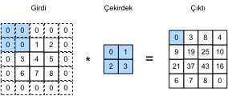
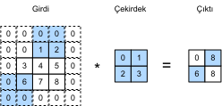

# Dolgu ve Uzun Adımlar
:label:`sec_padding`

Önceki :numref:`fig_correlation` örneğinde, girdimizin hem yüksekliği hem de genişliği 3 idi ve evrişim çekirdeğimizin hem yüksekliği hem de genişliği 2 idi, bu da $2\times2$ boyutlu bir çıktı gösterimi sağladı. :numref:`sec_conv_layer` içinde genelleştirdiğimiz gibi, girdinin şeklinin $n_h\times n_w$ olduğunu ve evrişim çekirdeğinin şeklinin $k_h\times k_w$ olduğunu varsayarsak, çıktının şekli $(n_h-k_h+1) \times (n_w-k_w+1)$ olacaktır. Bu nedenle, evrişimli tabakanın çıktı şekli, girdinin şekli ve evrişim çekirdeğinin şekli ile belirlenir.

Bazı durumlarda, çıktının boyutunu etkileyen dolgu ve uzun adımlı evrişimler dahil olmak üzere teknikleri dahil ediyoruz.Motivasyon olarak, çekirdeklerin genellikle $1$'den büyük genişliğe ve yüksekliğe sahip olduğundan, birçok ardışık evrişim uyguladıktan sonra, girdimizden önemli ölçüde daha küçük çıktılar elde etme eğiliminde olduğumuzu unutmayın. $240 \times 240$ piksel imgeyle başlarsak, $10$ tane $5 \times 5$ evrişim katmanı imgeyi $200 \times 200$ piksele indirir, imgenin $\% 30$'unu keserek atar ve orijinal imgenin sınırları hakkındaki ilginç bilgileri yok eder. *Dolgu*, bu sorunu ele almada en popüler araçtır.

Diğer durumlarda, örneğin orijinal girdi çözünürlüğünün kullanışsız olduğunu görürsek, boyutsallığı büyük ölçüde azaltmak isteyebiliriz. *Uzun adımlı evrişimler*, bu örneklerde yardımcı olabilecek popüler bir tekniktir.

## Dolgu

Yukarıda açıklandığı gibi, evrişimli katmanları uygularken zor bir sorun, imgemizin çevresindeki pikselleri kaybetme eğiliminde olmamızdır. Tipik olarak küçük çekirdekler kullandığımızdan, herhangi bir evrişim için, yalnızca birkaç piksel kaybedebiliriz, ancak birçok ardışık evrişimli katman uyguladığımız için bu kayıplar toplanarak artacaktır. Bu soruna basit bir çözüm, girdi imgemizin sınırına ekstra dolgu pikselleri eklemek, böylece imgenin etkin boyutunu arttırmaktır. Tipik olarak, ekstra piksellerin değerlerini sıfıra ayarlarız. :numref:`img_conv_pad` içinde, $3 \times 3$'lük girdiyi doldurarak boyutunu $5 \times 5$'e yükseltiyoruz. Karşılık gelen çıktı daha sonra bir $4 \times 4$ matrisine yükselir. Gölgeli kısımlar, çıktı hesaplamasında kullanılan girdi ve çekirdek tensör elemanlarının yanı sıra ilk çıktı elemanıdır: $0\times0+0\times1+0\times2+0\times3=0$.


:label:`img_conv_pad`

Genel olarak, toplam $p_h$ satırlı dolgu (kabaca yarısı üstte ve altta yarısı) ve toplam $p_w$ sütunlu dolgu (kabaca yarısı solda ve sağda yarısı) eklersek, çıktının şekli şöyle olur:

$$(n_h-k_h+p_h+1)\times(n_w-k_w+p_w+1).$$

Bu, çıktının yüksekliğinin ve genişliğinin sırasıyla $p_h$ ve $p_w$ artacağı anlamına gelir.

Birçok durumda, girdiye ve çıktıya aynı yüksekliği ve genişliği vermek için $p_h=k_h-1$ ve $p_w=k_w-1$'i ayarlamak isteyeceğiz. Bu, ağ oluştururken her katmanın çıktı şeklini tahmin etmeyi kolaylaştıracaktır. $k_h$'nın burada tek sayı olduğunu varsayarsak, yüksekliğin her iki tarafında $p_h/2$ satır dolgu olacak. Eğer $k_h$ çift ise, bir olasılık girdinin üstünde $\lfloor p_h/2\rfloor$ ve altında $\lceil p_h/2\rceil$ satır dolgu olmasıdır. Genişliğin her iki tarafını da aynı şekilde dolduracağız.

CNN'ler genellikle 1, 3, 5 veya 7 gibi tek yükseklik ve genişlik değerlerine sahip evrişim çekirdeklerini kullanır. Tek sayı çekirdek boyutlarını seçmek, üstte ve altta aynı sayıda satır ve solda ve sağda aynı sayıda sütun ile doldururken uzamsal boyutsallığı koruyabilmemiz avantajına sahiptir.

Dahası, bu boyutsallığı hassas bir şekilde korumak için tek sayı boyutlu çekirdekler ve dolgu kullanma uygulaması rutinsel faydalar sağlar. Herhangi bir iki boyutlu tensör `X` için, çekirdeğin boyutu tek olduğunda ve her iki taraftaki dolgu satırları ve sütunlarının sayısı aynı olduğunda, girdiyle aynı yüksekliğe ve genişliğe sahip bir çıktı ürettiğini, `Y[i, j]` çıktısının girdi ve `X[i, j]` ile ortalanmış pencereli evrişim çekirdeğinin çapraz korelasyonu ile hesaplandığını biliyoruz.

Aşağıdaki örnekte, yüksekliği ve genişliği 3 olan iki boyutlu bir evrişimli tabaka oluşturuyoruz ve (**her tarafa 1 piksel dolgu uyguluyoruz.**) Yüksekliği ve genişliği 8 olan bir girdi göz önüne alındığında, çıktının yüksekliğinin ve genişliğinin de 8 olduğunu buluruz.

```{.python .input}
from mxnet import np, npx
from mxnet.gluon import nn
npx.set_np()

# Kolaylık sağlamak için evrişimli katmanı hesaplamada bir fonksiyon tanımladık.
# Bu işlev, evrişimli katman ağırlıklarını başlatır 
# ve girdi ve çıktıda karşılık gelen boyutsallık yükseltmelerini 
# ve azaltmalarını gerçekleştirir
def comp_conv2d(conv2d, X):
    conv2d.initialize()
    # Burada (1, 1) grup boyutunun ve kanal sayısının her 
    # ikisinin de 1 olduğunu gösterir.
    X = X.reshape((1, 1) + X.shape)
    Y = conv2d(X)
    # Bizi ilgilendirmeyen ilk iki boyutu hariç tutun: Örnekler 
    # ve kanallar
    return Y.reshape(Y.shape[2:])

# Burada her iki tarafta 1 satır veya sütunun doldurulduğunu unutmayın,
# bu nedenle toplam 2 satır veya sütun eklidir.
conv2d = nn.Conv2D(1, kernel_size=3, padding=1)
X = np.random.uniform(size=(8, 8))
comp_conv2d(conv2d, X).shape
```

```{.python .input}
#@tab pytorch
import torch
from torch import nn

# Kolaylık sağlamak için evrişimli katmanı hesaplamada bir fonksiyon tanımladık.
# Bu işlev, evrişimli katman ağırlıklarını başlatır 
# ve girdi ve çıktıda karşılık gelen boyutsallık yükseltmelerini 
# ve azaltmalarını gerçekleştirir
def comp_conv2d(conv2d, X):
    # Burada (1, 1) grup boyutunun ve kanal sayısının her 
    # ikisinin de 1 olduğunu gösterir.
    X = X.reshape((1, 1) + X.shape)
    Y = conv2d(X)
    # Bizi ilgilendirmeyen ilk iki boyutu hariç tutun: Örnekler 
    # ve kanallar
    return Y.reshape(Y.shape[2:])
# Burada her iki tarafta 1 satır veya sütunun doldurulduğunu unutmayın,
# bu nedenle toplam 2 satır veya sütun eklidir.
conv2d = nn.Conv2d(1, 1, kernel_size=3, padding=1)
X = torch.rand(size=(8, 8))
comp_conv2d(conv2d, X).shape
```

```{.python .input}
#@tab tensorflow
import tensorflow as tf

# Kolaylık sağlamak için evrişimli katmanı hesaplamada bir fonksiyon tanımladık.
# Bu işlev, evrişimli katman ağırlıklarını başlatır 
# ve girdi ve çıktıda karşılık gelen boyutsallık yükseltmelerini 
# ve azaltmalarını gerçekleştirir
def comp_conv2d(conv2d, X):
    # Burada (1, 1) grup boyutunun ve kanal sayısının her 
    # ikisinin de 1 olduğunu gösterir.
    X = tf.reshape(X, (1, ) + X.shape + (1, ))
    Y = conv2d(X)
    # Bizi ilgilendirmeyen ilk iki boyutu hariç tutun: Örnekler 
    # ve kanallar
    return tf.reshape(Y, Y.shape[1:3])
# Burada her iki tarafta 1 satır veya sütunun doldurulduğunu unutmayın,
# bu nedenle toplam 2 satır veya sütun eklidir.
conv2d = tf.keras.layers.Conv2D(1, kernel_size=3, padding='same')
X = tf.random.uniform(shape=(8, 8))
comp_conv2d(conv2d, X).shape
```

Evrişim çekirdeğinin yüksekliği ve genişliği farklı olduğunda, [**yükseklik ve genişlik için farklı dolgu sayıları ayarlayarak**] çıktı ve girdinin aynı yükseklik ve genişliğe sahip olmasını sağlayabiliriz.

```{.python .input}
# Burada yüksekliği 5 ve genişliği 3 olan bir evrişim çekirdeği
# kullanıyoruz. Yüksekliğin ve genişliğin her iki tarafındaki 
# dolgu sayıları sırasıyla 2 ve 1'dir.
conv2d = nn.Conv2D(1, kernel_size=(5, 3), padding=(2, 1))
comp_conv2d(conv2d, X).shape
```

```{.python .input}
#@tab pytorch
# Burada yüksekliği 5 ve genişliği 3 olan bir evrişim çekirdeği
# kullanıyoruz. Yüksekliğin ve genişliğin her iki tarafındaki 
# dolgu sayıları sırasıyla 2 ve 1'dir.
conv2d = nn.Conv2d(1, 1, kernel_size=(5, 3), padding=(2, 1))
comp_conv2d(conv2d, X).shape
```

```{.python .input}
#@tab tensorflow
# Burada yüksekliği 5 ve genişliği 3 olan bir evrişim çekirdeği
# kullanıyoruz. Yüksekliğin ve genişliğin her iki tarafındaki 
# dolgu sayıları sırasıyla 2 ve 1'dir.
conv2d = tf.keras.layers.Conv2D(1, kernel_size=(5, 3), padding='same')
comp_conv2d(conv2d, X).shape
```

## Uzun Adım

Çapraz korelasyonu hesaplarken, girdi tensörünün sol üst köşesinden evrişim penceresi ile başlar ve ardından hem aşağı hem de sağa doğru tüm konumların üzerinden kaydırırız. Önceki örneklerde, varsayılan olarak bir öğeyi aynı anda kaydırırız. Ancak, bazen, ya hesaplama verimliliği için ya da örnek seyreltmek (downsampling) istediğimiz için, penceremizi aynı anda birden fazla öğe üzerinden hareket ettirerek ara konumları atlıyoruz.

Kayma başına geçilen satır ve sütun sayısını *uzun adım (stride)* diye adlandırırız. Şimdiye kadar, hem yükseklik hem de genişlik için 1'lik adımlar kullandık. Bazen, daha büyük bir adım kullanmak isteyebiliriz. :numref:`img_conv_stride`, dikey 3 ve yatay 2 adımlı iki boyutlu bir çapraz korelasyon işlemi gösterir. Gölgeli kısımlar çıktı elemanlarının yanı sıra çıktı hesaplaması için kullanılan girdi ve çekirdek tensör elemanlarıdır: $0\times0+0\times1+1\times2+2\times3=8$, $0\times0+6\times1+0\times2+0\times3=6$. İlk sütunun ikinci elemanı çıkıldığında, evrişim penceresinin üç sıra aşağı kaydığını görebiliriz. İlk satırın ikinci öğesi işlenince evrişim penceresi sağa iki sütun kaydırılıyor. Evrişim penceresi girdide sağa iki sütun kaymaya devam ettiğinde, girdi öğesi pencereyi dolduramayacağı için (başka bir dolgu sütunu eklemediğimiz sürece) çıktı yoktur.


:label:`img_conv_stride`

Genel olarak, yükseklik için $s_h$ adım ve genişlik için $s_w$ adım olduğunda, çıktının şekli:

$$\lfloor(n_h-k_h+p_h+s_h)/s_h\rfloor \times \lfloor(n_w-k_w+p_w+s_w)/s_w\rfloor.$$

$p_h=k_h-1$ ve $p_w=k_w-1$'i ayarlarsak, çıktı şekli $\lfloor(n_h+s_h-1)/s_h\rfloor \times \lfloor(n_w+s_w-1)/s_w\rfloor$'e sadeleşir. Bir adım daha ileri gidersek, eğer girdi yüksekliği ve genişliği, yükseklik ve genişlik üzerindeki uzun adımlarla bölünebilirse, çıktının şekli $(n_h/s_h) \times (n_w/s_w)$ olacaktır.

Aşağıda, [**hem yükseklik hem de genişlik üzerindeki uzun adımları 2'ye ayarladık**], böylece girdinin yüksekliğini ve genişliğini yarıya indirdik.

```{.python .input}
conv2d = nn.Conv2D(1, kernel_size=3, padding=1, strides=2)
comp_conv2d(conv2d, X).shape
```

```{.python .input}
#@tab pytorch
conv2d = nn.Conv2d(1, 1, kernel_size=3, padding=1, stride=2)
comp_conv2d(conv2d, X).shape
```

```{.python .input}
#@tab tensorflow
conv2d = tf.keras.layers.Conv2D(1, kernel_size=3, padding='same', strides=2)
comp_conv2d(conv2d, X).shape
```

Daha sonra, (**biraz daha karmaşık bir örneğe bakacağız.**)

```{.python .input}
conv2d = nn.Conv2D(1, kernel_size=(3, 5), padding=(0, 1), strides=(3, 4))
comp_conv2d(conv2d, X).shape
```

```{.python .input}
#@tab pytorch
conv2d = nn.Conv2d(1, 1, kernel_size=(3, 5), padding=(0, 1), stride=(3, 4))
comp_conv2d(conv2d, X).shape
```

```{.python .input}
#@tab tensorflow
conv2d = tf.keras.layers.Conv2D(1, kernel_size=(3,5), padding='valid',
                                strides=(3, 4))
comp_conv2d(conv2d, X).shape
```

Kısa olması amacıyla, girdi yüksekliğinin ve genişliğinin her iki tarafındaki dolgu sayısı sırasıyla $p_h$ ve $p_w$ olduğunda, dolguya $(p_h, p_w)$ diyoruz. Özellikle, $p_h = p_w = p$ olduğunda, dolgu $p$'dir. Yükseklik ve genişlik üzerindeki uzun adımlar sırasıyla $s_h$ ve $s_w$ olduğunda, uzun adıma $(s_h, s_w)$ diyoruz. Özellikle, $s_h = s_w = s$ olduğunda, uzun adım $s$'dir. Varsayılan olarak, dolgu 0 ve uzun adım 1'dir. Uygulamada, nadiren homojen olmayan adımlar veya dolgu kullanırız, yani genellikle $p_h = p_w$ ve $s_h = s_w$'dir.

## Özet

* Dolgu, çıktının yüksekliğini ve genişliğini artırabilir. Bu, genellikle çıktıya girdi ile aynı yükseklik ve genişlik vermek için kullanılır.
* Uzun adım, çıktının çözünürlüğünü azaltabilir, örneğin çıktının yüksekliğini ve genişliğini, girdinin yüksekliğinin ve genişliğinin yalnızca $1/n$'sine düşürür ($n$, $1$'den büyük bir tamsayıdır).
* Dolgu ve uzun adım, verilerin boyutsallığını etkin bir şekilde ayarlamak için kullanılabilir.

## Alıştırmalar

1. Bu bölümdeki son örnek için, deneysel sonuçla tutarlı olup olmadığını görmek amacıyla çıktı şeklini matematik kullanarak hesaplayın.
1. Bu bölümdeki deneylerde diğer dolgu ve uzun adım kombinasyonlarını deneyin.
1. Ses sinyalleri için, 2'lik bir uzun adım neye karşılık gelir?
1. 1'den büyük bir uzun adımın hesaplamalı faydaları nelerdir?

:begin_tab:`mxnet`
[Tartışmalar](https://discuss.d2l.ai/t/67)
:end_tab:

:begin_tab:`pytorch`
[Tartışmalar](https://discuss.d2l.ai/t/68)
:end_tab:

:begin_tab:`tensorflow`
[Tartışmalar](https://discuss.d2l.ai/t/272)
:end_tab:
