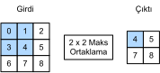

# Biriktirme
:label:`sec_pooling`

Çoğu zaman, imgeleri işledikçe, gizli temsillerimizin konumsal çözünürlüğünü yavaş yavaş azaltmak istiyoruz, böylece ağda ne kadar yükseğe çıkarsak, her gizli düğümün hassas olduğu alım alanı (girdide) o kadar büyük olur.

Genellikle esas görevimiz bize imge hakkında küresel bir soru sormaktadır, örn. *bir kedi içeriyor mu?* Bu nedenle tipik olarak son katmanımızın birimleri tüm girdiye karşı hassas olmalıdır. Bilgiyi kademeli olarak toplayarak, daha kaba eşlemeler üreterek, en sonunda küresel bir gösterimi öğrenme amacını gerçekleştiriyoruz ve bunu yaparken evrişimli ara katmanlardaki işlemlerin tüm avantajlarını tutuyoruz.

Dahası, kenarlar gibi (:numref:`sec_conv_layer`'te tartışıldığına benzer) alt seviye öznitelikleri tespit ederken, genellikle temsillerimizin çevirilerden etkilenmez olmasını isteriz. Örneğin, siyah beyaz arasında keskin gösterimli bir `X` imgesini alıp tüm imgeyi bir pikselle sağa kaydırırsak, yani `Z[i, j] = X[i, j + 1]`, yeni imgenin çıktısı çok farklı olabilir. Kenar bir piksel ile kaydırılmış olacaktır. Gerçekte, nesneler neredeyse hiç bir zaman aynı yerde olmaz. Aslında, bir tripod ve sabit bir nesneyle bile, deklanşörün hareketi nedeniyle kameranın titreşimi her şeyi bir piksel kaydırabilir (üst düzey kameralar bu sorunu gidermek için özel özelliklerle donatılmıştır).

Bu bölümde, evrişimli katmanların konuma duyarlılığını azaltmak ve gösterimleri uzaysal altörneklemek gibi ikili amaçlara hizmet eden *biriktirme katmanları* tanıtılmaktadır.

## Maksimum Biriktirme ve Ortalama Biriktirme

*Biriktirme* işlemcileri, evrişimli katmanlar gibi, sabit şekilli pencerenin (bazen *biriktirme penceresi* olarak da bilinir) geçtiği her konum için tek bir çıktı hesaplayarak, uzun adımına göre girdideki tüm bölgelere kaydırılan sabit şekilli bir pencereden oluşur. Bununla birlikte, evrişimli katmandaki girdi ve çekirdeklerin çapraz korelasyon hesaplamasının aksine, biriktirme katmanı hiçbir parametre içermez (*çekirdek* yoktur). Bunun yerine, biriktirme uygulayıcıları belirleyicidir (determinist) ve genellikle biriktirme penceresindeki öğelerin maksimum veya ortalama değerini hesaplar. Bu işlemler sırasıyla *maksimum biriktirme* (*kısaca biriktirme*) ve *ortalama biriktirme* olarak adlandırılır.

Her iki durumda da, çapraz korelasyon uygulayıcısında olduğu gibi, biriktirme penceresinin girdi tensörünün sol üstünden başlayarak girdi tensörünün soldan sağa ve yukarıdan aşağıya doğru kayması olarak düşünebiliriz. Biriktirme penceresinin vurduğu her konumda, maksimum veya ortalama biriktirmenın kullanılmasına bağlı olarak, pencerede girdi alt tensörünün maksimum veya ortalama değerini hesaplar.


:label:`fig_pooling`

:numref:`fig_pooling`'teki çıktı tensör 2'lik yüksekliğe ve 2'lik, genişliğe sahiptir. Dört öğe, her biriktirme penceresindeki maksimum değerden türetilir:

$$
\max(0, 1, 3, 4)=4,\\
\max(1, 2, 4, 5)=5,\\
\max(3, 4, 6, 7)=7,\\
\max(4, 5, 7, 8)=8.\\
$$

Biriktirme penceresi şeklindeki $p \times q$ biriktirme katmanına $p \times q$ biriktirme katmanı denir. Biriktirme işlemi $p \times q$ biriktirme olarak adlandırılır.

Bu bölümün başında belirtilen nesne kenar algılama örneğine dönelim. Şimdi $2\times 2$ maksimum biriktirme için girdi olarak evrişimli tabakanın çıktısını kullanacağız. Evrişimli katman girdisini `X` ve biriktirme katmanı çıktısını `Y` olarak düzenleyelim. `X[i, j]` ve `X[i, j + 1]` veya `X[i, j + 1]` ve `X[i, j + 2]` değerleri farklı olsa da olmasa da, biriktirme katmanı her zaman `Y[i, j] = 1` çıktısını verir. Yani, $2\times 2$ maksimum biriktirme katmanını kullanarak, evrişimli katman tarafından tanınan desenin yükseklik veya genişlik olarak birden fazla eleman yine de hareket edip etmediğini tespit edebiliriz.

Aşağıdaki kodda, `pool2d` işlevinde biriktirme katmanının ileri yaymasını uyguluyoruz. Bu işlev :numref:`sec_conv_layer`'teki `corr2d` işlevine benzer. Ancak, burada çekirdeğimiz yok, çıktıyı girdideki her bölgenin maksimumu veya ortalaması olarak hesaplıyoruz.

```{.python .input}
from d2l import mxnet as d2l
from mxnet import np, npx
from mxnet.gluon import nn
npx.set_np()
```

```{.python .input}
#@tab pytorch
from d2l import torch as d2l
import torch
from torch import nn
```

```{.python .input}
#@tab mxnet, pytorch
def pool2d(X, pool_size, mode='max'):
    p_h, p_w = pool_size
    Y = d2l.zeros((X.shape[0] - p_h + 1, X.shape[1] - p_w + 1))
    for i in range(Y.shape[0]):
        for j in range(Y.shape[1]):
            if mode == 'max':
                Y[i, j] = X[i: i + p_h, j: j + p_w].max()
            elif mode == 'avg':
                Y[i, j] = X[i: i + p_h, j: j + p_w].mean()
    return Y
```

```{.python .input}
#@tab tensorflow
import tensorflow as tf

def pool2d(X, pool_size, mode='max'):
    p_h, p_w = pool_size
    Y = tf.Variable(tf.zeros((X.shape[0] - p_h + 1, X.shape[1] - p_w +1)))
    for i in range(Y.shape[0]):
        for j in range(Y.shape[1]):
            if mode == 'max':
                Y[i, j].assign(tf.reduce_max(X[i: i + p_h, j: j + p_w]))
            elif mode =='avg':
                Y[i, j].assign(tf.reduce_mean(X[i: i + p_h, j: j + p_w]))
    return Y
```

İki boyutlu maksimum biriktirme tabakasının çıktısını doğrulamak için :numref:`fig_pooling`'te girdi tensörü `X`'i inşa ediyoruz.

```{.python .input}
#@tab all
X = d2l.tensor([[0.0, 1.0, 2.0], [3.0, 4.0, 5.0], [6.0, 7.0, 8.0]])
pool2d(X, (2, 2))
```

Ayrıca, ortalama biriktirme katmanıyla da deney yapalım.

```{.python .input}
#@tab all
pool2d(X, (2, 2), 'avg')
```

## Dolgu ve Uzun Adım

Evrişimli katmanlarda olduğu gibi, biriktirme katmanları da çıktının şeklini değiştirebilir. Ve daha önce olduğu gibi, girdiyi dolgulayarak ve uzun adımı ayarlayarak istenen çıktı şeklini elde etmek için işlemi değiştirebiliriz. Derin öğrenme çerçevesinden yerleşik iki boyutlu maksimum biriktirme katmanı aracılığıyla biriktirme katmanlarında dolgu ve uzun adımların kullanımını gösterebiliriz. İlk olarak dört boyutlu şekle sahip bir `X` girdi tensörü inşa ediyoruz, burada örneklerin ve kanalların sayısının her ikisi de 1'dir.

```{.python .input}
#@tab mxnet, pytorch
X = d2l.reshape(d2l.arange(16, dtype=d2l.float32), (1, 1, 4, 4))
X
```

```{.python .input}
#@tab tensorflow
X = d2l.reshape(d2l.arange(16, dtype=d2l.float32), (1, 4, 4, 1))
X
```

Varsayılan olarak, çerçevenin yerleşik sınıfındaki örnekteki uzun adım ve biriktirme penceresi aynı şekle sahiptir. Aşağıda, `(3, 3)` şeklindeki bir biriktirme penceresi kullanıyoruz, bu nedenle varsayılan olarak `(3, 3)`'lük bir adım şekli alıyoruz.

```{.python .input}
pool2d = nn.MaxPool2D(3)
# Because there are no model parameters in the pooling layer, we do not need
# to call the parameter initialization function
pool2d(X)
```

```{.python .input}
#@tab pytorch
pool2d = nn.MaxPool2d(3)
pool2d(X)
```

```{.python .input}
#@tab tensorflow
pool2d = tf.keras.layers.MaxPool2D(pool_size=[3, 3])
pool2d(X)
```

Uzun adım ve dolgu manuel olarak belirtilebilir.

```{.python .input}
pool2d = nn.MaxPool2D(3, padding=1, strides=2)
pool2d(X)
```

```{.python .input}
#@tab pytorch
pool2d = nn.MaxPool2d(3, padding=1, stride=2)
pool2d(X)
```

```{.python .input}
#@tab tensorflow
pool2d = tf.keras.layers.MaxPool2D(pool_size=[3, 3], padding='same',
                                   strides=2)
pool2d(X)
```

Tabii ki, keyfi bir dikdörtgen biriktirme penceresi belirleyebilir ve sırasıyla yükseklik ve genişlik için dolguyu ve uzun adımı belirtebiliriz.

```{.python .input}
pool2d = nn.MaxPool2D((2, 3), padding=(1, 2), strides=(2, 3))
pool2d(X)
```

```{.python .input}
#@tab pytorch
pool2d = nn.MaxPool2d((2, 3), padding=(1, 1), stride=(2, 3))
pool2d(X)
```

```{.python .input}
#@tab tensorflow
pool2d = tf.keras.layers.MaxPool2D(pool_size=[2, 3], padding='same',
                                   strides=(2, 3))
pool2d(X)
```

## Çoklu Kanal

Çok kanallı girdi verilerini işlerken, biriktirme katmanı, girdileri bir evrişimli katmanda olduğu gibi kanallar üzerinden toplamak yerine her girdi kanalını ayrı ayrı biriktirir. Bu, biriktirme katmanının çıktı kanallarının sayısının girdi kanalı sayısıyla aynı olduğu anlamına gelir. Aşağıda, 2 kanallı bir girdi oluşturmak için kanal boyutundaki `X` ve `X + 1` tensörleri birleştiriyoruz.

```{.python .input}
#@tab mxnet, pytorch
X = d2l.concat((X, X + 1), 1)
X
```

```{.python .input}
#@tab tensorflow
X = tf.reshape(tf.stack([X, X+1], 0), (1, 2, 4, 4))
```

Gördüğümüz gibi, çıktı kanallarının sayısı biriktirmeden sonra hala 2'dir.

```{.python .input}
pool2d = nn.MaxPool2D(3, padding=1, strides=2)
pool2d(X)
```

```{.python .input}
#@tab pytorch
pool2d = nn.MaxPool2d(3, padding=1, stride=2)
pool2d(X)
```

```{.python .input}
#@tab tensorflow
pool2d = tf.keras.layers.MaxPool2D(3, padding='same', strides=2)
pool2d(X)
```

## Özet

* Biriktirme penceresinde girdi öğelerini alarak, maksimum biriktirme işlemi çıktı olarak maksimum değeri atar ve ortalama biriktirme işlemi ortalama değeri çıktı olarak atar.
* Bir biriktirme tabakasının en önemli avantajlarından biri, evrişimli tabakanın konumuna aşırı duyarlılığını hafifletmektir.
* Biriktirme katmanı için dolgu ve uzun adım belirtebiliriz.
* Uzamsal boyutları (örn. genişlik ve yükseklik) azaltmak için 1'den büyük bir uzun adımla birlikte maksimum biriktirme kullanılabilir.
* Biriktirme katmanının çıktı kanalı sayısı, girdi kanallarının sayısıyla aynıdır.

## Alıştırmalar

1. Bir evrişim tabakasının özel bir durumu olarak ortalama biriktirme uygulayabilir misiniz? Eğer öyleyse, yapınız.
1. Bir evrişim tabakasının özel bir durumu olarak maksimum biriktirme uygulayabilir misiniz? Eğer öyleyse, yapınız.
1. Biriktirme katmanının hesaplama maliyeti nedir? Biriktirme katmanına girdi boyutunun $c\times h\times w$ olduğunu, biriktirme penceresinin $p_h\times p_w$ bir şekle sahip, $(p_h, p_w)$ dolgulu ve $(s_h, s_w)$ uzun adımlı olduğunu varsayalım.
1. Neden maksimum biriktirme ile ortalama biriktirmenin farklı çalışmasını beklersiniz?
1. Ayrı bir minimum biriktirme katmanına ihtiyacımız var mıdır? Onu başka bir işlemle değiştirebilir misiniz?
1. Ortalama ve maksimum biriktirme arasında düşünebileceğiniz başka bir işlem var mıdır (İpucu: Softmaks'i anımsayın)? Neden o kadar popüler olmayacaktır?

:begin_tab:`mxnet`
[Tartışmalar](https://discuss.d2l.ai/t/71)
:end_tab:

:begin_tab:`pytorch`
[Tartışmalar](https://discuss.d2l.ai/t/72)
:end_tab:

:begin_tab:`tensorflow`
[Tartışmalar](https://discuss.d2l.ai/t/274)
:end_tab:
