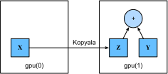

# GPU (Grafik İşleme Birimi)
:label:`sec_use_gpu`

:numref:`tab_intro_decade` için de, son yirmi yılda hesaplamanın hızlı büyümesini tartıştık. Özetle, GPU performansı 2000 yılından bu yana her on yılda bir 1000 kat artmıştır. Bu büyük fırsatlar sunarken aynı zamanda bu tür bir performansın sağlanması için önemli bir gereksinim olduğunu da göstermektedir.


Bu bölümde, araştırmanız için bu hesaplamalı performanstan nasıl yararlanılacağını tartışmaya başlıyoruz. Öncelikle tek GPU'ları kullanarak ve daha sonra, birden çok GPU ve birden çok sunucuyu (birden çok GPU ile) nasıl kullanacağınızı tartışacağız.

Özellikle, hesaplamalar için tek bir NVIDIA GPU'nun nasıl kullanılacağını tartışacağız. İlk olarak kurulu en az bir NVIDIA GPU'nuz olduğundan emin olun. Ardından, [NVIDIA sürücüsünü ve CUDA'yı](https://developer.nvidia.com/cuda-downloads) indirin ve uygun yere kurmak için istemleri takip edin. Bu hazırlıklar tamamlandıktan sonra, `nvidia-smi`, (**komutu grafik kartı bilgilerini görüntülemek için kullanılabilir.**)

```{.python .input}
#@tab all
!nvidia-smi
```

:begin_tab:`mxnet`
Bir MXNet tensörünün bir NumPy `ndarray`'i ile neredeyse aynı göründüğünü fark etmiş olabilirsiniz.

Ancak birkaç önemli farklılık var. MXNet'i NumPy'den ayıran temel özelliklerden biri, çeşitli donanım aygıtlarına desteğidir.

MXNet'te her dizilimin (array) bir bağlamı vardır. Şimdiye kadar, varsayılan olarak, tüm değişkenler ve ilişkili hesaplamalar CPU'ya atanmıştır. Tipik olarak, diğer bağlamlar çeşitli GPU'lar olabilir. İşleri birden çok sunucuya dağıttığımızda işler arap saçına dönebilir. Dizilimleri bağlamlara akıllıca atayarak, cihazlar arasında veri aktarımında harcanan zamanı en aza indirebiliriz. Örneğin, GPU'lu bir sunucuda sinir ağlarını eğitirken, genellikle modelin parametrelerinin GPU'da kalmasını tercih ederiz.

Ardından, MXNet'in GPU sürümünün kurulu olduğunu onaylamamız gerekiyor. MXNet'in bir CPU sürümü zaten kuruluysa, önce onu kaldırmamız gerekir. Örneğin, `pip uninstall mxnet` komutunu kullanın, ardından CUDA sürümünüze göre ilgili MXNet sürümünü kurun. CUDA 10.0'un kurulu olduğunu varsayarsak, CUDA 10.0'u destekleyen MXNet sürümünü `pip install mxnet-cu100` aracılığıyla kurabilirsiniz.
:end_tab:

:begin_tab:`pytorch`
PyTorch'ta her dizilimin bir aygıtı vardır, biz onu genellikle bağlam olarak adlandırırız. Şimdiye kadar, varsayılan olarak, tüm değişkenler ve ilişkili hesaplama CPU'ya atanmıştır. Tipik olarak, diğer bağlamlar çeşitli GPU'lar olabilir. İşleri birden çok sunucuya dağıttığımızda işler arap saçına dönebilir. Dizileri bağlamlara akıllıca atayarak, cihazlar arasında veri aktarımında harcanan zamanı en aza indirebiliriz. Örneğin, GPU'lu bir sunucuda sinir ağlarını eğitirken, genellikle modelin parametrelerinin GPU'da kalmasını tercih ederiz.

Ardından, PyTorch'un GPU sürümünün kurulu olduğunu onaylamamız gerekiyor. PyTorch'un bir CPU sürümü zaten kuruluysa, önce onu kaldırmamız gerekir. Örneğin, `pip uninstall torch` komutunu kullanın, ardından CUDA sürümünüze göre ilgili PyTorch sürümünü kurun. CUDA 10.0'un kurulu olduğunu varsayarsak, CUDA 10.0'u destekleyen PyTorch sürümünü `pip install torch-cu100` aracılığıyla kurabilirsiniz.
:end_tab:

Bu bölümdeki programları çalıştırmak için en az iki GPU'ya ihtiyacınız var. Bunun çoğu masaüstü bilgisayar için abartılı olabileceğini, ancak bulutta (ör. AWS EC2 çoklu-GPU bulut sunucularını kullanarak) kolayca kullanılabileceğini unutmayın. Hemen hemen diğer bütün bölümler birden fazla GPU *gerektirmez*. Bunun burdaki kullanım nedeni, basitçe verilerin farklı cihazlar arasında nasıl aktığını göstermektir.

## [**Hesaplama Cihazları**]

Depolama ve hesaplama için CPU ve GPU gibi cihazları belirtebiliriz. Varsayılan olarak, ana bellekte tensörler oluşturulur ve ardından bunu hesaplamak için CPU'yu kullanır.

:begin_tab:`mxnet`
MXNet'te CPU ve GPU, `cpu()` ve `gpu()` ile gösterilebilir. `cpu()` (veya parantez içindeki herhangi bir tam sayı), tüm fiziksel CPU'lar ve bellek anlamına gelir. Bu, MXNet'in hesaplamalarının tüm CPU çekirdeklerini kullanmaya çalışacağı anlamına gelir. Ancak, `gpu()` yalnızca bir kartı ve ona denk gelen belleği temsil eder. Birden fazla GPU varsa, $i.$ GPU'yu ($i$ 0'dan başlar) temsil etmek için `gpu(i)`'yu kullanırız. Ayrıca, `gpu(0)` ve `gpu()` eşdeğerdir.
:end_tab:

:begin_tab:`pytorch`
PyTorch'ta CPU ve GPU, `torch.device('cpu')` ve `torch.device('cuda')` ile gösterilebilir. `cpu` aygıtının tüm fiziksel CPU'lar ve bellek anlamına geldiğine dikkat edilmelidir. Bu, PyTorch'un hesaplamalarının tüm CPU çekirdeklerini kullanmaya çalışacağı anlamına gelir. Bununla birlikte, bir `gpu` cihazı yalnızca bir kartı ve ona denk gelen belleği temsil eder. Birden çok GPU varsa, $i.$ GPU ($i$ 0'dan başlar) temsil etmek için `torch.device(f'cuda:{i}')`yi kullanırız. Ayrıca `gpu:0` ve `gpu` eşdeğerdir.
:end_tab:

```{.python .input}
from mxnet import np, npx
from mxnet.gluon import nn
npx.set_np()

npx.cpu(), npx.gpu(), npx.gpu(1)
```

```{.python .input}
#@tab pytorch
import torch
from torch import nn

torch.device('cpu'), torch.device('cuda'), torch.device('cuda:1')
```

```{.python .input}
#@tab tensorflow
import tensorflow as tf

tf.device('/CPU:0'), tf.device('/GPU:0'), tf.device('/GPU:1')
```

(**Mevcut GPU adetini sorgulayabiliriz.**)

```{.python .input}
npx.num_gpus()
```

```{.python .input}
#@tab pytorch
torch.cuda.device_count()
```

```{.python .input}
#@tab tensorflow
len(tf.config.experimental.list_physical_devices('GPU'))
```

Şimdi, [**istenen GPU'lar var olmasa bile kodları çalıştırmamıza izin veren iki kullanışlı işlev tanımlıyoruz.**]

```{.python .input}
def try_gpu(i=0):  #@save
    """Varsa gpu(i) döndürün, aksi takdirde cpu() döndürün."""
    return npx.gpu(i) if npx.num_gpus() >= i + 1 else npx.cpu()

def try_all_gpus():  #@save
    """Mevcut tüm GPU'ları veya GPU yoksa [cpu()] döndürün."""
    devices = [npx.gpu(i) for i in range(npx.num_gpus())]
    return devices if devices else [npx.cpu()]

try_gpu(), try_gpu(10), try_all_gpus()
```

```{.python .input}
#@tab pytorch
def try_gpu(i=0):  #@save
    """Varsa gpu(i) döndürün, aksi takdirde cpu() döndürün."""
    if torch.cuda.device_count() >= i + 1:
        return torch.device(f'cuda:{i}')
    return torch.device('cpu')

def try_all_gpus():  #@save
    """Mevcut tüm GPU'ları veya GPU yoksa [cpu()] döndürün."""
    devices = [torch.device(f'cuda:{i}')
             for i in range(torch.cuda.device_count())]
    return devices if devices else [torch.device('cpu')]

try_gpu(), try_gpu(10), try_all_gpus()
```

```{.python .input}
#@tab tensorflow
def try_gpu(i=0):  #@save
    """Varsa gpu(i) döndürün, aksi takdirde cpu() döndürün."""
    if len(tf.config.experimental.list_physical_devices('GPU')) >= i + 1:
        return tf.device(f'/GPU:{i}')
    return tf.device('/CPU:0')

def try_all_gpus():  #@save
    """Mevcut tüm GPU'ları veya GPU yoksa [cpu()] döndürün."""
    num_gpus = len(tf.config.experimental.list_physical_devices('GPU'))
    devices = [tf.device(f'/GPU:{i}') for i in range(num_gpus)]
    return devices if devices else [tf.device('/CPU:0')]

try_gpu(), try_gpu(10), try_all_gpus()
```

## Tensörler and GPUlar

Varsayılan olarak, CPU'da tensörler oluşturulur. [**Tensörün bulunduğu cihazı sorgulayabiliriz.**]

```{.python .input}
x = np.array([1, 2, 3])
x.ctx
```

```{.python .input}
#@tab pytorch
x = torch.tensor([1, 2, 3])
x.device
```

```{.python .input}
#@tab tensorflow
x = tf.constant([1, 2, 3])
x.device
```

Birden çok terimle çalışmak istediğimizde, aynı bağlamda olmaları gerektiğine dikkat etmemiz önemlidir. Örneğin, iki tensörü toplarsak, her iki argümanın da aynı cihazda olduğundan emin olmamız gerekir---aksi takdirde çerçeve, sonucu nerede saklayacağını ve hatta hesaplamayı nerede gerçekleştireceğine nasıl karar vereceğini bilemez.

### GPU'da Depolama

[**GPU'da bir tensör depolamanın**] birkaç yolu vardır. Örneğin, bir tensör oluştururken bir depolama cihazı belirleyebiliriz. Sonra, ilk `gpu`'da tensör değişkeni `X`'i oluşturuyoruz. Bir GPU'da oluşturulan tensör yalnızca o GPU'nun belleğini harcar. GPU bellek kullanımını görüntülemek için `nvidia-smi` komutunu kullanabiliriz. Genel olarak, GPU bellek sınırını aşan veriler oluşturmadığımızdan emin olmamız gerekir.

```{.python .input}
X = np.ones((2, 3), ctx=try_gpu())
X
```

```{.python .input}
#@tab pytorch
X = torch.ones(2, 3, device=try_gpu())
X
```

```{.python .input}
#@tab tensorflow
with try_gpu():
    X = tf.ones((2, 3))
X
```

En az iki GPU'ya sahip olduğunuzu varsayarak, aşağıdaki kod (**ikinci GPU'da keyfi bir tensor oluşturacaktır.**)

```{.python .input}
Y = np.random.uniform(size=(2, 3), ctx=try_gpu(1))
Y
```

```{.python .input}
#@tab pytorch
Y = torch.rand(2, 3, device=try_gpu(1))
Y
```

```{.python .input}
#@tab tensorflow
with try_gpu(1):
    Y = tf.random.uniform((2, 3))
Y
```

### Kopyalama

[**`X + Y`'yi hesaplamak istiyorsak, bu işlemi nerede gerçekleştireceğimize karar vermemiz gerekir.**] Örneğin :numref:`fig_copyto` içinde gösterildiği gibi, `X`'i ikinci GPU'ya aktarabilir ve işlemi orada gerçekleştirebiliriz. Sadece `X` ve `Y`'yi *toplamayın*, çünkü bu bir istisnayla sonuçlanacaktır. Koşma zamanı motoru ne yapacağını bilemez: Veriyi aynı cihazda bulamaz ve başarısız olur. Çünkü `Y` ikinci GPU'da bulunur, ikisini toplamadan önce `X`'i taşımamız gerekir.


:label:`fig_copyto`


```{.python .input}
Z = X.copyto(try_gpu(1))
print(X)
print(Z)
```

```{.python .input}
#@tab pytorch
Z = X.cuda(1)
print(X)
print(Z)
```

```{.python .input}
#@tab tensorflow
with try_gpu(1):
    Z = X
print(X)
print(Z)
```

Artık [**veriler aynı GPU'da olduğuna göre (hem `Z` hem de `Y`), onları toplayabiliriz.**]

```{.python .input}
#@tab all
Y + Z
```

:begin_tab:`mxnet`
`Z` değişkeninizin halihazırda ikinci GPU'nuzda olduğunu hayal edin. Gene de `Z.copyto(gpu(1))` çağırırsak ne olur? Değişken istenen cihazda zaten bulunsa bile, yeni bir kopya oluşturacak ve bellek tahsis edecektir. Kodumuzun çalıştığı ortama bağlı olarak, aynı cihazda iki değişkenin zaten var olduğu zamanlar vardır. Dolayısıyla, değişkenler şu anda farklı cihazlarda bulunuyorsa yalnızca bir kopya yapmak isteriz. Bu durumlarda, `as_in_ctx`'i çağırabiliriz. Değişken zaten belirtilen cihazda bulunuyorsa, bu işlem-yok (no-op) demektir. Özellikle bir kopya yapmak istemediğiniz sürece, `as_in_ctx` tercih edilen yöntemdir.
:end_tab:

:begin_tab:`pytorch`
`Z` değişkeninizin halihazırda ikinci GPU'nuzda var olduğunu hayal edin. Gene de `Z.cuda(1)` diye çağırırsak ne olur? Kopyalamak ve yeni bellek ayırmak yerine `Z`'yi döndürür.
:end_tab:

:begin_tab:`tensorflow`
`Z` değişkeninizin halihazırda ikinci GPU'nuzda ver olduğunu hayal edin. Aynı cihaz kapsamı altında gene de `Z2 = Z`'yi çağırırsak ne olur? Kopyalamak ve yeni bellek ayırmak yerine `Z`'yi döndürür.
:end_tab:

```{.python .input}
Z.as_in_ctx(try_gpu(1)) is Z
```

```{.python .input}
#@tab pytorch
Z.cuda(1) is Z
```

```{.python .input}
#@tab tensorflow
with try_gpu(1):
    Z2 = Z
Z2 is Z
```

### Ek Notlar

İnsanlar hızlı olmalarını beklediklerinden makine öğrenmesi için GPU'ları kullanıyorlar. Ancak değişkenlerin cihazlar arasında aktarılması yavaştır. Bu yüzden, yapmanıza izin vermeden önce yavaş bir şey yapmak istediğinizden %100 emin olmanızı istiyoruz. Derin öğrenme çerçevesi kopyayı çökmeden otomatik olarak yaptıysa, yavaş çalışan bir kod yazdığınızı fark etmeyebilirsiniz.

Ayrıca, cihazlar (CPU, GPU'lar ve diğer makineler) arasında veri aktarımı, hesaplamadan çok daha yavaş bir şeydir. Ayrıca, daha fazla işlem ile ilerlemeden önce verilerin gönderilmesini (veya daha doğrusu alınmasını) beklememiz gerektiğinden bu paralelleştirmeyi çok daha zor hale getirir. Bu nedenle kopyalama işlemlerine büyük özen gösterilmelidir. Genel bir kural olarak, birçok küçük işlem, tek bir büyük işlemden çok daha kötüdür. Dahası, bir seferde birkaç işlem, koda serpiştirilmiş birçok tek işlemden çok daha iyidir, ne yaptığınızı biliyorsanız o ayrı. Bu durumda, bir aygıtın bir şey yapmadan önce bir diğerini beklemesi gerektiğinde bu tür işlemler onu engelleyebilir. Bu biraz, kahvenizi telefonla ön sipariş vermek ve siz istediğinizde hazır olduğunu öğrenmek yerine sırada bekleyerek sipariş etmek gibidir.

Son olarak, tensörleri yazdırdığımızda veya tensörleri NumPy formatına dönüştürdüğümüzde, veri ana bellekte değilse, çerçeve onu önce ana belleğe kopyalayacak ve bu da ek iletim yüküne neden olacaktır. Daha da kötüsü, şimdi Python'un her şeyi  tamamlanmasını beklemesine neden olan o korkunç global yorumlayıcı kilidine tabidir.

## [**Sinir Ağları ve GPUlar**]

Benzer şekilde, bir sinir ağı modeli cihazları belirtebilir. Aşağıdaki kod, model parametrelerini GPU'ya yerleştirir.

```{.python .input}
net = nn.Sequential()
net.add(nn.Dense(1))
net.initialize(ctx=try_gpu())
```

```{.python .input}
#@tab pytorch
net = nn.Sequential(nn.Linear(3, 1))
net = net.to(device=try_gpu())
```

```{.python .input}
#@tab tensorflow
strategy = tf.distribute.MirroredStrategy()
with strategy.scope():
    net = tf.keras.models.Sequential([
        tf.keras.layers.Dense(1)])
```
Aşağıdaki bölümlerde GPU'larda modellerin nasıl çalıştırılacağına dair daha birçok örnek göreceğiz, çünkü onlar hesaplama açısından biraz daha yoğun hale gelecekler.

Girdi, GPU'da bir tensör olduğunda, model sonucu aynı GPU'da hesaplayacaktır.

```{.python .input}
#@tab all
net(X)
```

(**Model parametrelerinin aynı GPU'da depolandığını doğrulayalım.**)

```{.python .input}
net[0].weight.data().ctx
```

```{.python .input}
#@tab pytorch
net[0].weight.data.device
```

```{.python .input}
#@tab tensorflow
net.layers[0].weights[0].device, net.layers[0].weights[1].device
```

Kısacası tüm veriler ve parametreler aynı cihazda olduğu sürece modelleri verimli bir şekilde öğrenebiliriz. Sonraki bölümlerde bu tür birkaç örnek göreceğiz.

## Özet

* Depolama ve hesaplama için CPU veya GPU gibi cihazları belirleyebiliriz. Varsayılan olarak, veriler ana bellekte oluşturulur ve ardından hesaplamalar için CPU kullanılır.
* Derin öğrenme çerçevesi, hesaplama için tüm girdi verilerinin aynı cihazda olmasını gerektirir, ister CPU ister aynı GPU olsun.
* Verileri dikkatsizce taşıyarak önemli bir performans kaybına uğrayabilirsiniz. Tipik bir hata şudur: GPU'daki her minigrup için kaybı hesaplamak ve bunu komut satırında kullanıcıya geri bildirmek (veya bir NumPy `ndarray`'de kaydetmek), bu tüm GPU'ları durduran global yorumlayıcı kilidini tetikleyecektir. GPU içinde kayıt tutmak için bellek ayırmak ve yalnızca daha büyük kayıtları taşımak çok daha iyidir.

## Alıştırmalar

1. Büyük matrislerin çarpımı gibi daha büyük bir hesaplama görevi deneyiniz ve CPU ile GPU arasındaki hız farkını görünüz. Az miktarda hesaplama içeren bir göreve ne olur?
1. GPU'daki model parametrelerini nasıl okuyup yazmalıyız?
1. $100 \times 100$'lük 1000 matris-matris çarpımını hesaplamak için gereken süreyi ölçünüz ve her seferde bir sonucun çıktı matrisinin Frobenius normunu günlüğe kaydetmeye karşılık GPU'da günlük tutma ve yalnızca son sonucu aktarmayı kıyaslayınız.
1. İki GPU'da iki matris-matris çarpımını aynı anda gerçekleştirme ile tek bir GPU'da sıralı gerçekleştirmenin ne kadar zaman aldığını ölçerek karşılaştırınız. İpucu: Neredeyse doğrusal bir ölçekleme görmelisiniz.

:begin_tab:`mxnet`
[Tartışmalar](https://discuss.d2l.ai/t/62)
:end_tab:

:begin_tab:`pytorch`
[Tartışmalar](https://discuss.d2l.ai/t/63)
:end_tab:

:begin_tab:`tensorflow`
[Tartışmalar](https://discuss.d2l.ai/t/270)
:end_tab:
