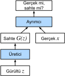

# Çekişmeli Üretici Ağlar
:label:`sec_basic_gan`

Bu kitabın çoğunda, nasıl tahmin yapabileceğimiz hakkında konuştuk. O yada bu şekilde, veri örneklerini etiketlere eşleyen derin sinir ağlarını öğrendik. Bu tür öğrenmeye ayrımcı öğrenme denir, çünkü kedi ve köpek fotoğrafları arasında ayrım yapabilmelerini istiyoruz. Sınıflandırıcılar ve bağlanımcılar (regressor), ayrımcı öğrenmenin örnekleridir. Geri yayma ile eğitilen sinir ağları, büyük karmaşık veri kümelerinde ayrımcı öğrenme hakkında bildiğimizi düşündüğümüz her şeyi altüst etmeyi başardı. Yüksek çözünürlüklü imgelerdeki sınıflandırma doğruluk oranı, sadece 5-6 yıl içinde işe yaramazlık düzeyinden insan düzeyine (bazı kısıtlamalarla) geldi. Bu bölümde, derin sinir ağlarının şaşırtıcı derecede iyi yaptığı diğer ayrımcı görevler hakkında tartışacağız.

Ancak makine öğrenmesinde ayrımcı problemler çözmekten daha ötesi vardır. Örneğin, herhangi bir etiket içermeyen büyük bir veri kümesi verildiğinde, bu verinin karakterini kısaca özetleyen bir model öğrenmek isteyebiliriz. Böyle bir model verildiğinde, eğitim verisinin dağılımına benzeyen sentetik veri örnekleri örnekleyebiliriz. Örneğin, büyük bir yüz fotoğrafı külliyatı verildiğinde, makul bir şekilde, aynı veri kümesinden gelmiş gibi görünen yeni bir foto-gerçekçi imge oluşturabilmeyi isteyebiliriz. Bu tür öğrenmeye üretici modelleme denir.

Yakın zamana kadar, yeni foto-gerçekçi görüntüleri sentezleyebilecek bir yöntem yoktu. Ancak derin sinir ağlarının ayrımcı öğrenmedeki başarısı yeni olasılıkların ortaya çıkmasına vesile oldu. Son üç yıldaki büyük bir yönelim de genellikle gözetimli öğrenme problemi gibi düşünmediğimiz problemlerdeki zorlukların üstesinden gelmede ayrımcı derin ağların kullanılması olmuştur. Yinelemeli sinir ağı dil modelleri, bir kez eğitildikten sonra üretici bir model olarak davranabilen  (sonraki karakteri tahmin etmek için eğitilmiş) ayrımcı ağ kullanmanın iyi bir örneğidir.

2014'te çığır açan bir makalede, Çekişmeli Üretici Ağlar (GAN'lar) tanıtıldı :cite:`Goodfellow.Pouget-Abadie.Mirza.ea.2014`, iyi üretici modeller elde etmek için ayrımcı modellerin gücünden yararlanmada akıllıca yeni bir yol gösterildi. GAN'lar, eğer gerçek veriler ile sahte veriler ayrılamıyorsa, o zaman veri üreticinin başarılı olduğu fikrine dayanırlar. İstatistikte buna ikili-örneklem testi denir -  $X=\{x_1,\ldots, x_n\}$ ve $X'=\{x'_1,\ldots, x'_n\}$ veri kümelerinin aynı dağılımdan çekilmiş olup olmadığı sorusuna cevap vermek için yapılan bir testtir. Çoğu istatistik makalesi ile GAN arasındaki temel fark, ikincisinin bu fikri yapıcı bir şekilde kullanmasıdır. Başka bir deyişle, "hey, bu iki veri kümesi aynı dağılımdan gelmiş gibi görünmüyor" demek için bir model eğitmek yerine, [ikili-örneklem testini](https://en.wikipedia.org/wiki/Two-sample_hypothesis_testing) üretici bir modele eğitim sinyalleri sağlamak için kullandılar. Bu bize gerçek verilere benzeyen bir şey üretene kadar veri üreticiyi iyileştirme olanağını tanır. Sınıflandırıcımız son teknoloji bir derin sinir ağı da olsa bile üreticinin en azından sınıflandırıcıyı kandırabilmesi gerekir.


:label:`fig_gan`

GAN mimarisi şu şekilde gösterilmektedir :numref:`fig_gan`.
Gördüğünüz gibi, GAN mimarisinde iki parça bulunur - öncelikle, potansiyel olarak gerçek gibi görünen verileri üretebilecek bir cihaza ihtiyacımız vardır (bir derin ağ düşünebiliriz, fakat oyun oluşturma motoru gibi herhangi bir şey de olabilir). İmgelerle uğraşıyorsak, bu imge üretmeyi gerektirir. Mesela konuşmayla uğraşıyorsak, ses dizileri üretmeyi gerektirir. Buna üretici ağ diyoruz. İkinci bileşen, ayrımcı ağdır. Sahte ve gerçek verileri birbirinden ayırt etmeye çalışır. Her iki ağ da birbiriyle rekabet içindedir. Üretici ağ, ayrımcı ağı kandırmaya çalışır. Bir noktada ayrımcı ağ yeni sahte verilere uyum sağlar. Bu bilgi de üretici ağı iyileştirmek için kullanılır.

Ayrımcı, $x$ girdisinin gerçek mi (gerçek veriden) yoksa sahte mi (üreticiden) olduğunu ayırt eden bir ikili sınıflandırıcıdır. Tipik olarak, ayrımcı $\mathbf x$ girdisi için bir skaler tahmin, $o \in \mathbb R$, verir ve bunun için mesela gizli boyutu 1 olan yoğun bir katman kullanabilir ve ardından da tahmin olasılığı, $D(\mathbf x) = 1/(1+e^{-o})$, için sigmoid fonksiyonunu uygulayabilir. $y$ etiketinin gerçek veriler için $1$ ve sahte veriler için $0$ olduğunu varsayalım. Ayrımcıyı, çapraz entropi kaybını en aza indirecek şekilde eğitiriz, *yani*,

$$ \min_D \{ - y \log D(\mathbf x) - (1-y)\log(1-D(\mathbf x)) \},$$

Üretici için, önce bir rasgelelik kaynağından bir $\mathbf z\in \mathbb R^d$ parametresi çekeriz, *örneğin*, normal bir dağılım, $\mathbf z \sim \mathcal{N} (0, 1)$, kullanabiliriz. Gizli değişkeni genellikle $\mathbf z$ ile gösteriyoruz. Daha sonra $\mathbf x'=G(\mathbf z)$ oluşturmak için bir işlev uygularız. Üreticinin amacı, ayrımcıyı $\mathbf x'= G(\mathbf z)$'yi gerçek veri olarak *yani*, $D( G(\mathbf z)) \approx 1$ diye, sınıflandırması için kandırmaktır. Başka bir deyişle, belirli bir $D$ ayrımcısı için, $y = 0$, olduğunda çapraz entropi kaybını en yükseğe çıkarmak için $G$ üreticisinin parametrelerini güncelleriz, *yani* 

$$ \max_G \{ - (1-y) \log(1-D(G(\mathbf z))) \} = \max_G \{ - \log(1-D(G(\mathbf z))) \}.$$

Üretici mükemmel bir iş çıkarırsa, o zaman $D(\mathbf x')\approx 1$ olur, böylece yukarıdaki kayıp 0'a yaklaşır, bu da gradyanların ayrımcı için anlamlı bir iyileştirme sağlayamayacak kadar küçük olmasına neden olur. Bu yüzden, genellikle aşağıdaki kaybı en aza indirmeyi deneriz:

$$ \min_G \{ - y \log(D(G(\mathbf z))) \} = \min_G \{ - \log(D(G(\mathbf z))) \}, $$

Bu da $y = 1$ etiketini vererek $\mathbf x'=G(\mathbf z)$'yi ayrımcıya beslemek demektir.

Özetle, $D$ ve $G$, kapsamlı amaç işlevine sahip bir "minimax" oyunu oynuyorlar:

$$min_D max_G \{ -E_{x \sim \text{Data}} log D(\mathbf x) - E_{z \sim \text{Noise}} log(1 - D(G(\mathbf z))) \}.$$

GAN uygulamalarının çoğu imge bağlamındadır. Sizlere gösterme amacıyla, önce çok daha basit bir dağılım oturtmakla yetineceğiz. Bir Gaussian için dünyanın en verimsiz parametre tahmincisini oluşturmak için GAN'ları kullanırsak ne olacağını göreceğiz. Hadi başlayalım.

```{.python .input}
%matplotlib inline
from d2l import mxnet as d2l
from mxnet import autograd, gluon, init, np, npx
from mxnet.gluon import nn
npx.set_np()
```

```{.python .input}
#@tab pytorch
%matplotlib inline
from d2l import torch as d2l
import torch
from torch import nn
```

```{.python .input}
#@tab tensorflow
from d2l import tensorflow as d2l
import tensorflow as tf
```

## Bir Miktar "Gerçek" Veri Üretme

Bu dünyanın en yavan örneği olacağından, basit bir Gauss'tan çekilen verileri üretiyoruz.

```{.python .input}
#@tab mxnet, pytorch
X = d2l.normal(0.0, 1, (1000, 2))
A = d2l.tensor([[1, 2], [-0.1, 0.5]])
b = d2l.tensor([1, 2])
data = d2l.matmul(X, A) + b
```

```{.python .input}
#@tab tensorflow
X = d2l.normal((1000, 2), 0.0, 1)
A = d2l.tensor([[1, 2], [-0.1, 0.5]])
b = d2l.tensor([1, 2], tf.float32)
data = d2l.matmul(X, A) + b
```

Bakalım elimizde neler var. Bu, ortalaması $b$ ve kovaryans matrisi $A^TA$ olan keyfi bir şekilde kaydırılmış bir Gaussian olacaktır.

```{.python .input}
#@tab mxnet, pytorch
d2l.set_figsize()
d2l.plt.scatter(d2l.numpy(data[:100, 0]), d2l.numpy(data[:100, 1]));
print(f'Kovaryans matrisi\n{d2l.matmul(A.T, A)}')
```

```{.python .input}
#@tab tensorflow
d2l.set_figsize()
d2l.plt.scatter(d2l.numpy(data[:100, 0]), d2l.numpy(data[:100, 1]));
print(f'Kovaryans matrisi\n{tf.matmul(A, A, transpose_a=True)}')
```

```{.python .input}
#@tab all
batch_size = 8
data_iter = d2l.load_array((data,), batch_size)
```

## Üretici

Üretici ağımız mümkün olan en basit ağ olacak - tek katmanlı bir doğrusal model. Bunun nedeni, bu doğrusal ağı bir Gauss veri üreticisi ile yönlendirecek olmamız. Böylece, kelimenin birebir anlamıyla, sadece nesneleri mükemmel bir şekilde taklit etmek için gerekli parametreleri öğrenmesi gerekecektir.

```{.python .input}
net_G = nn.Sequential()
net_G.add(nn.Dense(2))
```

```{.python .input}
#@tab pytorch
net_G = nn.Sequential(nn.Linear(2, 2))
```

```{.python .input}
#@tab tensorflow
net_G = tf.keras.layers.Dense(2)
```

## Ayrımcı

Ayrımcı için biraz daha hassas olacağız: İşleri biraz daha ilginç hale getirmek için 3 katmanlı bir MLP kullanacağız.

```{.python .input}
net_D = nn.Sequential()
net_D.add(nn.Dense(5, activation='tanh'),
          nn.Dense(3, activation='tanh'),
          nn.Dense(1))
```

```{.python .input}
#@tab pytorch
net_D = nn.Sequential(
    nn.Linear(2, 5), nn.Tanh(),
    nn.Linear(5, 3), nn.Tanh(),
    nn.Linear(3, 1))
```

```{.python .input}
#@tab tensorflow
net_D = tf.keras.models.Sequential([
    tf.keras.layers.Dense(5, activation="tanh", input_shape=(2,)),
    tf.keras.layers.Dense(3, activation="tanh"),
    tf.keras.layers.Dense(1)
])
```

## Eğitim

İlk olarak ayrımcıyı güncellemek için bir işlev tanımlayalım.

```{.python .input}
#@save
def update_D(X, Z, net_D, net_G, loss, trainer_D):
    """Ayrımcıyı güncelle."""
    batch_size = X.shape[0]
    ones = np.ones((batch_size,), ctx=X.ctx)
    zeros = np.zeros((batch_size,), ctx=X.ctx)
    with autograd.record():
        real_Y = net_D(X)
        fake_X = net_G(Z)
        # `net_G` için gradyanı hesaplamanıza gerek yok, onu
        # gradyan hesaplamalarından koparın
        fake_Y = net_D(fake_X.detach())
        loss_D = (loss(real_Y, ones) + loss(fake_Y, zeros)) / 2
    loss_D.backward()
    trainer_D.step(batch_size)
    return float(loss_D.sum())
```

```{.python .input}
#@tab pytorch
#@save
def update_D(X, Z, net_D, net_G, loss, trainer_D):
    """Ayrımcıyı güncelle."""
    batch_size = X.shape[0]
    ones = torch.ones((batch_size,), device=X.device)
    zeros = torch.zeros((batch_size,), device=X.device)
    trainer_D.zero_grad()
    real_Y = net_D(X)
    fake_X = net_G(Z)
    # `net_G` için gradyanı hesaplamanıza gerek yok, onu
    # gradyan hesaplamalarından koparın
    fake_Y = net_D(fake_X.detach())
    loss_D = (loss(real_Y, ones.reshape(real_Y.shape)) + 
              loss(fake_Y, zeros.reshape(fake_Y.shape))) / 2
    loss_D.backward()
    trainer_D.step()
    return loss_D
```

```{.python .input}
#@tab tensorflow
#@save
def update_D(X, Z, net_D, net_G, loss, optimizer_D):
    """Ayrımcıyı güncelle."""
    batch_size = X.shape[0]
    ones = tf.ones((batch_size,)) # Gerçek verilere karşılık gelen etiketler
    zeros = tf.zeros((batch_size,)) # Sahte verilere karşılık gelen etiketler
    # `net_G` için gradyan hesaplamanıza gerek yok, bu nedenle 
    # GradientTape'in dışına alın
    fake_X = net_G(Z)
    with tf.GradientTape() as tape:
        real_Y = net_D(X)
        fake_Y = net_D(fake_X)
        # PyTorch'un BCEWithLogitsLoss değerini eşleştirmek için 
        # kaybı batch_size ile çarpıyoruz
        loss_D = (loss(ones, tf.squeeze(real_Y)) + loss(
            zeros, tf.squeeze(fake_Y))) * batch_size / 2
    grads_D = tape.gradient(loss_D, net_D.trainable_variables)
    optimizer_D.apply_gradients(zip(grads_D, net_D.trainable_variables))
    return loss_D
```

Üreticiyi de benzer şekilde güncelleiyoruz. Burada çapraz entropi kaybını tekrar kullanıyoruz ama sahte verinin etiketini $0$'dan $1$'e çeviriyoruz.

```{.python .input}
#@save
def update_G(Z, net_D, net_G, loss, trainer_G):
    """Üreticiyi güncelle."""
    batch_size = Z.shape[0]
    ones = np.ones((batch_size,), ctx=Z.ctx)
    with autograd.record():
        # Hesaplamadan kurtulmak için `update_D`'den `fake_X`'i yeniden 
        # kullanabiliriz
        fake_X = net_G(Z)
        # `net_D` değiştirildiğinden `fake_Y`'nin yeniden hesaplanması gerekiyor
        fake_Y = net_D(fake_X)
        loss_G = loss(fake_Y, ones)
    loss_G.backward()
    trainer_G.step(batch_size)
    return float(loss_G.sum())
```

```{.python .input}
#@tab pytorch
#@save
def update_G(Z, net_D, net_G, loss, trainer_G):
    """Üreticiyi güncelle."""
    batch_size = Z.shape[0]
    ones = torch.ones((batch_size,), device=Z.device)
    trainer_G.zero_grad()
    # Hesaplamadan kurtulmak için `update_D`'den `fake_X`'i yeniden 
    # kullanabiliriz
    fake_X = net_G(Z)
    # `net_D` değiştirildiğinden `fake_Y`'nin yeniden hesaplanması gerekiyor
    fake_Y = net_D(fake_X)
    loss_G = loss(fake_Y, ones.reshape(fake_Y.shape))
    loss_G.backward()
    trainer_G.step()
    return loss_G
```

```{.python .input}
#@tab tensorflow
#@save
def update_G(Z, net_D, net_G, loss, optimizer_G):
    """Üreticiyi güncelle."""
    batch_size = Z.shape[0]
    ones = tf.ones((batch_size,))
    with tf.GradientTape() as tape:
        # Hesaplamadan kurtulmak için `update_D`'den `fake_X`'i yeniden 
        # kullanabiliriz
        fake_X = net_G(Z)
        # `net_D` değiştirildiğinden `fake_Y`'nin yeniden hesaplanması gerekiyor
        fake_Y = net_D(fake_X)
        # PyTorch'un BCEWithLogits kaybıyla eşleşmesi için kaybı batch_size ile çarpıyoruz
        loss_G = loss(ones, tf.squeeze(fake_Y)) * batch_size
    grads_G = tape.gradient(loss_G, net_G.trainable_variables)
    optimizer_G.apply_gradients(zip(grads_G, net_G.trainable_variables))
    return loss_G
```

Hem ayrımcı hem de üretici, çapraz entropi kaybıyla ikili lojistik bağlanım uygular. Eğitim sürecini kolaylaştırmak için Adam'ı kullanıyoruz. Her yinelemede, önce ayrımcıyı ve ardından da üreticiyi güncelliyoruz. Ayrıca hem kayıpları hem de üretilen örnekleri görselleştiriyoruz.

```{.python .input}
def train(net_D, net_G, data_iter, num_epochs, lr_D, lr_G, latent_dim, data):
    loss = gluon.loss.SigmoidBCELoss()
    net_D.initialize(init=init.Normal(0.02), force_reinit=True)
    net_G.initialize(init=init.Normal(0.02), force_reinit=True)
    trainer_D = gluon.Trainer(net_D.collect_params(),
                              'adam', {'learning_rate': lr_D})
    trainer_G = gluon.Trainer(net_G.collect_params(),
                              'adam', {'learning_rate': lr_G})
    animator = d2l.Animator(xlabel='epoch', ylabel='loss',
                            xlim=[1, num_epochs], nrows=2, figsize=(5, 5),
                            legend=['discriminator', 'generator'])
    animator.fig.subplots_adjust(hspace=0.3)
    for epoch in range(num_epochs):
        # Bir dönem eğit
        timer = d2l.Timer()
        metric = d2l.Accumulator(3)  # loss_D, loss_G, num_examples
        for X in data_iter:
            batch_size = X.shape[0]
            Z = np.random.normal(0, 1, size=(batch_size, latent_dim))
            metric.add(update_D(X, Z, net_D, net_G, loss, trainer_D),
                       update_G(Z, net_D, net_G, loss, trainer_G),
                       batch_size)
        # Üretilen örnekleri görselleştirin
        Z = np.random.normal(0, 1, size=(100, latent_dim))
        fake_X = net_G(Z).asnumpy()
        animator.axes[1].cla()
        animator.axes[1].scatter(data[:, 0], data[:, 1])
        animator.axes[1].scatter(fake_X[:, 0], fake_X[:, 1])
        animator.axes[1].legend(['real', 'generated'])
        # Kayıpları göster
        loss_D, loss_G = metric[0]/metric[2], metric[1]/metric[2]
        animator.add(epoch + 1, (loss_D, loss_G))
    print(f'loss_D {loss_D:.3f}, loss_G {loss_G:.3f}, '
          f'{metric[2] / timer.stop():.1f} examples/sec')
```

```{.python .input}
#@tab pytorch
def train(net_D, net_G, data_iter, num_epochs, lr_D, lr_G, latent_dim, data):
    loss = nn.BCEWithLogitsLoss(reduction='sum')
    for w in net_D.parameters():
        nn.init.normal_(w, 0, 0.02)
    for w in net_G.parameters():
        nn.init.normal_(w, 0, 0.02)
    trainer_D = torch.optim.Adam(net_D.parameters(), lr=lr_D)
    trainer_G = torch.optim.Adam(net_G.parameters(), lr=lr_G)
    animator = d2l.Animator(xlabel='epoch', ylabel='loss',
                            xlim=[1, num_epochs], nrows=2, figsize=(5, 5),
                            legend=['discriminator', 'generator'])
    animator.fig.subplots_adjust(hspace=0.3)
    for epoch in range(num_epochs):
        # Bir dönem eğit
        timer = d2l.Timer()
        metric = d2l.Accumulator(3)  # loss_D, loss_G, num_examples
        for (X,) in data_iter:
            batch_size = X.shape[0]
            Z = torch.normal(0, 1, size=(batch_size, latent_dim))
            metric.add(update_D(X, Z, net_D, net_G, loss, trainer_D),
                       update_G(Z, net_D, net_G, loss, trainer_G),
                       batch_size)
        # Üretilen örnekleri görselleştirin
        Z = torch.normal(0, 1, size=(100, latent_dim))
        fake_X = net_G(Z).detach().numpy()
        animator.axes[1].cla()
        animator.axes[1].scatter(data[:, 0], data[:, 1])
        animator.axes[1].scatter(fake_X[:, 0], fake_X[:, 1])
        animator.axes[1].legend(['real', 'generated'])
        # Kayıpları göster
        loss_D, loss_G = metric[0]/metric[2], metric[1]/metric[2]
        animator.add(epoch + 1, (loss_D, loss_G))
    print(f'loss_D {loss_D:.3f}, loss_G {loss_G:.3f}, '
          f'{metric[2] / timer.stop():.1f} examples/sec')
```

```{.python .input}
#@tab tensorflow
def train(net_D, net_G, data_iter, num_epochs, lr_D, lr_G, latent_dim, data):
    loss = tf.keras.losses.BinaryCrossentropy(
        from_logits=True, reduction=tf.keras.losses.Reduction.SUM)
    for w in net_D.trainable_variables:
        w.assign(tf.random.normal(mean=0, stddev=0.02, shape=w.shape))
    for w in net_G.trainable_variables:
        w.assign(tf.random.normal(mean=0, stddev=0.02, shape=w.shape))
    optimizer_D = tf.keras.optimizers.Adam(learning_rate=lr_D)
    optimizer_G = tf.keras.optimizers.Adam(learning_rate=lr_G)
    animator = d2l.Animator(
        xlabel="epoch", ylabel="loss", xlim=[1, num_epochs], nrows=2,
        figsize=(5, 5), legend=["discriminator", "generator"])
    animator.fig.subplots_adjust(hspace=0.3)
    for epoch in range(num_epochs):
        # Bir dönem eğit
        timer = d2l.Timer()
        metric = d2l.Accumulator(3)  # loss_D, loss_G, num_examples
        for (X,) in data_iter:
            batch_size = X.shape[0]
            Z = tf.random.normal(
                mean=0, stddev=1, shape=(batch_size, latent_dim))
            metric.add(update_D(X, Z, net_D, net_G, loss, optimizer_D),
                       update_G(Z, net_D, net_G, loss, optimizer_G),
                       batch_size)
        # Üretilen örnekleri görselleştirin
        Z = tf.random.normal(mean=0, stddev=1, shape=(100, latent_dim))
        fake_X = net_G(Z)
        animator.axes[1].cla()
        animator.axes[1].scatter(data[:, 0], data[:, 1])
        animator.axes[1].scatter(fake_X[:, 0], fake_X[:, 1])
        animator.axes[1].legend(["real", "generated"])
        
        # Kayıpları göster
        loss_D, loss_G = metric[0] / metric[2], metric[1] / metric[2]
        animator.add(epoch + 1, (loss_D, loss_G))
        
    print(f'loss_D {loss_D:.3f}, loss_G {loss_G:.3f}, '
          f'{metric[2] / timer.stop():.1f} examples/sec')
```

Şimdi, Gauss dağılımına oturacak hiper parametreleri belirliyoruz.

```{.python .input}
#@tab all
lr_D, lr_G, latent_dim, num_epochs = 0.05, 0.005, 2, 20
train(net_D, net_G, data_iter, num_epochs, lr_D, lr_G,
      latent_dim, d2l.numpy(data[:100]))
```

## Özet

* Çekişmeli üretici ağlar (GAN'lar), iki derin ağdan oluşur: Üretici ve ayrımcı.
* Üretici, çapraz entropi kaybını en yükseğe çıkararak *yani*, $\max \log(D(\mathbf{x'}))$ yoluyla, ayrımcıyı kandırmak için gerçek imgeye olabildiğince yakın imgeler oluşturur.
* Ayrımcı, çapraz entropi kaybını en aza indirerek, oluşturulan imgeleri gerçek imgelerden ayırt etmeye çalışır, *yani*, $\min - y \log D(\mathbf{x}) - (1-y)\log(1-D(\mathbf{x}))$ optimize edilir.

## Alıştırmalar

* Üreticinin kazandığı yerde bir denge var mıdır, *mesela* ayrımcının sonlu örnekler üzerinden iki dağılımı ayırt edemediği gibi?

:begin_tab:`mxnet`
[Tartışmalar](https://discuss.d2l.ai/t/408)
:end_tab:

:begin_tab:`pytorch`
[Tartışmalar](https://discuss.d2l.ai/t/1082)
:end_tab: