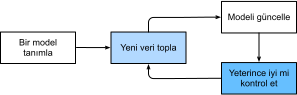
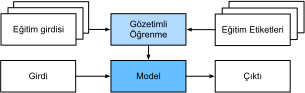
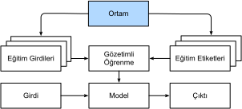
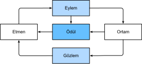

# Giriş
:label:`chap_introduction`


Yakın zamana kadar, günlük etkileşimde bulunduğumuz hemen hemen her bilgisayar programı basit prensiplerle yazılım geliştiricileri tarafından kodlandı.
Bir e-ticaret uygulaması yazmak istediğimizi varsayalım. Soruna bir beyaz tahta üzerinde birkaç saat kafa yorduktan sonra muhtemelen aşağıdaki gibi bir çözüme ulaşırız:
(i) Kullanıcılar bir web tarayıcısında veya mobil uygulamada çalışan bir arabirim aracılığıyla uygulama ile etkileşimde bulunurlar,
(ii) uygulamamız, her kullanıcının durumunu takip etmek ve geçmiş işlemlerin kayıtlarını tutmak için ticari düzeyde bir veritabanı motoruyla etkileşime girer ve 
(iii) uygulamamızın merkezindeki *iş mantığı* (uygulamanın beyni diyebiliriz), farklı senaryolarda uygulamanın nasıl davranacağını belirler.


Uygulamamızın *beynini* oluşturmak için karşılaşacağımızı tahmin ettiğimiz her senaryoyu değerlendirerek uygun kuralları belirlememiz gerekir.
Bir müşteri alışveriş sepetine bir ürün eklemek için her tıkladığında, alışveriş sepeti veritabanı tablosuna bu müşterinin kimliğini istenen ürünün kimliği ile ilişkilendirerek bir kayıt ekleriz. Böyle bir programı basit prensiplerle yazabilir ve güvenle başlatabiliriz. Çok az geliştirici ilk seferde tamamen doğru yapabilse de (sorunları çözmek için birkaç deneme çalışması gerekebilir), çoğunlukla böyle bir programı basit prensiplerden yazabilir ve gerçek bir müşteri görmeden *önceden* programı güvenle başlatabiliriz.
Genellikle yeni durumlarda, işlevsel ürün ve sistemleri yöneten uygulamaları tasarlama yeteneğimiz, dikkate değer bir bilişsel başarıdır.
Ayrıca $\%100$'lük oranda işe yarayan çözümler tasarlayabildiğinizde, makine öğrenmesi kullanmamalısınız.

Giderek artan sayıdaki makine öğrenmesi uzmanı için ne mutlu ki, otomatikleştirmek istediğimiz birçok görev insan yaratıcılığına bu kadar kolay boyun eğmiyor.
Beyaz tahta etrafında bildiğiniz en akıllı zihinlerle toplandığınızı hayal edin, ancak bu sefer aşağıdaki sorunlardan birini ele alıyorsunuz:

* Coğrafi bilgi, uydu görüntüleri ve yakın bir zaman aralığındaki geçmiş hava koşulları göz önüne alındığında yarının hava durumunu tahmin eden bir program yazma.
* Serbest biçimli metinle ifade edilen bir soruyu alan ve onu doğru cevaplayan bir program yazma.
* Verilen bir fotoğrafın içerdiği tüm insanları her birinin etrafına çerçeve çizerek tanımlayabilen bir program yazma.
* Kullanıcılara internette gezinirken karşılaşma olasılıkları yüksek olmayan ancak keyif alabilecekleri ürünler sunan bir program yazma.


Bu durumların her birinde, seçkin programcılar bile çözümleri sıfırdan kodlayamazlar.
Bunun farklı nedenleri olabilir. Bazen aradığımız program zaman içinde değişen bir deseni takip eder ve programlarımızın adapte olması gerekir.
Diğer durumlarda, ilişki (pikseller ve soyut kategoriler arasında) çok karmaşık olabilir ve bilinçli anlayışımızın ötesinde binlerce veya milyonlarca hesaplama gerekebilir, ki gözlerimiz bu görevi halihâzırda zahmetsizce yönetir. *Makine öğrenmesi (MÖ)* deneyimlerden öğrenebilen güçlü tekniklerin incelenmesidir.
Bir makine öğrenmesi algoritmasının performansı, tipik gözlemsel veri veya bir çevre ile etkileşim şeklinde olur, daha fazla deneyim biriktirdikçe artar.
Bunu, ne kadar deneyim kazanırsa kazansın, aynı iş mantığına göre çalışmaya devam eden geliştiricilerin kendileri öğrenip yazılımın güncellenme zamanının geldiğine karar verene kadar deterministik (gerekirci) e-ticaret platformumuzla karşılaştırın.
Bu kitapta size makine öğrenmesinin temellerini öğreteceğiz ve özellikle de bilgisayarla görme, doğal dil işleme, sağlık ve genomik gibi farklı alanlarda yenilikleri yönlendiren güçlü bir teknik altyapıya, yani *derin öğrenme*ye odaklanacağız.


## Motive Edici Bir Örnek

Bu kitabı yazmaya başlayabilmek için, birçok çalışan gibi, bol miktarda kahve tüketmemiz gerekiyordu. Arabaya bindik ve sürmeye başladık. Alex "Hey Siri" diye seslenerek iPhone'unun sesli asistan sistemini uyandırdı. Sonra Mu "Blue Bottle kafesine yol tarifi" komutunu verdi. Telefon komutun metnini (transkripsiyonunu) hızlı bir şekilde gösterdi. Ayrıca yol tarifini istediğimizi fark etti ve talebimizi yerine getirmek için Maps uygulamasını (app) başlattı.
Başlatılınca Maps uygulaması bir dizi rota belirledi, her rotanın yanında tahmini bir varış süresi de gösterdi. Eğitim amaçlı tasarlandığımız bu hikaye, bir akıllı telefondaki günlük etkileşimlerimizin saniyeler içinde birkaç makine öğrenmesi modeliyle işbirligi yaptığını gösteriyor.


"Alexa", "OK, Google" veya "Hey Siri" gibi bir *uyandırma kelimesine* yanıt vermek için bir program yazdığınızı düşünün.
Bir odadayken kendiniz bir bilgisayar ve kod editöründen başka bir şey olmadan kodlamayı deneyin :numref:`fig_wake_word`.
Böyle bir programı basit prensiplerle nasıl yazarsınız?
Bir düşünün ... problem zor.
Mikrofon her saniye yaklaşık 44000 örnek toplayacaktır.
Her örnek, ses dalgasının genliğinin bir ölçümüdür.
Hangi kural güvenilir bir şekilde, ses parçasının uyandırma sözcüğünü içerip içermediğine bağlı olarak bir ham ses parçasından emin $\{\text{evet}, \text{hayır}\}$ tahminlerine eşleme yapabilir?
Cevabı bulmakta zorlanıyorsanız endişelenmeyin.
Böyle bir programı nasıl sıfırdan yazacağımızı bilmiyoruz.
Bu yüzden makine öğrenmesi kullanıyoruz.


:label:`fig_wake_word`

Olayın özünü şöyle açıklayabiliriz:
Çoğu zaman, bir bilgisayara girdilerle çıktıları nasıl eşleştirebileceğini açıklayamayı bilmediğimizde bile, kendimiz bu bilişsel işi gerçekleştirebiliyoruz.
Diğer bir deyişle, "Alexa" kelimesini tanımak için bir bilgisayarı nasıl programlayacağınızı bilmeseniz bile siz kendiniz "Alexa" kelimesini tanıyabilirsiniz.
Bu yetenekle donanmış bizler ses örnekleri içeren büyük bir *veri kümesi* toplayabilir ve uyandırma kelimesi *içerenleri* ve *içermeyenleri* etiketleyebiliriz.
Makine öğrenmesi yaklaşımında, uyandırma kelimelerini tanımak için *açıktan* bir sistem tasarlamaya çalışmayız.
Bunun yerine, davranışı bir takım *parametre* ile belirlenen esnek bir program tanımlarız.
Ardından, veri kümesini, ilgili görevdeki performans ölçüsüne göre, programımızın performansını artıran en iyi parametre kümesini belirlemek için kullanırız.

Parametreleri, çevirerek programın davranışını değiştirebileceğimiz düğmeler olarak düşünebilirsiniz.
Parametreleri sabitlendiğinde, programa *model* diyoruz.
Sadece parametreleri manipüle ederek üretebileceğimiz tüm farklı programlara (girdi-çıktı eşlemeleri) *model ailesi* denir.
Ayrıca parametreleri seçmek için veri kümemizi kullanan meta (başkalaşım) programa *öğrenme algoritması* denir.

Devam etmeden ve öğrenme algoritmasını kullanmadan önce, sorunu kesin olarak tanımlamalı, girdi ve çıktıların kesin doğasını tespit etmeli ve uygun bir model ailesi seçmeliyiz.
Bu durumda, modelimiz *girdi* olarak bir ses parçasını alır ve *çıktı* olarak $\{\text{evet}, \text{hayır}\}$ arasında bir seçim oluşturur.
Her şey plana göre giderse, modelin parçanın uyandırma kelimesini içerip içermediğine dair tahminleri genellikle doğru olacaktır.

Doğru model ailesini seçersek, o zaman model "Alexa" kelimesini her duyduğunda "evet"i seçecek düğmelerin bir ayarı olmalıdır.
Uyandırma kelimesinin kesin seçimi keyfi olduğundan, muhtemelen yeterince zengin bir model ailesine ihtiyacımız olacak, öyle ki düğmelerin başka bir ayarı ile, sadece "Kayısı" kelimesini duyduktan sonra da "evet" seçilebilsin.
Aynı model ailesinin "Alexa"yı tanıma ve "Kayısı"yı tanıma için uygun olması beklenir, çünkü sezgisel olarak benzer görevler gibi görünüyorlar.
Bununla birlikte, temel olarak farklı girdiler veya çıktılarla uğraşmak istiyorsak, resimlerden altyazılara veya İngilizce cümlelerden Çince cümlelere eşlemek istiyorsak mesela, tamamen farklı bir model ailesine ihtiyacımız olabilir.

Tahmin edebileceğiniz gibi, tüm düğmeleri rastgele bir şekilde ayarlarsak, modelimizin "Alexa", "Kayısı" veya başka bir kelimeyi tanıması muhtemel değildir.
Makine öğrenmesinde, *öğrenme*, modelimizi istenen davranışa zorlayan düğmelerin doğru ayarını keşfettiğimiz süreçtir.
Başka bir deyişle,
modelimizi veri ile *eğitiyoruz*.
:numref:`fig_ml_loop`'de gösterildiği gibi, eğitim süreci genellikle şöyle görünür:

1. Yararlı bir şey yapamayan rastgele ilkletilen bir model ile başlayın.
1. Verilerinizin bir kısmını alın (örneğin, ses parçaları ve onlara karşılık gelen $\{\text{evet}, \text{hayır}\}$ etiketleri).
1. Modelin bu örneklere göre daha az hata yapması için düğmelerin ayarlarını değiştirin.
1. Model harika olana kadar 2. ve 3. adımı tekrarlayın.



:label:`fig_ml_loop`

Özetlemek gerekirse, bir uyandırma kelimesi tanıyıcısını kodlamak yerine, büyük bir etiketli veri kümesi sunarsak uyandırma sözcüklerini tanımayı *öğrenebilen* bir program kodlarız.
Bu eylemi bir programın davranışını ona bir veri kümesi sunup *veri ile programlayarak* belirleme gibi düşünebilirsiniz.
Söylemek istediğimiz MÖ sistemimize birçok kedi ve köpek örneği sağlayarak bir kedi dedektörü "programlayabiliriz".
Bu şekilde dedektör, sonunda, bir kedi ise çok büyük bir pozitif sayı, bir köpekse çok büyük bir negatif sayı ve emin değilse sıfıra daha yakın bir şey yaymayı öğrenir ve bu, makine öğrenmesinin neler yapabileceğinin ancak yüzeyine ışık tutar.
Derin öğrenme (DÖ), ki daha sonra çok detaylı açıklayacağız, makine öğrenmesi problemlerini çözmek için mevcut birçok popüler yöntemden sadece biridir.

## Temel Bileşenler

Uyandırma kelimesi örneğimizde, ses parçaları ve ikili etiketlerden oluşan bir veri kümesi tanımladık ve parçalardan sınıflandırmalara bir eşlemeyi yaklaşık olarak nasıl eğitebileceğimize dair çok ciddi olmayan bir izlenim verdik.
Bu tarz bir problem, etiketleri bilinen örneklerden oluşan bir veri kümesinin verildiği ve bilinen girdilerin etiketini öngörmeye çalıştığımız, *gözetimli öğrenme* olarak adlandırılır. Bu MÖ problemi çeşitlerinden sadece bir tanesidir.
Daha sonra, farklı MÖ sorunlarına derinlemesine bakacağız.
İlk olarak, ne tür bir MÖ problemi olursa olsun, bizi takip edecek temel bileşenlere daha fazla ışık tutmak istiyoruz:

1. Öğrenebileceğimiz *veri*.
2. Verinin nasıl dönüştürüleceğine dair bir *model*.
3. Modelin ne kadar iyi veya kötü iş çıkardığını ölçümleyen bir *amaç* işlevi (objective function).
4. Kaybı en aza indirmede modelin parametrelerini ayarlamak için bir *algoritma*.

### Veri

Veri bilimini veri olmadan yapamayacağınızı söylemeye gerek yok.
Tam olarak veriyi neyin oluşturduğunu düşünerek yüzlerce sayfayı doldurabiliriz, ancak şimdilik pratik tarafta hata yapacağız ve bizi ilgilendiren temel özelliklere odaklanacağız.
Genellikle örnekler derlemesiyle ilgileniriz.
Veriyle yararlı bir şekilde çalışmak için, genellikle uygun bir sayısal temsil (gösterim) bulmamız gerekir.
Her *örnek* (*veri noktası*, *veri örnekleri* veya *örneklem* olarak da adlandırılır) tipik olarak onlardan modelimizin tahminlemelerini yaptığı *öznitelikler* (veya *ortak değişkenler*) adı verilen sayısal özelliklerden oluşur.
Yukarıdaki gözetimli öğrenme problemlerinde, tahmin etmeye çalıştığımız şey *etiket* (veya *hedef*) olarak atanmış özel bir özelliktir.

Eğer görüntü verileriyle çalışıyorsak, bir fotoğraf için, her bir pikselin parlaklığına karşılık gelen sıralı bir sayısal değerler listesi ile temsil edilen bir örnek oluşturabilir.
$200\times200$ bir renkli fotoğraf, her bir uzamsal konum için kırmızı, yeşil ve mavi kanalların parlaklığına karşılık gelen $200\times200\times3=120000$ tane sayısal değerden oluşur.
Başka bir geleneksel görevde ise yaş, yaşamsal belirtiler ve teşhisler gibi standart bir dizi özellik göz önüne alındığında, bir hastanın hayatta kalıp kalmayacağını tahmin etmeye çalışabiliriz.

Her örnek aynı sayıda sayısal değerle karakterize edildiğinde, verinin sabit uzunluklu vektörlerden oluştuğunu söylüyoruz ve vektörlerin sabit uzunluğunu verinin *boyutu* olarak tanımlıyoruz.
Tahmin edebileceğiniz gibi, sabit uzunluk işleri kolaylaştıracak bir özellik olabilir.
Mikroskopik görüntülerde kanseri tanımak için bir model eğitmek istersek, sabit uzunluktaki girdilere sahip olmak endişelenecek şeylerin sayısının bir tane azaldığı anlamına gelir.

Ancak, tüm veri kolayca sabit uzunluklu vektörler olarak gösterilemez.
Mikroskop görüntülerinin standart ekipmanlardan gelmesini beklesek de, internetten toplanan görüntülerin aynı çözünürlük veya şekil ile ortaya çıkmasını bekleyemeyiz.
Görüntüler için, hepsini standart bir boyuta kırpmayı düşünebiliriz, ancak bu strateji bizi bir yere kadar götürür.
Kırpılan bölümlerde bilgi kaybetme riskiyle karşı karşıyayız.
Ayrıca, metin verisi sabit uzunluklu gösterimlere daha inatçı bir şekilde direnir.
Amazon, IMDB veya TripAdvisor gibi e-ticaret sitelerine bırakılan müşteri yorumlarını düşünün.
Bazıları kısadır: "Berbat!", bazıları da sayfalara yayılır.
Geleneksel yöntemlere göre derin öğrenmenin en büyük avantajlarından biri *değişken uzunluktaki* veriyi işlemedeki göreceli yeteneğidir.

Genel olarak, ne kadar fazla veriye sahip olursak işimiz o kadar kolay olur.
Daha fazla veriye sahip olduğumuzda, daha güçlü modeller eğitebilir ve önceden tasarlanmış varsayımlara daha az bel bağlayabiliriz.
(Nispeten) küçük veriden büyük veriye düzen değişikliği, modern derin öğrenmenin başarısına önemli bir katkıda bulunur. İşin özü, derin öğrenmedeki en heyecan verici modellerin çoğu, büyük veri kümeleri olmadan çalışmaz. Bazıları küçük veri rejiminde çalışır, ancak geleneksel yaklaşımlardan daha iyi değildir.

Son olarak, çok fazla veriye sahip olmak ve onu akıllıca işlemek yeterli değildir.
*Doğru* veriye ihtiyacımız vardır. Veri hatalarla doluysa veya seçilen öznitelikler hedefle ilgisizse, öğrenme başarısız olacaktır.
Durum şu klişe ile iyi betimlenebilir: *Çöp girerse çöp çıkar*.
Ayrıca, kötü tahmin performansı tek olası sonuç değildir.
Tahminli polislik, özgeçmiş taraması ve borç verme için kullanılan risk modelleri gibi makine öğrenmesinin hassas uygulamalarında, özellikle çöp verinin olası sonuçlarına karşı dikkatli olmalıyız.
Yaygın bir hata durumu bazı insan gruplarının eğitim verilerinde temsil edilmediği veri kümelerinde gerçekleşir.
Gerçek hayatta, daha önce hiç koyu ten görmemiş bir cilt kanseri tanıma sistemi uyguladığınızı düşünün.
Ayrıca başarısızlık, veri sadece bazı grupları az temsil ettiğinde değil, aynı zamanda toplumsal önyargıları yansıttığı zaman da meydana gelebilir.
Örneğin, özgeçmişleri taramak için kullanılacak bir öngörü modeli eğitmek için geçmiş işe alım kararları kullanılıyorsa, makine öğrenme modelleri yanlışlıkla tarihi adaletsizlikleri yakalayıp onları otomatikleştirebilir.
Tüm bunların veri bilimcisi aktif olarak komplo kurmadan ve hatta o farkında olmadan gerçekleşebileceğini unutmayın.

### Modeller

Çoğu makine öğrenmesi, veriyi bir anlamda dönüştürmeyi içerir.
Fotoğrafları alarak güleryüzlülük tahmin eden bir sistem kurmak isteyebiliriz.
Alternatif olarak, bir dizi sensör okuması alarak normal veya anormal olup olmadıklarını tahmin etmek isteyebiliriz.
*Model* ile, bir tipteki veriyi alan ve muhtemel farklı tipteki tahminleri veren hesaplama makinelerini belirtiyoruz.
Özellikle veriden tahmin yapabilecek istatistiksel modellerle ilgileniyoruz.
Basit modeller, basitliği uygun problemleri mükemmel bir şekilde çözebilirken, bu kitapta odaklandığımız problemler klasik yöntemlerin sınırlarını aşmaktadır.
Derin öğrenme, klasik yaklaşımlardan esas olarak odaklandığı güçlü modeller kümesi ile ayrılır.
Bu modeller, yukarıdan aşağıya zincirlenmiş verinin art arda dönüşümlerinden oluşur, bu nedenle adları *derin öğrenme*dir.
Derin modelleri tartışırken, bazı geleneksel yöntemlere de değineceğiz.

### Amaç Fonksiyonları

Daha önce, makine öğrenmesini deneyimden öğrenme olarak tanıttık.
Burada *öğrenme* ile zamanla bazı görevlerde iyileştirmeyi kastediyoruz.
Peki kim neyin bir iyileştirme oluşturduğunu söyleyecek?
Modeli güncellemeyi önerdiğiniz zaman önerilen güncellemenin bir iyileştirme mi yoksa bir düşüş mü oluşturacağı konusunda görüş ayrılıkları olabileceğini tahmin edebilirsiniz.

Biçimsel bir matematiksel öğrenen makineler sistemi geliştirmek için modellerimizin ne kadar iyi (ya da kötü) olduğuna dair kurallı ölçümlere ihtiyacımız var.
Makine öğrenmesinde ve daha genel olarak optimizasyonda (eniyilemede), bunları amaç fonsiyonları olarak adlandırıyoruz.
Yaygın yaklaşım olarak, genellikle amaç fonksiyonları tanımlarız, böylece daha düşük değer daha iyi anlamına gelir.
Bu sadece yaygın bir kanıdır. Daha yüksekken daha iyi olan herhangi bir fonksiyonu alabilir ve onu, işaretini değiştirerek niteliksel olarak özdeş ama daha düşükken daha iyi yeni bir fonksiyona dönüştürebilirsiniz.
Düşük daha iyi olduğu için, bu fonksiyona bazen *yitim fonksiyonları (loss function)*  denir.

Sayısal değerleri tahmin etmeye çalışırken, en yaygın amaç fonksiyonu hata karesidir, yani gerçek referans değeri ile tahmin değeri arasındaki farkın karesi. 
Sınıflandırma için en yaygın amaç fonksiyonu, hata oranını, yani tahminlerimizin gerçek değere uymadığı örneklerin oranını, en aza indirmektir.
Bazı hedeflerin (hata karesi gibi) optimize edilmesi kolaydır.
Diğerlerinin (hata oranı gibi) türevlerinin alınamaması veya diğer başka zorluklar nedeniyle doğrudan optimize edilmesi zordur.
Bu durumlarda, *vekil (surrogate) amaç* optimizasyonu yaygındır.

Tipik olarak, yitim fonksiyonu modelin parametrelerine göre tanımlanır ve veri kümesine bağlıdır.
Modelimizin parametrelerinin en iyi değerlerini, eğitim için toplanan örneklerden oluşan bir kümede meydana gelen kaybı en aza indirerek öğreniriz.
Bununla birlikte, eğitim verisinde iyi performans göstermemiz, görülmemiş veri üzerinde iyi performans göstereceğimizi garanti etmez.
Bu nedenle, genellikle mevcut veriyi iki parçaya ayıracağız: Modelimizin ikisinin de üzerindeki performanslarını raporladığımız eğitim veri kümesi (veya eğitim kümesi, model parametrelerini bulmak için) ve test veri kümesi (veya test kümesi, değerlendirme için dışarıda tutulur).
Eğitim hatasını, bir öğrencinin gerçek bir final sınava hazırlanmak için girdiği uygulama sınavlarındaki puanları gibi düşünebilirsiniz.
Sonuçlar cesaret verici olsa bile, bu final sınavında başarıyı garanti etmez.
Başka bir deyişle, test performansı eğitim performansından ciddi derecede sapabilir.
Bir model eğitim kümesi üzerinde iyi performans gösterdiğinde, ancak bunu görünmeyen veriye genelleştiremediğinde, buna *aşırı öğrenme (overfitting)* diyoruz.
Bu durumu uygulama sınavlarında başarılı olunmasına rağmen gerçek sınavda çakmaya benzetebiliriz.

### Optimizasyon (Eniyileme) Algoritmaları

Bir kez bir veri kaynağına ve gösterime, bir modele ve iyi tanımlanmış bir amaç fonksiyonuna sahip olduktan sonra, yitim fonksiyonunu en aza indirmek için mümkün olan en iyi parametreleri arayabilme becerisine sahip bir algoritmaya ihtiyacımız var.
Derin öğrenme için popüler optimizasyon algoritmaları, gradyan (eğim) inişi (gradient descent) olarak adlandırılan bir yaklaşıma bağlıdır. Kısacası, her adımda, her bir parametre için, bu parametreyi sadece küçük bir miktar bozarsanız eğitim kümesi kaybının nasıl hareket edeceğini (değişeceğini) kontrol ederler.
Daha sonra parametreyi kaybı azaltabilecek yönde güncellerler.

## Makine Öğrenmesi Problemleri Çeşitleri

Motive edici örneğimizdeki uyanma kelimesi problemi, makine öğrenmesinin üstesinden gelebileceği birçok problemden sadece biridir. Okuyucuyu daha fazla motive etmek ve kitap boyunca daha fazla sorun hakkında konuştuğumuzda bize ortak bir dil sağlaması için, aşağıda makine öğrenmesi sorunlarının bir örneğini listeliyoruz. Veriler, modeller ve eğitim teknikleri gibi yukarıda belirtilen kavramlarımıza sürekli olarak atıfta bulunacağız.

### Gözetimli Öğrenme

Gözetimli öğrenme girdi öznitelikleri verildiğinde etiketleri tahmin etme görevini ele alır.
Her öznitelik--etiket çiftine örnek denir.
Bazen, bağlam açık olduğunda, bir girdi topluluğuna atıfta bulunmak için -karşılık gelen etiketler bilinmese bile- *örnekler* terimini kullanabiliriz.
Hedefimiz, herhangi bir girdiyi bir etiket tahminiyle eşleyen bir model üretmektir.

Bu açıklamayı somut bir örneğe oturtalım; sağlık hizmetlerinde çalışıyorsak, bir hastanın kalp krizi geçirip geçirmeyeceğini tahmin etmek isteyebiliriz.
"Kalp krizi var" veya "kalp krizi yok" gözlemi, bizim etiketimiz olacaktır.
Girdi öznitelikleri, kalp atış hızı, diyastolik ve sistolik kan basıncı gibi hayati belirtiler olabilir.

Burada gözetim devreye girer, çünkü parametreleri seçmek için, biz (gözetimciler) modele *etiketli örnekleri* içeren bir veri kümesi sağlıyoruz, ki bu kümedeki her örnek, gerçek referans değeri etiketle eşleştirilmiştir.

Olasılıksal terimlerle, tipik olarak öznitelikler verildiğinde bir etiketinin koşullu olasılığını tahmin etmekle ilgileniyoruz.
Makine öğrenmesi içindeki birçok paradigmadan sadece biri olsa da, gözetimli öğrenme, makine öğrenmesinin endüstrideki başarılı uygulamalarının çoğunu oluşturur.
Kısmen, bunun nedeni, birçok önemli görevin, belirli bir mevcut veri kümesi göz önüne alındığında bilinmeyen bir şeyin olasılığını tahmin etmek gibi net bir şekilde tanımlanabilmesidir. Örneğin:

* CT (hesaplamalı tomografi - computed tomography) görüntüsü verildiğinde kanserli olma/olmama tahmini.
* İngilizce bir cümle verildiğinde doğru Fransızca çevirisinin tahmini.
* Bir  hisse senedinin gelecek aydaki fiyatının bu ayın finansal raporlama verilerine dayalı tahmini.

Temel olarak "girdi öznitelikleri verildiğinde etiketlerin tahmin edilmesi" diye tanımladığımız gözetimli öğrenme çok çeşitli şekillerde olabilir, diğer hususların yanı sıra girdilerin ve çıktıların türüne, boyutuna ve sayısına bağlı olarak çok sayıda modelleme kararı gerektirebilir.
Örneğin, keyfi uzunluktaki dizileri işlemek için farklı ve sabit uzunluklu vektör temsillerini işlemek için farklı modeller kullanırız.
Bu kitapta bu sorunların birçoğunu derinlemesine işleyeceğiz.

Gayri resmi olarak, öğrenme süreci şöyle görünür:
İlk olarak özniteliklerin bilindiği büyük bir örnek koleksiyonunu alın ve rastgele bir altküme seçin - eğer yoksa bu altkümedeki her örneğin doğru değer etiketini oluşturun.
Bazen bu etiketler zaten toplanmış da olabilir (örn. Bir hasta sonraki yıl içinde öldü mü?) ve diğer zamanlarda veriyi etiketlemek için insanların yorumlarını kullanmamız gerekebilir (örn. Görüntülere kategori atama).
Bu girdiler ve karşılık gelen etiketler birlikte eğitim kümesini oluştururlar.
Eğitim veri kümesini gözetimli bir öğrenme algoritmasına besleriz; bu algoritma veri kümesini girdi olarak alır ve başka bir fonksiyon verir: Öğrenmiş model.
Son olarak, çıktılarını karşılık gelen etiketin tahminleri olarak kullanarak önceden görülmemiş girdileri öğrenmiş modele besleyebiliriz.
Tüm süreç şöyle çizilebilir :numref:`fig_supervised_learning`.


:label:`fig_supervised_learning`

#### Bağlanım

Belki de kafanıza sokmak için en basit gözetimli öğrenme görevi *bağlanım*dır.
Örneğin, ev satışları veritabanından toplanan bir veri kümesini düşünün.
Her sıranın farklı bir eve karşılık geldiği bir tablo oluşturabiliriz ve her sütun, bir evin alanı, yatak odası sayısı, banyo sayısı ve şehir merkezine (yürüyüş) dakika uzaklığı gibi ilgili bazı özelliklere karşılık gelir.
Bu veri kümesinde, her örnek belirli bir ev olacaktır ve karşılık gelen öznitelik vektörü tabloda bir satır olacaktır.
New York veya San Francisco'da yaşıyorsanız ve Amazon, Google, Microsoft veya Facebook'un CEO'su değilseniz, (metrekare bilgileri, yatak odası sayısı, banyo sayısı, yürüme mesafesi) eviniz için vektör özelliği şuna benzeyebilir: $[600, 1, 1, 60]$.
Ancak, Pittsburgh'da yaşıyorsanız, daha çok $[3000, 4, 3, 10]$ gibi görünebilir.
Bunun gibi öznitelik vektörleri, çoğu klasik makine öğrenmesi algoritması için gereklidir.

Bir problemi *bağlanım* yapan aslında çıktılardır.
Yeni bir ev için pazarda olduğunuzu varsayalım.
Yukarıdaki gibi bazı öznitelikler göz önüne alındığında, bir evin adil piyasa değerini tahmin etmek isteyebilirsiniz.
Etiket değeri, ki satış fiyatıdır, bir sayısal değerdir.
Etiketler keyfi sayısal değerler aldığında buna bir *bağlanım* problemi diyoruz.
Hedefimiz, tahminleri gerçek etiket değerlerine çok yakın olan bir model üretmektir.

Birçok pratik problem iyi tanımlanmış bağlanım problemleridir.
Bir kullanıcının bir filme atayacağı puanı tahmin etmek bir bağlanım sorunu olarak düşünülebilir ve 2009'da bu özelliği gerçekleştirmek için harika bir algoritma tasarlasaydınız, [1 milyon dolarlık Netflix ödülünü](https://en.wikipedia.org/wiki/Netflix_Prize) kazanmış olabilirdiniz.
Hastanedeki hastalar için kalış süresinin öngörülmesi de bir bağlanım sorunudur.
Pratik bir kural; aşağıdaki gibi, herhangi bir *ne kadar?* veya *kaç tane?* problemi bağlanım içerir:

* Bu ameliyat kaç saat sürecek?
* Önümüzdeki altı saatte bu kasabaya ne kadar yağmur düşecek?

Daha önce hiç makine öğrenmesi ile çalışmamış olsanız bile, muhtemelen gayri ihtiyari olarak bir bağlanım problemi ile çalışmışsınızdır.
Örneğin, atık su giderlerinizin onarıldığını ve personelin kanalizasyon borularınızdan pisliği temizlemek için 3 saat harcadığını düşünün.
Sonra size $350\$$ tutarında bir fatura gönderildi.
Şimdi arkadaşınızın aynı personelini 2 saat kiraladığını ve $250\$$ fatura aldığını düşünün.
Birisi size yaklaşan pislik temizleme faturasında ne kadar beklediğinizi sorarsa, bazı makul varsayımlar yapabilirsiniz;
daha fazla çalışma saati daha fazla ücret maliyeti gibi.
Ayrıca bir sabit ücretin olduğunu ve personelin saatlik ücret aldığını varsayabilirsiniz.
Bu varsayımlar geçerliyse, bu iki veri örneği göz önüne alındığında, personelin fiyatlandırma yapısını zaten tanımlayabilirsiniz: Saat başı $100\$$ artı evinizde görünmesi için $50\$$.
Eğer buraya kadar takip edebildiyseniz, doğrusal bağlanımın arkasındaki üst-seviye fikri zaten anlıyorsunuz.

Bu durumda, personelin fiyatına tam olarak uyan parametreleri üretebiliriz.
Bazen bu mümkün olmayabilir; örneğin, varyansın bir kısmı iki özniteliğinizin yanı sıra birkaç diğer faktöre bağlıysa.
Bu durumlarda, tahminlerimiz ile gözlenen değerler arasındaki mesafeyi en aza indiren modelleri öğrenmeye çalışacağız.
Bölümlerimizin çoğunda kare hata kayıp fonksiyonunu en aza indirmeye odaklanacağız.
Daha sonra göreceğimiz gibi, bu kayıp fonksiyonu, verilerimizin Gauss gürültüsü ile bozulduğu varsayımına karşılık gelir.

#### Sınıflandırma

Bağlanım modelleri *kaç tane?* sorusunu ele almak için mükemmel olsa da, birçok sorun bu şablona rahatça uymaz.
Örneğin, bir banka mobil uygulamasına çek taraması eklemek istesin.
Bu, müşterinin akıllı telefonunun kamerasıyla bir çekin fotoğrafını çekmesini içerir ve uygulamanın görüntüde görülen metni otomatik olarak anlaması gerektirir.
Daha dirençli olması için elle yazılmış metni de anlaması gerekir, örneğin el yazması bir karakteri bilindik bir karaktere eşlemek gibi.
Bu tür *hangisi?* sorununa *sınıflandırma* denir.
Birçok teknik buraya da taşınacak olsa, bağlanım için kullanılanlardan farklı bir algoritma kümesi ile işlem görür.

*Sınıflandırma*da, modelimizin özniteliklere, mesela bir görüntüdeki piksel değerlerine, bakmasını ve ardından örneğimizin bazı ayrık seçenekler kümesi arasından hangi *kategori*ye (aslen *sınıf* olarak adlandırılırlar) ait olduğunu tahmin etmesini istiyoruz.
Elle yazılmış rakamlar için, 0 ile 9 arasındaki rakamlara karşılık gelen on sınıfımız olabilir.
Sınıflandırmanın en basit şekli, sadece iki sınıf olduğunda, *ikili sınıflandırma* dediğimiz bir problemdir.
Örneğin, veri kümemiz hayvanların görüntülerinden oluşabilir ve *etiketlerimiz* $\mathrm{\{kedi, köpek\}}$ sınıfları olabilir.
Bağlanımdayken, sayısal bir değer çıkarmak için bir *bağlanımcı* aradık, sınıflandırmada çıktısı tahminlenen sınıf ataması olan bir *sınıflandırıcı* arıyoruz.

Kitap daha teknik hale geldikçe gireceğimiz nedenlerden ötürü, yalnızca kategorik bir atama yapabilen, örneğin "kedi" veya "köpek" çıktısı, bir modeli optimize etmek zor olabilir.
Bu tür durumlarda, modelimizi olasılıklar dilinde ifade etmek genellikle daha kolaydır.
Bir örneğin öznitelikleri verildiğinde, modelimiz her olası sınıfa bir olasılık atar.
Hayvan sınıflandırma örneğimize dönersek, ki burada sınıflar $\mathrm{\{kedi, köpek\}}$'tir, bir sınıflandırıcı bir görüntü görebilir ve görüntünün bir kedi olma olasılığını 0.9 çıkarabilir.
Bu sayıyı, sınıflandırıcının görüntünün bir kediyi gösterdiğinden $\%90$ emin olduğunu söyleyerek yorumlayabiliriz.
Öngörülen sınıf için olasılığın büyüklüğü bir çeşit belirsizlik taşır.
Bu tek mevcut belirsizlik kavramı değildir ve diğerlerini de daha ileri bölümlerde tartışacağız.

İkiden fazla olası sınıfımız olduğunda, soruna *çok sınıflı sınıflandırma* diyoruz.
Yaygın örnekler arasında elle yazılmış karakteri, $\mathrm{\{0, 1, 2, ... 9, a, b, c, ...\}}$, tanıma yer alır.
Bağlanım problemleriyle uğraşırken kare hata kayıp fonksiyonunu en aza indirmeye çalışırız; sınıflandırma problemleri için ortak kayıp fonksiyonu, sonraki bölümlerdeki bilgi teorisine giriş ile adını açıklığa kavuşturacağımız *çapraz düzensizlik* (entropi) diye adlandırılır.

En olası sınıfın kararınız için kullanacağınız esas sınıf olmak zorunda olmadığını unutmayın.
Arka bahçenizde :numref:`fig_death_cap`'de gösterildiği gibi güzel bir mantar bulduğunuzu varsayın.


:width:`200px`
:label:`fig_death_cap`

Şimdi, bir sınıflandırıcı oluşturduğunuzu ve bir mantarın bir fotoğrafına göre zehirli olup olmadığını tahmin etmek için eğittiğinizi varsayın.
Zehir tespit sınıflandırıcısının :numref:`fig_death_cap`'nin zehirli olma olasılığında 0.2 sonucunu verdiğini varsayalım.
Başka bir deyişle, sınıflandırıcı, mantarımızın zehirli *olmadığından* $\%80$ emindir.
Yine de, yemek için ahmak olmalısın.
Çünkü lezzetli bir akşam yemeğinin belirli bir yararı, ondan ölme riski olan $\%20$ değerine değmez.
Başka bir deyişle, belirsiz riskin etkisi faydadan çok daha fazladır. 
Bu nedenle, zarar fonksiyonu olarak maruz kaldığımız beklenen riski hesaplamamız gerekir, yani sonucun olasılığını onunla ilişkili fayda (veya zarar) ile çarpmamız gerekir.
Temel olarak, maruz kaldığımız beklenen riski kayıp fonksiyonu olarak hesaplamamız gerekir, yani sonucun olasılığını, bununla ilişkili fayda (veya zarar) ile çarpmamız gerekir.
Bu durumda, mantarı yemekten kaynaklanan kayıp $0.2 \times \infty + 0.8 \times 0 = \infty$ olurken, onu çöpe atmanın kaybı $0.2 \times 0 + 0.8 \times 1 = 0.8$ olacaktır. Dikkatimiz haklıydı: Herhangi bir mantarbilimcinin bize söyleyeceği gibi, :numref:`fig_death_cap`'deki mantar aslında zehirlidir.

Sınıflandırma sadece ikili sınıflandırmadan çok daha karmaşık hale gelebilir; çok sınıflı ve hatta çoklu etiketli.
Örneğin, hiyerarşilere yönelik bazı değişik sınıflandırmalar vardır.
Hiyerarşiler birçok sınıf arasında bazı ilişkilerin olduğunu varsayar.
Bu yüzden tüm hatalar eşit değildir - eğer hata yapacaksak, uzak bir sınıf yerine ilgili bir sınıfa yanlış sınıflamayı tercih ederiz.
Genellikle buna *hiyerarşik sınıflandırma* denir.
İlk örneklerden biri, hayvanları bir hiyerarşide düzenleyen [Linnaeus](https://en.wikipedia.org/wiki/Carl_Linnaeus)'tır.

Hayvan sınıflandırması durumunda, bir kanişi bir schnauzer (bir tür Alman köpeği) ile karıştırmak o kadar kötü olmayabilir, ancak modelimiz bir dinozor ile bir fino köpeğini karıştırırsa büyük bir ceza ödeyecektir.
Hangi hiyerarşinin alakalı olduğu, modeli nasıl kullanmayı planladığınıza bağlı olabilir.
Örneğin, çıngıraklı yılanlar ve garter yılanları filogenetik ağaçta yakın olabilir, ancak bir garter yılanını bir çıngıraklı ile karıştırmak ölümcül olabilir.

#### Etiketleme (Tagging)

Bazı sınıflandırma sorunları, ikili veya çok sınıflı sınıflandırma ayarlarına uyar.
Örneğin, kedileri köpeklerden ayırmak için normal bir ikili sınıflandırıcı eğitebiliriz.
Bilgisayarla görmenin mevcut durumu göz önüne alındığında, bunu hali-hazırda araçlarla kolayca yapabiliriz.
Bununla birlikte, modelimiz ne kadar doğru olursa olsun, sınıflandırıcı *Bremen Mızıkacıları*'nın, :numref:`fig_stackedanimals`'teki meşhur bir Alman masalındaki dört hayvan, bir görüntüsüyle karşılaştığında kendimizi ufak bir belada bulabiliriz.


:width:`300px`
:label:`fig_stackedanimals`

Gördüğünüz gibi, :numref:`fig_stackedanimals`'te bir kedi ve bir horoz, bir köpek ve bir eşek ile arka planda bazı ağaçlar var.
Nihayetinde modelimizle ne yapmak istediğimize bağlı olarak, bunu ikili bir sınıflandırma problemi olarak ele almak pek anlamlı olmayabilir.
Bunun yerine, modele görüntünün bir kediyi, bir köpeği, bir eşeği *ve* bir horozu tasvir ettiğini söyleme seçeneği vermek isteyebiliriz.

Karşılıklı olarak münhasır olmayan sınıfları tahmin etmeyi öğrenme problemine *çoklu etiket sınıflandırması* denir.
Otomatik etiketleme sorunları genellikle en iyi çoklu etiket sınıflandırma sorunları olarak tanımlanabilir.
Kullanıcıların bir teknoloji blogundaki yayınlara uygulayabilecekleri etiketleri, örneğin "makine öğrenmesi", "teknoloji", "araçlar", "programlama dilleri", "Linux", "bulut bilişim", "AWS" gibi, düşünün.
Tipik bir makalede 5--10 etiket uygulanabilir, çünkü bu kavramlar birbiriyle ilişkilidir.
"Bulut bilişim" hakkındaki gönderilerin "AWS"den bahsetmesi muhtemeldir ve "makine öğrenmesi" ile ilgili gönderiler de "programlama dilleri" ile ilgili olabilir.

Ayrıca, makalelerin doğru etiketlenmesinin önemli olduğu biyomedikal literatürle uğraşırken bu tür bir sorunla uğraşmak zorundayız, çünkü bu araştırmacıların literatürde kapsamlı incelemeler yapmasına izin veriyor.
(Amerikan) Ulusal Tıp Kütüphanesi'nde, bir dizi profesyonel yorumlayıcı, PubMed'de endekslenen her makaleyi, kabaca 28000 etiketlik bir koleksiyon olan MeSH'den ilgili terimlerle ilişkilendirmek için gözden geçiriyor.
Bu zaman alıcı bir süreçtir ve yorumlayıcıların genellikle arşivlemesi ve etiketlemesi arasında bir yıllık bir gecikme vardır.
Makine öğrenmesi burada, her makaleye uygun bir manuel (elle) incelemeye sahip oluncaya kadar geçici etiketler sağlamak için kullanılabilir. Gerçekten de, birkaç yıl boyunca, BioASQ organizasyonu tam olarak bunu yapmak için [yarışmalar düzenledi](http://bioasq.org/).

#### Arama

Bazen her örneği bir kovaya veya gerçek bir değere atamak istemiyoruz. Bilgi getirimi alanında, bir dizi maddeye bir sıralama uygulamak istiyoruz.
Örneğin, web aramasını ele alalım. Hedef belirli bir sayfanın bir sorgu için alakalı olup olmadığını belirlemekten daha ziyade, birçok arama sonucundan hangisinin belirli bir kullanıcı için en alakalı olduğunu belirlemektir.
Alakalı arama sonuçlarının sırasına gerçekten önem veriyoruz ve öğrenme algoritmamızın daha geniş bir gruptan sıralanmış alt kümeleri üretmesi gerekiyor.
Başka bir deyişle, alfabeden ilk 5 harfi üretmemiz istenirse, "A B C D E" ve "C A B E D" döndürme arasında bir fark vardır.
Sonuç kümesi aynı olsa bile, küme içindeki sıralama önemlidir.

Bu soruna olası bir çözüm, önce kümedeki her bir öğeye, ona karşılık gelen bir alaka puanı atamak ve daha sonra en yüksek dereceli öğeleri almaktır.
[PageRank](https://en.wikipedia.org/wiki/PageRank), Google arama motorunun arkasındaki esas gizli bileşen, böyle bir puanlama sisteminin erken bir örneğiydi, ancak tuhaf tarafı gerçek sorguya bağlı değildi.
Burada, ilgili öğelerin kümesini tanımlamak için basit bir alaka filtresine ve ardından sorgu terimini içeren sonuçları sıralamak için PageRank'e güveniyorlardı.
Günümüzde arama motorları, sorguya bağlı alaka düzeyi puanlarını belirlemek için makine öğrenmesi ve davranışsal modeller kullanmaktadır.
Sadece bu konuyla ilgili akademik konferanslar vardır.

#### Tavsiye Sistemleri
:label:`subsec_recommender_systems`

Tavsiye sistemleri, arama ve sıralama ile ilgili başka bir problem ailesidir.
Amaç, kullanıcıya ilgili bir dizi öğeyi görüntülemek olduğu sürece benzer problemlerdir.
Temel fark, tavsiye sistemleri bağlamında, sözkonusu kullanıcılara *kişiselleştirme* vurgusu yapılmasıdır.
Mesela, film önerilerinde, bir bilim kurgu hayranı için sonuç sayfası ile Peter Sellers komedileri uzmanının sonuç sayfası önemli ölçüde farklılıklar gösterebilir.
Perakende satış ürünleri, müzik ve haber önerileri gibi diğer öneri gruplarında da benzer sorunlar ortaya çıkar.

Bazı durumlarda, müşteriler belirli bir ürünü ne kadar sevdiklerini bildiren açık geri bildirimler sağlar (Ör. Amazon, IMDB, Goodreads, vb. üzerindeki ürün puanları ve incelemeleri).
Diğer bazı durumlarda, örneğin bir müzik çalma listesindeki parçaları atlarken, kullanıcılar memnuniyetsizliği de, şarkının o anki bağlamında uygunsuz olduğunu da gösterebilecek (gizli) örtük geri bildirim sağlarlar.
En basit formülasyonlarda, bu sistemler bir kullanıcı ve bir ürün göz önüne alındığında tahmini bir derecelendirme veya satın alma olasılığı gibi bir skoru tahmin etmek üzere eğitilir.

Böyle bir model göz önüne alındığında, herhangi bir müşteri için, en yüksek puanları olan ve daha sonra müşteriye önerilebilecek nesneler kümesini bulabiliriz.
Üretimdeki sistemler oldukça ileri düzeydedir ve bu puanları hesaplarken ayrıntılı kullanıcı etkinliği ve öğenin özelliklerini dikkate alır. :numref:`fig_deeplearning_amazon` imgesi, yazarın tercihlerini yakalamak için ayarlanan kişiselleştirme algoritmalarına dayanarak Amazon tarafından önerilen derin öğrenme kitaplarına bir örnektir.


:label:`fig_deeplearning_amazon`

Muazzam ekonomik değerlerine rağmen, tahminci modeller üzerine saf olarak inşa edilmiş tavsiye sistemleri bazı ciddi kavramsal kusurlara maruz kalmaktadırlar.
Öncelikle sadece *sansürlü geri bildirim* gözlemliyoruz.
Kullanıcılar, özellikle, güçlü bir şekilde hissettikleri filmleri derecelendirir. Örneğin beş puanlı ölçeklerde, öğelerin çok sayıda beş ve bir yıldız derecelendirmesi aldığını, ancak dikkat çekici derecede az üç yıldızlı derecelendirme olduğunu fark edebilirsiniz.
Ayrıca, mevcut satın alma alışkanlıkları genellikle şu anda mevcut olan tavsiye algoritmasının bir sonucudur, ancak öğrenme algoritmaları bu ayrıntıyı her zaman dikkate almazlar.
Bu nedeni, bir geri bildirim döngüsünün oluşmasının mümkün olmasıdır: Bir tavsiye sistemi, daha sonra daha iyi olması için (daha büyük miktarda satın alımlar nedeniyle), alınan bir öğeyi tercihli olarak yukarı iter ve daha da sık tavsiye edilmesine neden olur.
Sansür, teşvikler ve geri bildirim döngüleri ile nasıl başa çıkılacağı gibi bu tarz ilgili sorunların birçoğu önemli açık araştırma konularıdır.

#### Dizi Öğrenimi

Şimdiye kadar, sabit sayıda girdimiz olan ve sabit sayıda çıktı üreten sorunlara baktık.
Örneğin ev fiyatlarını sabit bir dizi öznitelikten tahmin ettik: Metrekare alanları, yatak odası sayısı, banyo sayısı, şehir merkezine yürüme süresi.
Ayrıca, bir görüntüyü (sabit boyutlu), sabit sayıda sınıfın hangi birine ait olduğu tahmin eden olasılıklarla eşlemeyi veya bir kullanıcı kimliği ve ürün kimliği alarak bir yıldız derecelendirmesi tahmin etmeyi tartıştık. Bu durumlarda, sabit uzunluklu girdimizi bir çıktı üretmek için modele beslediğimizde, model gördüklerini hemen unutur.

Girdilerimizin hepsi aynı boyutlara sahipse ve birbirini takip eden girdilerin birbirleriyle hiçbir ilgisi yoksa, bu iyi olabilir.
Ancak video parçalarıyla nasıl başa çıkabiliriz?
Bu durumda, her parça farklı sayıda çerçeveden oluşabilir.
Ayrıca önceki veya sonraki çerçeveleri dikkate alırsak, her çerçevede neler olup bittiğine dair tahminimiz çok daha güçlü olabilir. Aynı şey dil için de geçerli. Popüler bir derin öğrenme sorunu, makine çevirisidir: Bazı kaynak dilde cümleleri alma ve başka bir dilde çevirilerini tahmin etme görevidir.

Bu problemler tıpta da görülür.
Yoğun bakım ünitesindeki hastaları izlemek ve önümüzdeki 24 saat içinde ölüm riskleri belli bir eşiği aşarsa, uyarıcıları tetiklemek için bir model isteyebiliriz.
Bu modelin her saatteki hasta geçmişi hakkında bildiği her şeyi atmasını ve sadece en son ölçümlere dayanarak tahminlerini yapmasını kesinlikle istemeyiz.

Bu problemler makine öğrenmesinin en heyecan verici uygulamaları arasındadır ve *dizi öğrenmenin* örnekleridir.
Girdilerin dizilerini almak veya çıktı dizilerini (veya her ikisini) saçmak için bir modele ihtiyaç duyarlar.
Özellikle, *diziden diziye öğrenme*, girdinin ve çıktının ikisinin de değişken uzunluklu olduğu, makine çevirisi ve sözlü hitaptan metine dökme benzeri problemleri içerir.
Bütün dizi dönüştürme türlerini burada düşünmek imkansız olsa da, aşağıdaki özel durumlardan bahsetmeye değerdir.

**Etiketleme ve Ayrıştırma**. Bu, nitelikleri olan bir metin dizisine açıklama eklemeyi içerir.
Başka bir deyişle, girdi ve çıktıların sayısı aslında aynıdır.
Örneğin, fiillerin ve öznelerin nerede olduğunu bilmek isteyebiliriz.
Alternatif olarak, hangi kelimelerin adlandırılmış varlıklar olduğunu bilmek isteyebiliriz.
Genel olarak amaç, bir açıklama almak için yapısal ve dilbilgisel varsayımlara dayalı olarak metni ayrıştırmak ve açıklama eklemektir.
Bu aslında olduğundan daha karmaşıkmış gibi geliyor.
Aşağıdaki çok basit bir örnek, hangi kelimelerin adlandırılmış varlıkları ifade ettiğini belirten etiketleri, bir cümleye açıklama olarak eklemeyi gösterir.

```text
Tom'un Washington'da Sally ile akşam yemeği var.
Var      Var          Var  -    -     -      -
```

**Otomatik Konuşma Tanıma**. Konuşma tanımada, girdi dizisi bir hoparlörün ses kaydıdır (:numref:`fig_speech` içinde gösterilen) ve çıktı konuşmacının söylediklerinin metne dökümüdür.
Buradaki zorluk, metinden çok daha fazla ses karesi çerçevesi olması (ses genellikle 8kHz veya 16kHz'de örneklenmiştir), yani ses ve metin arasında 1:1 karşılık olmamasıdır, çünkü binlerce sesli örnek tek bir sözlü kelimeye karşılık gelebilir.
Bunlar, çıktının girdiden çok daha kısa olduğu diziden diziye öğrenme problemleridir.


:width:`700px`
:label:`fig_speech`

**Metinden Konuşmaya**. Bu, otomatik konuşma tanımanın tersidir.
Başka bir deyişle, girdi metindir ve çıktı bir ses dosyasıdır.
Bu durumda, çıktı girdiden çok daha uzun olur.
İnsanların kötü bir ses dosyasını tanıması kolay olsa da, bu bilgisayarlar için o kadar da bariz değildir.

**Makine Çevirisi**. Karşılık gelen girdi ve çıktıların aynı sırada (hizalamadan sonra) gerçekleştiği konuşma tanıma durumundan farklı olarak, makine çevirisinde, sırayı ters çevirme hayati önem taşıyabilir.
Başka bir deyişle, bir diziyi diğerine dönüştürürken, ne girdi ve çıktıların sayısı ne de karşılık gelen veri örneklerinin sırası aynı kabul edilmektedir.
Almanların fiilleri cümle sonuna yerleştirme eğiliminin aşağıdaki açıklayıcı örneğini düşünün.

```text
Almanca:          Haben Sie sich schon dieses grossartige Lehrwerk angeschaut?
İngilizce:        Did you already check out this excellent tutorial?
Yanlış Hizalama:  Did you yourself already this excellent tutorial looked-at?
```

İlgili birçok sorun diğer öğrenme görevlerinde ortaya çıkar.
Örneğin, bir kullanıcının bir Web sayfasını okuma sırasını belirlemek iki boyutlu bir düzen analizi sorunudur.
Diyalog sorunları her türlü ek karmaşıklığı ortaya çıkarır, bir sonrasında ne söyleneceğini belirlemede, gerçek dünya bilgisini ve uzun zamansal mesafelerde konuşmanın önceki durumunu dikkate almayı gerektirmek gibi. Bunlar aktif bir araştırma alanlarıdır.


### Gözetimsiz ve Kendi Kendine Gözetimli Öğrenme

Şimdiye kadarki tüm örnekler gözetimli öğrenme, yani, modeli hem öznitelikleri hem de karşılık gelen etiket değerleri içeren dev bir veri kümesi ile beslediğimiz durumlarla ilgilidir.
Gözetimli öğreniciyi son derece uzmanlaşmış bir işe ve son derece bunaltıcı bir patrona sahip olmak gibi düşünebilirsiniz.
Patron omzunuzun üzerinden bakar ve siz durumlardan eylemlere eşlemeyi öğrenene kadar her durumda tam olarak ne yapacağınızı söyler.
Böyle bir patron için çalışmak oldukça tatsızdır.
Öte yandan, bu patronu memnun etmek kolaydır.
Deseni mümkün olduğunca çabuk tanır ve eylemlerini taklit edersiniz.

Tamamen zıt bir şekilde, ne yapmanızı istediğini bilmeyen bir patron için çalışmak sinir bozucu olabilir.
Ancak, bir veri bilimcisi olmayı planlıyorsanız, buna alışsanız iyi olur.
Patron size sadece dev bir veri dökümü verebilir ve *onunla veri bilimi yapmanızı söyleyebilir!* Bu kulağa belirsiz geliyor, çünkü öyle.
Bu sorun sınıfına *gözetimsiz öğrenme* diyoruz ve sorabileceğimiz soruların türü ve sayısı yalnızca yaratıcılığımızla sınırlıdır.
Daha sonraki bölümlerde denetimsiz öğrenme tekniğini ele alacağız. Şimdilik iştahınızı hafifletmek için sormak isteyebileceğiniz birkaç sorudan aşağıda bahsediyoruz:

* Verileri doğru bir şekilde özetleyen az sayıda ilk örnek (prototip) bulabilir miyiz?
Bir dizi fotoğraf verildiğinde, onları manzara fotoğrafları, köpek resimleri, bebekler, kediler ve dağ zirveleri olarak gruplandırabilir miyiz?
Benzer şekilde, kullanıcıların göz atma etkinlikleri koleksiyonu göz önüne alındığında, onları benzer davranışa sahip kullanıcılara ayırabilir miyiz?
Bu sorun genellikle *kümeleme* olarak bilinir.
* Verilerin ilgili özelliklerini doğru bir şekilde yakalayan az sayıda parametre bulabilir miyiz?
Bir topun yörüngeleri, topun hızı, çapı ve kütlesi ile oldukça iyi tanımlanmıştır.
Terziler, kıyafetlerin uyması amacıyla insan vücudunun şeklini oldukça doğru bir şekilde tanımlayan az sayıda parametre geliştirmiştir.
Bu problemlere *altuzay tahmini* denir.
Bağımlılık doğrusal ise, buna *ana bileşen analizi* denir.
* (Keyfi olarak yapılandırılmış) Nesnelerin Öklid uzayında sembolik özelliklerinin iyi eşleştirilebileceği bir temsili var mı?
Bu varlıkları ve onların ilişkilerini, "Roma" $-$ "İtalya" $+$ "Fransa" $=$ "Paris" gibi, tanımlamak için kullanılabilir.
* Gözlemlediğimiz verilerin çoğunun temel nedenlerinin bir açıklaması var mı?
Örneğin, konut fiyatları, kirlilik, suç, yer, eğitim ve maaşlar ile ilgili demografik verilerimiz varsa, bunların deneysel verilerine dayanarak nasıl ilişkili olduğunu bulabilir miyiz? *Nedensellik* ve *olasılıksal grafik modeller* ile ilgili alanlar bu sorunu ele almaktadır.
* Gözetimsiz öğrenmedeki bir diğer önemli ve heyecan verici gelişme, *çekişmeli üretici ağların* ortaya çıkmasıdır.
Bunlar bize verileri, görüntüler ve ses gibi karmaşık yapılandırılmış verileri bile, sentezlemek için yöntemsel bir yol sunar.
Temel istatistiksel mekanizmalar, gerçek ve sahte verilerin aynı olup olmadığını kontrol etmek için kullanılan testlerdir.

Denetimsiz öğrenmenin bir biçimi olarak *kendi kendine gözetimli öğrenme*, eğitimde gözetim sağlamak için etiketlenmemiş verilerden yararlanır; örneğin, verilerin saklanan bir kısmının diğer bölümleri kullanarak tahmin edilmesi gibi. Metinler için, herhangi bir etiketleme çabası olmadan büyük dökümdeki etrafındaki kelimeleri (bağlamları) kullanarak rastgele maskelenmiş kelimeleri tahmin ederek "boşlukları doldurmak" için modeller eğitebiliriz :cite:`Devlin.Chang.Lee.ea.2018`!
İmgeler için, aynı imgenin iki kırpılmış bölgesi arasındaki göreli konumu söylemek için modelleri eğitebiliriz :cite:`Doersch.Gupta.Efros.2015`. Bu iki kendi kendine gözetimli öğrenme örneğinde, olası sözcükleri ve göreli konumları tahmin etmeye yönelik eğitim modellerinin her ikisi de (gözetimli öğrenme) sınıflandırma görevleridir.

### Bir Ortamla Etkileşim

Şimdiye kadar, verilerin gerçekte nereden geldiğini veya bir makine öğrenmesi modeli bir çıktı oluşturduğunda gerçekte ne olduğunu tartışmadık.
Çünkü gözetimli öğrenme ve gözetimsiz öğrenme bu konuları çok karmaşık bir şekilde ele almaz.
Her iki durumda da, büyük bir veri yığınını önceden alıyoruz, ardından bir daha çevre ile etkileşime girmeden desen tanıma makinelerimizi harekete geçiriyoruz.
Tüm öğrenme, algoritma ortamdan koparıldıktan sonra gerçekleştiği için, buna bazen *çevrimdışı öğrenme* denir.
Gözetimli öğrenme için bir ortamdan veri toplamayı düşünürsek süreç şuna benzer :numref:`fig_data_collection`.


:label:`fig_data_collection`

Çevrimdışı öğrenmenin bu basitliğinin cazibesi vardır.
Bunun olumlu tarafı, diğer sorunlardan herhangi bir dikkat dağılımı olmadan sadece örüntü tanıma konusu ile tek başına ilgilenebiliriz.
Ancak olumsuz tarafı, formülasyonun oldukça kısıtlayıcı olmasıdır.
Daha hırslıysanız ya da Asimov'un Robot Serisi'ni okuyarak büyüdüyseniz, sadece tahminler yapmakla kalmayıp, dünyada hareket edebilecek yapay zeka botları hayal edebilirsiniz.
Sadece modelleri değil, akıllı *etmenleri (ajanları)* de düşünmek istiyoruz.
Bu, sadece tahminler yapmakla kalmayıp, *eylemleri* seçmeyi de düşünmemiz gerektiği anlamına gelir. Dahası, öngörülerin aksine, eylemler aslında ortamı etkiler.
Akıllı bir etmen eğitmek istiyorsak, eylemlerinin etmenin gelecekteki gözlemlerini nasıl etkileyebileceğini hesaba katmalıyız.

Bir ortam ile etkileşimi dikkate almak, bir dizi yeni modelleme sorusunu açar.
Aşağıda birkaç örnek görebiliriz.

* Ortam önceden ne yaptığımızı hatırlıyor mu?
* Ortam bize bir konuşma tanıyıcıya metin okuyan bir kullanıcı gibi yardım etmek istiyor mu?
* Ortam bizi yenmek mi istiyor, yani spam filtreleme (spam göndericilere karşı) veya oyun oynama (rakiplere karşı) gibi rakip bir ortam mı?
* Ortam bizi umursumuyor mu?
* Ortam değişen dinamiklere sahip mi? Örneğin, gelecekteki veriler her zaman geçmiştekine benziyor mu, ya da doğal olarak veya otomatik araçlarımıza yanıt olarak zaman içinde değişiyor mu?

Eğitim ve test verileri farklı olduğunda, bu son soru *dağılım kayması* sorununu gündeme getirmektedir.
Bu bir öğretim üyesi tarafından hazırlanan yazılı sınava girerken yaşadığımız bir problemdir, çünkü ödevler asistanlar tarafından oluşturulmuştur.
Sonrasında, bir çevreyle etkileşimi açıkça dikkate alan bir düzen olan pekiştirmeli öğrenmeyi kısaca anlatacağız.

### Pekiştirmeli Öğrenme

Bir ortamla etkileşime giren ve eylemler yapan bir etmen geliştirmek için makine öğrenmesini kullanmakla ilgileniyorsanız, muhtemelen *pekiştirmeli öğrenme* konusuna odaklanacaksınız.
Bu, robotik, diyalog sistemleri ve hatta video oyunları için yapay zeka (YZ) geliştirme uygulamalarını içerebilir.
Derin öğrenme ağlarını pekiştirmeli öğrenme problemlerine uygulayan *derin pekiştirmeli öğrenme* popülerlik kazanmıştır.
Bu atılımda yalnızca görsel girdileri kullanarak Atari oyunlarında insanları yenen derin Q-ağ (Q-network) ve Go oyunu dünya şampiyonunu tahtından indiren AlphaGo programı iki önemli örnektir.

Pekiştirmeli öğrenmede, bir etmenin bir dizi zaman adımı üzerinden bir ortam ile etkileşime girdiği, çok genel bir sorun ifade edilir.
Her bir zaman adımında, etmen ortamdan birtakım *gözlem* alır ve daha sonra bir mekanizma (bazen çalıştırıcı -aktüatör- olarak da adlandırılır) aracılığıyla çevreye geri iletilecek bir eylemi seçmelidir.
Son olarak, etmen ortamdan bir ödül alır.
Bu süreç :numref:`fig_rl-environment` şeklinde gösterilmektedir.
Etmen daha sonra bir gözlem alır ve bir sonraki eylemi seçer, vb.
Bir pekiştirmeli öğrenme etmeninin davranışı bir politika tarafından yönetilir.
Kısacası, bir *politika*, sadece, çevrenin gözlemlerinden eylemlere eşlenen bir fonksiyondur.
Pekiştirmeli öğrenmenin amacı iyi bir politika üretmektir.


:label:`fig_rl-environment`

Pekiştirmeli öğrenme çerçevesinin genelliğini abartmak zordur.
Örneğin, herhangi bir gözetimli öğrenme problemini bir pekiştirmeli öğrenme problemine dönüştürebiliriz.
Diyelim ki bir sınıflandırma problemimiz var.
Her sınıfa karşılık gelen bir eylem ile bir pekiştirmeli öğrenme etmeni oluşturabiliriz.
Daha sonra, orijinal gözetimli öğrenme probleminin yitim fonksiyonuna tamamen eşit bir ödül veren bir ortam yaratabiliriz.

Bununla birlikte, pekiştirmeli öğrenme, gözetimli öğrenmenin yapamadığı birçok sorunu da ele alabilir.
Örneğin, gözetimli öğrenmede her zaman eğitim girdisinin doğru etiketle ilişkilendirilmesini bekleriz.
Ancak pekiştirmeli öğrenmede, her gözlem için çevrenin bize en uygun eylemi söylediğini varsaymıyoruz.
Genel olarak, sadece bir ödül alırız.
Dahası, ortam bize hangi eylemlerin ödüle yol açtığını bile söylemeyebilir.

Örneğin satranç oyununu düşünün.
Tek gerçek ödül sinyali, oyunun sonunda ya kazandığımızda 1, ya da kaybettiğimizde -1 diye gelir.
Bu yüzden pekiştirmeli öğreniciler kredi atama problemi ile ilgilenmelidir: Bir sonuç için hangi eylemlerin beğeni toplayacağını veya suçlanacağını belirleme.
Aynı şey 11 Ekim'de terfi alan bir çalışan için de geçerli.
Bu terfi büyük olasılıkla bir önceki yılda itibaren çok sayıda iyi seçilmiş eylemi yansıtmaktadır.
Gelecekte daha fazla terfi almak için zaman boyunca hangi eylemlerin terfiye yol açtığını bulmak gerekir.

Pekiştirmeli öğreniciler kısmi gözlenebilirlik sorunuyla da uğraşmak zorunda kalabilirler.
Yani, mevcut gözlem size mevcut durumunuz hakkında her şeyi söylemeyebilir.
Diyelim ki bir temizlik robotu kendini bir evdeki birçok aynı dolaptan birinde sıkışmış buldu.
Robotun kesin yerini (ve dolayısıyla durumunu) bulmak, dolaba girmeden önce önceki gözlemlerini dikkate almayı gerektirebilir.

Son olarak, herhangi bir noktada, pekiştirmeli öğreniciler iyi bir politika biliyor olabilir, ancak etmenin hiç denemediği daha iyi birçok politika olabilir.
Pekiştirmeli öğrenici ya sürekli olarak politika olarak şu anda bilinen en iyi stratejiyi *sömürmeyi* veya stratejiler alanını *keşfetmeyi*, yani potansiyel bilgi karşılığında kısa vadede ödülden vazgeçmeyi, seçmelidir.

Genel pekiştirmeli öğrenme sorunu çok genel bir düzenlemedir.
Eylemler sonraki gözlemleri etkiler.
Yalnızca seçilen eylemlere denk gelen ödüller gözlemlenir.
Ortam tamamen veya kısmen gözlemlenebilir.
Tüm bu karmaşıklığı bir kerede hesaplamak araştırmacılardan çok fazla şey beklemek olabilir.
Dahası, her pratik sorun bu karmaşıklığın tamamını sergilemez.
Sonuç olarak, araştırmacılar pekiştirmeli öğrenme sorunlarının bir dizi özel vakasını incelemişlerdir.

Ortam tam olarak gözlemlendiğinde, pekiştirmeli öğrenme sorununa *Markov Karar Süreci* (MKS) diyoruz.
Durum önceki eylemlere bağlı olmadığında, probleme *bağlamsal bir kollu kumar makinesi sorunu* diyoruz.
Durum yoksa, sadece başlangıçta ödülleri bilinmeyen bir dizi kullanılabilir eylem varsa, bu problem klasik *çok kollu kumar makinesi problemidir*.

## Kökenler

Şu ana dek makine öğrenmesinin çözebileceği sorunların küçük bir alt grubunu inceledik.
Çok çeşitli makine öğrenmesi sorunları için derin öğrenme, bunları çözmede güçlü araçlar sunar.
Birçok derin öğrenme yöntemi yeni buluşlar olmasına rağmen, veri ve sinir ağları (birçok derin öğrenme modelinin adı) ile programlamanın temel fikri yüzyıllardır çalışılmıştır.
Aslında, insanlar uzun süredir verileri analiz etme ve gelecekteki sonuçları tahmin etme arzusunu taşıyorlar ve doğa bilimlerinin çoğunun kökleri buna dayanıyor.
Örneğin, Bernoulli dağılımı [Jacob Bernoulli (1655--1705)](https://en.wikipedia.org/wiki/Jacob_Bernoulli) ile isimlendirildi ve Gaussian dağılımı [Carl Friedrich Gauss (1777--1855)](https://en.wikipedia.org/wiki/Carl_Friedrich_Gauss) tarafından keşfedildi.
Örneğin, bugün hala sigorta hesaplamalarından tıbbi teşhislere kadar sayısız problem için kullanılan en düşük kareler ortalaması algoritmasını icat etti.
Bu araçlar doğa bilimlerinde deneysel bir yaklaşıma yol açmıştır --- örneğin, Ohm'un bir dirençteki akım ve voltajla ilgili yasası doğrusal bir modelle mükemmel bir şekilde tanımlanır.

Orta çağlarda bile, matematikçilerin tahminlerde keskin bir sezgileri vardı.
Örneğin, [Jacob Köbel (1460--1533)](https://www.maa.org/press/periodicals/convergence/mathematical-treasures-jacob-kobels-geometry)'ün geometri kitabı ortalama ayak uzunluğunu elde etmek için 16 erkek yetişkinin ayak uzunluğunu ortalamayı göstermektedir.


:width:`500px`
:label:`fig_koebel`

:numref:`fig_koebel` bu tahmincinin nasıl çalıştığını gösterir.
16 yetişkin erkekten kiliseden ayrılırken bir hizada dizilmeleri istendi.
Daha sonra toplam uzunlukları günümüzdeki 1 ayak (foot) birimine ilişkin bir tahmin elde etmek için 16'ya bölündü.
Bu "algoritma" daha sonra biçimsiz ayaklarla başa çıkmak için de düzenlendi - sırasıyla en kısa ve en uzun ayakları olan 2 adam gönderildi, sadece geri kalanların ortalaması alındı.
Bu, kırpılmış ortalama tahmininin en eski örneklerinden biridir.

İstatistik gerçekte verilerin toplanması ve kullanılabilirliği ile başladı.
Dev isimlerden biri [Ronald Fisher (1890--1962)](https://en.wikipedia.org/wiki/Ronald_Fisher), istatistik teorisine ve aynı zamanda onun genetikteki uygulamalarına önemli katkıda bulundu.
Algoritmalarının çoğu (doğrusal ayırtaç analizi gibi) ve formülü (Fisher bilgi matrisi gibi) günümüzde hala sık kullanılmaktadır. Aslında 1936'da kullanıma açtığı İris veri kümesi bile, hala bazen makine öğrenmesi algoritmalarını göstermek için kullanılıyor.
O aynı zamanda, veri biliminin ahlaki olarak şüpheli kullanımının, endüstride ve doğa bilimlerinde verimli kullanımı kadar uzun ve kalıcı bir geçmişi olduğunu hatırlatan bir öjeni (doğum ile kalıtımsal olarak istenen özelliklere sahip bireylerin üremesine çalışan bilim dalı) savunucusuydu.

Makine öğrenmesi için ikinci bir etki, [Claude Shannon, (1916--2001)](https://en.wikipedia.org/wiki/Claude_Shannon) aracılığıyla bilgi teorisi ve [Alan Turing (1912--1954)](https://en.wikipedia.org/wiki/Alan_Turing) aracılığıyla hesaplama teorisinden geldi.
Turing, ünlü makalesinde, *Computing Machinery and Intelligence* :cite:`Turing.1950`, "Makineler düşünebilir mi?" diye sordu.
Turing testi olarak tanımladığı testte, bir insan değerlendiricinin metin etkileşimlerine dayanarak cevapların bir makineden mi ve bir insan mı geldiğini arasında ayırt etmesinin zor olması durumunda, bir makine *akıllı* kabul edilebilir.

Nörobilim ve psikolojide de başka bir etki bulunabilir.
Sonuçta, insanlar açıkça akıllı davranış sergilerler.
Bu nedenle, birinin sadece bu beceriyi açıklayıp tersine mühendislik yapıp yapamayacağını sormak mantıklıdır.
Bu şekilde esinlenen en eski algoritmalardan biri [Donald Hebb (1904--1985)](https://en.wikipedia.org/wiki/Donald_O._Hebb) tarafından formüle edildi.
Çığır açan *Davranış Örgütlenmesi* :cite:`Hebb.Hebb.1949` adlı kitabında, nöronların pozitif pekiştirme ile öğrendiklerini ileri sürdü.
Bu Hebbian öğrenme kuralı olarak bilindi.
Bu Rosenblatt'ın algılayıcı öğrenme algoritmasının ilk örneğidir ve bugün derin öğrenmeyi destekleyen birçok rasgele eğim inişi (stochastic gradient descent) algoritmasının temellerini atmıştır: Sinir ağındaki parametrelerin iyi ayarlarını elde etmek için arzu edilen davranışı güçlendir ve istenmeyen davranışı zayıflat.

*Sinir ağlarına* adını veren şey biyolojik ilhamdır.
Yüzyılı aşkın bir süre (Alexander Bain, 1873 ve James Sherrington, 1890 modellerine kadar geri gider) araştırmacılar, etkileşen nöron ağlarına benzeyen hesaplama devreleri oluşturmaya çalıştılar.
Zamanla, biyolojinin yorumu daha az gerçek hale geldi, ancak isim yapıştı. Özünde, bugün çoğu ağda bulunabilecek birkaç temel ilke yatmaktadır:

* Genellikle *katmanlar* olarak adlandırılan doğrusal ve doğrusal olmayan işlem birimlerinin değişimi.
* Tüm ağdaki parametreleri bir kerede ayarlamak için zincir kuralının (*geri yayma (backpropagation)* olarak da bilinir) kullanımı.

İlk hızlı ilerlemeden sonra, sinir ağlarındaki araştırmalar 1995'ten 2005'e kadar yavaşladı.
Bunun temel iki nedeni vardır.
İlk olarak bir ağın eğitiminin hesaplama maliyeti çok pahalıdır.
Rasgele erişim belleği (RAM) geçen yüzyılın sonunda bol miktarda bulunurken, hesaplama gücü azdı.
İkincisi, veri kümeleri nispeten küçüktü.
Aslında, Fisher'in 1932'deki Iris veri kümesi algoritmaların etkinliğini test etmek için popüler bir araçtı.
MNIST veri kümesi, 60000 el yazısı rakam ile devasa sayılırdı.

Veri ve hesaplama kıtlığı göz önüne alındığında, çekirdek (kernel) yöntemleri, karar ağaçları ve grafik modeller gibi güçlü istatistiksel araçlar deneysel olarak daha üstün oldu.
Sinir ağlarından farklı olarak, eğitim için haftalar gerektirmediler ve güçlü teorik garantilerle öngörülebilir sonuçlar verdiler.

## Derin Öğrenmeye Giden Yol

Bunların çoğu, yüz milyonlarca kullanıcıya çevrimiçi hizmet veren şirketlerin gelişi, ucuz ve yüksek kaliteli sensörlerin yayılması, ucuz veri depolama (Kryder yasası) ve ucuz hesaplama (Moore yasası) maliyeti ve özellikle bilgisayar oyunları için tasarlanan GPU'ların kullanımı ile değişti.
Aniden, hesaplamaya elverişli görünmeyen algoritmalar ve modeller bariz hale geldi (veya tam tersi).
Bu en iyi şekilde :numref:`tab_intro_decade` içinde gösterilmektedir.

:Veri kümesi ve bilgisayar belleği ve hesaplama gücü

|On Yıl|Veri Kümesi|Bellek|Saniyede kayan virgüllü (Floating) sayı hesaplaması|
|:--|:-|:-|:-|
| 1970 | 100 (İris) | 1 KB | 100 KF (Intel 8080) |
1980 | 1 K (Boston'daki ev fiyatları) | 100 KB | 1 MF (Intel 80186) |
| 1990 | 10 K (optik karakter tanıma) | 10 MB | 10 MF (Intel 80486) |
| 2000 | 10 M (web sayfaları) | 100 MB | 1 GF (Intel Core) |
| 2010 | 10 G (reklam) | 1 GB | 1 TF (Nvidia C2050) |
| 2020 | 1 T (sosyal ağ) | 100 GB | 1 PF (Nvidia DGX-2) |
:label:`tab_intro_decade`

Rasgele erişim belleğinin veri büyümesine ayak uyduramadığı açıktır.
Aynı zamanda, hesaplama gücündeki artış mevcut verilerinkinden daha fazladır.
Bu, istatistiksel işlemlerin bellekte daha verimli hale dönüşmesi (bu genellikle doğrusal olmayan özellikler ekleyerek elde edilir) ve aynı zamanda, artan bir hesaplama bütçesi nedeniyle bu parametreleri optimize etmek için daha fazla zaman harcanması gerektiği anlamına gelir.
Sonuç olarak, makine öğrenmesi ve istatistikteki ilgi noktası (genelleştirilmiş) doğrusal modellerden ve çekirdek yöntemlerinden derin ağlara taşındı.
Bu aynı zamanda derin öğrenmenin dayanak noktalarının, çok katmanlı algılayıcılar :cite:`McCulloch.Pitts.1943`, evrişimli sinir ağları :cite:`LeCun.Bottou.Bengio.ea.1998`, uzun-ömürlü kısa dönem bellek :cite:`Hochreiter.Schmidhuber.1997` ve Q-Öğrenme :cite:` Watkins.Dayan.1992` gibi, oldukça uzun bir süre nispeten uykuda kaldıktan sonra, esasen "yeniden keşfedilme"sindeki birçok nedenden biridir.

İstatistiksel modeller, uygulamalar ve algoritmalardaki son gelişmeler bazen Kambriyen (Cambrian) patlamasına benzetildi: Türlerin evriminde hızlı bir ilerleme anı.
Gerçekten de, en son teknoloji, sadece, onlarca yıllık algoritmaların mevcut kaynaklara uygulanmasının bir sonucu değildir.
Aşağıdaki liste, araştırmacıların son on yılda muazzam bir ilerleme kaydetmesine yardımcı olan fikirlerin sadece yüzeyine ışık tutmaktadir.

* *Hattan düşürme* (dropout) gibi kapasite kontrolüne yönelik yeni yöntemler :cite:`Srivastava.Hinton.Krizhevsky.ea.2014`, aşırı öğrenme tehlikesini azaltmaya yardımcı oldu. Bu, ağ boyunca gürültü zerk edilerek (enjeksiyon) sağlandı, :cite:`Bishop.1995`, eğitim amaçlı ağırlıkları rastgele değişkenlerle değiştirdi.
* Dikkat mekanizmaları, yüzyılı aşkın bir süredir istatistiği rahatsız eden ikinci bir sorunu çözdü: Öğrenilebilir parametre sayısını artırmadan bir sistemin belleğini ve karmaşıklığını nasıl artırabiliriz. Araştırmacılar sadece öğrenilebilir bir işaretçi yapısı olarak görülebilecek zarif bir çözüm buldu :cite:`Bahdanau.Cho.Bengio.2014`.
Bir cümlenin tamamını hatırlamak yerine, örneğin, sabit boyutlu bir gösterimdeki makine çevirisi için, depolanması gereken tek şey, çeviri işleminin ara durumunu gösteren bir işaretçiydi. Bu, modelin artık yeni bir dizi oluşturulmadan önce tüm diziyi hatırlamasını gerektirmediğinden, uzun diziler için önemli ölçüde artırılmış doğruluğa izin verdi.
* Çok aşamalı tasarımlar, örneğin, bellek ağları (MemNets)  :cite:`Sukhbaatar.Weston.Fergus.ea.2015` ve sinir programcısı-tercüman (Neural Programmer-Interpreter) :cite:`Reed.De-Freitas.2015` aracılığıyla, istatistiksel modelcilerin tekrarlamalı yaklaşımlar ile akıl yürütme tanımlamasına izin verdi. Bu araçlar, bir işlemcinin bir hesaplama için belleği değiştirmesine benzer şekilde derin ağın dahili bir durumunun tekrar tekrar değiştirilmesine izin verir; böylece bir akıl yürütme zincirinde sonraki adımlar gerçekleştirilebilir.
* Bir başka önemli gelişme de çekişmeli üretici ağların icadıdır :cite:`Goodfellow.Pouget-Abadie.Mirza.ea.2014`. Geleneksel olarak, yoğunluk tahmini için istatistiksel yöntemler ve üretici modeller, uygun olasılık dağılımlarını ve bunlardan örnekleme için (genellikle yaklaşık) algoritmaları bulmaya odaklanmıştır. Sonuç olarak, bu algoritmalar büyük ölçüde istatistiksel modellerin doğasında var olan esneklik eksikliği ile sınırlıydı. Çekişmeli üretici ağlardaki en önemli yenilik, örnekleyiciyi türevlenebilir parametrelere sahip rastgele bir algoritma ile değiştirmekti. Bunlar daha sonra, ayrımcının (aslen ikili-örneklem testidir) sahte verileri gerçek verilerden ayırt edemeyeceği şekilde ayarlanır. Veri üretmek için rasgele algoritmalar kullanma yeteneği sayesinde yoğunluk tahminini çok çeşitli tekniklere açmıştır. Dörtnala Zebralar :cite:`Zhu.Park.Isola.ea.2017` ve sahte ünlü yüzleri :cite:`Karras.Aila.Laine.ea.2017` örnekleri bu ilerlemenin kanıtıdır. Amatör karalamacılar bile, bir sahnenin düzeninin nasıl göründüğünü açıklayan eskizlere dayanan fotogerçekçi görüntüler üretebilir :cite:`Park.Liu.Wang.ea.2019`.
* Çoğu durumda, tek bir GPU eğitim için mevcut olan büyük miktarda veriyi işlemede yetersizdir. Son on yılda, paralel ve dağıtılmış eğitim algoritmaları oluşturma yeteneği önemli ölçüde gelişmiştir. Ölçeklenebilir algoritmaların tasarlanmasındaki temel zorluklardan biri, derin öğrenme optimizasyonunun ana öğesinin, rasgele eğim inişinin, işlenecek verilerin nispeten küçük minigruplarına (minibatch) dayanmasıdır. Aynı zamanda, küçük gruplar GPU'ların verimliliğini sınırlar. Bu nedenle, 1024 GPU'nun eğitimindeki minigrup büyüklüğü, örneğin toplu iş başına 32 resim diyelim, toplam yaklaşık 32000 resim anlamına gelir. Son çalışmalarda, önce Li :cite:`Li.2017` ve ardından :cite:`You.Gitman.Ginsburg.2017` ve :cite:`Jia.Song.He.ea.2018` boyutu 64000 gözleme yükselterek, ImageNet veri kümesinde ResNet50 modeli için eğitim süresini 7 dakikadan daha az bir süreye azalttılar. Karşılaştırma için --- başlangıçta eğitim süreleri günlere göre ölçülürdü.
* Hesaplamayı paralel hale getirme yeteneği, en azından simülasyon (benzetim) bir seçenek olduğunda, pekiştirmeli öğrenmedeki ilerlemeye oldukça önemli bir katkıda bulunmuştur. Bu önemli ilerlemeler Go, Atari oyunları, Starcraft ve fizik simülasyonlarında (örn. MuJoCo kullanarak) insanüstü performans elde eden bilgisayarlara yol açtı. AlphaGo'da bunun nasıl yapılacağına ilişkin açıklama için bakınız :cite:`Silver.Huang.Maddison.ea.2016`. Özetle, pek çok (durum, eylem, ödül) üçlük mevcutsa, yani birbirleriyle nasıl ilişkilendiklerini öğrenmek için birçok şeyi denemek mümkün olduğunda pekiştirmeli öğrenme en iyi sonucu verir. Benzetim böyle bir yol sağlar.
* Derin öğrenme çerçeveleri fikirlerin yayılmasında önemli bir rol oynamıştır. Kapsamlı modellemeyi kolaylaştıran ilk nesil çerçeveler: [Caffe](https://github.com/BVLC/caffe), [Torch](https://github.com/torch) ve [Theano](https://github.com/Theano/Theano). Bu araçlar kullanılarak birçok yeni ufuklar açan makale yazılmıştır. Şimdiye kadar yerlerini [TensorFlow](https://github.com/tensorflow/tensorflow) ve onu da genellikle yüksek düzey API aracılığıyla kullanan [Keras](https://github.com/keras-team/keras), [CNTK](https://github.com/Microsoft/CNTK), [Caffe 2](https://github.com/caffe2/caffe2) ve [Apache MXNet](https://github.com/apache/incubator-mxnet) aldı. Üçüncü nesil araçlara, yani derin öğrenme için zorunlu araçlara, modelleri tanımlamak için Python NumPy'ye benzer bir sözdizimi kullanan [Chainer](https://github.com/chainer/chainer) öncülük etti. Bu fikir hem [PyTorch](https://github.com/pytorch/pytorch), hem [Gluon API](https://github.com/apache/incubator-mxnet) MXNet ve [Jax](https://github.com/google/jax) tarafından benimsenmiştir.

Daha iyi araçlar üreten sistem araştırmacıları ve daha iyi sinir ağlar inşa eden istatistiksel modelciler arasındaki işbölümü, işleri basitleştirdi. Örneğin, doğrusal bir lojistik regresyon modelinin eğitilmesi, 2014 yılında Carnegie Mellon Üniversitesi'nde makine öğrenmesi yeni doktora öğrencilerine bir ödev problemi vermeğe değer bariz olmayan bir problemdi. Şimdilerde, sıkı bir programcı kavrayışını içine katarak, bu görev 10'dan az kod satırı ile gerçekleştirilebilir.

## Başarı Öyküleri

YZ, aksi takdirde başarılması zor olacak sonuçları dağıtmada uzun bir geçmişe sahiptir.
Örneğin, postaları optik karakter tanıma kullanılarak sıralama sistemi 1990'lardan beri kullanılmaktadır. Bu, aslında, ünlü MNIST el yazısı rakam veri kümelerinin kaynağıdır.
Aynı şey banka mevduatları için çek okumada ve başvuru sahiplerinin kredi değerliliğini için puanlanmada da geçerlidir.
Finansal işlemler otomatik olarak sahtekarlığa karşı kontrol edilir.
Bu, PayPal, Stripe, AliPay, WeChat, Apple, Visa ve MasterCard gibi birçok e-ticaret ödeme sisteminin omurgasını oluşturur.
Bilgisayar satranç programları onlarca yıldır rekabetçidir.
Makine öğrenmesi, internette arama, öneri, kişiselleştirme ve sıralamayı besler. Başka bir deyişle, makine öğrenmesi, çoğu zaman gözden gizli olsa da, yaygındır.

Sadece son zamanlarda YZ, çoğunlukla daha önce zorlu olarak kabul edilen ve doğrudan tüketicileri ilgilendiren sorunlara çözümlerinden dolayı ilgi odağı olmuştur. Bu ilerlemelerin birçoğu derin öğrenmeli ile ilişkilidir.

* Apple'ın Siri, Amazon'un Alexa ve Google'ın Asistanı gibi akıllı asistanlar sözlü soruları makul bir doğrulukla cevaplayabilir. Bu, ışık anahtarlarını (engelliler için bir nimet) açmadan, berber randevuları ayarlamaya ve telefon destek iletişim diyalogu sunmaya kadar önemli görevleri içerir. Bu muhtemelen YZ'nın hayatlarımızı etkilediğinin en belirgin işaretidir.
* Dijital asistanların önemli bir bileşeni, konuşmayı doğru bir şekilde tanıma yeteneğidir. Yavaş yavaş bu tür sistemlerin doğruluğu, belirli uygulamalar için insan paritesine ulaştığı noktaya kadar artmıştır :cite:`Xiong.Wu.Alleva.ea.2018`.
* Nesne tanıma da aynı şekilde uzun bir yol kat etti. Bir resimdeki nesneyi tahmin etmek 2010 yılında oldukça zor bir işti. ImageNet karşılaştırmalı değerlendirmesinde NEC Laboratuarından ve Illinois at Urbana-Champaign üniversitesinden araştırmacılar ilk 5'te %28'lik bir hata oranına ulaştı :cite:`Lin.Lv.Zhu.ea.2010`. 2017 itibariyle bu hata oranını %2.25'e düştü :cite:`Hu.Shen.Sun.2018`. Benzer şekilde, kuşları tanımlamada veya cilt kanserini teşhis etmede çarpıcı sonuçlar elde edilmiştir.
* Oyunlar eskiden insan zekasının kalesi idi. TD-Gammon'dan itibaren, tavla oynamak için zamansal fark pekiştirmeli öğrenme kullanan bir programdır, algoritmik ve hesaplamalı ilerleme birçok çeşitli uygulamada kullanılan algoritmalara yol açmıştır. Tavlanın aksine, satranç çok daha karmaşık bir durum uzayına ve bir dizi eyleme sahiptir. DeepBlue, Garry Kasparov'u, büyük paralelleştirme, özel amaçlı donanım ve oyun ağacında verimli arama kullanarak yendi :cite:`Campbell.Hoane-Jr.Hsu.2002`. Büyük durum uzayı nedeniyle Go hala daha zordur. AlphaGo, 2015 yılında insan paritesine ulaştı, derin öğrenmeyi Monte Carlo ağaç örneklemesi ile birlikte kullandı :cite:`Silver.Huang.Maddison.ea.2016`. Poker'deki zorluk, durum uzayının geniş olması ve tam olarak gözlenememesidir (rakiplerin kartlarını bilmiyoruz). Libratus, etkin bir şekilde yapılandırılmış stratejiler kullanarak Poker'deki insan performansını aştı :cite:`Brown.Sandholm.2017`. Bu, oyunlardaki etkileyici ilerlemeyi ve gelişmiş algoritmaların oyunlarda önemli bir rol oynadığını göstermektedir.
* Yapay zekadaki ilerlemenin bir başka göstergesi, kendi kendine giden (otonom - özerk) otomobil ve kamyonların ortaya çıkışıdır. Tam özerkliğe henüz tam olarak ulaşılamamasına rağmen mükemmel bir ilerleme kaydedildi; Tesla, NVIDIA ve Waymo gibi şirketlerle en azından kısmi özerklik ile ürün teslimatına olanak sağlıyor. Tam özerkliği bu kadar zorlaştıran şey, uygun sürüşün, kuralları algılama, akıl yürütme ve kuralları bir sisteme dahil etme yeteneğini gerektirmesidir. Günümüzde, derin öğrenme bu sorunlardan öncelikle bilgisayarla görme ile ilgili alanında kullanılmaktadır. Geri kalanları mühendisler tarafından yoğun bir şekilde ince ayarlamaya çekilir.

Yine, yukarıdaki liste, makine öğrenmesinin pratik uygulamalarının etkilediği yüzeylere çok az ışık tutmaktadır. Örneğin, robotik, lojistik, hesaplamalı biyoloji, parçacık fiziği ve astronomi, en etkileyici son gelişmelerinden bazılarını en azından kısmen makine öğrenmesine borçludur. Makine öğrenmesi böylece mühendisler ve bilim insanları için her yerde mevcut bir araç haline geliyor.

YZ ile ilgili teknik olmayan makalelerde, YZ kıyameti veya YZ tekilliği sorunu sıkça gündeme gelmiştir.
Korku, bir şekilde makine öğrenmesi sistemlerinin, insanların geçimini doğrudan etkileyen şeyler hakkında programcılarından (ve sahiplerinden) bağımsız bir şekilde duyarlı (akıllı) olacağına ve karar vereceğinedir.
Bir dereceye kadar, YZ zaten insanların yaşamlarını şimdiden etkiliyor: Kredibilite otomatik olarak değerlendiriliyor, otomatik pilotlar çoğunlukla taşıtları yönlendiriyor, kefalet vermeye istatistiksel veri girdisi kullanarak karar veriliyor. Daha anlamsızcası, Alexa'dan kahve makinesini açmasını isteyebiliriz.

Neyse ki, insan yaratıcılarını manipüle etmeye (veya kahvelerini yakmaya) hazır, duyarlı bir YZ sisteminden çok uzaktayız. İlk olarak, YZ sistemleri belirli, hedefe yönelik bir şekilde tasarlanır, eğitilir ve devreye alınır. Davranışları genel zeka yanılsamasını verebilse de, tasarımın altında yatan kuralların, sezgisel ve istatistiksel modellerin birleşimleridirler.
İkincisi, şu anda, *genel yapay zeka* için, kendilerini geliştirebilen, kendileriyle ilgili akıl yürüten ve genel görevleri çözmeye çalışırken kendi mimarilerini değiştirebilen, genişletebilen ve geliştirebilen araçlar yoktur.

Çok daha acil bir endişe YZ'nın günlük yaşamımızda nasıl kullanıldığıdır.
Kamyon şoförleri ve mağaza asistanları tarafından yerine getirilen birçok önemli görevin otomatikleştirilebileceği ve otomatikleştirileceği muhtemeldir.
Çiftlik robotları büyük olasılıkla organik tarım maliyetini düşürecek, ayrıca hasat işlemlerini de otomatikleştirecek.
Sanayi devriminin bu aşamasının toplumun büyük kesimlerinde derin sonuçları olabilir, çünkü kamyon şoförleri ve mağaza asistanları birçok ülkedeki en yaygın işlerden ikisidir.
Ayrıca, istatistiksel modeller, dikkatsizce uygulandığında ırk, cinsiyet veya yaş yanlılığına yol açabilir ve sonuç kararları otomatik hale getirildiklerinde usul adaleti konusunda makul endişeler doğurabilir.
Bu algoritmaların dikkatle kullanılmasını sağlamak önemlidir.
Bugün bildiklerimizle, bu bize, kötü niyetli bir süper zekanın insanlığı yok etme potansiyelinden çok daha acil bir endişe gibi geliyor.


## Özellikler

Şimdiye kadar, hem yapay zekanın bir dalı hem de yapay zekaya bir yaklaşım olan makine öğrenmesinden geniş olarak bahsettik. Derin öğrenme, makine öğreniminin bir alt kümesi olmasına rağmen, baş döndürücü algoritmalar ve uygulamalar kümesi, derin öğrenmenin bileşenlerinin özellikle ne olabileceğini değerlendirmeyi zorlaştırıyor. Bu, neredeyse her bileşen değiştirilebilir olduğundan, pizza için gerekli malzemeleri belirlemeye çalışmak kadar zordur.

Tanımladığımız gibi, makine öğrenmesi, konuşma tanımada sesi metne dönüştürme benzeri işlerde, girdiler ve çıktılar arasındaki dönüşümleri öğrenmek için verileri kullanabilir. Bunu yaparken, bu tür temsilleri çıktıya dönüştürmek için genellikle verileri algoritmalara uygun bir şekilde temsil etmek gerekir. *Derin öğrenme*, tam olarak modellerinin birçok dönüşüm *katmanını* öğrenmesi anlamında *derindir*, ki burada her katman, temsili bir düzeyde sunar. Örneğin, girdiye yakın katmanlar, verilerin düşük seviyeli ayrıntılarını temsil edebilirken, sınıflandırma çıktısına daha yakın katmanlar, ayrım için kullanılan daha soyut kavramları temsil edebilir. *Temsil öğrenimi* temsilin kendisini bulmayı amaçladığından, derin öğrenme çok seviyeli temsil öğrenimi olarak adlandırılabilir.

Ham ses sinyalinden öğrenme, görüntülerin ham piksel değerleri veya keyfi uzunluktaki cümleler ile yabancı dillerdeki karşılıkları arasında eşleme gibi şimdiye kadar tartıştığımız sorunlar, derin öğrenmenin üstünleşip ve geleneksel makine öğrenmesinin zayıf kaldığı sorunlardır. Bu, çok katmanlı modellerin, önceki araçların yapamadığı şekilde düşük seviyeli algısal verileri ele alma yeteneğine sahip olduğu ortaya çıkardı. Muhtemelen derin öğrenme yöntemlerindeki en önemli ortak nokta *uçtan uca eğitimin* kullanılmasıdır. Yani, ayrı ayrı ayarlanmış bileşenlere dayalı bir sistem kurmak yerine, sistem kurulur ve ardından performansları birlikte ayarlanır. Örneğin, bilgisayarla görmede bilim adamları, *öznitelik mühendisliği* sürecini makine öğrenmesi modelleri oluşturma sürecinden ayırırlardı. Canny kenar detektörü :cite:`Canny.1987` ve Lowe'un SIFT öznitelik çıkarıcısı :cite:`Lowe.2004`, görüntüleri öznitelik vektörlerine eşleme algoritmaları olarak on yıldan fazla bir süre üstünlük sağladı. Geçmiş günlerde, makine öğrenmesini bu sorunlara uygulamanın en önemli kısmı, verileri sığ modellere uygun bir forma dönüştürmek için manuel olarak tasarlanmış yöntemler bulmaktan ibaretti.
Ne yazık ki, bir algoritma tarafından otomatik olarak gerçekleştirilen milyonlarca seçeneğin tutarlı değerlendirmesiyle karşılaştırıldığında, insanların ustalıkla başarabilecekleri çok az şey vardır. Derin öğrenme egemenlik sağladığında, bu öznitelik çıkarıcıların yerini otomatik olarak ayarlanmış filtreler aldı ve daha üstün doğruluk oranı sağladı.

Bu nedenle, derin öğrenmenin önemli bir avantajı, yalnızca geleneksel öğrenme işlem hatlarının sonundaki sığ modellerin değil, aynı zamanda emek yoğun öznitelik mühendisliği sürecinin de yerini almasıdır. Ayrıca, derin öğrenme, alana özgü ön işlemenin çoğunu değiştirerek, bilgisayarla görme, konuşma tanıma, doğal dil işleme, tıbbi bilişim ve diğer uygulama alanlarını daha öncesinde birbirinden ayıran sınırların çoğunu ortadan kaldırarak, çeşitli sorunların üstesinden gelmek için birleşik bir araç kümesi sunar.

Uçtan uca eğitimin ötesinde, parametrik istatistiksel tanımlamalardan tamamen parametrik olmayan modellere geçiş yaşıyoruz. Veriler kıt olduğunda, faydalı modeller elde etmek için gerçeklikle ilgili basitleştirilmiş varsayımlara güvenmek gerekir. Veri bol olduğunda, bunun yerine gerçekliğe daha doğru uyan parametrik olmayan modeller kullanılabilir. Bu, bir dereceye kadar, fiziğin bilgisayarların mevcudiyeti ile önceki yüzyılın ortalarında yaşadığı ilerlemeyi yansıtıyor. Elektronların nasıl davrandığına dair parametrik yaklaşımları elle çözmek yerine, artık ilgili kısmi türevli denklemlerin sayısal benzetimlerine başvurabiliriz. Bu, çoğu zaman açıklanabilirlik pahasına da olsa, çok daha doğru modellere yol açmıştır.

Önceki çalışmalardan bir diğer fark da, optimal olmayan çözümlerin kabul edilmesi, dışbükey olmayan doğrusal olmayan optimizasyon problemleriyle uğraşılması ve bir şeyleri kanıtlamadan önce denemeye istekli olmasıdır. İstatistiksel problemlerle uğraşmada yeni keşfedilen bu deneysellik, hızlı bir yetenek akışı ile birleştiğinde, birçok durumda on yıllardır var olan araçları değiştirme ve yeniden icat etme pahasına da olsa pratik algoritmaların hızlı ilerlemesine yol açmıştır.

Sonuç olarak, derin öğrenme topluluğu, akademik ve kurumsal sınırları aşarak araçları paylaşmaktan, birçok mükemmel kütüphaneyi, istatistiksel modelleri ve eğitimli ağları açık kaynak olarak yayınlamaktan gurur duyuyor. Bu kitabı oluşturan defterlerin dağıtım ve kullanım için ücretsiz olarak temin edilmesi bu anlayıştandır. Herkesin derin öğrenme hakkında bilgi edinmesinde erişim engellerini azaltmak için çok çalıştık ve okuyucularımızın bundan faydalanacağını umuyoruz. 

## Özet

* Makine öğrenmesi, belirli görevlerde performansı artırmak için bilgisayar sistemlerinin *deneyiminden* (genellikle veri) nasıl yararlanabileceğini inceler. İstatistik, veri madenciliği ve optimizasyon fikirlerini birleştirir. Genellikle, YZ çözümlerinin uygulanmasında bir araç olarak kullanılır.
* Bir makine öğrenmesi sınıfı olarak, temsili öğrenme, verileri temsil etmek için uygun yolu otomatik olarak nasıl bulacağınıza odaklanır. Derin öğrenme, birçok dönüşüm katmanını öğrenerek çok kademeli temsili öğrenmedir.
* Derin öğrenme, yalnızca geleneksel makine öğrenmesi ardışık düzenlerinin sonundaki sığ modellerin değil, aynı zamanda emek yoğun öznitelik mühendisliği sürecinin de yerini alır.
* Derin öğrenmedeki yakın zaman ilerlemenin çoğu, ucuz sensörler ve internetteki ölçekli uygulamalardan kaynaklanan çok miktarda veri ve çoğunlukla GPU'lar aracılığıyla hesaplamadaki önemli ilerleme ile tetiklenmiştir.
* Tüm sistem optimizasyonu, yüksek performans elde etmede önemli bir ana bileşendir. Etkili derin öğrenme çerçevelerinin mevcudiyeti, bunun tasarımını ve uygulamasını önemli ölçüde kolaylaştırmıştır.


## Alıştırmalar

1. Şu anda yazdığınız kodun hangi bölümleri "öğrenilebilir", yani kodunuzda yapılan tasarım seçimleri öğrenilerek ve otomatik olarak belirlenerek geliştirilebilir? Kodunuzda sezgisel (heuristic) tasarım seçenekleri var mı?
1. Hangi karşılaştığınız sorunlarda nasıl çözüleceğine dair birçok örnek var, ancak bunları otomatikleştirmenin belirli bir yolu yok? Bunlar derin öğrenmeyi kullanmaya aday olabilirler.
1. YZ gelişimini yeni bir sanayi devrimi olarak görürsek algoritmalar ve veriler arasındaki ilişki nedir? Buharlı motorlara ve kömüre benzer mi? Temel fark nedir?
1. Uçtan uca eğitim yaklaşımını, :numref:`fig_ml_loop`, fizik, mühendislik ve ekonometri gibi başka nerede uygulayabilirsiniz?

[Tartışmalar](https://discuss.d2l.ai/t/22)
