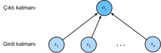

# Doğrusal Bağlanım (Regresyon)
:label:`sec_linear_regression`

*Regresyon (Bağlanım)*, bir veya daha fazla bağımsız değişken ile bağımlı bir değişken arasındaki ilişkiyi modellemeye yönelik bir grup yöntemi ifade eder. Doğa bilimleri ve sosyal bilimlerde, regresyonun amacı çoğunlukla girdiler ve çıktılar arasındaki ilişkiyi *karakterize etmektir*. Öte yandan, makine öğrenmesi çoğunlukla *tahminle* ilgilidir.

Regresyon problemleri sayısal bir değeri tahmin etmek istediğimiz zaman ortaya çıkar. Yaygın örnekler arasında fiyatları tahmin etmek (evlerin, hisse senetlerinin vb.), kalış süresini tahmin etmek (hastanedeki hastalar için), talep öngörmek (perakende satışlar için) ve sayısız başkaları sayılabilir. Her tahmin problemi klasik bir regresyon problemi değildir. Sonraki bölümlerde, amacın bir dizi kategori arasından üyeliği tahmin etmek olduğu sınıflandırma problemlerini tanıtacağız.

## Doğrusal Regresyonun Temel Öğeleri

*Doğrusal regresyon*, regresyon için standart araçlar arasında hem en basiti hem de en popüleri olabilir. Tarihi 19. yüzyılın başlarına kadar uzanan doğrusal regresyon birkaç basit varsayımdan doğmaktadır. İlk olarak, $\mathbf{x}$ bağımsız değişkenleri ve $y$ bağımlı değişkeni arasındaki ilişkinin doğrusal olduğunu, yani $y$'nin gözlemlerdeki gürültüde göz önüne alınarak $\mathbf{x}$ içindeki öğelerin ağırlıklı toplamı olarak ifade edilebileceğini varsayıyoruz. İkinci olarak, herhangi bir gürültünün iyi davrandığını varsayıyoruz (bir Gauss dağılımı takip ettiklerini).

Yaklaşımı motive etmek için işleyen bir örnekle başlayalım. Evlerin fiyatlarını (dolar cinsinden) alanlarına (metre kare cinsinden) ve yaşlarına (yıl olarak) göre tahmin etmek istediğimizi varsayalım. Gerçekten ev fiyatlarını tahmin etmede bir model geliştirirken, her evin satış fiyatını, alanını ve yaşını bildiğimiz satışlardan oluşan bir veri kumesinin elimizde olması gerekir. Makine öğrenmesi terminolojisinde, veri kümesine *eğitim veri kümesi* veya *eğitim kümesi* denir, ve her satır (burada bir satışa karşılık gelen veriler) bir *örnek* (veya *veri noktası*, *veri örneği*, *örneklem*) olarak adlandırılır. Tahmin etmeye çalıştığımız (fiyat) şeye *etiket* (veya *hedef*) denir. Tahminlerin dayandığı bağımsız değişkenler (yaş ve alan), *öznitelikler* (veya *ortak değişkenler*) olarak adlandırılır.

Tipik olarak, veri kümemizdeki örneklerin sayısını belirtmek için $n$'yi kullanacağız. Veri örneklerini $i$ ile indeksliyoruz, her girdiyi $\mathbf{x}^{(i)} = [x_1^{(i)}, x_2^{(i)}]^\top$ ve karşılık gelen etiketi $y^{(i)}$ olarak gösteriyoruz.

### Doğrusal Model
:label:`subsec_linear_model`

Doğrusallık varsayımı sadece hedefin (fiyat) özniteliklerin ağırlıklı toplamı (alan ve yaş) olarak ifade edilebileceğini söylüyor:

$$\mathrm{fiyat} = w_{\mathrm{alan}} \cdot \mathrm{alan} + w_{\mathrm{yaş}} \cdot \mathrm{yaş} + b.$$
:eqlabel:`eq_price-area`

:eqref:`eq_price-area`'de, $w_{\mathrm{alan}}$ ve $w_{\mathrm{yaş}}$, *ağırlıklar* ve $b$ *ek girdi (bias)* (aynı zamanda *offset* veya *kesim noktası*) olarak adlandırılır. Ağırlıklar, her özniteliğin tahminimiz üzerindeki etkisini belirler ve ek girdi, tüm öznitelikler 0 değerini aldığında tahmin edilen fiyatın hangi değeri alması gerektiğini söyler. Sıfır alana sahip veya tam olarak sıfır yaşında olan hiçbir ev göremeyecek olsak da, hala ek girdiye ihtiyacımız var, yoksa modelimizin ifade gücünü sınırlayacağız. Kesin olarak konuşursak, :eqref:`eq_price-area` ifadesi, ağırlıklı toplam yoluyla özniteliklerin bir *doğrusal dönüşümü* ile karakterize edilen ve eklenen ek girdi sayesinde bir *öteleme (translation)* ile birleştirilen girdi, özniteliklerinin bir *afin (affine) dönüşümüdür*.

Bir veri kümesi verildiğinde, amacımız $\mathbf{w}$ ağırlıklarını ve $b$ ek girdisini, ortalamada, modelimizce yapılan tahminlerin veride gözlemlenen gerçek fiyatlara en iyi uyacak şekilde seçmektir. Tahmin çıktıları girdi özniteliklerinin afin dönüşümü ile belirlenen modeller *doğrusal modellerdir*, ki burada afin dönüşümü seçilen ağırlıklar ve ek girdi belirler.

Sadece birkaç özniteliğe sahip veri kümelerine odaklanmanın yaygın olduğu disiplinlerde, modellerin böyle açıkça uzun biçimli ifade edilmesi yaygındır. Makine öğrenmesinde, genellikle yüksek boyutlu veri kümeleriyle çalışırız, bu nedenle doğrusal cebir gösterimini kullanmak daha uygundur. Girdilerimiz $d$ öznitelikten oluştuğunda, $\hat{y}$ tahminimizi (genel olarak "şapka" sembolü tahminleri gösterir) şu şekilde ifade ederiz:

$$\hat{y} = w_1  x_1 + ... + w_d  x_d + b.$$

Tüm öznitelikleri $\mathbf{x} \in \mathbb{R}^d$ vektöründe ve tüm ağırlıkları $\mathbf{w} \in \mathbb{R}^d$ vektöründe toplayarak modelimizi bir iç çarpım kullanarak sıkıştırılmış biçimde ifade edebiliriz:

$$\hat{y} = \mathbf{w}^\top \mathbf{x} + b.$$
:eqlabel:`eq_linreg-y`

:eqref:`eq_linreg-y`'de, $\mathbf{x}$ vektörü tek bir veri örneğinin özniteliklerine karşılık gelir. $n$ örnekli veri kümemizin tümünün özniteliklerine *tasarım matrisi* $\mathbf{X} \in \mathbb{R}^{n \times d}$ aracılığıyla atıfta bulunmayı genellikle uygun bulacağız. Burada, $\mathbf{X}$ her örnek için bir satır ve her özellik için bir sütun içerir.

$\mathbf{X}$ özniteliklerinden oluşan bir koleksiyon için, tahminler, $\hat{\mathbf{y}} \in \mathbb{R}^n$, matris-vektör çarpımı ile ifade edilebilir:

$${\hat{\mathbf{y}}} = \mathbf{X} \mathbf{w} + b,$$

burada yayma (bkz :numref:`subsec_broadcasting`) toplama esnasında uygulanır. $\mathbf{X}$ eğitim veri kümesinin öznitelikleri ve karşılık gelen (bilinen) $\mathbf{y}$ etiketleri verildiğinde, doğrusal regresyonun amacı $\mathbf{w}$ ağırlık vektörünü ve $b$ ek girdi terimini bulmaktır, öyle ki $\mathbf{X}$ ile aynı dağılımdan örneklenmiş yeni bir örneğin öznitelikleri verildiğinde, yeni veri örneğinin etiketi (ortalamada) en düşük hata ile tahmin edilecektir.

$\mathbf{x}$ verildiğinde $y$ tahmini için en iyi modelin doğrusal olduğuna inansak bile, $n$ örnekten oluşan bir gerçek dünya veri kümesinde $y^{(i)}$'nin tüm $1 \leq i \leq n$ için $\mathbf{w}^\top \mathbf{x}^{(i)}+b$'ye tam olarak eşit olmasını beklemiyoruz. Örneğin, $\mathbf{X}$ özelliklerini ve $\mathbf{y}$ etiketlerini gözlemlemek için kullandığımız araçlar ne olursa olsun az miktarda ölçüm hatası yapabilir. Dolayısıyla, temeldeki ilişkinin doğrusal olduğundan emin olsak bile, bu tür hataları hesaba katmak için bir gürültü terimi dahil edeceğiz.

En iyi *parametreleri* (veya *model parametrelerini*) $\mathbf{w}$ ve $b$'yi aramaya başlamadan önce, iki şeye daha ihtiyacımız var: (i) Belirli bir model için bir kalite ölçütü; ve (ii) kalitesini iyileştirmek için modelin güncellenmesine yönelik bir yordam (prosedür).

### Kayıp İşlevi

Modelimizi veri ile nasıl *oturtacağımızı* düşünmeye başlamadan önce, bir *uygunluk* ölçüsü belirlememiz gerekir. *Kayıp işlevi*, hedefin *gerçek* ve *tahmini* değeri arasındaki mesafeyi ölçer. Kayıp, genellikle, daha küçük değerlerin daha iyi olduğu ve mükemmel tahminlerin 0 kayba neden olduğu negatif olmayan bir sayı olacaktır. Regresyon problemlerinde en popüler kayıp fonksiyonu, hata karesidir. Bir $i$ örneğine ilişkin tahminimiz $\hat{y}^{(i)}$ ve buna karşılık gelen doğru etiket $y^{(i)}$ olduğunda, hata karesi şu şekilde verilir:

$$l^{(i)}(\mathbf{w}, b) = \frac{1}{2} \left(\hat{y}^{(i)} - y^{(i)}\right)^2.$$
:eqlabel:`eq_mse`

$\frac{1}{2}$ sabiti gerçekte bir fark yaratmaz, ancak gösterim olarak uygun olduğunu ispatlayacak ve kaybın türevini aldığımızda dengelenip kaybolacak. Eğitim veri kümesi bize verildiğinden, kontrolümüz dışında, sadece deneysel hata model parametrelerinin bir fonksiyonudur. İşleri daha somut hale getirmek için, aşağıdaki örnekte gösterildiği gibi tek boyutlu bir durum için bir regresyon problemi çizdiğimizi düşünün :numref:`fig_fit_linreg`.


:label:`fig_fit_linreg`

$\hat{y}^{(i)}$ tahminleri ile $y^{(i)}$ gözlemleri arasındaki büyük farkların ikinci dereceden bağımlılık nedeniyle daha da büyük kayıba neden olduğuna dikkat edin. $n$ örnekli veri kümesinin tamamında bir modelin kalitesini ölçmek için, eğitim kümesindeki kayıpların ortalamasını alıyoruz (veya eşdeğer bir şekilde topluyoruz).

$$L(\mathbf{w}, b) =\frac{1}{n}\sum_{i=1}^n l^{(i)}(\mathbf{w}, b) =\frac{1}{n} \sum_{i=1}^n \frac{1}{2}\left(\mathbf{w}^\top \mathbf{x}^{(i)} + b - y^{(i)}\right)^2.$$

Modeli eğitirken, tüm eğitim örneklerinde toplam kaybı en aza indiren parametreleri ($\mathbf{w}^*, b^*$) bulmak istiyoruz:

$$\mathbf{w}^*, b^* = \operatorname*{argmin}_{\mathbf{w}, b}\  L(\mathbf{w}, b).$$

### Analitik Çözüm

Doğrusal regresyon, alışılmadık derecede basit bir optimizasyon problemi haline gelir. Bu kitapta karşılaşacağımız diğer modellerin çoğunun aksine, doğrusal regresyon, basit bir formül uygulanarak analitik olarak çözülebilir. Başlangıç olarak, tüm olanlardan oluşan tasarım matrisine bir sütun ekleyerek $b$ ek girdisini $\mathbf{w}$ parametresine dahil edebiliriz. Öyleyse tahmin problemimiz $\|\mathbf{y} - \mathbf{X}\mathbf{w}\|^2$'yi en aza indirmektir. Kayıp yüzeyinde sadece bir kritik nokta vardır ve bütün alandaki minimum kayba denk gelir. $\mathbf{w}$'ye göre kaybın türevini almak ve sıfıra eşitlemek, analitik (kapalı form) çözümü verir:

$$\mathbf{w}^* = (\mathbf X^\top \mathbf X)^{-1}\mathbf X^\top \mathbf{y}.$$

Doğrusal regresyon gibi basit problemler analitik çözümleri sunarken, her zaman bu kadar talihli olmazsınız. Analitik çözümler güzel matematiksel analize izin verse de, analitik bir çözümün gerekliliği o kadar kısıtlayıcıdır ki tüm derin öğrenme dışarıda kalır.

### Minigrup Rasgele Gradyan (Eğim) İnişi

Modelleri analitik olarak çözümleyemediğimiz durumlarda bile, yine de pratikte etkili bir şekilde modelleri eğitebileceğimiz ortaya çıkıyor. Dahası, birçok görev için, optimize edilmesi zor olan bu modeller o kadar iyi çalışırlar ki, onların nasıl eğiteceklerini bulma zahmetine değecektir.

Neredeyse tüm derin öğrenme modellerini optimize etmek için kullanılan ve bu kitap boyunca değineceğimiz temel teknik, kayıp fonksiyonunu kademeli olarak düşüren yönde parametreleri güncelleyerek hatayı yinelemeli olarak azaltmaktan ibarettir. Bu algoritmaya *gradyan iniş* denir.

Gradyan inişinin en saf uygulaması, veri kümesindeki her bir örnekten hesaplanan kayıpların ortalaması olan kayıp fonksiyonunun türevini almaktan oluşur. Pratikte bu çok yavaş olabilir: Tek bir güncelleme yapmadan önce tüm veri kümesinin üzerinden geçmeliyiz. Bu nedenle, güncellemeyi her hesaplamamız gerektiğinde rastgele bir minigrup örnekten örneklemeyi *minigrup rasgele gradyan inişi* adı verilen bir yöntem ile deneyeceğiz.

Her bir yinelemede, ilk olarak sabit sayıda eğitim örneğinden oluşan bir minigrubu, $\mathcal{B}$, rasgele örnekliyoruz. Daha sonra minigruptaki ortalama kaybın türevini (gradyan) model parametrelerine göre hesaplıyoruz. Son olarak, gradyanı önceden belirlenmiş pozitif bir değerle, $\eta$, çarpıyoruz ve ortaya çıkan terimi mevcut parametre değerlerinden çıkarıyoruz.

Güncellemeyi matematiksel olarak şu şekilde ifade edebiliriz ($\partial$ kısmi türevi belirtir):

$$(\mathbf{w},b) \leftarrow (\mathbf{w},b) - \frac{\eta}{|\mathcal{B}|} \sum_{i \in \mathcal{B}} \partial_{(\mathbf{w},b)} l^{(i)}(\mathbf{w},b).$$

Özetlemek gerekirse, algoritmanın adımları şöyledir: (i) Model parametrelerinin değerlerini tipik olarak rastgele olarak başlatıyoruz; (ii) verilerden yinelemeli olarak rastgele minigruplar örnekleyerek parametreleri negatif gradyan yönünde güncelliyoruz. İkinci dereceden kayıplar ve afin dönüşümler için, bunu açıkça şu şekilde yazabiliriz:

$$\begin{aligned} \mathbf{w} &\leftarrow \mathbf{w} -   \frac{\eta}{|\mathcal{B}|} \sum_{i \in \mathcal{B}} \partial_{\mathbf{w}} l^{(i)}(\mathbf{w}, b) = \mathbf{w} - \frac{\eta}{|\mathcal{B}|} \sum_{i \in \mathcal{B}} \mathbf{x}^{(i)} \left(\mathbf{w}^\top \mathbf{x}^{(i)} + b - y^{(i)}\right),\\ b &\leftarrow b -  \frac{\eta}{|\mathcal{B}|} \sum_{i \in \mathcal{B}} \partial_b l^{(i)}(\mathbf{w}, b)  = b - \frac{\eta}{|\mathcal{B}|} \sum_{i \in \mathcal{B}} \left(\mathbf{w}^\top \mathbf{x}^{(i)} + b - y^{(i)}\right). \end{aligned}$$
:eqlabel:`eq_linreg_batch_update`

$\mathbf{w}$ ve $\mathbf{x}$'in :eqref:`eq_linreg_batch_update` içinde vektörler olduğuna dikkat edin. Burada, daha zarif vektör gösterimi, matematiği, $w_1, w_2, \ldots, w_d$ gibi, katsayılarla ifade etmekten çok daha okunaklı hale getirir. Küme niceliği (kardinalite), $|\mathcal{B}|$, her bir minigruptaki örneklerin sayısını (*grup boyutu*) ve $\eta$ *öğrenme oranını* gösterir. Burada grup boyutu ve öğrenme oranı değerlerinin manuel olarak önceden belirlendiğini ve tipik olarak model eğitimi yoluyla öğrenilmediğini vurguluyoruz. Ayarlanabilir ancak eğitim döngüsünde güncellenmeyen bu parametrelere *hiper parametreler* denir. *Hiper parametre ayarı*, hiper parametrelerin seçildiği süreçtir ve genellikle onları eğitim döngüsününde ayrı bir *geçerleme veri kümesinde* (veya *geçerleme kümesinde*) elde edilen değerlendirilme sonuçlarına göre ayarlamamızı gerektirir.

Önceden belirlenmiş sayıda yineleme kadar eğitimden sonra (veya başka bazı durdurma kriterleri karşılanana kadar), $\hat{\mathbf{w}}, \hat{b}$ olarak belirtilen tahmini model parametrelerini kaydediyoruz. Fonksiyonumuz gerçekten doğrusal ve gürültüsüz olsa bile, bu parametreler kaybın kesin minimum değerleri olmayacaktır, çünkü algoritma yavaşça en küçük değerlere doğru yaklaşsa da sonlu bir adımda tam olarak başaramayacaktır.

Doğrusal regresyon, tüm etki alanı üzerinde yalnızca bir minimumun olduğu bir öğrenme problemi haline gelir. Halbuki, derin ağlar gibi daha karmaşık modeller için kayıp yüzeyleri birçok minimum içerir. Neyse ki, henüz tam olarak anlaşılmayan nedenlerden dolayı, derin öğrenme uygulayıcıları nadiren *eğitim kümelerinde* kaybı en aza indirecek parametreleri bulmakta zorlanırlar. Daha zorlu görev, daha önce görmediğimiz verilerde düşük kayıp elde edecek parametreler bulmaktır; bu, *genelleme* denen bir zorluktur. Kitap boyunca bu konulara döneceğiz.

### Öğrenilen Modelle Tahmin Yapma

Öğrenilen doğrusal regresyon modeli $\hat{\mathbf{w}}^\top \mathbf{x} + \hat{b}$ göz önüne alındığında, artık (eğitim verilerinde yer almayan) yeni bir evin alanı, $x_1$, ve yaşı, $x_2$, verildiğinde fiyatını tahmin edebiliriz. Öznitelikler verilince hedeflerin tahmin edilmesine genellikle *tahmin* veya *çıkarım* denir.

*Tahmine* bağlı kalmaya çalışacağız çünkü bu adımı *çıkarım* olarak adlandırmak, derin öğrenmede standart bir jargon olarak ortaya çıkmasına rağmen, bir şekilde yanlış bir isimdir. İstatistiklerde, *çıkarım* daha çok bir veri kümesine dayanarak parametreleri tahmin etmeyi ifade eder. Terminolojinin bu kötüye kullanımı, derin öğrenme uygulayıcıları istatistikçilerle konuşurken yaygın bir kafa karışıklığı kaynağıdır.

## Hız için Vektörleştirme

Modellerimizi eğitirken, tipik olarak tüm minigrup örneklerini aynı anda işlemek isteriz. Bunu verimli bir şekilde yapmak, (**Python'da maliyetli döngüler yazmak yerine, hesaplamaları vektörleştirmemizi ve hızlı doğrusal cebir kütüphanelerinden yararlanmamızı**) gerektirir.

```{.python .input}
%matplotlib inline
from d2l import mxnet as d2l
import math
from mxnet import np
import time
```

```{.python .input}
#@tab pytorch
%matplotlib inline
from d2l import torch as d2l
import math
import torch
import numpy as np
import time
```

```{.python .input}
#@tab tensorflow
%matplotlib inline
from d2l import tensorflow as d2l
import math
import tensorflow as tf
import numpy as np
import time
```

Bunun neden bu kadar önemli olduğunu göstermek için, (**vektörleri eklemek için iki yöntem düşünebiliriz**). Başlangıç olarak, bütün girdileri 1 olan 10000 boyutlu iki vektör tanımlıyoruz. Bir yöntemde vektörler üzerinde bir Python for-döngüsü ile döngü yapacağız. Diğer yöntemde, tek bir `+` çağrısına güveneceğiz.

```{.python .input}
#@tab all
n = 10000
a = d2l.ones(n)
b = d2l.ones(n)
```

Bu kitapta çalışma süresini sık sık karşılaştıracağımızdan [**bir zamanlayıcı tanımlayalım**].

```{.python .input}
#@tab all
class Timer:  #@save
    """Birden fazla koşma zamanını kaydedin."""
    def __init__(self):
        self.times = []
        self.start()

    def start(self):
        """Zamanlayıcıyı başlatın."""
        self.tik = time.time()

    def stop(self):
        """Zamanlayıcı durdurun ve zamanı listeye kaydedin."""
        self.times.append(time.time() - self.tik)
        return self.times[-1]

    def avg(self):
        """Ortalama zamanı döndürün."""
        return sum(self.times) / len(self.times)

    def sum(self):
        """Toplam zamanı döndürün."""
        return sum(self.times)

    def cumsum(self):
        """Biriktirilmiş zamanı döndürün."""
        return np.array(self.times).cumsum().tolist()
```

Artık iş yüklerini karşılaştırabiliriz. İlk olarak, bir for döngüsü kullanarak her seferinde bir koordinat gibi onları topluyoruz.

```{.python .input}
#@tab mxnet, pytorch
c = d2l.zeros(n)
timer = Timer()
for i in range(n):
    c[i] = a[i] + b[i]
f'{timer.stop():.5f} sn'
```

```{.python .input}
#@tab tensorflow
c = tf.Variable(d2l.zeros(n))
timer = Timer()
for i in range(n):
    c[i].assign(a[i] + b[i])
f'{timer.stop():.5f} sn'
```

(**Alternatif olarak, eleman yönlü toplamı hesaplamak için yeniden yüklenen `+` operatörüne güveniyoruz.**)

```{.python .input}
#@tab all
timer.start()
d = a + b
f'{timer.stop():.5f} sn'
```

Muhtemelen ikinci yöntemin birincisinden çok daha hızlı olduğunu fark etmişsinizdir. Vektörleştirme kodu genellikle büyük ölçeklerde hız artışları sağlar. Dahası, matematiğin çoğunun sorumluluğunu kütüphaneye yüklüyoruz ve kendimizin bu kadar çok hesaplamayı yazmamıza gerek yok, bu da hata olasılığını azaltıyor.

## Normal Dağılım ve Kare Kayıp
:label:`subsec_normal_distribution_and_squared_loss`

Sadece yukarıdaki bilgileri kullanarak ellerinizi şimdiden kirletebilecekken, aşağıda gürültünün dağılımı ile ilgili varsayımlar yoluyla kare kayıp amaç fonsiyonunu daha biçimsel (formal) olarak motive edici hale getirebiliriz.

Doğrusal regresyon, 1795'te normal (*Gauss* olarak da adlandırılır) dağılımını da keşfeden Gauss tarafından icat edildi. Görünüşe göre normal dağılım ve doğrusal regresyon arasındaki bağlantı, ortak ebeveynlikten daha derindir. Belleğinizi yenilemek için, ortalaması $\mu$ ve varyansı $\sigma^2$ (standart sapma $\sigma$) olan normal bir dağılımın olasılık yoğunluğu şu şekilde verilir:

$$p(x) = \frac{1}{\sqrt{2 \pi \sigma^2}} \exp\left(-\frac{1}{2 \sigma^2} (x - \mu)^2\right).$$

Aşağıda [**normal dağılımı hesaplamak için bir Python işlevi tanımlıyoruz.**]

```{.python .input}
#@tab all
def normal(x, mu, sigma):
    p = 1 / math.sqrt(2 * math.pi * sigma**2)
    return p * np.exp(-0.5 / sigma**2 * (x - mu)**2)
```

Artık (**normal dağılımları görselleştirebiliriz**).

```{.python .input}
#@tab mxnet
# Görselleştirme için gene numpy kullanın
x = np.arange(-7, 7, 0.01)
# Ortalama ve standart sapma çifti
params = [(0, 1), (0, 2), (3, 1)]
d2l.plot(x.asnumpy(), [normal(x, mu, sigma).asnumpy() for mu, sigma in params], xlabel='x',
         ylabel='p(x)', figsize=(4.5, 2.5),
         legend=[f'mean {mu}, std {sigma}' for mu, sigma in params])
```

```{.python .input}
#@tab pytorch, tensorflow
# Görselleştirme için gene numpy kullanın
x = np.arange(-7, 7, 0.01)

# Ortalama ve standart sapma çifti
params = [(0, 1), (0, 2), (3, 1)]
d2l.plot(x, [normal(x, mu, sigma) for mu, sigma in params], xlabel='x',
         ylabel='p(x)', figsize=(4.5, 2.5),
         legend=[f'mean {mu}, std {sigma}' for mu, sigma in params])
```

Gördüğümüz gibi, ortalamanın değiştirilmesi $x$ ekseni boyunca bir kaymaya karşılık gelir ve varyansı arttırmak dağılımı yayarak tepe noktasını düşürür.

Ortalama hata karesi kayıp fonksiyonlu (veya basitçe kare kaybı) doğrusal regresyonu motive etmenin bir yolu, gözlemlerin, gürültünün aşağıdaki gibi normal dağıldığı gürültülü gözlemlerden kaynaklandığını biçimsel olarak varsaymaktır:

$$y = \mathbf{w}^\top \mathbf{x} + b + \epsilon \text{ where } \epsilon \sim \mathcal{N}(0, \sigma^2).$$

Böylece, belirli bir $y$'yi belirli bir $\mathbf{x}$ için görme *olabilirliğini* şu şekilde yazabiliriz:

$$P(y \mid \mathbf{x}) = \frac{1}{\sqrt{2 \pi \sigma^2}} \exp\left(-\frac{1}{2 \sigma^2} (y - \mathbf{w}^\top \mathbf{x} - b)^2\right).$$

Şimdi, maksimum olabilirlik ilkesine göre, $\mathbf{w}$ ve $b$ parametrelerinin en iyi değerleri, tüm veri kümesinin *olabilirliğini* en üst düzeye çıkaranlardır:

$$P(\mathbf y \mid \mathbf X) = \prod_{i=1}^{n} p(y^{(i)}|\mathbf{x}^{(i)}).$$

Maksimum olabilirlik ilkesine göre seçilen tahminciler, *maksimum olabilirlik tahmincileri* olarak adlandırılır. Birçok üstel fonksiyonun çarpımını maksimize etmek zor görünse de, bunun yerine olabilirliğin logaritmasını maksimize ederek, amaç fonksiyonunu değiştirmeden işleri önemli ölçüde basitleştirebiliriz. Tarihsel nedenlerden dolayı, eniyilemeler daha çok azamileştirmekten (maksimizasyon) ziyade asgarileştirme (minimizasyon) olarak ifade edilir. Dolayısıyla, hiçbir şeyi değiştirmeden *negatif log-olabilirlik*, $-\log P(\mathbf y \mid \mathbf X)$, değerini en aza indirebiliriz. Matematik üzerinde biraz çalışmak bize şunu verir:

$$-\log P(\mathbf y \mid \mathbf X) = \sum_{i=1}^n \frac{1}{2} \log(2 \pi \sigma^2) + \frac{1}{2 \sigma^2} \left(y^{(i)} - \mathbf{w}^\top \mathbf{x}^{(i)} - b\right)^2.$$

Şimdi $\sigma$'nın bir sabit olduğu varsayımına da ihtiyacımız var. Böylece ilk terimi göz ardı edebiliriz çünkü bu $\mathbf{w}$ veya $b$'ye bağlı değildir. Şimdi ikinci terim, çarpımsal sabit $\frac{1}{\sigma^2}$ dışında, daha önce tanıtılan hata karesi kaybıyla aynıdır. Neyse ki, çözüm $\sigma$'ya bağlı değildir. Ortalama hata karesini en aza indirmenin, eklenen Gauss gürültüsü varsayımı altında doğrusal bir modelin maksimum olabilirlik tahminine eşdeğer olduğu sonucu çıkar.

## Doğrusal Regresyondan Derin Ağlara

Şimdiye kadar sadece doğrusal modellerden bahsettik. Sinir ağları çok daha zengin bir model ailesini kapsarken, doğrusal modeli sinir ağları dilinde ifade ederek bir sinir ağı gibi düşünmeye başlayabiliriz. Başlangıç için, nesneleri bir "katman" gösteriminde yeniden yazalım.

### Yapay Sinir Ağı Şeması

Derin öğrenme uygulayıcıları, modellerinde neler olduğunu görselleştirmek için şemalar çizmeyi severler. :numref:`fig_single_neuron` içinde, doğrusal regresyon modelimizi bir sinir ağı olarak tasvir ediyoruz. Bu diyagramların, her bir girdinin çıktıya nasıl bağlandığı gibi bağlantı desenlerini vurguladığına, ancak ağırlıkların veya ek girdilerin aldığı değerleri vurgulamadığına dikkat edin.


:label:`fig_single_neuron`

:numref:`fig_single_neuron` içinde gösterilen sinir ağı için, girdiler $x_1, \ldots, x_d$'dir, dolayısıyla girdi katmanındaki *girdi sayısı* (veya *öznitelik boyutu*) $d$'dir. Ağın :numref:`fig_single_neuron` içindeki çıktısı $o_1$'dir, dolayısıyla çıktı katmanındaki *çıktı sayısı* $1$'dir. Girdi değerlerinin hepsinin *verildiğini* ve sadece tek bir *hesaplanmış*  nöron (sinir hücresi) olduğuna dikkat edin. Hesaplamanın nerede gerçekleştiğine odaklanarak, geleneksel olarak katmanları sayarken girdi katmanını dikkate almayız. Yani :numref:`fig_single_neuron` içindeki sinir ağı için *katman sayısı* $1$'dir. Doğrusal regresyon modellerini sadece tek bir yapay nörondan oluşan sinir ağları veya tek katmanlı sinir ağları olarak düşünebiliriz.

Doğrusal regresyon için, her girdi her çıktıya bağlı olduğundan (bu durumda yalnızca bir çıktı vardır), bu dönüşümü (:numref:`fig_single_neuron` içindeki çıktı katmanı) *tam bağ(lantı)lı katman* veya *yoğun katman* olarak kabul edebiliriz. Bir sonraki bölümde bu tür katmanlardan oluşan ağlar hakkında daha çok konuşacağız.

### Biyoloji

Doğrusal regresyon (1795'te icat edildi) hesaplamalı sinirbilimden önce geldiğinden, doğrusal regresyonu bir sinir ağı gibi tanımlamak kronolojik hata olarak görünebilir. Sibernetikçiler/nörofizyologlar, Warren McCulloch ve Walter Pitts, yapay sinir hücresi modelleri geliştirmeye başladığında doğrusal modellerin neden doğal bir başlangıç noktası olduğunu anlamak için, bir biyolojik sinir hücresinin karikatürize resmini düşünün :numref:`fig_Neuron`: *Dendritlerden* (girdi terminalleri), *çekirdekten* (CPU), *aksondan* (çıktı teli) ve *akson terminallerinde* (çıktı terminalleri) oluşur ve *sinapslar* aracılığıyla diğer nöronlara bağlantı sağlar.


:label:`fig_Neuron`

Dendritlerde diğer nöronlardan (veya retina gibi çevresel sensörlerden) gelen bilgiyi, $x_i$, alınır. Özellikle, bu bilgi, girdilerin etkisini belirleyen *sinaptik ağırlıklar*, $w_i$, ile ağırlıklandırılır (örneğin, $x_i w_i$ çarpımı aracılığıyla etkinleştirme veya engelleme). Birden fazla kaynaktan gelen ağırlıklı girdiler, çekirdekte ağırlıklı bir toplam $y= \sum_i x_i w_i + b$ olarak biriktirilir ve bu bilgi daha sonra, tipik olarak bazı doğrusal olmayan işlemlerden, $\sigma(y)$ gibi, sonra $y$ aksonunda daha fazla işlenmek üzere gönderilir. Oradan ya hedefine (örneğin bir kas) ulaşır ya da dendritleri yoluyla başka bir nörona beslenir.

Kuşkusuz, birçok birimin, tek başına herhangi bir nöronun ifade edebileceğinden çok daha ilginç ve karmaşık davranışlar üretmek için doğru bağlanabilirlik ve doğru öğrenme algoritmasıyla bir araya getirilebileceği yönündeki bu tür üst düzey fikir, varlığını gerçek biyolojik sinir sistemleri çalışmamıza borçludur.

Aynı zamanda, günümüzde derin öğrenmedeki çoğu araştırma, sinirbilimden çok az ilham alıyor. Stuart Russell ve Peter Norvig'in klasik YZ metin kitaplarında *Yapay Zeka: Modern Bir Yaklaşım (Artificial Intelligence: A Modern Approach)* :cite:`Russell.Norvig.2016`, görüyoruz ki, uçaklar kuşlardan *esinlenmiş* olsa da ornitolojinin birkaç yüzyıldır havacılık yeniliklerinin ana itici gücü olmamıştır. Aynı şekilde, bugünlerde derin öğrenmedeki ilham eşit veya daha büyük ölçüde matematik, istatistik ve bilgisayar bilimlerinden  geliyor.

## Özet

* Bir makine öğrenmesi modelindeki temel bileşenler eğitim verileri, bir kayıp işlevi, bir optimizasyon algoritması ve oldukça açık bir şekilde modelin kendisidir.
* Vektörleştirme, her şeyi daha iyi (çoğunlukla matematik) ve daha hızlı (çoğunlukla kod) yapar.
* Bir amaç işlevini en aza indirmek ve maksimum olabilirlik tahminini gerçekleştirmek aynı anlama gelebilir.
* Doğrusal regresyon modelleri de sinir ağlarıdır.

## Alıştırmalar

1. $x_1, \ldots, x_n \in \mathbb{R}$ verisine sahip olduğumuzu varsayalım. Amacımız, $\sum_i (x_i - b)^2$ en aza indirilecek şekilde sabit bir $b$ bulmaktır.
    1. $b$'nin optimum değeri için analitik bir çözüm bulunuz.
    1. Bu problem ve çözümü normal dağılımla nasıl ilişkilidir?
1. Hata kareli doğrusal regresyon için optimizasyon probleminin analitik çözümünü türetiniz. İşleri basitleştirmek için, problemden $b$ ek girdisini çıkarabilirsiniz (bunu ilkeli bir şekilde, hepsini içeren $\mathbf X$'e bir sütun ekleyerek yapabiliriz).
    1. Optimizasyon problemini matris ve vektör gösteriminde yazınız (tüm verileri tek bir matris ve tüm hedef değerleri tek bir vektör olarak ele alınız).
    1. $w$'ye göre kaybın gradyanını hesaplayınız.
    1. Gradyanı sıfıra eşitleyerek ve matris denklemini çözerek analitik çözümü bulunuz.
    1. Bu ne zaman rasgele gradyan iniş kullanmaktan daha iyi olabilir? Bu yöntem ne zaman bozulabilir?
1. Eklenen gürültü $\epsilon$'u etkin gürültü modelinin üstel dağılım olduğunu varsayın. Yani, $p(\epsilon) = \frac{1}{2} \exp(-|\epsilon|)$'dur.
    1. Verilerin negatif log-olabilirliğini $-\log P(\mathbf y \mid \mathbf X)$ modeli altında yazınız.
    1. Kapalı form çözümü bulabilir misiniz?
    1. Bu sorunu çözmek için bir rasgele gradyan iniş algoritması önerin. Ne yanlış gidebilir (İpucu: Parametreleri güncellemeye devam ederken durağan noktanın yakınında ne olur)? Bunu düzeltebilir misiniz?

:begin_tab:`mxnet`
[Tartışmalar](https://discuss.d2l.ai/t/40)
:end_tab:

:begin_tab:`pytorch`
[Tartışmalar](https://discuss.d2l.ai/t/258)
:end_tab:

:begin_tab:`tensorflow`
[Tartışmalar](https://discuss.d2l.ai/t/259)
:end_tab:
