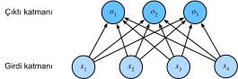

# Eşiksiz En Büyük İşlev Bağlanımı  (Softmaks Regresyon)
:label:`sec_softmax`

:numref:`sec_linear_regression` içinde, doğrusal bağlanımı tanıttık, :numref:`sec_linear_scratch` içinde sıfırdan uygulamalar üzerinde çalıştık ve ağır işi yapmak için :numref:`sec_linear_concise` içinde derin öğrenme çerçevesinin yüksek seviyeli API'lerini tekrar kullandık.

Bağlanım, *ne kadar?* veya *kaç?* sorularını yanıtlamak istediğimizde ulaştığımız araçtır. Bir evin kaç dolara satılacağını (fiyatı) veya bir beyzbol takımının kazanabileceği galibiyet sayısını veya bir hastanın taburcu edilmeden önce hastanede kalacağı gün sayısını tahmin etmek istiyorsanız, o zaman muhtemelen bir regresyon modeli arıyorsunuz.

Uygulamada, daha çok *sınıflandırma* ile ilgileniyoruz. "Ne kadar" değil, "hangisi" sorusunu sorarak:

* Bu e-posta spam klasörüne mi yoksa gelen kutusuna mı ait?
* Bu müşterinin bir abonelik hizmetine *kaydolma* mı veya *kaydolmama* mı olasılığı daha yüksek?
* Bu resim bir eşeği, köpeği, kediyi veya horozu tasvir ediyor mu?
* Aston'ın bir sonraki izleyeceği film hangisi?

Konuşma dilinde, makine öğrenmesi uygulayıcıları iki incelikle farklı sorunu tanımlamak için *sınıflandırma* kelimesini aşırı yüklüyorlar: (i) Yalnızca örneklerin kategorilere (sınıflara) zor olarak atanmasıyla ilgilendiğimiz konular ve (ii) yumuşak atamalar yapmak istediğimiz yerler, yani her bir kategorinin geçerli olma olasılığını değerlendirme. Ayrım, kısmen bulanıklaşma eğilimindedir, çünkü çoğu zaman, yalnızca zor görevleri önemsediğimizde bile, yine de yumuşak atamalar yapan modeller kullanıyoruz.

## Sınıflandırma Problemi
:label:`subsec_classification-problem`

Ayaklarımızı ısındırmak için basit bir imge sınıflandırma problemiyle başlayalım. Buradaki her girdi $2\times2$ gri tonlamalı bir imgeden oluşur. Her piksel değerini tek bir skaler ile temsil edebiliriz ve bu da  bize dört öznitelik, $x_1, x_2, x_3, x_4$, verir. Ayrıca, her imgenin "kedi", "tavuk" ve "köpek" kategorilerinden birine ait olduğunu varsayalım.

Daha sonra, etiketleri nasıl temsil edeceğimizi seçmeliyiz. İki bariz seçeneğimiz var. Belki de en doğal dürtü, tam sayıların sırasıyla $\{\text{köpek}, \text{kedi}, \text{tavuk}\}$ temsil eden $\{1, 2, 3 \}$ içinden $y$'yi seçmek olacaktır. Bu, bu tür bilgileri bir bilgisayarda *saklamanın* harika bir yoludur. Kategoriler arasında doğal bir sıralama varsa, örneğin $\{\text{bebek}, \text{yürümeye başlayan çocuk}, \text{ergen}, \text{genç yetişkin}, \text{yetişkin}, \text{yaşlı}\}$ tahmin etmeye çalışıyor olsaydık, bu sorunu bağlanım olarak kabul etmek ve etiketleri bu biçimde tutmak mantıklı bile olabilirdi.

Ancak genel sınıflandırma sorunları, sınıflar arasında doğal sıralamalarla gelmez. Neyse ki, istatistikçiler uzun zaman önce kategorik verileri göstermenin basit bir yolunu keşfettiler: *Bire bir kodlama*. Bire bir kodlama, kategorilerimiz kadar bileşen içeren bir vektördür. Belirli bir örneğin kategorisine karşılık gelen bileşen $1$'e ve diğer tüm bileşenler $0$'a ayarlanmıştır. Bizim durumumuzda, $y$ etiketi üç boyutlu bir vektör olacaktır: $(1, 0, 0)$ - "kedi", $(0, 1, 0)$ - "tavuk" ve $(0, 0, 1)$ - "köpek":

$$y \in \{(1, 0, 0), (0, 1, 0), (0, 0, 1)\}.$$

## Ağ Mimarisi

Tüm olası sınıflarla ilişkili koşullu olasılıkları tahmin etmek için, sınıf başına bir tane olmak üzere birden çok çıktıya sahip bir modele ihtiyacımız var. Doğrusal modellerle sınıflandırmayı ifade etmek için, çıktılarımız kadar sayıda afin (affine) fonksiyona ihtiyacımız olacak. Her çıktı kendi afin işlevine karşılık gelecektir. Bizim durumumuzda, 4 özniteliğimiz ve 3 olası çıktı kategorimiz olduğundan, ağırlıkları temsil etmek için 12 sayıla (indeskli $w$) ve ek girdileri temsil etmek için 3 sayıla (indeksli $b$) ihtiyacımız olacak. Her girdi için şu üç *logit*i, $o_1, o_2$ ve $o_3$, hesaplıyoruz:

$$
\begin{aligned}
o_1 &= x_1 w_{11} + x_2 w_{12} + x_3 w_{13} + x_4 w_{14} + b_1,\\
o_2 &= x_1 w_{21} + x_2 w_{22} + x_3 w_{23} + x_4 w_{24} + b_2,\\
o_3 &= x_1 w_{31} + x_2 w_{32} + x_3 w_{33} + x_4 w_{34} + b_3.
\end{aligned}
$$

Bu hesaplamayı :numref:`fig_softmaxreg` içinde gösterilen sinir ağı diyagramı ile tasvir edebiliriz. Doğrusal regresyonda olduğu gibi, softmaks regresyon da tek katmanlı bir sinir ağıdır. Ayrıca her çıktının, $o_1, o_2$ ve $o_3$, hesaplanması,  tüm girdilere, $x_1$, $x_2$, $x_3$ ve $x_4$, bağlı olduğundan, eşiksiz en büyük işlev bağlanımının (softmaks regresyonunun) çıktı katmanı da tamamen bağlı katman olarak tanımlanır.

:label:`fig_softmaxreg`

Modeli daha öz bir şekilde ifade etmek için doğrusal cebir gösterimini kullanabiliriz. Vektör biçiminde, hem matematik hem de kod yazmak için daha uygun bir biçim olan $\mathbf{o} = \mathbf{W} \mathbf{x} + \mathbf{b}$'ye ulaşıyoruz. Tüm ağırlıklarımızı bir $3 \times 4$ matriste topladığımızı ve belirli bir $\mathbf{x}$ veri örneğinin öznitelikleri için, çıktılarımızın bizim öznitelikler girdimiz ile ağırlıklarımızın bir matris-vektör çarpımı artı ek girdilerimiz $\mathbf{b}$ olarak verildiğini unutmayın.

## Tam Bağlantı Katmanların Parametrelendirme Maliyeti
:label:`subsec_parameterization-cost-fc-layers`

Sonraki bölümlerde göreceğimiz gibi, derin öğrenmede tam bağlı katmanlar her yerde bulunur. Ancak, adından da anlaşılacağı gibi, tam bağlı katmanlar, potansiyel olarak birçok öğrenilebilir parametreyle *tamamen* bağlantılıdır. Özellikle, $d$ girdileri ve $q$ çıktıları olan herhangi bir tam bağlı katman için, parametreleştirme maliyeti $\mathcal{O}(dq)$'dır ve bu pratikte aşırı derecede yüksek olabilir. Neyse ki, $d$ girdilerini $q$ çıktılarına dönüştürmenin bu maliyeti $\mathcal{O}(\frac{dq}{n})$'a düşürülebilir, burada $n$ hiper parametresi bizim tarafımızdan gerçek dünya uygulamalarında, parametre tasarrufu ve model etkinliği arasındaki dengeyi sağlamak için esnek bir şekilde belirtilebilir :cite:`Zhang.Tay.Zhang.ea.2021`.

## Eşiksiz En Büyük İşlev İşlemi 
:label:`subsec_softmax_operation`

Burada ele alacağımız ana yaklaşım, modelimizin çıktılarını olasılıklar olarak yorumlamaktır. Gözlemlenen verilerin olabilirliğini en üst düzeye çıkaran olasılıkları üretmek için parametrelerimizi optimize edeceğiz (eniyileceğiz). Ardından, tahminler üretmek için bir eşik belirleyeceğiz, örneğin maksimum tahmin edilen olasılığa sahip etiketi seçeceğiz.

Biçimsel olarak ifade edersek, herhangi bir $\hat{y}_j$ çıktısının belirli bir öğenin $j$ sınıfına ait olma olasılığı olarak yorumlanmasını istiyoruz. Sonra en büyük çıktı değerine sahip sınıfı tahminimiz $\operatorname*{argmax}_j y_j$ olarak seçebiliriz. Örneğin, $\hat{y}_1$, $\hat{y}_2$ ve $\hat{y}_3$ sırasıyla 0.1, 0.8 ve 0.1 ise, o zaman (örneğimizde) "tavuğu" temsil eden kategori 2'yi tahmin ederiz.

Logit $o$'yu doğrudan ilgilendiğimiz çıktılarımız olarak yorumlamamızı önermek isteyebilirsiniz. Bununla birlikte, doğrusal katmanın çıktısının doğrudan bir olasılık olarak yorumlanmasında bazı sorunlar vardır. Bir yandan, hiçbir şey bu sayıların toplamını 1'e sınırlamıyor. Diğer yandan, girdilere bağlı olarak negatif değerler alabilirler. Bunlar, :numref:`sec_prob` içinde sunulan temel olasılık aksiyomlarını ihlal ediyor.

Çıktılarımızı olasılıklar olarak yorumlamak için, (yeni verilerde bile) bunların negatif olmayacağını ve toplamlarının 1 olacağını garanti etmeliyiz. Dahası, modeli gerçeğe uygun olasılıkları tahmin etmeye teşvik eden bir eğitim amaç fonksiyonuna ihtiyacımız var. Bir sınıflandırıcı tüm örneklerden 0.5 çıktısını verdiğinde, bu örneklerin yarısının gerçekte tahmin edilen sınıfa ait olacağını umuyoruz. Bu, *kalibrasyon* adı verilen bir özelliktir.

1959'da sosyal bilimci R. Duncan Luce tarafından *seçim modelleri* bağlamında icat edilen *eşiksiz en büyük işlevi (softmaks)* tam olarak bunu yapar. Logitlerimizi negatif olmayacak ve toplamı 1 olacak şekilde dönüştürmek için, modelin türevlenebilir kalmasını gerekliyken, önce her logitin üssünü alırız (negatif olmamasını sağlar) ve sonra toplamlarına böleriz (toplamlarının 1 olmasını sağlar):

$$\hat{\mathbf{y}} = \mathrm{softmax}(\mathbf{o})\quad \text{öyle ki}\quad \hat{y}_j = \frac{\exp(o_j)}{\sum_k \exp(o_k)}. $$
:eqlabel:`eq_softmax_y_and_o`

Tüm $j$ için $\hat{y}_1 + \hat{y}_2 + \hat{y}_3 = 1$'i, $0 \leq \hat{y}_j \leq 1$ ile görmek kolaydır. Dolayısıyla, $\hat{\mathbf{y}}$, eleman değerleri uygun şekilde yorumlanabilen uygun bir olasılık dağılımıdır. Softmaks işleminin, her sınıfa atanan olasılıkları belirleyen basit softmaks-öncesi değerler olan $\mathbf{o}$ logitleri arasındaki sıralamayı değiştirmediğini unutmayın. Bu nedenle, tahmin sırasında yine en olası sınıfı seçebiliriz:

$$
\operatorname*{argmax}_j \hat y_j = \operatorname*{argmax}_j o_j.
$$

Softmaks doğrusal olmayan bir fonksiyon olmasına rağmen, softmaks regresyonunun çıktıları hala girdi özniteliklerinin afin dönüşümü ile *belirlenir*; dolayısıyla, softmaks regresyon doğrusal bir modeldir.

## Minigruplar için Vektörleştirme
:label:`subsec_softmax_vectorization`

Hesaplama verimliliğini artırmak ve GPU'lardan yararlanmak için, genellikle veri minigrupları için vektör hesaplamaları yapıyoruz. Öznitelik boyutsallığı (girdi sayısı) $d$ ve parti boyutu $n$ içeren bir minigrup $\mathbf{X}$ verildiğini varsayalım. Üstelik, çıktıda $q$ kategorimizin olduğunu varsayalım. Sonra minigrup öznitelikleri $\mathbf{X}$, $\mathbb{R}^{n \times d}$ içinde, ağırlıkları $\mathbf{W} \in \mathbb{R}^{d \times q}$ ve ek girdiyi, $\mathbf{b} \in \mathbb{R}^{1\times q}$ olarak gösterir.

$$ \begin{aligned} \mathbf{O} &= \mathbf{X} \mathbf{W} + \mathbf{b}, \\ \hat{\mathbf{Y}} & = \mathrm{softmax}(\mathbf{O}). \end{aligned} $$
:eqlabel:`eq_minibatch_softmax_reg`

Bu, baskın işlemi, her seferinde bir örnek işlersek yürüteceğimiz matris-vektör çarpımlarına karşı $\mathbf{X} \mathbf{W}$ matris-matris çarpımını, hızlandırır. $\mathbf{X}$ içindeki her satır bir veri örneğini temsil ettiğinden, softmaks işleminin kendisi *satır bazında* hesaplanabilir: Her $\mathbf{O}$ satırı için, tüm girdilerin üssünü alın ve sonra bunları toplayarak normalleştirin. :eqref:`eq_minibatch_softmax_reg` içindeki $\mathbf{X} \mathbf{W} + \mathbf{b}$ toplamı sırasında yayınlamayı tetikleriz, hem minigrup logitleri $\mathbf{O}$ hem de çıktı olasılıkları $\hat{\mathbf{Y}}$, $n \times q$ matrislerdir.

## Kayıp (Yitim) İşlevi

Sonrasında, tahmin edilen olasılıklarımızın kalitesini ölçmek için bir kayıp fonksiyonuna ihtiyacımız var. Doğrusal regresyonda ortalama hata karesi amaç fonksiyonu için olasılıksal bir gerekçelendirme sağlarken karşılaştığımız kavramla aynı olan maksimum olabilirlik tahminine güveneceğiz (:numref:`subsec_normal_distribution_and_squared_loss`).

### Log-Olabilirlik

Softmaks işlevi bize $\hat{\mathbf{y}}$ vektörünü verir, bunu herhangi bir $\mathbf{x}$ girdisi verildiğinde her bir sınıfın tahmini koşullu olasılıkları olarak yorumlayabiliriz, ör. $\hat{y}_1$ = $P(y =\text{kedi} \mid \mathbf{x})$. $\{\mathbf{X}, \mathbf{Y}\}$ veri kümesinin tamamınında, $i$ indekslenen $\mathbf{x}^{(i)}$ örneğini ve ilgili bire-bir etiket vektörü $\mathbf{y}^{(i)}$'yi içeren $n$ örneğe sahip olduğunu varsayalım. Öznitelikleri göz önüne alındığında, gerçek sınıfların modelimize göre ne kadar olası olduğunu kontrol ederek tahminleri gerçekle karşılaştırabiliriz:

$$
P(\mathbf{Y} \mid \mathbf{X}) = \prod_{i=1}^n P(\mathbf{y}^{(i)} \mid \mathbf{x}^{(i)}).
$$

Maksimum olabilirlik tahminine göre, negatif log olabilirliği en aza indirmeye eşdeğer olan $P(\mathbf{Y} \mid \mathbf{X})$'i maksimize ediyoruz:

$$
-\log P(\mathbf{Y} \mid \mathbf{X}) = \sum_{i=1}^n -\log P(\mathbf{y}^{(i)} \mid \mathbf{x}^{(i)})
= \sum_{i=1}^n l(\mathbf{y}^{(i)}, \hat{\mathbf{y}}^{(i)}),
$$

$\mathbf{y}$ ve $q$ sınıflarının üzerindeki $\hat{\mathbf{y}}$ model tahmini etiket çifti için, kayıp fonksiyonu $l$'dir.

$$ l(\mathbf{y}, \hat{\mathbf{y}}) = - \sum_{j=1}^q y_j \log \hat{y}_j. $$
:eqlabel:`eq_l_cross_entropy`

Daha sonra açıklanacak nedenlerden ötürü, :eqref:`eq_l_cross_entropy` içindeki kayıp işlevi genellikle *çapraz entropi kaybı* olarak adlandırılır. $\mathbf{y}$, $q$ uzunluğunda bire bir vektör olduğundan, $j$ tüm koordinatlarının toplamı, bir terim hariç tümü için kaybolur. Tüm $\hat{y}_j$'ler tahmini olasılıklar olduğundan, logaritmaları hiçbir zaman $0$'dan büyük olmaz. Sonuç olarak, gerçek etiketi *kesinlik* ile doğru bir şekilde tahmin edersek, yani gerçek etiket $\mathbf{y}$ için tahmini olasılık $P(\mathbf{y} \mid \mathbf{x}) = 1$ ise, kayıp fonksiyonu daha fazla küçültülemez. Bunun genellikle imkansız olduğunu unutmayın. Örneğin, veri kümesinde etiket gürültüsü olabilir (bazı örnekler yanlış etiketlenmiş olabilir). Girdi öznitelikleri her örneği mükemmel bir şekilde sınıflandırmak için yeterince bilgilendirici olmadığında da mümkün olmayabilir.

### Softmaks ve Türevleri
:label:`subsec_softmax_and_derivatives`

Softmaks ve karşılık gelen kayıp fonksiyonu çok yaygın olduğundan, nasıl hesaplandığını biraz daha iyi anlamaya değerdir. :eqref:`eq_softmax_y_and_o` içindeki kayıp tanımına, :eqref:`eq_l_cross_entropy` eklersek ve softmaks tanımını kullanırsak:

$$
\begin{aligned}
l(\mathbf{y}, \hat{\mathbf{y}}) &=  - \sum_{j=1}^q y_j \log \frac{\exp(o_j)}{\sum_{k=1}^q \exp(o_k)} \\
&= \sum_{j=1}^q y_j \log \sum_{k=1}^q \exp(o_k) - \sum_{j=1}^q y_j o_j\\
&= \log \sum_{k=1}^q \exp(o_k) - \sum_{j=1}^q y_j o_j.
\end{aligned}
$$

Neler olduğunu biraz daha iyi anlamak için, herhangi bir logit $o_j$ ile ilgili türevi düşünün. Böylece şunu görürüz:

$$
\partial_{o_j} l(\mathbf{y}, \hat{\mathbf{y}}) = \frac{\exp(o_j)}{\sum_{k=1}^q \exp(o_k)} - y_j = \mathrm{softmax}(\mathbf{o})_j - y_j.
$$

Başka bir deyişle, türev, softmax işlemiyle ifade edildiği gibi modelimiz tarafından atanan olasılık ile bire-bir etiket vektöründeki öğeler tarafından ifade edildiği gibi gerçekte ne olduğu arasındaki farktır. Bu anlamda, regresyonda gördüğümüze çok benzerdir; gradyan $y$ gözlemi ile $\hat{y}$ tahmini arasındaki farktır. Bu bir tesadüf değil. Herhangi bir üstel aile (bkz. [dağılımlar üzerine çevrimiçi ek](https://tr.d2l.ai/chapter_appendix-mathematics-for-deep-learning/distributions.html)) modelinde, log-olabilirlik gradyanları tam olarak bu terim tarafından verilmektedir. Bu gerçek, gradyanları hesaplamayı pratikte kolaylaştırır.

### Çapraz Entropi Kaybı

Şimdi, sadece tek bir sonucu değil, sonuçlara göre bütün bir dağılımı gözlemlediğimiz durumu düşünün. $\mathbf{y}$ etiketi için önceki ile aynı gösterimi kullanabiliriz. Tek fark, $(0, 0, 1)$ gibi sadece ikilik girdiler içeren bir vektör yerine, artık genel bir olasılık vektörüne sahibiz, örneğin $(0.1, 0.2, 0.7)$. Daha önce :eqref:`eq_l_cross_entropy` içinde $l$ kaybını tanımlamak için kullandığımız matematik hala iyi çalışıyor, sadece yorumu biraz daha genel. Burada etiketler üzerindeki dağılım için beklenen kayıp değeridir. Bu kayıp, *çapraz entropi kaybı* olarak adlandırılır ve sınıflandırma problemlerinde en sık kullanılan kayıplardan biridir. Bilgi teorisinin sadece temellerini tanıtarak ismin gizemini çözebiliriz. Bilgi teorisinin daha fazla detayını anlamak isterseniz, [bilgi teorisi üzerine çevrimiçi ek](https://tr.d2l.ai/chapter_appendix-mathematics-for-deep-learning/information-theory.html)'e başvurabilirsiniz.

## Bilgi Teorisinin Temelleri
:label:`subsec_info_theory_basics`

*Bilgi teorisi*, bilgiyi (veri olarak da bilinir) mümkün olduğunca kısa bir biçimde kodlama, kod çözme, iletme ve kullanma sorunuyla ilgilenir.

### Entropi

Bilgi teorisindeki ana fikir, verilerdeki bilgi içeriğini ölçmektir. Bu miktar, verileri sıkıştırma yeteneğimize sıkı bir sınır koyar. Bilgi teorisinde, bu miktar bir $P$ dağılımının *entropisi* olarak adlandırılır ve aşağıdaki denklem ile ifade edilir:

$$H[P] = \sum_j - P(j) \log P(j).$$
:eqlabel:`eq_softmax_reg_entropy`

Bilgi teorisinin temel teoremlerinden biri, $P$ dağılımından rastgele çekilen verileri kodlamak için, en az $H[P]$ "nats"a ihtiyacımız olduğunu belirtir. "Nat" nedir diye merak ediyorsanız, 2 tabanlı bir kod yerine $e$ tabanlı bir kod kullanıldığında bu bit ile eşdeğerdir, bir nat $\frac{1}{\log(2)} \approx 1,44$ bittir.

### Şaşırtıcılık

Sıkıştırmanın tahminle ne ilgisi olduğunu merak ediyor olabilirsiniz. Sıkıştırmak istediğimiz bir veri akışımız olduğunu hayal edin. Bir sonraki belirteci (token) tahmin etmek bizim için her zaman kolaysa, bu verinin sıkıştırılması da kolaydır! Akıştaki her belirtecin her zaman aynı değeri aldığı uç örneği ele alalım. Bu çok sıkıcı bir veri akışı! Ayrıca sadece sıkıcı değil, aynı zamanda tahmin etmesi de kolay. Her zaman aynı olduklarından, akışın içeriğini iletmek için herhangi bir bilgi iletmemiz gerekmez. Tahmin etmesi kolay, sıkıştırması kolay.

Halbuki, her olayı tam olarak tahmin edemezsek, o zaman bazen şaşırabiliriz. Bir olaya daha düşük bir olasılık atadığımızda sürprizimiz daha da büyük olur. Claude Shannon (öznel) bir olasılık, $P(j)$, atamış olan bir $j$ olayı gözlemlemenin *şaşırtıcı* olduğunu göstermek için $\log \frac{1}{P(j)} = -\log P(j)$'yi hesapladı. :eqref:`eq_softmax_reg_entropy` içinde tanımlanan entropi, veri oluşturma süreciyle gerçekten eşleşen doğru olasılıklar atandığında *beklenen şaşırtıcılıktır*.

### Çapraz Entropiye Yeniden Bakış

Öyleyse, entropi gerçek olasılığı bilen birinin yaşadığı sürpriz seviyesiyse, merak ediyor olabilirsiniz, çapraz entropi nedir? $H(P, Q)$ olarak gösterilen $P$ ile $Q$ *arasındaki* çapraz entropi, öznel olasılıkları $Q$ olan bir gözlemcinin gerçekte $P$ olasılıklarına göre oluşturulan verileri gördükten sonra beklenen şaşkınlığıdır. Olası en düşük çapraz entropi $P=Q$ olduğunda elde edilir. Bu durumda, $P$ ile $Q$ arasındaki çapraz entropi $H(P, P) = H(P)$ şeklindedir.

Kısacası, çapraz entropi sınıflandırma amaç fonksiyonunu iki şekilde düşünebiliriz: (i) Gözlemlenen verilerin olabilirliğini maksimize etmek ve (ii) etiketleri iletmek için gerekli olan şaşkınlığımızı (ve dolayısıyla bit sayısını) en aza indirmek.

## Model Tahmini ve Değerlendirme

Softmaks regresyon modelini eğittikten sonra, herhangi bir örnek öznitelik verildiğinde, her bir çıktı sınıfının olasılığını tahmin edebiliriz. Normalde, en yüksek tahmin edilen olasılığa sahip sınıfı çıktı sınıfı olarak kullanırız. Gerçek sınıfla (etiket ile) tutarlıysa tahmin doğrudur.  Sonraki deney bölümünde, modelin performansını değerlendirmek için *doğruluk oranını* (kısaca doğruluk) kullanacağız. Bu, doğru tahmin sayısı ile toplam tahmin sayısı arasındaki orana eşittir.

## Özet

* Softmaks işlemi bir vektör alır ve onu olasılıklara eşler.
* Softmaks regresyonu, sınıflandırma problemleri için geçerlidir. Softmaks işlemi çıktı sınıfının olasılık dağılımını kullanır.
* Çapraz entropi, iki olasılık dağılımı arasındaki farkın iyi bir ölçüsüdür. Modelimize verilen verileri kodlamak için gereken bit sayısını ölçer.

## Alıştırmalar

1. Üstel aileler ile softmaks arasındaki bağlantıyı biraz daha derinlemesine inceleyebiliriz.
    1. Softmaks için çapraz entropi kaybının, $l(\mathbf{y},\hat{\mathbf{y}})$, ikinci türevini  hesaplayın.
    1. $\mathrm{softmax}(\mathbf{o})$ tarafından verilen dağılımın varyansını hesaplayın ve yukarıda hesaplanan ikinci türevle eşleştiğini gösterin.
1. Eşit olasılıkla ortaya çıkan üç sınıfımız olduğunu varsayın, yani olasılık vektörü $(\frac{1}{3}, \frac{1}{3}, \frac{1}{3})$.
    1. Bunun için bir ikilik kod tasarlamaya çalışırsak ne sorun olur?
    1. Daha iyi bir kod tasarlayabilir misiniz? İpucu: İki bağımsız gözlemi kodlamaya çalışırsak ne olur? Ya $n$ tane gözlemi birlikte kodlarsak?
1. Softmaks, yukarıda anlatılan eşleme için yanlış bir isimdir (ancak derin öğrenmede herkes bunu kullanır). Gerçek softmaks, $\mathrm{RealSoftMax}(a, b) = \log (\exp(a) + \exp(b))$ olarak tanımlanır.
    1. $\mathrm{RealSoftMax}(a, b) > \mathrm{max}(a, b)$ olduğunu kanıtlayın.
    1. Bunun $\lambda > 0$ olması koşuluyla $\lambda^{-1} \mathrm{RealSoftMax}(\lambda a, \lambda b)$ için geçerli olduğunu kanıtlayın.
    1. $\lambda \to \infty$ için $\lambda^{-1} \mathrm{RealSoftMax}(\lambda a, \lambda b) \to \mathrm{max}(a, b)$ olduğunu gösterin.
    1. Soft-min neye benzer?
    1. Bunu ikiden fazla sayı için genişletin.

[Tartışmalar](https://discuss.d2l.ai/t/46)
