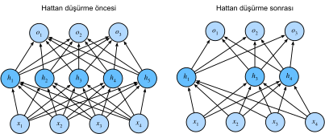

# Hattan Düş(ür)me
:label:`sec_dropout`

:numref:`sec_weight_decay` içinde, ağırlıkların $L_2$ normunu cezalandırarak istatistiksel modelleri düzenlileştirmek için klasik yaklaşımı tanıttık. Olasılıksal terimlerle, ağırlıkların ortalaması sıfır bir Gauss dağılımından değerler aldığına dair önsel bir inancı varsaydığımızı iddia ederek bu tekniği haklı gösterebiliriz. Daha sezgisel olarak, modeli, az sayıdaki muhtemel sahte ilişkilere çok fazla bağlı yapmak yerine, ağırlıklarını birçok özniteliğe dağıtmaya teşvik ettiğimizi iddia edebiliriz.

## Aşırı Öğrenmeye Tekrar Bakış

Örneklerden daha fazla öznitelikle karşı karşıya kalan doğrusal modeller, aşırı öğrenme eğilimindedir. Ancak özniteliklerden daha fazla örnek verildiğinde, genellikle doğrusal modellere aşırı öğrenmeme için güvenebiliriz. Ne yazık ki, doğrusal modellerin genelleştirildiği güvenilirliğin bir bedeli vardır. Naif olarak uygulanan doğrusal modeller, öznitelikler arasındaki etkileşimleri hesaba katmaz. Doğrusal bir model, her öznitelik için bağlamı yok sayarak pozitif veya negatif bir ağırlık atamalıdır.

Geleneksel metinlerde, genelleştirilebilirlik ve esneklik arasındaki bu temel gerilim, *yanlılık-değişinti ödünleşmesi (bias-variance tradeoff)* olarak tanımlanır. Doğrusal modeller yüksek yanlılığa sahiptir: Yalnızca küçük bir işlev sınıfını temsil edebilirler. Ancak bu modeller düşük varyansa sahiptirler: Verilerin farklı rastgele örneklemlerinde benzer sonuçlar verirler.

Derin sinir ağları, yanlılık-değişinti spektrumunun diğer ucunda bulunur. Doğrusal modellerin aksine, sinir ağları her özelliğe ayrı ayrı bakmakla sınırlı kalmazlar. Öznitelik grupları arasındaki etkileşimleri öğrenebilirler. Örneğin, bir e-postada birlikte görünen "Nijerya" ve "Western Union"nin yaramaz postayı (spam) gösterdiğini ancak ayrı ayrıyken göstermediklerini çıkarabilirler.

Özniteliklerden çok daha fazla örneğimiz olsa bile, derin sinir ağları gereğinden aşırı öğrenebilirler. 2017'de bir grup araştırmacı, rastgele etiketlenmiş imgeler üzerinde derin ağları eğiterek sinir ağlarının aşırı esnekliğini gösterdi. Girdileri çıktılara bağlayan herhangi bir gerçek model olmamasına rağmen, rasgele gradyan inişi tarafından optimize edilen sinir ağının eğitim kümesindeki her imgeyi mükemmel şekilde etiketleyebileceğini buldular.
Bunun ne anlama geldiğini bir düşünün. Etiketler rastgele atanırsa ve 10 sınıf varsa, hiçbir sınıflandırıcı harici tutulan verilerinde %10'den daha iyi doğruluk sağlayamaz. Buradaki genelleme açığı %90 gibi büyük bir oran. Modellerimiz bu seviye aşırı öğrenebilecek kadar ifade edici ise, o halde ne zaman aşırı öğrenmemelerini beklemeliyiz?

Derin ağların kafa karıştırıcı genelleme özelliklerinin matematiksel temelleri, açık araştırma soruları olmaya devam ediyor ve teori yönelimli okuyucuyu bu konuda daha derine inmeye teşvik ediyoruz. Şimdilik, derin ağların genelleştirilmesini deneysel olarak iyileştirme eğiliminde olan pratik araçların araştırmasına dönüyoruz.

## Düzensizliğe Gürbüzlük

İyi bir tahminci modelden ne beklediğimizi kısaca düşünelim. Görünmeyen veriler üzerinde iyi başarım göstermelerini istiyoruz. Klasik genelleme teorisi, eğitim ve test performansı arasındaki aralığı kapatmak için basit bir modeli hedeflememiz gerektiğini öne sürer. Sadelik, az sayıda boyut şeklinde olabilir. :numref:`sec_model_selection` içinde doğrusal modellerin tek terimli temel fonksiyonlarını tartışırken bunu araştırdık. Ek olarak, ağırlık sönümünü ($L_2$ düzenlileştirmesi) :numref:`sec_weight_decay` içinde tartışırken gördüğümüz gibi, parametrelerin (ters) normu, basitliğin de bir kullanışlı ölçüsünü temsil eder. Bir başka kullanışlı basitlik kavramı, pürüzsüzlüktür, yani işlevin girdilerindeki küçük değişikliklere hassas olmaması gerektiğidir. Örneğin, imgeleri sınıflandırdığımızda, piksellere bazı rastgele gürültü eklemenin çoğunlukla zararsız olmasını bekleriz.

1995'te Christopher Bishop, girdi gürültüsü ile eğitimin Tikhonov düzenlemesine eşdeğer olduğunu kanıtladığında bu fikri formüle döktü :cite:`Bishop.1995`. Bu çalışma, bir fonksiyonun düzgün (ve dolayısıyla basit) olması gerekliliği ile girdideki karışıklıklara dirençli olması gerekliliği arasında açık bir matematiksel bağlantı kurdu.

Ardından 2014 yılında Srivastava ve ark. :cite:`Srivastava.Hinton.Krizhevsky.ea.2014`, Bishop'un fikrinin bir ağın iç katmanlarına da nasıl uygulanacağı konusunda akıllıca bir fikir geliştirdi. Yani, eğitim sırasında sonraki katmanı hesaplamadan önce ağın her katmanına gürültü yerleştirmeyi önerdiler. Birçok katman içeren derin bir ağı eğitirken, gürültü yerleştirmenin sadece girdi-çıktı eşlemesinde pürüzsüzlüğü zorladığını fark ettiler.

*Hattan düşürme* olarak adlandırılan fikirleri, ileri yayılma sırasında her bir iç katmanı hesaplarken gürültü yerleştirmeyi içerir ve sinir ağlarını eğitmek için standart bir teknik haline gelmiştir. Bu yönteme *hattan düşürme* deniyor çünkü eğitim sırasında bazı nöronları tam anlamıyla *hattan düşürüyoruz*. Standart hattan düşürme eğitim boyunca, her yinelemede, sonraki katmanı hesaplamadan önce, her katmandaki düğümlerin bir kısmının sıfırlanmasından oluşur.

Açık olmak gerekirse, Bishop'la bağlantı kurarak kendi hikayemizi dayatıyoruz. Hattan düşürme ilgili orijinal makale, cinsel üreme ile şaşırtıcı bir benzetme yaparak bir önsezi sunuyor. Yazarlar, sinir ağının aşırı öğrenmesinin, her bir katmanın önceki katmandaki belirli bir etkinleştirme modeline dayandığı ve bu koşulu *birlikte-uyarlama* olarak adlandırdığı bir durumla karakterize edildiğini savunuyorlar. Onlar, tıpkı cinsel üremenin birlikte uyarlanmış genleri parçaladığının iddia edildiği gibi, hattan düşürmenin birlikte uyarlamayı bozduğunu iddia ediyorlar.

O halde asıl zorluk bu gürültünün nasıl yerleştirileceğidir. Bir fikir, gürültüyü *tarafsız* bir şekilde yerleştirmektir, böylece her katmanın beklenen değeri---diğerlerini sabitlerken---gürültü eksikken alacağı değere eşittir.

Bishop çalışmasında, doğrusal bir modelin girdilerine Gauss gürültüsünü ekledi. Her eğitim yinelemesinde, $\mathbf{x}$ girdisine ortalaması sıfır $\epsilon \sim \mathcal{N}(0,\sigma^2)$ bir dağılımdan örneklenen gürültü ekleyerek dürtülmüş bir $\mathbf{x}' = \mathbf{x} + \epsilon$ noktası elde etti. Beklenti değeri, $E[\mathbf{x}'] = \mathbf{x}$'dir.

Standart hattan düşürme düzenlileştirmesinde, bir kısmı tutulan (hattan düşürülmeyen) düğümlere göre normalleştirerek her katmanı yansızlaştırır. Diğer bir deyişle, *hattan düşürme olasılığı* $p$ ile, her bir ara $h$ etkinleştirmesi aşağıdaki gibi rastgele bir $h'$ değişkeni ile değiştirilir:

$$
\begin{aligned}
h' =
\begin{cases}
    0 & \text{ with probability } p \\
    \frac{h}{1-p} & \text{ otherwise}
\end{cases}
\end{aligned}
$$

Tasarım gereği, beklenti değişmeden kalır, yani $E[h'] = h$.

## Pratikte Hattan Düşürme

:numref:`fig_mlp` içindeki bir gizli katmanlı ve 5 gizli birimli MLP'yi hatırlayın. Hattan düşürmeyi gizli bir katmana uyguladığımızda, her gizli birimi $p$ olasılığı ile sıfırlarsak, sonuç, orijinal nöronların yalnızca bir alt kümesini içeren bir ağ olarak görülebilir. :numref:`fig_dropout2` içinde, $h_2$ ve $h_5$ kaldırılmıştır. Sonuç olarak, çıktıların hesaplaması artık $h_2$ veya $h_5$ değerlerine bağlı değildir ve bunların ilgili gradyanları da geri yayma gerçekleştirilirken kaybolur. Bu şekilde, çıktı katmanının hesaplanması, $h_1, \ldots, h_5$ öğelerinin herhangi birine aşırı derecede bağımlı olamaz.


:label:`fig_dropout2`

Tipik olarak, test sırasında hattan düşürmeyi devre dışı bırakırız. Eğitimli bir model ve yeni bir örnek verildiğinde, herhangi bir düğümü çıkarmıyoruz ve bu nedenle normalleştirmemize gerek yok. Bununla birlikte, bazı istisnalar vardır: Bazı araştırmacılar, sinir ağı tahminlerinin *belirsizliğini* tahmin etmek için sezgisel olarak test zamanında hattan düşürmeyi kullanır. Tahminler birçok farklı hattan düşürme maskesinde uyuşuyorsa, ağın daha güvenli olduğunu söyleyebiliriz.

## Sıfırdan Uygulama

Hattan düşürme işlevini tek bir katman için uygulamak için, katmanımızın boyutları olduğu için Bernoulli (ikili) rastgele değişkenden olabildiğince çok örneklem almalıyız, burada rastgele değişken $1-p$ olasılıkla $1$ (tut), $p$ olasılıkla $0$ (düşür) değerini alır. Bunu gerçekleştirmenin kolay bir yolu, ilk olarak $U[0, 1]$ tekdüze dağılımından örnekler almaktır. Daha sonra, $p$'den büyük olan düğümlere karşılık gelen örnekleri tutarak geri kalanı hattan düşürebiliriz.

Aşağıdaki kodda, (**`X` tensör girdisindeki öğeleri `hattan düşürme` olasılığı ile hattan düşüren ve kalanı yukarıda açıklandığı gibi yeniden ölçeklendiren bir `dropout_layer` işlevi uyguluyoruz**); kurtulanları `1.0-dropout` ile böleriz.

```{.python .input}
from d2l import mxnet as d2l
from mxnet import autograd, gluon, init, np, npx
from mxnet.gluon import nn
npx.set_np()

def dropout_layer(X, dropout):
    assert 0 <= dropout <= 1
    # Bu durumda tüm elemanlar düşürülür
    if dropout == 1:
        return np.zeros_like(X)
    # Bu durumda tüm elemanlar tutulur
    if dropout == 0:
        return X
    mask = np.random.uniform(0, 1, X.shape) > dropout
    return mask.astype(np.float32) * X / (1.0 - dropout)
```

```{.python .input}
#@tab pytorch
from d2l import torch as d2l
import torch
from torch import nn

def dropout_layer(X, dropout):
    assert 0 <= dropout <= 1
    # Bu durumda tüm elemanlar düşürülür
    if dropout == 1:
        return torch.zeros_like(X)
    # Bu durumda tüm elemanlar tutulur
    if dropout == 0:
        return X
    mask = (torch.rand(X.shape) > dropout).float()
    return mask * X / (1.0 - dropout)
```

```{.python .input}
#@tab tensorflow
from d2l import tensorflow as d2l
import tensorflow as tf

def dropout_layer(X, dropout):
    assert 0 <= dropout <= 1
    # Bu durumda tüm elemanlar düşürülür
    if dropout == 1:
        return tf.zeros_like(X)
    # Bu durumda tüm elemanlar tutulur
    if dropout == 0:
        return X
    mask = tf.random.uniform(
        shape=tf.shape(X), minval=0, maxval=1) < 1 - dropout
    return tf.cast(mask, dtype=tf.float32) * X / (1.0 - dropout)
```

[**`dropout_layer` fonksiyonunu birkaç örnek üzerinde test edebiliriz**]. Aşağıdaki kod satırlarında, `X` girdimizi sırasıyla 0, 0.5 ve 1 olasılıklarla hattan düşürme işleminden geçiriyoruz.

```{.python .input}
X = np.arange(16).reshape(2, 8)
print(dropout_layer(X, 0))
print(dropout_layer(X, 0.5))
print(dropout_layer(X, 1))
```

```{.python .input}
#@tab pytorch
X= torch.arange(16, dtype = torch.float32).reshape((2, 8))
print(X)
print(dropout_layer(X, 0.))
print(dropout_layer(X, 0.5))
print(dropout_layer(X, 1.))
```

```{.python .input}
#@tab tensorflow
X = tf.reshape(tf.range(16, dtype=tf.float32), (2, 8))
print(X)
print(dropout_layer(X, 0.))
print(dropout_layer(X, 0.5))
print(dropout_layer(X, 1.))
```

### Model Parametrelerini Tanımlama

Yine, :numref:`sec_fashion_mnist` içinde tanıtılan Fashion-MNIST veri kümesiyle çalışıyoruz. [**Her biri 256 çıktı içeren iki gizli katmana sahip bir MLP tanımlıyoruz.**]

```{.python .input}
num_inputs, num_outputs, num_hiddens1, num_hiddens2 = 784, 10, 256, 256

W1 = np.random.normal(scale=0.01, size=(num_inputs, num_hiddens1))
b1 = np.zeros(num_hiddens1)
W2 = np.random.normal(scale=0.01, size=(num_hiddens1, num_hiddens2))
b2 = np.zeros(num_hiddens2)
W3 = np.random.normal(scale=0.01, size=(num_hiddens2, num_outputs))
b3 = np.zeros(num_outputs)

params = [W1, b1, W2, b2, W3, b3]
for param in params:
    param.attach_grad()
```

```{.python .input}
#@tab pytorch
num_inputs, num_outputs, num_hiddens1, num_hiddens2 = 784, 10, 256, 256
```

```{.python .input}
#@tab tensorflow
num_outputs, num_hiddens1, num_hiddens2 = 10, 256, 256
```

### Modeli Tanımlama

Aşağıdaki model, her bir gizli katmanın çıktısına (etkinleştirme işlevini takiben) hattan düşürme uygular. Her katman için ayrı ayrı hattan düşürme olasılıkları belirleyebiliriz. Yaygın bir eğilim, girdi katmanına yakınken daha düşük bir hattan düşürme olasılığı ayarlamaktır. Aşağıda, birinci ve ikinci gizli katmanlar için onları sırasıyla 0.2 ve 0.5 olarak ayarladık. Hattan düşürmenin yalnızca eğitim sırasında etkin olmasını sağlıyoruz.

```{.python .input}
dropout1, dropout2 = 0.2, 0.5

def net(X):
    X = X.reshape(-1, num_inputs)
    H1 = npx.relu(np.dot(X, W1) + b1)
    # Hattan düşürmeyi yalnızca modeli eğitirken kullan
    if autograd.is_training():
        # İlk tamamen bağlı katmandan sonra bir hattan düşürme katmanı ekle
        H1 = dropout_layer(H1, dropout1)
    H2 = npx.relu(np.dot(H1, W2) + b2)
    if autograd.is_training():
        # İkinci tamamen bağlı katmandan sonra bir hattan düşürme katmanı ekle
        H2 = dropout_layer(H2, dropout2)
    return np.dot(H2, W3) + b3
```

```{.python .input}
#@tab pytorch
dropout1, dropout2 = 0.2, 0.5

class Net(nn.Module):
    def __init__(self, num_inputs, num_outputs, num_hiddens1, num_hiddens2,
                 is_training = True):
        super(Net, self).__init__()
        self.num_inputs = num_inputs
        self.training = is_training
        self.lin1 = nn.Linear(num_inputs, num_hiddens1)
        self.lin2 = nn.Linear(num_hiddens1, num_hiddens2)
        self.lin3 = nn.Linear(num_hiddens2, num_outputs)
        self.relu = nn.ReLU()

    def forward(self, X):
        H1 = self.relu(self.lin1(X.reshape((-1, self.num_inputs))))
        # Hattan düşürmeyi yalnızca modeli eğitirken kullan
        if self.training == True:
            #  İlk tamamen bağlı katmandan sonra bir hattan düşürme katmanı ekle
            H1 = dropout_layer(H1, dropout1)
        H2 = self.relu(self.lin2(H1))
        if self.training == True:
            # İkinci tamamen bağlı katmandan sonra bir hattan düşürme katmanı ekle
            H2 = dropout_layer(H2, dropout2)
        out = self.lin3(H2)
        return out


net = Net(num_inputs, num_outputs, num_hiddens1, num_hiddens2)
```

```{.python .input}
#@tab tensorflow
dropout1, dropout2 = 0.2, 0.5

class Net(tf.keras.Model):
    def __init__(self, num_outputs, num_hiddens1, num_hiddens2):
        super().__init__()
        self.input_layer = tf.keras.layers.Flatten()
        self.hidden1 = tf.keras.layers.Dense(num_hiddens1, activation='relu')
        self.hidden2 = tf.keras.layers.Dense(num_hiddens2, activation='relu')
        self.output_layer = tf.keras.layers.Dense(num_outputs)

    def call(self, inputs, training=None):
        x = self.input_layer(inputs)
        x = self.hidden1(x)
        if training:
            x = dropout_layer(x, dropout1)
        x = self.hidden2(x)
        if training:
            x = dropout_layer(x, dropout2)
        x = self.output_layer(x)
        return x

net = Net(num_outputs, num_hiddens1, num_hiddens2)
```

### [**Eğitim and Test Etme**]

Bu, daha önce açıklanan MLP eğitimine ve testine benzer.

```{.python .input}
num_epochs, lr, batch_size = 10, 0.5, 256
loss = gluon.loss.SoftmaxCrossEntropyLoss()
train_iter, test_iter = d2l.load_data_fashion_mnist(batch_size)
d2l.train_ch3(net, train_iter, test_iter, loss, num_epochs,
              lambda batch_size: d2l.sgd(params, lr, batch_size))
```

```{.python .input}
#@tab pytorch
num_epochs, lr, batch_size = 10, 0.5, 256
loss = nn.CrossEntropyLoss(reduction='none')
train_iter, test_iter = d2l.load_data_fashion_mnist(batch_size)
trainer = torch.optim.SGD(net.parameters(), lr=lr)
d2l.train_ch3(net, train_iter, test_iter, loss, num_epochs, trainer)
```

```{.python .input}
#@tab tensorflow
num_epochs, lr, batch_size = 10, 0.5, 256
loss = tf.keras.losses.SparseCategoricalCrossentropy(from_logits=True)
train_iter, test_iter = d2l.load_data_fashion_mnist(batch_size)
trainer = tf.keras.optimizers.SGD(learning_rate=lr)
d2l.train_ch3(net, train_iter, test_iter, loss, num_epochs, trainer)
```

## [**Kısa Uygulama**]

Üst düzey API'lerle, tek yapmamız gereken, her tam bağlı katmandan sonra bir `Dropout` katmanı eklemek ve hattan düşürme olasılığını kurucusuna tek argüman olarak aktarmaktır. Eğitim sırasında, `Dropout` katmanı, belirtilen hattan düşürme olasılığına göre önceki katmanın çıktılarını (veya eşdeğer olarak sonraki katmana olan girdileri) rasgele düşürür. Eğitim modunda olmadığında, `Dropout` katmanı verileri test sırasında basitçe iletir.

```{.python .input}
net = nn.Sequential()
net.add(nn.Dense(256, activation="relu"),
        # İlk tamamen bağlı katmandan sonra bir hattan düşürme katmanı ekle
        nn.Dropout(dropout1),
        nn.Dense(256, activation="relu"),
        # İkinci tamamen bağlı katmandan sonra bir hattan düşürme katmanı ekle
        nn.Dropout(dropout2),
        nn.Dense(10))
net.initialize(init.Normal(sigma=0.01))
```

```{.python .input}
#@tab pytorch
net = nn.Sequential(nn.Flatten(),
        nn.Linear(784, 256),
        nn.ReLU(),
        # İlk tamamen bağlı katmandan sonra bir hattan düşürme katmanı ekle
        nn.Dropout(dropout1),
        nn.Linear(256, 256),
        nn.ReLU(),
        # İkinci tamamen bağlı katmandan sonra bir hattan düşürme katmanı ekle
        nn.Dropout(dropout2),
        nn.Linear(256, 10))

def init_weights(m):
    if type(m) == nn.Linear:
        nn.init.normal_(m.weight, std=0.01)

net.apply(init_weights)
```

```{.python .input}
#@tab tensorflow
net = tf.keras.models.Sequential([
    tf.keras.layers.Flatten(),
    tf.keras.layers.Dense(256, activation=tf.nn.relu),
    # İlk tamamen bağlı katmandan sonra bir hattan düşürme katmanı ekle
    tf.keras.layers.Dropout(dropout1),
    tf.keras.layers.Dense(256, activation=tf.nn.relu),
    # İkinci tamamen bağlı katmandan sonra bir hattan düşürme katmanı ekle
    tf.keras.layers.Dropout(dropout2),
    tf.keras.layers.Dense(10),
])
```

Sonra, [**modeli eğitir ve test ederiz**].

```{.python .input}
trainer = gluon.Trainer(net.collect_params(), 'sgd', {'learning_rate': lr})
d2l.train_ch3(net, train_iter, test_iter, loss, num_epochs, trainer)
```

```{.python .input}
#@tab pytorch
trainer = torch.optim.SGD(net.parameters(), lr=lr)
d2l.train_ch3(net, train_iter, test_iter, loss, num_epochs, trainer)
```

```{.python .input}
#@tab tensorflow
trainer = tf.keras.optimizers.SGD(learning_rate=lr)
d2l.train_ch3(net, train_iter, test_iter, loss, num_epochs, trainer)
```

## Özet

* Boyutların sayısını ve ağırlık vektörünün boyutunu kontrol etmenin ötesinde, hattan düşürme, aşırı öğrenmeyi önlemek için başka bir araçtır. Genellikle birlikte kullanılırlar.
* Hattan düşürme, $h$ etkinleştirmesini, beklentisi $h$ değerine sahip rastgele bir değişken ile değiştirir.
* Hattan düşürme yalnızca eğitim sırasında kullanılır.

## Alıştırmalar

1. İlk ve ikinci katmanlar için hattan düşürme olasılıklarını değiştirirseniz ne olur? Özellikle, her iki katman için olanları yer değiştirirseniz ne olur? Bu soruları yanıtlamak için bir deney tasarlayınız, bulgularınızı nicel olarak açıklayınız ve nitel çıkarımları özetleyiniz.
1. Dönem sayısını arttırınız ve hattan düşürme kullanılırken elde edilen sonuçları kullanmadığınız zamanlarda elde ettikleriniz ile karşılaştırınız.
1. Hattan düşürme uygulandığında ve uygulanmadığında her bir gizli katmandaki etkinleştirmelerin varyansı nedir? Her iki model için de bu miktarın zaman içinde nasıl değiştiğini gösteren bir grafik çiziniz.
1. Hattan düşürme neden tipik olarak test zamanında kullanılmaz?
1. Bu bölümdeki modeli örnek olarak kullanarak, hattan düşürme ve ağırlık sönümünün etkilerini karşılaştırınız. Hattan düşürme ve ağırlık sönümü aynı anda kullanıldığında ne olur? Sonuçlar katkı sağlıyor mu? Azalan getiri mi (ya da daha kötüsü mü) var? Birbirlerini iptal ediyorlar mı?
1. Hattan düşürmeyi, etkinleştirmeler yerine ağırlık matrisinin bireysel ağırlıklarına uygularsak ne olur?
1. Her katmanda rastgele gürültü yerleştirmek için standart hattan düşürme tekniğinden farklı başka bir teknik bulunuz. Fashion-MNIST veri kümesinde (sabit bir mimari için) hattan düşürmeden daha iyi performans gösteren bir yöntem geliştirebilir misiniz?

:begin_tab:`mxnet`
[Tartışmalar](https://discuss.d2l.ai/t/100)
:end_tab:

:begin_tab:`pytorch`
[Tartışmalar](https://discuss.d2l.ai/t/101)
:end_tab:

:begin_tab:`tensorflow`
[Tartışmalar](https://discuss.d2l.ai/t/261)
:end_tab:
