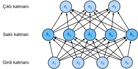

# Çok Katmanlı Algılayıcılar
:label:`sec_mlp`

:numref:`chap_linear` içinde, softmaks regresyonunu (:numref:`sec_softmax`), algoritmayı sıfırdan uygulayarak (:numref:`sec_softmax_scratch`) ve yüksek seviyeli API'leri (:numref:`sec_softmax_concise`) kullanarak ve düşük çözünürlüklü görsellerden 10 giysi kategorisini tanımak için sınıflandırıcıları eğiterek tanıttık. Yol boyunca, verileri nasıl karıştıracağımızı, çıktılarımızı geçerli bir olasılık dağılımına nasıl zorlayacağımızı, uygun bir kayıp fonksiyonunu nasıl uygulayacağımızı ve modelimizin parametrelerine göre onu nasıl en aza indireceğimizi öğrendik. Şimdi bu mekaniği basit doğrusal modeller bağlamında öğrendiğimize göre, bu kitabın öncelikli olarak ilgilendiği nispeten zengin modeller sınıfı olan derin sinir ağlarını keşfetmeye başlayabiliriz.


## Gizli Katmanlar

:numref:`subsec_linear_model` içinde, bir ek girdi eklenen doğrusal bir dönüşüm olan afin dönüşümünü tanımladık. Başlangıç olarak,  :numref:`fig_softmaxreg` içinde gösterilen softmaks regresyon örneğimize karşılık gelen model mimarisini hatırlayalım. Bu model, girdilerimizi tek bir afin dönüşüm ve ardından bir softmaks işlemi aracılığıyla doğrudan çıktılarımıza eşledi. Etiketlerimiz gerçekten bir afin dönüşüm yoluyla girdi verilerimizle ilişkili olsaydı, bu yaklaşım yeterli olurdu. Ancak afin dönüşümlerdeki doğrusallık *güçlü* bir varsayımdır.


### Doğrusal Modeller Ters Gidebilir

Örneğin, doğrusallık *daha zayıf* *monotonluk* varsayımını ifade eder: Özniteliğimizdeki herhangi bir artışın ya modelimizin çıktısında her zaman bir artışa (karşılık gelen ağırlık pozitifse) ya da modelimizin çıktısında her zaman bir düşüşe neden olmasını gerektirmesi (karşılık gelen ağırlık negatifse). Genelde bu mantıklı gelir. Örneğin, bir bireyin bir krediyi geri ödeyip ödemeyeceğini tahmin etmeye çalışıyor olsaydık, makul olarak ve her şeyi eşit tutarak, daha yüksek gelire sahip bir başvuru sahibinin, daha düşük gelirli bir başvuru sahibine göre geri ödeme olasılığının her zaman daha yüksek olacağını hayal edebilirdik. Monoton olsa da, bu ilişki muhtemelen geri ödeme olasılığıyla doğrusal olarak ilişkili değildir. Gelirdeki 0'dan 50 bine bir artış, geri ödeme olabilirliğinde kapsamında gelirdeki 1 milyondan 1.05 milyona artıştan daha büyük bir artmaya karşılık gelir. Bunu halletmenin bir yolu, verilerimizi, örneğin özniteliğimiz olan gelirin logaritmasını kullanarak doğrusallığın daha makul hale geleceği şekilde, önceden işlemek olabilir.

Monotonluğu ihlal eden örnekleri kolayca bulabileceğimizi unutmayın. Örneğin, vücut ısısına bağlı olarak ölüm olasılığını tahmin etmek istediğimizi varsayalım. Vücut ısısı 37°C'nin (98.6°F) üzerinde olan kişiler için, daha yüksek sıcaklıklar daha büyük riski gösterir. Bununla birlikte, vücut ısısı 37°C'nin altında olan kişiler için, daha yüksek sıcaklıklar daha düşük riski gösterir! Bu durumda da sorunu akıllıca bir ön işlemle çözebiliriz. Yani 37°C'den uzaklığı özniteliğimiz olarak kullanabiliriz.

Peki ya kedi ve köpeklerin imgelerini sınıflandırmaya ne dersiniz? (13, 17) konumundaki pikselin yoğunluğunu artırmak, imgenin bir köpeği tasvir etme olabilirliğini her zaman artırmalı mı (yoksa her zaman azaltmalı mı)? Doğrusal bir modele güvenmek, kedileri ve köpekleri ayırt etmek için tek gerekliliğin tek tek piksellerin parlaklığını değerlendirmek olduğu şeklindeki örtülü varsayıma karşılık gelir. Bu yaklaşım, bir imgenin tersine çevrilmesinin kategoriyi koruduğu bir dünyada başarısızlığa mahkumdur.

Yine de, burada doğrusallığın aşikar saçmalığına rağmen, önceki örneklerimizle karşılaştırıldığında, sorunu basit bir ön işleme düzeltmesiyle çözebileceğimiz daha az açıktır. Bunun nedeni, herhangi bir pikselin anlamının karmaşık yollarla bağlamına (çevreleyen piksellerin değerlerine) bağlı olmasıdır. Verilerimizin özniteliklerimiz arasındaki ilgili etkileşimleri hesaba katan bir temsili olabilir, bunun üzerine doğrusal bir model uygun olabilir, ancak biz bunu elle nasıl hesaplayacağımızı bilmiyoruz. Derin sinir ağlarıyla, hem gizli katmanlar aracılığıyla bir gösterimi hem de bu gösterim üzerinde işlem yapan doğrusal bir tahminciyi birlikte öğrenmek için gözlemsel verileri kullandık.


### Gizli Katmanları Birleştirme

Doğrusal modellerin bu sınırlamalarının üstesinden gelebiliriz ve bir veya daha fazla gizli katman ekleyerek daha genel işlev sınıflarıyla başa çıkabiliriz. Bunu yapmanın en kolay yolu, tam bağlı birçok katmanı birbirinin üzerine yığmaktır. Her katman, biz çıktılar üretene kadar üstündeki katmana beslenir. İlk $L-1$ katmanı temsilimiz ve son katmanı da doğrusal tahmincimiz olarak düşünebiliriz. Bu mimariye genellikle *çok katmanlı algılayıcı (multilayer perceptron)* denir ve genellikle *MLP* olarak kısaltılır. Aşağıda, bir MLP'yi şematik olarak tasvir ediyoruz (:numref:`fig_mlp`).


:label:`fig_mlp`

Bu MLP'nin 4 girdisi, 3 çıktısı vardır ve gizli katmanı 5 gizli birim içerir. Girdi katmanı herhangi bir hesaplama içermediğinden, bu ağ ile çıktıların üretilmesi hem gizli hem de çıktı katmanları için hesaplamaların gerçekleştirilmesini gerektirir; dolayısıyla, bu MLP'deki katman sayısı 2'dir. Bu katmanların her ikisinin de tam bağlı olduğuna dikkat edin. Her girdi, gizli katmandaki her nöronu etkiler ve bunların her biri de çıktı katmanındaki her nöronu etkiler.
Ancak, :numref:`subsec_parameterization-cost-fc-layers` içinde önerildiği gibi, tam bağlı katmanlara sahip MLP'lerin parametreleştirme maliyeti
girdi veya çıktı boyutunu değiştirmeden bile parametre tasarrufu ve model etkinliği arasındaki ödünleşimi motive edebilecek şekilde yüksek olabilir :cite:`Zhang.Tay.Zhang.ea.2021`.

### Doğrusaldan Doğrusal Olmayana

Daha önce olduğu gibi, $\mathbf{X} \in \mathbb{R}^{n \times d}$ matrisiyle, her örneğin $d$ girdisine (öznitelikler) sahip olduğu $n$ örneklerden oluşan bir minigrubu gösteriyoruz. Gizli katmanı $h$ gizli birimlere sahip olan tek gizli katmanlı bir MLP için, gizli katmanın çıktılarını, ki bunlar *gizli gösterimler*dir, $\mathbf{H} \in \mathbb{R}^{n \times h}$ ile belirtelim. Matematikte ve kodlamada, $\mathbf{H}$ aynı zamanda *gizli katman değişkeni* veya *gizli değişken* olarak da bilinir. Gizli ve çıktı katmanlarının her ikisi de tam bağlı olduğundan, $\mathbf{W}^{(1)} \in \mathbb{R}^{d \times h}$ ve  $\mathbf{b}^{(1)} \in \mathbb{R}^{1 \times h}$ içinde sırasıyla gizli katman ağırlıkları ve ek girdileri, $\mathbf{W}^{(2)} \in \mathbb{R}^{h \times q}$ ve $\mathbf{b}^{(2)} \in \mathbb{R}^{1 \times q}$ içinde de çıktı katmanı ağırlıkları ve ek girdileri var. Biçimsel olarak, tek gizli katmanlı MLP'nin $\mathbf{O} \in \mathbb{R}^{n \times q}$ çıktılarını şu şekilde hesaplarız:


$$
\begin{aligned}
    \mathbf{H} & = \mathbf{X} \mathbf{W}^{(1)} + \mathbf{b}^{(1)}, \\
    \mathbf{O} & = \mathbf{H}\mathbf{W}^{(2)} + \mathbf{b}^{(2)}.
\end{aligned}
$$

Gizli katmanı ekledikten sonra, modelimizin artık ek parametre kümelerini izlememizi ve güncellememizi gerektirdiğini unutmayın. Peki karşılığında ne kazandık? Yukarıda tanımlanan modelde *sorunlarımız için hiçbir şey kazanmadığımızı* öğrenmek sizi şaşırtabilir! Nedeni açık. Yukarıdaki gizli birimler, girdilerin bir afin işlevi tarafından verilir ve çıktılar (softmaks-öncesi), gizli birimlerin yalnızca bir afin işlevidir. Bir afin fonksiyonun afin fonksiyonu, kendi başına bir afin fonksiyonudur. Dahası, doğrusal modelimiz zaten herhangi bir afin işlevi temsil edebiliyordu.

Ağırlıkların herhangi bir değeri için gizli katmanı daraltarak parametrelerle eşdeğer bir tek katmanlı model oluşturabileceğimizi kanıtlayarak eşdeğerliği biçimsel olarak görebiliriz,
$\mathbf{W} = \mathbf{W}^{(1)}\mathbf{W}^{(2)}$ and $\mathbf{b} = \mathbf{b}^{(1)} \mathbf{W}^{(2)} + \mathbf{b}^{(2)}$:

$$
\mathbf{O} = (\mathbf{X} \mathbf{W}^{(1)} + \mathbf{b}^{(1)})\mathbf{W}^{(2)} + \mathbf{b}^{(2)} = \mathbf{X} \mathbf{W}^{(1)}\mathbf{W}^{(2)} + \mathbf{b}^{(1)} \mathbf{W}^{(2)} + \mathbf{b}^{(2)} = \mathbf{X} \mathbf{W} + \mathbf{b}.
$$

Çok katmanlı mimarilerin potansiyelini gerçekleştirmek için, bir anahtar bileşene daha ihtiyacımız var: Afin dönüşümün ardından her gizli birime uygulanacak doğrusal olmayan $\sigma$ *etkinleştirme (aktivasyon) fonksiyonu*. Etkinleştirme fonksiyonlarının çıktılarına (örn. $\sigma(\cdot)$) etkinleştirmeler denir.
Genel olarak, etkinleştirme işlevleri yürürlükte olduğunda, MLP'mizi doğrusal bir modele indirgemek artık mümkün değildir:

$$
\begin{aligned}
    \mathbf{H} & = \sigma(\mathbf{X} \mathbf{W}^{(1)} + \mathbf{b}^{(1)}), \\
    \mathbf{O} & = \mathbf{H}\mathbf{W}^{(2)} + \mathbf{b}^{(2)}.\\
\end{aligned}
$$

$\mathbf{X}$ içindeki her satır, minigruptaki bir örneğe karşılık geldiğinden, birazcık gösterimi kötüye kullanarak, $\sigma$ doğrusal olmama durumunu kendi girdilerine satır yönlü, yani her seferinde bir örnek olarak uygulanacak şekilde tanımlarız. Softmaks için gösterimi, aynı şekilde, numref:`subsec_softmax_vectorization` içindeki gibi bir satırsal işlemi belirtmek için kullandığımıza dikkat edin. Çoğu zaman, bu bölümde olduğu gibi, gizli katmanlara uyguladığımız etkinleştirme işlevleri yalnızca satır bazında değil, bazen eleman yönlüdür. Bu, katmanın doğrusal bölümünü hesapladıktan sonra, diğer gizli birimler tarafından alınan değerlere bakmadan her bir etkinleştirmeyi hesaplayabileceğimiz anlamına gelir. Bu, çoğu etkinleştirme işlevi için geçerlidir.

Daha genel MLP'ler oluşturmak için, bu tür gizli katmanı yığmaya devam edebiliriz, örneğin, $\mathbf{H}^{(1)} = \sigma_1(\mathbf{X} \mathbf{W}^{(1)} + \mathbf{b}^{(1)})$
ve $\mathbf{H}^{(2)} = \sigma_2(\mathbf{H}^{(1)} \mathbf{W}^{(2)} + \mathbf{b}^{(2)})$, birbiri ardına, her zamankinden daha kuvvetli ifade edici modeller üretiyor.

### Evrensel Yaklaşımlar

MLP'ler, girdilerin her birinin değerine bağlı olan gizli nöronları aracılığıyla girdilerimiz arasındaki karmaşık etkileşimleri yakalayabilir. Örneğin, bir çift girdi üzerinde temel mantık işlemleri gibi rastgele hesaplamalar için kolayca gizli düğümler tasarlayabiliriz. Dahası, etkinleştirme fonksiyonunun belli seçimleri için MLP'lerin evrensel yaklaşımcılar olduğu yaygın olarak bilinmektedir. Yeterli düğüm (muhtemelen saçma bir şekilde çok) ve doğru ağırlık kümesi verilen tek gizli katmanlı bir ağla bile, aslında o işlevi öğrenmek zor olan kısım olsa da, herhangi bir işlevi modelleyebiliriz. Sinir ağınızı biraz C programlama dili gibi düşünebilirsiniz. Dil, diğer herhangi bir modern dil gibi, herhangi bir hesaplanabilir programı ifade etme yeteneğine sahiptir. Ama aslında sizin şartnamenizi karşılayan bir program bulmak zor kısımdır.

Dahası, tek gizli katmanlı bir ağın *herhangi bir işlevi öğrenebilmesi*, tüm problemlerinizi tek gizli katmanlı ağlarla çözmeye çalışmanız gerektiği anlamına gelmez. Aslında, daha derin (daha genişe kıyasla) ağları kullanarak birçok işlevi çok daha öz bir şekilde tahmin edebiliriz. Sonraki bölümlerde daha sıkı tartışmalara gireceğiz.

## Etkinleştirme Fonksiyonları
:label:`subsec_activation-functions`

Etkinleştirme fonksiyonları, ağırlıklı toplamı hesaplayarak ve buna ek girdi ekleyerek bir nöronun aktive edilip edilmeyeceğine karar verir. Bunlar girdi sinyallerini çıktılara dönüştürmek için türevlenebilir operatörlerdir ve çoğu doğrusal olmayanlık ekler. Etkinleştirme fonksiyonları derin öğrenme için temel olduğundan, (**bazı genel etkinleştirme fonksiyonlarını kısaca inceleyelim**).

```{.python .input}
%matplotlib inline
from d2l import mxnet as d2l
from mxnet import autograd, np, npx
npx.set_np()
```

```{.python .input}
#@tab pytorch
%matplotlib inline
from d2l import torch as d2l
import torch
```

```{.python .input}
#@tab tensorflow
%matplotlib inline
from d2l import tensorflow as d2l
import tensorflow as tf
```

### ReLU İşlevi

Hem uygulamanın basitliği hem de çeşitli tahminci görevlerdeki iyi performansı nedeniyle en popüler seçenek, *düzeltilmiş doğrusal birimdir* (*ReLU*). [**ReLU, çok basit doğrusal olmayan bir dönüşüm sağlar**]. $x$ öğesi verildiğinde, işlev o öğenin ve $0$'ın maksimum değeri olarak tanımlanır:

$$\operatorname{ReLU}(x) = \max(x, 0).$$

ReLU işlevi tabiri caizse yalnızca pozitif öğeleri tutar ve karşılık gelen etkinleştirmeleri 0'a ayarlayarak tüm negatif öğeleri atar. Biraz önsezi kazanmak için bu işlevi çizebiliriz. Gördüğünüz gibi, aktivasyon fonksiyonu parçalı doğrusaldır.

```{.python .input}
x = np.arange(-8.0, 8.0, 0.1)
x.attach_grad()
with autograd.record():
    y = npx.relu(x)
d2l.plot(x, y, 'x', 'relu(x)', figsize=(5, 2.5))
```

```{.python .input}
#@tab pytorch
x = torch.arange(-8.0, 8.0, 0.1, requires_grad=True)
y = torch.relu(x)
d2l.plot(x.detach(), y.detach(), 'x', 'relu(x)', figsize=(5, 2.5))
```

```{.python .input}
#@tab tensorflow
x = tf.Variable(tf.range(-8.0, 8.0, 0.1), dtype=tf.float32)
y = tf.nn.relu(x)
d2l.plot(x.numpy(), y.numpy(), 'x', 'relu(x)', figsize=(5, 2.5))
```

Girdi negatif olduğunda, ReLU fonksiyonunun türevi 0'dır ve girdi pozitif olduğunda ReLU fonksiyonunun türevi 1'dir. Girdi tam olarak 0'a eşit değer aldığında ReLU fonksiyonunun türevlenemeyeceğine dikkat edin. Bu durumlarda, sol taraftaki türevi varsayılan olarak kullanırız ve girdi 0 olduğunda türevin 0 olduğunu söyleriz. Bundan sıyırabiliriz çünkü girdi aslında sıfır olmayabilir. Eski bir özdeyiş vardır, eğer ince sınır koşulları önemliyse, muhtemelen mühendislik değil (*gerçek*) matematik yapıyoruz. Bu geleneksel bilgelik burada geçerli olabilir. Aşağıda ReLU fonksiyonunun türevini çiziyoruz.

```{.python .input}
y.backward()
d2l.plot(x, x.grad, 'x', 'relu gradyani', figsize=(5, 2.5))
```

```{.python .input}
#@tab pytorch
y.backward(torch.ones_like(x), retain_graph=True)
d2l.plot(x.detach(), x.grad, 'x', 'relu gradyani', figsize=(5, 2.5))
```

```{.python .input}
#@tab tensorflow
with tf.GradientTape() as t:
    y = tf.nn.relu(x)
d2l.plot(x.numpy(), t.gradient(y, x).numpy(), 'x', 'relu gradyani',
         figsize=(5, 2.5))
```

ReLU kullanmanın nedeni, türevlerinin özellikle makul davranmasıdır: Ya kaybolurlar ya da sadece argümanın geçmesine izin verirler. Bu, optimizasyonun daha iyi davranmasını sağlar ve sinir ağlarının önceki sürümlerinin belalısı bilindik gradyanların kaybolması sorununu hafifletir (bu konu hakkında daha sonra tartışacağız).

*Parametreleştirilmiş ReLU* (*pReLU*) işlevi dahil olmak üzere ReLU işlevinin birçok çeşidi olduğunu unutmayın :cite:`He.Zhang.Ren.ea.2015`. Bu sürüm, ReLU'ya doğrusal bir terim ekler, bu nedenle, argüman negatif olsa bile biraz bilgi yine de geçer:

$$\operatorname{pReLU}(x) = \max(0, x) + \alpha \min(0, x).$$

### Sigmoid İşlevi

[***Sigmoid işlevi*, değerleri $\mathbb{R}$ alanında bulunan girdileri (0, 1) aralığındaki çıktılara dönüştürür**]. Bu nedenle, sigmoid genellikle *sıkıştırma işlevi* olarak adlandırılır: (-sonsuz, sonsuz) aralığındaki herhangi bir girdiyi (0, 1) aralığındaki bir değere sıkıştırır:

$$\operatorname{sigmoid}(x) = \frac{1}{1 + \exp(-x)}.$$

İlk sinir ağlarında, bilim adamları ya *ateşleyen* ya da *ateşlemeyen* biyolojik nöronları modellemekle ilgileniyorlardı. Böylece, yapay nöronun mucitleri McCulloch ve Pitts'e kadar uzanan bu alanın öncüleri, eşikleme birimlerine odaklandılar. Bir eşikleme aktivasyonu, girdisi herhangi bir eşiğin altında olduğunda 0 değerini ve girdi eşiği aştığında 1 değerini alır.

Dikkat gradyan tabanlı öğrenmeye kaydırıldığında, sigmoid işlevi doğal bir seçimdi çünkü bir eşikleme birimine yumuşak, türevlenebilir bir yaklaşımdır. Sigmoidler, çıktıları ikili sınıflandırma problemleri için olasılıklar olarak yorumlamak istediğimizde (sigmoidi softmaksın özel bir durumu olarak düşünebilirsiniz), çıktı birimlerinde etkinleştirme fonksiyonları olarak hala yaygın olarak kullanılmaktadır. Bununla birlikte, çoğu kullanımda gizli katmanlarda sigmoid çoğunlukla daha basit ve daha kolay eğitilebilir ReLU ile değiştirilmiştir. Yinelemeli sinir ağlarıyla ilgili bölümlerde, zaman içinde bilgi akışını kontrol etmek için sigmoid birimlerinden yararlanan mimarilere değineceğiz.

Aşağıda sigmoid fonksiyonunu çiziyoruz. Girdi 0'a yakın olduğunda, sigmoid fonksiyonunun doğrusal bir dönüşüme yaklaştığını unutmayın.

```{.python .input}
with autograd.record():
    y = npx.sigmoid(x)
d2l.plot(x, y, 'x', 'sigmoid(x)', figsize=(5, 2.5))
```

```{.python .input}
#@tab pytorch
y = torch.sigmoid(x)
d2l.plot(x.detach(), y.detach(), 'x', 'sigmoid(x)', figsize=(5, 2.5))
```

```{.python .input}
#@tab tensorflow
y = tf.nn.sigmoid(x)
d2l.plot(x.numpy(), y.numpy(), 'x', 'sigmoid(x)', figsize=(5, 2.5))
```

Sigmoid fonksiyonunun türevi aşağıdaki denklemde verilmiştir:

$$\frac{d}{dx} \operatorname{sigmoid}(x) = \frac{\exp(-x)}{(1 + \exp(-x))^2} = \operatorname{sigmoid}(x)\left(1-\operatorname{sigmoid}(x)\right).$$

Sigmoid fonksiyonunun türevi aşağıda çizilmiştir. Girdi 0 olduğunda, sigmoid fonksiyonunun türevinin maksimum 0.25'e ulaştığını fark edin. Girdi her iki yönde de 0'dan uzaklaştıkça, türev 0'a yaklaşır.

```{.python .input}
y.backward()
d2l.plot(x, x.grad, 'x', 'sigmoid gradyani', figsize=(5, 2.5))
```

```{.python .input}
#@tab pytorch
# Clear out previous gradients
x.grad.data.zero_()
y.backward(torch.ones_like(x),retain_graph=True)
d2l.plot(x.detach(), x.grad, 'x', 'sigmoid gradyani', figsize=(5, 2.5))
```

```{.python .input}
#@tab tensorflow
with tf.GradientTape() as t:
    y = tf.nn.sigmoid(x)
d2l.plot(x.numpy(), t.gradient(y, x).numpy(), 'x', 'sigmoid gradyani',
         figsize=(5, 2.5))
```

### Tanh İşlevi

Sigmoid işlevi gibi, [**tanh (hiperbolik tanjant) işlevi de girdilerini sıkıştırarak**] (**-1 ile 1**) aralığındaki öğelere dönüştürür:

$$\operatorname{tanh}(x) = \frac{1 - \exp(-2x)}{1 + \exp(-2x)}.$$

Tanh fonksiyonunu aşağıda çiziyoruz. Girdi 0'a yaklaştıkça tanh fonksiyonunun doğrusal bir dönüşüme yaklaştığına dikkat edin. Fonksiyonun şekli sigmoid fonksiyonuna benzer olmasına rağmen, tanh fonksiyonu koordinat sisteminin orijinine göre nokta simetrisi sergiler.

```{.python .input}
with autograd.record():
    y = np.tanh(x)
d2l.plot(x, y, 'x', 'tanh(x)', figsize=(5, 2.5))
```

```{.python .input}
#@tab pytorch
y = torch.tanh(x)
d2l.plot(x.detach(), y.detach(), 'x', 'tanh(x)', figsize=(5, 2.5))
```

```{.python .input}
#@tab tensorflow
y = tf.nn.tanh(x)
d2l.plot(x.numpy(), y.numpy(), 'x', 'tanh(x)', figsize=(5, 2.5))
```

Tanh fonksiyonunun türevi şöyledir:

$$\frac{d}{dx} \operatorname{tanh}(x) = 1 - \operatorname{tanh}^2(x).$$

Tanh fonksiyonunun türevi aşağıda çizilmiştir. Girdi 0'a yaklaştıkça, tanh fonksiyonunun türevi maksimum 1'e yaklaşır. Sigmoid fonksiyonunda gördüğümüz gibi, girdi her iki yönde de 0'dan uzaklaştıkça, tanh fonksiyonunun türevi 0'a yaklaşır.

```{.python .input}
y.backward()
d2l.plot(x, x.grad, 'x', 'tanh gradyani', figsize=(5, 2.5))
```

```{.python .input}
#@tab pytorch
# Clear out previous gradients.
x.grad.data.zero_()
y.backward(torch.ones_like(x),retain_graph=True)
d2l.plot(x.detach(), x.grad, 'x', 'tanh gradyani', figsize=(5, 2.5))
```

```{.python .input}
#@tab tensorflow
with tf.GradientTape() as t:
    y = tf.nn.tanh(x)
d2l.plot(x.numpy(), t.gradient(y, x).numpy(), 'x', 'tanh gradyani',
         figsize=(5, 2.5))
```

Özetle, artık etkileyici çok katmanlı sinir ağı mimarileri oluşturmak için doğrusal olmayanlıkları nasıl birleştireceğimizi biliyoruz. Bir ek bilgi olarak, bilginiz sizi zaten 1990 civarında bir uygulayıcıya benzer bir araç setinin yönetebilmenizi sağlamaktadir. Bazı yönlerden, 1990'larda çalışan herhangi birine göre bir avantajınız var, çünkü sadece birkaç satır kod kullanarak hızlı modeller oluşturmak için güçlü açık kaynaklı derin öğrenme çerçevelerinden yararlanabilirsiniz. Daha önce, bu ağları eğitmek, araştırmacıların binlerce C ve Fortran satırını kodlamasını gerektiriyordu.

## Özet

* MLP, çıktı ve girdi katmanları arasına bir veya birden fazla tam bağlı gizli katman ekler ve gizli katmanın çıktısını bir etkinleştirme işlevi aracılığıyla dönüştürür.
* Yaygın olarak kullanılan etkinleştirme işlevleri arasında ReLU işlevi, sigmoid işlevi ve tanh işlevi bulunur.

## Alıştırmalar

1. pReLU etkinleştirme fonksiyonunun türevini hesaplayın.
1. Yalnızca ReLU (veya pReLU) kullanan bir MLP'nin sürekli bir parçalı doğrusal fonksiyon oluşturduğunu gösterin.
1. $\operatorname{tanh}(x) + 1 = 2 \operatorname{sigmoid}(2x)$ olduğunu gösterin.
1. Bir seferde bir minigruba uygulanan bir doğrusal olmayanlık durumumuz olduğunu varsayalım. Bunun ne tür sorunlara neden olmasını beklersiniz?

:begin_tab:`mxnet`
[Tartışmalar](https://discuss.d2l.ai/t/90)
:end_tab:

:begin_tab:`pytorch`
[Tartışmalar](https://discuss.d2l.ai/t/91)
:end_tab:

:begin_tab:`tensorflow`
[Tartışmalar](https://discuss.d2l.ai/t/226)
:end_tab:
