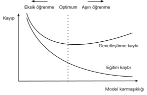

# Model Seçimi, Eksik Öğrenme ve Aşırı Öğrenme
:label:`sec_model_selection`

Makine öğrenmesi bilimcileri olarak amacımız *desenleri* keşfetmektir. Ancak, verilerimizi ezberlemeden, gerçekten *genel* bir model keşfettiğimizden nasıl emin olabiliriz? Örneğin, hastaları kişilik bölünmesi durumlarına bağlayan genetik belirteçler arasında desenler aramak istediğimizi hayal edin, etiketler de $\{\text{kişilik bölünmesi}, \text{hafif bilişsel bozukluk}, \text{sağlıklı}\}$ kümesinden çekilsin. Her kişinin genleri onları benzersiz bir şekilde tanımladığından (tek yumurta kardeşleri göz ardı ederek), tüm veri kümesini ezberlemek mümkündür.

Modelimizin *"Bu Bob! Onu hatırlıyorum! Kişilik bölünmesi var!"* demesini istemeyiz. Nedeni basit. Modeli ileride uyguladığımızda, modelimizin daha önce hiç görmediği hastalarla karşılaşacağız. Bizim tahminlerimiz yalnızca modelimiz gerçekten *genel* bir desen keşfetmişse yararlı olacaktır.

Daha biçimsel bir şekilde özetlersek, hedefimiz eğitim kümemizin alındığı temel popülasyondaki düzenlilikleri yakalayan desenleri keşfetmektir. Bu çabada başarılı olursak, daha önce hiç karşılaşmadığımız bireyler için bile riski başarıyla değerlendirebiliriz. Bu problem---desenlerin nasıl keşfedileceği *genelleştirmek*---makine öğrenmesinin temel problemidir.

Tehlike şu ki, modelleri eğitirken, sadece küçük bir veri örneklemine erişiyoruz. En büyük herkese açık görsel veri kümeleri yaklaşık bir milyon imge içermektedir. Daha sıklıkla, yalnızca binlerce veya on binlerce veri örneğinden öğrenmemiz gerekir. Büyük bir hastane sisteminde yüzbinlerce tıbbi kayda erişebiliriz. Sonlu örneklemlerle çalışırken, daha fazla veri topladığımızda tutmayacağı ortaya çıkan aşikar ilişkilendirmeler keşfetme riskiyle karşı karşıyayız.

Eğitim verilerimizi altta yatan dağılıma uyduğundan daha yakına uydurma olgusuna *aşırı öğrenme* ve aşırı öğrenmeyle mücadele için kullanılan tekniklere *düzenlileştirme* denir. Önceki bölümlerde, Fashion-MNIST veri kümesinde deney yaparken bu etkiyi gözlemlemiş olabilirsiniz. Deney sırasında model yapısını veya hiper parametreleri değiştirseydiniz, yeterli sayıda nöron, katman ve eğitim dönemiyle modelin, test verilerinde doğruluk kötüleşse bile, eğitim kümesinde en sonunda mükemmel doğruluğa ulaşabileceğini fark etmiş olabilirsiniz.


## Eğitim Hatası ve Genelleme Hatası

Bu olguyu daha biçimsel olarak tartışmak için, eğitim hatası ve genelleme hatası arasında ayrım yapmamız gerekir. *Eğitim hatası*, eğitim veri kümesinde hesaplanan modelimizin hatasıdır, *genelleme hatası* ise eğer onu esas örneklemimiz ile aynı temel veri dağılımından alınan sonsuz bir ek veri örneği akışına uygularsak modelimizin göstereceği hatanın beklentisidir.

Sorunsal olarak, genelleme hatasını tam olarak hesaplayamayız. Bunun nedeni, sonsuz veri akışının hayali bir nesne olmasıdır. Uygulamada, modelimizi eğitim kümemizden rastgele seçilmiş veri örneklerinden oluşan bağımsız bir test kümesine uygulayarak genelleme hatasını *tahmin etmeliyiz*.

Aşağıdaki üç düşünce deneyi bu durumu daha iyi açıklamaya yardımcı olacaktır. Final sınavına hazırlanmaya çalışan bir üniversite öğrencisini düşünün. Çalışkan bir öğrenci, önceki yılların sınavlarını kullanarak iyi pratik yapmaya ve yeteneklerini test etmeye çalışacaktır. Bununla birlikte, geçmiş sınavlarda başarılı olmak, gerekli olduğunda başarılı olacağının garantisi değildir. Örneğin, öğrenci sınav sorularının cevaplarını ezberleyerek hazırlanmaya çalışabilir. Bu, öğrencinin birçok şeyi ezberlemesini gerektirir. Hatta geçmiş sınavların cevaplarını da mükemmel bir şekilde hatırlayabilir. Başka bir öğrenci, belirli cevapları vermenin nedenlerini anlamaya çalışarak hazırlanabilir. Çoğu durumda, ikinci öğrenci çok daha iyisini yapacaktır.

Benzer şekilde, soruları yanıtlamak için sadece bir arama tablosu kullanan bir model düşünün. İzin verilen girdiler kümesi ayrık ve makul ölçüde küçükse, o zaman belki *birçok* eğitim örneğini gördükten sonra, bu yaklaşım iyi sonuç verecektir. Yine de bu modelin, daha önce hiç görmediği örneklerle karşılaştığında rastgele tahmin etmekten daha iyisini yapma yeteneği yoktur. Gerçekte, girdi uzayları, akla gelebilecek her girdiye karşılık gelen yanıtları ezberlemek için çok büyüktür. Örneğin, $28\times28$'lik siyah beyaz imgeleri düşünün. Her piksel $256$ gri tonlama değerlerinden birini alabiliyorsa, $256^{784}$ olası imge vardır. Bu, evrendeki atomlardan çok daha fazla sayıda, düşük çözünürlüklü gri tonlamalı küçük boyutlu imge olduğu anlamına gelir. Bu tür verilerle karşılaşsak bile, arama tablosunu asla saklayamayız.

Son olarak, yazı tura atmaların sonuçlarını (sınıf 0: tura, sınıf 1: yazı) mevcut olabilecek bazı bağlamsal özniteliklere göre sınıflandırmaya çalışma problemini düşünün. Paranın hilesiz olduğunu varsayalım. Hangi algoritmayı bulursak bulalım, genelleme hatası her zaman $\frac{1}{2}$ olacaktır. Bununla birlikte, çoğu algoritma için, herhangi bir özniteliğimiz olmasa bile, çekiliş şansına bağlı olarak eğitim hatamızın önemli ölçüde daha düşük olmasını beklemeliyiz! {0, 1, 1, 1, 0, 1} veri kümesini düşünün. Özniteliksiz algoritmamız, her zaman sınırlı örneklemimizden *1* olarak görünen *çoğunluk sınıfını* tahmin etmeye başvuracaktır. Bu durumda, sınıf 1'i $\frac{1}{3}$ hata ile her zaman tahmin eden model, bizim genelleme hatamızdan önemli ölçüde daha iyi olacaktır. Veri miktarını artırdıkça, turaların oranının $\frac{1}{2}$'den sapma olasılığı önemli ölçüde azalır ve eğitim hatamız genelleme hatasıyla eşleşir.

### İstatistiksel Öğrenme Teorisi

Genelleme, makine öğrenmesindeki temel sorun olduğundan, birçok matematikçi ve teorisyenin hayatlarını bu olguyu tanımlamak için biçimsel teoriler geliştirmeye adadığını öğrenince şaşırmayabilirsiniz. Glivenko ve Cantelli [eponymous teoremlerinde](https://en.wikipedia.org/wiki/Glivenko%E2%80%93Cantelli_theorem), eğitim hatasının genelleme hatasına yakınsadığı oranı türetmiştir. Bir dizi ufuk açıcı makalede, [Vapnik ve Chervonenkis](https://en.wikipedia.org/wiki/Vapnik%E2%80%93Chervonenkis_theory) bu teoriyi daha genel işlev sınıflarına genişletti. Bu çalışma istatistiksel öğrenme teorisinin temellerini attı.

Şimdiye kadar ele aldığımız ve bu kitabın çoğunda bağlı kalacağımız standart gözetimli öğrenme ortamında, hem eğitim verilerinin hem de test verilerinin *bağımsız* olarak *özdeş* dağılımlardan alındığını varsayıyoruz. Bu yaygın olarak *iid varsayımı* diye adlandırılır, verilerimizi örnekleyen işlemin belleğe sahip olmadığı anlamına gelir. Diğer bir ifade ile, çekilen ikinci örnek ile üçüncü örnek, çekilen ikinci ve iki milyonuncu örnekten daha fazla ilişkili değildir.

İyi bir makine öğrenmesi bilimcisi olmak eleştirel düşünmeyi gerektirir ve şimdiden bu varsayımda boşluklar açıyor olmalısınız, varsayımın başarısız olduğu yaygın durumlar ortaya çıkar. Ya UCSF Tıp Merkezi'ndeki hastalardan toplanan verilerle bir ölüm riski tahmincisi eğitirsek ve bunu Massachusetts General Hospital'daki hastalara uygularsak? Bu dağılımlar kesinlikle özdeş değildir. Dahası, örneklemler zamanla ilişkilendirilebilir. Ya Tweetlerin konularını sınıflandırıyorsak? Haber döngüsü, tartışılan konularda herhangi bir bağımsızlık varsayımını ihlal ederek zamansal bağımlılıklar yaratacaktır.

Bazen iid (böd - bağımsız ve özdeşçe dağılmış) varsayımından küçük ihlallerle uzaklaşabiliriz ve modellerimiz oldukça iyi çalışmaya devam edecektir. Sonuçta, neredeyse her gerçek dünya uygulaması, böd (iid) varsayımın en azından bazı küçük ihlallerini içerir ama yine de yüz tanıma, konuşma tanıma ve dil çevirisi benzeri uygulamalar için bir çok yararlı araca sahibiz.

Diğer ihlallerin sorun yaratacağı kesindir. Örneğin, bir yüz tanıma sistemini sadece üniversite öğrencileri ile eğitmeyi denediğimizi ve sonra onu bir huzurevi popülasyonunda yaşlılığı izlemede bir araç olarak kullanmak istediğimizi düşünün. Üniversite öğrencileri yaşlılardan oldukça farklı görünme eğiliminde olduklarından, bunun iyi sonuç vermesi olası değildir.

Sonraki bölümlerde, böd (iid) varsayım ihlallerinden kaynaklanan sorunları tartışacağız. Şimdilik, böd (iid) varsayımı sayesinde bile genellemeyi anlamak zorlu bir problemdir. Dahası, derin sinir ağlarının neden bu kadar iyi genelleştirdiğini açıklayabilecek kesin teorik temellerin aydınlatılması öğrenme teorisindeki en büyük zihinlerin canını sıkmaya devam ediyor.

Modellerimizi eğittiğimizde, eğitim verilerine mümkün olduğu kadar uyan bir işlev aramaya çalışırız. İşlev, gerçek ilişkilendirmeler kadar kolay sahte desenleri yakalayabilecek kadar esnekse, görünmeyen verileri iyi genelleyen bir model üretmeden *çok iyi* performans gösterebilir. Bu tam olarak kaçınmak veya en azından kontrol etmek istediğimiz şeydir. Derin öğrenmedeki tekniklerin çoğu, aşırı öğrenmeye karşı korumayı amaçlayan sezgisel yöntemler ve hilelerdir.


### Model Karmaşıklığı

Basit modellere ve bol veriye sahip olduğumuzda, genelleme hatasının eğitim hatasına benzemesini bekleriz. Daha karmaşık modellerle ve daha az örnekle çalıştığımızda, eğitim hatasının azalmasını, ancak genelleme açığının artmasını bekliyoruz. Model karmaşıklığını tam olarak oluşturan şey karmaşık bir konudur. Bir modelin iyi bir genelleme yapıp yapmayacağını birçok etken belirler. Örneğin, daha fazla parametresi olan bir model daha karmaşık kabul edilebilir. Parametrelerini daha geniş bir değer aralığından alabilen bir model daha karmaşık olabilir. Genellikle sinir ağlarında, daha fazla eğitim yinelemesi yapan bir modeli daha karmaşık olarak ve *erken durdurma*ya (daha az eğitim yinelemesi) maruz kalan bir modeli daha az karmaşık olarak düşünürüz.

Aşırı farklı model sınıflarının üyeleri arasındaki karmaşıklığı karşılaştırmak zor olabilir (örneğin, karar ağaçlarına karşı sinir ağları). Şimdilik, basit bir pratik kural oldukça kullanışlıdır: Gelişigüzel gerçekleri kolayca açıklayabilen bir modeli istatistikçiler karmaşık olarak görürken, yalnızca sınırlı bir ifade gücüne sahip olan ancak yine de verileri iyi açıklamayı başaran model muhtemelen gerçeğe daha yakındır. Felsefede bu, Popper'ın bilimsel bir teorinin yanlışlanabilirlik kriteriyle yakından ilgilidir: Bir teori, verilere uyuyorsa ve onu çürütebilecek belirli testler varsa iyidir. Bu önemlidir, çünkü tüm istatistiksel tahminler *olay sonrası*dır (post hoc), yani gerçekleri gözlemledikten sonra tahmin ederiz, dolayısıyla ilgili yanılgılara karşı savunmasız kalırız. Şimdilik felsefeyi bir kenara bırakıp daha somut meselelere bağlı kalacağız.

Bu bölümde, size biraz sezgi vermek için, bir model sınıfının genelleştirilebilirliğini etkileme eğiliminde olan birkaç etmene odaklanacağız:

1. Ayarlanabilir parametrelerin sayısı. Bazen *serbestlik derecesi* olarak adlandırılan ayarlanabilir parametrelerin sayısı büyük olduğunda, modeller aşırı öğrenmeye daha duyarlı olma eğilimindedir.
1. Parametrelerin aldığı değerler. Ağırlıklar daha geniş bir değer aralığı alabildiğinde, modeller aşırı öğrenmeye daha duyarlı olabilir.
1. Eğitim örneklerinin sayısı. Modeliniz basit olsa bile, yalnızca bir veya iki örnek içeren bir veri kümesinde aşırı öğrenmek çok kolaydır. Ancak milyonlarca örnekli bir veri kümesini aşırı öğrenmek, son derece esnek bir model gerektirir.

## Model Seçimi

Makine öğrenmesinde, genellikle birkaç aday modeli değerlendirdikten sonra son modelimizi seçeriz. Bu işleme *model seçimi* denir. Bazen karşılaştırmaya konu olan modeller doğaları gereği temelden farklıdır (örneğin, karar ağaçları ve doğrusal modeller). Diğer zamanlarda, farklı hiper parametre ayarlarıyla eğitilmiş aynı model sınıfının üyelerini karşılaştırıyoruz.

Örneğin, MLP'de, modelleri farklı sayıda gizli katman, farklı sayıda gizli birim ve her gizli katmana uygulanan çeşitli etkinleştirme işlevleri seçenekleriyle karşılaştırma yapmak isteyebiliriz. Aday modellerimiz arasında en iyisini belirlemek için, genellikle bir geçerleme veri kümesi kullanırız.


### Geçerleme Veri Kümesi

Prensip olarak, tüm hiper parametrelerimizi seçinceye kadar test kümemize dokunmamalıyız. Model seçim sürecinde test verilerini kullanacak olursak, test verilerini aşırı öğrenme riski vardır. O zaman ciddi bir belaya gireriz. Eğitim verilerimizi aşırı öğrenirsek, test verileri üzerinden değerlendirme her zaman bizi dürüst tutmak için oradadır. Ama test verilerini aşırı öğrenirsek, nasıl bilebiliriz?

Bu nedenle, model seçimi için asla test verilerine güvenmemeliyiz. Yine, model seçimi için yalnızca eğitim verilerine güvenemeyiz çünkü modeli eğitmek için kullandığımız verilerdeki genelleme hatasını tahmin edemiyoruz.

Pratik uygulamalarda resim bulanıklaşır. İdeal olarak, en iyi modeli değerlendirmek veya az sayıda modeli birbiriyle karşılaştırmak için test verilerine yalnızca bir kez dokunsak da, gerçek dünya test verileri nadiren tek bir kullanımdan sonra atılır. Her deney turu için nadiren yeni bir test kümesi alabiliriz.

Bu sorunu ele almaya yönelik yaygın uygulama, verilerimizi eğitim ve test veri kümelerine bir de *geçerleme veri kümesi (ya da geçerleme kümesi)* ekleyerek üçe bölmektir.
Sonuç, geçerleme ve test verileri arasındaki sınırların endişe verici derecede bulanık olduğu belirsiz bir uygulamadır. Açıkça aksi belirtilmedikçe, bu kitaptaki deneylerde, gerçek test kümeleri olmadan, gerçekte haklı olarak eğitim verileri ve geçerleme verileri olarak adlandırılması gerekenlerle çalışıyoruz. Bu nedenle, bu kitaptaki her deneyde bildirilen doğruluk, gerçekte geçerleme doğruluğudur ve gerçek bir test kümesi doğruluğu değildir.

### $K$-Kat Çapraz Geçerleme

Eğitim verisi kıt olduğunda, uygun bir geçerleme kümesi oluşturmak için yeterli veriyi tutmaya bile imkanımız olmayabilir. Bu soruna popüler bir çözüm, $K$*-kat çapraz geçerleme* kullanmaktır. Burada, esas eğitim verileri $K$ tane çakışmayan alt kümeye bölünmüştür. Ardından, model eğitimi ve geçerleme, her seferinde $K-1$ tane alt küme üzerinde eğitim ve farklı bir alt kümede (bu turda eğitim için kullanılmayan) geçerleme olmak üzere, $K$ kez yürütülür. Son olarak, eğitim ve geçerleme hataları $K$ deneyden elde edilen sonuçların ortalaması alınarak tahmin edilir.

## Eksik Öğrenme mi veya Aşırı Öğrenme mi?

Eğitim ve geçerleme hatalarını karşılaştırdığımızda, iki genel duruma dikkat etmek istiyoruz. Birincisi, eğitim hatamızın ve geçerleme hatamızın hem önemli hem de aralarında küçük bir boşluk olduğu durumlara dikkat etmek istiyoruz. Model eğitim hatasını azaltamıyorsa, bu, modelimizin modellemeye çalıştığımız deseni yakalamak için çok basit (yani, yeterince ifade edici değil) olduğu anlamına gelebilir. Dahası, eğitim ve geçerleme hatalarımız arasındaki *genelleme boşluğu* küçük olduğundan, daha karmaşık bir modelle kurtulabileceğimize inanmak için nedenimiz var. Bu olgu, *eksik öğrenme* olarak bilinir.

Öte yandan, yukarıda tartıştığımız gibi, eğitim hatamızın geçerleme hatamızdan önemli ölçüde düşük olduğu ve ciddi şekilde *aşırı öğrenme* gösterdiği durumlara dikkat etmek istiyoruz. Aşırı öğrenmenin her zaman kötü bir şey olmadığını unutmayın. Özellikle derin öğrenmede, en iyi tahminci modellerin çoğu zaman eğitim verilerinde harici tutulan verilerden çok daha iyi performans gösterdiği iyi bilinmektedir. Sonuç olarak, genellikle eğitim ve geçerleme hataları arasındaki boşluktan daha ziyade geçerleme hatasını önemsiyoruz.

Aşırı mı yoksa yetersiz mi öğrendiğimiz, hem modelimizin karmaşıklığına hem de mevcut eğitim veri kümelerinin boyutuna bağlı olabilir, bu iki konuyu aşağıda tartışıyoruz.


### Model Karmaşıklığı

Aşırı öğrenme ve model karmaşıklığı hakkında bazı klasik sezgileri göstermek için, polinomların kullanıldığı bir örnek veriyoruz. Tek bir $x$ özniteliği ve buna karşılık gelen gerçel değerli bir $y$ etiketinden oluşan eğitim verileri verildiğinde, $d$ dereceli polinomunu bulmaya çalışıyoruz.

$$\hat{y}= \sum_{i=0}^d x^i w_i$$

Amacımız $y$ etiketlerini tahmin etmek. Bu, özniteliklerimizin $x$'in kuvvetleri tarafından, modelin ağırlıklarının $w_i$ tarafından ve tüm $x$ için $x^0 = 1$ olduğu ek girdinin $w_0$ tarafından verildiği doğrusal bir regresyon problemidir. Bu sadece doğrusal bir regresyon problemi olduğundan, kayıp fonksiyonumuz olarak hata karesini kullanabiliriz.

Daha yüksek dereceden bir polinom fonksiyonu, daha düşük dereceli bir polinom fonksiyonundan daha karmaşıktır, çünkü yüksek dereceli polinom daha fazla parametreye sahiptir ve model fonksiyonunun seçim aralığı daha geniştir. Eğitim veri kümesini sabitlersek, yüksek dereceli polinom fonksiyonları, düşük dereceli polinomlara göre her zaman daha düşük (en kötü durumda, eşit) eğitim hatası elde etmelidir. Aslında, veri örneklerinin her biri farklı $x$ değerlerine sahip olduğunda, veri örneklerinin sayısına eşit dereceye sahip bir polinom fonksiyonu, eğitim kümesine mükemmel şekilde oturabilir. Polinom derecesi ile eksik ve aşırı öğrenme arasındaki ilişkiyi :numref:`fig_capacity_vs_error` şeklinde görselleştiriyoruz.


:label:`fig_capacity_vs_error`

### Veri Kümesinin Boyutu

Akılda tutulması gereken diğer büyük husus, veri kümesinin boyutudur. Modelimizi sabitlediğimizde, eğitim veri kümesinde ne kadar az numuneye sahip olursak, aşırı öğrenme ile karşılaşma olasılığımız o kadar (ve daha şiddetli) olacaktır. Eğitim verisi miktarını artırdıkça, genelleme hatası tipik olarak azalır. Dahası, genel olarak, daha fazla veri asla zarar vermez. Sabit bir görev ve veri dağılımı için, genellikle model karmaşıklığı ve veri kümesi boyutu arasında bir ilişki vardır. Daha fazla veri verildiğinde, karlı bir şekilde daha karmaşık bir model öğrenmeye teşebbüs edebiliriz. Yeterli veri olmadığında, daha basit modellerin alt edilmesi daha zor olabilir. Birçok görev için, derin öğrenme yalnızca binlerce eğitim örneği mevcut olduğunda doğrusal modellerden daha iyi performans gösterir. Kısmen, derin öğrenme mevcut başarısını, İnternet şirketleri, ucuz depolama, bağlı cihazlar ve ekonominin geniş dijitalleşmesi nedeniyle mevcut büyük veri kümelerinin bolluğuna borçludur.

## Polinom Regresyon

(**Polinomları verilere oturturken artık bu kavramları etkileşimli olarak keşfedebiliriz.**) 

```{.python .input}
from d2l import mxnet as d2l
from mxnet import gluon, np, npx
from mxnet.gluon import nn
import math
npx.set_np()
```

```{.python .input}
#@tab pytorch
from d2l import torch as d2l
import torch
from torch import nn
import numpy as np
import math
```

```{.python .input}
#@tab tensorflow
from d2l import tensorflow as d2l
import tensorflow as tf
import numpy as np
import math
```

### Veri Kümesini Üretme

Önce verilere ihtiyacımız var. $x$ verildiğinde, eğitim ve test verilerinde [**ilgili etiketleri oluşturmak için aşağıdaki kübik polinomu kullanacağız**]:

(**$$y = 5 + 1.2x - 3.4\frac{x^2}{2!} + 5.6 \frac{x^3}{3!} + \epsilon \text{ öyle ki }
\epsilon \sim \mathcal{N}(0, 0.1^2).$$**)

Gürültü terimi $\epsilon$, ortalaması 0 ve standart sapması 0.1 olan normal bir dağılıma uyar. Eniyileme için, genellikle çok büyük gradyan değerlerinden veya kayıplardan kaçınırız.
Bu nedenden *öznitelikler* $x^i$'dan $\frac{x^i}{i!}$'ya ölçeklendirilir. Bu bizim geniş $i$ kuvvetleri için çok geniş değerlerden kaçınmamıza izin verir. Eğitim ve test kümelerinin her biri için 100 örnek sentezleyeceğiz.

```{.python .input}
#@tab all
max_degree = 20  # Polinomun maksimum derecesi
n_train, n_test = 100, 100  # Eğitim ve test veri kumesi boyutları
true_w = np.zeros(max_degree)  # Boş alan tahsisi
true_w[0:4] = np.array([5, 1.2, -3.4, 5.6])

features = np.random.normal(size=(n_train + n_test, 1))
np.random.shuffle(features)
poly_features = np.power(features, np.arange(max_degree).reshape(1, -1))
for i in range(max_degree):
    poly_features[:, i] /= math.gamma(i + 1)  # `gamma(n)` = (n-1)!
# `labels`'in şekli: (`n_train` + `n_test`,)
labels = np.dot(poly_features, true_w)
labels += np.random.normal(scale=0.1, size=labels.shape)
```

Yine, `poly_features` içinde depolanan tek terimler, $\Gamma(n)=(n-1)!$ olmak üzere, gamma işlevi tarafından yeniden ölçeklendirilir.
[**Oluşturulan veri kümesinden ilk 2 örneğe bir göz atın**]. 1 değeri teknik olarak bir özniteliktir, yani ek girdiye karşılık gelen sabit özniteliktir.

```{.python .input}
#@tab pytorch, tensorflow
# NumPy ndarray'lardan tensorlere cevirme
true_w, features, poly_features, labels = [d2l.tensor(x, dtype=
    d2l.float32) for x in [true_w, features, poly_features, labels]]
```

```{.python .input}
#@tab all
features[:2], poly_features[:2, :], labels[:2]
```

### Model Eğitimi ve Testi 

Önce [**belirli bir veri kümesindeki kaybı değerlendirmek için bir fonksiyon uygulayalım**].

```{.python .input}
#@tab mxnet, tensorflow
def evaluate_loss(net, data_iter, loss):  #@save
    """Verilen veri kümesindeki bir modelin kaybını değerlendirin."""
    metric = d2l.Accumulator(2)  # Kayıpların toplamı, örnek sayısı
    for X, y in data_iter:
        l = loss(net(X), y)
        metric.add(d2l.reduce_sum(l), d2l.size(l))
    return metric[0] / metric[1]
```

```{.python .input}
#@tab pytorch
def evaluate_loss(net, data_iter, loss):  #@save
    """Verilen veri kümesindeki bir modelin kaybını değerlendirin."""
    metric = d2l.Accumulator(2)  # Kayıpların toplamı, örnek sayısı
    for X, y in data_iter:
        out = net(X)
        y = d2l.reshape(y, out.shape)
        l = loss(out, y)
        metric.add(d2l.reduce_sum(l), d2l.size(l))
    return metric[0] / metric[1]
```

Şimdi [**eğitim işlevini tanımlayın**].

```{.python .input}
def train(train_features, test_features, train_labels, test_labels,
          num_epochs=400):
    loss = gluon.loss.L2Loss()
    net = nn.Sequential()
    # Polinomdaki özniteliklerde zaten sağladığımız için ek girdiyi yok sayın
    net.add(nn.Dense(1, use_bias=False))
    net.initialize()
    batch_size = min(10, train_labels.shape[0])
    train_iter = d2l.load_array((train_features, train_labels), batch_size)
    test_iter = d2l.load_array((test_features, test_labels), batch_size,
                               is_train=False)
    trainer = gluon.Trainer(net.collect_params(), 'sgd',
                            {'learning_rate': 0.01})
    animator = d2l.Animator(xlabel='epoch', ylabel='loss', yscale='log',
                            xlim=[1, num_epochs], ylim=[1e-3, 1e2],
                            legend=['train', 'test'])
    for epoch in range(num_epochs):
        d2l.train_epoch_ch3(net, train_iter, loss, trainer)
        if epoch == 0 or (epoch + 1) % 20 == 0:
            animator.add(epoch + 1, (evaluate_loss(net, train_iter, loss),
                                     evaluate_loss(net, test_iter, loss)))
    print('weight:', net[0].weight.data().asnumpy())
```

```{.python .input}
#@tab pytorch
def train(train_features, test_features, train_labels, test_labels,
          num_epochs=400):
    loss = nn.MSELoss(reduction='none')
    input_shape = train_features.shape[-1]
    # Polinomdaki özniteliklerde zaten sağladığımız için ek girdiyi yok sayın
    net = nn.Sequential(nn.Linear(input_shape, 1, bias=False))
    batch_size = min(10, train_labels.shape[0])
    train_iter = d2l.load_array((train_features, train_labels.reshape(-1,1)),
                                batch_size)
    test_iter = d2l.load_array((test_features, test_labels.reshape(-1,1)),
                               batch_size, is_train=False)
    trainer = torch.optim.SGD(net.parameters(), lr=0.01)
    animator = d2l.Animator(xlabel='epoch', ylabel='loss', yscale='log',
                            xlim=[1, num_epochs], ylim=[1e-3, 1e2],
                            legend=['train', 'test'])
    for epoch in range(num_epochs):
        d2l.train_epoch_ch3(net, train_iter, loss, trainer)
        if epoch == 0 or (epoch + 1) % 20 == 0:
            animator.add(epoch + 1, (evaluate_loss(net, train_iter, loss),
                                     evaluate_loss(net, test_iter, loss)))
    print('weight:', net[0].weight.data.numpy())
```

```{.python .input}
#@tab tensorflow
def train(train_features, test_features, train_labels, test_labels,
          num_epochs=400):
    loss = tf.losses.MeanSquaredError()
    input_shape = train_features.shape[-1]
    # Polinomdaki özniteliklerde zaten sağladığımız için ek girdiyi yok sayın
    net = tf.keras.Sequential()
    net.add(tf.keras.layers.Dense(1, use_bias=False))
    batch_size = min(10, train_labels.shape[0])
    train_iter = d2l.load_array((train_features, train_labels), batch_size)
    test_iter = d2l.load_array((test_features, test_labels), batch_size,
                               is_train=False)
    trainer = tf.keras.optimizers.SGD(learning_rate=.01)
    animator = d2l.Animator(xlabel='epoch', ylabel='loss', yscale='log',
                            xlim=[1, num_epochs], ylim=[1e-3, 1e2],
                            legend=['train', 'test'])
    for epoch in range(num_epochs):
        d2l.train_epoch_ch3(net, train_iter, loss, trainer)
        if epoch == 0 or (epoch + 1) % 20 == 0:
            animator.add(epoch + 1, (evaluate_loss(net, train_iter, loss),
                                     evaluate_loss(net, test_iter, loss)))
    print('weight:', net.get_weights()[0].T)
```

### [**Üçüncü Dereceden Polinom Fonksiyon Uydurma (Normal)**]

İlk olarak, veri oluşturma işlevi ile aynı dereceye sahip üçüncü dereceden bir polinom işlevini kullanarak başlayacağız. Sonuçlar bu modelin eğitim ve test kaybının, birlikte, etkili biçimde düşürülebildiği göstermektedir. Eğitilen model parametreleri de $w = [5, 1.2, -3.4, 5.6]$ gerçek değerlerine yakındır.

```{.python .input}
#@tab all
# Polinom özniteliklerden ilk dört boyutu alın, örn., 1, x, x^2/2!, x^3/3!
train(poly_features[:n_train, :4], poly_features[n_train:, :4],
      labels[:n_train], labels[n_train:])
```

### [**Doğrusal Fonksiyon Uydurma (Eksik Öğrenme)**]

Doğrusal fonksiyon oturtmaya başka bir bakış atalım. Erken dönemlerdeki düşüşten sonra, bu modelin eğitim kaybını daha da düşürmek zorlaşır. Son dönem yinelemesi tamamlandıktan sonra, eğitim kaybı hala yüksektir. Doğrusal olmayan desenleri (buradaki üçüncü dereceden polinom işlevi gibi) uydurmak için kullanıldığında doğrusal modeller eksik öğrenme gösterme eğilimindedir.

```{.python .input}
#@tab all
# Polinom özniteliklerden ilk iki boyutu alın, örn., 1, x.
train(poly_features[:n_train, :2], poly_features[n_train:, :2],
      labels[:n_train], labels[n_train:])
```

### [**Yüksek Dereceli Polinom İşlevi Uydurmak (Aşırı Öğrenme)**]

Şimdi modeli çok yüksek dereceli bir polinom kullanarak eğitmeye çalışalım. Burada, daha yüksek dereceli katsayıların sıfıra yakın değerlere sahip olması gerektiğini öğrenmek için yeterli veri yoktur. Sonuç olarak, aşırı karmaşık modelimiz o kadar duyarlıdır ki eğitim verisindeki gürültüden etkilenir. Eğitim kaybı etkili bir şekilde azaltılabilse de, test kaybı hala çok daha yüksektir. Karmaşık modelin verilere fazla uyduğunu gösterir.

```{.python .input}
#@tab all
# Polinom ozniteliklerden butun boyutlarini alin.
train(poly_features[:n_train, :], poly_features[n_train:, :],
      labels[:n_train], labels[n_train:], num_epochs=1500)
```

Daha ileriki bölümlerde, aşırı öğrenme problemlerini ve bunlarla başa çıkma yöntemlerini, örneğin ağırlık sönümü ve hattan düşürme gibi, tartışmaya devam edeceğiz.

## Özet

* Genelleme hatası eğitim hatasına dayalı olarak tahmin edilemediğinden, basitçe eğitim hatasını en aza indirmek, genelleme hatasında bir azalma anlamına gelmeyecektir. Makine öğrenmesi modellerinin, genelleme hatasını en aza indirgerken aşırı öğrenmeye karşı koruma sağlamak için dikkatli olması gerekir.
* Model seçimi için bir geçerleme kümesi, çok serbest kullanılmaması koşuluyla, kullanılabilir.
* Eksik öğrenme, modelin eğitim hatasını azaltamadığı anlamına gelir. Model eğitim hatası geçerleme kümesi hatasından çok daha düşük olduğu zaman da aşırı öğrenme vardır.
* Uygun şekilde karmaşık bir model seçmeli ve yetersiz eğitim örneklemleri kullanmaktan kaçınmalıyız.


## Alıştırmalar

1. Polinom regresyon problemini tam olarak çözebilir misiniz? İpucu: Doğrusal cebir kullanın.
1. Polinomlarda model seçimini düşünün:
     1. Model karmaşıklığına (polinom derecesi) karşı eğitim kaybını çizin. Ne gözlemliyorsunuz? Eğitim kaybını 0'a indirgemek için kaçıncı dereceden polinoma ihtiyacınız vardır?
     1. Bu durumda test kaybını çizin.
     1. Aynı şekli veri miktarının bir fonksiyonu olarak oluşturun.
1. $x^i$ polinom özniteliklerinin normalleştirmesini, $1/i!$, düşürürseniz ne olur? Bunu başka bir şekilde düzeltebilir misiniz?
1. Sıfır genelleme hatası görmeyi bekleyebilir misiniz?

:begin_tab:`mxnet`
[Tartışmalar](https://discuss.d2l.ai/t/96)
:end_tab:

:begin_tab:`pytorch`
[Tartışmalar](https://discuss.d2l.ai/t/97)
:end_tab:

:begin_tab:`tensorflow`
[Tartışmalar](https://discuss.d2l.ai/t/234)
:end_tab:
