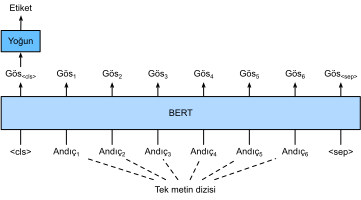
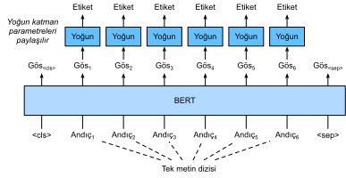
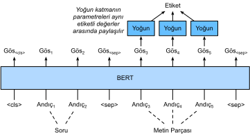

# Dizi Düzeyinde ve Belirteç Düzeyinde Uygulamalar için BERT İnce Ayarı 
:label:`sec_finetuning-bert`

Bu bölümün önceki kısımlarında, RNN'ler, CNN'ler, dikkat ve MLP'lere dayanan doğal dil işleme uygulamaları için farklı modeller tasarladık. Bu modeller, alan veya zaman kısıtlaması olduğunda faydalıdır, ancak her doğal dil işleme görevi için belirli bir model oluşturmak pratik olarak imkansızdır. :numref:`sec_bert` içinde, çok çeşitli doğal dil işleme görevleri için asgari mimari değişiklikleri gerektiren bir ön eğitim modeli olan BERT tanıttık. Bir yandan, önerildiği sırasında BERT çeşitli doğal dil işleme görevlerinde son teknolojiyi iyileştirdi. Öte yandan, :numref:`sec_bert-pretraining` içinde belirtildiği gibi, orijinal BERT modelinin iki versiyonu 110 milyon ve 340 milyon parametre ile geliyor. Bu nedenle, yeterli hesaplama kaynağı olduğunda, aşağı akış doğal dil işleme uygulamaları için BERT ince ayarını düşünebiliriz. 

Aşağıda, doğal dil işleme uygulamalarının bir alt kümesini dizi düzeyinde ve belirteç düzeyinde genelleştiriyoruz. Dizi düzeyinde, metin girdisinin BERT temsilini tek metin sınıflandırmasında ve metin çifti sınıflandırmasında veya bağlanımda çıktı etiketine nasıl dönüştüreceğimizi gösteriyoruz. Belirteç düzeyinde, metin etiketleme ve soru yanıtlama gibi yeni uygulamaları kısaca tanıtacağız ve BERT'in girdilerini nasıl temsil edebileceğine ve çıktı etiketlerine dönüştürebileceğine ışık tutacağız. İnce ayar sırasında BERT tarafından farklı uygulamalar için gerekli olan "asgari mimari değişiklikleri" ek tam bağlı katmanlardır. Aşağı akış uygulamasının gözetimli öğrenmesi sırasında ek katmanların parametreleri sıfırdan öğrenilirken, önceden eğitilmiş BERT modelindeki tüm parametreler ince ayarlanır. 

## Tek Metin Sınıflandırması

*Tek metin sınıflandırma* girdi olarak tek bir metin dizisi alır ve sınıflandırma sonucunu çıkarır. Bu bölümde incelediğimiz duygu analizinin yanısıra, Dilsel Kabul Edilebilirlik Külliyatı (Corpus of Linguistic Acceptability - CoLA), belirli bir cümlenin dilbilgisi açısından kabul edilebilir olup olmadığına karar veren tek metin sınıflandırması için bir veri kümedir :cite:`Warstadt.Singh.Bowman.2019`. Mesela, “Çalışmalıyım.” kabul edilebilir ama “Çalışmalıyorum” değil. 

:label:`fig_bert-one-seq`

:numref:`sec_bert` BERT girdi temsilini açıklar. BERT girdi dizisi, hem tek metini hem de metin çiftlerini açıkça temsil eder; burada “&lt;cls&gt;” özel sınıflandırma belirteci dizi sınıflandırma için kullanılır ve “&lt;sep&gt;” özel sınıflandırma belirteci tek metnin sonunu işaretler veya bir metin çiftini ayırır. :numref:`fig_bert-one-seq` içinde gösterildiği gibi, tek metin sınıflandırma uygulamalarında, “&lt;cls&gt;” özel sınıflandırma belirtecinin BERT temsili, girdi metni dizisinin tüm bilgilerini kodlar. Tek girdi metninin temsili olarak, tüm ayrık etiket değerlerinin dağılımını yapmak için tam bağlı (yoğun) katmanlardan oluşan küçük bir MLP içine beslenecektir. 

## Metin Çifti Sınıflandırma veya Bağlanım

Bu bölümde doğal dil çıkarımını da inceledik. Bir çift metni sınıflandıran bir uygulama türü olan *metin çifti sınıflandırma*ya aittir. 

Girdi olarak bir metin çifti alıp sürekli bir değer çıktısı veren *anlamsal metinsel benzerlik*, popüler bir *metin çifti bağlanımı* görevidir.
Bu görev cümlelerin anlamsal benzerliğini ölçer. Örneğin, Anlamsal Metinsel Benzerlik Kıyaslama veri kümelerinde, bir çift cümlenin benzerlik puanı 0 (anlam çakışmayan) ile 5 (yani eşdeğerlik) arasında değişen bir sıra ölçeğidir :cite:`Cer.Diab.Agirre.ea.2017`. Amaç bu skorları tahmin etmektir. Anlamsal Metin Benzerliği Kıyaslama veri kümesinden örnekler şunlardır (cümle 1, cümle 2, benzerlik puanı): 

* “Bir uçak kalkıyor.“, “Bir tayyare kalkıyor.“, 5.000;
* “Bir kadın bir şeyler yiyor.“, “Bir kadın et yiyor.“, 3.000;
* “Bir kadın dans ediyor.“, “Bir adam konuşuyor.“, 0.000.

:label:`fig_bert-two-seqs`

:numref:`fig_bert-one-seq` içindeki tek metin sınıflandırmasıyla karşılaştırıldığında, :numref:`fig_bert-two-seqs` içindeki metin çifti sınıflandırması için BERT ince ayarı girdi temsilinde farklıdır. Anlamsal metinsel benzerlik gibi metin çifti bağlanım görevleri için, sürekli bir etiket değeri çıktısı ve ortalama kare kaybının kullanılması gibi önemsiz değişiklikler uygulanabilir: Bunlar bağlanım için yaygındır. 

## Metin Etiketleme

Şimdi, her belirtece bir etiketin atandığı *metin etiketleme* gibi belirteç düzeyinde görevleri ele alalım. Metin etiketleme görevleri arasında
*konuşma parçası etiketleme*, her kelimeye cümledeki kelimenin rolüne göre bir konuşma parçası etiketi atar (örn., sıfat ve belirleyici). Örneğin, Penn Treebank II etiket kümesine göre, “John Smith'in arabası yeni” cümlesi “NNP (isim, uygun tekil) NNP POS (iyelik sonu) NN (isim, tekil veya kitle) VB (temel form, fiil) JJ (sıfat)” olarak etiketlenmelidir. 

:label:`fig_bert-tagging`

Metin etiketleme uygulamaları için BERT ince ayarı  :numref:`fig_bert-tagging` içinde gösterilmiştir. :numref:`fig_bert-one-seq` ile karşılaştırıldığında, tek fark, metin etiketlemede, girdi metninin *her belirtecinin* BERT gösteriminin, konuşma parçası etiketi gibi, belirteç etiketinin çıktısını almak için aynı ek tam bağlı katmanlara beslenmesidir. 

## Soru Yanıtlama

Başka bir belirteç düzeyinde uygulama olan *soru cevaplama* okuma anlama yeteneklerini yansıtır.
Örneğin, Stanford Soru Yanıtlama Veri Kümesi (SQuAD v1.1), her sorunun cevabının, sorunun ilgili olduğu pasajdan sadece bir metin parçası (metin aralığı) olduğu okuma parçaları ve sorulardan oluşur :cite:`Rajpurkar.Zhang.Lopyrev.ea.2016`. Açıklamak için, bir metin parçası “Bazı uzmanlar bir maskenin etkinliğinin sonuçsuz olduğunu bildiriyor. Bununla birlikte, maske üreticileri, N95 solunum maskeleri gibi ürünlerinin virüse karşı koruyabileceği konusunda ısrar ediyorlar.” ve bir soru “N95 solunum maskelerinin virüse karşı koruyabileceğini kim söylüyor?” düşünün. Cevap, parçadaki “maske üreticileri” metin alanı olmalıdır. Böylece, SQuAD v1.1'deki hedef, bir çift soru ve metin parçası verildiğinde parçadaki metin aralığının başlangıcını ve sonunu tahmin etmektir. 

:label:`fig_bert-qa`

Soru yanıtlamada BERT ince ayarı yapmak için, soru ve metin parçası BERT girdisinde sırasıyla birinci ve ikinci metin dizisi olarak paketlenir. Metin aralığının başlangıcının konumunu tahmin etmek için, aynı ek tam bağlı katman, metin parçasındaki $i$ konumunun herhangi bir belirtecinin BERT temsilini $s_i$ skaler puanına dönüştürecektir. Tüm metin parçası belirteçlerinin bu puanları, ayrıca, softmaks işlemi tarafından bir olasılık dağılımına dönüştürülür, böylece metin parçasındaki her $i$ belirteç konumu, $p_i$ metin aralığının başlangıcı olma olasılığına atanır. Metin aralığının sonunu tahmin etmek, ek tam bağlı katmandaki parametrelerin, başlangıcı tahmin etmek için kullanılanlardan bağımsız olması dışında, yukarıdakiyle aynıdır. Sonunu tahmin ederken, herhangi bir $i$ konumunun metin parçası belirteci, aynı tam bağlı katman tarafından bir $e_i$ skaler skoruna dönüştürülür. :numref:`fig_bert-qa`, soru yanıtlama için BERT ince ayarını tasvir eder. 

Soru yanıtlamak için, gözetimli öğrenmenin eğitim amaç işlevi, gerçek referans değerin başlangıç ve bitiş pozisyonlarının logaritmik olabilirliğini en üst düzeye çıkarmak kadar basittir. Aralığı tahmin ederken, $i$ konumundan $j$ ($i \leq j$) konumuna kadar geçerli bir aralık için $s_i + e_j$ puanını hesaplayabilir ve en yüksek puanlı aralığı çıktı olarak verebiliriz. 

## Özet

* BERT, tek metin sınıflandırması (örn. Duygu analizi ve dilsel kabul edilebilirliği test etme), metin çifti sınıflandırması veya bağlanım (örneğin, doğal dil çıkarım ve anlamsal metinsel benzerlik), metin etiketleme (örn. konuşma bölümü etiketleme) ve soru yanıtlama gibi dizi düzeyinde ve belirteç düzeyinde doğal dil işleme uygulamaları için asgari mimari değişiklikleri (ek tam bağlı katmanlar) gerektirir.
* Aşağı akış uygulamasının gözetimli öğrenme sırasında ek katmanların parametreleri sıfırdan öğrenilirken, önceden eğitilmiş BERT modelindeki tüm parametreler ince ayarlanır.

## Alıştırmalar

1. Haber makaleleri için bir arama motoru algoritması tasarlayalım. Sistem bir sorgu aldığında (örneğin, “koronavirüs salgını sırasında petrol endüstrisi”), sorgu ile en alakalı haber makalelerinin sıralı listesini döndürmelidir. Büyük bir haber makalesi havuzumuz ve çok sayıda sorgumuz olduğunu varsayalım. Sorunu basitleştirmek için en alakalı makalenin her sorgu için etiketlenmiş olduğunu varsayalım. Algoritma tasarımında negatif örneklemeyi (bkz. :numref:`subsec_negative-sampling`) ve BERT'i nasıl uygulayabiliriz?
1. Dil modellerinin eğitiminde BERT'ten nasıl yararlanabiliriz?
1. Makine çevirisinde BERT'ten yararlanabilir miyiz?

[Tartışmalar](https://discuss.d2l.ai/t/396)
