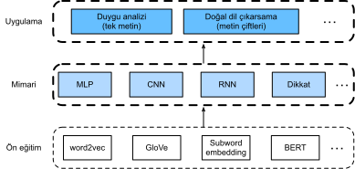

# Doğal Dil İşleme: Uygulamalar
:label:`chap_nlp_app`

Metin dizilerinde belirteçleri nasıl temsil edeceğimizi ve :numref:`chap_nlp_pretrain` içinde temsillerini nasıl eğitileceğini gördük. Bu tür önceden eğitilmiş metin temsilleri, farklı alt akış doğal dil işleme görevleri için çeşitli modellere beslenebilir. 

Aslında, daha önceki bölümler zaten bazı doğal dil işleme uygulamalarını tartıştık; *ön eğitimsiz*, sadece derin öğrenme mimarilerini açıklamak için. Örneğin, :numref:`chap_rnn` içinde, roman benzeri metinler üretmede dil modelleri tasarlamak için RNN'lere güvendik. :numref:`chap_modern_rnn` ve :numref:`chap_attention` içinde, makine çevirisi için RNN'lere ve dikkat mekanizmalarına dayanan modeller de tasarladık. 

Ancak, bu kitap tüm bu tür uygulamaları kapsamlı bir şekilde açıklamak niyetinde değildir. Bunun yerine, odak noktamız *doğal dil işleme problemlerini ele almak için dillerin (derin) temsili öğreniminin nasıl uygulanacağıdır*. Önceden eğitilmiş metin temsilleri göz önüne alındığında, bu bölüm iki popüler ve temsili aşağı akış doğal dil işleme görevini inceleyecektir: Duygu analizi ve doğal dil çıkarımı, sırasıyla tek metin ve metin çiftlerinin ilişkilerini analiz eder. 


:label:`fig_nlp-map-app`

:numref:`fig_nlp-map-app` üzerinde tasvir edildiği gibi, bu bölüm, MLP'ler, CNN'ler, RNN'ler ve dikkat gibi farklı derin öğrenme mimarileri türlerini kullanarak doğal dil işleme modellerinin tasarlanmasına ilişkin temel fikirleri açıklamaya odaklanmaktadır. Herhangi bir önceden eğitilmiş metin temsillerini :numref:`fig_nlp-map-app` içindeki her iki uygulama için herhangi bir mimariyle birleştirmek mümkün olsa da, birkaç temsili kombinasyon seçiyoruz. Özellikle, duygu analizi için RNN'lere ve CNN'lere dayalı popüler mimarileri araştıracağız. Doğal dil çıkarımı için, metin çiftlerinin nasıl analiz edileceğini göstermek için dikkati ve MLP'leri seçiyoruz. Sonunda, bir dizi düzeyinde (tek metin sınıflandırması ve metin çifti sınıflandırması) ve bir belirteç düzeyinde (metin etiketleme ve soru yanıtlama) gibi çok çeşitli doğal dil işleme uygulamaları için önceden eğitilmiş bir BERT modeline nasıl ince ayar yapılacağını gösteriyoruz. Somut deneysel bir durum olarak, BERT doğal dil çıkarımı için ince ayar yapacağız. 

:numref:`sec_bert` içinde tanıtılan gibi BERT, çok çeşitli doğal dil işleme uygulamaları için minimal mimari değişiklikleri gerektirir. Bununla birlikte, bu fayda, aşağı akış uygulamaları için çok sayıda BERT parametresinin ince ayarlanması pahasına gelir. Uzay veya zaman sınırlı olduğunda, MLP'ler, CNN'ler, RNN'ler ve dikkat temelli modeller daha uygulanabilirdir. Aşağıda, duygu analizi uygulamasıyla başlıyoruz ve sırasıyla RNN'lere ve CNN'lere dayalı model tasarımını gösteriyoruz.

```toc
:maxdepth: 2

sentiment-analysis-and-dataset
sentiment-analysis-rnn
sentiment-analysis-cnn
natural-language-inference-and-dataset
natural-language-inference-attention
finetuning-bert
natural-language-inference-bert
```
