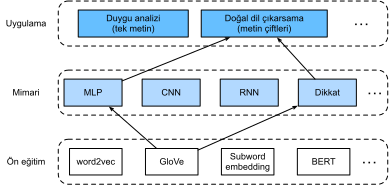
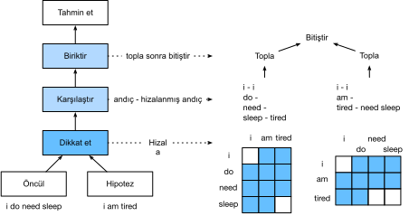

# Doğal Dil Çıkarımı: Dikkati Kullanma
:label:`sec_natural-language-inference-attention`

:numref:`sec_natural-language-inference-and-dataset` içinde doğal dil çıkarım görevini ve SNLI veri kümesini tanıttık. Karmaşık ve derin mimarilere dayanan birçok model göz önüne alındığında, Parikh ve ark. doğal dil çıkarımını dikkat mekanizmaları ile ele almayı önerdi ve bunu "ayrıştırılabilir dikkat modeli" olarak adlandırdı :cite:`Parikh.Tackstrom.Das.ea.2016`. Bu, yinelemeli veya evrişimli katmanları olmayan bir modelle sonuçlanır ve SNLI veri kümesinde o anda çok daha az parametre ile en iyi sonucu elde eder. Bu bölümde, :numref:`fig_nlp-map-nli-attention` içinde tasvir edildiği gibi doğal dil çıkarımı için bu dikkat tabanlı yöntemi (MLP'lerle) açıklayacağız ve uygulayacağız. 


:label:`fig_nlp-map-nli-attention`

## Model

Öncüllerdeki ve hipotezlerdeki belirteçlerin sırasını korumaktan daha basit olarak, sadece bir metin dizisindeki belirteçleri diğerindeki her belirteçle hizalayabiliriz ve tersi de geçerlidir, daha sonra öncüller ve hipotezler arasındaki mantıksal ilişkileri tahmin etmek için bu bilgileri karşılaştırabilir ve birleştirebiliriz. Makine çevirisinde kaynak ve hedef cümleler arasında belirteçlerin hizalanmasına benzer şekilde, öncül ve hipotezler arasındaki belirteçlerin hizalanması dikkat mekanizmaları ile düzgün bir şekilde gerçekleştirilebilir. 


:label:`fig_nli_attention`

:numref:`fig_nli_attention` dikkat mekanizmalarını kullanan doğal dil çıkarım yöntemini tasvir eder. Üst düzeyde, ortak eğitilmiş üç adımdan oluşur: Dikkat etmek, karşılaştırmak ve biriktirmek. Onları aşağıda adım adım göstereceğiz.

```{.python .input}
from d2l import mxnet as d2l
from mxnet import gluon, init, np, npx
from mxnet.gluon import nn

npx.set_np()
```

```{.python .input}
#@tab pytorch
from d2l import torch as d2l
import torch
from torch import nn
from torch.nn import functional as F
```

### Dikkat Etmek

İlk adım, bir metin dizisindeki belirteçleri diğer dizideki her belirteçle hizalamaktır. Öncülün “benim uykuya ihtiyacım var” ve hipotezin “ben yorgunum” olduğunu varsayalım. Anlamsal benzerlik nedeniyle, hipotezdeki "ben" ile öncül içindeki "ben"'i hizalamak ve hipotezdeki "yorgun"'u öncül içindeki "uyku" ile hizalamak isteyebiliriz. Benzer şekilde, öncüldeki "ben"i hipotezdeki "ben" ile hizalamak ve öncüldeki "uyku" ve "ihtiyaç"'ı hipotezdeki "yorgun" ile aynı hizaya getirmek isteyebiliriz. Bu tür bir hizalamanın, ideal olarak büyük ağırlıkların hizalanacak belirteçlerle ilişkilendirildiği, ağırlıklı ortalama kullanılarak *yumuşak* olduğunu unutmayın. Gösterim kolaylığı için, :numref:`fig_nli_attention` böyle bir hizalamayı *sert* bir şekilde gösterir. 

Şimdi dikkat mekanizmalarını kullanarak yumuşak hizalamayı daha ayrıntılı olarak tanımlıyoruz. $\mathbf{A} = (\mathbf{a}_1, \ldots, \mathbf{a}_m)$ ve $\mathbf{B} = (\mathbf{b}_1, \ldots, \mathbf{b}_n)$ ile, sırasıyla $\mathbf{a}_i, \mathbf{b}_j \in \mathbb{R}^{d}$ ($i = 1, \ldots, m, j = 1, \ldots, n$) $d$ boyutlu bir sözcük vektörü olan belirteç sayısı $m$ ve $n$ olan öncülü ve hipotezi belirtin. Yumuşak hizalama için $e_{ij} \in \mathbb{R}$ dikkat ağırlıklarını aşağıdaki gibi hesaplıyoruz 

$$e_{ij} = f(\mathbf{a}_i)^\top f(\mathbf{b}_j),$$
:eqlabel:`eq_nli_e`

burada $f$ işlevi, aşağıdaki `mlp` işlevinde tanımlanan bir MLP'dir. $f$'in çıktı boyutu, `mlp`'nin `num_hiddens` argümanı tarafından belirlenir.

```{.python .input}
def mlp(num_hiddens, flatten):
    net = nn.Sequential()
    net.add(nn.Dropout(0.2))
    net.add(nn.Dense(num_hiddens, activation='relu', flatten=flatten))
    net.add(nn.Dropout(0.2))
    net.add(nn.Dense(num_hiddens, activation='relu', flatten=flatten))
    return net
```

```{.python .input}
#@tab pytorch
def mlp(num_inputs, num_hiddens, flatten):
    net = []
    net.append(nn.Dropout(0.2))
    net.append(nn.Linear(num_inputs, num_hiddens))
    net.append(nn.ReLU())
    if flatten:
        net.append(nn.Flatten(start_dim=1))
    net.append(nn.Dropout(0.2))
    net.append(nn.Linear(num_hiddens, num_hiddens))
    net.append(nn.ReLU())
    if flatten:
        net.append(nn.Flatten(start_dim=1))
    return nn.Sequential(*net)
```

:eqref:`eq_nli_e` denkleminde $f$'in $\mathbf{a}_i$ ve $\mathbf{b}_j$ girdilerini girdi olarak bir çift almak yerine ayrı ayrı aldığı vurgulanmalıdır. Bu *ayrıştırma* püf noktası, $mn$ kere uygulama (ikinci dereceden karmaşıklık) yerine $f$'in yalnızca $m + n$ kere uygulamasına (doğrusal karmaşıklık) yol açar. 

:eqref:`eq_nli_e` içindeki dikkat ağırlıklarını normalleştirerek, varsayımdaki tüm belirteç vektörlerinin ağırlıklı ortalamasını hesaplıyoruz ve bu hipotezin temsilini elde etmek için $i$ ile endeksli belirteç ile yumuşak bir şekilde hizalanan hipotezin temsilini elde ediyoruz: 

$$
\boldsymbol{\beta}_i = \sum_{j=1}^{n}\frac{\exp(e_{ij})}{ \sum_{k=1}^{n} \exp(e_{ik})} \mathbf{b}_j.
$$

Benzer şekilde, hipotezde $j$ ile endekslenen her belirteç için öncül belirteçlerinin yumuşak hizalamasını hesaplarız: 

$$
\boldsymbol{\alpha}_j = \sum_{i=1}^{m}\frac{\exp(e_{ij})}{ \sum_{k=1}^{m} \exp(e_{kj})} \mathbf{a}_i.
$$

Aşağıda, hipotezlerin (`beta`) girdi öncülleri `A` ile yumuşak hizalamasını ve öncüllerin (`alpha`) girdi hipotezleri `B` ile yumuşak hizalamasını  hesaplamak için `Attend` sınıfını tanımlıyoruz.

```{.python .input}
class Attend(nn.Block):
    def __init__(self, num_hiddens, **kwargs):
        super(Attend, self).__init__(**kwargs)
        self.f = mlp(num_hiddens=num_hiddens, flatten=False)

    def forward(self, A, B):
        # `A`/`B`'nin şekli: (`batch_size`, A/B dizisindeki belirteç sayısı, 
        # `embed_size`)
        # `f_A`/`f_B`'nin şekli: (`batch_size`, A/B dizisindeki belirteç 
        # sayısı, `num_hiddens`)
        f_A = self.f(A)
        f_B = self.f(B)
        # `e`'nin şekli: (`batch_size`, A dizisindeki belirteç sayısı, 
        # B dizisindeki belirteç sayısı)
        e = npx.batch_dot(f_A, f_B, transpose_b=True)
        # `beta`'nın şekli: (`batch_size`, A dizisindeki belirteç sayısı, 
        # `embed_size`), burada B dizisi, A dizisindeki her bir belirteç ile
        # (`beta`'nın 1. ekseni) yumuşak bir şekilde hizalanır.
        beta = npx.batch_dot(npx.softmax(e), B)
        # `alpha`'nın şekli: (`batch_size`, dizi B'deki belirteç sayısı, 
        # `embed_size`), burada A dizisi, B dizisindeki her bir belirteç ile
        # (`alpha`'nın 1. ekseni) yumuşak bir şekilde hizalanır
        alpha = npx.batch_dot(npx.softmax(e.transpose(0, 2, 1)), A)
        return beta, alpha
```

```{.python .input}
#@tab pytorch
class Attend(nn.Module):
    def __init__(self, num_inputs, num_hiddens, **kwargs):
        super(Attend, self).__init__(**kwargs)
        self.f = mlp(num_inputs, num_hiddens, flatten=False)

    def forward(self, A, B):
        # `A`/`B`'nin şekli: (`batch_size`, A/B dizisindeki belirteç sayısı, 
        # `embed_size`)
        # `f_A`/`f_B`'nin şekli: (`batch_size`, A/B dizisindeki belirteç 
        # sayısı, `num_hiddens`)
        f_A = self.f(A)
        f_B = self.f(B)
        # `e`'nin şekli: (`batch_size`, A dizisindeki belirteç sayısı, 
        # B dizisindeki belirteç sayısı)
        e = torch.bmm(f_A, f_B.permute(0, 2, 1))
        # `beta`'nın şekli: (`batch_size`, A dizisindeki belirteç sayısı, 
        # `embed_size`), burada B dizisi, A dizisindeki her bir belirteç ile
        # (`beta`'nın 1. ekseni) yumuşak bir şekilde hizalanır.
        beta = torch.bmm(F.softmax(e, dim=-1), B)
        # `alpha`'nın şekli: (`batch_size`, dizi B'deki belirteç sayısı, 
        # `embed_size`), burada A dizisi, B dizisindeki her bir belirteç ile
        # (`alpha`'nın 1. ekseni) yumuşak bir şekilde hizalanır
        alpha = torch.bmm(F.softmax(e.permute(0, 2, 1), dim=-1), A)
        return beta, alpha
```

### Karşılaştırmak

Bir sonraki adımda, bir dizideki bir belirteci, bu belirteçle yumuşak bir şekilde hizalanan diğer diziyle karşılaştırırız. Yumuşak hizalamada, bir dizideki tüm belirteçlerin, muhtemelen farklı dikkat ağırlıklarına sahip olsa da, diğer dizideki bir belirteçle karşılaştırılacağını unutmayın. Kolay gösterim için, :numref:`fig_nli_attention` belirteçleri *sert* bir şekilde hizalanmış belirteçlerle eşleştirir. Örneğin, dikkat etme adımının öncüldeki "ihtiyaç" ve "uyku"'nun her ikisinin de hipotezdeki "yorgun" ile aynı hizada olduğunu belirlediğini varsayalım, "yorgun--uykuya ihtiyacım var" çifti karşılaştırılacaktır.

Karşılaştırma adımında, bir diziden belirteçlerin (operatör $[\cdot, \cdot]$) ve diğer diziden hizalanmış belirteçlerin bitiştirilmesini $g$ (bir MLP) işlevine besleriz: 

$$\mathbf{v}_{A,i} = g([\mathbf{a}_i, \boldsymbol{\beta}_i]), i = 1, \ldots, m\\ \mathbf{v}_{B,j} = g([\mathbf{b}_j, \boldsymbol{\alpha}_j]), j = 1, \ldots, n.$$

:eqlabel:`eq_nli_v_ab` 

:eqref:`eq_nli_v_ab` içinde, $\mathbf{v}_{A,i}$, öncüldeki $i$ belirteci ve $i$ belirteci ile yumuşak bir şekilde hizalanan tüm hipotez belirteçleri arasındaki karşılaştırmadır; $\mathbf{v}_{B,j}$ ise hipotezdeki $j$ belirteci ile $j$ belirteci ile yumuşak bir şekilde hizalanmış tüm öncül belirteçler arasındaki karşılaştırmadır. Aşağıdaki `Compare` sınıfı, böyle bir karşılaştırma adımı tanımlar.

```{.python .input}
class Compare(nn.Block):
    def __init__(self, num_hiddens, **kwargs):
        super(Compare, self).__init__(**kwargs)
        self.g = mlp(num_hiddens=num_hiddens, flatten=False)

    def forward(self, A, B, beta, alpha):
        V_A = self.g(np.concatenate([A, beta], axis=2))
        V_B = self.g(np.concatenate([B, alpha], axis=2))
        return V_A, V_B
```

```{.python .input}
#@tab pytorch
class Compare(nn.Module):
    def __init__(self, num_inputs, num_hiddens, **kwargs):
        super(Compare, self).__init__(**kwargs)
        self.g = mlp(num_inputs, num_hiddens, flatten=False)

    def forward(self, A, B, beta, alpha):
        V_A = self.g(torch.cat([A, beta], dim=2))
        V_B = self.g(torch.cat([B, alpha], dim=2))
        return V_A, V_B
```

### Biriktirmek

İki karşılaştırma vektörü kümesi $\mathbf{v}_{A,i}$ ($i = 1, \ldots, m$) ve $\mathbf{v}_{B,j}$ ($j = 1, \ldots, n$) ile, son adımda mantıksal ilişkiyi çıkarmak için bu tür bilgileri biriktireceğiz. Her iki kümeyi toplayarak başlıyoruz: 

$$
\mathbf{v}_A = \sum_{i=1}^{m} \mathbf{v}_{A,i}, \quad \mathbf{v}_B = \sum_{j=1}^{n}\mathbf{v}_{B,j}.
$$

Daha sonra mantıksal ilişkinin sınıflandırma sonucunu elde etmek için $h$ (bir MLP) işlevine her iki özetleme sonuçlarının bitiştirilmesini besleriz: 

$$
\hat{\mathbf{y}} = h([\mathbf{v}_A, \mathbf{v}_B]).
$$

Biriktirme adımı aşağıdaki `Aggregate` sınıfında tanımlanır.

```{.python .input}
class Aggregate(nn.Block):
    def __init__(self, num_hiddens, num_outputs, **kwargs):
        super(Aggregate, self).__init__(**kwargs)
        self.h = mlp(num_hiddens=num_hiddens, flatten=True)
        self.h.add(nn.Dense(num_outputs))

    def forward(self, V_A, V_B):
        # Her iki karşılaştırma vektörü kümesini toplayın
        V_A = V_A.sum(axis=1)
        V_B = V_B.sum(axis=1)
        # Her iki özetleme sonucunun bitiştirmesini bir MLP'ye besleyin
        Y_hat = self.h(np.concatenate([V_A, V_B], axis=1))
        return Y_hat
```

```{.python .input}
#@tab pytorch
class Aggregate(nn.Module):
    def __init__(self, num_inputs, num_hiddens, num_outputs, **kwargs):
        super(Aggregate, self).__init__(**kwargs)
        self.h = mlp(num_inputs, num_hiddens, flatten=True)
        self.linear = nn.Linear(num_hiddens, num_outputs)

    def forward(self, V_A, V_B):
       # Her iki karşılaştırma vektörü kümesini toplayın
        V_A = V_A.sum(dim=1)
        V_B = V_B.sum(dim=1)
        # Her iki özetleme sonucunun bitiştirmesini bir MLP'ye besleyin
        Y_hat = self.linear(self.h(torch.cat([V_A, V_B], dim=1)))
        return Y_hat
```

### Her Şeyi Bir Araya Koyma

Dikkat etme, karşılaştırma ve biriktirme adımlarını bir araya getirerek, bu üç adımı birlikte eğitmek için ayrıştırılabilir dikkat modelini tanımlarız.

```{.python .input}
class DecomposableAttention(nn.Block):
    def __init__(self, vocab, embed_size, num_hiddens, **kwargs):
        super(DecomposableAttention, self).__init__(**kwargs)
        self.embedding = nn.Embedding(len(vocab), embed_size)
        self.attend = Attend(num_hiddens)
        self.compare = Compare(num_hiddens)
        # 3 olası çıktı vardır: gerekçe, çelişki ve tarafsızlık
        self.aggregate = Aggregate(num_hiddens, 3)

    def forward(self, X):
        premises, hypotheses = X
        A = self.embedding(premises)
        B = self.embedding(hypotheses)
        beta, alpha = self.attend(A, B)
        V_A, V_B = self.compare(A, B, beta, alpha)
        Y_hat = self.aggregate(V_A, V_B)
        return Y_hat
```

```{.python .input}
#@tab pytorch
class DecomposableAttention(nn.Module):
    def __init__(self, vocab, embed_size, num_hiddens, num_inputs_attend=100,
                 num_inputs_compare=200, num_inputs_agg=400, **kwargs):
        super(DecomposableAttention, self).__init__(**kwargs)
        self.embedding = nn.Embedding(len(vocab), embed_size)
        self.attend = Attend(num_inputs_attend, num_hiddens)
        self.compare = Compare(num_inputs_compare, num_hiddens)
        # 3 olası çıktı vardır: gerekçe, çelişki ve tarafsızlık
        self.aggregate = Aggregate(num_inputs_agg, num_hiddens, num_outputs=3)

    def forward(self, X):
        premises, hypotheses = X
        A = self.embedding(premises)
        B = self.embedding(hypotheses)
        beta, alpha = self.attend(A, B)
        V_A, V_B = self.compare(A, B, beta, alpha)
        Y_hat = self.aggregate(V_A, V_B)
        return Y_hat
```

## Model Eğitimi ve Değerlendirilmesi

Şimdi SNLI veri kümesinde tanımlanmış ayrıştırılabilir dikkat modelini eğiteceğiz ve değerlendireceğiz. Veri kümesini okuyarak başlıyoruz. 

### Veri Kümesini Okuma

SNLI veri kümesini :numref:`sec_natural-language-inference-and-dataset` içinde tanımlanan işlevi kullanarak indirip okuyoruz. Toplu iş boyutu ve dizi uzunluğu sırasıyla $256$ ve $50$ olarak ayarlanır.

```{.python .input}
#@tab all
batch_size, num_steps = 256, 50
train_iter, test_iter, vocab = d2l.load_data_snli(batch_size, num_steps)
```

### Modeli Oluşturma

Girdi belirteçlerini temsil etmek için önceden eğitilmiş 100 boyutlu GloVe gömmeyi kullanıyoruz. Böylece, $\mathbf{a}_i$ ve $\mathbf{b}_j$ vektörlerinin :eqref:`eq_nli_e` içindeki boyutunu önceden 100 olarak tanımlarız. :eqref:`eq_nli_e` içindeki $f$ ve :eqref:`eq_nli_v_ab` içindeki $g$ fonksiyonlarının çıktı boyutu 200 olarak ayarlanmıştır. Ardından bir model örneği oluşturur, parametrelerini ilkler ve girdi belirteçlerinin vektörlerini ilklemek için GloVe gömmesini yükleriz.

```{.python .input}
embed_size, num_hiddens, devices = 100, 200, d2l.try_all_gpus()
net = DecomposableAttention(vocab, embed_size, num_hiddens)
net.initialize(init.Xavier(), ctx=devices)
glove_embedding = d2l.TokenEmbedding('glove.6b.100d')
embeds = glove_embedding[vocab.idx_to_token]
net.embedding.weight.set_data(embeds)
```

```{.python .input}
#@tab pytorch
embed_size, num_hiddens, devices = 100, 200, d2l.try_all_gpus()
net = DecomposableAttention(vocab, embed_size, num_hiddens)
glove_embedding = d2l.TokenEmbedding('glove.6b.100d')
embeds = glove_embedding[vocab.idx_to_token]
net.embedding.weight.data.copy_(embeds);
```

### Model Eğitimi ve Değerlendirilmesi

:numref:`sec_multi_gpu` içindeki `split_batch` işlevinin aksine, metin dizileri (veya imgeler) gibi tek girdileri alan `split_batch` işlevinin aksine, minigruplarda öncüller ve hipotezler gibi birden fazla girdiyi almak için `split_batch_multi_inputs` işlevi tanımlıyoruz.

```{.python .input}
#@save
def split_batch_multi_inputs(X, y, devices):
    """Split multi-input `X` and `y` into multiple devices."""
    """Çoklu girdili `X` and `y`'yi birden çok cihaza ayırın."""
    X = list(zip(*[gluon.utils.split_and_load(
        feature, devices, even_split=False) for feature in X]))
    return (X, gluon.utils.split_and_load(y, devices, even_split=False))
```

Şimdi modeli SNLI veri kümesinde eğitebilir ve değerlendirebiliriz.

```{.python .input}
lr, num_epochs = 0.001, 4
trainer = gluon.Trainer(net.collect_params(), 'adam', {'learning_rate': lr})
loss = gluon.loss.SoftmaxCrossEntropyLoss()
d2l.train_ch13(net, train_iter, test_iter, loss, trainer, num_epochs, devices,
               split_batch_multi_inputs)
```

```{.python .input}
#@tab pytorch
lr, num_epochs = 0.001, 4
trainer = torch.optim.Adam(net.parameters(), lr=lr)
loss = nn.CrossEntropyLoss(reduction="none")
d2l.train_ch13(net, train_iter, test_iter, loss, trainer, num_epochs, devices)
```

### Modeli Kullanma

Son olarak, bir çift öncül ve hipotez arasındaki mantıksal ilişkiyi ortaya çıkaracak tahmin işlevini tanımlayın.

```{.python .input}
#@save
def predict_snli(net, vocab, premise, hypothesis):
    """Öncül ve hipotez arasındaki mantıksal ilişkiyi tahmin edin."""
    premise = np.array(vocab[premise], ctx=d2l.try_gpu())
    hypothesis = np.array(vocab[hypothesis], ctx=d2l.try_gpu())
    label = np.argmax(net([premise.reshape((1, -1)),
                           hypothesis.reshape((1, -1))]), axis=1)
    return 'entailment' if label == 0 else 'contradiction' if label == 1 \
            else 'neutral'
```

```{.python .input}
#@tab pytorch
#@save
def predict_snli(net, vocab, premise, hypothesis):
    """Öncül ve hipotez arasındaki mantıksal ilişkiyi tahmin edin."""
    net.eval()
    premise = torch.tensor(vocab[premise], device=d2l.try_gpu())
    hypothesis = torch.tensor(vocab[hypothesis], device=d2l.try_gpu())
    label = torch.argmax(net([premise.reshape((1, -1)),
                           hypothesis.reshape((1, -1))]), dim=1)
    return 'entailment' if label == 0 else 'contradiction' if label == 1 \
            else 'neutral'
```

Eğitilmiş modeli, örnek bir cümle çifti için doğal dil çıkarım sonucunu elde etmek için kullanabiliriz.

```{.python .input}
#@tab all
predict_snli(net, vocab, ['he', 'is', 'good', '.'], ['he', 'is', 'bad', '.'])
```

## Özet

* Ayrıştırılabilir dikkat modeli, öncüller ve hipotezler arasındaki mantıksal ilişkileri tahmin etmek için üç adımdan oluşur: Dikkat etmek, karşılaştırmak ve biriktirmek.
* Dikkat mekanizmalarıyla, bir metin dizisinde belirteçleri diğerindeki her belirteçle hizalayabiliriz ve tam tersi de geçerlidir. Bu hizalama, ideal olarak büyük ağırlıkların hizalanacak belirteçlerle ilişkilendirildiği ağırlıklı ortalama kullanıldığından yumuşaktır.
* Ayrıştırma püf noktası, dikkat ağırlıklarını hesaplarken ikinci dereceden karmaşıklıktan daha fazla arzu edilen doğrusal bir karmaşıklığa yol açar.
* Doğal dil çıkarımı gibi aşağı akış doğal dil işleme görevi için girdi temsili olarak önceden eğitilmiş sözcük vektörlerini kullanabiliriz.

## Alıştırmalar

1. Modeli diğer hiper parametre kombinasyonları ile eğitin. Test kümesinde daha iyi doğruluk elde edebilir misiniz?
1. Doğal dil çıkarımı için ayrıştırılabilir dikkat modelinin en büyük sakıncaları nelerdir?
1. Herhangi bir cümle çifti için anlamsal benzerlik düzeyini (örneğin, 0 ile 1 arasında sürekli bir değer) elde etmek istediğimizi varsayalım. Veri kümesini nasıl toplayıp etiketleyeceğiz? Dikkat mekanizmaları ile bir model tasarlayabilir misiniz?

:begin_tab:`mxnet`
[Tartışmalar](https://discuss.d2l.ai/t/395)
:end_tab:

:begin_tab:`pytorch`
[Tartışmalar](https://discuss.d2l.ai/t/1530)
:end_tab:
