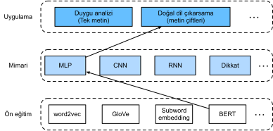

# Doğal Dil Çıkarımı: BERT İnce Ayarı
:label:`sec_natural-language-inference-bert`

Bu ünitenin önceki kısımlarında, SNLI veri kümesinde (:numref:`sec_natural-language-inference-and-dataset` içindde açıklandığı gibi) doğal dil çıkarım görevi için dikkat tabanlı bir mimari (:numref:`sec_natural-language-inference-attention` içinde) tasarladık. Şimdi BERT ince ayarı yaparak bu görevi tekrar gözden geçiriyoruz. :numref:`sec_finetuning-bert` içinde tartışıldığı gibi, doğal dil çıkarımı bir dizi düzeyinde metin çifti sınıflandırma sorunudur ve  BERT ince ayarı yalnızca :numref:`fig_nlp-map-nli-bert` içinde gösterildiği gibi ek bir MLP tabanlı mimari gerektirir. 


:label:`fig_nlp-map-nli-bert`

Bu bölümde, BERT'in önceden eğitilmiş küçük bir sürümünü indireceğiz, ardından SNLI veri kümesinde doğal dil çıkarımı için ince ayarını yapacağız.

```{.python .input}
from d2l import mxnet as d2l
import json
import multiprocessing
from mxnet import gluon, np, npx
from mxnet.gluon import nn
import os

npx.set_np()
```

```{.python .input}
#@tab pytorch
from d2l import torch as d2l
import json
import multiprocessing
import torch
from torch import nn
import os
```

## Önceden Eğitilmiş BERT'i Yükleme

BERT'i :numref:`sec_bert-dataset` ve :numref:`sec_bert-pretraining` içinde WikiText-2 veri kümelerinde nasıl ön eğitebileceğimizi açıkladık (orijinal BERT modelinin çok daha büyük külliyatlar üzerinde önceden eğitildiğini unutmayın). :numref:`sec_bert-pretraining` içinde tartışıldığı gibi, orijinal BERT modelinin yüz milyonlarca parametresi vardır. Aşağıda, önceden eğitilmiş BERT'in iki versiyonunu sunuyoruz: “bert.base” ince ayar yapmak için çok sayıda hesaplama kaynağı gerektiren orijinal BERT temel modeli kadar büyüktür, “bert.small” ise gösterimi kolaylaştırmak için küçük bir versiyondur.

```{.python .input}
d2l.DATA_HUB['bert.base'] = (d2l.DATA_URL + 'bert.base.zip',
                             '7b3820b35da691042e5d34c0971ac3edbd80d3f4')
d2l.DATA_HUB['bert.small'] = (d2l.DATA_URL + 'bert.small.zip',
                              'a4e718a47137ccd1809c9107ab4f5edd317bae2c')
```

```{.python .input}
#@tab pytorch
d2l.DATA_HUB['bert.base'] = (d2l.DATA_URL + 'bert.base.torch.zip',
                             '225d66f04cae318b841a13d32af3acc165f253ac')
d2l.DATA_HUB['bert.small'] = (d2l.DATA_URL + 'bert.small.torch.zip',
                              'c72329e68a732bef0452e4b96a1c341c8910f81f')
```

Önceden eğitilmiş BERT modeli, sözcük dağarcığını tanımlayan bir “vocab.json” dosyasını ve önceden eğitilmiş parametrelerin olduğu “pretrained.params” dosyasını içerir. Önceden eğitilmiş BERT parametrelerini yüklemek için aşağıdaki `load_pretrained_model` işlevini uyguluyoruz.

```{.python .input}
def load_pretrained_model(pretrained_model, num_hiddens, ffn_num_hiddens,
                          num_heads, num_layers, dropout, max_len, devices):
    data_dir = d2l.download_extract(pretrained_model)
    # Önceden tanımlanmış kelimeleri yüklemek için boş bir kelime
    # dağarcığı tanımla
    vocab = d2l.Vocab()
    vocab.idx_to_token = json.load(open(os.path.join(data_dir, 'vocab.json')))
    vocab.token_to_idx = {token: idx for idx, token in enumerate(
        vocab.idx_to_token)}
    bert = d2l.BERTModel(len(vocab), num_hiddens, ffn_num_hiddens, num_heads, 
                         num_layers, dropout, max_len)
    # Önceden eğitilmiş BERT parametrelerini yükle
    bert.load_parameters(os.path.join(data_dir, 'pretrained.params'),
                         ctx=devices)
    return bert, vocab
```

```{.python .input}
#@tab pytorch
def load_pretrained_model(pretrained_model, num_hiddens, ffn_num_hiddens,
                          num_heads, num_layers, dropout, max_len, devices):
    data_dir = d2l.download_extract(pretrained_model)
    # Önceden tanımlanmış kelimeleri yüklemek için boş bir kelime
    # dağarcığı tanımla
    vocab = d2l.Vocab()
    vocab.idx_to_token = json.load(open(os.path.join(data_dir, 'vocab.json')))
    vocab.token_to_idx = {token: idx for idx, token in enumerate(
        vocab.idx_to_token)}
    bert = d2l.BERTModel(len(vocab), num_hiddens, norm_shape=[256],
                         ffn_num_input=256, ffn_num_hiddens=ffn_num_hiddens,
                         num_heads=4, num_layers=2, dropout=0.2,
                         max_len=max_len, key_size=256, query_size=256,
                         value_size=256, hid_in_features=256,
                         mlm_in_features=256, nsp_in_features=256)
    # Önceden eğitilmiş BERT parametrelerini yükle
    bert.load_state_dict(torch.load(os.path.join(data_dir,
                                                 'pretrained.params')))
    return bert, vocab
```

Makinelerin çoğunda gösterimi kolaylaştırmak için, bu bölümde önceden eğitilmiş BERT'in küçük versiyonunu (“bert.small”) yükleyip ona ince ayar yapacağız. Alıştırmada, test doğruluğunu önemli ölçüde artırmak için çok daha büyük “bert.base”'in nasıl ince ayar yapılacağını göstereceğiz.

```{.python .input}
#@tab all
devices = d2l.try_all_gpus()
bert, vocab = load_pretrained_model(
    'bert.small', num_hiddens=256, ffn_num_hiddens=512, num_heads=4,
    num_layers=2, dropout=0.1, max_len=512, devices=devices)
```

## BERT İnce Ayarı İçin Veri Kümesi

SNLI veri kümesinde aşağı akış görevi doğal dil çıkarımı için, özelleştirilmiş bir veri kümesi sınıfı `SNLIBERTDataset` tanımlıyoruz. Her örnekte, öncül ve hipotez bir çift metin dizisi oluşturur ve :numref:`fig_bert-two-seqs` üzerinde tasvir edildiği gibi bir BERT girdi dizisine paketlenir. Hatırlayalım; :numref:`subsec_bert_input_rep` bölüm kimlikleri bir BERT girdi dizisinde öncül ve hipotezi ayırt etmek için kullanılır. Bir BERT girdi dizisinin (`max_len`) önceden tanımlanmış maksimum uzunluğu ile, girdi metin çiftinin daha uzun olanının son belirteci, `max_len` karşılanana kadar ortadan kaldırılmaya devam eder. BERT ince ayarında SNLI veri kümesinin oluşturulmasını hızlandırmak için, paralel olarak eğitim veya test örnekleri oluşturmada 4 işçi işlem kullanıyoruz.

```{.python .input}
class SNLIBERTDataset(gluon.data.Dataset):
    def __init__(self, dataset, max_len, vocab=None):
        all_premise_hypothesis_tokens = [[
            p_tokens, h_tokens] for p_tokens, h_tokens in zip(
            *[d2l.tokenize([s.lower() for s in sentences])
              for sentences in dataset[:2]])]
        
        self.labels = np.array(dataset[2])
        self.vocab = vocab
        self.max_len = max_len
        (self.all_token_ids, self.all_segments,
         self.valid_lens) = self._preprocess(all_premise_hypothesis_tokens)
        print('read ' + str(len(self.all_token_ids)) + ' examples')

    def _preprocess(self, all_premise_hypothesis_tokens):
        pool = multiprocessing.Pool(4)  # Use 4 worker processes
        out = pool.map(self._mp_worker, all_premise_hypothesis_tokens)
        all_token_ids = [
            token_ids for token_ids, segments, valid_len in out]
        all_segments = [segments for token_ids, segments, valid_len in out]
        valid_lens = [valid_len for token_ids, segments, valid_len in out]
        return (np.array(all_token_ids, dtype='int32'),
                np.array(all_segments, dtype='int32'), 
                np.array(valid_lens))

    def _mp_worker(self, premise_hypothesis_tokens):
        p_tokens, h_tokens = premise_hypothesis_tokens
        self._truncate_pair_of_tokens(p_tokens, h_tokens)
        tokens, segments = d2l.get_tokens_and_segments(p_tokens, h_tokens)
        token_ids = self.vocab[tokens] + [self.vocab['<pad>']] \
                             * (self.max_len - len(tokens))
        segments = segments + [0] * (self.max_len - len(segments))
        valid_len = len(tokens)
        return token_ids, segments, valid_len

    def _truncate_pair_of_tokens(self, p_tokens, h_tokens):
        # BERT girdisi için '<CLS>', '<SEP>' ve '<SEP>' belirteçleri 
        # için yer ayırın
        while len(p_tokens) + len(h_tokens) > self.max_len - 3:
            if len(p_tokens) > len(h_tokens):
                p_tokens.pop()
            else:
                h_tokens.pop()

    def __getitem__(self, idx):
        return (self.all_token_ids[idx], self.all_segments[idx],
                self.valid_lens[idx]), self.labels[idx]

    def __len__(self):
        return len(self.all_token_ids)
```

```{.python .input}
#@tab pytorch
class SNLIBERTDataset(torch.utils.data.Dataset):
    def __init__(self, dataset, max_len, vocab=None):
        all_premise_hypothesis_tokens = [[
            p_tokens, h_tokens] for p_tokens, h_tokens in zip(
            *[d2l.tokenize([s.lower() for s in sentences])
              for sentences in dataset[:2]])]
        
        self.labels = torch.tensor(dataset[2])
        self.vocab = vocab
        self.max_len = max_len
        (self.all_token_ids, self.all_segments,
         self.valid_lens) = self._preprocess(all_premise_hypothesis_tokens)
        print('read ' + str(len(self.all_token_ids)) + ' examples')

    def _preprocess(self, all_premise_hypothesis_tokens):
        pool = multiprocessing.Pool(4)  # Use 4 worker processes
        out = pool.map(self._mp_worker, all_premise_hypothesis_tokens)
        all_token_ids = [
            token_ids for token_ids, segments, valid_len in out]
        all_segments = [segments for token_ids, segments, valid_len in out]
        valid_lens = [valid_len for token_ids, segments, valid_len in out]
        return (torch.tensor(all_token_ids, dtype=torch.long),
                torch.tensor(all_segments, dtype=torch.long), 
                torch.tensor(valid_lens))

    def _mp_worker(self, premise_hypothesis_tokens):
        p_tokens, h_tokens = premise_hypothesis_tokens
        self._truncate_pair_of_tokens(p_tokens, h_tokens)
        tokens, segments = d2l.get_tokens_and_segments(p_tokens, h_tokens)
        token_ids = self.vocab[tokens] + [self.vocab['<pad>']] \
                             * (self.max_len - len(tokens))
        segments = segments + [0] * (self.max_len - len(segments))
        valid_len = len(tokens)
        return token_ids, segments, valid_len

    def _truncate_pair_of_tokens(self, p_tokens, h_tokens):
        # BERT girdisi için '<CLS>', '<SEP>' ve '<SEP>' belirteçleri 
        # için yer ayırın
        while len(p_tokens) + len(h_tokens) > self.max_len - 3:
            if len(p_tokens) > len(h_tokens):
                p_tokens.pop()
            else:
                h_tokens.pop()

    def __getitem__(self, idx):
        return (self.all_token_ids[idx], self.all_segments[idx],
                self.valid_lens[idx]), self.labels[idx]

    def __len__(self):
        return len(self.all_token_ids)
```

SNLI veri kümesini indirdikten sonra, `SNLIBERTDataset` sınıfından örnek yaratarak eğitim ve test örnekleri oluşturuyoruz. Bu tür örnekler, doğal dil çıkarımlarının eğitimi ve test edilmesi sırasında minigruplarda okunacaktır.

```{.python .input}
# Yetersiz bellek hatası varsa `batch_size` değerini azaltın. Orijinal BERT 
# modelinde, `max_len` = 512'dir.
batch_size, max_len, num_workers = 512, 128, d2l.get_dataloader_workers()
data_dir = d2l.download_extract('SNLI')
train_set = SNLIBERTDataset(d2l.read_snli(data_dir, True), max_len, vocab)
test_set = SNLIBERTDataset(d2l.read_snli(data_dir, False), max_len, vocab)
train_iter = gluon.data.DataLoader(train_set, batch_size, shuffle=True,
                                   num_workers=num_workers)
test_iter = gluon.data.DataLoader(test_set, batch_size,
                                  num_workers=num_workers)
```

```{.python .input}
#@tab pytorch
# Yetersiz bellek hatası varsa `batch_size` değerini azaltın. Orijinal BERT 
# modelinde, `max_len` = 512'dir.
batch_size, max_len, num_workers = 512, 128, d2l.get_dataloader_workers()
data_dir = d2l.download_extract('SNLI')
train_set = SNLIBERTDataset(d2l.read_snli(data_dir, True), max_len, vocab)
test_set = SNLIBERTDataset(d2l.read_snli(data_dir, False), max_len, vocab)
train_iter = torch.utils.data.DataLoader(train_set, batch_size, shuffle=True,
                                   num_workers=num_workers)
test_iter = torch.utils.data.DataLoader(test_set, batch_size,
                                  num_workers=num_workers)
```

## BERT İnce Ayarı

:numref:`fig_bert-two-seqs` içinde belirtildiği gibi, doğal dil çıkarımı için BERT ince ayarı yalnızca iki tam bağlı katmandan oluşan ek bir MLP gerektirir (aşağıdaki `BERTClassifier` sınıfında `self.hidden` ve `self.output`). Bu MLP, hem öncül hem de hipotezin bilgilerini kodlayan özel “&lt;cls&gt;” belirtecinin BERT temsilini, doğal dil çıkarımının üç çıktısına dönüştürür: Gerekçe, çelişki ve tarafsızlık.

```{.python .input}
class BERTClassifier(nn.Block):
    def __init__(self, bert):
        super(BERTClassifier, self).__init__()
        self.encoder = bert.encoder
        self.hidden = bert.hidden
        self.output = nn.Dense(3)

    def forward(self, inputs):
        tokens_X, segments_X, valid_lens_x = inputs
        encoded_X = self.encoder(tokens_X, segments_X, valid_lens_x)
        return self.output(self.hidden(encoded_X[:, 0, :]))
```

```{.python .input}
#@tab pytorch
class BERTClassifier(nn.Module):
    def __init__(self, bert):
        super(BERTClassifier, self).__init__()
        self.encoder = bert.encoder
        self.hidden = bert.hidden
        self.output = nn.Linear(256, 3)

    def forward(self, inputs):
        tokens_X, segments_X, valid_lens_x = inputs
        encoded_X = self.encoder(tokens_X, segments_X, valid_lens_x)
        return self.output(self.hidden(encoded_X[:, 0, :]))
```

Aşağıda, önceden eğitilmiş BERT modeli `bert`, aşağı akış uygulaması için `BERTClassifier` örneği `net`'e beslenir. BERT ince ayarının ortak uygulamalarında, sadece ek MLP'nin (`net.output`) çıktı tabakasının parametreleri sıfırdan öğrenilecektir. Önceden eğitilmiş BERT kodlayıcısının (`net.encoder`) ve ek MLP'nin gizli katmanının (`net.hidden`) tüm parametreleri ince ayarlanacaktır.

```{.python .input}
net = BERTClassifier(bert)
net.output.initialize(ctx=devices)
```

```{.python .input}
#@tab pytorch
net = BERTClassifier(bert)
```

:numref:`sec_bert` içinde hem `MaskLM` sınıfının hem de `NextSentencePred` sınıfının konuşlanmış MLP'lerinde parametrelere sahip olduğunu hatırlayın. Bu parametreler önceden eğitilmiş `bert` BERT modelinin ve dolayısıyla `net` içindeki parametrelerin bir parçasıdır. Bununla birlikte, bu tür parametreler sadece maskeli dil modelleme kaybını ve ön eğitim sırasında bir sonraki cümle tahmini kaybını hesaplamak içindir. Bu iki kayıp işlevi, aşağı akış uygulamalarının ince ayarını yapmakla ilgisizdir, bu nedenle, BERT ince ayarı yapıldığında `MaskLM` ve `NextSentencePred`'de kullanılan MLP'lerin parametreleri güncellenmez (bozulmaz).

Dondurulmuş gradyanlara sahip parametrelere izin vermek için `ignore_stale_grad=True` işareti `d2l.train_batch_ch13`'in `step` işlevinde ayarlanır. Bu işlevi, SNLI'nin eğitim kümesini (`train_iter`) ve test kümesini (`test_iter`) kullanarak `net` modelini eğitmek ve değerlendirmek için kullanıyoruz. Sınırlı hesaplama kaynakları nedeniyle, eğitim ve test doğruluğu daha da iyileştirilebilir: Tartışmalarını alıştırmalara bırakıyoruz.

```{.python .input}
lr, num_epochs = 1e-4, 5
trainer = gluon.Trainer(net.collect_params(), 'adam', {'learning_rate': lr})
loss = gluon.loss.SoftmaxCrossEntropyLoss()
d2l.train_ch13(net, train_iter, test_iter, loss, trainer, num_epochs, devices,
               d2l.split_batch_multi_inputs)
```

```{.python .input}
#@tab pytorch
lr, num_epochs = 1e-4, 5
trainer = torch.optim.Adam(net.parameters(), lr=lr)
loss = nn.CrossEntropyLoss(reduction='none')
d2l.train_ch13(net, train_iter, test_iter, loss, trainer, num_epochs, devices)
```

## Özet

* SNLI veri kümesindeki doğal dil çıkarımı gibi aşağı akış uygulamaları için önceden eğitilmiş BERT modeline ince ayar yapabiliriz.
* İnce ayar sırasında BERT modeli aşağı akış uygulaması için modelin bir parçası haline gelir. Sadece ön eğitim kaybı ile ilgili parametreler ince ayar sırasında güncellenmeyecektir. 

## Alıştırmalar

1. Hesaplama kaynağınız izin veriyorsa, orijinal BERT temel modeli kadar büyük olan, çok daha büyük, önceden eğitilmiş BERT modeline ince ayar yapın. `load_pretrained_model` işlevinde bağımsız değişkenleri şu şekilde ayarlayın: 'bert.small' yerine 'bert.base' ile kullanın, sırasıyla `num_hiddens=256`, `ffn_num_hiddens=512`, `num_heads=4` ve `num_layers=2` ile 768, 3072, 12 ve 12 değerlerini değiştirin. İnce ayar dönemlerini artırarak (ve muhtemelen diğer hiper parametreleri ayarlayarak), 0.86'dan daha yüksek bir test doğruluğu elde edebilir misiniz?
1. Bir çift dizi uzunluk oranlarına göre nasıl budanır? Bu çift budama yöntemini ve `SNLIBERTDataset` sınıfında kullanılan yöntemi karşılaştırın. Artıları ve eksileri nelerdir?

:begin_tab:`mxnet`
[Tartışmalar](https://discuss.d2l.ai/t/397)
:end_tab:

:begin_tab:`pytorch`
[Tartışmalar](https://discuss.d2l.ai/t/1526)
:end_tab:
