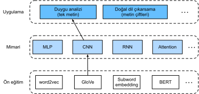
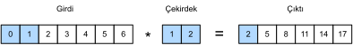
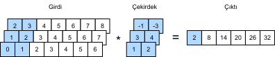
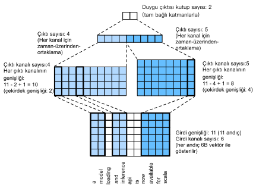

# Duygu Analizi: Evrişimli Sinir Ağlarının Kullanımı 
:label:`sec_sentiment_cnn`

:numref:`chap_cnn` içinde, bitişik pikseller gibi yerel özelliklere uygulanan iki boyutlu CNN'lerle iki boyutlu imge verilerini işlemek için mekanizmaları inceledik. Aslında bilgisayarla görme için tasarlanmış olsa da, CNN'ler doğal dil işleme için de yaygın olarak kullanılmaktadır. Basitçe söylemek gerekirse, herhangi bir metin dizisini tek boyutlu bir imge olarak düşünün. Bu şekilde, tek boyutlu CNN'ler metindeki $n$ gramlar gibi yerel özellikleri işleyebilir. 

Bu bölümde, tek metni temsil etmede bir CNN mimarisinin nasıl tasarlanacağını göstermek için *textCNN* modelini kullanacağız :cite:`Kim.2014`. Duygu analizi için GloVe ön eğitimi ile RNN mimarisi kullanan :numref:`fig_nlp-map-sa-rnn` ile karşılaştırıldığında, :numref:`fig_nlp-map-sa-cnn` mimarisindeki tek fark mimarinin seçiminde yatmaktadır.


:label:`fig_nlp-map-sa-cnn`

```{.python .input}
from d2l import mxnet as d2l
from mxnet import gluon, init, np, npx
from mxnet.gluon import nn
npx.set_np()

batch_size = 64
train_iter, test_iter, vocab = d2l.load_data_imdb(batch_size)
```

```{.python .input}
#@tab pytorch
from d2l import torch as d2l
import torch
from torch import nn

batch_size = 64
train_iter, test_iter, vocab = d2l.load_data_imdb(batch_size)
```

## Tek Boyutlu Evrişimler

Modeli tanıtmadan önce, tek boyutlu bir evrişimin nasıl çalıştığını görelim. Bunun çapraz korelasyon işlemine dayanan iki boyutlu bir evrişimin sadece özel bir durumu olduğunu unutmayın. 


:label:`fig_conv1d`

:numref:`fig_conv1d` içinde gösterildiği gibi, tek boyutlu durumda, evrişim penceresi girdi tensör boyunca soldan sağa doğru kayar. Kayma sırasında, belirli bir konumdaki evrişim penceresinde bulunan girdi alt tensör (örn. :numref:`fig_conv1d` içindeki $0$ ve $1$) ve çekirdek tensör (örneğin, :numref:`fig_conv1d` içindeki $1$ ve $2$) eleman yönlü çarpılır. Bu çarpımların toplamı, çıktı tensörünün karşılık gelen pozisyonunda tek sayıl değeri (örneğin, :numref:`fig_conv1d` içindeki $0\times1+1\times2=2$) verir. 

Aşağıdaki `corr1d` işlevinde tek boyutlu çapraz korelasyon uyguluyoruz. Bir girdi tensör `X` ve bir çekirdek tensör `K` göz önüne alındığında, `Y` çıktı tensörünü döndürür.

```{.python .input}
#@tab all
def corr1d(X, K):
    w = K.shape[0]
    Y = d2l.zeros((X.shape[0] - w + 1))
    for i in range(Y.shape[0]):
        Y[i] = (X[i: i + w] * K).sum()
    return Y
```

Yukarıdaki tek boyutlu çapraz korelasyon uygulamasının çıktısını doğrulamak için :numref:`fig_conv1d` içindeki girdi tensörü `X`'i ve çekirdek tensörü `K`'yi oluşturabiliriz.

```{.python .input}
#@tab all
X, K = d2l.tensor([0, 1, 2, 3, 4, 5, 6]), d2l.tensor([1, 2])
corr1d(X, K)
```

Birden çok kanallı tek boyutlu girdi için, evrişim çekirdeğinin aynı sayıda girdi kanalına sahip olması gerekir. Ardından, her kanal için, tek boyutlu çıktı tensörünü üretmek için tüm kanallar üzerindeki sonuçları toplayarak, girdinin tek boyutlu tensörü ve evrişim çekirdeğinin tek boyutlu tensörü üzerinde bir çapraz korelasyon işlemi gerçekleştirilir. :numref:`fig_conv1d_channel` 3 adet girdi kanalıyla tek boyutlu çapraz korelasyon işlemini gösterir.


:label:`fig_conv1d_channel`

Birden fazla girdi kanalı için tek boyutlu çapraz korelasyon işlemini uygulayabilir ve :numref:`fig_conv1d_channel` içindeki sonuçları doğrulayabiliriz.

```{.python .input}
#@tab all
def corr1d_multi_in(X, K):
    # İlk olarak, `X` ve `K`'nin 0. boyutu (kanal boyutu) boyunca yineleyin. 
    # Ardından, bunları toplayın
    return sum(corr1d(x, k) for x, k in zip(X, K))

X = d2l.tensor([[0, 1, 2, 3, 4, 5, 6],
              [1, 2, 3, 4, 5, 6, 7],
              [2, 3, 4, 5, 6, 7, 8]])
K = d2l.tensor([[1, 2], [3, 4], [-1, -3]])
corr1d_multi_in(X, K)
```

Çoklu girdi kanallı tek boyutlu çapraz korelasyonların, tek girdi kanallı iki boyutlu çapraz korelasyonlara eşdeğer olduğuna dikkat edin. Göstermek için, :numref:`fig_conv1d_channel` içindeki çoklu girdi kanallı tek boyutlu çapraz korelasyonun eşdeğer bir formu, :numref:`fig_conv1d_2d` içindeki tek girdi kanallı iki boyutlu çapraz korelasyondur; burada evrişim çekirdeğinin yüksekliği girdi tensörünküyle aynı olmalıdır. 


:label:`fig_conv1d_2d`

:numref:`fig_conv1d` ve :numref:`fig_conv1d_channel` içindeki her iki çıktıda da yalnızca bir kanal vardır. :numref:`subsec_multi-output-channels` içinde açıklanan çoklu çıktı kanallarına sahip iki boyutlu evrişimlerle aynı şekilde, tek boyutlu evrişimler için de çoklu çıktılı kanallar belirtebiliriz. 

## Zaman Üzerinden Maksimum Ortaklama

Benzer şekilde, zaman adımları boyunca en önemli öznitelik olarak dizi temsillerinden en yüksek değeri çıkarmak için ortaklamayı kullanabiliriz. textCNN'de kullanılan *zaman üzerinden maksimum ortaklama*, tek boyutlu küresel maksimum ortaklama gibi çalışır :cite:`Collobert.Weston.Bottou.ea.2011`. Her kanalın farklı zaman adımlarında değerleri depoladığı çok kanallı bir girdi için, her kanaldaki çıktı o kanal için maksimum değerdir. Zaman üzerinden maksimum ortaklamanın, farklı kanallarda farklı sayıda zaman adımına izin verdiğini unutmayın.

## TextCNN Modeli

Tek boyutlu evrişim ve zaman üzerinden maksimum ortaklama kullanarak, textCNN modeli girdi olarak önceden eğitilmiş bireysel belirteç temsillerini alır, sonra aşağı akış uygulama için dizi temsillerini elde eder ve dönüştürür. 

$d$ boyutlu vektörlerle temsil edilen $n$ belirteci olan tek bir metin dizisi için girdi tensörünün kanal genişliği, yüksekliği ve sayısı sırasıyla $n$, $1$ ve $d$'dir. textCNN modeli, girdiyi çıktıya aşağıdaki gibi dönüştürür: 

1. Birden çok tek boyutlu evrişim çekirdeğini tanımlar ve girdiler üzerinde ayrı olarak evrişim işlemlerini gerçekleştirir. Farklı genişliklere sahip evrişim çekirdekleri, farklı sayıdaki bitişik belirteçler arasındaki yerel öznitelikleri yakalayabilir.
1. Tüm çıktı kanallarında zaman üzerinden maksimum ortaklama gerçekleştirin ve ardından tüm skaler ortaklama çıktılarını bir vektör olarak bitiştirin.
1. Tam bağlı katmanı kullanarak bitiştirilmiş vektörü çıktı kategorilerine dönüştürün. Hattan düşürme, aşırı öğrenmeyi azaltmak için kullanılabilir.


:label:`fig_conv1d_textcnn`

:numref:`fig_conv1d_textcnn`, textCNN'in model mimarisini somut bir örnekle göstermektedir. Girdi, her belirtecin 6 boyutlu vektörlerle temsil edildiği 11 belirteçli bir cümledir. Bu yüzden genişliği 11 olan 6 kanallı bir girdiye sahibiz. Sırasıyla 4 ve 5 çıktı kanalı ile 2 ve 4 genişliklerindeki iki tek boyutlu evrişim çekirdeğini tanımlayın. $11-2+1=10$ genişliğinde 4 çıktı kanalı ve $11-4+1=8$ genişliğinde 5 çıktı kanalı üretirler. Bu 9 kanalın farklı genişliklerine rağmen, zaman üzerinden maksimum ortaklama, bitiştirilmiş 9 boyutlu bir vektör verir ve bu da en sonunda ikili duygu tahminleri için 2 boyutlu bir çıktı vektörüne dönüştürülür.

### Modeli Tanımlama

textCNN modelini aşağıdaki sınıfta uyguluyoruz. :numref:`sec_sentiment_rnn` içindeki çift yönlü RNN modeliyle karşılaştırıldığında, yinelemeli katmanları evrişimli katmanlarla değiştirmenin yanı sıra, iki gömme katmanı da kullanıyoruz: Biri eğitilebilir ağırlıklara ve diğeri sabit ağırlıklara sahiptir.

```{.python .input}
class TextCNN(nn.Block):
    def __init__(self, vocab_size, embed_size, kernel_sizes, num_channels,
                 **kwargs):
        super(TextCNN, self).__init__(**kwargs)
        self.embedding = nn.Embedding(vocab_size, embed_size)
        # Eğitilmeyecek gömme katmanı
        self.constant_embedding = nn.Embedding(vocab_size, embed_size)
        self.dropout = nn.Dropout(0.5)
        self.decoder = nn.Dense(2)
        # Zaman üzerinden maksimum ortaklama katmanının parametresi yoktur, 
        # bu nedenle bu örnek paylaşılabilir
        self.pool = nn.GlobalMaxPool1D()
        # Birden çok tek boyutlu evrişim katmanı oluşturun
        self.convs = nn.Sequential()
        for c, k in zip(num_channels, kernel_sizes):
            self.convs.add(nn.Conv1D(c, k, activation='relu'))

    def forward(self, inputs):
        # Vektörler boyunca (iş boyutu, belirteç sayısı, belirteç vektör
        # boyutu) şekilli iki gömme katmanı çıktısını bitiştirin
        embeddings = np.concatenate((
            self.embedding(inputs), self.constant_embedding(inputs)), axis=2)
        # Tek boyutlu evrişimli katmanların girdi formatına göre, tensörü 
        # yeniden düzenleyin, böylece ikinci boyut kanalları depolar
        embeddings = embeddings.transpose(0, 2, 1)
        # Her bir tek boyutlu evrişim katmanı için, maksimum zaman üzerinden 
        # ortaklamadan sonra, (iş boyutu, kanal sayısı, 1) şekilli bir tensör 
        # elde edilir. Son boyutu kaldırın ve kanallar boyunca bitiştirin.
        encoding = np.concatenate([
            np.squeeze(self.pool(conv(embeddings)), axis=-1)
            for conv in self.convs], axis=1)
        outputs = self.decoder(self.dropout(encoding))
        return outputs
```

```{.python .input}
#@tab pytorch
class TextCNN(nn.Module):
    def __init__(self, vocab_size, embed_size, kernel_sizes, num_channels,
                 **kwargs):
        super(TextCNN, self).__init__(**kwargs)
        self.embedding = nn.Embedding(vocab_size, embed_size)
        # Eğitilmeyecek gömme katmanı
        self.constant_embedding = nn.Embedding(vocab_size, embed_size)
        self.dropout = nn.Dropout(0.5)
        self.decoder = nn.Linear(sum(num_channels), 2)
        # Zaman üzerinden maksimum ortaklama katmanının parametresi yoktur, 
        # bu nedenle bu örnek paylaşılabilir
        self.pool = nn.AdaptiveAvgPool1d(1)
        self.relu = nn.ReLU()
        # Birden çok tek boyutlu evrişim katmanı oluşturun
        self.convs = nn.ModuleList()
        for c, k in zip(num_channels, kernel_sizes):
            self.convs.append(nn.Conv1d(2 * embed_size, c, k))

    def forward(self, inputs):
        # Vektörler boyunca (iş boyutu, belirteç sayısı, belirteç vektör
        # boyutu) şekilli iki gömme katmanı çıktısını bitiştirin
        embeddings = torch.cat((
            self.embedding(inputs), self.constant_embedding(inputs)), dim=2)
        # Tek boyutlu evrişimli katmanların girdi formatına göre, tensörü 
        # yeniden düzenleyin, böylece ikinci boyut kanalları depolar
        embeddings = embeddings.permute(0, 2, 1)
        # Her bir tek boyutlu evrişim katmanı için, maksimum zaman üzerinden 
        # ortaklamadan sonra, (iş boyutu, kanal sayısı, 1) şekilli bir tensör 
        # elde edilir. Son boyutu kaldırın ve kanallar boyunca bitiştirin.
        encoding = torch.cat([
            torch.squeeze(self.relu(self.pool(conv(embeddings))), dim=-1)
            for conv in self.convs], dim=1)
        outputs = self.decoder(self.dropout(encoding))
        return outputs
```

Bir textCNN örneği oluşturalım. 3, 4 ve 5 çekirdek genişliklerine sahip 3 adet evrişimli katmana sahiptir ve hepsinde 100 çıktı kanalı bulunur.

```{.python .input}
embed_size, kernel_sizes, nums_channels = 100, [3, 4, 5], [100, 100, 100]
devices = d2l.try_all_gpus()
net = TextCNN(len(vocab), embed_size, kernel_sizes, nums_channels)
net.initialize(init.Xavier(), ctx=devices)
```

```{.python .input}
#@tab pytorch
embed_size, kernel_sizes, nums_channels = 100, [3, 4, 5], [100, 100, 100]
devices = d2l.try_all_gpus()
net = TextCNN(len(vocab), embed_size, kernel_sizes, nums_channels)

def init_weights(m):
    if type(m) in (nn.Linear, nn.Conv1d):
        nn.init.xavier_uniform_(m.weight)

net.apply(init_weights);
```

### Önceden Eğitilmiş Sözcük Vektörlerini Yükleme

:numref:`sec_sentiment_rnn` ile aynı şekilde, önceden eğitilmiş 100 boyutlu GloVe gömme yerleştirmelerini, ilkletilmiş belirteç temsilleri olarak yükleriz. Bu belirteç temsilleri (gömme ağırlıkları) `embedding`'da eğitilecek ve `constant_embedding`'te sabitlenecektir.

```{.python .input}
glove_embedding = d2l.TokenEmbedding('glove.6b.100d')
embeds = glove_embedding[vocab.idx_to_token]
net.embedding.weight.set_data(embeds)
net.constant_embedding.weight.set_data(embeds)
net.constant_embedding.collect_params().setattr('grad_req', 'null')
```

```{.python .input}
#@tab pytorch
glove_embedding = d2l.TokenEmbedding('glove.6b.100d')
embeds = glove_embedding[vocab.idx_to_token]
net.embedding.weight.data.copy_(embeds)
net.constant_embedding.weight.data.copy_(embeds)
net.constant_embedding.weight.requires_grad = False
```

### Model Eğitimi ve Değerlendirilmesi

Şimdi textCNN modelini duygu analizi için eğitebiliriz.

```{.python .input}
lr, num_epochs = 0.001, 5
trainer = gluon.Trainer(net.collect_params(), 'adam', {'learning_rate': lr})
loss = gluon.loss.SoftmaxCrossEntropyLoss()
d2l.train_ch13(net, train_iter, test_iter, loss, trainer, num_epochs, devices)
```

```{.python .input}
#@tab pytorch
lr, num_epochs = 0.001, 5
trainer = torch.optim.Adam(net.parameters(), lr=lr)
loss = nn.CrossEntropyLoss(reduction="none")
d2l.train_ch13(net, train_iter, test_iter, loss, trainer, num_epochs, devices)
```

Aşağıda iki basit cümlede duygu tahmini için eğitilmiş model kullanıyoruz.

```{.python .input}
#@tab all
d2l.predict_sentiment(net, vocab, 'this movie is so great')
```

```{.python .input}
#@tab all
d2l.predict_sentiment(net, vocab, 'this movie is so bad')
```

## Özet

* Tek boyutlu CNN'ler metinlerdeki $n$-gramlar gibi yerel öznitelikleri işleyebilir.
* Çoklu girdi kanallı tek boyutlu çapraz korelasyonlar, tek girdi kanallı iki boyutlu çapraz korelasyonlara eşdeğerdir.
* Zaman üzerinden maksimum ortaklama, farklı kanallarda farklı sayıda zaman adımına olanak tanır.
* textCNN modeli, tek boyutlu evrişimli katmanları ve zaman üzerinden maksimum ortaklama katmanları kullanarak tek tek belirteç temsillerini aşağı akış uygulama çıktılarına dönüştürür.

## Alıştırmalar

1. Hiper parametreleri ayarlayın ve duygu analizi için iki mimariyi, :numref:`sec_sentiment_rnn` içindeki ve bu bölümdeki, örneğin sınıflandırma doğruluğu ve hesaplama verimliliği gibi, karşılaştırın.
1. :numref:`sec_sentiment_rnn` alıştırmalarında tanıtılan yöntemleri kullanarak modelin sınıflandırma doğruluğunu daha da iyileştirebilir misiniz?
1. Girdi temsillerine konumsal kodlama ekleyin. Sınıflandırma doğruluğunu arttırıyor mu?

:begin_tab:`mxnet`
[Tartışmalar](https://discuss.d2l.ai/t/393)
:end_tab:

:begin_tab:`pytorch`
[Tartışmalar](https://discuss.d2l.ai/t/1425)
:end_tab:
