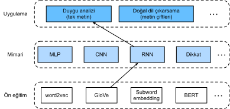

# Duygu Analizi: Yinemeli Sinir Ağlarının Kullanımı
:label:`sec_sentiment_rnn`

Kelime benzerliği ve benzetme görevleri gibi, biz de duygu analizine önceden eğitilmiş kelime vektörleri de uygulayabiliriz. :numref:`sec_sentiment` içindeki IMDb inceleme veri kümesi çok büyük olmadığından, büyük ölçekli külliyat üzerinde önceden eğitilmiş metin temsillerinin kullanılması modelin aşırı öğrenmesini azaltabilir. :numref:`fig_nlp-map-sa-rnn` içinde gösterilen özel bir örnek olarak, önceden eğitilmiş GloVe modelini kullanarak her belirteci temsil edeceğiz ve bu belirteç temsillerini metin dizisi gösterimini, ki duygu analizi çıktılarına dönüştürülecektir, elde etmek için çok katmanlı çift yönlü bir RNN'ye besleyeceğiz :cite:`Maas.Daly.Pham.ea.2011`. Aynı aşağı akım uygulaması için daha sonra farklı bir mimari seçimi ele alacağız.


:label:`fig_nlp-map-sa-rnn`

```{.python .input}
from d2l import mxnet as d2l
from mxnet import gluon, init, np, npx
from mxnet.gluon import nn, rnn
npx.set_np()

batch_size = 64
train_iter, test_iter, vocab = d2l.load_data_imdb(batch_size)
```

```{.python .input}
#@tab pytorch
from d2l import torch as d2l
import torch
from torch import nn

batch_size = 64
train_iter, test_iter, vocab = d2l.load_data_imdb(batch_size)
```

## RNN'lerle Tek Metni Temsil Etme

Duygu analizi gibi metin sınıflandırmalarında, değişen uzunluktaki bir metin dizisi sabit uzunlukta kategorilere dönüştürülür. Aşağıdaki `BiRNN` sınıfında, bir metin dizisinin her belirteci, gömme katman (`self.embedding`) aracılığıyla bireysel önceden eğitilmiş GloVe temsilini alırken, tüm dizi çift yönlü RNN (`self.encoder`) ile kodlanır. Daha somut olarak, iki yönlü LSTM'nin hem ilk hem de son zaman adımlarındaki gizli durumları (son katmanda), metin dizisinin temsili olarak bitiştirilir. Bu tek metin gösterimi daha sonra iki çıktıya ("pozitif" ve "negatif") sahip tam bağlı bir katman (`self.encoder`) tarafından çıktı kategorilerine dönüştürülür.

```{.python .input}
class BiRNN(nn.Block):
    def __init__(self, vocab_size, embed_size, num_hiddens,
                 num_layers, **kwargs):
        super(BiRNN, self).__init__(**kwargs)
        self.embedding = nn.Embedding(vocab_size, embed_size)
        # Çift yönlü bir RNN elde etmek için `bidirectional` (çift yönlü)
        # öğesini True olarak ayarlayın
        self.encoder = rnn.LSTM(num_hiddens, num_layers=num_layers,
                                bidirectional=True, input_size=embed_size)
        self.decoder = nn.Dense(2)

    def forward(self, inputs):
        # `inputs` şekli (parti boyutu, zaman adımı sayısı)'dır. LSTM,
        # girdisinin ilk boyutunun zamansal boyut olmasını gerektirdiğinden, 
        # girdi, belirteç temsilleri elde edilmeden önce değiştirilir. Çıktı 
        # şekli (zaman adımı sayısı, iş boyutu, kelime vektör boyutu)
        embeddings = self.embedding(inputs.T)
        # Farklı zaman adımlarında son gizli katmanın gizli durumlarını 
        # döndürür. `outputs` şekli 
        # (zaman adımı sayısı, iş boyutu, 2 * gizli birim sayısı)'dır.
        outputs = self.encoder(embeddings)
        # Tam bağlı katmanın girdisi olarak ilk ve son zaman adımlarında gizli 
        # durumları bitiştirin. 
        # Şekli (parti boyutu, 4 * gizli birim sayısı)'dır
        encoding = np.concatenate((outputs[0], outputs[-1]), axis=1)
        outs = self.decoder(encoding)
        return outs
```

```{.python .input}
#@tab pytorch
class BiRNN(nn.Module):
    def __init__(self, vocab_size, embed_size, num_hiddens,
                 num_layers, **kwargs):
        super(BiRNN, self).__init__(**kwargs)
        self.embedding = nn.Embedding(vocab_size, embed_size)
        # Çift yönlü bir RNN elde etmek için `bidirectional` (çift yönlü)
        # öğesini True olarak ayarlayın
        self.encoder = nn.LSTM(embed_size, num_hiddens, num_layers=num_layers,
                                bidirectional=True)
        self.decoder = nn.Linear(4 * num_hiddens, 2)

    def forward(self, inputs):
        # `inputs` şekli (parti boyutu, zaman adımı sayısı)'dır. LSTM,
        # girdisinin ilk boyutunun zamansal boyut olmasını gerektirdiğinden, 
        # girdi, belirteç temsilleri elde edilmeden önce değiştirilir. Çıktı 
        # şekli (zaman adımı sayısı, parti boyutu, kelime vektör boyutu)
        embeddings = self.embedding(inputs.T)
        self.encoder.flatten_parameters()
        # Farklı zaman adımlarında son gizli katmanın gizli durumlarını 
        # döndürür. `outputs` şekli 
        # (zaman adımı sayısı, iş boyutu, 2 * gizli birim sayısı)'dır.
        outputs, _ = self.encoder(embeddings)
        # Tam bağlı katmanın girdisi olarak ilk ve son zaman adımlarında gizli 
        # durumları bitiştirin. 
        # Şekli (parti boyutu, 4 * gizli birim sayısı)'dır
        encoding = torch.cat((outputs[0], outputs[-1]), dim=1)
        outs = self.decoder(encoding)
        return outs
```

Duygu analizi için tek bir metni temsil etmek üzere iki gizli katman içeren çift yönlü bir RNN oluşturalım.

```{.python .input}
#@tab all
embed_size, num_hiddens, num_layers, devices = 100, 100, 2, d2l.try_all_gpus()
net = BiRNN(len(vocab), embed_size, num_hiddens, num_layers)
```

```{.python .input}
net.initialize(init.Xavier(), ctx=devices)
```

```{.python .input}
#@tab pytorch
def init_weights(m):
    if type(m) == nn.Linear:
        nn.init.xavier_uniform_(m.weight)
    if type(m) == nn.LSTM:
        for param in m._flat_weights_names:
            if "weight" in param:
                nn.init.xavier_uniform_(m._parameters[param])
net.apply(init_weights);
```

## Önceden Eğitilmiş Sözcük Vektörlerini Yükleme

Aşağıda önceden eğitilmiş 100 boyutlu (`embed_size` ile tutarlı olması gerekir) kelime dağarcığındaki belirteçler için GloVe gömmelerini yüklüyoruz.

```{.python .input}
#@tab all
glove_embedding = d2l.TokenEmbedding('glove.6b.100d')
```

Kelime dağarcığındaki tüm belirteçler için vektörlerin şeklini yazdırın.

```{.python .input}
#@tab all
embeds = glove_embedding[vocab.idx_to_token]
embeds.shape
```

Bu önceden eğitilmiş kelime vektörlerini incelemelerde belirteçleri temsil etmek için kullanıyoruz ve eğitim sırasında bu vektörleri güncellemeyeceğiz.

```{.python .input}
net.embedding.weight.set_data(embeds)
net.embedding.collect_params().setattr('grad_req', 'null')
```

```{.python .input}
#@tab pytorch
net.embedding.weight.data.copy_(embeds)
net.embedding.weight.requires_grad = False
```

## Model Eğitimi ve Değerlendirilmesi

Şimdi çift yönlü RNN'leri duygu analizi için eğitebiliriz.

```{.python .input}
lr, num_epochs = 0.01, 5
trainer = gluon.Trainer(net.collect_params(), 'adam', {'learning_rate': lr})
loss = gluon.loss.SoftmaxCrossEntropyLoss()
d2l.train_ch13(net, train_iter, test_iter, loss, trainer, num_epochs, devices)
```

```{.python .input}
#@tab pytorch
lr, num_epochs = 0.01, 5
trainer = torch.optim.Adam(net.parameters(), lr=lr)
loss = nn.CrossEntropyLoss(reduction="none")
d2l.train_ch13(net, train_iter, test_iter, loss, trainer, num_epochs, devices)
```

Eğitimli modeli, `net`, kullanarak bir metin dizisinin duygusunu tahmin etmek için aşağıdaki işlevi tanımlıyoruz.

```{.python .input}
#@save
def predict_sentiment(net, vocab, sequence):
    """Bir metin dizisinin duygusunu tahmin edin."""
    sequence = np.array(vocab[sequence.split()], ctx=d2l.try_gpu())
    label = np.argmax(net(sequence.reshape(1, -1)), axis=1)
    return 'positive' if label == 1 else 'negative'
```

```{.python .input}
#@tab pytorch
#@save
def predict_sentiment(net, vocab, sequence):
    """Bir metin dizisinin duygusunu tahmin edin."""
    sequence = torch.tensor(vocab[sequence.split()], device=d2l.try_gpu())
    label = torch.argmax(net(sequence.reshape(1, -1)), dim=1)
    return 'positive' if label == 1 else 'negative'
```

Son olarak, iki basit cümlenin duygusunu tahmin etmek için eğitimli modeli kullanalım.

```{.python .input}
#@tab all
predict_sentiment(net, vocab, 'this movie is so great')
```

```{.python .input}
#@tab all
predict_sentiment(net, vocab, 'this movie is so bad')
```

## Özet

* Önceden eğitilmiş sözcük vektörleri, bir metin dizisinde tek tek belirteçleri temsil edebilir.
* Çift yönlü RNN'ler, örneğin ilk ve son zaman adımlarında gizli durumlarının bitiştirilmesi yoluyla olduğu gibi bir metin dizisini temsil edebilir. Bu tek metin gösterimi, tam bağlı bir katman kullanılarak kategorilere dönüştürülebilir.

## Alıştırmalar

1. Dönem sayısını artırın. Eğitim ve test doğruluklarını iyileştirebilir misiniz? Diğer hiper parametreleri ayarlamaya ne dersiniz?
1. 300 boyutlu GloVe gömme gibi daha büyük önceden eğitilmiş sözcük vektörlerini kullanın. Sınıflandırma doğruluğunu arttırıyor mu?
1. SpaCy andıçlamasını kullanarak sınıflandırma doğruluğunu artırabilir miyiz? SpaCy (`pip install spacy`) ve İngilizce paketini (`python -m spacy download en`) yüklemeniz gerekir. Kodda, önce spaCy'i (`import spacy`) içe aktarın. Ardından, spaCy İngilizce paketini yükleyin (`spacy_en = spacy.load('en')`). Son olarak, `def tokenizer(text): return [tok.text for tok in spacy_en.tokenizer(text)]` işlevini tanımlayın ve orijinal `tokenizer` işlevini değiştirin. GloVe ve spaCy içinde ifade belirteçlerinin farklı biçimlerine dikkat edin. Örneğin, "new york" ifade belirteci GloVe'de "new-york" biçimini ve spaCy andıçlamasından sonra "new york" biçimini alır.

:begin_tab:`mxnet`
[Tartışmalar](https://discuss.d2l.ai/t/392)
:end_tab:

:begin_tab:`pytorch`
[Tartışmalar](https://discuss.d2l.ai/t/1424)
:end_tab:
