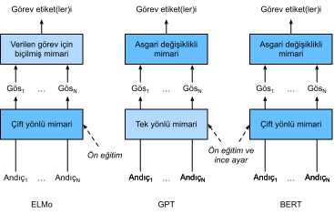
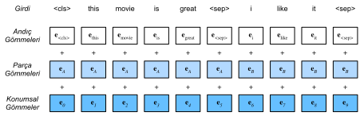

# Dönüştürücülerden Çift Yönlü Kodlayıcı Temsiller (BERT)
:label:`sec_bert`

Doğal dil anlama için çeşitli kelime gömme modelleri tanıttık. Ön eğitim sonrasında çıktı, her satırın önceden tanımlanmış bir sözcük dağarcığını temsil eden bir vektör olduğu bir matris olarak düşünülebilir. Aslında, bu kelime gömme modellerinin tümü *bağlam bağımsız*dır. Bu özelliği göstererek başlayalım. 

## Bağlam Bağımsızlıktan Bağlam Duyarlılığına

:numref:`sec_word2vec_pretraining` ve :numref:`sec_synonyms` içindeki deneyleri hatırlayın. Örneğin, word2vec ve GloVe her ikisi de kelimenin bağlamından bağımsız olarak (varsa) aynı önceden eğitilmiş vektörünü aynı sözcüğe atar. Resmi olarak, herhangi bir belirteç $x$'in bağlamdan bağımsız gösterimi, yalnızca $x$'i girdisi olarak alan bir $f(x)$ işlevidir. Doğal dillerde çokanlamlılık ve karmaşık anlambilim bolluğu göz önüne alındığında, bağlamdan bağımsız temsillerin bariz sınırlamaları vardır. Örneğin, “topu ateşledi” ve “topa vurdu” bağlamlarındaki “top” kelimesinin tamamen farklı anlamları vardır; bu nedenle, aynı kelimeye bağlamlara bağlı olarak farklı temsiller atanabilir. 

Bu, kelimelerin temsillerinin bağlamlarına bağlı olduğu *bağlam duyarlı* kelime temsillerinin gelişimini teşvik eder. Bu nedenle, $x$ belirtecinin bağlam duyarlı bir temsili, hem $x$'e hem de onun bağlamı $c(x)$'e bağlı olan bir $f(x, c(x))$ işlevidir. Yaygın bağlam duyarlı temsiller arasında TagLM (dil-model-artırılmış dizi etiketleyici) :cite:`Peters.Ammar.Bhagavatula.ea.2017`, CoVe (Context Vectors - Bağlam Vektörleri) :cite:`McCann.Bradbury.Xiong.ea.2017` ve ELMo (Embeddings from Language Models - Dil Modellerinden Gömmeler) :cite:`Peters.Neumann.Iyyer.ea.2018` bulunur. 

Örneğin, tüm diziyi girdi olarak alarak, ELMo, girdi dizisinden her sözcüğe bir temsil atan bir işlevdir. Özellikle, ELMo, önceden eğitilmiş çift yönlü LSTM'den tüm ara katman temsillerini çıktı temsili olarak birleştirir. Daha sonra ELMo temsili, mevcut modelde ELMo temsilini ve belirteçlerin orijinal temsilini (örneğin, Glove) bitiştirmek gibi ek özniteliklerle bir aşağı akış görevinin mevcut gözetimli modeline eklenecektir. Bir yandan, önceden eğitilmiş çift yönlü LSTM modelindeki tüm ağırlıklar ELMo temsilleri toplandıktan sonra dondurulur. Öte yandan, mevcut gözetimli model belirli bir görev için ayrıca özelleştirilmiştir. O dönemde farklı görevler için farklı en iyi modellerden yararlanarak ELMo, altı doğal dil işleme görevinde son teknolojiyi iyileştirdi: Duygu analizi, doğal dil çıkarımı, anlamsal rol etiketleme, referans çözünürlüğü, adlandırılmış varlık tanıma ve soru yanıtlama. 

## Göreve Özgülükten Görevden Bağımsızlığa

ELMo, çeşitli doğal dil işleme görevleri kümesine yönelik çözümleri önemli ölçüde geliştirmiş olsa da, her çözüm hala *göreve özgü* mimariye dayanıyor. Bununla birlikte, her doğal dil işleme görevi için belirli bir mimari oluşturmak pratik olarak aşikar değildir. GPT (Generative Pre-Training - Üretici Ön İşleme) modeli, bağlama duyarlı gösterimler :cite:`Radford.Narasimhan.Salimans.ea.2018` için genel bir *görev bağımsız* modeli tasarlama çabasını temsil eder. Bir dönüştürücü kod çözücü üzerine inşa edilen GPT, metin dizilerini temsil etmek için kullanılacak bir dil modelini ön eğitir. Bir aşağı akış göreve GPT uygulanırken, dil modelinin çıktısı görevin etiketini tahmin etmek için ek bir doğrusal çıktı katmanına beslenir. Önceden eğitilmiş modelin parametrelerini donduran ELMo ile keskin bir zıtlıkla, GPT aşağı akış görevinin gözetimli öğrenmesi sırasında önceden eğitilmiş dönüştürücü kod çözücüsündeki parametrelerin *tümünü* ince ayarlar. GPT, doğal dil çıkarımı, soru cevaplama, cümle benzerliği ve sınıflandırma gibi on iki görev üzerinde değerlendirildi ve model mimarisinde minimum değişikliklerle dokuzunda son teknolojiyi iyileştirdi. 

Bununla birlikte, dil modellerinin özbağlanımlı doğası nedeniyle, GPT sadece ileriye bakar (soldan sağa). “Banka” solundaki bağlamda duyarlı olduğu için “Para yatırmak için bankaya gittim” ve “Oturmak için banka gittim” bağlamında, farklı anlamlara sahip olsa da, GPT “banka” için aynı temsili geri dönecektir. 

## BERT: Her İki Dünyanın En İyilerini Birleştirme

Gördüğümüz gibi, ELMo bağlamı iki yönlü olarak kodlar, ancak göreve özgü mimarileri kullanır; GPT ise görevden bağımsızdır ancak bağlamı soldan sağa kodlar. Her iki dünyanın en iyilerini bir araya getiren BERT (Bidirectional Encoder Representations from Transformers - Dönüştürücülerden Çift Yönlü Kodlayıcı Temsilleri) bağlamı çift yönlü olarak kodlar :cite:`Devlin.Chang.Lee.ea.2018` ve çeşitli doğal dil işleme görevleri için minimum mimari değişiklikleri gerektirir. Önceden eğitilmiş bir dönüştürücü kodlayıcısı kullanarak BERT, çift yönlü bağlamına dayalı herhangi bir belirteci temsil edebilir. Aşağı akış görevlerinin gözetimli öğrenmesi sırasında BERT iki açıdan GPT'ye benzer. İlk olarak, BERT temsilleri, her belirteç için tahmin etmek gibi görevlerin niteliğine bağlı olarak model mimarisinde minimum değişikliklerle birlikte eklenen bir çıktı katmanına beslenecektir. İkinci olarak, önceden eğitilmiş dönüştürücü kodlayıcının tüm parametreleri ince ayarlanırken, ek çıktı katmanı sıfırdan eğitilecektir. :numref:`fig_elmo-gpt-bert`, ELMo, GPT ve BERT arasındaki farkları tasvir eder. 


:label:`fig_elmo-gpt-bert`

BERT, (i) tek metin sınıflandırması (örn. duygu analizi), (ii) metin çifti sınıflandırması (örneğin, doğal dil çıkarımı), (iii) soru yanıtlama, (iv) metin etiketleme (örneğin, adlandırılmış varlık tanıma) genel kategorilerinde on bir doğal dil işleme görevinde son teknolojiyi iyileştirdi. 2018 yılında, bağlam duyarlı ELMo'dan görev bağımsız GPT ve BERT'e kadar, doğal diller için derin temsillerin kavramsal olarak basit ama deneysel olarak güçlü ön eğitimi, çeşitli doğal dil işleme görevlerindeki çözümlerde devrim yaratmıştır. 

Bu bölümün geri kalanında BERT ön eğitimine dalacağız. Doğal dil işleme uygulamaları :numref:`chap_nlp_app` içinde açıklandığında, aşağı akış uygulamaları için BERT ince ayarını göstereceğiz.

```{.python .input}
from d2l import mxnet as d2l
from mxnet import gluon, np, npx
from mxnet.gluon import nn

npx.set_np()
```

```{.python .input}
#@tab pytorch
from d2l import torch as d2l
import torch
from torch import nn
```

## Girdi Temsili
:label:`subsec_bert_input_rep`

Doğal dil işlemede, bazı görevler (örn. duygu analizi) girdi olarak tek bir metin alırken, diğer bazı görevlerde (örneğin, doğal dil çıkarımı) girdi bir çift metin dizisidir. BERT girdi dizisi, hem tek metin hem de metin çiftlerini açıkça temsil eder. Birincisinde, BERT girdi dizisi özel sınıflandırma belirteci “&lt;cls&gt;”, bir metin dizisinin belirteçleri ve “&lt;sep&gt;” özel ayırma belirteci bitiştirilmedir. İkincisinde, BERT girdi dizisi “&lt;cls&gt;”, ilk metin dizisinin belirteçleri, “&lt;sep&gt;”, ikinci metin dizisinin belirteçleri ve “&lt;sep&gt;” bitiştirilmedir. "BERT girdi dizisi" terminolojisini diğer "diziler" türlerinden sürekli olarak ayırt edeceğiz. Örneğin, bir *BERT girdi dizisi*, bir *metin dizisi* veya iki *metin dizisi* içerebilir. 

Metin çiftlerini ayırt etmek için, öğrenilmiş bölüm gömmeleri $\mathbf{e}_A$ ve $\mathbf{e}_B$ sırasıyla birinci dizinin ve ikinci dizinin belirteç gömmelerine eklenir. Tek metin girdileri için sadece $\mathbf{e}_A$ kullanılır. 

Aşağıdaki `get_tokens_and_segments` girdi olarak bir veya iki cümle alır, daha sonra BERT girdi dizisinin belirteçlerini ve bunlara karşılık gelen bölüm kimliklerini döndürür.

```{.python .input}
#@tab all
#@save
def get_tokens_and_segments(tokens_a, tokens_b=None):
    """BERT girdi dizisinin belirteçlerini ve bunların bölüm kimliklerini alın."""
    tokens = ['<cls>'] + tokens_a + ['<sep>']
    # 0 and 1 are marking segment A and B, respectively
    segments = [0] * (len(tokens_a) + 2)
    if tokens_b is not None:
        tokens += tokens_b + ['<sep>']
        segments += [1] * (len(tokens_b) + 1)
    return tokens, segments
```

BERT, çift yönlü mimari olarak dönüştürücü kodlayıcıyı seçer. Dönüştürücü kodlayıcısında yaygın olarak, BERT girdi dizisinin her pozisyonuna konumsal gömme eklenir. Ancak, orijinal dönüştürücü kodlayıcısından farklı olan BERT, *öğrenilebilen* konumsal gömme kullanır. Özetlemek gerekirse, :numref:`fig_bert-input`, BERT girdi dizisinin gömmelerinin, belirteç gömmelerinin, bölüm gömmelerinin ve konum gömmelerinin toplamı olduğunu gösterir. 

 
:label:`fig_bert-input` 

Aşağıdaki `BERTEncoder` sınıfı :numref:`sec_transformer` içinde uygulanan gibi `TransformerEncoder` sınıfına benzer. `TransformerEncoder`'dan farklı olan `BERTEncoder`, bölüm gömme ve öğrenilebilir konumsal gömme parçaları kullanır.

```{.python .input}
#@save
class BERTEncoder(nn.Block):
    """BERT kodlayıcı."""
    def __init__(self, vocab_size, num_hiddens, ffn_num_hiddens, num_heads,
                 num_layers, dropout, max_len=1000, **kwargs):
        super(BERTEncoder, self).__init__(**kwargs)
        self.token_embedding = nn.Embedding(vocab_size, num_hiddens)
        self.segment_embedding = nn.Embedding(2, num_hiddens)
        self.blks = nn.Sequential()
        for _ in range(num_layers):
            self.blks.add(d2l.EncoderBlock(
                num_hiddens, ffn_num_hiddens, num_heads, dropout, True))
        # BERT'te konumsal gömmeler öğrenilebilir, bu nedenle yeterince 
        # uzun bir konumsal gömme parametresi oluşturuyoruz
        self.pos_embedding = self.params.get('pos_embedding',
                                             shape=(1, max_len, num_hiddens))

    def forward(self, tokens, segments, valid_lens):
        # Aşağıdaki kod parçacığında `X`'in şekli değişmeden kalır:
        # (parti boyutu, maksimum dizi uzunluğu, `num_hiddens`)
        X = self.token_embedding(tokens) + self.segment_embedding(segments)
        X = X + self.pos_embedding.data(ctx=X.ctx)[:, :X.shape[1], :]
        for blk in self.blks:
            X = blk(X, valid_lens)
        return X
```

```{.python .input}
#@tab pytorch
#@save
class BERTEncoder(nn.Module):
    """BERT kodlayıcı."""
    def __init__(self, vocab_size, num_hiddens, norm_shape, ffn_num_input,
                 ffn_num_hiddens, num_heads, num_layers, dropout,
                 max_len=1000, key_size=768, query_size=768, value_size=768,
                 **kwargs):
        super(BERTEncoder, self).__init__(**kwargs)
        self.token_embedding = nn.Embedding(vocab_size, num_hiddens)
        self.segment_embedding = nn.Embedding(2, num_hiddens)
        self.blks = nn.Sequential()
        for i in range(num_layers):
            self.blks.add_module(f"{i}", d2l.EncoderBlock(
                key_size, query_size, value_size, num_hiddens, norm_shape,
                ffn_num_input, ffn_num_hiddens, num_heads, dropout, True))
        # BERT'te konumsal gömmeler öğrenilebilir, bu nedenle yeterince 
        # uzun bir konumsal gömme parametresi oluşturuyoruz
        self.pos_embedding = nn.Parameter(torch.randn(1, max_len,
                                                      num_hiddens))

    def forward(self, tokens, segments, valid_lens):
        # Aşağıdaki kod parçacığında `X`'in şekli değişmeden kalır:
        # (parti boyutu, maksimum dizi uzunluğu, `num_hiddens`)
        X = self.token_embedding(tokens) + self.segment_embedding(segments)
        X = X + self.pos_embedding.data[:, :X.shape[1], :]
        for blk in self.blks:
            X = blk(X, valid_lens)
        return X
```

Kelime dağarcığının 10000 olduğunu varsayalım. `BERTEncoder`'in ileri çıkarımını göstermek için, bunun bir örneğini oluşturalım ve parametrelerini ilkleyelim.

```{.python .input}
vocab_size, num_hiddens, ffn_num_hiddens, num_heads = 10000, 768, 1024, 4
num_layers, dropout = 2, 0.2
encoder = BERTEncoder(vocab_size, num_hiddens, ffn_num_hiddens, num_heads,
                      num_layers, dropout)
encoder.initialize()
```

```{.python .input}
#@tab pytorch
vocab_size, num_hiddens, ffn_num_hiddens, num_heads = 10000, 768, 1024, 4
norm_shape, ffn_num_input, num_layers, dropout = [768], 768, 2, 0.2
encoder = BERTEncoder(vocab_size, num_hiddens, norm_shape, ffn_num_input,
                      ffn_num_hiddens, num_heads, num_layers, dropout)
```

`tokens`'ı, her bir belirtecin kelime dağarcığının bir indeksi olduğu, uzunluğu 8 olan 2 BERT girdi dizisi olarak tanımlarız. `BERTEncoder`'ın girdi belirteçleri (`tokens`) ile ileri çıkarımı, her belirtecin, uzunluğu `num_hiddens` hiper parametresi tarafından önceden tanımlanmış bir vektör tarafından temsil edildiği kodlanmış sonucu döndürür. Bu hiper parametre genellikle dönüştürücü kodlayıcının *gizli boyutu* (gizli birim sayısı) olarak adlandırılır.

```{.python .input}
tokens = np.random.randint(0, vocab_size, (2, 8))
segments = np.array([[0, 0, 0, 0, 1, 1, 1, 1], [0, 0, 0, 1, 1, 1, 1, 1]])
encoded_X = encoder(tokens, segments, None)
encoded_X.shape
```

```{.python .input}
#@tab pytorch
tokens = torch.randint(0, vocab_size, (2, 8))
segments = torch.tensor([[0, 0, 0, 0, 1, 1, 1, 1], [0, 0, 0, 1, 1, 1, 1, 1]])
encoded_X = encoder(tokens, segments, None)
encoded_X.shape
```

## Ön Eğitim Görevleri
:label:`subsec_bert_pretraining_tasks`

`BERTEncoder`'ın ileri çıkarımı, girdi metninin her belirteci ve eklenen özel  “&lt;cls&gt;” ve “&lt;seq&gt;” belirteçlerinin BERT temsilini verir. Ardından, BERT ön eğitimi için kayıp fonksiyonunu hesaplamak için bu temsilleri kullanacağız. Ön eğitim aşağıdaki iki görevden oluşur: Maskeli dil modelleme ve sonraki cümle tahmini. 

### Maskeli Dil Modelleme
:label:`subsec_mlm`

:numref:`sec_language_model` içinde gösterildiği gibi, bir dil modeli, sol tarafındaki bağlamı kullanarak bir belirteci öngörür. Her belirteci temsil ederken bağlamı iki yönlü olarak kodlamak için BERT, belirteçleri rastgele maskeler ve maskelenmiş belirteçleri öz gözetimli bir şekilde tahmin etmek için çift yönlü bağlamdaki belirteçleri kullanır. Bu görev *maskeli dil modeli* olarak adlandırılır. 

Bu ön eğitim görevinde, belirteçlerin %15'i tahmin için maskelenmiş belirteçler olarak rastgele seçilecektir. Etiketini kullanarak hile yapmadan maskelenmiş bir belirteci tahmin etmek için, basit bir yaklaşım, belirteci her zaman BERT girdi dizisinde özel bir “&lt;mask&gt;” belirteci ile değiştirmektir. Bununla birlikte, yapay özel belirteç “&lt;mask&gt;” asla ince ayarda görünmeyecektir. Ön eğitim ve ince ayar arasında böyle bir uyuşmazlığı önlemek için, eğer bir belirteç tahmin için maskelenmişse (örneğin, “harika” maskelenecek ve “bu film harika” olarak tahmin edilmek üzere seçilir), girdide şu şekilde değiştirilir: 

* Zamanın %80'i için özel bir “&lt;mask&gt;” belirteci ile (örneğin, “bu film harika”, “bu film &lt;mask&gt;“ olur);
* Zamanın %10'u için rastgele bir belirteç (örneğin, “bu film harika” “bu film içki” olur);
* Zamanın %10'unda değişmeyen etiket belirteci (örneğin, “bu film harika” “bu film harika” kalır).

%15'lik zamanın %10'u için rastgele bir belirteç eklendiğini unutmayın. Bu ara sıra olan gürültü, BERT'i, çift yönlü bağlam kodlamasında maskelenmiş belirtece (özellikle etiket belirteci değişmeden kaldığında) karşı daha az yanlı olmasını teşvik eder. 

BERT ön eğitiminin maskelenmiş dil modeli görevinde maskeli belirteçleri tahmin etmek için aşağıdaki `MaskLM` sınıfını uyguluyoruz. Tahmin, tek gizli katmanlı bir MLP kullanır (`self.mlp`). İleri çıkarımda, iki girdi gerekir: `BERTEncoder`'ının kodlanmış sonucu ve tahmin için belirteç konumları. Çıktı, bu pozisyonlardaki tahmin sonuçlarıdır.

```{.python .input}
#@save
class MaskLM(nn.Block):
    """BERT'in maskeli dil modeli görevi."""
    def __init__(self, vocab_size, num_hiddens, **kwargs):
        super(MaskLM, self).__init__(**kwargs)
        self.mlp = nn.Sequential()
        self.mlp.add(
            nn.Dense(num_hiddens, flatten=False, activation='relu'))
        self.mlp.add(nn.LayerNorm())
        self.mlp.add(nn.Dense(vocab_size, flatten=False))

    def forward(self, X, pred_positions):
        num_pred_positions = pred_positions.shape[1]
        pred_positions = pred_positions.reshape(-1)
        batch_size = X.shape[0]
        batch_idx = np.arange(0, batch_size)
        # Varsayalım ki `batch_size` = 2, `num_pred_positions` = 3 olsun,
        # o halde `batch_idx` `np.array([0, 0, 0, 1, 1, 1])` olur
        batch_idx = np.repeat(batch_idx, num_pred_positions)
        masked_X = X[batch_idx, pred_positions]
        masked_X = masked_X.reshape((batch_size, num_pred_positions, -1))
        mlm_Y_hat = self.mlp(masked_X)
        return mlm_Y_hat
```

```{.python .input}
#@tab pytorch
#@save
class MaskLM(nn.Module):
    """BERT'in maskeli dil modeli görevi."""
    def __init__(self, vocab_size, num_hiddens, num_inputs=768, **kwargs):
        super(MaskLM, self).__init__(**kwargs)
        self.mlp = nn.Sequential(nn.Linear(num_inputs, num_hiddens),
                                 nn.ReLU(),
                                 nn.LayerNorm(num_hiddens),
                                 nn.Linear(num_hiddens, vocab_size))

    def forward(self, X, pred_positions):
        num_pred_positions = pred_positions.shape[1]
        pred_positions = pred_positions.reshape(-1)
        batch_size = X.shape[0]
        batch_idx = torch.arange(0, batch_size)
        # Varsayalım ki `batch_size` = 2, `num_pred_positions` = 3 olsun,
        # o halde `batch_idx` `np.array([0, 0, 0, 1, 1, 1])` olur
        batch_idx = torch.repeat_interleave(batch_idx, num_pred_positions)
        masked_X = X[batch_idx, pred_positions]
        masked_X = masked_X.reshape((batch_size, num_pred_positions, -1))
        mlm_Y_hat = self.mlp(masked_X)
        return mlm_Y_hat
```

`MaskLM`'in ileri çıkarımını göstermek için, `mlm` örneğini oluşturup ilkleriz. `BERTEncoder`'in ileri çıkarımından `encoded_X`'in 2 BERT girdi dizisini temsil ettiğini hatırlayın. `mlm_positions`'i `encoded_X` BERT girdi dizisinde tahmin etmek için 3 endeksli olarak tanımlarız. `mlm`'nin ileri çıkarımı, `encoded_X`'in tüm `mlm_positions` maskeli konumlarında `mlm_Y_hat` tahmin sonuçlarını döndürür. Her tahmin için, sonucun boyutu kelime dağarcığına eşittir.

```{.python .input}
mlm = MaskLM(vocab_size, num_hiddens)
mlm.initialize()
mlm_positions = np.array([[1, 5, 2], [6, 1, 5]])
mlm_Y_hat = mlm(encoded_X, mlm_positions)
mlm_Y_hat.shape
```

```{.python .input}
#@tab pytorch
mlm = MaskLM(vocab_size, num_hiddens)
mlm_positions = torch.tensor([[1, 5, 2], [6, 1, 5]])
mlm_Y_hat = mlm(encoded_X, mlm_positions)
mlm_Y_hat.shape
```

Maskeler altında tahmin edilen `mlm_Y_hat` belirteçlerinin `mlm_Y` gerçek referans değer etiketleri ile, BERT ön eğitiminde maskeli dil modeli görevinin çapraz entropi kaybını hesaplayabiliriz.

```{.python .input}
mlm_Y = np.array([[7, 8, 9], [10, 20, 30]])
loss = gluon.loss.SoftmaxCrossEntropyLoss()
mlm_l = loss(mlm_Y_hat.reshape((-1, vocab_size)), mlm_Y.reshape(-1))
mlm_l.shape
```

```{.python .input}
#@tab pytorch
mlm_Y = torch.tensor([[7, 8, 9], [10, 20, 30]])
loss = nn.CrossEntropyLoss(reduction='none')
mlm_l = loss(mlm_Y_hat.reshape((-1, vocab_size)), mlm_Y.reshape(-1))
mlm_l.shape
```

### Sonraki Cümle Tahmini
:label:`subsec_nsp`

Maskelenmiş dil modellemesi sözcükleri temsil etmek için çift yönlü bağlamı kodlayabilse de, metin çiftleri arasındaki mantıksal ilişkiyi açıkça modellemez. BERT, iki metin dizisi arasındaki ilişkiyi anlamaya yardımcı olmak için, ön eğitimde ikili sınıflandırma görevi, *sonraki cümle tahmini* olarak değerlendirir. Ön eğitim için cümle çiftleri oluştururken, çoğu zaman "Doğru" (True) etiketi ile ardışık cümlelerdir; zamanın diğer yarısı için ikinci cümle rastgele "Yanlış" (False) etiketi ile külliyattan örneklenir. 

Aşağıdaki `NextSentencePred` sınıfı, ikinci cümlenin BERT girdi dizisindeki ilk cümlenin bir sonraki cümle olup olmadığını tahmin etmek için tek gizli katmanlı bir MLP kullanır. Dönüştürücü kodlayıcısındaki öz-dikkat nedeniyle, “&lt;cls&gt;” özel belirtecinin BERT temsili, her iki cümleyi de girdiden kodlar. Bu nedenle, MLP sınıflandırıcısının çıktı katmanı (`self.output`) girdi olarak `X`'i alır, burada `X`, girdisi kodlanmış “&lt;cls&gt;” belirteci olan MLP gizli katmanının çıktısıdır.

```{.python .input}
#@save
class NextSentencePred(nn.Block):
    """BERT'in sonraki cümle tahmini görevi."""
    def __init__(self, **kwargs):
        super(NextSentencePred, self).__init__(**kwargs)
        self.output = nn.Dense(2)

    def forward(self, X):
        # `X` shape: (batch size, `num_hiddens`)
        return self.output(X)
```

```{.python .input}
#@tab pytorch
#@save
class NextSentencePred(nn.Module):
    """BERT'in sonraki cümle tahmini görevi."""
    def __init__(self, num_inputs, **kwargs):
        super(NextSentencePred, self).__init__(**kwargs)
        self.output = nn.Linear(num_inputs, 2)

    def forward(self, X):
        # `X` shape: (batch size, `num_hiddens`)
        return self.output(X)
```

Bir `NextSentencePred` örneğinin ileri çıkarımının her BERT girdi dizisi için ikili tahminleri döndürdüğünü görebiliriz.

```{.python .input}
nsp = NextSentencePred()
nsp.initialize()
nsp_Y_hat = nsp(encoded_X)
nsp_Y_hat.shape
```

```{.python .input}
#@tab pytorch
# PyTorch by default won't flatten the tensor as seen in mxnet where, if
# flatten=True, all but the first axis of input data are collapsed together
encoded_X = torch.flatten(encoded_X, start_dim=1)
# input_shape for NSP: (batch size, `num_hiddens`)
nsp = NextSentencePred(encoded_X.shape[-1])
nsp_Y_hat = nsp(encoded_X)
nsp_Y_hat.shape
```

2 tane ikili sınıflandırmanın çapraz entropi kaybı da hesaplanabilir.

```{.python .input}
nsp_y = np.array([0, 1])
nsp_l = loss(nsp_Y_hat, nsp_y)
nsp_l.shape
```

```{.python .input}
#@tab pytorch
nsp_y = torch.tensor([0, 1])
nsp_l = loss(nsp_Y_hat, nsp_y)
nsp_l.shape
```

Yukarıda bahsedilen ön eğitim görevlerindeki tüm etiketlerin elle etiketleme çabası olmaksızın ön eğitim külliyattından zahmetsiz olarak elde edilebileceği dikkat çekicidir. Orijinal BERT, BookCorpus :cite:`Zhu.Kiros.Zemel.ea.2015` ve İngilizce Wikipedia'nin bitiştirilmesi üzerinde ön eğitilmiştir. Bu iki metin külliyatı çok büyüktür: Sırasıyla 800 milyon kelime ve 2.5 milyar kelime vardır. 

## Her Şeyleri Bir Araya Getirmek

BERT ön eğitimi yaparken, nihai kayıp fonksiyonu hem maskeli dil modelleme hem de sonraki cümle tahmini için kayıp fonksiyonlarının doğrusal bir kombinasyonudur. Artık `BERTModel` sınıfını `BERTEncoder`, `MaskLM` ve `NextSentencePred`'in üç sınıfını örnekleyerek tanımlayabiliriz. İleri çıkarım kodlanmış BERT temsilleri `encoded_X`, maskeli dil modelleme tahminleri `mlm_Y_hat` ve sonraki cümle tahminleri `nsp_Y_hat` döndürür.

```{.python .input}
#@save
class BERTModel(nn.Block):
    """BERT modeli."""
    def __init__(self, vocab_size, num_hiddens, ffn_num_hiddens, num_heads,
                 num_layers, dropout, max_len=1000):
        super(BERTModel, self).__init__()
        self.encoder = BERTEncoder(vocab_size, num_hiddens, ffn_num_hiddens,
                                   num_heads, num_layers, dropout, max_len)
        self.hidden = nn.Dense(num_hiddens, activation='tanh')
        self.mlm = MaskLM(vocab_size, num_hiddens)
        self.nsp = NextSentencePred()

    def forward(self, tokens, segments, valid_lens=None, pred_positions=None):
        encoded_X = self.encoder(tokens, segments, valid_lens)
        if pred_positions is not None:
            mlm_Y_hat = self.mlm(encoded_X, pred_positions)
        else:
            mlm_Y_hat = None
        # Bir sonraki cümle tahmini için MLP sınıflandırıcısının gizli katmanı.
        # 0, '<cls>' belirtecinin dizinidir
        nsp_Y_hat = self.nsp(self.hidden(encoded_X[:, 0, :]))
        return encoded_X, mlm_Y_hat, nsp_Y_hat
```

```{.python .input}
#@tab pytorch
#@save
class BERTModel(nn.Module):
    """BERT modeli."""
    def __init__(self, vocab_size, num_hiddens, norm_shape, ffn_num_input,
                 ffn_num_hiddens, num_heads, num_layers, dropout,
                 max_len=1000, key_size=768, query_size=768, value_size=768,
                 hid_in_features=768, mlm_in_features=768,
                 nsp_in_features=768):
        super(BERTModel, self).__init__()
        self.encoder = BERTEncoder(vocab_size, num_hiddens, norm_shape,
                    ffn_num_input, ffn_num_hiddens, num_heads, num_layers,
                    dropout, max_len=max_len, key_size=key_size,
                    query_size=query_size, value_size=value_size)
        self.hidden = nn.Sequential(nn.Linear(hid_in_features, num_hiddens),
                                    nn.Tanh())
        self.mlm = MaskLM(vocab_size, num_hiddens, mlm_in_features)
        self.nsp = NextSentencePred(nsp_in_features)

    def forward(self, tokens, segments, valid_lens=None, pred_positions=None):
        encoded_X = self.encoder(tokens, segments, valid_lens)
        if pred_positions is not None:
            mlm_Y_hat = self.mlm(encoded_X, pred_positions)
        else:
            mlm_Y_hat = None
        # Bir sonraki cümle tahmini için MLP sınıflandırıcısının gizli katmanı.
        # 0, '<cls>' belirtecinin dizinidir
        nsp_Y_hat = self.nsp(self.hidden(encoded_X[:, 0, :]))
        return encoded_X, mlm_Y_hat, nsp_Y_hat
```

## Özet

* Word2vec ve GloVe gibi sözcük gömme modelleri bağlam bağımsızdır. Aynı önceden eğitilmiş vektörü, kelimenin bağlamından bağımsız olarak (varsa) aynı sözcüğe atar. Doğal dillerde çokanlamlılık veya karmaşık anlamları iyi ele almaları zordur.
* ELMo ve GPT gibi bağlam duyarlı sözcük temsilleri için, sözcüklerin temsilleri bağlamlarına bağlıdır.
* ELMo bağlamı iki yönlü olarak kodlar ancak göreve özgü mimarileri kullanır (ancak, her doğal dil işleme görevi için belirli bir mimariyi oluşturmak pratik olarak aşikar değildir); GPT göreve özgüdür ancak bağlamı soldan sağa kodlar.
* BERT her iki dünyanın en iyilerini birleştirir: Bağlamı çift yönlü olarak kodlar ve bir çok çeşitli doğal dil işleme görevleri için asgari mimari değişiklikleri gerektirir.
* BERT girdi dizisinin gömmeleri belirteç gömme, bölüm gömme ve konumsal gömme toplamıdır.
* BERT ön eğitim iki görevden oluşur: Maskeli dil modelleme ve sonraki cümle tahmini. Birincisi, sözcükleri temsil etmek için çift yönlü bağlamı kodlayabilirken, ikincisi ise metin çiftleri arasındaki mantıksal ilişkiyi açıkça modeller.

## Alıştırmalar

1. BERT neden başarılıdır?
1. Diğer tüm şeyler eşit olunca, maskeli bir dil modeli, soldan sağa dil modelinden daha fazla veya daha az ön eğitim adımı gerektirir mi? Neden?
1. BERT'in orijinal uygulamasında `BERTEncoder` içindeki (`d2l.EncoderBlock` aracılığıyla) konumsal ileri besleme ağı da ve `MaskLM`'deki tam bağlı katman da Gauss hata doğrusal birimini (GELU) :cite:`Hendrycks.Gimpel.2016` etkinleştirme işlevi olarak kullanır. GELU ve ReLU arasındaki farkı araştırın.

:begin_tab:`mxnet`
[Tartışmalar](https://discuss.d2l.ai/t/388)
:end_tab:

:begin_tab:`pytorch`
[Tartışmalar](https://discuss.d2l.ai/t/1490)
:end_tab:
