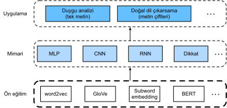

# Doğal Dil İşleme: Ön Eğitim
:label:`chap_nlp_pretrain`

İnsanların iletişim kurması gerekir. İnsan durumunun bu temel ihtiyacı dışında, günlük olarak çok miktarda yazılı metin oluşturulmuştur. Sosyal medyadaki, sohbet uygulamalarındaki, e-postalardaki, ürün incelemelerindeki, haber makalelerindeki, araştırma kağıtlarındaki ve kitaplardaki zengin metinler göz önüne alındığında, yardım sunmak veya insan dillerine dayalı kararlar vermek için bilgisayarların onları anlamasını sağlamak hayati hale gelir. 

*Doğal dil işleme* doğal dilleri kullanarak bilgisayarlar ve insanlar arasındaki etkileşimleri inceler.
Uygulamada, :numref:`sec_language_model` içindeki dil modelleri ve :numref:`sec_machine_translation` içindeki makine çevirisi modelleri gibi metin (insan doğal dili) verilerini işlemek ve analiz etmek için doğal dil işleme tekniklerinin kullanılması çok yaygındır. 

Metni anlamak için, temsillerini öğrenerek başlayabiliriz. Büyük metin kaynaklarındaki mevcut metin dizileri yararlanarak,
*öz gözetimli öğrenme*, metnin bazı gizli kısımlarını çevreleyen metnin başka bir kısmını kullanarak tahmin etmek gibi, metin temsillerini önceden eğitmek için yaygın olarak kullanılmıştır. Bu şekilde modeller, *pahalı* etiketleme çabaları olmadan *kitle* metin verilerinden gözetim yoluyla öğrenirler! 

Bu bölümde göreceğimiz gibi, her kelimeyi veya alt kelimeyi bireysel bir belirteç olarak ele alırken, her belirtecin temsili, word2vec, GloVe veya alt kelime gömme modellerini büyük metin kaynakları üzerinde kullanılarak önceden eğitilebilir. Ön eğitim sonrasında, her belirteçin temsili bir vektör olabilir, ancak bağlam ne olursa olsun aynı kalır. Örneğin, “banka” vektör temsili “biraz para yatırmak için bankaya git” ve “oturmak için banka git” de aynıdır. Böylece, daha birçok yeni ön eğitim modeli, aynı belirteçin temsilini farklı bağlamlara uyarlar. Bunların arasında, dönüştürücü (transformer) kodlayıcısına dayanan çok daha derin bir öz gözetimli model olan BERT vardır. Bu bölümde, :numref:`fig_nlp-map-pretrain` figüründe vurgulandığı gibi, metin için bu tür temsillerin nasıl ön eğitileceğine odaklanacağız. 


:label:`fig_nlp-map-pretrain`

Büyük resmin görünmesi için, :numref:`fig_nlp-map-pretrain` önceden eğitilmiş metin temsillerinin farklı akışaşağı doğal dil işleme uygulamaları için çeşitli derin öğrenme mimarilerine beslenebileceğini göstermektedir. Onları :numref:`chap_nlp_app` içinde ele alacağız.

```toc
:maxdepth: 2

word2vec
approx-training
word-embedding-dataset
word2vec-pretraining
glove
subword-embedding
similarity-analogy
bert
bert-dataset
bert-pretraining
```
