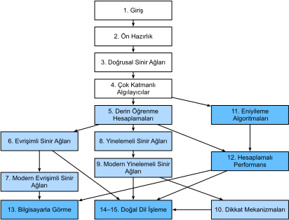

# Önsöz

Sadece birkaç yıl öncesi kadar, büyük şirket ve girişimlerde akıllı ürün ve hizmetler geliştiren ve derin öğrenme uzmanlarından oluşan birimler yoktu. Biz bu alana girdiğimizde, makine öğrenmesi günlük gazetelerde manşetlere çıkmıyordu. Ebeveynlerimizin, bırakın onu neden tıpta veya hukukta bir kariyere tercih ettiğimizi, makine öğrenmesinin ne olduğuna dair hiçbir fikri yoktu. Makine öğrenmesi endüstriyel önemi gerçek dünyada, konuşma tanıma ve bilgisayarlı görme dahil, dar uygulama alanlı ileriye dönük bir akademik disiplindi. Dahası, bu uygulamaların birçoğu o kadar çok alan bilgisi gerektiriyordu ki, makine öğrenmesi küçük bir bileşeni olan tamamen ayrı alanlar olarak kabul ediliyorlardı. O zamanlar sinir ağları, bu kitapta odaklandığımız derin öğrenme yöntemlerinin ataları, genel olarak modası geçmiş araçlar olarak görülüyordu.

Sadece son beş yılda, derin öğrenme dünyayı şaşırttı ve bilgisayarla görme, doğal dil işleme, otomatik konuşma tanıma, pekiştirici öğrenme ve biyomedikal bilişim gibi farklı alanlarda hızlı ilerleme sağladı. Ayrıca, derin öğrenmenin pek çok pratik ilgi gerektiren işteki başarısı, teorik makine öğrenmesi ve istatistikteki gelişmeleri bile hızlandırdı. Elimizdeki bu ilerlemelerle, artık kendilerini her zamankinden daha fazla otonomlukla (ve bazı şirketlerin sizi inandırdığından daha az otonomlukla) kullanan otomobiller, standart e-postaları otomatik olarak hazırlayıp insanların devasa büyüklükteki e-posta kutularından kurtulmalarını sağlayan akıllı yanıt sistemleri ve go gibi masa oyunlarında dünyanın en iyi insanlarına hükmeden yazılımlar -ki bir zamanlar onlarca yıl uzakta bir özellik olarak tahmin ediliyordu- üretebiliyoruz. Bu araçlar endüstri ve toplum üzerinde şimdiden geniş etkiler yaratıyor, filmlerin yapılma şeklini değiştiriyor, hastalıklar teşhis ediyor ve temel bilimlerde, astrofizikten biyolojiye kadar, büyüyen bir rol oynuyor.


## Bu Kitap Hakkında

Bu kitap, derin öğrenmeyi ulaşılabilir yapma girişimimizi temsil eder, size *kavramları*, *bağlamı* ve *kodu* öğretir.


### Kod, Matematik ve HTML'yi Bir Araya Getirme

Herhangi bir bilgi işlem teknolojisinin tam etkinliğine ulaşması için, iyi anlaşılmış, iyi belgelenmiş, olgun ve güncellenen araçlarla desteklenmesi gerekir. Anahtar fikirler açıkça damıtılmalı ve yeni uygulama geliştiricileri güncel hale getirmek için gereken işi öğrenme süresi en aza indirilmelidir. Olgun kütüphaneler ortak görevleri otomatikleştirmeli ve örnek kod uygulama geliştiricilerin ortak uygulamaları ihtiyaçlarına göre değiştirmesini ve yeni özellikler eklemesini kolaylaştırmalıdır. Dinamik web uygulamalarını örnek olarak alalım. 1990'larda başarılı veritabanı temelli web uygulamaları geliştiren, Amazon gibi, çok sayıda şirket olmasına rağmen, bu teknolojinin yaratıcı girişimcilere yardım etme potansiyeli, güçlü ve iyi belgelenmiş altyapıların geliştirilmesi sayesinde son on yılda çok daha büyük oranda gerçekleşti.

Derin öğrenmenin potansiyelini test ederken, çeşitli disiplinler bir araya geldiği için zorluklarla karşılaşabilirsiniz.
Derin öğrenmeyi uygulamak aynı anda
(i) belirli bir problemi belirli bir şekilde çözme motivasyonlarını
(ii) belli bir modelin matematiksel formu
(iii) modellerin verilere uyumu (fitting) için kullanılan optimizasyon algoritmalarını
(iv) modellerimizin görünmeyen verilere genellenmesini ne zaman beklememiz gerektiğini bize söyleyen istatistiksel ilkelerini ve aslında genelleştirilmiş olduklarını doğrulamak için pratik yöntemlerini
(v) modelleri verimli bir şekilde eğitmek için gerekli mühendisliği, sayısal hesaplamanın gizli tuzaklarında gezinme ve mevcut donanımdan en iyi şekilde yararlanma yöntemlerini anlamayı gerektirir. Sorunları formüle etmek için gerekli eleştirel düşünme becerilerini, onları çözmek için gereken matematiği ve bu çözümleri uygulamak için kullanılan yazılım araçlarını tek bir yerde öğretebilmek oldukça zor. Bu kitaptaki amacımız istekli uygulayıcılara hız kazandıran bütünleşik bir kaynak sunmaktır.

Bu kitap projesine başladığımızda, aşağıdaki özelliklerin hepsini bir arada barındıran hiçbir kaynak yoktu:
(i) Güncel olma,
(ii) modern makine öğrenmesinin tamamını geniş bir teknik derinlikle kapsama,
(iii) ilgi çekici bir ders kitabından beklenen kaliteyi uygulamalı derslerde bulmayı beklediğiniz temiz çalıştırılabilir kod ile içiçe serpiştirilmiş olarak sunma. 

Belirli bir derin öğrenme çerçevesinin nasıl kullanıldığını (örneğin, TensorFlow'daki matrislerle temel sayısal hesaplama) veya belirli tekniklerin nasıl uygulandığını (ör. LeNet, AlexNet, ResNets, vb. için kod parçaları) gösteren çeşitli blog yayınlarına ve GitHub depolarına dağılmış birçok kod örneği bulduk. Bu örnekler genellikle belirli bir yaklaşımı *nasıl* uygulayacağına odaklanmakta, ancak bazı algoritmik kararların *neden* verildiği tartışmasını dışlamaktaydı. Ara sıra bazı etkileşimli kaynaklar yalnızca derin öğrenmedeki belirli bir konuyu ele almak için ortaya çıkmış olsa da, örneğin [Distill](http://distill.pub) web sitesinde veya kişisel bloglarda yayınlanan ilgi çekici blog yayınları, genellikle ilişkili koddan yoksundu. Öte yandan, derin öğrenmenin temelleri hakkında kapsamlı bir inceleme sunan :cite:`Goodfellow.Bengio.Courville.2016` gibi birkaç derin öğrenme ders kitabı ortaya çıkmış olsa da, bu kaynaklar, kavramların kodda gerçekleştirilmesine ait açıklamalar ile okuyucuların bunları nasıl uygulayabileceğini ilişkilendirmesi konusunda bazen bilgisiz bırakıyor. Ayrıca, birçok kaynak ticari kurs sağlayıcılarının ödeme duvarlarının arkasında gizlenmiştir.

Biz yola çıkarken
(i) herkesin erişimine açık olan,
(ii) hakiki bir uygulamalı makine öğrenmesi bilim insanı olma yolunda başlangıç noktası sağlamak için yeterli teknik derinliği sunan,
(iii) okuyuculara problemleri pratikte *nasıl* çözecebileceklerini gösteren çalıştırılabilir kodu içeren,
(iv) hem topluluk hem de bizim tarafımızdan hızlı güncellemelere izin veren,
(v) teknik detayların etkileşimli tartışılması ve soruların cevaplanması için bir [forum](http://discuss.d2l.ai) ile tamamlanan bir kaynak oluşturmayı hedefledik.

Bu hedefler genellikle çatışıyordu. Denklemler, teoremler ve alıntılar LaTeX'te en iyi şekilde düzenlenebilir ve yönetilebilir. Kod en iyi Python'da açıklanır. Web sayfaları için HTML ve JavaScript idealdir. Ayrıca içeriğin hem çalıştırılabilir kod, hem fiziksel bir kitap, hem indirilebilir bir PDF, hem de internette bir web sitesi olarak erişilebilir olmasını istiyoruz. Şu anda bu taleplere tam uygun hiçbir araç ve iş akışı yok, bu yüzden kendimiz bir araya getirmek zorunda kaldık. Yaklaşımımızı ayrıntılı olarak şurada açıklıyoruz :numref:`sec_how_to_contribute`. Kaynağı paylaşmak ve düzenlemelere izin vermek için GitHub'a, kod, denklemler ve metin karıştırmak için Jupyter not defterlerine, çoklu çıktılar oluşturmak için bir oluşturma motoru olan Sphinx'e ve forum için Discourse'a karar verdik. Sistemimiz henüz mükemmel olmasa da, bu seçenekler farklı hedefler arasında iyi bir uzlaşma sağlamaktadır. Bunun böyle bir tümleşik iş akışı kullanılarak yayınlanan ilk kitap olabileceğine inanıyoruz.

### Yaparak Öğrenmek

Pek çok ders kitabı, her birini ayrıntılı bir şekilde kapsayarak kavramları art arda sunar. Örneğin, Chris Bishop'un mükemmel ders kitabı :cite:`Bishop.2006`, her konuyu o kadar titizlikle öğretir ki, doğrusal regresyon konusunda bile hatırı sayılır bir çalışma gerektirir. Uzmanlar bu kitabı tam olarak bu titizliğinden dolayı severler ancak, detay seviyesinin fazlalığından ötürü kitabın kullanışlılığı yeni başlayanlar için azdır.

Bu kitapta, çoğu kavramı *tam zamanında* öğreteceğiz. Başka bir deyişle, bazı pratik sonlara ulaşmak için gerekli oldukları anda kavramları öğreneceksiniz. Başlangıçta doğrusal cebir ve olasılık gibi temelleri öğretmek için biraz zamanınızı alırken, daha özel olasılık dağılımlarına girmeden önce ilk modelinizi eğitmenin zevkini tatmanızı istiyoruz.

Temel matematiksel altyapıya hızlı giriş yapmanızı sağlayan baştaki birkaç bölüm dışında, sonraki her bölüm hem makul sayıda yeni kavramı tanıtır hem de bağımsız veri kümeleri kullanarak tek başına çalışan örnekler görmenizi sağlar. Bu durum organizasyonel bir zorluğa da yol açıyor çünkü bazı modeller mantıksal olarak tek bir not defterinde gruplandırılabilirken bazı fikirler en iyi şekilde birkaç model arka arkaya uygulanarak öğretilebiliyor. Öte yandan, *bir çalışan örnek, bir not defteri* yaklaşımını benimsememizin büyük bir avantajı var: Kodumuzu kullanarak kendi araştırma projelerinizi hızlıca başlatabilirsiniz. Sadece bir Jupyter not defterini kopyalayın ve değiştirmeye başlayın.

Çalıştırılabilir kodu gerektiğinde arka plan materyalleri ile zenginleştireceğiz. Genel olarak, araçları bütün detaylarıyla açıklamadan önce nasıl kullanıldığını göstermeyi tercih edeceğiz. Örneğin, neden yararlı olduğunu veya neden işe yaradığını tam olarak açıklamadan önce *rastgele eğim inişini (stochastic gradient descent-SGD)* doğrudan kullanacağız. Bu, okuyucunun bazı kararlarda bize güvenmesi pahasına, sorunları hızlı bir şekilde çözmek için gerekli ekipmana hızlıca ulaşmasına yardımcı olur.

Bu kitap derin öğrenme kavramlarını sıfırdan öğretecek. Bazen, derin öğrenme çerçevelerinin gelişmiş soyutlamaları ile tipik olarak kullanıcıdan gizlenen modeller hakkındaki ince detayları irdelemek istiyoruz. Özellikle temel eğitimlerde, belirli bir katmanda veya eniyileyicide (optimizer) gerçekleşen her şeyi anlamanızı istediğimizde örneğin iki versiyonunu sunacağız: Bir tanesi her şeyi sıfırdan uyguladığımız, sadece NumPy arayüzüne ve otomatik türev almaya dayananı ve diğeri ise derin öğrenme çerçevelerinin üst-düzey API'lerini (uygulama programlama arayüzleri) kullanarak kısa kodunu yazdığımız daha pratik bir örneği. Size bazı bileşenlerin nasıl çalıştığını öğrettikten sonra, üst-düzey API'leri sonraki derslerde kullanacağız.

### İçerik ve Yapı

Kitap kabaca, ön hazırlıklara, derin öğrenme tekniklerine ve gerçek sistemlere ve uygulamalara odaklı ileri düzey konulara odaklanan üç bölüme ayrılabilir (:numref:`fig_book_org`).


:label:`fig_book_org`

* İlk bölüm temelleri ve ön bilgileri içerir. :numref:`chap_introduction` derin öğrenmeye girişi içerir. Daha sonra, :numref:`chap_preliminaries` içinde hızlı bir şekilde verilerin nasıl saklanacağı ve işleneceği ve temel kavramlara dayalı çeşitli sayısal işlemlerin nasıl uygulanacağı gibi derin öğrenmede gereken cebir, matematik ve olasılık önkoşullarını size sunuyoruz. :numref:`chap_linear` ve :numref:`chap_perceptrons`, bağlanım (regresyon) ve sınıflandırma, doğrusal modeller ve çok katmanlı algılayıcılar (multilayer perceptrons), aşırı öğrenme (overfitting) ve düzenlileştirme (regularization) dahil olmak üzere derin öğrenmedeki en temel kavram ve teknikleri kapsar.

* Sonraki beş bölüm modern derin öğrenme tekniklerine odaklanmaktadır. :numref:`chap_computation` derin öğrenme hesaplamalarının çeşitli temel bileşenlerini açıklar ve daha sonra daha karmaşık modeller uygulamamız için gereken zemini hazırlar. Daha sonra, :numref:`chap_cnn` ve :numref:`chap_modern_cnn` içinde, çoğu modern bilgisayarla görme sisteminin omurgasını oluşturan güçlü araçlar olan evrişimli sinir ağlarını (CNN'ler) sunuyoruz. Benzer şekilde, :numref:`chap_rnn` ve :numref:`chap_modern_rnn`, verilerde sıralı (örneğin, zamansal) yapıdan yararlanan ve doğal dil işleme ve zaman serisi tahmini için yaygın olarak kullanılan modeller olan yinelemeli sinir ağlarını (RNN'ler) tanıtır. :numref:`chap_attention` içinde, çoğu doğal dil işleme görevi için baskın mimari olarak RNN'lerin yerini alan, dikkat (attention) mekanizmalarına dayanan nispeten yeni bir model sınıfını tanıtıyoruz. Bu bölümler, derin öğrenme uygulayıcıları tarafından yaygın olarak kullanılan en güçlü ve genel araçlar hakkında sizi bilgilendirecektir.

* Üçüncü bölüm ölçeklenebilirliği, verimliliği ve uygulamaları tartışmaktadır. İlk olarak :numref:`chap_optimization` içinde, derin öğrenme modellerini eğitmek için kullanılan birkaç yaygın eniyileme algoritmasını tartışıyoruz. Bir sonraki bölüm :numref:`chap_performance`, derin öğrenme kodunuzun hesaplama performansını etkileyen birkaç anahtar faktörü inceler. :numref:`chap_cv` içinde, bilgisayarla görmede derin öğrenmenin başlıca uygulamalarını göstereceğiz. :numref:`chap_nlp_pretrain` ve :numref:`chap_nlp_app` içinde de dil gösterimi modellerinin nasıl önceden eğitileceğini ve doğal dil işleme görevlerine nasıl uygulanacağını bulabilirsiniz.

### Kod
:label:`sec_code`

Bu kitabın çoğu bölümünde yürütülebilir kod bulunur. Bazı sezgilerin en iyi şekilde deneme yanılma yoluyla, kodu küçük şekillerde değiştirerek ve sonuçları gözlemleyerek geliştirildiğine inanıyoruz. İdeal olarak, zarif bir matematiksel teorisi, istenen sonucu elde etmek için kodumuzu tam olarak nasıl değiştireceğimizi söyleyebilir. Bununla birlikte, bugün derin öğrenme uygulayıcıları, çoğu zaman, hiçbir inandırıcı teorinin kesin rehberlik sağlayamayacağı yerlere gitmek zorundadır. En iyi çabalarımıza rağmen, hem bu modelleri karakterize etmek için matematik çok zor olabileceğinden hem de bu konularda ciddi araştırmaların henüz yeni yeni hızlanmaya başlamasından dolayı, çeşitli tekniklerin etkinliği için biçimsel açıklamalar hala eksiktir. Derin öğrenme teorisi ilerledikçe, bu kitabın gelecekteki baskılarının, şu anda mevcut olanları gölgede bırakan içgörüler sağlayabileceğini umuyoruz.


Gereksiz tekrarlardan kaçınmak için, en sık içe aktarılan (import) ve atıfta bulunulan işlev ve sınıflarımızdan bazılarını `d2l` paketine yerleştirdik. Daha sonra `d2l` paketi aracılığıyla erişilecek olan bir işlev, sınıf veya içe aktarım ifadeleri koleksiyonu gibi bir kod bloğunu belirtmek için, onu `#@save` ile işaretleyeceğiz. Bu işlevlere ve sınıflara ayrıntılı bir genel bakışı :numref:`sec_d2l` içinde sunuyoruz. `d2l` paketi hafiftir ve yalnızca aşağıdaki bağımlılıkları gerektirir:

```{.python .input}
#@tab all
#@save
import collections
from collections import defaultdict
from IPython import display
import math
from matplotlib import pyplot as plt
from matplotlib_inline import backend_inline
import os
import pandas as pd
import random
import re
import shutil
import sys
import tarfile
import time
import requests
import zipfile
import hashlib
d2l = sys.modules[__name__]
```

:begin_tab:`mxnet`
Bu kitaptaki kodun çoğu derin öğrenme ve AWS'in (Amazon Web Services) yanı sıra birçok yüksekokul ve şirketin tercih ettiği açık kaynaklı bir çerçeve olan Apache MXNet'e dayanmaktadır. Bu kitaptaki tüm kodlar en yeni MXNet sürümünün altında testlerden geçmiştir. Ancak, derin öğrenmenin hızla gelişmesi nedeniyle, *basılı sürümündeki* bazı kodlar MXNet'in gelecekteki sürümlerinde düzgün çalışmayabilir. Ancak, çevrimiçi sürümü güncel tutmayı planlıyoruz. Böyle bir sorunla karşılaşırsanız, kodunuzu ve çalışma zamanı ortamınızı güncellemek için lütfen şuraya başvurun: :ref:`chap_installation`.

Modülleri MXNet'ten şu şekilde içe aktarıyoruz.
:end_tab:

:begin_tab:`pytorch`
Bu kitaptaki kodun çoğu derin öğrenme araştırma topluluğu tarafından çoşkunca benimsenmiş son derece popüler bir açık kaynaklı çerçeve olan PyTorch'a dayanmaktadır. Bu kitaptaki tüm kodlar en yeni kararlı PyTorch sürümünün altında testlerden geçmiştir. Ancak, derin öğrenmenin hızla gelişmesi nedeniyle, *basılı sürümündeki* bazı kodlar PyTorch'un gelecekteki sürümlerinde düzgün çalışmayabilir. Ancak, çevrimiçi sürümü güncel tutmayı planlıyoruz. Böyle bir sorunla karşılaşırsanız, kodunuzu ve çalışma zamanı ortamınızı güncellemek için lütfen şuraya başvurun :ref:`chap_installation`.

Modülleri PyTorch'tan şu şekilde içe aktarıyoruz.
:end_tab:

:begin_tab:`tensorflow`
Bu kitaptaki kodun çoğu araştırma topluluğunda ve endüstride son derece popüler olan açık kaynaklı derin öğrenme çerçevesi olan TensorFlow'a dayanmaktadır. Bu kitaptaki tüm kodlar en yeni TensorFlow kapsamında testlerden geçmiştir. Ancak, derin öğrenmenin hızla gelişmesi nedeniyle, *basılı sürümündeki* bazı kodlar TensorFlow'un gelecekteki sürümlerinde düzgün çalışmayabilir. Ancak, çevrimiçi sürümü güncel tutmayı planlıyoruz. Böyle bir sorunla karşılaşırsanız, kodunuzu ve çalışma zamanı ortamınızı güncellemek için lütfen şuraya başvurun: :ref:`chap_installation`.


Modülleri TensorFlow'dan şu şekilde içe aktarıyoruz.
:end_tab:

```{.python .input}
#@save
from mxnet import autograd, context, gluon, image, init, np, npx
from mxnet.gluon import nn, rnn
```

```{.python .input}
#@tab pytorch
#@save
import numpy as np
import torch
import torchvision
from torch import nn
from torch.nn import functional as F
from torch.utils import data
from torchvision import transforms
from PIL import Image
```

```{.python .input}
#@tab tensorflow
#@save
import numpy as np
import tensorflow as tf
```

### Hedef Kitle

Bu kitap derin öğrenme pratik tekniklerini sağlam bir şekilde kavramak isteyen öğrenciler (lisans veya lisansüstü), mühendisler ve araştırmacılar içindir. Her kavramı sıfırdan açıkladığımız için, derin öğrenme veya makine öğrenmesinde geçmiş bir birikim gerekmez. Derin öğrenme yöntemlerini tam olarak açıklamak biraz matematik ve programlama gerektirir, ancak yeter miktarda doğrusal cebir, matematik, olasılık ve Python programlama dahil bazı temel bilgilerle geldiğinizi varsayacağız. Eğer temelleri unuttuysanız, Ek'te (Apendiks), bu kitapta yer alan matematiğin çoğu hakkında bir bilgi tazeleyici sağlıyoruz. Çoğu zaman, matematiksel titizlik yerine sezgiye ve fikirlere öncelik vereceğiz. 

Eğer bu temelleri bu kitabı anlamada gerekli öngereksinimlerden öteye genişletmek isterseniz, sizlere müthiş kitaplar önerebiliriz: Bela Bollobas'ın Doğrusal Analizi :cite:`Bollobas.1999`, doğrusal cebiri ve fonksiyonel analizi çok derinlemesine inceler. İstatistiğin Tamamı :cite:`Wasserman.2013`, istatistiğe harika bir giriş sağlar. Joe Blitzstein'ın [kitapları](https://www.amazon.com/Introduction-Probability-Chapman-Statistical-Science/dp/1138369918) ve [dersleri](https://projects.iq.harvard.edu/stat110/home) olasılık ve çıkarsama üzerine pedagojik cevherlerdir. Python'u daha önce kullanmadıysanız, bu [Python eğitimini](http://learnpython.org/) incelemek isteyebilirsiniz.


### Forum

Bu kitapla ilgili olarak bir tartışma forumu başlattık, [discuss.d2l.ai](https://discuss.d2l.ai/) adresinden ulaşabilirsiniz. Kitabın herhangi bir bölümü hakkında sorularınız olduğunda, ilgili tartışma sayfasına ait bağlantıyı her defter dosyasının sonunda bulabilirsiniz.


## Teşekkürler

Hem İngilizce, hem Çince, hem de Türkçe taslaklar için yüzlerce katılımcıya kendimizi borçlu hissediyoruz. İçeriğin geliştirilmesine yardımcı oldular ve değerli geri bildirimler sundular. Özellikle, bu İngilizce taslağa katkıda bulunan herkese, onu herkes için daha iyi hale getirdikleri için teşekkür ediyoruz. GitHub kimliklerini veya isimleri (belirli bir sıra olmadan) şöyle sıralıyoruz:
alxnorden, avinashingit, bowen0701, brettkoonce, Chaitanya Prakash Bapat,
cryptonaut, Davide Fiocco, edgarroman, gkutiel, John Mitro, Liang Pu,
Rahul Agarwal, Mohamed Ali Jamaoui, Michael (Stu) Stewart, Mike Müller,
NRauschmayr, Prakhar Srivastav, sad-, sfermigier, Sheng Zha, sundeepteki,
topecongiro, tpdi, vermicelli, Vishaal Kapoor, Vishwesh Ravi Shrimali, YaYaB, Yuhong Chen,
Evgeniy Smirnov, lgov, Simon Corston-Oliver, Igor Dzreyev, Ha Nguyen, pmuens,
Andrei Lukovenko, senorcinco, vfdev-5, dsweet, Mohammad Mahdi Rahimi, Abhishek Gupta,
uwsd, DomKM, Lisa Oakley, Bowen Li, Aarush Ahuja, Prasanth Buddareddygari, brianhendee,
mani2106, mtn, lkevinzc, caojilin, Lakshya, Fiete Lüer, Surbhi Vijayvargeeya,
Muhyun Kim, dennismalmgren, adursun, Anirudh Dagar, liqingnz, Pedro Larroy,
lgov, ati-ozgur, Jun Wu, Matthias Blume, Lin Yuan, geogunow, Josh Gardner,
Maximilian Böther, Rakib Islam, Leonard Lausen, Abhinav Upadhyay, rongruosong,
Steve Sedlmeyer, Ruslan Baratov, Rafael Schlatter, liusy182, Giannis Pappas,
ati-ozgur, qbaza, dchoi77, Adam Gerson, Phuc Le, Mark Atwood, christabella, vn09,
Haibin Lin, jjangga0214, RichyChen, noelo, hansent, Giel Dops, dvincent1337, WhiteD3vil,
Peter Kulits, codypenta, joseppinilla, ahmaurya, karolszk, heytitle, Peter Goetz, rigtorp,
Tiep Vu, sfilip, mlxd, Kale-ab Tessera, Sanjar Adilov, MatteoFerrara, hsneto,
Katarzyna Biesialska, Gregory Bruss, Duy–Thanh Doan, paulaurel, graytowne, Duc Pham,
sl7423, Jaedong Hwang, Yida Wang, cys4, clhm, Jean Kaddour, austinmw, trebeljahr, tbaums,
Cuong V. Nguyen, pavelkomarov, vzlamal, NotAnotherSystem, J-Arun-Mani, jancio, eldarkurtic,
the-great-shazbot, doctorcolossus, gducharme, cclauss, Daniel-Mietchen, hoonose, biagiom,
abhinavsp0730, jonathanhrandall, ysraell, Nodar Okroshiashvili, UgurKap, Jiyang Kang,
StevenJokes, Tomer Kaftan, liweiwp, netyster, ypandya, NishantTharani, heiligerl, SportsTHU,
Hoa Nguyen, manuel-arno-korfmann-webentwicklung, aterzis-personal, nxby, Xiaoting He, Josiah Yoder,
mathresearch, mzz2017, jroberayalas, iluu, ghejc, BSharmi, vkramdev, simonwardjones, LakshKD,
TalNeoran, djliden, Nikhil95, Oren Barkan, guoweis, haozhu233, pratikhack, Yue Ying, tayfununal,
steinsag, charleybeller, Andrew Lumsdaine, Jiekui Zhang, Deepak Pathak, Florian Donhauser, Tim Gates,
Adriaan Tijsseling, Ron Medina, Gaurav Saha, Murat Semerci, Lei Mao, Levi McClenny, Joshua Broyde,
jake221, jonbally, zyhazwraith, Brian Pulfer, Nick Tomasino, Lefan Zhang, Hongshen Yang, Vinney Cavallo,
yuntai, Yuanxiang Zhu, amarazov, pasricha, Ben Greenawald, Shivam Upadhyay, Quanshangze Du, Biswajit Sahoo,
Parthe Pandit, Ishan Kumar, HomunculusK, Lane Schwartz, varadgunjal, Jason Wiener, Armin Gholampoor,
Shreshtha13, eigen-arnav, Hyeonggyu Kim, EmilyOng, Bálint Mucsányi, Chase DuBois.

Türkçe çevirisindeki katkılarından dolayı Murat Semerci, Barış Yaşin ve Emre Kaya'ya teşekkür ediyoruz.

Amazon Web Services'e, özellikle Swami Sivasubramanian, Peter DeSantis, Adam Selipsky ve Andrew Jassy'ye bu kitabı yazma konusundaki cömert desteklerinden dolayı teşekkür ediyoruz. Yeterli zaman, kaynaklar, meslektaşlarla tartışmalar ve sürekli teşvik olmasaydı bu kitap olmazdı.


## Özet

* Derin öğrenme, şimdilerde bilgisayarla görme, doğal dil işleme, otomatik konuşma tanıma da dahil olmak üzere çok çeşitli teknolojilere güç veren teknolojiyi tanıtarak desen tanımada (pattern recognition) devrim yaratmıştır.
* Derin öğrenmeyi başarılı bir şekilde uygulamak için bir problemin nasıl çözüleceğini, modellemenin matematiğini, modellerinizi verilere uyarlama algoritmalarını ve hepsini uygulamak için de mühendislik tekniklerini anlamalısınız.
* Bu kitap düzyazı, şekiller, matematik ve kod dahil olmak üzere kapsamlı bir kaynak sunar.
* Bu kitapla ilgili soruları cevaplamak için https://discuss.d2l.ai/ adresindeki forumumuzu ziyaret edin.
* Tüm not defterleri GitHub'dan indirilebilir.


## Alıştırmalar

1. Bu kitabın [discuss.d2l.ai](https://discuss.d2l.ai/) tartışma forumunda bir hesap açın.
1. Python'u bilgisayarınıza yükleyin.
1. Yazarın ve daha geniş bir topluluğun katılımıyla yardım arayabileceğiniz, kitabı tartışabileceğiniz ve sorularınıza cevap bulabileceğiniz bölüm altındaki forum bağlantılarını takip edin.

:begin_tab:`mxnet`
[Tartışmalar](https://discuss.d2l.ai/t/18)
:end_tab:

:begin_tab:`pytorch`
[Tartışmalar](https://discuss.d2l.ai/t/20)
:end_tab:

:begin_tab:`tensorflow`
[Tartışmalar](https://discuss.d2l.ai/t/186)
:end_tab:
