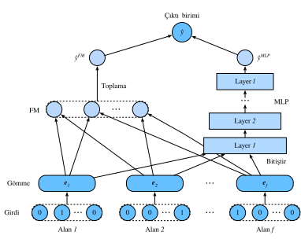

# Derin Çarpanlara Ayırma Makineleri

Etkili öznitelik kombinasyonlarını öğrenmek, tıklama oranı tahmini görevinin başarısı açısından kritik öneme sahiptir. Çarpanlara ayırma makineleri modeli, doğrusal kipte etkileşimleri içerir (örn. Çift doğrusal etkileşimler). Bu genellikle doğal öznitelik geçiş yapılarının genellikle çok karmaşık ve doğrusal olmayan olduğu gerçek dünya verileri için yetersizdir. Daha da kötüsü, ikinci dereceden öznitelik etkileşimleri genellikle pratikte çarpanlara ayırma makinelerinde kullanılır. Çarpanlara ayırma makineleriyle yüksek derecede öznitelik kombinasyonlarının modellenmesi teorik olarak mümkündür, ancak sayısal istikrarsızlık ve yüksek hesaplama karmaşıklığı nedeniyle genellikle kabul edilmez. 

Etkili bir çözüm derin sinir ağları kullanmaktır. Derin sinir ağları, öznitelik temsili öğrenmede güçlüdür ve gelişmiş öznitelik etkileşimlerini öğrenme potansiyeline sahiptir. Bu nedenle, derin sinir ağlarını çarpanlara ayırma makinelerine entegre etmek doğaldır. Çarpanlara ayırma makinelerine doğrusal olmayan dönüşüm katmanları eklenmesi, hem düşük mertebeden öznitelik kombinasyonlarını hem de yüksek mertebeden öznitelik kombinasyonlarını modelleme olanağı sağlar. Dahası, girdilerden doğrusal olmayan doğal yapılar da derin sinir ağları ile yakalanabilir. Bu bölümde FM ve derin sinir ağlarını birleştiren derin çarpanlara ayırma makineleri (DeepFM) :cite:`Guo.Tang.Ye.ea.2017` adlı temsili bir model sunacağız. 

## Model Mimarileri

DeepFM, bir FM bileşeninden ve paralel bir yapıya entegre edilmiş derin bir bileşenden oluşur. FM bileşeni, düşük mertebeden öznitelik etkileşimlerini modellemek için kullanılan 2 yönlü çarpanlara sahip makinelerle aynıdır. Derin bileşen, yüksek mertebeden öznitelik etkileşimleri ve doğrusal olmayan değerleri yakalamak için kullanılan bir MLP'dir. Bu iki bileşen aynı girdileri/gömmeleri paylaşır ve çıktıları nihai tahmin olarak toplanır. DeepFM özünün hem ezberlemeyi hem de genellemeyi yakalayabilen Wide \& Deep mimarisine benzediğini belirtmek gerekir. DeepFM'in Wide \& Deep modeline göre avantajları, öznitelik kombinasyonlarını otomatik olarak belirleyerek el yapımı öznitelik mühendisliğinin çabasını azaltmasıdır. 

Kısa olması için FM bileşeninin açıklamasını atlıyoruz ve çıktıyı $\hat{y}^{(FM)}$ olarak belirtiyoruz. Okuyucular daha fazla ayrıntı için son bölüme bakabilirler. $\mathbf{e}_i \in \mathbb{R}^{k}$, $i.$ alanın gizli öznitelik vektörünü göstersin. Derin bileşenin girdisi, seyrek kategorik öznitelik girdisi ile bakılan tüm alanların yoğun gömmelerinin bitiştirilmesiyle, şu şekilde gösterilir: 

$$
\mathbf{z}^{(0)}  = [\mathbf{e}_1, \mathbf{e}_2, ..., \mathbf{e}_f],
$$

burada $f$ alan sayısıdır. Daha sonra aşağıdaki sinir ağına beslenir: 

$$
\mathbf{z}^{(l)}  = \alpha(\mathbf{W}^{(l)}\mathbf{z}^{(l-1)} + \mathbf{b}^{(l)}),
$$

burada $\alpha$ etkinleştirme fonksiyonudur. $\mathbf{W}_{l}$ ve $\mathbf{b}_{l}$, $l.$ katmanındaki ağırlık ve ek girdidir. $y_{DNN}$ tahminin çıktısını göstersin. DeepFM'in nihai tahmini hem FM hem de DNN çıktılarının toplamıdır. Yani elimizde şu var: 

$$
\hat{y} = \sigma(\hat{y}^{(FM)} + \hat{y}^{(DNN)}),
$$

burada $\sigma$ sigmoid fonksiyonudur. DeepFM mimarisi aşağıda gösterilmiştir. , 

Derin sinir ağlarını FM ile birleştirmenin tek yolunun DeepFM olmadığını belirtmekte fayda var. Ayrıca öznitelik etkileşimleri üzerine doğrusal olmayan katmanlar ekleyebiliriz :cite:`He.Chua.2017`.

```{.python .input  n=2}
from d2l import mxnet as d2l
from mxnet import init, gluon, np, npx
from mxnet.gluon import nn
import os

npx.set_np()
```

## DeepFM Uygulaması 
DeepFM'in uygulanması FM ile benzerdir. FM kısmını değiştirmeden tutuyoruz ve etkinleştirme fonksiyonu olarak `relu` ile bir MLP bloğu kullanıyoruz. Hattan düşürme modeli düzenlileştirmek için de kullanılır. MLP nöronlarının sayısı `mlp_dims` hiper parametresi ile ayarlanabilir.

```{.python .input  n=2}
class DeepFM(nn.Block):
    def __init__(self, field_dims, num_factors, mlp_dims, drop_rate=0.1):
        super(DeepFM, self).__init__()
        num_inputs = int(sum(field_dims))
        self.embedding = nn.Embedding(num_inputs, num_factors)
        self.fc = nn.Embedding(num_inputs, 1)
        self.linear_layer = nn.Dense(1, use_bias=True)
        input_dim = self.embed_output_dim = len(field_dims) * num_factors
        self.mlp = nn.Sequential()
        for dim in mlp_dims:
            self.mlp.add(nn.Dense(dim, 'relu', True, in_units=input_dim))
            self.mlp.add(nn.Dropout(rate=drop_rate))
            input_dim = dim
        self.mlp.add(nn.Dense(in_units=input_dim, units=1))

    def forward(self, x):
        embed_x = self.embedding(x)
        square_of_sum = np.sum(embed_x, axis=1) ** 2
        sum_of_square = np.sum(embed_x ** 2, axis=1)
        inputs = np.reshape(embed_x, (-1, self.embed_output_dim))
        x = self.linear_layer(self.fc(x).sum(1)) \
            + 0.5 * (square_of_sum - sum_of_square).sum(1, keepdims=True) \
            + self.mlp(inputs)
        x = npx.sigmoid(x)
        return x
```

## Model Eğitimi ve Değerlendirilmesi 
Veri yükleme işlemi FM ile aynıdır. DeepFM'nin MLP bileşenini bir piramit yapısına sahip üç katmanlı yoğun bir ağa ayarladık (30-20-10). Diğer tüm hiper parametreler FM ile aynı kalır.

```{.python .input  n=4}
batch_size = 2048
data_dir = d2l.download_extract('ctr')
train_data = d2l.CTRDataset(os.path.join(data_dir, 'train.csv'))
test_data = d2l.CTRDataset(os.path.join(data_dir, 'test.csv'),
                           feat_mapper=train_data.feat_mapper,
                           defaults=train_data.defaults)
field_dims = train_data.field_dims
train_iter = gluon.data.DataLoader(
    train_data, shuffle=True, last_batch='rollover', batch_size=batch_size,
    num_workers=d2l.get_dataloader_workers())
test_iter = gluon.data.DataLoader(
    test_data, shuffle=False, last_batch='rollover', batch_size=batch_size,
    num_workers=d2l.get_dataloader_workers())
devices = d2l.try_all_gpus()
net = DeepFM(field_dims, num_factors=10, mlp_dims=[30, 20, 10])
net.initialize(init.Xavier(), ctx=devices)
lr, num_epochs, optimizer = 0.01, 30, 'adam'
trainer = gluon.Trainer(net.collect_params(), optimizer,
                        {'learning_rate': lr})
loss = gluon.loss.SigmoidBinaryCrossEntropyLoss()
d2l.train_ch13(net, train_iter, test_iter, loss, trainer, num_epochs, devices)
```

FM ile karşılaştırıldığında DeepFM daha hızlı yakınsar ve daha iyi performans sağlar. 

## Özet

* Sinir ağlarının FM'ye entegre edilmesi, karmaşık ve yüksek mertebeden etkileşimleri modellemesini sağlar.
* DeepFM, reklam veri kümelerinde orijinal FM'den daha iyi performans gösterir.

## Alıştırmalar

* Model performansı üzerindeki etkisini kontrol etmek için MLP yapısını değiştirin.
* Veri kümesini Criteo'ya değiştirin ve orijinal FM modeliyle karşılaştırın.

:begin_tab:`mxnet`
[Tartışmalar](https://discuss.d2l.ai/t/407)
:end_tab:
